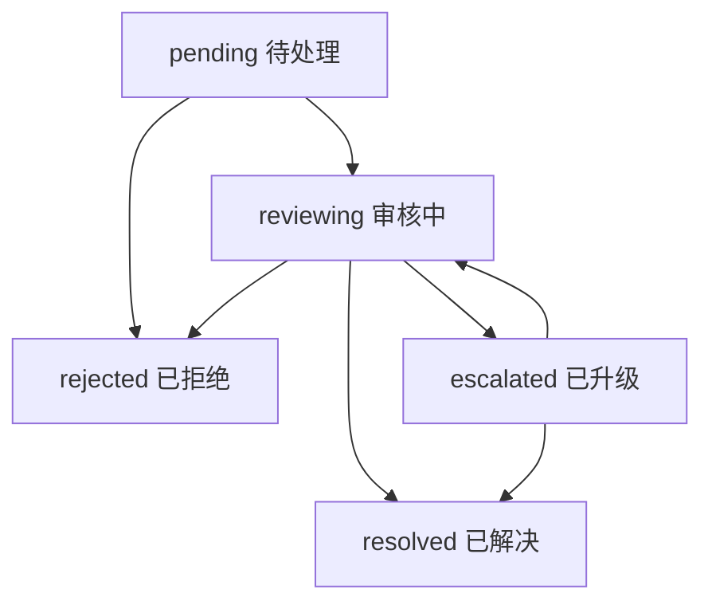

# 安全模块 API 文档

## 概述

安全模块提供平台内容安全管理、用户举报处理、访问控制等相关功能的API接口。

## 接口列表

### 内容举报管理
- [创建内容举报](#创建内容举报)
- [获取举报列表](#获取举报列表)
- [获取举报详情](#获取举报详情)
- [获取我的举报列表](#获取我的举报列表)
- [分配举报给审核员](#分配举报给审核员)
- [开始处理举报](#开始处理举报)
- [解决举报](#解决举报)
- [升级举报](#升级举报)
- [添加处理备注](#添加处理备注)
- [批量处理举报](#批量处理举报)
- [获取举报统计](#获取举报统计)
- [获取举报类型统计](#获取举报类型统计)
- [导出举报数据](#导出举报数据)

### 访问控制
- [获取访问记录](#获取访问记录)
- [访问权限验证](#访问权限验证)

---

## 内容举报管理 API

### 创建内容举报

用户举报平台上的不当内容。

**接口信息**
- **URL**: `POST /api/content-reports`
- **权限**: 登录用户
- **限流**: 15分钟内最多10次举报

**请求参数**

```json
{
  "reportType": "inappropriate_content",
  "contentType": "forum_post",
  "contentId": "帖子ID",
  "reason": "内容包含虚假医疗信息",
  "description": "该帖子声称某种食物可以治愈糖尿病，这是虚假医疗信息，可能误导用户",
  "severity": "high",
  "evidence": {
    "screenshots": [
      "https://example.com/screenshot1.jpg",
      "https://example.com/screenshot2.jpg"
    ],
    "attachments": [
      "https://example.com/evidence.pdf"
    ]
  }
}
```

**参数说明**

| 字段 | 类型 | 必填 | 说明 |
|------|------|------|------|
| reportType | string | ✓ | 举报类型 |
| contentType | string | ✓ | 内容类型 |
| contentId | string | ✓ | 内容ID |
| reason | string | ✓ | 举报原因 |
| description | string | - | 详细描述 |
| severity | string | - | 严重程度，默认medium |
| evidence | object | - | 证据材料 |

**举报类型 (reportType)**

| 值 | 说明 | 严重程度 |
|----|------|----------|
| inappropriate_content | 不当内容 | 中 |
| spam | 垃圾信息 | 低 |
| harassment | 骚扰 | 高 |
| hate_speech | 仇恨言论 | 高 |
| violence | 暴力内容 | 高 |
| adult_content | 成人内容 | 中 |
| copyright | 版权侵犯 | 中 |
| misinformation | 虚假信息 | 中 |
| privacy_violation | 隐私侵犯 | 高 |
| illegal_activity | 违法活动 | 高 |
| other | 其他 | 低 |

**内容类型 (contentType)**

| 值 | 说明 |
|----|------|
| forum_post | 论坛帖子 |
| forum_comment | 论坛评论 |
| review | 用户评价 |
| user_profile | 用户资料 |
| dish_description | 菜品描述 |
| store_info | 门店信息 |
| chat_message | 聊天消息 |

**响应示例**

```json
{
  "success": true,
  "message": "举报提交成功，我们会尽快处理",
  "data": {
    "reportId": "举报ID",
    "status": "pending",
    "priority": "high"
  },
  "timestamp": "2023-12-01T10:30:00.000Z"
}
```

**重复举报响应**

```json
{
  "success": false,
  "message": "您已举报过此内容，请等待处理结果",
  "data": {
    "existingReportId": "已存在的举报ID"
  },
  "timestamp": "2023-12-01T10:30:00.000Z"
}
```

---

### 获取举报列表

审核员或管理员获取待处理的举报列表。

**接口信息**
- **URL**: `GET /api/content-reports`
- **权限**: 管理员、审核员

**查询参数**

| 参数 | 类型 | 说明 |
|------|------|------|
| page | number | 页码，默认1 |
| limit | number | 每页数量，默认20 |
| status | string | 状态筛选 |
| reportType | string | 举报类型筛选 |
| priority | string | 优先级筛选 |
| assignedTo | string | 分配审核员筛选 |
| contentType | string | 内容类型筛选 |
| startDate | string | 开始日期 |
| endDate | string | 结束日期 |
| search | string | 搜索关键词 |

**举报状态 (status)**

| 值 | 说明 |
|----|------|
| pending | 待处理 |
| reviewing | 审核中 |
| resolved | 已解决 |
| rejected | 已拒绝 |
| escalated | 已升级 |

**优先级 (priority)**

| 值 | 说明 |
|----|------|
| low | 低 |
| normal | 普通 |
| high | 高 |
| urgent | 紧急 |

**响应示例**

```json
{
  "success": true,
  "data": {
    "reports": [
      {
        "id": "举报ID",
        "reportType": "inappropriate_content",
        "reportedContent": {
          "contentType": "forum_post",
          "contentId": "帖子ID",
          "contentTitle": "帖子标题",
          "contentAuthorId": "作者ID"
        },
        "reporter": {
          "userId": "举报者ID",
          "username": "举报者用户名",
          "isAnonymous": false
        },
        "reportDetails": {
          "reason": "内容包含虚假医疗信息",
          "severity": "high"
        },
        "status": "pending",
        "priority": "high",
        "processing": {
          "assignedTo": null,
          "assignedAt": null,
          "result": null
        },
        "createdAt": "2023-12-01T10:30:00.000Z",
        "relatedReports": 2
      }
    ],
    "pagination": {
      "page": 1,
      "limit": 20,
      "total": 25,
      "pages": 2
    }
  },
  "timestamp": "2023-12-01T11:00:00.000Z"
}
```

---

### 获取举报详情

获取指定举报的详细信息。

**接口信息**
- **URL**: `GET /api/content-reports/{reportId}`
- **权限**: 管理员、分配的审核员

**路径参数**
- `reportId` (string): 举报ID

**响应示例**

```json
{
  "success": true,
  "data": {
    "id": "举报ID",
    "reportType": "inappropriate_content",
    "reportedContent": {
      "contentType": "forum_post",
      "contentId": "帖子ID",
      "contentTitle": "关于某种神奇食物的功效",
      "contentSnapshot": {
        "text": "这种食物可以治愈糖尿病...",
        "images": ["图片URL1", "图片URL2"],
        "metadata": {
          "tags": ["健康", "食疗"],
          "views": 1250
        }
      },
      "contentAuthorId": "作者ID",
      "contentCreatedAt": "2023-11-30T15:20:00.000Z"
    },
    "reporter": {
      "userId": "举报者ID",
      "username": "user123",
      "email": "user@example.com",
      "ipAddress": "192.168.1.100",
      "deviceInfo": {
        "userAgent": "Mozilla/5.0...",
        "deviceType": "mobile",
        "platform": "iOS"
      },
      "isAnonymous": false
    },
    "reportDetails": {
      "reason": "内容包含虚假医疗信息",
      "description": "该帖子声称某种食物可以治愈糖尿病，这是虚假医疗信息",
      "evidence": {
        "screenshots": ["截图URL1", "截图URL2"],
        "attachments": ["附件URL1"]
      },
      "severity": "high"
    },
    "status": "reviewing",
    "priority": "high",
    "processing": {
      "assignedTo": {
        "_id": "审核员ID",
        "username": "moderator1",
        "email": "mod@example.com"
      },
      "assignedAt": "2023-12-01T09:00:00.000Z",
      "startedAt": "2023-12-01T09:15:00.000Z",
      "completedAt": null,
      "result": null,
      "resultReason": null,
      "processingNotes": "已开始调查相关内容的真实性",
      "requiresEscalation": false
    },
    "autoDetection": {
      "isAutoDetected": false,
      "detectionModel": null,
      "confidenceScore": null,
      "detectedIssues": [],
      "detectionDetails": null
    },
    "relatedReports": [
      {
        "reportId": "相关举报ID1",
        "similarity": 0.8,
        "reason": "相同内容的其他举报"
      }
    ],
    "history": [
      {
        "action": "created",
        "timestamp": "2023-12-01T08:30:00.000Z",
        "operator": "举报者ID",
        "details": "举报创建"
      },
      {
        "action": "assigned",
        "timestamp": "2023-12-01T09:00:00.000Z",
        "operator": "管理员ID",
        "details": "分配给审核员: moderator1"
      },
      {
        "action": "status_changed",
        "timestamp": "2023-12-01T09:15:00.000Z",
        "operator": "审核员ID",
        "details": "开始处理举报",
        "oldValue": "pending",
        "newValue": "reviewing"
      }
    ],
    "location": {
      "country": "中国",
      "region": "广东省",
      "city": "深圳市"
    },
    "createdAt": "2023-12-01T08:30:00.000Z",
    "updatedAt": "2023-12-01T09:15:00.000Z"
  },
  "timestamp": "2023-12-01T11:00:00.000Z"
}
```

---

### 获取我的举报列表

用户查看自己提交的举报列表。

**接口信息**
- **URL**: `GET /api/content-reports/my-reports`
- **权限**: 登录用户

**查询参数**
- `page` (number): 页码，默认1
- `limit` (number): 每页数量，默认20
- `status` (string): 状态筛选

**响应示例**

```json
{
  "success": true,
  "data": {
    "reports": [
      {
        "id": "举报ID",
        "reportType": "spam",
        "contentType": "forum_comment",
        "reason": "垃圾广告信息",
        "status": "resolved",
        "result": "content_removed",
        "createdAt": "2023-11-25T10:30:00.000Z",
        "resolvedAt": "2023-11-26T15:20:00.000Z"
      },
      {
        "id": "举报ID2",
        "reportType": "inappropriate_content",
        "contentType": "forum_post",
        "reason": "内容不当",
        "status": "reviewing",
        "result": null,
        "createdAt": "2023-12-01T08:30:00.000Z",
        "resolvedAt": null
      }
    ],
    "pagination": {
      "page": 1,
      "limit": 20,
      "total": 5,
      "pages": 1
    }
  },
  "timestamp": "2023-12-01T11:00:00.000Z"
}
```

---

### 分配举报给审核员

管理员将举报分配给指定的审核员处理。

**接口信息**
- **URL**: `POST /api/content-reports/{reportId}/assign`
- **权限**: 管理员

**路径参数**
- `reportId` (string): 举报ID

**请求参数**

```json
{
  "assigneeId": "审核员ID"
}
```

**响应示例**

```json
{
  "success": true,
  "message": "举报分配成功",
  "data": {
    "assignedTo": "张审核员",
    "assignedAt": "2023-12-01T11:00:00.000Z"
  },
  "timestamp": "2023-12-01T11:00:00.000Z"
}
```

---

### 开始处理举报

审核员开始处理被分配的举报。

**接口信息**
- **URL**: `POST /api/content-reports/{reportId}/start-processing`
- **权限**: 管理员、分配的审核员

**响应示例**

```json
{
  "success": true,
  "message": "已开始处理举报",
  "data": {
    "status": "reviewing",
    "startedAt": "2023-12-01T11:05:00.000Z"
  },
  "timestamp": "2023-12-01T11:05:00.000Z"
}
```

---

### 解决举报

审核员完成举报处理并给出处理结果。

**接口信息**
- **URL**: `POST /api/content-reports/{reportId}/resolve`
- **权限**: 管理员、分配的审核员

**请求参数**

```json
{
  "result": "content_hidden",
  "resultReason": "内容确实包含虚假医疗信息，已隐藏处理",
  "processingNotes": "已联系内容发布者，要求提供相关医学证据支撑，如无法提供将永久删除"
}
```

**处理结果类型 (result)**

| 值 | 说明 | 影响 |
|----|------|------|
| no_action | 无需处理 | 无影响，举报不成立 |
| content_warning | 内容警告 | 内容添加警告标签 |
| content_hidden | 隐藏内容 | 内容对用户不可见 |
| content_removed | 删除内容 | 内容永久删除 |
| user_warned | 警告用户 | 向用户发送警告通知 |
| user_suspended | 暂停用户 | 用户账号临时禁用 |
| user_banned | 封禁用户 | 用户账号永久禁用 |

**响应示例**

```json
{
  "success": true,
  "message": "举报处理完成",
  "data": {
    "result": "content_hidden",
    "resultReason": "内容确实包含虚假医疗信息，已隐藏处理",
    "completedAt": "2023-12-01T11:30:00.000Z"
  },
  "timestamp": "2023-12-01T11:30:00.000Z"
}
```

---

### 升级举报

将复杂或争议性的举报升级到高级审核员处理。

**接口信息**
- **URL**: `POST /api/content-reports/{reportId}/escalate`
- **权限**: 管理员、审核员

**请求参数**

```json
{
  "reason": "涉及法律争议，需要高级审核员判断"
}
```

**响应示例**

```json
{
  "success": true,
  "message": "举报已升级处理",
  "data": {
    "status": "escalated",
    "priority": "urgent"
  },
  "timestamp": "2023-12-01T11:20:00.000Z"
}
```

---

### 添加处理备注

审核员在处理过程中添加备注信息。

**接口信息**
- **URL**: `POST /api/content-reports/{reportId}/notes`
- **权限**: 管理员、分配的审核员
- **限流**: 1分钟内最多30次

**请求参数**

```json
{
  "note": "已联系相关医学专家咨询，等待专业意见"
}
```

**响应示例**

```json
{
  "success": true,
  "message": "备注添加成功",
  "timestamp": "2023-12-01T11:15:00.000Z"
}
```

---

### 批量处理举报

批量处理多个举报，提高处理效率。

**接口信息**
- **URL**: `POST /api/content-reports/batch/process`
- **权限**: 管理员、审核员
- **限流**: 5分钟内最多10次

**请求参数**

```json
{
  "reportIds": [
    "举报ID1",
    "举报ID2",
    "举报ID3"
  ],
  "action": "resolve",
  "actionData": {
    "result": "no_action",
    "resultReason": "经审核，内容符合平台规范",
    "processingNotes": "批量处理：内容审核通过"
  }
}
```

**批量操作类型 (action)**

| 值 | 说明 |
|----|------|
| assign | 批量分配 |
| resolve | 批量解决 |
| escalate | 批量升级 |

**响应示例**

```json
{
  "success": true,
  "message": "批量resolve完成，成功2个",
  "data": {
    "results": [
      {
        "reportId": "举报ID1",
        "success": true,
        "message": "举报处理完成"
      },
      {
        "reportId": "举报ID2",
        "success": true,
        "message": "举报处理完成"
      },
      {
        "reportId": "举报ID3",
        "success": false,
        "error": "举报已被其他审核员处理"
      }
    ],
    "summary": {
      "total": 3,
      "success": 2,
      "failed": 1
    }
  },
  "timestamp": "2023-12-01T11:40:00.000Z"
}
```

---

### 获取举报统计

获取举报处理的统计数据。

**接口信息**
- **URL**: `GET /api/content-reports/stats/overview`
- **权限**: 管理员、审核员

**查询参数**
- `startDate` (string): 开始日期
- `endDate` (string): 结束日期
- `reportType` (string): 举报类型筛选
- `assigneeId` (string): 审核员ID筛选

**响应示例**

```json
{
  "success": true,
  "data": {
    "overview": {
      "total": 150,
      "pending": 25,
      "reviewing": 15,
      "resolved": 105,
      "resolutionRate": "70.00"
    },
    "processingStats": {
      "resolved_no_action": {
        "count": 60,
        "avgProcessingTime": 2
      },
      "resolved_content_hidden": {
        "count": 30,
        "avgProcessingTime": 4
      },
      "resolved_content_removed": {
        "count": 15,
        "avgProcessingTime": 6
      }
    }
  },
  "timestamp": "2023-12-01T11:00:00.000Z"
}
```

---

### 获取举报类型统计

获取各类型举报的分布统计。

**接口信息**
- **URL**: `GET /api/content-reports/stats/types`
- **权限**: 管理员、审核员

**响应示例**

```json
{
  "success": true,
  "data": {
    "typeStats": [
      {
        "reportType": "spam",
        "count": 45,
        "percentage": 30.0,
        "avgProcessingTime": 2,
        "resolutionRate": 95.6
      },
      {
        "reportType": "inappropriate_content",
        "count": 38,
        "percentage": 25.3,
        "avgProcessingTime": 4,
        "resolutionRate": 84.2
      },
      {
        "reportType": "harassment",
        "count": 25,
        "percentage": 16.7,
        "avgProcessingTime": 6,
        "resolutionRate": 88.0
      }
    ],
    "contentTypeStats": [
      {
        "contentType": "forum_post",
        "count": 60,
        "percentage": 40.0
      },
      {
        "contentType": "forum_comment",
        "count": 45,
        "percentage": 30.0
      },
      {
        "contentType": "review",
        "count": 30,
        "percentage": 20.0
      }
    ]
  },
  "timestamp": "2023-12-01T11:00:00.000Z"
}
```

---

### 导出举报数据

导出举报数据用于分析和存档。

**接口信息**
- **URL**: `GET /api/content-reports/export/data`
- **权限**: 管理员
- **限流**: 1小时内最多5次

**查询参数**
- `startDate` (string): 开始日期
- `endDate` (string): 结束日期
- `status` (string): 状态筛选
- `format` (string): 导出格式，可选值：json、csv，默认json

**CSV格式响应**

当`format=csv`时，返回CSV文件下载：

```
Content-Type: text/csv
Content-Disposition: attachment; filename=content_reports.csv

id,reportType,contentType,reporterUsername,status,priority,reason,createdAt,assignedTo
report_1,spam,forum_comment,user123,resolved,low,"垃圾广告",2023-12-01T08:30:00.000Z,moderator1
report_2,inappropriate_content,forum_post,user456,reviewing,high,"虚假信息",2023-12-01T09:15:00.000Z,moderator2
```

**JSON格式响应**

```json
{
  "success": true,
  "data": {
    "reports": [
      {
        "id": "举报ID",
        "reportType": "spam",
        "reportedContent": {
          "contentType": "forum_comment",
          "contentAuthorId": "作者ID"
        },
        "reporter": {
          "username": "user123",
          "isAnonymous": false
        },
        "status": "resolved",
        "priority": "low",
        "createdAt": "2023-12-01T08:30:00.000Z",
        "processing": {
          "assignedTo": {
            "username": "moderator1"
          },
          "result": "content_removed"
        }
      }
    ]
  },
  "timestamp": "2023-12-01T11:00:00.000Z"
}
```

---

## 访问控制 API

### 获取访问记录

获取系统访问记录用于安全审计。

**接口信息**
- **URL**: `GET /api/access-track`
- **权限**: 管理员

**查询参数**
- `userId` (string): 用户ID筛选
- `action` (string): 操作类型筛选
- `startDate` (string): 开始日期
- `endDate` (string): 结束日期
- `page` (number): 页码，默认1
- `limit` (number): 每页数量，默认20

**响应示例**

```json
{
  "success": true,
  "data": {
    "records": [
      {
        "id": "记录ID",
        "userId": "用户ID",
        "username": "用户名",
        "action": "login",
        "resource": "/api/auth/login",
        "ipAddress": "192.168.1.100",
        "userAgent": "Mozilla/5.0...",
        "timestamp": "2023-12-01T10:30:00.000Z",
        "result": "success"
      }
    ],
    "pagination": {
      "page": 1,
      "limit": 20,
      "total": 500,
      "pages": 25
    }
  },
  "timestamp": "2023-12-01T11:00:00.000Z"
}
```

---

## 通用错误响应

### 内容举报相关错误

| 状态码 | 错误信息 | 说明 |
|--------|----------|------|
| 400 | 举报类型、内容类型、内容ID和举报原因不能为空 | 必填参数缺失 |
| 400 | 您已举报过此内容，请等待处理结果 | 重复举报同一内容 |
| 403 | 无权限查看举报列表 | 用户权限不足 |
| 403 | 只有分配的处理者可以解决此举报 | 权限验证失败 |
| 404 | 举报记录不存在 | 指定的举报ID不存在 |
| 429 | 举报过于频繁，请稍后再试 | 触发频率限制 |

### 处理状态验证错误

| 状态码 | 错误信息 | 说明 |
|--------|----------|------|
| 400 | 只能解决正在审核的举报 | 举报状态不符合要求 |
| 400 | 处理结果不能为空 | 缺少必要的处理结果 |
| 400 | 处理原因不能为空 | 缺少处理原因说明 |
| 400 | 已处理的举报无法升级 | 业务逻辑错误 |

---

## 业务流程说明

### 举报处理完整流程

1. **用户举报** → 提交举报信息
2. **自动检测** → 系统自动分析举报内容
3. **优先级计算** → 根据举报类型和严重程度计算优先级
4. **分配审核员** → 管理员分配或自动分配审核员
5. **开始处理** → 审核员开始调查和处理
6. **添加备注** → 处理过程中记录备注信息
7. **处理决策** → 做出处理决定
8. **执行操作** → 对内容或用户执行相应操作
9. **通知相关方** → 通知举报者和内容作者
10. **记录归档** → 完整记录处理过程

### 举报状态流转



### 优先级自动计算

```javascript
// 优先级计算算法
let priorityScore = 0;

// 举报类型权重
const typeScores = {
  'violence': 3, 'hate_speech': 3, 'illegal_activity': 3,
  'adult_content': 2, 'harassment': 2,
  'inappropriate_content': 1, 'spam': 1,
  'other': 0
};

// 严重程度权重
const severityScores = {
  'critical': 3, 'high': 2, 'medium': 1, 'low': 0
};

// 相关举报数量加权
priorityScore += Math.min(relatedReports.length, 3);

// 最终优先级
if (priorityScore >= 6) priority = 'urgent';
else if (priorityScore >= 4) priority = 'high';
else if (priorityScore >= 2) priority = 'normal';
else priority = 'low';
```

---

## 注意事项

1. **隐私保护**: 举报者信息需要适当保护，避免报复
2. **处理时效**: 高优先级举报应在24小时内处理
3. **证据保全**: 举报时的内容快照用于证据保全
4. **透明度**: 处理结果要及时通知相关方
5. **审计追踪**: 所有处理操作都有完整的审计记录
6. **误报处理**: 建立误报申诉机制
7. **自动化**: 明显的垃圾信息可以自动处理
8. **培训**: 审核员需要定期培训以保证处理质量