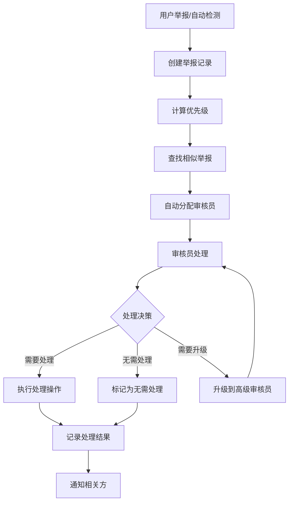

# 内容举报模型 (ContentReport Model)

## 概述

内容举报模型用于管理用户对平台内容的举报投诉，支持多种内容类型的举报、自动检测、人工审核、处理追踪等功能，确保平台内容的健康和安全。

## 业务场景

- 用户举报不当内容
- 自动检测违规内容
- 审核员处理举报
- 内容处理决策执行
- 举报数据统计分析
- 内容安全监控

## 数据结构

### 主要字段

| 字段名 | 类型 | 必填 | 默认值 | 说明 |
|--------|------|------|--------|------|
| reportType | String | ✓ | - | 举报类型 |
| reportedContent | Object | ✓ | - | 被举报内容信息 |
| reporter | Object | ✓ | - | 举报者信息 |
| reportDetails | Object | ✓ | - | 举报详情 |
| status | String | - | pending | 处理状态 |
| processing | Object | - | - | 处理信息 |
| autoDetection | Object | - | - | 自动检测信息 |
| relatedReports | Array | - | [] | 相关举报 |
| history | Array | - | [] | 处理历史 |
| priority | String | - | normal | 优先级 |
| tags | Array | - | [] | 标签 |
| location | Object | - | - | 地理位置信息 |
| isDeleted | Boolean | - | false | 是否已删除 |

### 举报类型 (reportType)

| 类型 | 说明 | 严重程度 |
|------|------|----------|
| inappropriate_content | 不当内容 | 中 |
| spam | 垃圾信息 | 低 |
| harassment | 骚扰 | 高 |
| hate_speech | 仇恨言论 | 高 |
| violence | 暴力内容 | 高 |
| adult_content | 成人内容 | 中 |
| copyright | 版权侵犯 | 中 |
| misinformation | 虚假信息 | 中 |
| privacy_violation | 隐私侵犯 | 高 |
| illegal_activity | 违法活动 | 高 |
| other | 其他 | 低 |

### 被举报内容信息 (reportedContent)

```javascript
{
  contentType: String,        // 内容类型：forum_post/forum_comment/review/user_profile/dish_description/store_info/chat_message
  contentId: ObjectId,        // 内容ID
  contentTitle: String,       // 内容标题/摘要
  contentSnapshot: {          // 内容快照
    text: String,             // 文本内容
    images: [String],         // 图片URLs
    metadata: Mixed           // 其他元数据
  },
  contentAuthorId: ObjectId,  // 内容创建者ID
  contentCreatedAt: Date      // 内容创建时间
}
```

### 举报者信息 (reporter)

```javascript
{
  userId: ObjectId,           // 举报者用户ID
  ipAddress: String,          // IP地址
  deviceInfo: {               // 设备信息
    userAgent: String,        // 用户代理
    deviceType: String,       // 设备类型
    platform: String          // 平台
  },
  isAnonymous: Boolean        // 是否匿名举报
}
```

### 举报详情 (reportDetails)

```javascript
{
  reason: String,             // 举报原因描述
  description: String,        // 详细问题描述
  evidence: {                 // 证据材料
    screenshots: [String],    // 截图URLs
    attachments: [String]     // 附件URLs
  },
  severity: String            // 严重程度：low/medium/high/critical
}
```

### 处理信息 (processing)

```javascript
{
  assignedTo: ObjectId,       // 分配的审核员ID
  assignedAt: Date,           // 分配时间
  startedAt: Date,            // 开始处理时间
  completedAt: Date,          // 完成处理时间
  result: String,             // 处理结果
  resultReason: String,       // 处理说明
  processingNotes: String,    // 处理备注
  requiresEscalation: Boolean // 是否需要上级审核
}
```

### 处理结果类型 (processing.result)

| 结果 | 说明 | 影响 |
|------|------|------|
| no_action | 无需处理 | 无 |
| content_warning | 内容警告 | 添加警告标签 |
| content_hidden | 隐藏内容 | 内容不可见 |
| content_removed | 删除内容 | 永久删除 |
| user_warned | 警告用户 | 发送警告通知 |
| user_suspended | 暂停用户 | 临时禁用账号 |
| user_banned | 封禁用户 | 永久禁用账号 |

### 自动检测信息 (autoDetection)

```javascript
{
  isAutoDetected: Boolean,    // 是否自动检测
  detectionModel: String,     // 检测模型名称
  confidenceScore: Number,    // 置信度分数（0-1）
  detectedIssues: [String],   // 检测到的问题类型
  detectionDetails: Mixed     // 检测结果详情
}
```

### 相关举报 (relatedReports)

```javascript
[{
  reportId: ObjectId,         // 相关举报ID
  similarity: Number,         // 相似度分数
  reason: String              // 关联原因
}]
```

### 处理历史 (history)

```javascript
[{
  action: String,             // 操作类型：created/assigned/status_changed/escalated/resolved/note_added
  timestamp: Date,            // 操作时间
  operator: ObjectId,         // 操作者ID
  details: String,            // 操作详情
  oldValue: String,           // 旧值
  newValue: String            // 新值
}]
```

## 索引设计

### 主要索引

```javascript
// 主键索引
{ _id: 1 }

// 状态、优先级和时间复合索引
{ status: 1, priority: -1, createdAt: -1 }

// 被举报内容复合索引
{ 'reportedContent.contentType': 1, 'reportedContent.contentId': 1 }

// 内容作者和状态复合索引
{ 'reportedContent.contentAuthorId': 1, status: 1 }

// 举报者和时间复合索引
{ 'reporter.userId': 1, createdAt: -1 }

// 分配审核员和状态复合索引
{ 'processing.assignedTo': 1, status: 1 }

// 举报类型、状态和时间复合索引
{ reportType: 1, status: 1, createdAt: -1 }
```

### 性能考量

- 状态索引支持快速筛选待处理举报
- 内容索引支持查找相同内容的举报
- 审核员索引优化工作分配
- 时间索引支持统计分析

## 静态方法

### `createReport(reportData)`

创建举报记录。

**参数：**
- `reportData` (Object): 举报数据

**功能：**
- 获取被举报内容快照
- 查找相似举报
- 自动计算优先级
- 创建举报记录

**返回：** Promise\<ContentReport\>

### `getContentSnapshot(contentType, contentId)`

获取内容快照。

**参数：**
- `contentType` (String): 内容类型
- `contentId` (ObjectId): 内容ID

**支持的内容类型：**
- `forum_post` - 论坛帖子
- `forum_comment` - 论坛评论
- `review` - 用户评价
- `user_profile` - 用户资料
- `dish_description` - 菜品描述
- `store_info` - 门店信息
- `chat_message` - 聊天消息

**返回：** Promise\<Object\>

### `getProcessingStats(options)`

获取处理统计。

**参数：**
- `options` (Object): 查询选项
  - `startDate` (Date): 开始日期
  - `endDate` (Date): 结束日期
  - `assigneeId` (ObjectId): 审核员ID
  - `reportType` (String): 举报类型

**返回：** Promise\<Array\>

## 实例方法

### `findSimilarReports()`

查找相似举报。

**匹配规则：**
- 相同内容的其他举报
- 相同举报者的历史举报
- 相似问题描述的举报

**返回：** Promise\<void\>

### `calculatePriority()`

计算优先级。

**优先级算法：**
```javascript
let priorityScore = 0;

// 基于举报类型
const typeScores = {
  'violence': 3,
  'hate_speech': 3,
  'illegal_activity': 3,
  'adult_content': 2,
  'harassment': 2,
  'inappropriate_content': 1,
  'spam': 1,
  'other': 0
};
priorityScore += typeScores[reportType] || 0;

// 基于严重程度
const severityScores = {
  'critical': 3,
  'high': 2,
  'medium': 1,
  'low': 0
};
priorityScore += severityScores[severity] || 0;

// 基于相关举报数量
priorityScore += Math.min(relatedReports.length, 3);

// 设置最终优先级
if (priorityScore >= 6) priority = 'urgent';
else if (priorityScore >= 4) priority = 'high';
else if (priorityScore >= 2) priority = 'normal';
else priority = 'low';
```

### `assignTo(assigneeId, assignerId)`

分配给审核员。

**参数：**
- `assigneeId` (ObjectId): 被分配者ID
- `assignerId` (ObjectId): 分配者ID

**返回：** Promise\<ContentReport\>

### `startProcessing(processerId)`

开始处理举报。

**参数：**
- `processerId` (ObjectId): 处理者ID

**返回：** Promise\<ContentReport\>

### `resolve(result, resultReason, processerId, processingNotes)`

解决举报。

**参数：**
- `result` (String): 处理结果
- `resultReason` (String): 处理原因
- `processerId` (ObjectId): 处理者ID
- `processingNotes` (String): 处理备注

**返回：** Promise\<ContentReport\>

### `escalate(reason, operatorId)`

升级举报。

**参数：**
- `reason` (String): 升级原因
- `operatorId` (ObjectId): 操作者ID

**返回：** Promise\<ContentReport\>

### `addNote(note, operatorId)`

添加处理备注。

**参数：**
- `note` (String): 备注内容
- `operatorId` (ObjectId): 操作者ID

**返回：** Promise\<ContentReport\>

## 数据验证

### 自动验证

- 举报类型必须在预定义范围内
- 严重程度等级验证
- 内容快照完整性检查
- 处理状态流转合法性

### 业务规则

- 同一用户对同一内容24小时内只能举报一次
- 处理结果必须有对应的原因说明
- 升级的举报优先级自动提升
- 自动检测的举报需要人工确认

## 使用示例

### 创建举报

```javascript
const reportData = {
  reportType: 'inappropriate_content',
  contentType: 'forum_post',
  contentId: post._id,
  reason: '内容包含不当信息',
  description: '该帖子包含虚假医疗信息',
  severity: 'high'
};

const report = await ContentReport.createReport(reportData, reporterId, {
  ipAddress: '192.168.1.1',
  userAgent: 'Mozilla/5.0...'
});
```

### 分配审核员

```javascript
const report = await ContentReport.findById(reportId);
await report.assignTo(moderatorId, adminId);
```

### 处理举报

```javascript
// 开始处理
await report.startProcessing(moderatorId);

// 添加备注
await report.addNote('需要进一步调查用户历史行为', moderatorId);

// 解决举报
await report.resolve(
  'content_hidden',
  '内容确实包含不当信息，已隐藏处理',
  moderatorId,
  '同时已对用户发出警告'
);
```

### 自动检测集成

```javascript
// 创建自动检测举报
const autoReport = await ContentReport.createReport({
  reportType: 'spam',
  contentType: 'forum_comment',
  contentId: comment._id,
  reason: '系统检测到垃圾信息',
  severity: 'medium'
}, 'system', {
  enableAutoDetection: true
});

// 设置检测结果
autoReport.autoDetection = {
  isAutoDetected: true,
  detectionModel: 'spam_classifier_v2',
  confidenceScore: 0.92,
  detectedIssues: ['spam_keywords', 'suspicious_links'],
  detectionDetails: {
    spamScore: 0.92,
    detectedKeywords: ['免费', '点击', '立即']
  }
};
await autoReport.save();
```

### 获取统计数据

```javascript
const stats = await ContentReport.getProcessingStats({
  startDate: new Date('2023-01-01'),
  endDate: new Date('2023-12-31'),
  assigneeId: moderatorId
});

console.log('处理统计:', stats);
```

## 工作流程

### 举报处理流程



### 状态流转

```
pending → reviewing → resolved
   ↓         ↓         ↑
   ↓      escalated → ↑
   ↓         ↓         ↑
   → → → rejected ← ← ←
```

## 关联关系

### 多对一关系

- `reporter.userId` → User (举报者)
- `reportedContent.contentAuthorId` → User (内容作者)
- `processing.assignedTo` → User (审核员)
- `relatedReports.reportId` → ContentReport (相关举报)

### 业务关联

- 与内容管理系统集成
- 与用户管理系统联动
- 与通知系统对接
- 与审计日志关联

## 安全考虑

1. **隐私保护**：举报者信息脱敏处理
2. **防恶意举报**：频率限制和行为分析
3. **数据完整性**：内容快照防篡改
4. **权限控制**：审核员权限严格管理

## 性能优化

1. **索引优化**：合理的复合索引设计
2. **分页查询**：大量举报的分页处理
3. **缓存策略**：热点举报数据缓存
4. **异步处理**：耗时操作异步执行

## 监控告警

1. **异常举报量**：监控举报数量异常增长
2. **处理时效**：监控举报处理时间过长
3. **自动检测准确率**：监控误报率
4. **审核员工作量**：监控审核员工作负载

## 注意事项

1. **及时处理**：高优先级举报要及时处理
2. **处理记录**：完整的处理过程记录
3. **用户反馈**：处理结果要及时通知用户
4. **持续改进**：根据处理效果优化规则
5. **法律合规**：确保处理方式符合相关法规