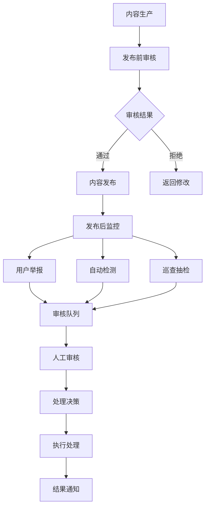
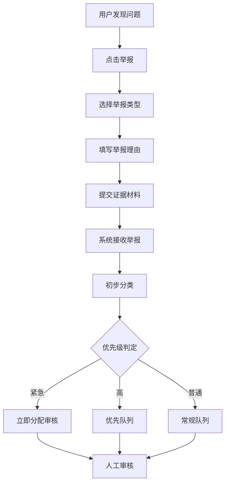
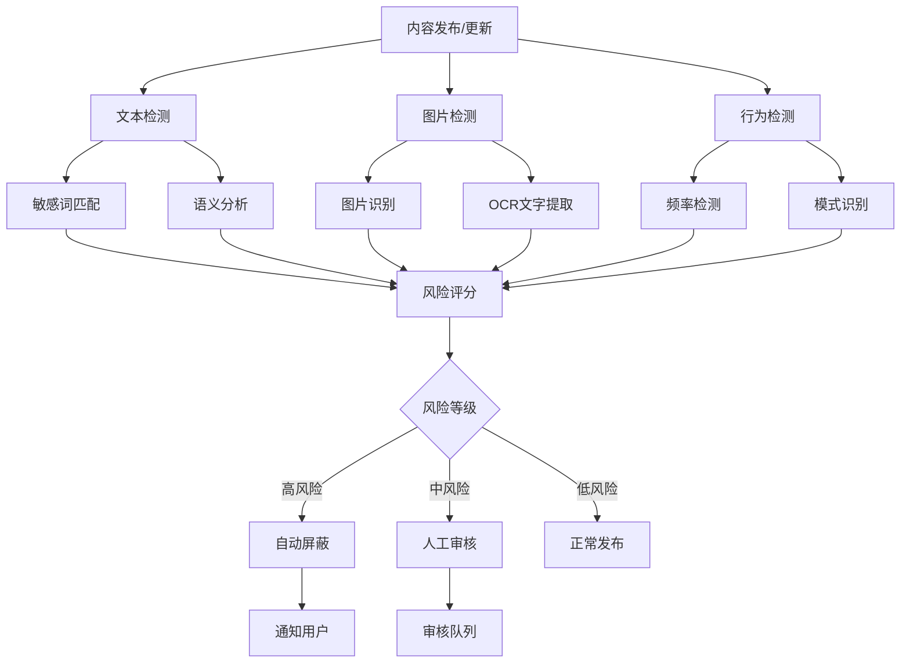
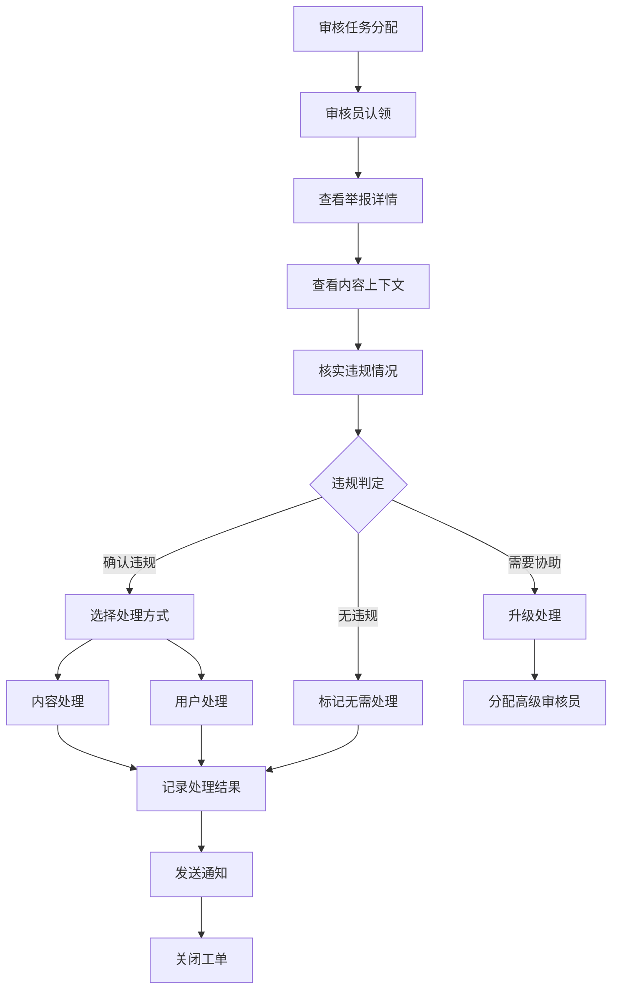
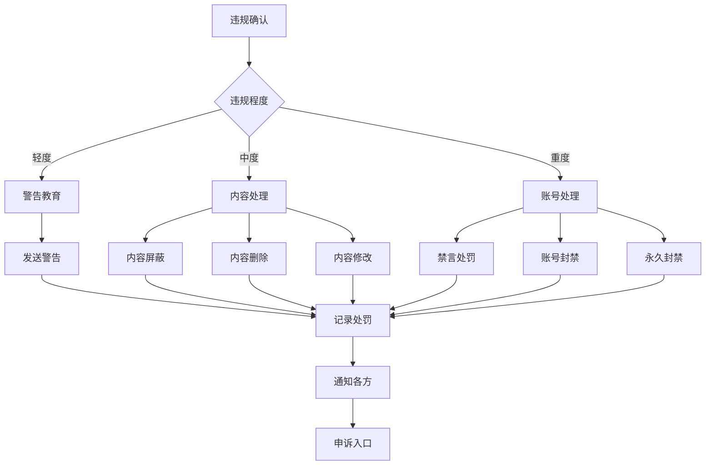
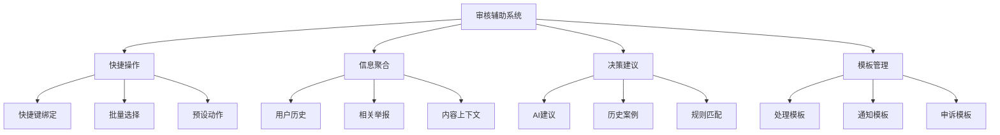
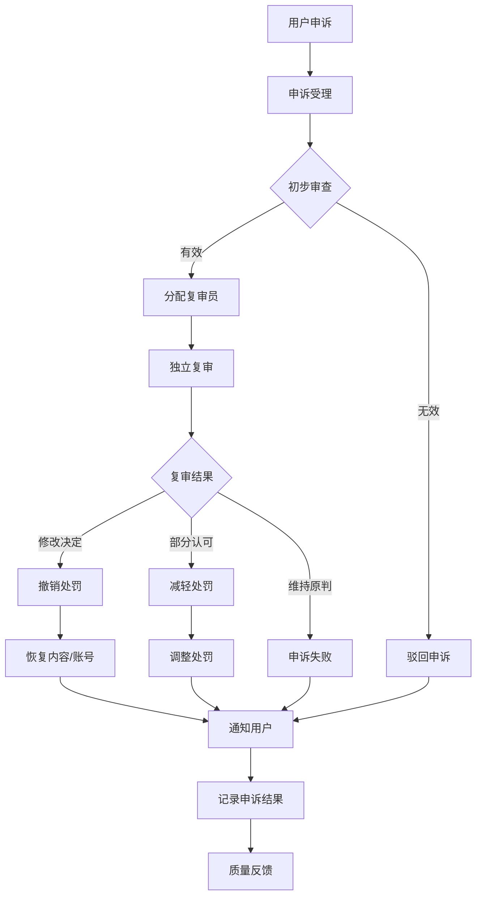
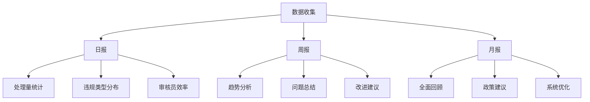
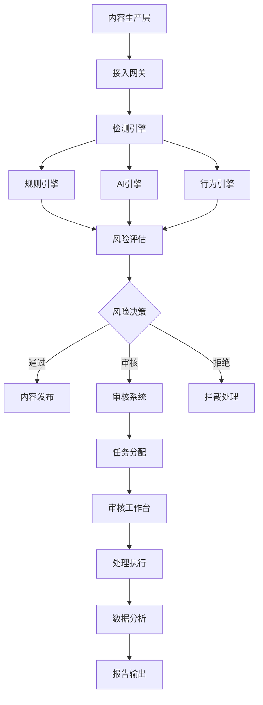
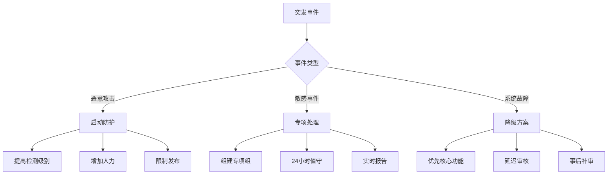

# 内容安全审核流程

## 概述

内容安全审核是维护平台健康生态的关键环节。通过用户举报、自动检测、人工审核的多层防护机制，及时发现和处理违规内容，保护用户权益，营造安全、健康的社区环境。

## 业务目标

- **内容安全**: 及时发现和处理违规内容
- **用户保护**: 保护用户免受不良内容侵害
- **法规合规**: 符合相关法律法规要求
- **社区氛围**: 维护积极健康的社区氛围
- **品牌形象**: 保护平台品牌声誉

## 审核体系架构



## 内容分类与风险等级

### 1. 内容类型分类

| 内容类型 | 说明 | 审核重点 | 风险等级 |
|----------|------|----------|----------|
| 论坛帖子 | 用户发表的主题内容 | 标题、正文、图片 | 高 |
| 评论回复 | 对帖子或商品的评论 | 文字内容、表情 | 中 |
| 用户资料 | 个人信息、签名等 | 昵称、头像、简介 | 中 |
| 商品评价 | 对菜品的评价 | 评价内容、图片 | 中 |
| 私信聊天 | 用户间私信 | 文字、图片、链接 | 高 |
| 营养建议 | 营养师的建议内容 | 医疗相关信息 | 极高 |

### 2. 违规类型定义

```javascript
const violationTypes = {
  // 严重违规（立即处理）
  severe: {
    illegal_content: '违法违规内容',
    violence_terror: '暴力恐怖内容',
    pornography: '色情低俗内容',
    gambling_fraud: '赌博诈骗信息',
    drugs_related: '毒品相关内容',
    political_sensitive: '政治敏感信息'
  },
  
  // 中度违规（优先处理）
  moderate: {
    harassment: '人身攻击谩骂',
    false_information: '虚假信息谣言',
    privacy_violation: '侵犯他人隐私',
    inappropriate_marketing: '不当营销推广',
    medical_misinformation: '虚假医疗信息'
  },
  
  // 轻度违规（常规处理）
  minor: {
    spam: '垃圾广告信息',
    off_topic: '偏离主题内容',
    duplicate_content: '重复刷屏内容',
    format_violation: '格式规范违反'
  }
};
```

## 审核流程详解

### 1. 用户举报流程



**举报处理要点：**

1. **快速响应**
   ```javascript
   const responseTime = {
     urgent: 30,    // 紧急：30分钟内
     high: 2 * 60,  // 高优先级：2小时内
     normal: 24 * 60 // 普通：24小时内
   };
   ```

2. **举报验证**
   - 检查举报者历史记录
   - 验证举报内容真实性
   - 防止恶意举报

3. **相似合并**
   - 相同内容的举报自动合并
   - 提高处理效率
   - 避免重复工作

### 2. 自动检测流程



**检测技术实现：**

1. **文本检测**
   ```javascript
   class TextDetector {
     // 敏感词检测
     detectSensitiveWords(text) {
       const sensitiveWords = this.loadSensitiveWords();
       const matches = [];
       
       // DFA算法匹配
       const dfaResult = this.dfaMatcher.match(text);
       
       // 变体识别（拼音、形近字等）
       const variantResult = this.variantDetector.match(text);
       
       return [...dfaResult, ...variantResult];
     }
     
     // 语义分析
     async analyzeSemantic(text) {
       const result = await AI.analyze({
         text,
         models: ['violence', 'porn', 'spam', 'fraud']
       });
       
       return {
         category: result.category,
         confidence: result.confidence,
         keywords: result.keywords
       };
     }
   }
   ```

2. **图片检测**
   ```javascript
   class ImageDetector {
     async detect(imageUrl) {
       // 图片内容识别
       const contentResult = await AI.imageRecognition({
         url: imageUrl,
         scenes: ['porn', 'violence', 'politics']
       });
       
       // OCR文字提取
       const textResult = await AI.ocr(imageUrl);
       const textDetection = await textDetector.detect(textResult.text);
       
       return {
         visual: contentResult,
         text: textDetection,
         overall: Math.max(contentResult.score, textDetection.score)
       };
     }
   }
   ```

3. **行为检测**
   ```javascript
   class BehaviorDetector {
     async detectAbnormal(userId, action) {
       const patterns = {
         // 高频发布
         highFrequency: {
           threshold: 10, // 10分钟内
           count: 5 // 发布5条
         },
         
         // 重复内容
         duplicate: {
           similarity: 0.8, // 80%相似度
           window: 3600 // 1小时内
         },
         
         // 关键词堆砌
         keywordStuffing: {
           density: 0.3, // 关键词密度30%
           minLength: 50 // 最少50字
         }
       };
       
       return await this.matchPatterns(userId, action, patterns);
     }
   }
   ```

### 3. 人工审核流程



**审核要点：**

1. **上下文理解**
   - 查看完整对话/文章
   - 理解语境和意图
   - 避免误判

2. **证据保全**
   - 截图存档
   - 操作日志
   - 处理依据

3. **一致性保证**
   - 审核标准统一
   - 定期案例学习
   - 质量抽检

### 4. 处理决策与执行



**处理策略矩阵：**

| 违规类型 | 首次违规 | 再次违规 | 多次违规 |
|----------|----------|----------|----------|
| 垃圾广告 | 删除内容+警告 | 禁言1天 | 禁言7天 |
| 人身攻击 | 屏蔽内容+警告 | 禁言3天 | 禁言30天 |
| 虚假信息 | 标记+警告 | 删除+禁言1天 | 账号封禁 |
| 色情内容 | 删除+禁言7天 | 账号封禁 | 永久封禁 |
| 违法内容 | 立即封禁 | - | - |

## 审核效率优化

### 1. 智能分流机制

```javascript
class TaskDistributor {
  // 根据审核员专长分配任务
  async assignTask(report) {
    const moderators = await this.getAvailableModerators();
    
    // 计算匹配度
    const scores = moderators.map(mod => ({
      moderator: mod,
      score: this.calculateMatchScore(mod, report)
    }));
    
    // 负载均衡
    const balanced = this.applyLoadBalancing(scores);
    
    // 选择最佳审核员
    return balanced[0].moderator;
  }
  
  calculateMatchScore(moderator, report) {
    let score = 0;
    
    // 专长匹配
    if (moderator.expertise.includes(report.type)) score += 30;
    
    // 语言能力
    if (moderator.languages.includes(report.language)) score += 20;
    
    // 处理速度
    score += (100 - moderator.avgProcessTime) / 10;
    
    // 准确率
    score += moderator.accuracy * 50;
    
    // 当前负载
    score -= moderator.currentLoad * 5;
    
    return score;
  }
}
```

### 2. 批量处理工具

```javascript
class BatchProcessor {
  // 相似内容批量处理
  async processSimilar(reportIds) {
    const reports = await Report.find({ _id: { $in: reportIds }});
    
    // 相似度分析
    const groups = this.groupBySimilarity(reports);
    
    // 批量决策
    for (const group of groups) {
      const decision = await this.makeGroupDecision(group);
      await this.applyBatchAction(group, decision);
    }
  }
  
  // 规则批量应用
  async applyRule(rule, conditions) {
    const targets = await this.findMatchingContent(conditions);
    
    const results = await Promise.allSettled(
      targets.map(target => this.processContent(target, rule))
    );
    
    return {
      total: targets.length,
      success: results.filter(r => r.status === 'fulfilled').length,
      failed: results.filter(r => r.status === 'rejected').length
    };
  }
}
```

### 3. 审核辅助工具



## 质量保证机制

### 1. 审核质量监控

```javascript
const qualityMetrics = {
  // 准确率：正确处理/总处理
  accuracy: {
    target: 0.95,
    calculation: 'correct_decisions / total_decisions',
    weight: 0.4
  },
  
  // 一致性：相同情况相同处理
  consistency: {
    target: 0.90,
    calculation: 'consistent_decisions / similar_cases',
    weight: 0.3
  },
  
  // 及时性：在时限内处理
  timeliness: {
    target: 0.98,
    calculation: 'on_time_decisions / total_decisions',
    weight: 0.2
  },
  
  // 申诉率：被申诉成功/总处理
  appealRate: {
    target: 0.02, // 低于2%
    calculation: 'successful_appeals / total_decisions',
    weight: 0.1
  }
};
```

### 2. 申诉处理流程



### 3. 审核员培训体系

```javascript
const trainingProgram = {
  // 新人培训
  onboarding: {
    duration: '2 weeks',
    modules: [
      '平台规则与政策',
      '审核标准与流程',
      '工具使用培训',
      '案例分析学习',
      '实战模拟练习'
    ],
    assessment: {
      theory: 0.3,
      practice: 0.7,
      passingScore: 0.85
    }
  },
  
  // 持续培训
  continuous: {
    frequency: 'weekly',
    content: [
      '新规则学习',
      '典型案例分析',
      '错误案例复盘',
      '最佳实践分享'
    ]
  },
  
  // 专项培训
  specialized: {
    medical: '医疗健康内容审核',
    legal: '法律法规知识',
    psychology: '用户心理与沟通',
    technology: '新技术新手段'
  }
};
```

## 数据分析与报告

### 1. 实时监控大盘

```javascript
const realtimeDashboard = {
  // 待处理队列
  queue: {
    total: 'COUNT(*) WHERE status = "pending"',
    urgent: 'COUNT(*) WHERE priority = "urgent"',
    aging: 'COUNT(*) WHERE created < NOW() - INTERVAL 24 HOUR'
  },
  
  // 处理进度
  progress: {
    todayProcessed: 'COUNT(*) WHERE processed_date = TODAY()',
    avgProcessTime: 'AVG(process_time) WHERE processed_date = TODAY()',
    activeAuditors: 'COUNT(DISTINCT auditor_id) WHERE last_action > NOW() - INTERVAL 10 MINUTE'
  },
  
  // 违规趋势
  violations: {
    hourlyTrend: 'GROUP BY HOUR(created_time)',
    topCategories: 'GROUP BY violation_type ORDER BY COUNT DESC LIMIT 5',
    hotspotContent: 'GROUP BY content_type ORDER BY COUNT DESC'
  }
};
```

### 2. 定期分析报告



## 技术架构

### 1. 系统架构设计



### 2. 关键技术组件

```javascript
// 敏感词库管理
class SensitiveWordManager {
  constructor() {
    this.trie = new TrieTree();
    this.variants = new Map();
    this.whitelist = new Set();
  }
  
  // 加载词库
  async loadDictionary() {
    const words = await this.fetchFromDB();
    words.forEach(word => {
      this.trie.insert(word.text, word.level);
      this.loadVariants(word);
    });
  }
  
  // 变体生成
  loadVariants(word) {
    const variants = [
      this.toPinyin(word.text),
      this.toTraditional(word.text),
      this.replaceHomophone(word.text),
      this.addSeparators(word.text)
    ];
    
    variants.forEach(v => this.variants.set(v, word.text));
  }
}

// AI检测接口
class AIDetectionService {
  async detectContent(content) {
    const tasks = [
      this.detectText(content.text),
      this.detectImages(content.images),
      this.detectVideo(content.videos)
    ];
    
    const results = await Promise.all(tasks);
    return this.mergeResults(results);
  }
  
  async detectText(text) {
    const response = await AI.textModeration({
      text,
      categories: ['violence', 'porn', 'politics', 'ads', 'abuse']
    });
    
    return {
      type: 'text',
      violations: response.labels,
      confidence: response.confidence,
      details: response.details
    };
  }
}
```

## 合规与隐私

### 1. 法律合规要求

- **内容存档**: 违规内容保存180天
- **用户隐私**: 审核过程数据脱敏
- **证据链**: 完整的处理记录
- **申诉权**: 保障用户申诉权利

### 2. 隐私保护措施

```javascript
const privacyProtection = {
  // 数据脱敏
  dataMasking: {
    phone: (phone) => phone.replace(/(\d{3})\d{4}(\d{4})/, '$1****$2'),
    email: (email) => email.replace(/(.{2}).*(@.*)/, '$1***$2'),
    name: (name) => name.length > 2 ? name[0] + '*'.repeat(name.length - 2) + name[name.length - 1] : name
  },
  
  // 访问控制
  accessControl: {
    sensitiveData: ['phone', 'email', 'idNumber', 'address'],
    requiredRole: 'senior_moderator',
    auditLog: true
  },
  
  // 数据保留
  retention: {
    normalContent: 7, // 天
    violationContent: 180, // 天
    userReport: 90, // 天
    auditLog: 365 // 天
  }
};
```

## 应急响应

### 1. 突发事件处理



### 2. 应急预案

```javascript
const emergencyPlans = {
  // 大规模违规内容
  massViolation: {
    trigger: 'violation_rate > 10%',
    actions: [
      'enableStrictMode()',
      'increaseAuditorAlert()',
      'notifyManagement()',
      'preparePublicStatement()'
    ]
  },
  
  // 系统性能问题
  performanceIssue: {
    trigger: 'response_time > 5000ms',
    actions: [
      'enableCacheOnly()',
      'disableAIDetection()',
      'prioritizeHighRisk()',
      'scaleUpResources()'
    ]
  },
  
  // 法律风险
  legalRisk: {
    trigger: 'legal_content_detected',
    actions: [
      'immediateEscalation()',
      'legalTeamNotify()',
      'evidencePreservation()',
      'authorityReport()'
    ]
  }
};
```

## 最佳实践总结

1. **预防为主**: 发布前检测比事后处理更有效
2. **技术+人工**: AI提效率，人工保质量
3. **快速响应**: 及时处理维护用户信任
4. **透明公正**: 清晰的规则和申诉渠道
5. **持续优化**: 根据数据不断改进

## 未来展望

1. **AI能力提升**
   - 多模态内容理解
   - 上下文语义分析
   - 意图识别预测

2. **自动化程度**
   - 智能决策建议
   - 自动处理执行
   - 异常自动响应

3. **用户参与**
   - 社区自治机制
   - 用户信誉体系
   - 众包审核模式

4. **跨平台协作**
   - 违规信息共享
   - 联合处理机制
   - 行业标准制定