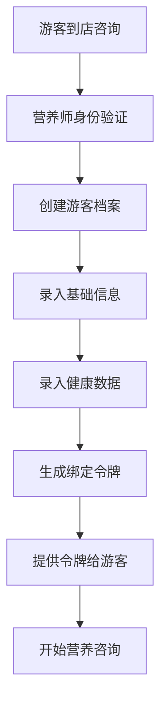
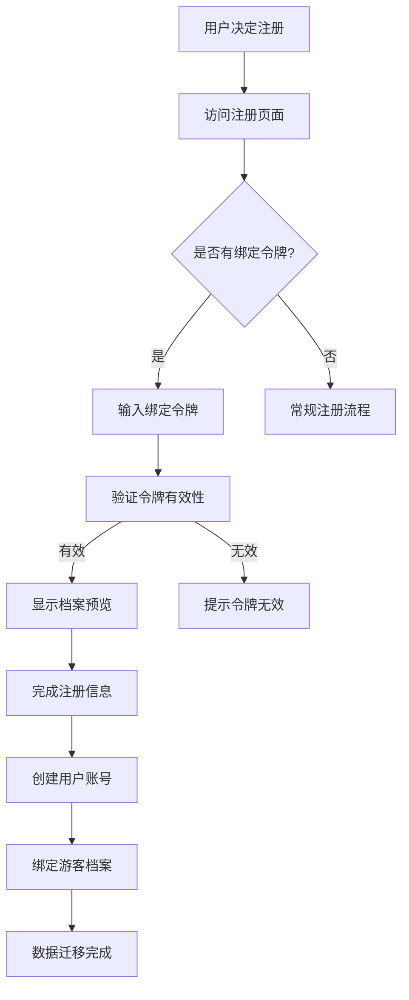
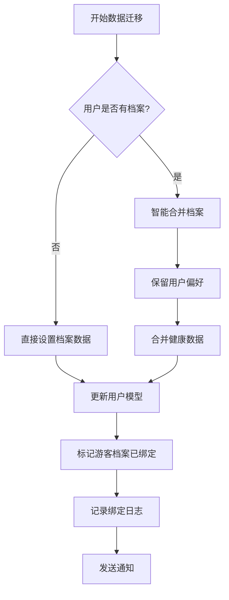
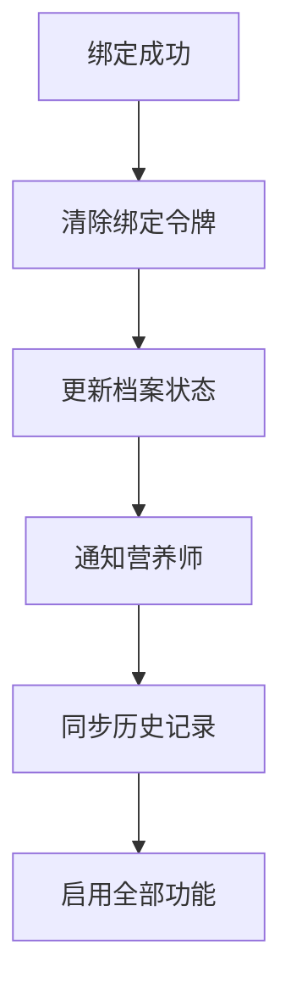
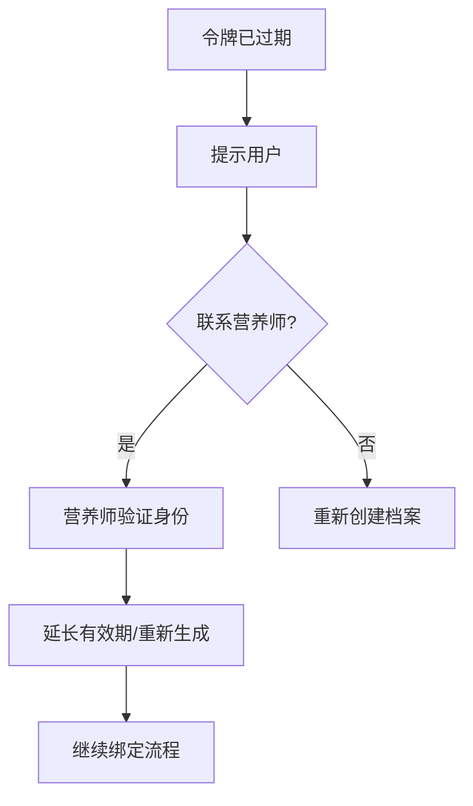

# 游客档案绑定流程

## 概述

游客档案绑定流程允许营养师为线下咨询的访客创建临时营养档案，访客后续可以通过绑定令牌将档案绑定到正式用户账号，实现档案数据的无缝迁移。

## 业务价值

- **提升转化率**: 降低用户注册门槛，先体验后注册
- **数据连续性**: 保证用户数据的完整性和连续性
- **营养师效率**: 营养师可以立即为访客提供服务
- **用户体验**: 简化注册流程，减少重复填写

## 参与角色

- **营养师**: 创建和管理游客档案
- **游客**: 接受营养咨询，获得绑定令牌
- **系统**: 自动处理绑定和数据迁移
- **正式用户**: 绑定后的账号拥有者

## 核心流程

### 1. 游客档案创建阶段



**详细步骤：**

1. **游客到店咨询**
   - 游客到线下门店寻求营养咨询
   - 暂时不想注册账号或忘记账号

2. **营养师身份验证**
   - 营养师登录系统
   - 系统验证营养师权限

3. **创建游客档案**
   ```javascript
   POST /api/guest-profiles
   {
     "profileData": {
       "age": 25,
       "gender": "female",
       "height": 165,
       "weight": 55,
       "activityLevel": "moderate",
       "healthGoals": ["weight_loss"],
       "dietaryPreferences": ["vegetarian"],
       "allergies": [{
         "allergen": "花生",
         "severity": "severe"
       }]
     }
   }
   ```

4. **生成绑定令牌**
   - 系统生成唯一的32位绑定令牌
   - 生成6位易记的游客ID (guest_xxxxxxxx)
   - 设置7天有效期

5. **提供令牌给游客**
   - 打印或发送绑定令牌到游客手机
   - 说明绑定流程和有效期

### 2. 用户注册与绑定阶段



**详细步骤：**

1. **输入绑定令牌**
   - 用户在注册页面输入绑定令牌
   - 或通过扫码/链接自动填充

2. **验证令牌**
   ```javascript
   GET /api/guest-profiles/token/{token}
   ```
   - 检查令牌是否存在
   - 检查是否已过期
   - 检查是否已使用

3. **档案预览**
   - 显示游客档案的基本信息
   - 用户确认是否为本人档案

4. **完成注册**
   - 填写账号信息（用户名、密码等）
   - 补充其他必要信息

5. **执行绑定**
   ```javascript
   POST /api/guest-profiles/token/{token}/bind
   {
     "userId": "新用户ID"
   }
   ```

### 3. 数据迁移阶段



**数据迁移策略：**

1. **新用户直接迁移**
   ```javascript
   user.nutritionProfile = guestProfile.profileData;
   ```

2. **已有档案智能合并**
   ```javascript
   // 基础数据使用游客档案（更新）
   mergedProfile.age = guestProfile.age;
   mergedProfile.weight = guestProfile.weight;
   
   // 偏好设置合并去重
   mergedProfile.dietaryPreferences = [
     ...user.dietaryPreferences,
     ...guestProfile.dietaryPreferences
   ].filter(unique);
   
   // 过敏信息累加
   mergedProfile.allergies = [
     ...user.allergies,
     ...guestProfile.allergies
   ];
   ```

### 4. 绑定后处理



**后续处理：**

1. **状态更新**
   - 游客档案状态改为"已绑定"
   - 清除绑定令牌防止重复使用

2. **通知相关方**
   - 通知创建档案的营养师
   - 发送欢迎邮件给新用户

3. **功能解锁**
   - 用户可以查看完整营养分析
   - 可以使用AI推荐功能
   - 可以下单和参与活动

## 异常处理

### 1. 令牌过期处理



### 2. 重复绑定预防

```javascript
// 检查令牌是否已使用
if (guestProfile.bindingStatus === 'bound') {
  throw new Error('该档案已绑定到其他账号');
}

// 检查用户是否已绑定其他档案
if (user.hasGuestProfileBound) {
  throw new Error('您已绑定过游客档案');
}
```

### 3. 数据冲突处理

- **年龄冲突**: 使用游客档案数据（最新）
- **健康目标冲突**: 合并所有目标
- **过敏信息冲突**: 累加所有过敏源
- **偏好设置冲突**: 去重后合并

## 安全考虑

### 1. 令牌安全

- **生成规则**: 使用加密安全的随机数生成器
- **传输安全**: HTTPS加密传输
- **存储安全**: 数据库加密存储
- **使用限制**: 一次性使用，用后即废

### 2. 隐私保护

- **数据脱敏**: 游客档案不包含真实姓名
- **访问控制**: 只有创建者和绑定用户可访问
- **日志记录**: 完整的访问和操作日志
- **数据删除**: 过期自动删除机制

### 3. 防刷保护

```javascript
// 频率限制
rateLimitMiddleware({ 
  windowMs: 15 * 60 * 1000, // 15分钟
  max: 100 // 最多100次请求
})

// 验证失败计数
if (verificationAttempts > 5) {
  lockToken(tokenId);
}
```

## 技术实现

### 1. 数据模型设计

```javascript
// 游客档案模型
{
  guestId: String,          // 游客ID
  profileData: Object,      // 营养档案数据
  createdBy: ObjectId,      // 创建营养师
  bindingToken: String,     // 绑定令牌
  bindingStatus: String,    // 绑定状态
  boundUserId: ObjectId,    // 绑定用户ID
  expiresAt: Date          // 过期时间
}
```

### 2. 关键API接口

| 接口 | 说明 | 权限 |
|------|------|------|
| POST /api/guest-profiles | 创建游客档案 | 营养师 |
| GET /api/guest-profiles/token/{token} | 验证令牌 | 公开 |
| POST /api/guest-profiles/token/{token}/bind | 执行绑定 | 登录用户 |
| GET /api/guest-profiles/{guestId} | 查看档案 | 营养师 |

### 3. 定时任务

```javascript
// 每天凌晨2点清理过期档案
cron.schedule('0 2 * * *', async () => {
  await GuestProfile.deleteMany({
    expiresAt: { $lte: new Date() },
    bindingStatus: 'pending'
  });
});
```

## 监控指标

### 1. 业务指标

- **创建量**: 每日创建的游客档案数
- **绑定率**: 绑定成功率 = 绑定数 / 创建数
- **绑定时长**: 从创建到绑定的平均时长
- **过期率**: 过期未绑定的比例

### 2. 技术指标

- **API响应时间**: 各接口的平均响应时间
- **令牌验证成功率**: 验证成功 / 总验证次数
- **数据迁移成功率**: 成功迁移 / 总迁移次数
- **系统错误率**: 系统异常 / 总请求数

### 3. 告警规则

```javascript
// 绑定率过低告警
if (bindingRate < 0.3) {
  alert('游客档案绑定率过低，请检查流程');
}

// 过期率过高告警
if (expireRate > 0.5) {
  alert('游客档案过期率过高，考虑延长有效期');
}
```

## 最佳实践

### 1. 营养师操作建议

- **及时创建**: 咨询开始时立即创建档案
- **准确录入**: 仔细核对基础健康数据
- **清晰说明**: 向游客解释绑定的好处
- **跟进提醒**: 临近过期时提醒游客绑定

### 2. 产品优化建议

- **简化流程**: 减少绑定步骤
- **多渠道支持**: 支持扫码、短链接绑定
- **激励机制**: 绑定送积分或优惠券
- **到期提醒**: 自动发送提醒通知

### 3. 技术优化建议

- **缓存优化**: 热门令牌缓存加速验证
- **批量处理**: 支持批量创建和绑定
- **异步处理**: 数据迁移异步执行
- **弹性扩展**: 高峰期自动扩容

## 常见问题

### Q1: 游客档案会保存多久？
A: 默认保存7天，过期后自动删除。特殊情况可申请延长。

### Q2: 能否将档案绑定到已有账号？
A: 可以，系统会智能合并数据，保留用户的历史偏好设置。

### Q3: 绑定令牌丢失怎么办？
A: 联系创建档案的营养师，验证身份后可重新获取。

### Q4: 一个用户能绑定多个游客档案吗？
A: 不能，每个用户只能绑定一个游客档案，避免数据混乱。

### Q5: 绑定后能否解绑？
A: 不支持解绑，但可以在用户端修改档案信息。

## 未来展望

1. **AI智能识别**: 通过人脸识别自动匹配游客档案
2. **多端同步**: 支持小程序、APP等多端绑定
3. **社交分享**: 支持分享绑定链接给朋友
4. **档案继承**: 支持家庭成员间的档案关联
5. **区块链存证**: 使用区块链技术保证数据真实性