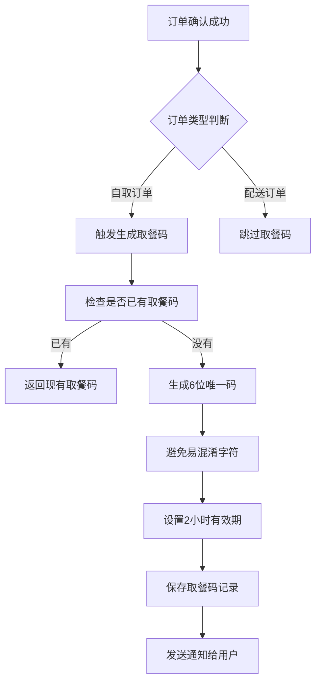
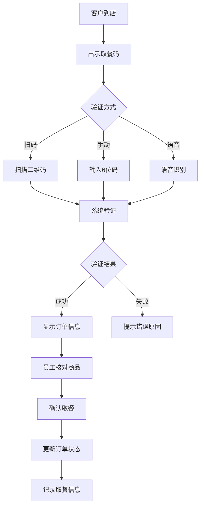
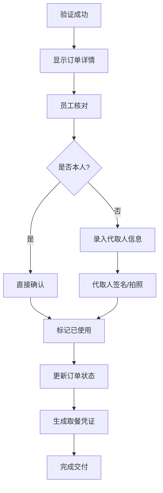
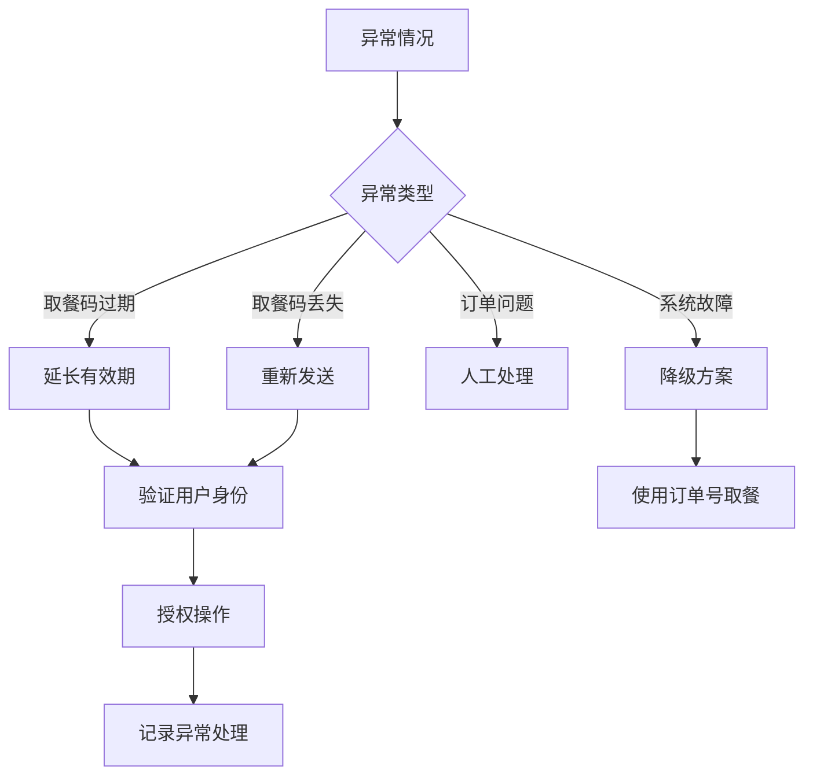
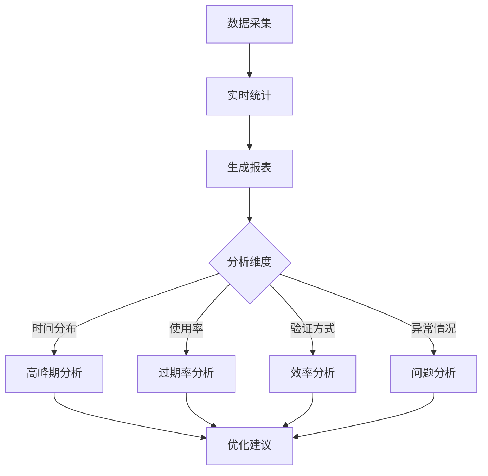

# 取餐码业务流程

## 概述

取餐码系统是订单履约的核心环节，为每个确认的订单生成唯一的6位取餐码，用户凭码到店取餐。系统支持扫码、手动输入、语音输入等多种验证方式，确保取餐过程安全、高效、可追溯。

## 业务价值

- **防止冒领**: 确保订单交付给正确的客户
- **提升效率**: 快速验证，减少排队时间
- **数据追溯**: 完整的取餐记录和审计日志
- **用户体验**: 简单易记的取餐码，支持代取
- **运营分析**: 取餐时间分布，优化备餐流程

## 参与角色

- **用户**: 下单客户，取餐码接收者
- **门店员工**: 验证取餐码，确认交付
- **门店经理**: 查看统计数据，处理异常
- **系统**: 自动生成、验证、过期处理
- **代取人**: 帮助他人取餐的人员

## 核心流程

### 1. 取餐码生成流程



**详细步骤：**

1. **触发条件**
   - 订单状态变更为 confirmed/preparing/ready
   - 订单类型为自取(pickup)
   - 系统自动触发或门店手动生成

2. **生成规则**
   ```javascript
   // 生成算法
   const chars = 'ABCDEFGHIJKLMNOPQRSTUVWXYZ0123456789';
   // 排除易混淆字符：I、L、0、O
   const safeChars = 'ABCDEFGHJKMNPQRSTUVWXYZ123456789';
   
   // 生成6位码
   let code = '';
   for (let i = 0; i < 6; i++) {
     code += safeChars[Math.floor(Math.random() * safeChars.length)];
   }
   ```

3. **唯一性保证**
   - 同一门店同一时间段内唯一
   - 最多重试10次生成
   - 失败则抛出异常

4. **通知机制**
   ```javascript
   // 短信通知
   await smsService.send(user.phone, 
     `您的订单${orderNumber}已准备就绪，取餐码：${code}，请在${expiresAt}前到店取餐。`
   );
   
   // APP推送
   await pushService.send(user.deviceId, {
     title: '订单已备好',
     body: `取餐码：${code}`,
     data: { orderId, pickupCode: code }
   });
   ```

### 2. 取餐验证流程



**验证步骤：**

1. **多种验证方式**
   - **扫码验证**: 最快速，减少输入错误
   - **手动输入**: 备选方案，支持大小写
   - **语音输入**: 解放双手，提高效率

2. **验证逻辑**
   ```javascript
   // 验证取餐码
   const pickupCode = await PickupCode.findOne({
     code: inputCode.toUpperCase(),
     storeId: currentStoreId,
     status: 'active',
     expiresAt: { $gt: new Date() }
   });
   
   if (!pickupCode) {
     // 记录失败尝试
     await recordVerificationAttempt(inputCode, false);
     return { success: false, error: '取餐码无效或已过期' };
   }
   ```

3. **防暴力破解**
   - 记录所有验证尝试
   - 同一IP短时间内失败5次锁定
   - 异常行为告警

### 3. 取餐确认流程



**确认细节：**

1. **订单核对**
   ```javascript
   // 显示订单信息供核对
   {
     orderNumber: "ORDER_20231201_001",
     items: [
       { name: "宫保鸡丁", quantity: 1, notes: "少辣" },
       { name: "米饭", quantity: 1 }
     ],
     totalAmount: 28.00,
     customerName: "张三",
     customerPhone: "138****5678" // 脱敏显示
   }
   ```

2. **代取处理**
   ```javascript
   // 记录代取人信息
   if (!isOriginalCustomer) {
     pickupPerson = {
       name: "李四",
       phone: "139****4321",
       relationship: "朋友",
       idNumber: "****1234" // 后四位
     };
   }
   ```

3. **使用标记**
   ```javascript
   await pickupCode.markAsUsed(staffId, {
     verificationMethod: 'qr_scan',
     deviceId: 'POS001',
     pickupPerson: pickupPerson
   });
   
   // 同步更新订单
   await Order.updateStatus(orderId, 'completed');
   ```

### 4. 异常处理流程



**异常场景：**

1. **取餐码过期**
   ```javascript
   // 延长有效期（最多24小时）
   await pickupCode.extendExpiry(additionalHours);
   
   // 记录延长原因
   await auditLog.create({
     action: 'EXTEND_PICKUP_CODE',
     reason: '客户因交通延误',
     operator: staffId
   });
   ```

2. **取餐码丢失**
   - 验证用户身份（手机号后四位）
   - 查询订单信息确认
   - 重新发送通知
   - 记录处理日志

3. **系统故障降级**
   - 使用订单号+手机号验证
   - 手工记录取餐信息
   - 事后补录系统

### 5. 数据统计与分析



**关键指标：**

1. **运营指标**
   - 日均生成量
   - 使用率 = 已使用 / 总生成
   - 过期率 = 已过期 / 总生成
   - 平均取餐时长

2. **效率指标**
   - 验证成功率
   - 平均验证时间
   - 各验证方式占比
   - 错误重试率

3. **异常指标**
   - 延期处理次数
   - 代取比例
   - 投诉率
   - 系统故障率

## 安全机制

### 1. 防伪造

```javascript
// 取餐码生成包含时间戳和随机数
const generateSecureCode = () => {
  const timestamp = Date.now().toString(36);
  const random = Math.random().toString(36);
  const hash = crypto.createHash('sha256')
    .update(timestamp + random + secretKey)
    .digest('hex');
  return hash.substring(0, 6).toUpperCase();
};
```

### 2. 防重放

- 取餐码一次性使用
- 使用后立即失效
- 记录完整使用日志

### 3. 访问控制

- 只有本店员工可验证本店取餐码
- 跨店验证自动拒绝
- 完整的权限审计

## 技术实现

### 1. 数据库设计

```javascript
// 索引优化
pickupCodeSchema.index({ code: 1, storeId: 1 });
pickupCodeSchema.index({ expiresAt: 1 }, { expireAfterSeconds: 0 });
pickupCodeSchema.index({ orderId: 1 });
pickupCodeSchema.index({ status: 1, storeId: 1, createdAt: -1 });
```

### 2. 缓存策略

```javascript
// Redis缓存活跃取餐码
const cacheKey = `pickup:${storeId}:${code}`;
await redis.setex(cacheKey, 300, JSON.stringify(pickupCode));

// 验证时先查缓存
const cached = await redis.get(cacheKey);
if (cached) return JSON.parse(cached);
```

### 3. 定时任务

```javascript
// 每5分钟处理过期取餐码
cron.schedule('*/5 * * * *', async () => {
  await PickupCode.updateMany(
    {
      status: 'active',
      expiresAt: { $lte: new Date() }
    },
    {
      status: 'expired'
    }
  );
});
```

## 最佳实践

### 1. 用户体验

- **清晰提示**: 取餐码醒目显示
- **多次通知**: 订单确认、制作完成时通知
- **便捷查看**: APP首页快速入口
- **离线支持**: 截图保存也可使用

### 2. 门店操作

- **培训到位**: 员工熟练掌握各种验证方式
- **设备齐全**: 扫码枪、手机、POS机都可验证
- **应急预案**: 系统故障时的处理流程
- **交接规范**: 确保正确交付

### 3. 系统优化

- **性能优化**: 高并发下的快速响应
- **容错设计**: 网络异常时的重试机制
- **监控告警**: 异常情况实时通知
- **数据分析**: 定期优化生成算法

## 配置参数

```javascript
// 系统配置
const config = {
  // 取餐码配置
  pickupCode: {
    length: 6,                    // 取餐码长度
    charset: 'ABCDEFGHJKMNPQRSTUVWXYZ123456789', // 字符集
    expiryHours: 2,              // 默认有效期（小时）
    maxExpiryHours: 24,          // 最大有效期（小时）
    maxRetries: 10,              // 生成重试次数
    verificationTimeout: 30      // 验证超时（秒）
  },
  
  // 通知配置
  notification: {
    enableSMS: true,             // 启用短信通知
    enablePush: true,            // 启用推送通知
    enableEmail: false,          // 启用邮件通知
    retryTimes: 3,               // 通知重试次数
    retryInterval: 60            // 重试间隔（秒）
  },
  
  // 安全配置
  security: {
    maxVerifyAttempts: 5,        // 最大验证尝试次数
    lockDuration: 300,           // 锁定时长（秒）
    enableRateLimit: true,       // 启用频率限制
    rateLimit: {
      window: 60,                // 时间窗口（秒）
      maxRequests: 20            // 最大请求数
    }
  }
};
```

## 故障处理

### 1. 生成失败

```javascript
// 降级策略：使用订单号后6位
if (generateAttempts > maxRetries) {
  const fallbackCode = orderNumber.slice(-6).toUpperCase();
  return fallbackCode;
}
```

### 2. 验证失败

```javascript
// 多级验证降级
try {
  // 1. 正常验证
  return await verifyByCode(code);
} catch (error) {
  try {
    // 2. 使用订单号验证
    return await verifyByOrderNumber(orderNumber);
  } catch (error) {
    // 3. 人工验证
    return await manualVerify(orderId, staffId);
  }
}
```

### 3. 通知失败

```javascript
// 多渠道补偿
const notifyChannels = ['sms', 'push', 'inapp'];
for (const channel of notifyChannels) {
  try {
    await notify(channel, user, pickupCode);
    break; // 成功即停止
  } catch (error) {
    continue; // 尝试下一个渠道
  }
}
```

## 监控告警

### 1. 业务告警

- 生成成功率 < 95%
- 使用率 < 70%
- 过期率 > 30%
- 验证失败率 > 5%

### 2. 技术告警

- API响应时间 > 500ms
- 数据库查询超时
- 缓存命中率 < 80%
- 队列积压 > 1000

### 3. 安全告警

- 暴力破解尝试
- 异常访问模式
- 跨店验证频繁
- 批量生成异常

## 未来优化

1. **智能预测**: 基于历史数据预测取餐高峰
2. **动态码**: 实时变化的动态取餐码
3. **生物识别**: 人脸识别辅助验证
4. **区块链**: 取餐记录上链存证
5. **AI客服**: 智能处理取餐异常