# 积分系统运营流程

## 概述

积分系统是提升用户忠诚度和活跃度的核心运营工具。通过多样化的积分获取途径、灵活的规则配置、丰富的消费场景，构建完整的用户激励体系，促进用户留存和复购。

## 业务价值

- **用户留存**: 建立长期激励机制，提高用户粘性
- **活跃促进**: 签到、评价等行为激励，提升日活
- **消费刺激**: 积分抵扣降低决策门槛，促进下单
- **数据洞察**: 用户行为数据分析，优化运营策略
- **精准营销**: 基于积分等级的差异化营销

## 核心概念

### 1. 积分类型

| 类型 | 说明 | 有效期 | 用途 |
|------|------|--------|------|
| 基础积分 | 常规获得的积分 | 1年 | 通用消费 |
| 活动积分 | 特殊活动赠送 | 3个月 | 限定用途 |
| 等级积分 | 会员等级奖励 | 永久 | 等级维持 |

### 2. 获取途径

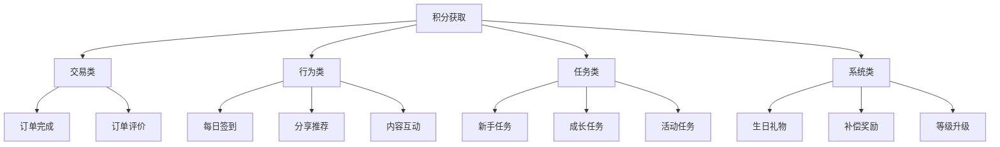

### 3. 消费场景

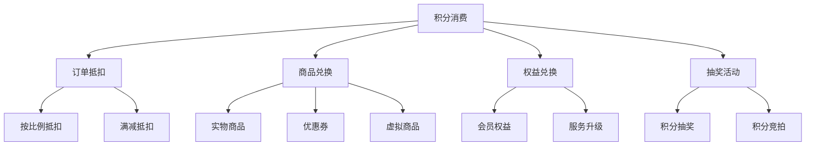

## 积分获取流程

### 1. 订单积分流程

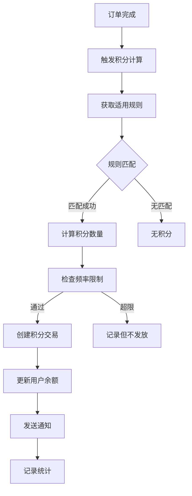

**详细实现：**

1. **规则匹配逻辑**
   ```javascript
   // 获取适用规则
   const rules = await PointsRule.getApplicableRules({
     type: 'order_completion',
     userId: order.userId,
     orderAmount: order.totalAmount,
     storeId: order.storeId,
     categoryIds: order.items.map(i => i.categoryId),
     userMembershipLevel: user.membershipLevel,
     timestamp: new Date()
   });
   
   // 选择最高优先级规则
   const rule = rules.sort((a, b) => b.priority - a.priority)[0];
   ```

2. **积分计算方式**
   ```javascript
   // 固定积分
   if (rule.calculationType === 'fixed') {
     points = rule.fixedAmount;
   }
   
   // 百分比积分
   if (rule.calculationType === 'percentage') {
     points = Math.floor(orderAmount * rule.percentage / 100);
   }
   
   // 分层积分
   if (rule.calculationType === 'tiered') {
     const tier = rule.tiers.find(t => 
       orderAmount >= t.minAmount && 
       (!t.maxAmount || orderAmount <= t.maxAmount)
     );
     points = tier ? tier.points : 0;
   }
   ```

3. **频率限制检查**
   ```javascript
   // 检查用户今日获得积分次数
   const todayCount = await PointsTransaction.count({
     userId,
     type: 'earn_order',
     createdAt: { $gte: startOfDay }
   });
   
   if (todayCount >= rule.frequency.dailyLimit) {
     throw new Error('今日获得积分已达上限');
   }
   ```

### 2. 签到积分流程

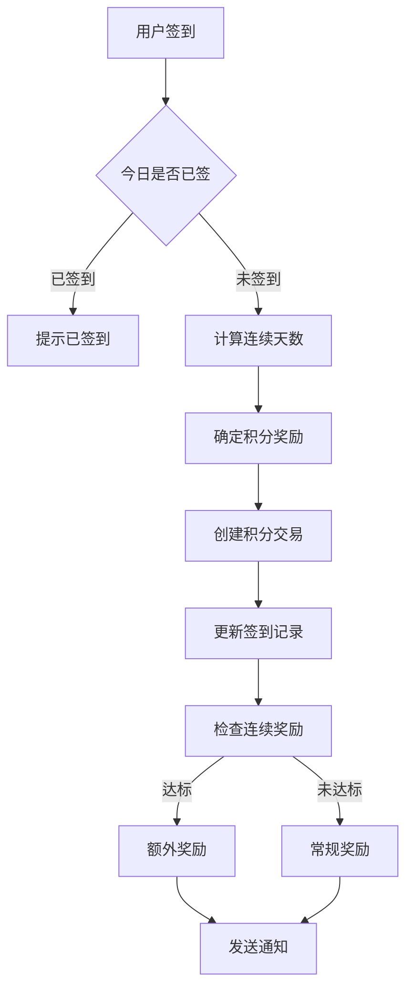

**连续签到奖励机制：**

```javascript
const consecutiveBonus = {
  3: { multiplier: 1.2, bonus: 20 },   // 连续3天
  7: { multiplier: 1.5, bonus: 50 },   // 连续7天
  15: { multiplier: 2.0, bonus: 100 }, // 连续15天
  30: { multiplier: 3.0, bonus: 300 }  // 连续30天
};

// 计算奖励
let totalPoints = basePoints;
const milestone = Object.keys(consecutiveBonus)
  .reverse()
  .find(days => consecutiveDays >= days);

if (milestone) {
  const bonus = consecutiveBonus[milestone];
  totalPoints = Math.floor(basePoints * bonus.multiplier);
  // 里程碑额外奖励
  if (consecutiveDays == milestone) {
    totalPoints += bonus.bonus;
  }
}
```

### 3. 评价积分流程

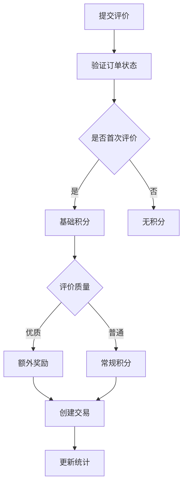

**评价质量判断：**

```javascript
const evaluateReviewQuality = (review) => {
  let score = 0;
  
  // 文字长度
  if (review.content.length > 50) score += 2;
  if (review.content.length > 100) score += 3;
  
  // 包含图片
  if (review.images?.length > 0) score += 5;
  
  // 包含标签
  if (review.tags?.length > 3) score += 2;
  
  // 有用内容（AI判断或关键词）
  if (containsUsefulContent(review.content)) score += 5;
  
  return score >= 10 ? 'high' : 'normal';
};
```

## 积分消费流程

### 1. 订单抵扣流程

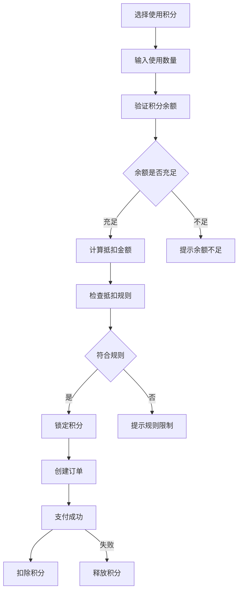

**抵扣规则示例：**

```javascript
const deductionRules = {
  // 积分抵扣比例 100:1 (100积分=1元)
  ratio: 100,
  
  // 最高抵扣比例 30%
  maxDeductionRate: 0.3,
  
  // 最低订单金额 20元
  minOrderAmount: 20,
  
  // 单笔最高抵扣 50元
  maxDeductionAmount: 50,
  
  // 可用商品类型
  applicableCategories: ['正餐', '饮品'],
  
  // 不可用商品
  excludedItems: ['特价商品', '会员专享']
};
```

### 2. 商品兑换流程

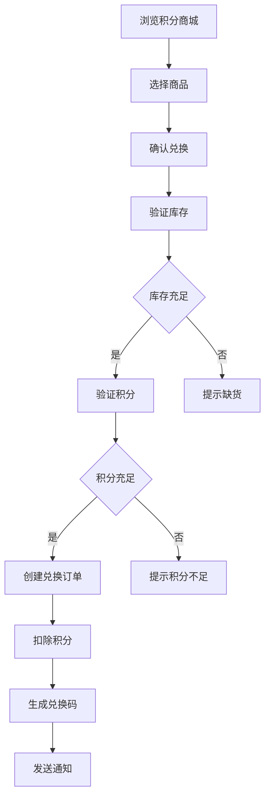

## 积分规则管理

### 1. 规则配置流程

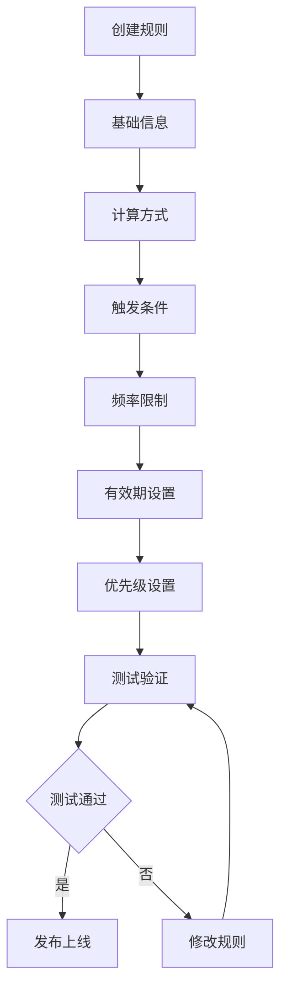

**规则配置示例：**

```javascript
// 订单金额分层积分规则
const tieredOrderRule = {
  name: "订单金额分层积分",
  type: "order_amount",
  status: "active",
  priority: 10,
  
  pointsConfig: {
    calculationType: "tiered",
    tiers: [
      { minAmount: 0, maxAmount: 50, points: 10 },
      { minAmount: 50, maxAmount: 100, points: 30 },
      { minAmount: 100, maxAmount: 200, points: 60 },
      { minAmount: 200, points: 100 }
    ]
  },
  
  conditions: {
    minOrderAmount: 20,
    membershipLevels: ["silver", "gold", "platinum"],
    timeRestrictions: {
      dayOfWeek: [1, 2, 3, 4, 5], // 周一至周五
      hourOfDay: { start: 11, end: 14 } // 11:00-14:00
    }
  },
  
  frequency: {
    limitType: "daily",
    limitCount: 2
  },
  
  validity: {
    startDate: "2023-12-01",
    endDate: "2023-12-31",
    pointsValidityDays: 365
  }
};
```

### 2. A/B测试流程

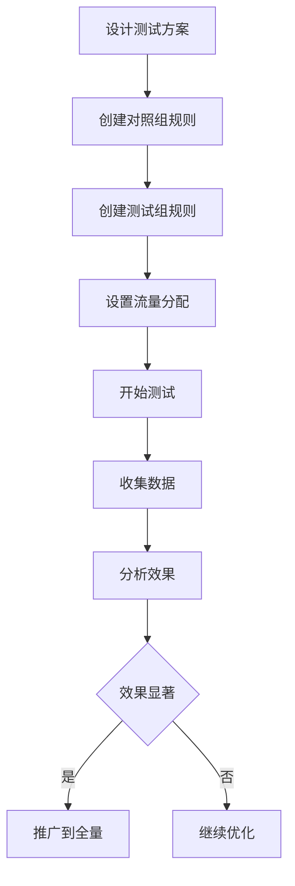

## 积分过期处理

### 1. 过期提醒流程

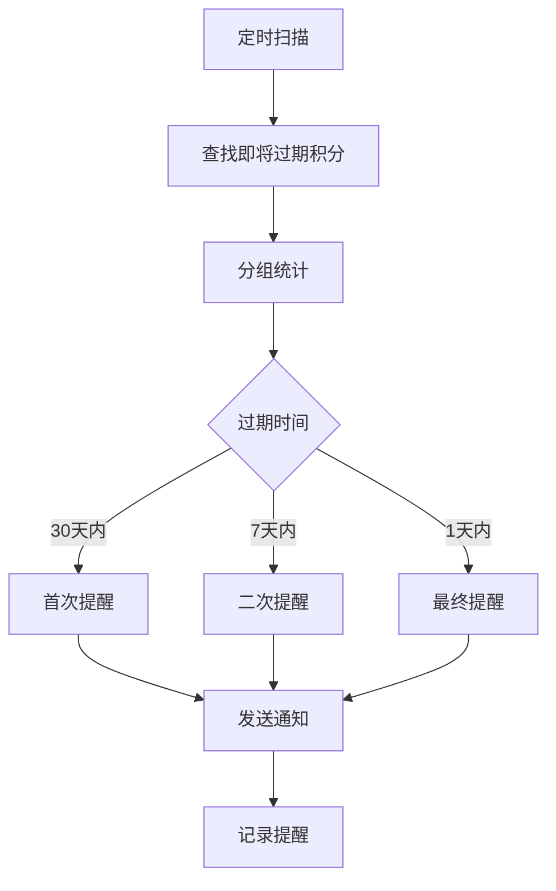

### 2. 自动过期流程

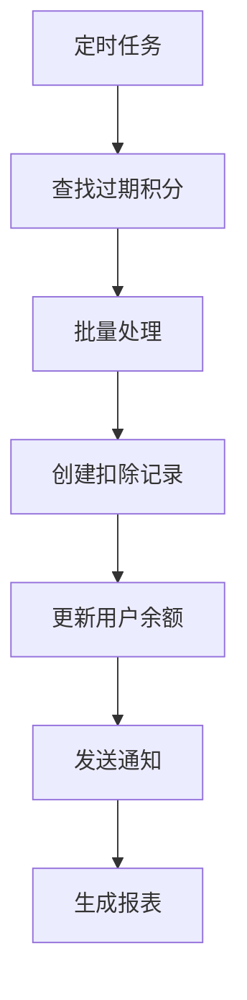

## 数据分析与优化

### 1. 关键指标体系

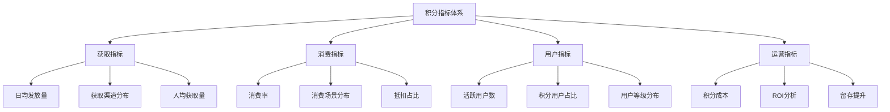

### 2. 优化策略

**基于数据的优化方向：**

1. **获取优化**
   - 低参与度场景加大奖励
   - 高频场景控制成本
   - 新增有吸引力的任务

2. **消费优化**
   - 增加兑换商品种类
   - 优化抵扣规则
   - 推出限时兑换活动

3. **用户分层运营**
   ```javascript
   const userSegments = {
     // 新用户
     new: {
       criteria: { registrationDays: { $lte: 7 } },
       strategy: '大额新手奖励，引导首次消费'
     },
     
     // 活跃用户
     active: {
       criteria: { monthlyPoints: { $gte: 500 } },
       strategy: '维持奖励水平，增加消费场景'
     },
     
     // 沉睡用户
     dormant: {
       criteria: { lastActiveDate: { $lte: 30 } },
       strategy: '召回奖励，限时积分翻倍'
     },
     
     // 流失用户
     churned: {
       criteria: { lastActiveDate: { $lte: 90 } },
       strategy: '大额召回奖励，积分重置保护'
     }
   };
   ```

## 风险控制

### 1. 防刷策略

```javascript
const antiCheatingRules = {
  // IP限制
  ipRateLimit: {
    window: 3600, // 1小时
    maxPoints: 1000 // 最多获得1000积分
  },
  
  // 设备限制
  deviceLimit: {
    daily: 5, // 每设备每日最多5个账号
    monthly: 20 // 每设备每月最多20个账号
  },
  
  // 行为异常检测
  abnormalBehavior: {
    // 签到时间过于规律
    checkinTimeVariance: 300, // 秒
    
    // 订单金额异常
    orderAmountDeviation: 3, // 标准差
    
    // 评价内容重复
    reviewSimilarity: 0.8 // 相似度阈值
  }
};
```

### 2. 积分回收机制

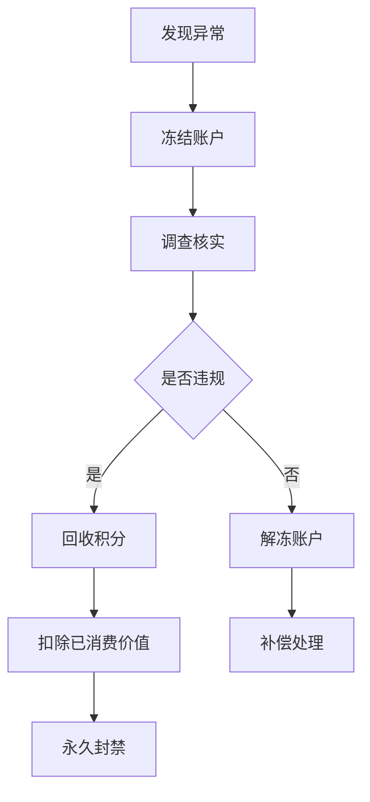

## 系统配置

### 1. 全局配置

```javascript
const pointsSystemConfig = {
  // 基础配置
  basic: {
    enabled: true,
    currency: 'points', // 积分单位名称
    precision: 0, // 小数位数
    minBalance: 0 // 最低余额
  },
  
  // 获取配置
  earning: {
    dailyLimit: 2000, // 每日获取上限
    monthlyLimit: 30000, // 每月获取上限
    defaultExpiry: 365 // 默认有效期(天)
  },
  
  // 消费配置
  spending: {
    minSpend: 100, // 最低消费积分
    maxSpend: 10000, // 单次最高消费
    conversionRate: 100 // 积分兑换比例
  },
  
  // 通知配置
  notification: {
    earnNotify: true, // 获得通知
    spendNotify: true, // 消费通知
    expiryNotify: true, // 过期提醒
    notifyDays: [30, 7, 1] // 提醒时间点
  }
};
```

### 2. 规则引擎配置

```javascript
const ruleEngineConfig = {
  // 规则缓存
  cache: {
    enabled: true,
    ttl: 300, // 缓存时间(秒)
    maxSize: 1000 // 最大缓存数
  },
  
  // 规则评估
  evaluation: {
    maxRules: 100, // 最大规则数
    timeout: 1000, // 评估超时(毫秒)
    parallel: true // 并行评估
  },
  
  // 规则冲突处理
  conflict: {
    strategy: 'priority', // 优先级策略
    tieBreaker: 'newest' // 同优先级取最新
  }
};
```

## 运营建议

### 1. 积分体系设计原则

- **简单易懂**: 规则清晰，用户易理解
- **公平合理**: 投入产出成正比
- **持续激励**: 长期和短期激励结合
- **差异化**: 不同用户群体差异化设计
- **可持续**: 成本可控，长期运营

### 2. 活动运营建议

1. **新手期**（0-7天）
   - 大额新手奖励
   - 任务引导体系
   - 首次消费激励

2. **成长期**（8-30天）
   - 连续签到奖励
   - 行为习惯培养
   - 等级成长体系

3. **成熟期**（30天+）
   - 会员权益升级
   - 专属活动参与
   - 社交分享激励

4. **流失召回**
   - 积分过期保护
   - 专属召回奖励
   - 限时翻倍活动

### 3. 成本控制建议

```javascript
// 积分成本监控
const costMonitoring = {
  // 预警阈值
  thresholds: {
    dailyCost: 10000, // 日成本上限
    userAvgCost: 50, // 人均成本上限
    conversionCost: 0.01 // 积分价值
  },
  
  // 自动调控
  autoAdjust: {
    enabled: true,
    reduceFactor: 0.8, // 超限后降低80%
    recoveryHours: 24 // 恢复时间
  },
  
  // 报表周期
  reporting: {
    realtime: true,
    daily: true,
    weekly: true,
    monthly: true
  }
};
```

## 案例分析

### 成功案例：连续签到活动

**活动设计：**
- 基础奖励：每日10积分
- 连续奖励：3/7/15/30天额外奖励
- 断签保护：使用50积分补签

**活动效果：**
- DAU提升35%
- 人均签到天数从3.5提升到12.8
- 积分消费率提升20%

**经验总结：**
1. 门槛要低，让用户容易开始
2. 奖励递增，保持持续动力
3. 容错机制，避免挫败感
4. 可视化进度，增强成就感

## 未来发展

1. **个性化积分**
   - 基于用户画像的动态规则
   - 千人千面的积分体验
   - AI驱动的奖励优化

2. **积分生态**
   - 跨商家积分互通
   - 积分交易市场
   - 区块链积分认证

3. **游戏化升级**
   - 积分等级体系
   - 成就徽章系统
   - 排行榜竞争

4. **智能运营**
   - 自动规则优化
   - 异常检测预警
   - 效果预测模型