# 营养立方 (Nutrition Cube) - AI智能营养餐厅系统业务需求文档

> **文档版本**: 3.0.0  
> **创建日期**: 2025-07-11  
> **更新日期**: 2025-07-23  
> **文档状态**: ✅ 需求规范完成，与技术架构统一  
> **目标受众**: AI编码工具、产品经理、开发团队、技术架构师

## 📋 目录

- [1. 产品概述](#1-产品概述)
- [2. 核心用户群体](#2-核心用户群体)
- [3. 核心功能模块](#3-核心功能模块)
- [4. 用户故事](#4-用户故事)
- [5. 业务流程](#5-业务流程)
- [6. 功能优先级](#6-功能优先级)
- [7. 验收标准](#7-验收标准)
- [8. 业务规则](#8-业务规则)
- [9. AI集成架构](#9-ai集成架构)
- [10. 权限系统](#10-权限系统)
- [11. 非功能性需求](#11-非功能性需求)
- [12. 风险和约束](#12-风险和约束)
- [13. 成功指标](#13-成功指标)
- [14. API接口规范](#14-api接口规范)
- [15. 附录](#15-附录)

---

## 1. 产品概述

### 1.1 产品愿景
构建一个基于AI技术的智能营养餐厅生态系统，通过个性化营养管理、智能餐饮服务和专业营养师平台，为用户提供科学的饮食健康解决方案。

### 1.2 产品价值主张
- **AI驱动的个性化营养** - 基于深度学习算法提供精准营养建议和膳食计划
- **智能餐厅生态** - 从库存管理到个性化菜单的全链条AI优化
- **专业营养师服务** - AI辅助的专业营养咨询平台
- **数据驱动健康** - 多维度健康数据分析和持续优化

### 1.3 产品边界
**包含功能**:
- 用户营养档案管理（灵活多级别）
- AI营养分析和个性化推荐
- 智能拍照识别卡路里
- AI驱动的库存管理系统
- 餐厅点餐和订单管理（堂食/外送）
- 营养师AI辅助咨询服务
- 商家智能管理系统
- 社区交流和官方内容发布
- 平台管理后台
- 第三方支付集成（支付宝/微信支付）

**不包含功能**:
- 医疗诊断和治疗建议
- 药物推荐
- 食品生产制造
- 自营物流配送系统

---

## 2. 核心用户群体

### 2.1 普通用户 (User)
**用户画像**:
- 年龄: 18-55岁
- 收入: 中等及以上
- 特征: 注重健康饮食，追求生活品质，接受科技产品
- 痛点: 缺乏营养知识，饮食选择困难，健康管理无系统性

**核心需求**:
- 获得个性化AI营养建议和膳食计划
- 拍照识别食物卡路里和营养成分
- 基于食材偏好的智能菜谱推荐
- 便捷的健康餐厅推荐和智能点餐
- 持续跟踪饮食和健康数据
- 获得专业营养师指导

### 2.2 营养师 (Nutritionist)
**用户画像**:
- 持有专业认证的营养师
- 寻求提升服务效率和质量
- 需要科学的辅助决策工具

**核心需求**:
- 高效管理客户营养档案
- AI辅助的营养方案制定
- 优化和精修AI推荐结果
- 在线咨询服务平台
- 跟踪客户健康进度
- 专业数据分析报告

### 2.3 加盟店商家 (Merchant)
**用户画像**:
- 加盟店经营者（由总部授权）
- 追求智能化经营管理
- 注重食品营养价值

**核心需求**:
- 菜品营养信息智能管理
- AI库存管理系统：
  - 基于营养元素完整性的采购建议
  - 季节性和市场化的食材补充方案
  - 智能库存预警和营养平衡分析
- 订单处理系统：
  - 堂食和外送订单管理
  - 智能取餐码系统
  - AI生成的个性化营养标签打印
- 菜单优化：
  - 总部固定菜单管理
  - AI个性化菜单生成
  - 基于用户营养档案的智能推荐
- 配送管理：
  - 社区定点配送时间地点设置
  - 前端同步展示配送信息
- 经营数据智能分析

### 2.4 系统管理员 (Admin)
**用户画像**:
- 平台运营管理人员
- 负责整体平台运维
- 掌控系统配置权限

**核心需求**:
- 用户权限管理（商家/营养师授权）
- AI接口配置和热更换
- 内容审核和质量控制
- 营养套餐上架管理
- 系统监控和数据分析
- 官方内容发布（明厨亮灶视频）

---

## 3. 核心功能模块

### 3.1 智能用户认证系统
**功能描述**: 无需独立注册页面的智能认证系统
**核心特性**:
- 手机号输入时自动检测注册状态
- 未注册用户自动创建账户
- 支持微信/支付宝第三方快速登录
- JWT Token + RefreshToken双重认证
- 基于角色的权限管理（RBAC）

### 3.2 灵活营养档案管理
**功能描述**: 支持从基础到专业的多级别营养档案，用户填写越详细，AI推荐精度越高
**核心特性**:

#### 3.2.1 基础档案（必填 - 1分钟完成）
**推荐精度**: 70% | **适用场景**: 快速体验用户
- **基本信息**: 身高、体重、年龄、性别
- **营养目标**: 减脂/增肌/维持/改善健康
- **活动水平**: 久坐/轻度活动/中度活动/高强度运动
- **饮食偏好**: 无限制/素食/减糖/低盐等
- **AI价值**: 提供通用营养建议，满足基本推荐需求

#### 3.2.2 标准档案（选填 - 5-10分钟）
**推荐精度**: 85% | **适用场景**: 健康管理用户
- **特殊状态**: 哺乳期/备孕/更年期/青春期/老年期
- **健康状况**: 
  - 慢性疾病史（糖尿病/高血压/心脏病等）
  - 过敏和食物不耐受
  - 消化系统问题
  - 睡眠质量（0-10分评估）
- **生活习惯**:
  - 运动习惯和强度（每周频次、时长、类型）
  - 用餐时间规律性
  - 饮水习惯
  - 补充剂使用情况
- **AI价值**: 个性化营养方案，考虑健康风险因素

#### 3.2.3 专业档案（选填 - 专业数据导入）
**推荐精度**: 95% | **适用场景**: 精准健康管理
- **身体成分数据**:
  - 体脂率、肌肉量、内脏脂肪
  - 基础代谢率（实测值）
  - 骨密度（如有）
- **医学检查指标**:
  - 血液检查（血糖/血脂/维生素/矿物质）
  - 肝肾功能指标
  - 甲状腺功能
  - 炎症指标
- **高级检测**:
  - 基因检测结果（营养代谢相关基因）
  - 肠道菌群检测
  - 食物敏感性检测
- **AI价值**: 精准医学级别的营养建议，预防性健康管理

#### 3.2.4 AI智能档案完善系统
**核心功能**:
- **行为数据分析**: 
  - 用餐时间和频次分析
  - 食物选择偏好学习
  - 运动数据关联分析
- **拍照识别补充**:
  - 餐食照片自动识别营养摄入
  - 体型变化照片分析
  - 食材采购照片分析偏好
- **无感提示机制**:
  - 智能时机推送档案完善提醒
  - 根据使用行为推荐补充信息
  - 阶段性健康数据更新提醒

#### 3.2.5 多档案管理
- 支持最多10个家庭成员档案
- 档案间关联分析（遗传因素、家庭饮食习惯）
- 家庭营养计划协调优化
- 隐私保护和权限控制

### 3.3 AI营养分析引擎
**功能描述**: 多层次AI驱动的营养分析和推荐系统
**核心特性**:
- **用户端AI功能**:
  - 个性化营养套餐计划推荐
  - 拍照识别食物卡路里和营养成分
  - 基于食材和口味偏好的菜谱推荐
  - 营养缺口智能分析
  - 饮食习惯追踪和改善建议
- **算法模型**:
  - 基于中国营养学会标准的计算模型
  - 深度学习的食物识别模型
  - 协同过滤的个性化推荐算法
  - 营养平衡优化算法

### 3.4 智能点餐系统
**功能描述**: AI驱动的全流程智能点餐服务
**核心特性**:
- **智能推荐**:
  - 基于营养档案的菜品匹配
  - 营养元素平衡优化
  - 口味和烹饪方式个性化
- **订单管理**:
  - 堂食/外送订单分流
  - 智能取餐码生成和匹配
  - 营养成分百分比标签打印
  - 用户昵称和营养信息便利贴
- **配送服务**:
  - 社区定点配送管理
  - 配送时间地点前端展示
  - 预订和即时订单支持

### 3.5 营养师AI辅助平台
**功能描述**: AI赋能的专业营养咨询服务
**核心特性**:
- **AI辅助功能**:
  - 智能营养方案初稿生成
  - 用户数据可视化分析
  - 异常指标智能预警
  - 方案效果预测模型
- **专业工具**:
  - AI方案精修编辑器
  - 多维度健康报告生成
  - 客户进度追踪系统
  - 营养知识库集成

### 3.6 商家智能管理系统
**功能描述**: AI驱动的餐厅全方位管理平台
**核心特性**:
- **AI库存管理**:
  - 营养元素维度的库存分析
  - 基于销售数据的智能补货建议
  - 季节性食材替代方案
  - 营养平衡自动优化
  - 库存成本智能控制
- **菜单管理**:
  - 总部套餐同步上架
  - AI个性化菜单生成器
  - 营养成分自动计算
  - 烹饪方式智能推荐
- **数据分析**:
  - 实时经营数据仪表盘
  - 用户偏好分析报告
  - 营养平衡达成率统计

### 3.7 社区交流平台
**功能描述**: 营养健康知识分享和交流社区，分为社区展示和论坛互动两个模块

#### 3.7.1 社区模块（官方内容为主）
**核心功能**:
- **明厨亮灶视频**:
  - 每日更新1-3个视频
  - 食材采购过程实时展示
  - 加工制作流程透明化
  - 包装配送环节公开
- **营养科普内容**:
  - 官方营养知识文章
  - 季节性饮食建议
  - 健康生活方式指导
  - AI营养分析解读
- **用户浅度互动**:
  - 视频点赞和收藏
  - 简单评论互动
  - 分享到社交平台
  - 内容推荐算法

#### 3.7.2 论坛模块（用户深度交流）
**核心功能**:
- **帖子发布系统**:
  - 用户发布健康心得
  - 饮食记录分享
  - 减重/增肌经验交流
  - 营养搭配心得
- **标签管理系统**:
  - 话题标签：#减脂 #增肌 #素食 #孕期营养
  - 食材标签：#鸡胸肉 #牛油果 #燕麦
  - 地区标签：#北京 #上海 #广州
  - 自定义标签支持
- **精华帖管理**:
  - 管理员精选优质内容
  - 营养师专业认证帖子
  - 用户投票推荐机制
  - 精华帖专区展示
- **AI内容审核**:
  - 敏感词自动检测
  - 不当内容自动标记
  - 医疗建议风险识别
  - 商业推广内容过滤
- **专业问答**:
  - 营养师专家回答
  - 用户问题分类标签
  - 悬赏问答机制
  - 答案质量评分系统

#### 3.7.3 内容管理规范
**审核机制**:
- AI自动审核 + 人工复审
- 违规内容1小时内处理
- 三级处罚机制：警告/限制/封禁
- 申诉流程和时效保障

**激励机制**:
- 优质内容创作者奖励
- 积分系统和等级制度
- 月度优秀用户评选
- 实物奖品和营养师咨询优惠

### 3.8 平台管理后台
**功能描述**: 统一的平台运营管理中心
**核心特性**:
- **权限管理**:
  - 商家/营养师资质审核
  - 角色权限分配
  - 申请流程配置（图片+文字说明）
- **AI配置中心**:
  - API接口热更换
  - 分层配置（用户/商家/营养师）
  - 模型版本管理
  - 性能监控和切换
- **功能开关管理**:
  - 用户端功能开关：拍照识别、支付功能、社区模块、营养提醒
  - 商家端功能开关：AI库存管理、配送功能、数据分析
  - 营养师端功能开关：AI辅助审核、预约咨询、方案推荐
  - 导航菜单动态显示/隐藏控制
- **内容管理**:
  - 营养套餐设计和上架
  - 官方视频发布
  - 公告和活动管理
  - 首页推荐栏目配置

---

## 4. 用户故事

### 4.1 普通用户故事

#### 故事1: 智能注册和档案创建
```
作为一个新用户
当我输入手机号时，系统自动检测并创建账户
我可以选择基础或详细的营养档案填写
从而快速获得适合的营养建议

验收标准:
- 输入手机号后2秒内完成注册状态检测
- 基础档案填写时间 < 1分钟
- 详细档案提供智能引导和自动保存
- 根据填写完整度提供不同精度的推荐
```

#### 故事2: AI拍照识别营养
```
作为一个关注饮食的用户
我可以拍照识别食物的卡路里和营养成分
并自动记录到我的饮食日志中
帮助我精确控制营养摄入

验收标准:
- 识别准确率 > 85%（常见食物）
- 识别响应时间 < 3秒
- 支持多种食物同时识别
- 自动计算总营养成分
```

#### 故事3: 个性化AI点餐
```
作为一个有特定营养需求的用户
系统根据我的营养档案智能推荐菜品
我可以看到每道菜对今日营养目标的贡献度
并通过取餐码便捷取餐

验收标准:
- 推荐菜品营养匹配度 > 80%
- 显示营养贡献百分比可视化
- 取餐码生成即时可用
- 支持预订和即时点餐
```

#### 故事4: AI无感档案完善
```
作为一个使用一段时间的用户
系统通过我的行为数据和拍照记录
智能推荐我完善营养档案
我可以选择接受或忽略这些建议

验收标准:
- AI分析用户行为数据，识别档案缺失项
- 在合适时机（如用餐后）推送完善建议
- 用户可一键确认或自定义修改AI建议
- 完善后推荐精度提升显著且可感知
- 推送频率适中，不干扰用户正常使用
```

#### 故事5: 智能营养提醒
```
作为一个忙碌的用户
我希望AI能够根据我的饮食记录和健康目标
在合适的时候提醒我补充特定营养素
帮助我保持营养平衡

验收标准:
- 根据用户饮食记录分析营养缺口
- 在合适时间（如下午或晚餐前）发送提醒
- 提供具体的食物建议和获取途径
- 用户可设置提醒偏好和频率
- 提醒内容个性化且易于理解
```

### 4.2 营养师用户故事

#### 故事6: AI辅助方案制定
```
作为一名专业营养师
我可以查看AI为客户生成的初步营养方案
并基于专业知识进行优化和个性化调整
生成更精准的营养指导方案

验收标准:
- AI方案生成时间 < 5秒
- 提供可编辑的结构化方案模板
- 支持对比展示修改前后差异
- 一键生成专业报告
```

### 4.3 商家用户故事

#### 故事7: AI库存优化
```
作为加盟店经营者
AI系统分析我的库存营养元素完整性
根据季节和销售数据提供采购建议
确保库存食材能满足各类营养需求

验收标准:
- 每日自动生成采购建议
- 营养元素覆盖率 > 95%
- 库存预警提前3天通知
- 成本优化建议准确率 > 70%
```

#### 故事8: 智能营养标签
```
作为餐厅操作人员
当订单完成时系统自动生成营养标签
包含用户昵称和该餐食的营养成分
我可以打印并贴在餐盒上

验收标准:
- 标签生成时间 < 2秒
- 包含完整营养信息和用户标识
- 支持批量打印
- 二维码可追溯订单详情
```

---

## 5. 业务流程

### 5.1 智能用户注册流程
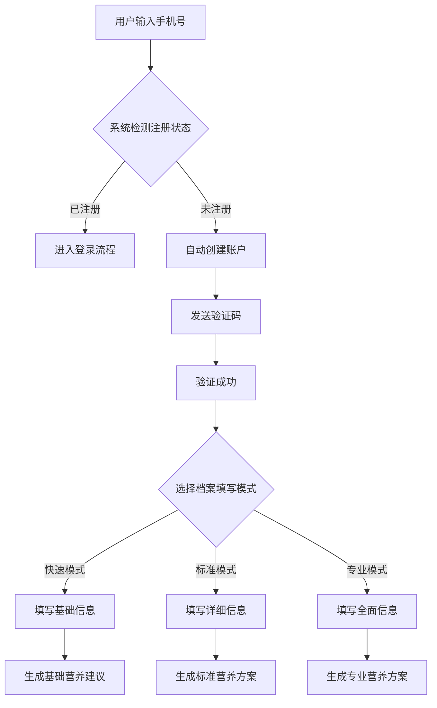

### 5.2 AI营养分析流程
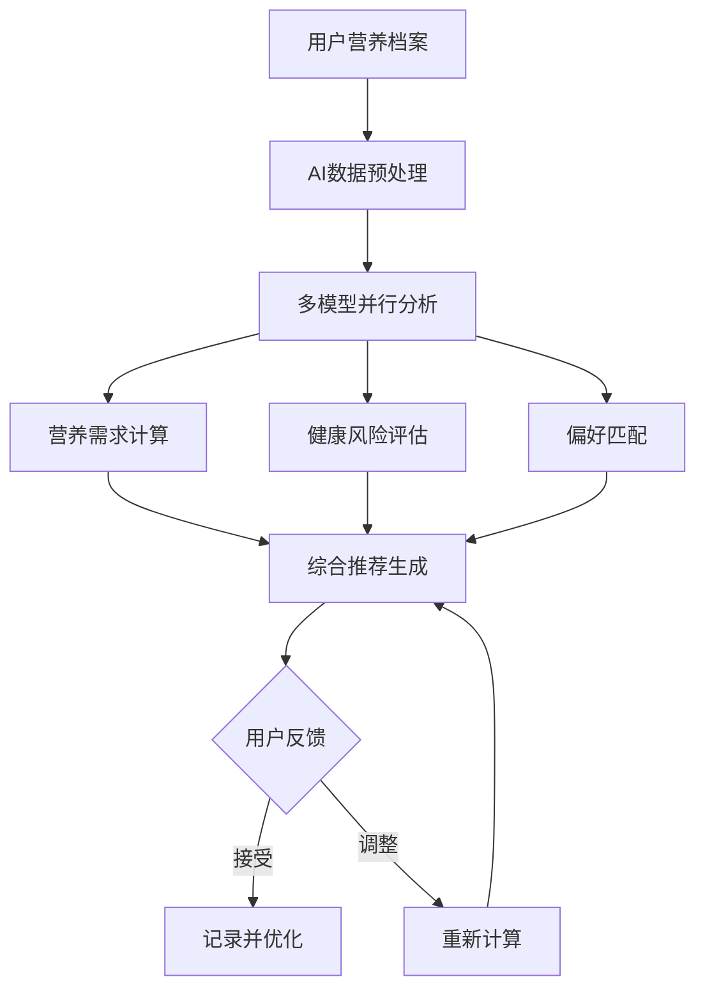

### 5.3 智能点餐订单流程
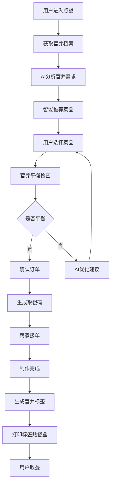

### 5.4 商家AI库存管理流程
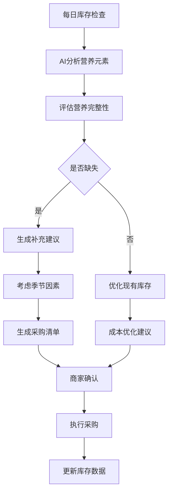

### 5.5 权限申请流程
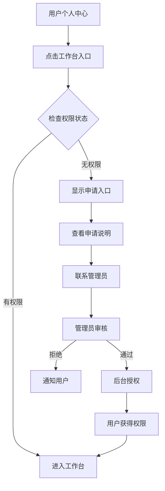

### 5.6 API调用时序图

#### 5.6.1 营养套餐推荐流程
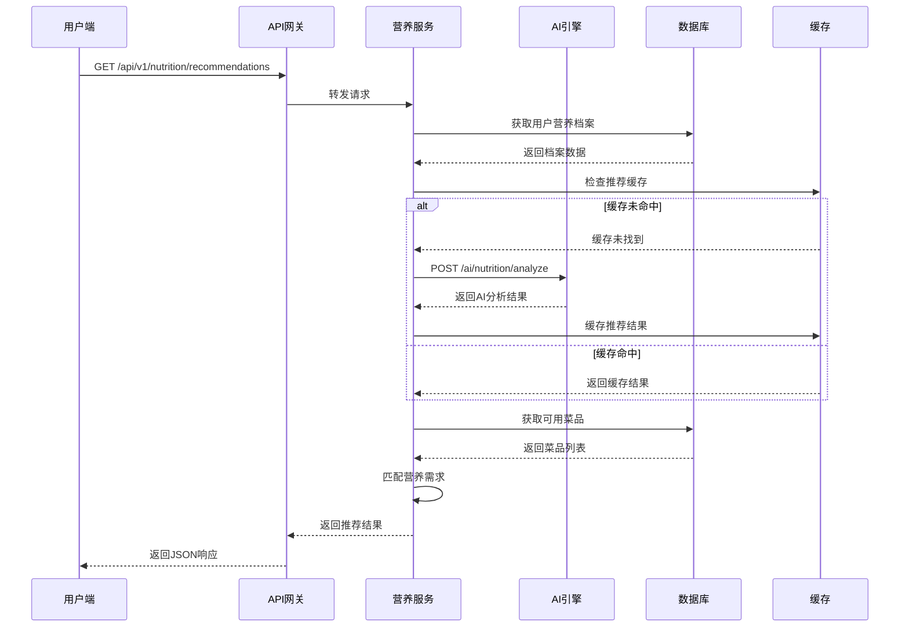

#### 5.6.2 订单处理与实时通知流程
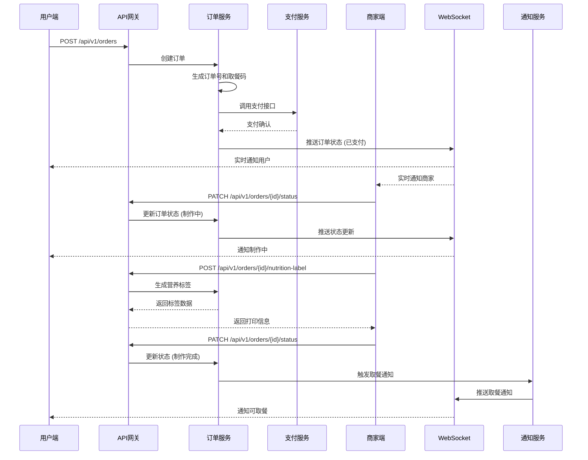

#### 5.6.3 AI档案完善流程
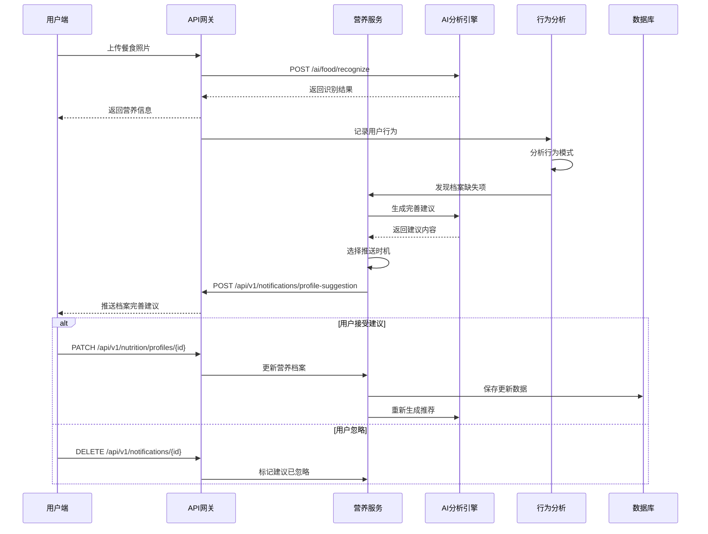

#### 5.6.4 商家AI库存管理流程
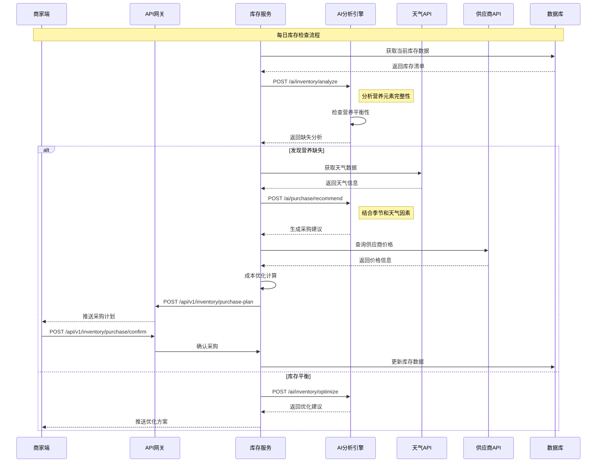

#### 5.6.5 营养师AI辅助咨询流程
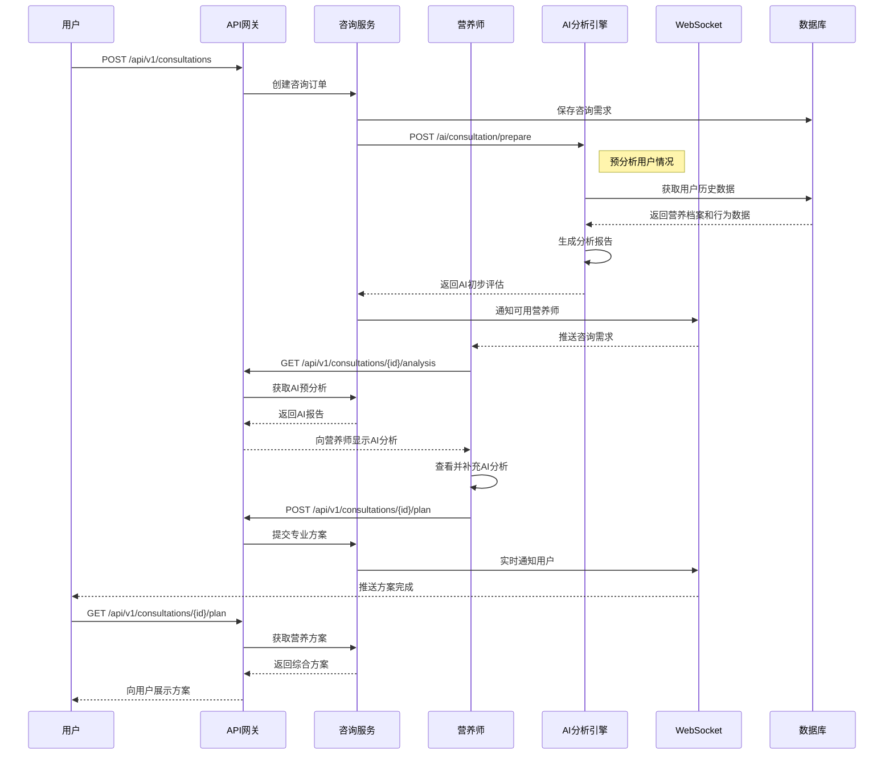

#### 5.6.6 社区论坛互动流程
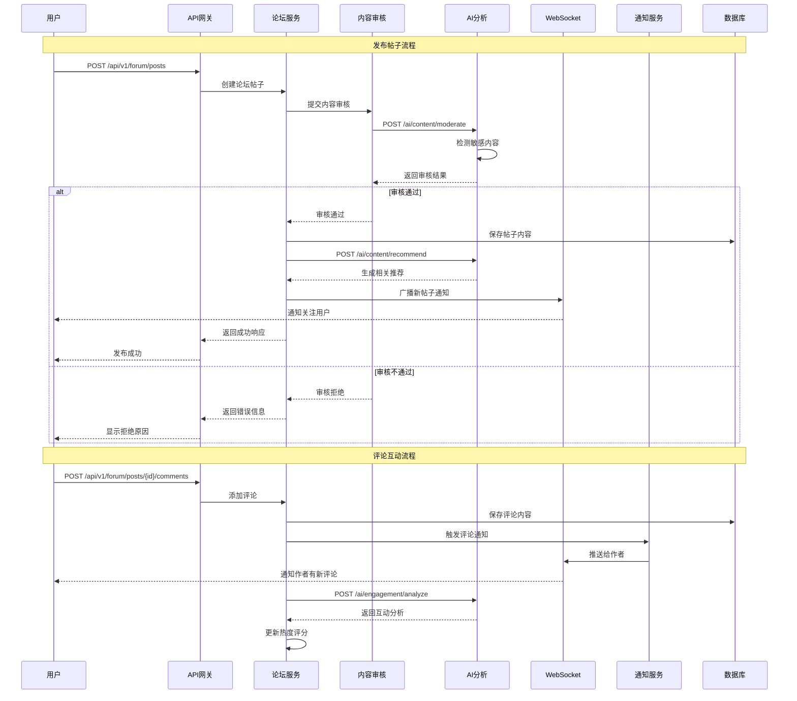

#### 5.6.7 智能认证注册流程
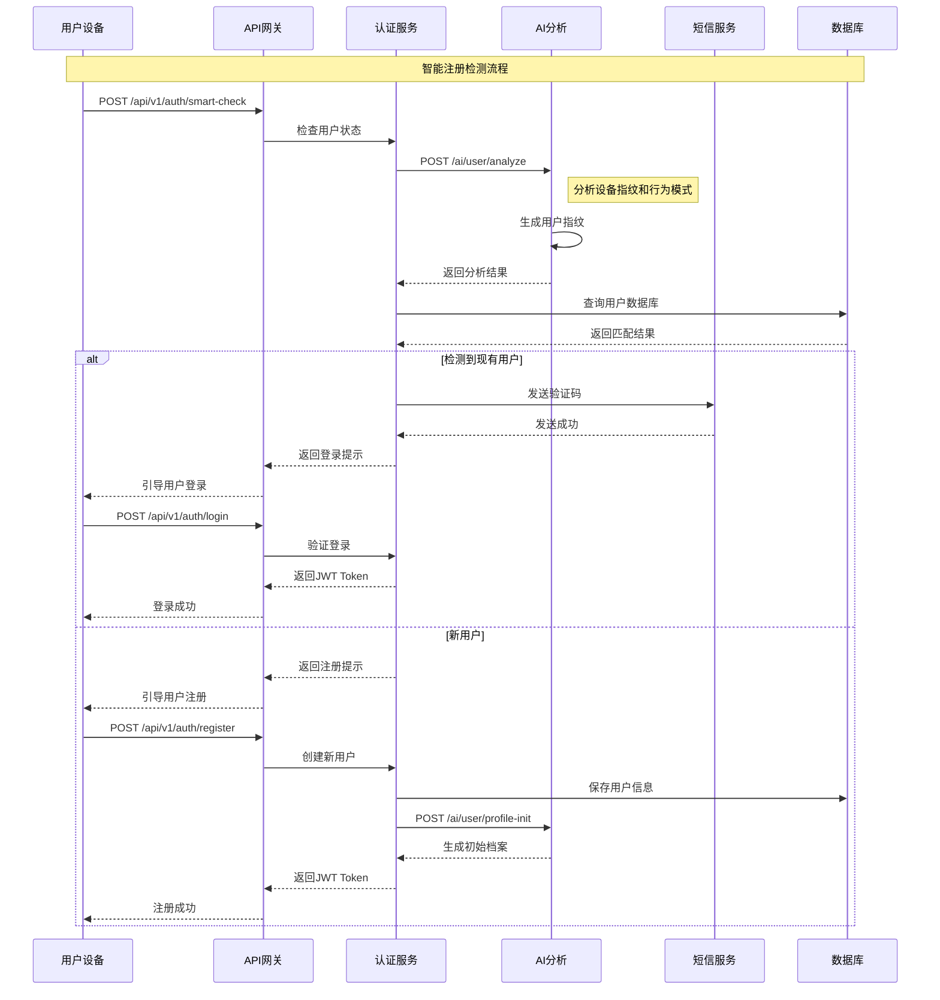

#### 5.6.8 权限管理工作台流程
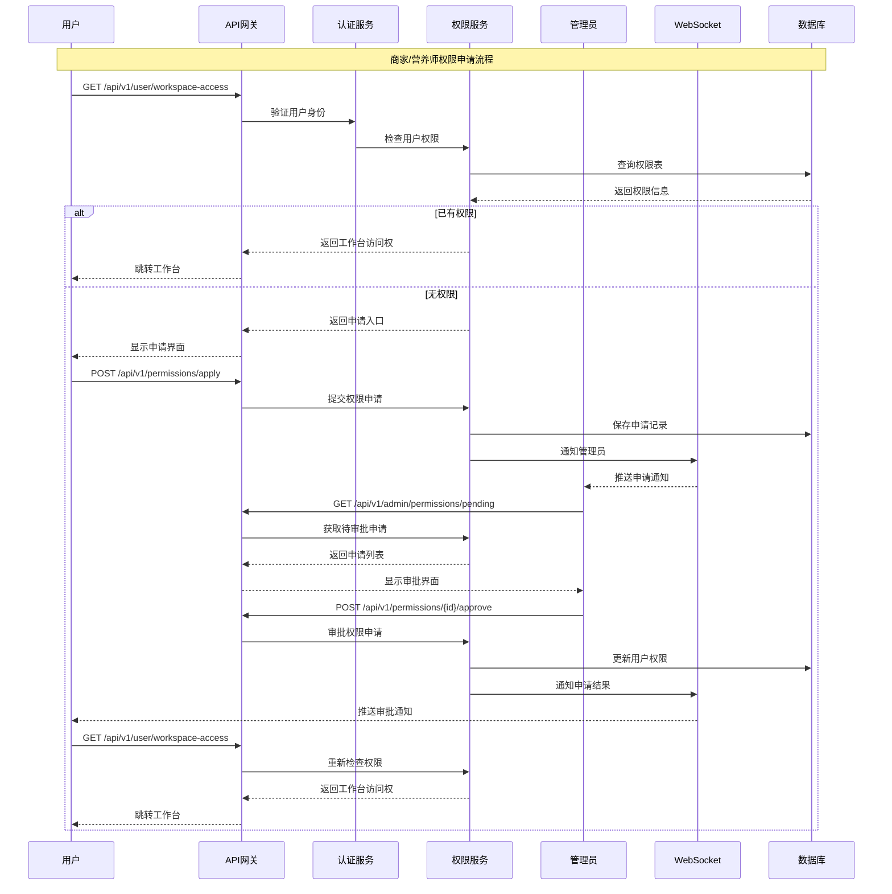

---

## 6. 功能优先级

### 6.1 P0 (MVP核心功能 - 必须实现)

**目标用户**: 早期试用用户和基础健康需求用户  
**开发周期**: 8-10周  
**验证目标**: 验证核心价值假设，达到用户基础留存

#### 6.1.1 用户认证与基础档案 (P0优先级1)
**实现范围**:
- 手机号智能注册/登录 (自动检测是否已注册)
- 基础营养档案创建 (身高、体重、年龄、性别、健康目标)
- 简单的用户偏好设置 (过敏源、饮食限制)
- 个人中心基础信息展示

**MVP成功标准**:
- 注册成功率 > 95%
- 基础档案完成率 > 80%
- 首次使用完成时间 < 3分钟
- 用户信息准确性 > 98%

#### 6.1.2 AI营养分析与推荐 (P0优先级2)
**实现范围**:
- 基于用户档案的基础营养需求计算
- 简单的AI营养建议生成 (每日推荐卡路里和三大营养素)
- 食物拍照识别 (常见食物，准确率 > 80%)
- 基础饮食记录和追踪

**MVP成功标准**:
- AI推荐响应时间 < 3秒
- 食物识别准确率 > 80% (前100种常见食物)
- 用户对推荐的接受率 > 60%
- 营养计算准确性 > 95%

#### 6.1.3 餐厅与菜品管理 (P0优先级3)
**实现范围**:
- 餐厅基础信息展示 (名称、地址、营业时间)
- 菜品列表展示 (名称、价格、基础营养信息)
- 简单的菜品筛选 (按分类、价格区间)
- 营养标签显示 (卡路里、蛋白质、碳水、脂肪)

**MVP成功标准**:
- 菜品数据完整性 > 95%
- 页面加载时间 < 2秒
- 营养信息准确性 > 90%
- 用户浏览转化率 > 25%

#### 6.1.4 基础订单系统 (P0优先级4)
**实现范围**:
- 简单的购物车功能
- 基础订单创建和管理
- 订单状态跟踪 (待支付、已支付、制作中、已完成)
- 简单的取餐码生成

**MVP成功标准**:
- 订单提交成功率 > 98%
- 订单状态更新及时性 < 30秒延迟
- 取餐码准确性 100%
- 订单完成率 > 85%

#### 6.1.5 支付系统集成 (P0优先级5)
**实现范围**:
- 微信支付集成
- 支付宝支付集成
- 基础支付状态管理
- 简单的支付异常处理

**MVP成功标准**:
- 支付成功率 > 96%
- 支付响应时间 < 5秒
- 支付异常自动重试成功率 > 80%
- 支付安全性 100% (无资金风险)

#### 6.1.6 基础通知系统 (P0优先级6)
**实现范围**:
- 订单状态变更通知
- 基础的营养提醒 (每日打卡提醒)
- 系统公告推送
- 应用内消息展示

**MVP成功标准**:
- 通知送达率 > 95%
- 通知及时性 < 1分钟延迟
- 用户通知点击率 > 30%
- 通知内容准确性 100%

#### 6.1.7 MVP整体验证指标
**业务成功标准**:
- 用户注册到首次下单转化率 > 25%
- 首次使用完整流程完成率 > 70%
- 次日留存率 > 40%
- 7日留存率 > 20%
- 用户满意度 (NPS) > 30
- 核心功能使用率 > 60%

**技术成功标准**:
- 系统整体可用性 > 99.5%
- API平均响应时间 < 500ms
- 移动应用崩溃率 < 0.5%
- 数据一致性 100%

#### 6.1.8 MVP实施时间表

**第1-2周: 基础架构搭建**
- 项目初始化和环境配置
- 数据库设计和创建
- 基础API框架搭建
- 移动端项目初始化
- CI/CD流水线配置

**第3-4周: 用户系统开发**
- 用户注册/登录功能
- 基础营养档案管理
- JWT认证系统
- 基础用户界面

**第5-6周: AI服务集成**
- AI营养分析接口集成
- 食物识别功能开发
- 营养推荐算法实现
- AI服务缓存和优化

**第7-8周: 餐厅和订单系统**
- 餐厅和菜品管理
- 购物车和订单系统
- 支付系统集成
- 取餐码生成

**第9-10周: 测试和发布**
- 完整系统测试
- 性能优化
- 安全性测试
- 内测用户反馈收集和修复
- MVP版本发布

### 6.2 P1 (重要功能 - 快速迭代)
1. **拍照识别功能** - AI食物识别和营养分析
2. **AI库存管理** - 智能采购建议
3. **营养师平台** - AI辅助咨询服务
4. **营养标签打印** - 个性化标签生成
5. **进阶营养档案** - 更多健康维度
6. **社区基础功能** - 官方内容发布

### 6.3 P2 (增值功能 - 体验优化)
1. **AI菜谱推荐** - 基于食材的智能推荐
2. **配送管理系统** - 社区定点配送
3. **专业营养档案** - 医学数据集成
4. **数据分析报告** - 多维度分析
5. **AI模型优化** - 持续学习和改进
6. **社区互动功能** - 用户交流平台

### 6.4 P3 (创新功能 - 长期规划)
1. **多模态AI** - 语音和视频识别
2. **IoT设备集成** - 智能硬件数据
3. **预测性健康管理** - AI健康预警
4. **全球化扩展** - 多语言多地区
5. **企业健康管理** - B2B解决方案

---

## 7. 验收标准

### 7.1 功能验收标准

#### 7.1.1 用户系统
- [ ] 自动注册成功率 > 98%
- [ ] 验证码发送成功率 > 95%
- [ ] 登录响应时间 < 2秒
- [ ] 第三方登录成功率 > 95%

#### 7.1.2 营养档案
- [ ] 基础档案完成时间 < 1分钟
- [ ] AI推荐接受率 > 60%
- [ ] 档案数据完整性 100%
- [ ] 多档案切换响应 < 500ms

#### 7.1.3 AI功能
- [ ] 营养计算准确率 > 95%
- [ ] 拍照识别准确率 > 85%
- [ ] 推荐响应时间 < 3秒
- [ ] 个性化匹配度 > 80%

#### 7.1.4 点餐系统
- [ ] 菜品加载时间 < 2秒
- [ ] 订单提交成功率 > 99%
- [ ] 支付成功率 > 96%
- [ ] 取餐码生成时间 < 1秒

#### 7.1.5 商家系统
- [ ] 库存分析准确率 > 90%
- [ ] 采购建议采纳率 > 70%
- [ ] 标签打印成功率 > 99%
- [ ] 数据同步延迟 < 30秒

### 7.2 性能验收标准
- **API响应**: P95 < 500ms，P99 < 1000ms
- **并发支持**: 10,000+ 同时在线用户
- **数据处理**: 支持百万级用户数据
- **AI推理**: 批量请求处理能力 > 1000 QPS
- **系统可用性**: 99.9% uptime

### 7.3 用户体验验收标准
- **首次使用**: 完成核心流程 < 5分钟
- **用户满意度**: NPS > 50
- **功能使用率**: 核心功能日活 > 60%
- **留存指标**: 次日留存 > 50%，7日留存 > 30%
- **转化率**: 注册到首单 > 25%

---

## 8. 业务规则

### 8.1 用户管理规则
1. **注册规则**
   - 手机号自动检测，未注册自动创建账户
   - 同一手机号仅能注册一个主账户
   - 支持最多10个家庭成员档案

2. **档案规则**
   - 基础档案为必填，其他为选填
   - 特殊状态自动调整营养建议
   - 档案修改保留历史记录
   - 敏感数据加密存储

### 8.2 AI推荐规则
1. **营养计算**
   - 遵循中国营养学会DRIs标准
   - 特殊人群使用专门算法
   - 考虑地域和季节因素
   - 实时调整推荐策略

2. **个性化规则**
   - 基础档案：通用推荐准确率70%
   - 标准档案：个性化推荐准确率85%
   - 专业档案：精准推荐准确率95%
   - 用户反馈实时优化

3. **AI无感交互规则**
   - **推送时机控制**:
     - 餐后30分钟推送营养分析
     - 使用1周后推送档案完善建议
     - 每周最多3次档案优化提醒
     - 避免用餐时间和深夜推送
   
   - **用户控制机制**:
     - 用户可设置AI介入程度（高/中/低/关闭）
     - 一键关闭所有AI主动提醒
     - 保留手动查看AI建议的入口
     - 用户明确拒绝后，同类建议30天内不重复
   
   - **内容质量保证**:
     - AI建议必须基于用户真实数据
     - 提供建议的具体依据说明
     - 用户可查看AI分析的详细逻辑
     - 建议内容简洁易懂，避免专业术语
   
   - **隐私保护**:
     - 行为分析数据本地处理
     - 不向第三方分享用户行为模式
     - 用户可随时删除行为分析数据
     - AI分析过程完全透明

### 8.3 商家运营规则
1. **库存管理**
   - 营养元素覆盖率不低于90%
   - 库存预警提前3天
   - 季节性调整每月更新
   - 成本控制在预算±10%

2. **订单处理**
   - 接单响应时间 < 5分钟
   - 制作时间明确告知
   - 营养标签必须准确
   - 取餐码24小时有效

### 8.4 营养师服务规则
1. **资质要求**
   - 必须持有有效资格证书
   - 定期资质复审（每年）
   - 继续教育学分要求
   - 服务质量评分 > 4.5

2. **咨询规范**
   - AI方案必须人工复核
   - 咨询记录保存3年
   - 隐私保护严格执行
   - 24小时内响应

### 8.5 内容管理规则
1. **官方内容**
   - 每日更新1-3个视频
   - 内容真实性100%
   - 更新时间固定
   - 支持用户反馈

2. **社区管理**
   - AI+人工双重审核
   - 违规内容1小时内处理
   - 专业内容标识认证
   - 积分激励机制

---

## 9. AI集成架构

### 9.1 AI服务架构
```
┌─────────────────────────────────────────────┐
│             AI网关层                         │
│  - 请求路由                                  │
│  - 负载均衡                                  │
│  - 限流熔断                                  │
└─────────────────┬───────────────────────────┘
                  │
┌─────────────────┴───────────────────────────┐
│            AI服务层                          │
├─────────────────────────────────────────────┤
│  用户AI服务    │ 商家AI服务   │ 营养师AI服务 │
├─────────────────────────────────────────────┤
│ - 营养推荐     │ - 库存分析   │ - 方案优化   │
│ - 拍照识别     │ - 采购建议   │ - 数据分析   │
│ - 菜谱推荐     │ - 销售预测   │ - 异常检测   │
└─────────────────────────────────────────────┘
                  │
┌─────────────────┴───────────────────────────┐
│           AI模型管理层                       │
│  - 模型版本控制                              │
│  - A/B测试                                   │
│  - 性能监控                                  │
│  - 自动切换                                  │
└─────────────────────────────────────────────┘
```

### 9.2 AI接口配置
1. **热更换机制**
   - 支持运行时切换AI提供商
   - 分层独立配置
   - 无缝切换，用户无感知
   - 自动故障转移

2. **支持的AI提供商**
   - DeepSeek API
   - 通义千问 API
   - 自定义模型部署
   - 多模型集成策略

3. **配置示例**
```json
{
  "ai_config": {
    "user_service": {
      "provider": "deepseek",
      "model": "deepseek-v2",
      "fallback": "qwen-max"
    },
    "merchant_service": {
      "provider": "qwen",
      "model": "qwen-plus",
      "fallback": "deepseek-v2"
    },
    "nutritionist_service": {
      "provider": "custom",
      "endpoint": "https://ai.internal/v1",
      "fallback": "deepseek-v2"
    }
  }
}
```

---

## 10. 权限系统

### 10.1 角色定义
1. **普通用户**
   - 访问个人功能
   - 创建营养档案
   - 使用AI服务
   - 社区互动

2. **商家用户**
   - 继承普通用户权限
   - 访问商家工作台
   - 管理店铺信息
   - 处理订单

3. **营养师用户**
   - 继承普通用户权限
   - 访问营养师工作台
   - 管理客户
   - 使用专业工具

4. **系统管理员**
   - 全系统权限
   - 用户管理
   - 内容审核
   - 系统配置

### 10.2 权限申请流程
1. **入口设计**
   - 个人中心左上角入口按钮
   - 点击展开左侧边栏
   - 显示工作台入口或申请入口

2. **申请流程**
   - 查看申请说明（图片+文字）
   - 获取联系方式
   - 线下审核流程
   - 管理员后台授权

3. **权限管理**
   - 基于手机号授权
   - 支持批量授权
   - 权限有效期管理
   - 操作日志记录

---

## 11. 非功能性需求

### 11.1 性能需求
- **系统容量**: 支持100万+注册用户
- **并发处理**: 10,000+ 同时在线
- **数据处理**: 
  - 实时数据 < 100ms延迟
  - 批量分析 < 5分钟
  - AI推理 < 3秒
- **存储扩展**: PB级数据存储能力

### 11.2 安全需求
- **数据安全**:
  - 健康数据AES-256加密
  - 敏感信息脱敏处理
  - 定期安全审计
- **传输安全**:
  - 全站HTTPS强制
  - API密钥管理
  - 防重放攻击
- **访问控制**:
  - 多因素认证
  - 细粒度权限
  - 审计日志

### 11.3 可用性需求
- **系统SLA**: 99.95%可用性
- **故障恢复**: 
  - RTO < 15分钟
  - RPO < 1分钟
- **容灾备份**:
  - 多地域部署
  - 实时数据同步
  - 自动故障切换
- **监控告警**:
  - 全链路监控
  - 智能告警
  - 自动化运维

### 11.4 扩展性需求
- **架构设计**:
  - 微服务架构
  - 容器化部署
  - 服务网格
- **数据架构**:
  - 分库分表
  - 读写分离
  - 缓存优化
- **业务扩展**:
  - 插件化设计
  - API开放平台
  - 多租户支持

### 11.5 兼容性需求
- **客户端支持**:
  - iOS 13.0+
  - Android 8.0+
  - 主流浏览器
- **国际化**:
  - 多语言支持
  - 本地化适配
  - 时区处理

---

## 12. 风险和约束

### 12.1 MVP技术风险评估

#### 12.1.1 高风险项 (需要应急预案)
**风险1: AI服务不稳定**
- 风险描述：DeepSeek API服务中断或响应缓慢
- 影响程度：高 (核心功能无法使用)
- 发生概率：中等
- 应急预案：
  - 备用AI服务商 (通义千问) 自动切换
  - 本地营养计算算法作为最后保底
  - 缓存常用推荐结果，离线可用
- 监控指标：API响应时间 > 5秒或成功率 < 95%

**风险2: 支付系统集成失败**
- 风险描述：微信/支付宝接口对接出现问题
- 影响程度：高 (无法完成交易闭环)
- 发生概率：低
- 应急预案：
  - 优先完成一个支付渠道，确保基础功能
  - 增加线下支付选项作为备选
  - 与第三方支付服务商建立应急联系机制
- 监控指标：支付成功率 < 90%

**风险3: 数据库性能瓶颈**
- 风险描述：用户量增长导致数据库响应缓慢
- 影响程度：中等 (影响用户体验)
- 发生概率：中等
- 应急预案：
  - 实施数据库读写分离
  - 增加Redis缓存层
  - 数据库连接池优化
- 监控指标：数据库响应时间 > 200ms

#### 12.1.2 中等风险项
**风险4: 移动端兼容性问题**
- 应急预案：重点适配主流机型，逐步扩展兼容性
- 监控指标：不同机型崩溃率差异 > 2倍

**风险5: 营养数据准确性质疑**
- 应急预案：引入权威营养数据库，增加数据来源说明
- 监控指标：用户反馈营养数据有误 > 5%

#### 12.1.3 系统复杂度风险
- **多端协同开发难度**:
  - 缓解：使用统一的API规范，前后端并行开发
  - 建立daily sync机制，及时同步接口变更

- **技术栈统一挑战**:
  - 缓解：制定详细的技术规范文档
  - 建立代码review机制，确保代码质量

- **性能优化复杂**:
  - 缓解：分阶段实施，先保证功能完整性
  - 建立性能基准测试，持续监控

### 12.2 业务风险
- **市场风险**:
  - 用户习惯培养周期
  - 竞品激烈竞争
  - 商业模式验证
  - 缓解：MVP快速验证，敏捷迭代

- **合规风险**:
  - 健康数据监管要求
  - 食品安全责任
  - 个人信息保护
  - 缓解：法务提前介入，合规设计

### 12.3 运营风险
- **供应链风险**:
  - 加盟商管理
  - 食材品质控制
  - 配送服务质量
  - 缓解：严格准入，实时监控

- **服务质量**:
  - 营养师资质参差
  - AI推荐质量波动
  - 用户投诉处理
  - 缓解：严格审核，持续培训

---

## 13. 成功指标

### 13.1 用户增长指标
- **获客指标**:
  - 月新增用户 > 5万
  - 获客成本 < 50元
  - 激活率 > 80%
- **活跃指标**:
  - DAU > 10万
  - MAU > 50万
  - 使用时长 > 15分钟/天

### 13.2 业务发展指标
- **交易指标**:
  - GMV月增长 > 30%
  - 订单转化率 > 30%
  - 复购率 > 60%
  - 客单价 > 100元
- **服务指标**:
  - 营养师月活 > 500人
  - 咨询完成率 > 90%
  - 用户满意度 > 4.5/5

### 13.3 运营效率指标
- **技术指标**:
  - API成功率 > 99.9%
  - 页面加载 < 2秒
  - 崩溃率 < 0.1%
- **AI效果**:
  - 推荐采纳率 > 70%
  - 识别准确率 > 90%
  - 库存优化率 > 20%

### 13.4 财务指标
- **营收指标**:
  - 月营收增长 > 25%
  - 毛利率 > 40%
  - 单位经济正向
- **成本控制**:
  - 运营成本占比 < 30%
  - 技术成本占比 < 20%
  - 营销ROI > 3:1

---

## 14. API接口规范

### 14.1 核心接口定义

#### 14.1.1 用户认证接口
```yaml
POST /api/v1/auth/auto-register
描述: 自动注册/登录接口
请求:
  phone: string # 手机号
  code?: string # 验证码（首次可选）
响应:
  token: string
  refreshToken: string
  isNewUser: boolean
  userId: string
```

#### 14.1.2 营养档案接口
```yaml
POST /api/v1/nutrition/profile
描述: 创建/更新营养档案
请求:
  level: enum[basic|standard|professional]
  basicInfo:
    height: number
    weight: number
    age: number
    gender: enum[male|female]
    goal: enum[lose_weight|gain_muscle|maintain]
  advancedInfo?: object
  professionalInfo?: object
响应:
  profileId: string
  completeness: number # 完整度百分比
  aiSuggestions: array
```

#### 14.1.3 AI推荐接口
```yaml
POST /api/v1/ai/nutrition/recommend
描述: 获取AI营养推荐
请求:
  userId: string
  profileId: string
  mealType: enum[breakfast|lunch|dinner|snack]
  preferences?: object
响应:
  recommendations: array
  nutritionScore: number
  balanceAnalysis: object
```

#### 14.1.4 拍照识别接口
```yaml
POST /api/v1/ai/food/recognize
描述: 食物拍照识别
请求:
  image: base64
  userId: string
响应:
  foods: array[{
    name: string
    confidence: number
    nutrition: object
    calories: number
  }]
  totalNutrition: object
```

#### 14.1.5 商家库存AI接口
```yaml
GET /api/v1/merchant/ai/inventory/suggest
描述: AI库存采购建议
请求:
  merchantId: string
  timeRange: enum[week|month]
响应:
  suggestions: array[{
    ingredient: string
    quantity: number
    reason: string
    nutritionGap: array
    priority: enum[high|medium|low]
  }]
  nutritionCoverage: number
  costEstimate: number
```

### 14.2 WebSocket实时接口

#### 14.2.1 订单状态推送
```yaml
WS /ws/order/status
消息格式:
  type: order_status_update
  orderId: string
  status: enum[received|preparing|ready|completed]
  estimatedTime?: number
  nutritionLabel?: object
```

#### 14.2.2 AI分析进度
```yaml
WS /ws/ai/progress
消息格式:
  type: ai_analysis_progress
  taskId: string
  progress: number # 0-100
  stage: string
  result?: object
```

---

## 15. 附录

### 15.1 术语表
- **BMR**: 基础代谢率 (Basal Metabolic Rate)
- **TDEE**: 总日能量消耗 (Total Daily Energy Expenditure)
- **DRIs**: 膳食营养素参考摄入量 (Dietary Reference Intakes)
- **NPS**: 净推荐值 (Net Promoter Score)
- **GMV**: 商品交易总额 (Gross Merchandise Value)
- **QPS**: 每秒查询率 (Queries Per Second)
- **RTO**: 恢复时间目标 (Recovery Time Objective)
- **RPO**: 恢复点目标 (Recovery Point Objective)
- **ROI**: 投资回报率 (Return on Investment)

### 15.2 参考标准
- 《中国居民膳食指南(2022)》
- 《中国食物成分表(第6版)》
- WHO/FAO营养需求建议
- 《食品安全国家标准》系列
- 《网络安全法》《个人信息保护法》
- 中国营养学会DRIs(2023版)

### 15.3 技术栈建议
基于Context7分析，推荐使用：
- **前端**: Flutter 3.5+ (移动端)，Next.js 15 (Web端)
- **后端**: Node.js + Fastify/NestJS
- **数据库**: PostgreSQL + pgvector + Redis
- **AI服务**: FastAPI + PyTorch/TensorFlow
- **消息队列**: RabbitMQ/Kafka
- **容器化**: Docker + Kubernetes
- **监控**: Prometheus + Grafana

### 15.4 版本历史
| 版本 | 日期 | 变更内容 | 作者 |
|------|------|----------|------|
| 1.0.0 | 2025-07-11 | 初始版本创建 | AI助手 |
| 2.0.0 | 2025-07-11 | 全面升级：添加AI功能、灵活档案、智能库存、权限系统等 | AI助手 |

---

**文档状态**: ✅ 已完成，AI编码就绪  
**下一步**: 
1. 创建详细的API接口文档
2. 设计数据库架构
3. 制定技术实施路线图