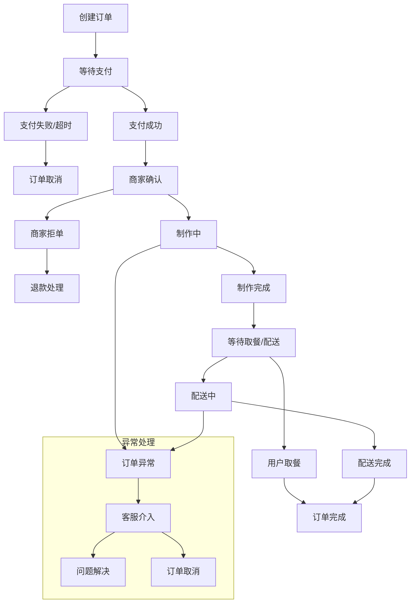

# AI智能营养餐厅系统 - 完整订单业务流程设计

> **文档版本**: 3.0.0  
> **创建日期**: 2025-07-23  
> **文档状态**: ✅ 业务流程设计完成  
> **目标受众**: 产品经理、后端开发团队、前端开发团队、AI编码工具

## 📋 目录

- [1. 订单业务概述](#1-订单业务概述)
- [2. 订单状态机设计](#2-订单状态机设计)
- [3. 业务流程定义](#3-业务流程定义)
- [4. 异常处理机制](#4-异常处理机制)
- [5. 实时通信设计](#5-实时通信设计)
- [6. 数据模型设计](#6-数据模型设计)
- [7. API设计规范](#7-api设计规范)
- [8. 前端状态管理](#8-前端状态管理)

---

## 1. 订单业务概述

### 1.1 业务目标

```yaml
核心目标:
  - 提供流畅的订餐体验
  - 支持多种订餐模式
  - 确保订单数据准确性
  - 实现订单状态实时同步
  - 保障支付安全性

业务价值:
  - 提升用户满意度
  - 降低订单处理成本
  - 提高餐厅运营效率
  - 增强平台竞争力

关键指标:
  - 订单转化率 > 85%
  - 订单处理时间 < 30分钟
  - 订单异常率 < 5%
  - 用户满意度 > 4.5分
```

### 1.2 订单类型定义

```yaml
按服务方式分类:
  堂食订单 (DINE_IN):
    特点: 用户到店用餐
    流程: 点餐 → 支付 → 制作 → 服务 → 结束
    特殊需求: 桌台管理、现场服务

  自取订单 (TAKEAWAY):
    特点: 用户到店取餐
    流程: 点餐 → 支付 → 制作 → 取餐 → 结束
    特殊需求: 取餐时间预约、取餐码

  外送订单 (DELIVERY):
    特点: 固定时间地点的集中式配送
    流程: 提前预定点餐 → 支付 → 制作 → 配送 → 送达 → 取餐码取餐
    特殊需求: 配送跟踪，提前预定

按紧急程度分类:
  普通订单: 标准制作时间
  急单: 加急处理，额外费用
  预约订单: 指定时间制作

按客户类型分类:
  个人订单: 个人用户下单
  企业订单: 企业客户批量订餐
  会员订单: 享受会员权益
```

### 1.3 订单生命周期



---

## 2. 订单状态机设计

### 2.1 状态定义

```typescript
// 订单状态枚举
export enum OrderStatus {
  // 初始状态
  DRAFT = 'draft',                    // 草稿（购物车状态）
  
  // 支付相关状态
  PENDING_PAYMENT = 'pending_payment', // 等待支付
  PAYMENT_PROCESSING = 'payment_processing', // 支付处理中
  PAID = 'paid',                      // 已支付
  PAYMENT_FAILED = 'payment_failed',   // 支付失败
  
  // 商家处理状态
  PENDING_CONFIRM = 'pending_confirm', // 等待商家确认
  CONFIRMED = 'confirmed',            // 商家已确认
  REJECTED = 'rejected',              // 商家拒单
  
  // 制作状态
  PREPARING = 'preparing',            // 制作中
  READY = 'ready',                   // 制作完成，等待取餐/配送
  
  // 配送/取餐状态
  PICKED_UP = 'picked_up',           // 已取餐（自取）
  OUT_FOR_DELIVERY = 'out_for_delivery', // 配送中（外卖）
  DELIVERED = 'delivered',           // 已送达（外卖）
  
  // 最终状态
  COMPLETED = 'completed',           // 订单完成
  CANCELLED = 'cancelled',           // 已取消
  REFUNDED = 'refunded',            // 已退款
  
  // 异常状态
  DISPUTED = 'disputed',             // 有争议
  CUSTOMER_SERVICE = 'customer_service', // 客服介入
}

// 支付状态枚举
export enum PaymentStatus {
  UNPAID = 'unpaid',                // 未支付
  PROCESSING = 'processing',        // 支付处理中
  PAID = 'paid',                   // 已支付
  FAILED = 'failed',               // 支付失败
  REFUNDING = 'refunding',         // 退款中
  REFUNDED = 'refunded',           // 已退款
  PARTIAL_REFUND = 'partial_refund', // 部分退款
}
```

### 2.2 状态转换规则

```typescript
// 状态转换配置
export const OrderStatusTransitions: Record<OrderStatus, OrderStatus[]> = {
  [OrderStatus.DRAFT]: [
    OrderStatus.PENDING_PAYMENT,
    OrderStatus.CANCELLED,
  ],
  
  [OrderStatus.PENDING_PAYMENT]: [
    OrderStatus.PAYMENT_PROCESSING,
    OrderStatus.PAYMENT_FAILED,
    OrderStatus.CANCELLED,
  ],
  
  [OrderStatus.PAYMENT_PROCESSING]: [
    OrderStatus.PAID,
    OrderStatus.PAYMENT_FAILED,
  ],
  
  [OrderStatus.PAID]: [
    OrderStatus.PENDING_CONFIRM,
    OrderStatus.CONFIRMED, // 自动确认的情况
    OrderStatus.REFUNDED,
  ],
  
  [OrderStatus.PENDING_CONFIRM]: [
    OrderStatus.CONFIRMED,
    OrderStatus.REJECTED,
    OrderStatus.CUSTOMER_SERVICE,
  ],
  
  [OrderStatus.CONFIRMED]: [
    OrderStatus.PREPARING,
    OrderStatus.CANCELLED,
    OrderStatus.CUSTOMER_SERVICE,
  ],
  
  [OrderStatus.PREPARING]: [
    OrderStatus.READY,
    OrderStatus.CUSTOMER_SERVICE,
    OrderStatus.CANCELLED,
  ],
  
  [OrderStatus.READY]: [
    OrderStatus.PICKED_UP,      // 自取
    OrderStatus.OUT_FOR_DELIVERY, // 外卖
    OrderStatus.CUSTOMER_SERVICE,
  ],
  
  [OrderStatus.OUT_FOR_DELIVERY]: [
    OrderStatus.DELIVERED,
    OrderStatus.CUSTOMER_SERVICE,
  ],
  
  [OrderStatus.PICKED_UP]: [
    OrderStatus.COMPLETED,
  ],
  
  [OrderStatus.DELIVERED]: [
    OrderStatus.COMPLETED,
    OrderStatus.DISPUTED,
  ],
  
  [OrderStatus.REJECTED]: [
    OrderStatus.REFUNDED,
    OrderStatus.CUSTOMER_SERVICE,
  ],
  
  [OrderStatus.PAYMENT_FAILED]: [
    OrderStatus.PENDING_PAYMENT,
    OrderStatus.CANCELLED,
  ],
  
  [OrderStatus.DISPUTED]: [
    OrderStatus.COMPLETED,
    OrderStatus.REFUNDED,
    OrderStatus.CUSTOMER_SERVICE,
  ],
  
  [OrderStatus.CUSTOMER_SERVICE]: [
    OrderStatus.CONFIRMED,
    OrderStatus.PREPARING,
    OrderStatus.READY,
    OrderStatus.COMPLETED,
    OrderStatus.CANCELLED,
    OrderStatus.REFUNDED,
  ],
  
  // 终态
  [OrderStatus.COMPLETED]: [],
  [OrderStatus.CANCELLED]: [],
  [OrderStatus.REFUNDED]: [],
};

// 状态转换验证器
export class OrderStatusValidator {
  static canTransition(from: OrderStatus, to: OrderStatus): boolean {
    const allowedTransitions = OrderStatusTransitions[from] || [];
    return allowedTransitions.includes(to);
  }
  
  static validateTransition(from: OrderStatus, to: OrderStatus): void {
    if (!this.canTransition(from, to)) {
      throw new Error(
        `Invalid status transition from ${from} to ${to}`
      );
    }
  }
  
  static getAvailableTransitions(status: OrderStatus): OrderStatus[] {
    return OrderStatusTransitions[status] || [];
  }
}
```

### 2.3 状态机实现

```typescript
// 订单状态机
export class OrderStateMachine {
  constructor(
    private readonly order: Order,
    private readonly orderRepository: OrderRepository,
    private readonly eventBus: EventBus,
    private readonly notificationService: NotificationService
  ) {}

  async transition(
    newStatus: OrderStatus,
    context: StatusTransitionContext = {}
  ): Promise<void> {
    const currentStatus = this.order.status;
    
    // 验证状态转换
    OrderStatusValidator.validateTransition(currentStatus, newStatus);
    
    // 执行前置条件检查
    await this.checkPreconditions(currentStatus, newStatus, context);
    
    // 更新订单状态
    const previousStatus = this.order.status;
    this.order.status = newStatus;
    this.order.statusHistory.push({
      from: previousStatus,
      to: newStatus,
      timestamp: new Date(),
      operator: context.operator,
      reason: context.reason,
      metadata: context.metadata,
    });
    
    // 保存到数据库
    await this.orderRepository.save(this.order);
    
    // 执行状态转换后的业务逻辑
    await this.executePostTransitionActions(previousStatus, newStatus, context);
    
    // 发布状态变更事件
    await this.eventBus.publish('order.status.changed', {
      orderId: this.order.id,
      previousStatus,
      newStatus,
      timestamp: new Date(),
      context,
    });
    
    // 发送通知
    await this.sendStatusChangeNotifications(previousStatus, newStatus);
  }

  private async checkPreconditions(
    from: OrderStatus,
    to: OrderStatus,
    context: StatusTransitionContext
  ): Promise<void> {
    switch (to) {
      case OrderStatus.CONFIRMED:
        // 检查商家是否有能力处理订单
        await this.checkRestaurantCapacity();
        break;
        
      case OrderStatus.OUT_FOR_DELIVERY:
        // 检查配送员是否可用
        await this.checkDeliveryCapacity();
        break;
        
      case OrderStatus.REFUNDED:
        // 检查退款条件
        await this.checkRefundEligibility();
        break;
    }
  }

  private async executePostTransitionActions(
    from: OrderStatus,
    to: OrderStatus,
    context: StatusTransitionContext
  ): Promise<void> {
    switch (to) {
      case OrderStatus.PAID:
        await this.handlePaymentSuccess();
        break;
        
      case OrderStatus.CONFIRMED:
        await this.handleOrderConfirmation();
        break;
        
      case OrderStatus.PREPARING:
        await this.handlePreparationStart();
        break;
        
      case OrderStatus.READY:
        await this.handleOrderReady();
        break;
        
      case OrderStatus.COMPLETED:
        await this.handleOrderCompletion();
        break;
        
      case OrderStatus.CANCELLED:
        await this.handleOrderCancellation(context.reason);
        break;
    }
  }

  private async sendStatusChangeNotifications(
    from: OrderStatus,
    to: OrderStatus
  ): Promise<void> {
    const notifications = this.getNotificationConfig(to);
    
    for (const notification of notifications) {
      await this.notificationService.send({
        type: notification.type,
        recipient: notification.recipient,
        title: notification.title,
        content: this.generateNotificationContent(to, notification.template),
        channels: notification.channels,
      });
    }
  }
}

// 状态转换上下文
interface StatusTransitionContext {
  operator?: string;        // 操作者
  reason?: string;         // 状态变更原因
  metadata?: any;          // 额外元数据
  skipValidation?: boolean; // 跳过验证（管理员操作）
}

// 状态历史记录
interface OrderStatusHistory {
  from: OrderStatus;
  to: OrderStatus;
  timestamp: Date;
  operator?: string;
  reason?: string;
  metadata?: any;
}
```

---

## 3. 业务流程定义

### 3.1 标准订单流程

```yaml
堂食订单流程:
  1. 用户选择餐品:
     - 浏览菜单
     - 选择菜品和数量
     - 添加备注和定制要求
     - 确认营养信息

  2. 创建订单:
     - 生成订单号
     - 计算总价（含税费）
     - 选择就餐时间
     - 选择桌台（如适用）

  3. 支付处理:
     - 选择支付方式
     - 执行支付
     - 支付确认
     - 生成支付凭证

  4. 商家确认:
     - 自动确认（营业时间内）
     - 检查库存和制作能力
     - 预估制作时间
     - 发送确认通知

  5. 制作过程:
     - 开始制作
     - 更新制作进度
     - 制作完成通知
     - 准备服务

  6. 用餐服务:
     - 提供用餐服务
     - 营养指导（如需要）
     - 用餐体验反馈
     - 完成订单

外卖订单流程:
  1-4. (同堂食流程)

  5. 制作和配送:
     - 制作菜品
     - 包装准备
     - 分配配送员
     - 开始配送

  6. 配送跟踪:
     - 实时位置跟踪
     - 预计送达时间
     - 配送状态更新
     - 送达确认

  7. 订单完成:
     - 确认收货
     - 评价反馈
     - 营养记录更新
     - 积分结算

自取订单流程:
  1-4. (同堂食流程)

  5. 制作通知:
     - 制作菜品
     - 生成取餐码
     - 发送取餐通知
     - 等待用户取餐

  6. 取餐验证:
     - 验证取餐码
     - 确认身份
     - 交付餐品
     - 完成订单
```

### 3.2 业务规则定义

```typescript
// 订单业务规则
export class OrderBusinessRules {
  
  // 订单创建规则
  static validateOrderCreation(orderData: CreateOrderRequest): ValidationResult {
    const errors: string[] = [];
    
    // 最小订单金额
    if (orderData.totalAmount < 10) {
      errors.push('订单金额不能少于10元');
    }
    
    // 最大订单金额
    if (orderData.totalAmount > 1000) {
      errors.push('单笔订单金额不能超过1000元');
    }
    
    // 菜品数量限制
    const totalItems = orderData.items.reduce((sum, item) => sum + item.quantity, 0);
    if (totalItems > 50) {
      errors.push('单笔订单菜品数量不能超过50份');
    }
    
    // 营业时间检查
    if (!this.isWithinBusinessHours(orderData.restaurantId, orderData.orderType)) {
      errors.push('当前时间不在营业范围内');
    }
    
    // 配送范围检查（外卖订单）
    if (orderData.orderType === OrderType.DELIVERY) {
      if (!this.isWithinDeliveryRange(orderData.restaurantId, orderData.deliveryAddress)) {
        errors.push('配送地址超出服务范围');
      }
    }
    
    return {
      isValid: errors.length === 0,
      errors
    };
  }
  
  // 支付超时规则
  static getPaymentTimeout(orderType: OrderType): number {
    switch (orderType) {
      case OrderType.DINE_IN:
        return 30 * 60 * 1000; // 30分钟
      case OrderType.TAKEAWAY:
        return 15 * 60 * 1000; // 15分钟
      case OrderType.DELIVERY:
        return 20 * 60 * 1000; // 20分钟
      default:
        return 15 * 60 * 1000;
    }
  }
  
  // 自动确认规则
  static shouldAutoConfirm(order: Order): boolean {
    const restaurant = order.restaurant;
    
    // 24小时营业的餐厅自动确认
    if (restaurant.isOpen24Hours) {
      return true;
    }
    
    // 营业时间内且启用自动确认
    if (restaurant.autoConfirmEnabled && this.isWithinBusinessHours(restaurant.id, order.type)) {
      return true;
    }
    
    // 订单金额小于自动确认限额
    if (order.totalAmount <= restaurant.autoConfirmLimit) {
      return true;
    }
    
    return false;
  }
  
  // 制作时间估算
  static estimatePreparationTime(order: Order): number {
    let totalTime = 0;
    
    for (const item of order.items) {
      const itemTime = item.menuItem.preparationTime * item.quantity;
      totalTime = Math.max(totalTime, itemTime); // 并行制作，取最长时间
    }
    
    // 基础准备时间
    totalTime += 5; // 5分钟基础时间
    
    // 复杂度调整
    if (order.items.length > 10) {
      totalTime += 10; // 复杂订单额外时间
    }
    
    // 忙碌时段调整
    const currentHour = new Date().getHours();
    if ((currentHour >= 11 && currentHour <= 13) || (currentHour >= 17 && currentHour <= 19)) {
      totalTime *= 1.3; // 用餐高峰期增加30%时间
    }
    
    return Math.ceil(totalTime);
  }
  
  // 退款规则
  static canRefund(order: Order): RefundEligibility {
    const now = new Date();
    const timeSinceCreation = now.getTime() - order.createdAt.getTime();
    
    // 已完成的订单不能退款
    if (order.status === OrderStatus.COMPLETED) {
      return {
        eligible: false,
        reason: '订单已完成，无法退款'
      };
    }
    
    // 制作中的订单需要人工审核
    if (order.status === OrderStatus.PREPARING) {
      return {
        eligible: true,
        requiresApproval: true,
        reason: '订单制作中，需要人工审核退款'
      };
    }
    
    // 支付后30分钟内可以自动退款
    if (timeSinceCreation <= 30 * 60 * 1000 && order.status === OrderStatus.PAID) {
      return {
        eligible: true,
        automatic: true,
        reason: '支付后30分钟内自动退款'
      };
    }
    
    return {
      eligible: true,
      requiresApproval: true,
      reason: '需要人工审核退款申请'
    };
  }
}

interface ValidationResult {
  isValid: boolean;
  errors: string[];
}

interface RefundEligibility {
  eligible: boolean;
  automatic?: boolean;
  requiresApproval?: boolean;
  reason: string;
}
```

### 3.3 定时任务规则

```typescript
// 订单定时任务
export class OrderScheduledTasks {
  
  // 支付超时检查（每分钟执行）
  @Cron('0 * * * * *')
  async checkPaymentTimeouts(): Promise<void> {
    const pendingOrders = await this.orderRepository.findPendingPaymentOrders();
    
    for (const order of pendingOrders) {
      const paymentTimeout = OrderBusinessRules.getPaymentTimeout(order.type);
      const isTimeout = Date.now() - order.createdAt.getTime() > paymentTimeout;
      
      if (isTimeout) {
        await this.orderStateMachine.transition(order, OrderStatus.CANCELLED, {
          reason: '支付超时自动取消',
          operator: 'system'
        });
      }
    }
  }
  
  // 自动确认检查（每30秒执行）
  @Cron('*/30 * * * * *')
  async checkAutoConfirmation(): Promise<void> {
    const paidOrders = await this.orderRepository.findPaidUnconfirmedOrders();
    
    for (const order of paidOrders) {
      if (OrderBusinessRules.shouldAutoConfirm(order)) {
        await this.orderStateMachine.transition(order, OrderStatus.CONFIRMED, {
          reason: '自动确认',
          operator: 'system'
        });
      }
    }
  }
  
  // 制作超时提醒（每5分钟执行）
  @Cron('0 */5 * * * *')
  async checkPreparationTimeouts(): Promise<void> {
    const preparingOrders = await this.orderRepository.findPreparingOrders();
    
    for (const order of preparingOrders) {
      const estimatedTime = OrderBusinessRules.estimatePreparationTime(order);
      const preparingTime = Date.now() - order.statusUpdatedAt.getTime();
      
      if (preparingTime > estimatedTime * 1.5 * 60 * 1000) { // 超出预估时间50%
        await this.notificationService.sendDelayNotification(order);
      }
    }
  }
  
  // 配送超时检查（每2分钟执行）
  @Cron('0 */2 * * * *')
  async checkDeliveryTimeouts(): Promise<void> {
    const deliveryOrders = await this.orderRepository.findOutForDeliveryOrders();
    
    for (const order of deliveryOrders) {
      const deliveryTime = Date.now() - order.statusUpdatedAt.getTime();
      const maxDeliveryTime = 60 * 60 * 1000; // 1小时最大配送时间
      
      if (deliveryTime > maxDeliveryTime) {
        await this.orderStateMachine.transition(order, OrderStatus.CUSTOMER_SERVICE, {
          reason: '配送超时，转客服处理',
          operator: 'system'
        });
      }
    }
  }
  
  // 订单数据归档（每日凌晨2点执行）
  @Cron('0 0 2 * * *')
  async archiveCompletedOrders(): Promise<void> {
    const cutoffDate = new Date();
    cutoffDate.setMonth(cutoffDate.getMonth() - 3); // 3个月前的订单
    
    await this.orderRepository.archiveCompletedOrdersBefore(cutoffDate);
  }
}
```

---

## 4. 异常处理机制

### 4.1 异常类型定义

```typescript
export enum OrderExceptionType {
  // 支付异常
  PAYMENT_GATEWAY_ERROR = 'payment_gateway_error',
  PAYMENT_AMOUNT_MISMATCH = 'payment_amount_mismatch',
  DUPLICATE_PAYMENT = 'duplicate_payment',
  
  // 库存异常
  INSUFFICIENT_STOCK = 'insufficient_stock',
  ITEM_OUT_OF_STOCK = 'item_out_of_stock',
  
  // 餐厅异常
  RESTAURANT_CLOSED = 'restaurant_closed',
  RESTAURANT_CAPACITY_FULL = 'restaurant_capacity_full',
  RESTAURANT_SYSTEM_ERROR = 'restaurant_system_error',
  
  // 配送异常
  DELIVERY_ADDRESS_INVALID = 'delivery_address_invalid',
  DELIVERY_OUT_OF_RANGE = 'delivery_out_of_range',
  DELIVERY_PARTNER_UNAVAILABLE = 'delivery_partner_unavailable',
  
  // 系统异常
  DATABASE_ERROR = 'database_error',
  EXTERNAL_SERVICE_ERROR = 'external_service_error',
  CONCURRENCY_CONFLICT = 'concurrency_conflict',
  
  // 业务异常
  ORDER_MODIFICATION_CONFLICT = 'order_modification_conflict',
  REFUND_PROCESSING_ERROR = 'refund_processing_error',
  INVALID_STATUS_TRANSITION = 'invalid_status_transition',
}

export class OrderException extends Error {
  constructor(
    public readonly type: OrderExceptionType,
    public readonly orderId: string,
    public readonly message: string,
    public readonly metadata?: any
  ) {
    super(message);
    this.name = 'OrderException';
  }
}
```

### 4.2 异常处理策略

```typescript
export class OrderExceptionHandler {
  
  async handleException(exception: OrderException): Promise<void> {
    // 记录异常日志
    await this.logException(exception);
    
    // 根据异常类型执行相应处理
    switch (exception.type) {
      case OrderExceptionType.PAYMENT_GATEWAY_ERROR:
        await this.handlePaymentGatewayError(exception);
        break;
        
      case OrderExceptionType.INSUFFICIENT_STOCK:
        await this.handleInsufficientStock(exception);
        break;
        
      case OrderExceptionType.RESTAURANT_CLOSED:
        await this.handleRestaurantClosed(exception);
        break;
        
      case OrderExceptionType.DELIVERY_OUT_OF_RANGE:
        await this.handleDeliveryOutOfRange(exception);
        break;
        
      default:
        await this.handleGenericException(exception);
    }
    
    // 发送异常通知
    await this.sendExceptionNotification(exception);
  }
  
  private async handlePaymentGatewayError(exception: OrderException): Promise<void> {
    const order = await this.orderRepository.findById(exception.orderId);
    
    // 重试支付（最多3次）
    const retryCount = order.paymentRetryCount || 0;
    if (retryCount < 3) {
      await this.orderRepository.updatePaymentRetryCount(order.id, retryCount + 1);
      await this.schedulePaymentRetry(order, retryCount + 1);
    } else {
      // 超过重试次数，转为支付失败
      await this.orderStateMachine.transition(order, OrderStatus.PAYMENT_FAILED, {
        reason: '支付网关错误，重试失败',
        operator: 'system'
      });
    }
  }
  
  private async handleInsufficientStock(exception: OrderException): Promise<void> {
    const order = await this.orderRepository.findById(exception.orderId);
    
    // 检查是否可以部分履行订单
    const availableItems = await this.checkAvailableItems(order.items);
    
    if (availableItems.length > 0) {
      // 提供部分履行选项
      await this.offerPartialFulfillment(order, availableItems);
    } else {
      // 全部缺货，取消订单
      await this.orderStateMachine.transition(order, OrderStatus.CANCELLED, {
        reason: '商品库存不足',
        operator: 'system'
      });
    }
  }
  
  private async handleRestaurantClosed(exception: OrderException): Promise<void> {
    const order = await this.orderRepository.findById(exception.orderId);
    
    // 检查是否有其他分店可以履行订单
    const alternativeRestaurants = await this.findAlternativeRestaurants(order);
    
    if (alternativeRestaurants.length > 0) {
      await this.offerRestaurantTransfer(order, alternativeRestaurants);
    } else {
      await this.orderStateMachine.transition(order, OrderStatus.CANCELLED, {
        reason: '餐厅暂停营业',
        operator: 'system'
      });
    }
  }
}
```

### 4.3 补偿机制

```typescript
export class OrderCompensationService {
  
  // 订单取消补偿
  async compensateOrderCancellation(order: Order, reason: string): Promise<void> {
    // 退还支付金额
    if (order.payment?.status === PaymentStatus.PAID) {
      await this.processRefund(order.payment);
    }
    
    // 恢复库存
    await this.restoreInventory(order.items);
    
    // 释放餐厅产能
    await this.releaseRestaurantCapacity(order);
    
    // 取消配送安排
    if (order.type === OrderType.DELIVERY && order.deliveryInfo) {
      await this.cancelDeliveryArrangement(order.deliveryInfo);
    }
    
    // 发放补偿优惠券（根据取消原因）
    const compensation = this.calculateCompensation(order, reason);
    if (compensation) {
      await this.issueCoupon(order.userId, compensation);
    }
    
    // 记录补偿日志
    await this.logCompensation(order, reason, compensation);
  }
  
  // 配送失败补偿
  async compensateDeliveryFailure(order: Order): Promise<void> {
    // 重新安排配送
    const canReschedule = await this.canRescheduleDelivery(order);
    
    if (canReschedule) {
      await this.rescheduleDelivery(order);
      await this.notifyCustomer(order, '配送重新安排');
    } else {
      // 无法重新配送，提供退款或到店自取
      await this.offerRefundOrPickup(order);
    }
    
    // 发放配送失败补偿
    const compensation = {
      type: 'delivery_failure',
      amount: order.deliveryFee,
      description: '配送失败补偿'
    };
    
    await this.issueCoupon(order.userId, compensation);
  }
  
  // 制作延误补偿
  async compensatePreparationDelay(order: Order, delayMinutes: number): Promise<void> {
    if (delayMinutes <= 15) {
      // 轻微延误，发送道歉信息
      await this.sendApologyMessage(order, delayMinutes);
    } else if (delayMinutes <= 30) {
      // 中等延误，发放小额优惠券
      const compensation = {
        type: 'preparation_delay',
        amount: 5,
        description: `制作延误${delayMinutes}分钟补偿`
      };
      await this.issueCoupon(order.userId, compensation);
    } else {
      // 严重延误，提供退款选项
      await this.offerRefundForDelay(order, delayMinutes);
    }
  }
  
  private calculateCompensation(order: Order, reason: string): CompensationOffer | null {
    switch (reason) {
      case '商品库存不足':
        return {
          type: 'stock_shortage',
          amount: Math.min(order.totalAmount * 0.1, 20),
          description: '库存不足补偿'
        };
        
      case '餐厅暂停营业':
        return {
          type: 'restaurant_closed',
          amount: Math.min(order.totalAmount * 0.15, 30),
          description: '餐厅暂停营业补偿'
        };
        
      case '支付网关错误':
        return {
          type: 'payment_error',
          amount: 10,
          description: '支付异常补偿'
        };
        
      default:
        return null;
    }
  }
}

interface CompensationOffer {
  type: string;
  amount: number;
  description: string;
}
```

---

## 5. 实时通信设计

### 5.1 WebSocket事件定义

```typescript
// WebSocket事件类型
export enum OrderEventType {
  // 订单状态变更
  ORDER_STATUS_CHANGED = 'order.status.changed',
  ORDER_CREATED = 'order.created',
  ORDER_UPDATED = 'order.updated',
  ORDER_CANCELLED = 'order.cancelled',
  
  // 支付事件
  PAYMENT_PROCESSING = 'payment.processing',
  PAYMENT_SUCCESS = 'payment.success',
  PAYMENT_FAILED = 'payment.failed',
  
  // 制作进度
  PREPARATION_STARTED = 'preparation.started',
  PREPARATION_PROGRESS = 'preparation.progress',
  PREPARATION_COMPLETED = 'preparation.completed',
  
  // 配送跟踪
  DELIVERY_ASSIGNED = 'delivery.assigned',
  DELIVERY_PICKED_UP = 'delivery.picked_up',
  DELIVERY_ON_THE_WAY = 'delivery.on_the_way',
  DELIVERY_ARRIVED = 'delivery.arrived',
  DELIVERY_COMPLETED = 'delivery.completed',
  
  // 异常通知
  ORDER_EXCEPTION = 'order.exception',
  DELAY_NOTIFICATION = 'order.delay',
  CANCELLATION_REQUEST = 'order.cancellation_request',
}

// WebSocket事件数据结构
export interface OrderEvent {
  type: OrderEventType;
  orderId: string;
  userId: string;
  restaurantId: string;
  timestamp: Date;
  data: any;
}

// 订单状态变更事件
export interface OrderStatusChangedEvent extends OrderEvent {
  type: OrderEventType.ORDER_STATUS_CHANGED;
  data: {
    previousStatus: OrderStatus;
    newStatus: OrderStatus;
    reason?: string;
    estimatedTime?: number;
  };
}

// 配送跟踪事件
export interface DeliveryTrackingEvent extends OrderEvent {
  type: OrderEventType.DELIVERY_ON_THE_WAY;
  data: {
    deliveryPersonId: string;
    deliveryPersonName: string;
    deliveryPersonPhone: string;
    currentLocation: {
      latitude: number;
      longitude: number;
    };
    estimatedArrival: Date;
  };
}
```

### 5.2 实时通信服务

```typescript
// WebSocket服务
@Injectable()
export class OrderWebSocketService {
  constructor(
    private readonly websocketGateway: WebSocketGateway,
    private readonly redisService: RedisService
  ) {}

  // 发送订单事件到指定用户
  async sendOrderEventToUser(userId: string, event: OrderEvent): Promise<void> {
    await this.websocketGateway.sendToUser(userId, 'order_event', event);
    
    // 同时保存到Redis以支持离线消息
    await this.saveOfflineMessage(userId, event);
  }

  // 发送订单事件到餐厅
  async sendOrderEventToRestaurant(restaurantId: string, event: OrderEvent): Promise<void> {
    await this.websocketGateway.sendToRoom(`restaurant_${restaurantId}`, 'order_event', event);
  }

  // 广播订单事件到配送员
  async sendOrderEventToDeliveryPartners(area: string, event: OrderEvent): Promise<void> {
    await this.websocketGateway.sendToRoom(`delivery_${area}`, 'order_event', event);
  }

  // 订阅订单状态变更
  async subscribeToOrderUpdates(
    connection: WebSocketConnection,
    orderId: string
  ): Promise<void> {
    // 验证用户权限
    const hasPermission = await this.verifyOrderAccess(connection.userId, orderId);
    if (!hasPermission) {
      throw new UnauthorizedException('No permission to access this order');
    }

    // 加入订单专属房间
    await connection.join(`order_${orderId}`);
    
    // 发送当前订单状态
    const currentOrder = await this.orderRepository.findById(orderId);
    await this.sendOrderEventToUser(connection.userId, {
      type: OrderEventType.ORDER_STATUS_CHANGED,
      orderId,
      userId: connection.userId,
      restaurantId: currentOrder.restaurantId,
      timestamp: new Date(),
      data: {
        previousStatus: currentOrder.status,
        newStatus: currentOrder.status,
        estimatedTime: currentOrder.estimatedCompletionTime,
      },
    });
  }

  // 取消订阅
  async unsubscribeFromOrderUpdates(
    connection: WebSocketConnection,
    orderId: string
  ): Promise<void> {
    await connection.leave(`order_${orderId}`);
  }

  private async saveOfflineMessage(userId: string, event: OrderEvent): Promise<void> {
    const key = `offline_messages:${userId}`;
    await this.redisService.lpush(key, JSON.stringify(event));
    await this.redisService.expire(key, 24 * 60 * 60); // 24小时过期
  }

  // 获取离线消息
  async getOfflineMessages(userId: string): Promise<OrderEvent[]> {
    const key = `offline_messages:${userId}`;
    const messages = await this.redisService.lrange(key, 0, -1);
    await this.redisService.del(key); // 获取后删除
    
    return messages.map(msg => JSON.parse(msg));
  }
}

// WebSocket网关
@WebSocketGateway({
  cors: {
    origin: '*',
  },
})
export class OrderWebSocketGateway {
  @WebSocketServer()
  server: Server;

  constructor(
    private readonly orderWebSocketService: OrderWebSocketService,
    private readonly authService: AuthService
  ) {}

  // 客户端连接处理
  async handleConnection(client: Socket): Promise<void> {
    try {
      // 验证JWT token
      const token = client.handshake.auth.token;
      const user = await this.authService.verifyToken(token);
      
      client.data.userId = user.id;
      client.data.userRole = user.currentRole;
      
      // 发送离线消息
      const offlineMessages = await this.orderWebSocketService.getOfflineMessages(user.id);
      for (const message of offlineMessages) {
        client.emit('order_event', message);
      }
      
      console.log(`User ${user.id} connected`);
    } catch (error) {
      client.disconnect();
    }
  }

  // 客户端断开连接处理
  handleDisconnect(client: Socket): void {
    console.log(`User ${client.data.userId} disconnected`);
  }

  // 订阅订单更新
  @SubscribeMessage('subscribe_order')
  async handleSubscribeOrder(
    client: Socket,
    payload: { orderId: string }
  ): Promise<void> {
    await this.orderWebSocketService.subscribeToOrderUpdates(
      client as any,
      payload.orderId
    );
  }

  // 取消订阅订单更新
  @SubscribeMessage('unsubscribe_order')
  async handleUnsubscribeOrder(
    client: Socket,
    payload: { orderId: string }
  ): Promise<void> {
    await this.orderWebSocketService.unsubscribeFromOrderUpdates(
      client as any,
      payload.orderId
    );
  }

  // 发送消息到用户
  async sendToUser(userId: string, event: string, data: any): Promise<void> {
    this.server.to(`user_${userId}`).emit(event, data);
  }

  // 发送消息到房间
  async sendToRoom(room: string, event: string, data: any): Promise<void> {
    this.server.to(room).emit(event, data);
  }
}
```

### 5.3 前端实时通信

```dart
// Flutter WebSocket服务
class OrderWebSocketService {
  IOWebSocketChannel? _channel;
  StreamController<OrderEvent>? _eventController;
  String? _userId;
  String? _token;

  // 连接WebSocket
  Future<void> connect(String userId, String token) async {
    _userId = userId;
    _token = token;
    
    try {
      _channel = IOWebSocketChannel.connect(
        'ws://localhost:3000/orders',
        headers: {
          'Authorization': 'Bearer $token',
        },
      );
      
      _eventController = StreamController<OrderEvent>.broadcast();
      
      // 监听消息
      _channel!.stream.listen(
        (data) {
          final event = OrderEvent.fromJson(jsonDecode(data));
          _eventController!.add(event);
        },
        onError: (error) {
          print('WebSocket error: $error');
          _reconnect();
        },
        onDone: () {
          print('WebSocket connection closed');
          _reconnect();
        },
      );
      
      print('WebSocket connected');
    } catch (e) {
      print('Failed to connect WebSocket: $e');
      _scheduleReconnect();
    }
  }

  // 订阅订单更新
  void subscribeToOrder(String orderId) {
    _sendMessage({
      'event': 'subscribe_order',
      'data': {'orderId': orderId},
    });
  }

  // 取消订阅订单更新
  void unsubscribeFromOrder(String orderId) {
    _sendMessage({
      'event': 'unsubscribe_order',
      'data': {'orderId': orderId},
    });
  }

  // 获取事件流
  Stream<OrderEvent>? get eventStream => _eventController?.stream;

  // 发送消息
  void _sendMessage(Map<String, dynamic> message) {
    if (_channel != null) {
      _channel!.sink.add(jsonEncode(message));
    }
  }

  // 重连机制
  void _reconnect() {
    Future.delayed(Duration(seconds: 5), () {
      if (_userId != null && _token != null) {
        connect(_userId!, _token!);
      }
    });
  }

  // 断开连接
  void disconnect() {
    _channel?.sink.close();
    _eventController?.close();
    _channel = null;
    _eventController = null;
  }
}

// Riverpod状态管理
@riverpod
class OrderWebSocketNotifier extends _$OrderWebSocketNotifier {
  OrderWebSocketService? _webSocketService;

  @override
  Stream<OrderEvent> build() async* {
    _webSocketService = OrderWebSocketService();
    
    // 获取当前用户信息
    final authState = ref.watch(authNotifierProvider);
    if (authState is AuthStateAuthenticated) {
      await _webSocketService!.connect(authState.user.id, authState.accessToken);
      
      yield* _webSocketService!.eventStream!;
    }
  }

  void subscribeToOrder(String orderId) {
    _webSocketService?.subscribeToOrder(orderId);
  }

  void unsubscribeFromOrder(String orderId) {
    _webSocketService?.unsubscribeFromOrder(orderId);
  }

  @override
  void dispose() {
    _webSocketService?.disconnect();
    super.dispose();
  }
}

// 订单事件数据模型
@freezed
class OrderEvent with _$OrderEvent {
  const factory OrderEvent({
    required String type,
    required String orderId,
    required String userId,
    required String restaurantId,
    required DateTime timestamp,
    required Map<String, dynamic> data,
  }) = _OrderEvent;

  factory OrderEvent.fromJson(Map<String, dynamic> json) =>
      _$OrderEventFromJson(json);
}
```

---

## 6. 数据模型设计

### 6.1 订单核心实体

```typescript
// 订单主表
@Entity('orders')
export class Order {
  @PrimaryGeneratedColumn('uuid')
  id: string;

  // 订单基础信息
  @Column({ type: 'varchar', length: 20, unique: true })
  orderNumber: string; // 订单号

  @Column({ type: 'enum', enum: OrderType })
  type: OrderType; // 订单类型

  @Column({ type: 'enum', enum: OrderStatus, default: OrderStatus.DRAFT })
  status: OrderStatus; // 订单状态

  // 关联信息
  @ManyToOne(() => User, user => user.orders)
  @JoinColumn({ name: 'user_id' })
  user: User;

  @ManyToOne(() => Restaurant, restaurant => restaurant.orders)
  @JoinColumn({ name: 'restaurant_id' })
  restaurant: Restaurant;

  // 价格信息
  @Column({ type: 'decimal', precision: 8, scale: 2 })
  subtotal: number; // 小计

  @Column({ type: 'decimal', precision: 8, scale: 2, default: 0 })
  deliveryFee: number; // 配送费

  @Column({ type: 'decimal', precision: 8, scale: 2, default: 0 })
  serviceFee: number; // 服务费

  @Column({ type: 'decimal', precision: 8, scale: 2, default: 0 })
  discount: number; // 折扣金额

  @Column({ type: 'decimal', precision: 8, scale: 2 })
  totalAmount: number; // 总金额

  // 时间信息
  @Column({ type: 'timestamp', nullable: true })
  scheduledTime: Date; // 预约时间

  @Column({ type: 'integer', nullable: true })
  estimatedPreparationTime: number; // 预计制作时间（分钟）

  @Column({ type: 'timestamp', nullable: true })
  estimatedCompletionTime: Date; // 预计完成时间

  @CreateDateColumn()
  createdAt: Date;

  @UpdateDateColumn()
  updatedAt: Date;

  @Column({ type: 'timestamp', nullable: true })
  statusUpdatedAt: Date; // 状态更新时间

  // 备注信息
  @Column({ type: 'text', nullable: true })
  customerNotes: string; // 客户备注

  @Column({ type: 'text', nullable: true })
  restaurantNotes: string; // 餐厅备注

  @Column({ type: 'text', nullable: true })
  internalNotes: string; // 内部备注

  // 元数据
  @Column({ type: 'jsonb', nullable: true })
  metadata: OrderMetadata; // 订单元数据

  @Column({ type: 'jsonb', default: [] })
  statusHistory: OrderStatusHistory[]; // 状态历史

  // 关联关系
  @OneToMany(() => OrderItem, orderItem => orderItem.order, { cascade: true })
  items: OrderItem[];

  @OneToOne(() => Payment, payment => payment.order, { cascade: true })
  payment: Payment;

  @OneToOne(() => DeliveryInfo, deliveryInfo => deliveryInfo.order, { cascade: true })
  deliveryInfo?: DeliveryInfo;

  @OneToMany(() => OrderReview, review => review.order)
  reviews: OrderReview[];

  // 计算方法
  calculateTotalAmount(): number {
    return this.subtotal + this.deliveryFee + this.serviceFee - this.discount;
  }

  getCurrentStatusDuration(): number {
    return Date.now() - (this.statusUpdatedAt?.getTime() || this.updatedAt.getTime());
  }

  isTimeout(): boolean {
    if (this.status === OrderStatus.PENDING_PAYMENT) {
      const timeout = OrderBusinessRules.getPaymentTimeout(this.type);
      return this.getCurrentStatusDuration() > timeout;
    }
    return false;
  }
}

// 订单元数据接口
export interface OrderMetadata {
  source?: string; // 订单来源
  channel?: string; // 下单渠道
  deviceInfo?: DeviceInfo; // 设备信息
  promotionCodes?: string[]; // 使用的优惠码
  loyaltyPointsUsed?: number; // 使用的积分
  specialRequests?: SpecialRequest[]; // 特殊要求
  nutritionPreferences?: NutritionPreference[]; // 营养偏好
}

export interface DeviceInfo {
  platform: string;
  version: string;
  model?: string;
}

export interface SpecialRequest {
  type: string;
  description: string;
  fee?: number;
}

export interface NutritionPreference {
  type: string;
  value: string;
  priority: number;
}
```

### 6.2 配送信息实体

```typescript
// 配送信息表
@Entity('delivery_info')
export class DeliveryInfo {
  @PrimaryGeneratedColumn('uuid')
  id: string;

  @OneToOne(() => Order, order => order.deliveryInfo)
  @JoinColumn({ name: 'order_id' })
  order: Order;

  // 配送地址
  @Column({ type: 'varchar', length: 200 })
  address: string; // 详细地址

  @Column({ type: 'varchar', length: 50 })
  recipientName: string; // 收货人姓名

  @Column({ type: 'varchar', length: 20 })
  recipientPhone: string; // 收货人电话

  @Column({ type: 'decimal', precision: 10, scale: 7 })
  latitude: number; // 纬度

  @Column({ type: 'decimal', precision: 10, scale: 7 })
  longitude: number; // 经度

  @Column({ type: 'varchar', length: 100, nullable: true })
  landmark: string; // 地标信息

  @Column({ type: 'text', nullable: true })
  deliveryInstructions: string; // 配送说明

  // 配送员信息
  @Column({ type: 'varchar', length: 50, nullable: true })
  deliveryPersonId: string; // 配送员ID

  @Column({ type: 'varchar', length: 50, nullable: true })
  deliveryPersonName: string; // 配送员姓名

  @Column({ type: 'varchar', length: 20, nullable: true })
  deliveryPersonPhone: string; // 配送员电话

  // 时间信息
  @Column({ type: 'timestamp', nullable: true })
  estimatedPickupTime: Date; // 预计取餐时间

  @Column({ type: 'timestamp', nullable: true })
  actualPickupTime: Date; // 实际取餐时间

  @Column({ type: 'timestamp', nullable: true })
  estimatedDeliveryTime: Date; // 预计送达时间

  @Column({ type: 'timestamp', nullable: true })
  actualDeliveryTime: Date; // 实际送达时间

  // 配送状态
  @Column({ type: 'enum', enum: DeliveryStatus, default: DeliveryStatus.PENDING })
  status: DeliveryStatus;

  // 配送费用
  @Column({ type: 'decimal', precision: 6, scale: 2 })
  fee: number; // 配送费

  @Column({ type: 'decimal', precision: 4, scale: 2 })
  distance: number; // 配送距离（公里）

  // 跟踪信息
  @Column({ type: 'jsonb', default: [] })
  trackingHistory: DeliveryTrackingPoint[]; // 配送轨迹

  @Column({ type: 'varchar', length: 6, nullable: true })
  verificationCode: string; // 取餐验证码

  @CreateDateColumn()
  createdAt: Date;

  @UpdateDateColumn()
  updatedAt: Date;
}

// 配送状态枚举
export enum DeliveryStatus {
  PENDING = 'pending',           // 等待配送
  ASSIGNED = 'assigned',         // 已分配配送员
  PICKED_UP = 'picked_up',       // 已取餐
  ON_THE_WAY = 'on_the_way',     // 配送中
  ARRIVED = 'arrived',           // 已到达
  DELIVERED = 'delivered',       // 已送达
  FAILED = 'failed',             // 配送失败
  RETURNED = 'returned',         // 已退回
}

// 配送轨迹点
export interface DeliveryTrackingPoint {
  latitude: number;
  longitude: number;
  timestamp: Date;
  status: DeliveryStatus;
  description?: string;
}
```

### 6.3 订单评价实体

```typescript
// 订单评价表
@Entity('order_reviews')
export class OrderReview {
  @PrimaryGeneratedColumn('uuid')
  id: string;

  @ManyToOne(() => Order, order => order.reviews)
  @JoinColumn({ name: 'order_id' })
  order: Order;

  @ManyToOne(() => User, user => user.reviews)
  @JoinColumn({ name: 'user_id' })
  user: User;

  // 评分信息
  @Column({ type: 'integer', default: 5 })
  overallRating: number; // 总体评分 1-5

  @Column({ type: 'integer', nullable: true })
  foodQualityRating: number; // 食物质量评分

  @Column({ type: 'integer', nullable: true })
  serviceRating: number; // 服务评分

  @Column({ type: 'integer', nullable: true })
  deliveryRating: number; // 配送评分

  @Column({ type: 'integer', nullable: true })
  valueRating: number; // 性价比评分

  // 评价内容
  @Column({ type: 'text', nullable: true })
  comment: string; // 评价内容

  @Column({ type: 'jsonb', default: [] })
  tags: string[]; // 评价标签

  @Column({ type: 'jsonb', default: [] })
  images: string[]; // 评价图片

  // 营养相关评价
  @Column({ type: 'integer', nullable: true })
  nutritionAccuracyRating: number; // 营养信息准确性评分

  @Column({ type: 'text', nullable: true })
  nutritionFeedback: string; // 营养相关反馈

  // 状态信息
  @Column({ type: 'boolean', default: true })
  isVisible: boolean; // 是否可见

  @Column({ type: 'boolean', default: false })
  isRecommended: boolean; // 是否推荐

  @Column({ type: 'timestamp', nullable: true })
  moderatedAt: Date; // 审核时间

  @Column({ type: 'varchar', length: 50, nullable: true })
  moderatedBy: string; // 审核人

  @CreateDateColumn()
  createdAt: Date;

  @UpdateDateColumn()
  updatedAt: Date;

  // 商家回复
  @Column({ type: 'text', nullable: true })
  merchantReply: string; // 商家回复

  @Column({ type: 'timestamp', nullable: true })
  merchantRepliedAt: Date; // 商家回复时间
}
```

---

## 7. API设计规范

### 7.1 订单管理API

```yaml
# 创建订单
POST /api/v1/orders
Content-Type: application/json
Authorization: Bearer {token}

Request Body:
{
  "restaurantId": "uuid",
  "type": "delivery|takeaway|dine_in",
  "items": [
    {
      "menuItemId": "uuid",
      "quantity": 2,
      "customizations": [
        {
          "name": "spice_level",
          "value": "medium",
          "price": 0
        }
      ],
      "remarks": "少盐少油"
    }
  ],
  "scheduledTime": "2025-07-23T18:30:00Z",
  "deliveryAddress": {
    "address": "北京市朝阳区...",
    "recipientName": "张三",
    "recipientPhone": "13800138000",
    "latitude": 39.9042,
    "longitude": 116.4074,
    "deliveryInstructions": "门口停车"
  },
  "customerNotes": "多给点餐具",
  "promotionCodes": ["WELCOME10"],
  "usePoints": 100
}

Response:
{
  "success": true,
  "data": {
    "orderId": "uuid",
    "orderNumber": "20250723001",
    "status": "pending_payment",
    "totalAmount": 89.50,
    "paymentTimeout": "2025-07-23T12:15:00Z",
    "estimatedCompletionTime": "2025-07-23T19:00:00Z"
  }
}

# 获取订单详情
GET /api/v1/orders/{orderId}
Authorization: Bearer {token}

Response:
{
  "success": true,
  "data": {
    "id": "uuid",
    "orderNumber": "20250723001",
    "type": "delivery",
    "status": "preparing",
    "restaurant": {
      "id": "uuid",
      "name": "健康轻食店",
      "phone": "010-12345678"
    },
    "items": [...],
    "pricing": {
      "subtotal": 78.00,
      "deliveryFee": 8.00,
      "serviceFee": 2.00,
      "discount": 8.50,
      "totalAmount": 79.50
    },
    "timeline": {
      "createdAt": "2025-07-23T12:00:00Z",
      "paidAt": "2025-07-23T12:05:00Z",
      "confirmedAt": "2025-07-23T12:10:00Z",
      "estimatedCompletionTime": "2025-07-23T12:45:00Z"
    },
    "statusHistory": [...],
    "deliveryInfo": {...},
    "payment": {...}
  }
}

# 更新订单状态（商家端）
PUT /api/v1/orders/{orderId}/status
Authorization: Bearer {token}
X-Role: restaurant_owner

Request Body:
{
  "status": "confirmed",
  "estimatedPreparationTime": 25,
  "notes": "制作中，请耐心等待"
}

Response:
{
  "success": true,
  "data": {
    "status": "confirmed",
    "estimatedCompletionTime": "2025-07-23T12:45:00Z",
    "message": "订单已确认"
  }
}

# 取消订单
PUT /api/v1/orders/{orderId}/cancel
Authorization: Bearer {token}

Request Body:
{
  "reason": "change_of_mind",
  "description": "临时有事，无法用餐"
}

Response:
{
  "success": true,
  "data": {
    "status": "cancelled",
    "refundInfo": {
      "eligible": true,
      "amount": 79.50,
      "processingTime": "3-5个工作日"
    }
  }
}

# 获取用户订单列表
GET /api/v1/orders?page=1&limit=20&status=completed&type=delivery
Authorization: Bearer {token}

Response:
{
  "success": true,
  "data": {
    "orders": [...],
    "pagination": {
      "page": 1,
      "limit": 20,
      "total": 156,
      "totalPages": 8
    }
  }
}
```

### 7.2 实时状态API

```yaml
# 获取订单实时状态
GET /api/v1/orders/{orderId}/status
Authorization: Bearer {token}

Response:
{
  "success": true,
  "data": {
    "status": "out_for_delivery",
    "lastUpdated": "2025-07-23T12:35:00Z",
    "estimatedTime": "2025-07-23T13:00:00Z",
    "progress": {
      "percentage": 75,
      "currentStep": "配送中",
      "nextStep": "即将送达"
    },
    "delivery": {
      "personName": "李师傅",
      "personPhone": "13900139000",
      "currentLocation": {
        "latitude": 39.9050,
        "longitude": 116.4065
      },
      "estimatedArrival": "2025-07-23T13:00:00Z"
    }
  }
}

# 配送实时跟踪
GET /api/v1/orders/{orderId}/tracking
Authorization: Bearer {token}

Response:
{
  "success": true,
  "data": {
    "deliveryPersonId": "uuid",
    "deliveryPersonName": "李师傅",
    "deliveryPersonPhone": "13900139000",
    "currentLocation": {
      "latitude": 39.9050,
      "longitude": 116.4065,
      "timestamp": "2025-07-23T12:58:00Z"
    },
    "route": [
      {
        "latitude": 39.9042,
        "longitude": 116.4074,
        "timestamp": "2025-07-23T12:30:00Z",
        "description": "已从餐厅出发"
      },
      {
        "latitude": 39.9045,
        "longitude": 116.4070,
        "timestamp": "2025-07-23T12:45:00Z",
        "description": "配送途中"
      }
    ],
    "estimatedArrival": "2025-07-23T13:00:00Z",
    "distance": {
      "remaining": 0.8,
      "total": 2.5,
      "unit": "km"
    }
  }
}
```

### 7.3 批量操作API

```yaml
# 批量更新订单状态（商家端）
PUT /api/v1/orders/batch/status
Authorization: Bearer {token}
X-Role: restaurant_owner

Request Body:
{
  "orderIds": ["uuid1", "uuid2", "uuid3"],
  "status": "preparing",
  "estimatedPreparationTime": 20,
  "notes": "开始制作"
}

Response:
{
  "success": true,
  "data": {
    "updated": 3,
    "failed": 0,
    "results": [
      {
        "orderId": "uuid1",
        "success": true,
        "newStatus": "preparing"
      },
      {
        "orderId": "uuid2", 
        "success": true,
        "newStatus": "preparing"
      },
      {
        "orderId": "uuid3",
        "success": true,
        "newStatus": "preparing"
      }
    ]
  }
}

# 批量导出订单（商家端）
POST /api/v1/orders/export
Authorization: Bearer {token}
X-Role: restaurant_owner

Request Body:
{
  "startDate": "2025-07-01",
  "endDate": "2025-07-23",
  "status": ["completed", "cancelled"],
  "format": "excel",
  "fields": ["orderNumber", "customer", "items", "totalAmount", "status", "createdAt"]
}

Response:
{
  "success": true,
  "data": {
    "exportId": "uuid",
    "downloadUrl": "https://api.example.com/downloads/orders_20250723.xlsx",
    "expiresAt": "2025-07-24T12:00:00Z"
  }
}
```

---

## 8. 前端状态管理

### 8.1 Flutter状态管理

```dart
// 订单状态管理
@riverpod
class OrderNotifier extends _$OrderNotifier {
  @override
  Future<OrderState> build() async {
    return const OrderState.initial();
  }

  // 创建订单
  Future<void> createOrder(CreateOrderRequest request) async {
    state = const AsyncValue.loading();
    
    try {
      final order = await ref.read(orderRepositoryProvider).createOrder(request);
      state = AsyncValue.data(OrderState.created(order));
      
      // 自动跳转到支付页面
      ref.read(routerProvider).pushNamed('/payment', extra: order);
    } catch (error, stackTrace) {
      state = AsyncValue.error(error, stackTrace);
    }
  }

  // 支付订单
  Future<void> payOrder(String orderId, PaymentMethod paymentMethod) async {
    try {
      final paymentResult = await ref.read(paymentServiceProvider)
          .processPayment(orderId, paymentMethod);
      
      if (paymentResult.success) {
        // 支付成功后更新订单状态
        await refreshOrder(orderId);
        
        // 开始监听订单状态变化
        ref.read(orderWebSocketProvider.notifier).subscribeToOrder(orderId);
      } else {
        throw PaymentException(paymentResult.errorMessage);
      }
    } catch (error) {
      state = AsyncValue.error(error, StackTrace.current);
    }
  }

  // 刷新订单信息
  Future<void> refreshOrder(String orderId) async {
    try {
      final order = await ref.read(orderRepositoryProvider).getOrder(orderId);
      state = AsyncValue.data(OrderState.loaded(order));
    } catch (error, stackTrace) {
      state = AsyncValue.error(error, stackTrace);
    }
  }

  // 取消订单
  Future<void> cancelOrder(String orderId, String reason) async {
    try {
      await ref.read(orderRepositoryProvider).cancelOrder(orderId, reason);
      await refreshOrder(orderId);
    } catch (error, stackTrace) {
      state = AsyncValue.error(error, stackTrace);
    }
  }
}

// 订单状态定义
@freezed
class OrderState with _$OrderState {
  const factory OrderState.initial() = OrderStateInitial;
  const factory OrderState.loading() = OrderStateLoading;
  const factory OrderState.created(Order order) = OrderStateCreated;
  const factory OrderState.loaded(Order order) = OrderStateLoaded;
  const factory OrderState.error(String message) = OrderStateError;
}

// 订单列表状态管理
@riverpod
class OrderListNotifier extends _$OrderListNotifier {
  @override
  Future<List<Order>> build({
    OrderStatus? status,
    OrderType? type,
    int page = 1,
    int limit = 20,
  }) async {
    final orders = await ref.read(orderRepositoryProvider).getOrders(
      status: status,
      type: type,
      page: page,
      limit: limit,
    );
    return orders;
  }

  Future<void> loadMore() async {
    // 实现分页加载逻辑
    final currentState = await future;
    final nextPage = (currentState.length ~/ 20) + 1;
    
    final moreOrders = await ref.read(orderRepositoryProvider).getOrders(
      page: nextPage,
      limit: 20,
    );
    
    state = AsyncValue.data([...currentState, ...moreOrders]);
  }

  Future<void> refresh() async {
    state = const AsyncValue.loading();
    state = await AsyncValue.guard(() => ref.refresh(orderListNotifierProvider(
      page: 1,
      limit: 20,
    ).future));
  }
}

// 购物车状态管理
@riverpod
class CartNotifier extends _$CartNotifier {
  @override
  Cart build() {
    return const Cart.empty();
  }

  void addItem(MenuItem item, int quantity, List<MenuItemCustomization> customizations) {
    final cartItem = CartItem(
      menuItem: item,
      quantity: quantity,
      customizations: customizations,
    );

    final existingIndex = state.items.indexWhere(
      (existing) => existing.menuItem.id == item.id && 
                   _customizationsMatch(existing.customizations, customizations),
    );

    if (existingIndex >= 0) {
      // 更新现有商品数量
      final updatedItems = [...state.items];
      updatedItems[existingIndex] = updatedItems[existingIndex].copyWith(
        quantity: updatedItems[existingIndex].quantity + quantity,
      );
      state = state.copyWith(items: updatedItems);
    } else {
      // 添加新商品
      state = state.copyWith(items: [...state.items, cartItem]);
    }

    _updateTotals();
  }

  void removeItem(String cartItemId) {
    state = state.copyWith(
      items: state.items.where((item) => item.id != cartItemId).toList(),
    );
    _updateTotals();
  }

  void updateQuantity(String cartItemId, int quantity) {
    if (quantity <= 0) {
      removeItem(cartItemId);
      return;
    }

    final updatedItems = state.items.map((item) {
      if (item.id == cartItemId) {
        return item.copyWith(quantity: quantity);
      }
      return item;
    }).toList();

    state = state.copyWith(items: updatedItems);
    _updateTotals();
  }

  void clear() {
    state = const Cart.empty();
  }

  Future<Order> checkout(OrderType type, {DeliveryAddress? deliveryAddress}) async {
    if (state.items.isEmpty) {
      throw Exception('购物车为空');
    }

    final request = CreateOrderRequest(
      restaurantId: state.restaurantId!,
      type: type,
      items: state.items.map((item) => CreateOrderItemRequest(
        menuItemId: item.menuItem.id,
        quantity: item.quantity,
        customizations: item.customizations,
      )).toList(),
      deliveryAddress: deliveryAddress,
    );

    final order = await ref.read(orderRepositoryProvider).createOrder(request);
    
    // 下单成功后清空购物车
    clear();
    
    return order;
  }

  void _updateTotals() {
    double subtotal = 0;
    for (final item in state.items) {
      double itemPrice = item.menuItem.price;
      // 添加定制选项价格
      for (final customization in item.customizations) {
        itemPrice += customization.price;
      }
      subtotal += itemPrice * item.quantity;
    }

    state = state.copyWith(
      subtotal: subtotal,
      totalAmount: subtotal, // 这里可以添加其他费用计算
    );
  }

  bool _customizationsMatch(
    List<MenuItemCustomization> a, 
    List<MenuItemCustomization> b
  ) {
    if (a.length != b.length) return false;
    
    for (int i = 0; i < a.length; i++) {
      if (a[i].name != b[i].name || a[i].value != b[i].value) {
        return false;
      }
    }
    
    return true;
  }
}

// 订单数据模型
@freezed
class Order with _$Order {
  const factory Order({
    required String id,
    required String orderNumber,
    required OrderType type,
    required OrderStatus status,
    required String restaurantId,
    required String restaurantName,
    required List<OrderItem> items,
    required double subtotal,
    required double deliveryFee,
    required double serviceFee,
    required double discount,
    required double totalAmount,
    required DateTime createdAt,
    DateTime? scheduledTime,
    DateTime? estimatedCompletionTime,
    String? customerNotes,
    Payment? payment,
    DeliveryInfo? deliveryInfo,
    @Default([]) List<OrderStatusHistory> statusHistory,
  }) = _Order;

  factory Order.fromJson(Map<String, dynamic> json) => _$OrderFromJson(json);
}

@freezed
class Cart with _$Cart {
  const factory Cart({
    @Default([]) List<CartItem> items,
    String? restaurantId,
    @Default(0.0) double subtotal,
    @Default(0.0) double deliveryFee,
    @Default(0.0) double serviceFee,
    @Default(0.0) double discount,
    @Default(0.0) double totalAmount,
  }) = _Cart;

  const factory Cart.empty() = _EmptyCart;
}
```

### 8.2 React状态管理

```typescript
// React Query + Zustand状态管理

// 订单API查询
export const useOrderQuery = (orderId: string) => {
  return useQuery({
    queryKey: ['order', orderId],
    queryFn: () => orderApi.getOrder(orderId),
    refetchInterval: (data) => {
      // 订单进行中时每30秒刷新一次
      const activeStatuses = ['pending_payment', 'confirmed', 'preparing', 'out_for_delivery'];
      return activeStatuses.includes(data?.status) ? 30000 : false;
    },
  });
};

export const useOrderListQuery = (params: OrderListParams) => {
  return useInfiniteQuery({
    queryKey: ['orders', params],
    queryFn: ({ pageParam = 1 }) => 
      orderApi.getOrders({ ...params, page: pageParam }),
    getNextPageParam: (lastPage, pages) => {
      return lastPage.hasMore ? pages.length + 1 : undefined;
    },
  });
};

// 订单变更Mutation
export const useCreateOrderMutation = () => {
  const queryClient = useQueryClient();
  
  return useMutation({
    mutationFn: orderApi.createOrder,
    onSuccess: (order) => {
      // 更新订单列表缓存
      queryClient.invalidateQueries({ queryKey: ['orders'] });
      
      // 设置新创建的订单缓存
      queryClient.setQueryData(['order', order.id], order);
    },
  });
};

export const useUpdateOrderStatusMutation = () => {
  const queryClient = useQueryClient();
  
  return useMutation({
    mutationFn: ({ orderId, status, notes }: UpdateOrderStatusRequest) =>
      orderApi.updateOrderStatus(orderId, status, notes),
    onSuccess: (_, { orderId }) => {
      // 刷新订单详情
      queryClient.invalidateQueries({ queryKey: ['order', orderId] });
      
      // 刷新订单列表
      queryClient.invalidateQueries({ queryKey: ['orders'] });
    },
  });
};

export const useCancelOrderMutation = () => {
  const queryClient = useQueryClient();
  
  return useMutation({
    mutationFn: ({ orderId, reason }: CancelOrderRequest) =>
      orderApi.cancelOrder(orderId, reason),
    onSuccess: (_, { orderId }) => {
      queryClient.invalidateQueries({ queryKey: ['order', orderId] });
      queryClient.invalidateQueries({ queryKey: ['orders'] });
    },
  });
};

// Zustand购物车状态管理
interface CartState {
  items: CartItem[];
  restaurantId: string | null;
  subtotal: number;
  deliveryFee: number;
  serviceFee: number;
  discount: number;
  totalAmount: number;
}

interface CartActions {
  addItem: (item: MenuItem, quantity: number, customizations: MenuItemCustomization[]) => void;
  removeItem: (cartItemId: string) => void;
  updateQuantity: (cartItemId: string, quantity: number) => void;
  clear: () => void;
  calculateTotals: () => void;
}

export const useCartStore = create<CartState & CartActions>((set, get) => ({
  items: [],
  restaurantId: null,
  subtotal: 0,
  deliveryFee: 0,
  serviceFee: 0,
  discount: 0,
  totalAmount: 0,

  addItem: (item, quantity, customizations) => {
    const { items, restaurantId } = get();
    
    // 检查是否是同一家餐厅
    if (restaurantId && restaurantId !== item.restaurantId) {
      // 提示用户清空购物车
      if (confirm('添加其他餐厅的商品将清空当前购物车，是否继续？')) {
        set({ items: [], restaurantId: item.restaurantId });
      } else {
        return;
      }
    }

    const cartItem: CartItem = {
      id: generateId(),
      menuItem: item,
      quantity,
      customizations,
    };

    const existingIndex = items.findIndex(
      (existing) => 
        existing.menuItem.id === item.id && 
        customizationsMatch(existing.customizations, customizations)
    );

    let newItems: CartItem[];
    if (existingIndex >= 0) {
      newItems = [...items];
      newItems[existingIndex] = {
        ...newItems[existingIndex],
        quantity: newItems[existingIndex].quantity + quantity,
      };
    } else {
      newItems = [...items, cartItem];
    }

    set({ 
      items: newItems, 
      restaurantId: item.restaurantId 
    });
    
    get().calculateTotals();
  },

  removeItem: (cartItemId) => {
    const { items } = get();
    const newItems = items.filter(item => item.id !== cartItemId);
    set({ items: newItems });
    get().calculateTotals();
  },

  updateQuantity: (cartItemId, quantity) => {
    if (quantity <= 0) {
      get().removeItem(cartItemId);
      return;
    }

    const { items } = get();
    const newItems = items.map(item => 
      item.id === cartItemId ? { ...item, quantity } : item
    );
    
    set({ items: newItems });
    get().calculateTotals();
  },

  clear: () => {
    set({
      items: [],
      restaurantId: null,
      subtotal: 0,
      deliveryFee: 0,
      serviceFee: 0,
      discount: 0,
      totalAmount: 0,
    });
  },

  calculateTotals: () => {
    const { items } = get();
    
    let subtotal = 0;
    for (const item of items) {
      let itemPrice = item.menuItem.price;
      for (const customization of item.customizations) {
        itemPrice += customization.price;
      }
      subtotal += itemPrice * item.quantity;
    }

    // 这里可以添加配送费、服务费等计算逻辑
    const deliveryFee = subtotal >= 30 ? 0 : 8; // 满30免配送费
    const serviceFee = subtotal * 0.02; // 2%服务费
    const totalAmount = subtotal + deliveryFee + serviceFee;

    set({
      subtotal,
      deliveryFee,
      serviceFee,
      totalAmount,
    });
  },
}));

// WebSocket实时订单状态
export const useOrderWebSocket = (orderId: string) => {
  const [isConnected, setIsConnected] = useState(false);
  const [lastEvent, setLastEvent] = useState<OrderEvent | null>(null);
  const queryClient = useQueryClient();

  useEffect(() => {
    if (!orderId) return;

    const socket = io('/orders', {
      auth: {
        token: getAuthToken(),
      },
    });

    socket.on('connect', () => {
      setIsConnected(true);
      // 订阅订单更新
      socket.emit('subscribe_order', { orderId });
    });

    socket.on('disconnect', () => {
      setIsConnected(false);
    });

    socket.on('order_event', (event: OrderEvent) => {
      setLastEvent(event);
      
      // 更新React Query缓存
      if (event.type === 'order.status.changed') {
        queryClient.invalidateQueries({ queryKey: ['order', orderId] });
      }
    });

    return () => {
      socket.emit('unsubscribe_order', { orderId });
      socket.disconnect();
    };
  }, [orderId, queryClient]);

  return { isConnected, lastEvent };
};
```

---

## 总结

本订单业务流程设计文档提供了完整的订单管理解决方案：

### 核心特性

1. **完整的状态机**: 定义了清晰的订单状态转换规则和验证机制
2. **业务规则引擎**: 实现了灵活的业务规则配置和自动化处理
3. **异常处理机制**: 提供了完善的异常处理和补偿机制
4. **实时通信**: 基于WebSocket的订单状态实时同步
5. **跨端状态管理**: Flutter和React的统一状态管理方案

### 技术优势

- **可扩展性**: 状态机设计支持轻松添加新状态和转换规则
- **可靠性**: 完善的异常处理和补偿机制确保数据一致性
- **实时性**: WebSocket实时通信提供流畅的用户体验
- **一致性**: 跨端统一的状态管理和API设计

这个订单流程设计为系统提供了强大而灵活的订单管理能力。

---

**文档状态**: ✅ 订单业务流程设计完成  
**下一步**: 实施订单状态机和实时通信功能