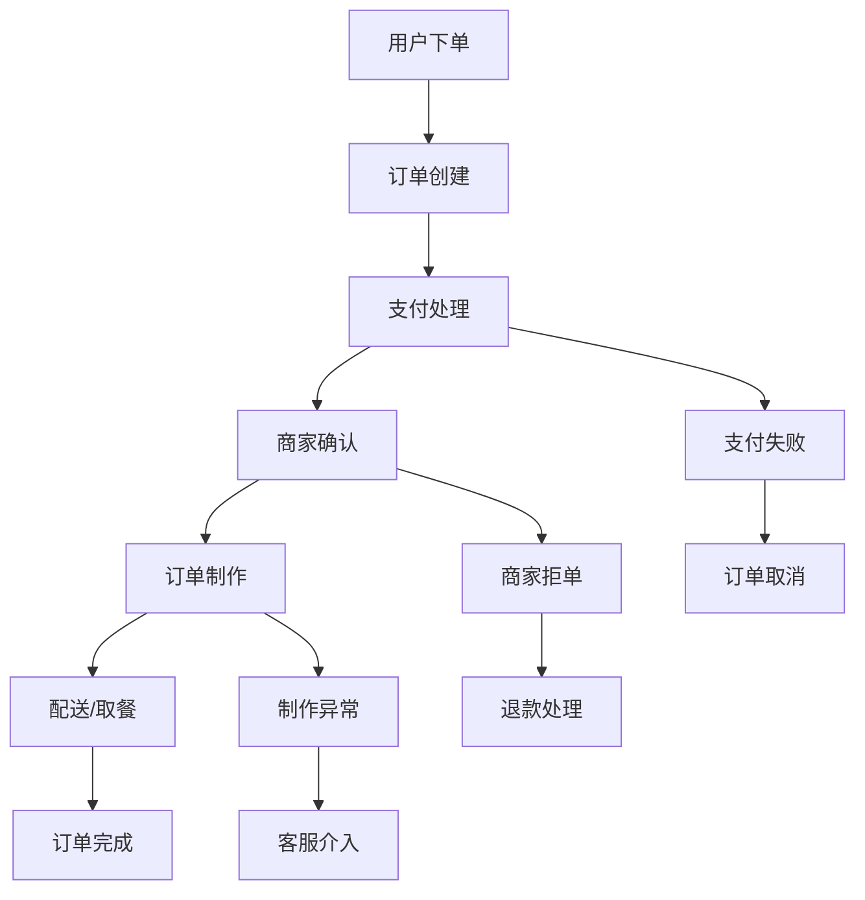

# 订单流程设计

> **文档版本**: 1.0.0  
> **创建日期**: 2025-07-13  
> **更新日期**: 2025-07-13  
> **文档状态**: ✅ 设计就绪  
> **目标受众**: 前端开发团队、产品设计师、业务分析师

## 📋 目录

- [1. 订单流程概述](#1-订单流程概述)
- [2. 用户端订单流程](#2-用户端订单流程)
- [3. 商家端订单处理](#3-商家端订单处理)
- [4. 状态管理设计](#4-状态管理设计)
- [5. 实时通信设计](#5-实时通信设计)

---

## 1. 订单流程概述

### 1.1 整体流程架构



### 1.2 核心状态定义

```yaml
订单状态枚举:
  PENDING_PAYMENT: "待支付"
  PAID: "已支付"
  CONFIRMED: "商家已确认"
  PREPARING: "制作中"
  READY: "待取餐/配送"
  COMPLETED: "已完成"
  CANCELLED: "已取消"
  REFUNDING: "退款中"
  REFUNDED: "已退款"

订单类型:
  DINE_IN: "堂食"
  TAKEAWAY: "自取"
  DELIVERY: "外卖配送"

支付状态:
  UNPAID: "未支付"
  PAYING: "支付中"
  PAID: "已支付"
  FAILED: "支付失败"
  REFUNDED: "已退款"
```

---

## 2. 用户端订单流程

### 2.1 购物车到下单流程

```dart
// lib/providers/cart_provider.dart
import 'package:freezed_annotation/freezed_annotation.dart';
import 'package:riverpod_annotation/riverpod_annotation.dart';

part 'cart_provider.freezed.dart';
part 'cart_provider.g.dart';

@riverpod
class CartNotifier extends _$CartNotifier {
  @override
  CartState build() {
    return CartState.empty();
  }

  void addItem(DishItem dish, int quantity) {
    final currentItems = state.items;
    final existingIndex = currentItems.indexWhere(
      (item) => item.dish.id == dish.id,
    );

    if (existingIndex >= 0) {
      final updatedItems = [...currentItems];
      updatedItems[existingIndex] = updatedItems[existingIndex].copyWith(
        quantity: updatedItems[existingIndex].quantity + quantity,
      );
      state = state.copyWith(items: updatedItems);
    } else {
      state = state.copyWith(
        items: [...currentItems, CartItem(dish: dish, quantity: quantity)],
      );
    }
    
    _calculateTotal();
  }

  void removeItem(String dishId) {
    state = state.copyWith(
      items: state.items.where((item) => item.dish.id != dishId).toList(),
    );
    _calculateTotal();
  }

  void _calculateTotal() {
    final total = state.items.fold<double>(
      0,
      (sum, item) => sum + (item.dish.price * item.quantity),
    );
    state = state.copyWith(totalAmount: total);
  }

  Future<Order> createOrder({
    required OrderType orderType,
    required PaymentMethod paymentMethod,
    String? deliveryAddress,
    String? notes,
  }) async {
    final orderService = ref.read(orderServiceProvider);
    
    final orderRequest = CreateOrderRequest(
      items: state.items,
      orderType: orderType,
      paymentMethod: paymentMethod,
      deliveryAddress: deliveryAddress,
      notes: notes,
    );

    final order = await orderService.createOrder(orderRequest);
    
    // 清空购物车
    state = CartState.empty();
    
    return order;
  }
}

// 购物车状态定义 (使用Freezed)
@freezed
class CartState with _$CartState {
  const factory CartState({
    required List<CartItem> items,
    required double totalAmount,
    required double deliveryFee,
    required double discountAmount,
  }) = _CartState;

  factory CartState.empty() => const CartState(
    items: [],
    totalAmount: 0.0,
    deliveryFee: 0.0,
    discountAmount: 0.0,
  );

  factory CartState.fromJson(Map<String, dynamic> json) =>
      _$CartStateFromJson(json);
}
```

### 2.2 订单确认界面

```dart
// lib/screens/order_confirmation_screen.dart
class OrderConfirmationScreen extends ConsumerWidget {
  const OrderConfirmationScreen({Key? key}) : super(key: key);

  @override
  Widget build(BuildContext context, WidgetRef ref) {
    final cartState = ref.watch(cartNotifierProvider);
    
    return Scaffold(
      appBar: AppBar(title: Text('确认订单')),
      body: Column(
        children: [
          Expanded(
            child: SingleChildScrollView(
              padding: EdgeInsets.all(16),
              child: Column(
                crossAxisAlignment: CrossAxisAlignment.start,
                children: [
                  _buildOrderItems(cartState),
                  _buildOrderTypeSelector(ref),
                  _buildDeliveryInfo(ref),
                  _buildPaymentMethod(ref),
                  _buildOrderNotes(ref),
                  _buildPriceBreakdown(cartState),
                ],
              ),
            ),
          ),
          _buildConfirmButton(context, ref),
        ],
      ),
    );
  }

  Widget _buildOrderItems(CartState cartState) {
    return Card(
      child: Padding(
        padding: EdgeInsets.all(16),
        child: Column(
          crossAxisAlignment: CrossAxisAlignment.start,
          children: [
            Text('订单商品', style: TextStyle(
              fontSize: 18, 
              fontWeight: FontWeight.bold,
            )),
            SizedBox(height: 12),
            ...cartState.items.map((item) => OrderItemCard(item: item)),
          ],
        ),
      ),
    );
  }

  Widget _buildConfirmButton(BuildContext context, WidgetRef ref) {
    return Container(
      padding: EdgeInsets.all(16),
      child: SizedBox(
        width: double.infinity,
        child: ElevatedButton(
          onPressed: () => _confirmOrder(context, ref),
          child: Text('确认下单'),
          style: ElevatedButton.styleFrom(
            padding: EdgeInsets.symmetric(vertical: 16),
          ),
        ),
      ),
    );
  }

  Future<void> _confirmOrder(BuildContext context, WidgetRef ref) async {
    final cartNotifier = ref.read(cartNotifierProvider.notifier);
    final orderTypeNotifier = ref.read(orderTypeProvider.notifier);
    final paymentMethodNotifier = ref.read(paymentMethodProvider.notifier);
    
    try {
      final order = await cartNotifier.createOrder(
        orderType: orderTypeNotifier.state,
        paymentMethod: paymentMethodNotifier.state,
        deliveryAddress: ref.read(deliveryAddressProvider),
        notes: ref.read(orderNotesProvider),
      );

      // 跳转到支付页面
      context.push('/payment/${order.id}');
    } catch (e) {
      // 显示错误信息
      ScaffoldMessenger.of(context).showSnackBar(
        SnackBar(content: Text('下单失败: $e')),
      );
    }
  }
}
```

### 2.3 支付流程设计

```dart
// lib/providers/payment_provider.dart
import 'package:freezed_annotation/freezed_annotation.dart';
import 'package:riverpod_annotation/riverpod_annotation.dart';

part 'payment_provider.freezed.dart';
part 'payment_provider.g.dart';

@riverpod
class PaymentNotifier extends _$PaymentNotifier {
  @override
  PaymentState build(String orderId) {
    return PaymentState.initial();
  }

  Future<void> initiatePayment({
    required PaymentMethod method,
    required double amount,
  }) async {
    state = PaymentState.processing();
    
    try {
      final paymentService = ref.read(paymentServiceProvider);
      final paymentRequest = PaymentRequest(
        orderId: orderId,
        amount: amount,
        method: method,
      );

      final paymentResult = await paymentService.createPayment(paymentRequest);
      
      switch (method) {
        case PaymentMethod.wechat:
          await _handleWechatPay(paymentResult);
          break;
        case PaymentMethod.alipay:
          await _handleAlipay(paymentResult);
          break;
        case PaymentMethod.applePay:
          await _handleApplePay(paymentResult);
          break;
      }
    } catch (e) {
      state = PaymentState.failed(error: e.toString());
    }
  }

  Future<void> _handleWechatPay(PaymentResult result) async {
    // 调用微信支付SDK
    final wechatPayResult = await WechatPay.pay(
      appId: result.wechatParams.appId,
      partnerId: result.wechatParams.partnerId,
      prepayId: result.wechatParams.prepayId,
      packageValue: result.wechatParams.packageValue,
      nonceStr: result.wechatParams.nonceStr,
      timeStamp: result.wechatParams.timeStamp,
      sign: result.wechatParams.sign,
    );

    if (wechatPayResult.isSuccess) {
      state = PaymentState.success();
      _listenForPaymentConfirmation();
    } else {
      state = PaymentState.failed(error: wechatPayResult.errorMsg);
    }
  }

  void _listenForPaymentConfirmation() {
    // 监听后端支付确认
    ref.read(orderWebSocketProvider).listen((event) {
      if (event.type == 'payment_confirmed' && event.orderId == orderId) {
        state = PaymentState.confirmed();
      }
    });
  }
}

// 支付状态定义 (使用Freezed)
@freezed
class PaymentState with _$PaymentState {
  const factory PaymentState({
    required PaymentStateType type,
    String? error,
  }) = _PaymentState;

  factory PaymentState.initial() => const PaymentState(type: PaymentStateType.initial);
  factory PaymentState.processing() => const PaymentState(type: PaymentStateType.processing);
  factory PaymentState.success() => const PaymentState(type: PaymentStateType.success);
  factory PaymentState.confirmed() => const PaymentState(type: PaymentStateType.confirmed);
  factory PaymentState.failed({required String error}) => PaymentState(
    type: PaymentStateType.failed,
    error: error,
  );

  factory PaymentState.fromJson(Map<String, dynamic> json) =>
      _$PaymentStateFromJson(json);
}

enum PaymentStateType { initial, processing, success, confirmed, failed }
```

---

## 3. 商家端订单处理

### 3.1 订单列表管理

```dart
// lib/providers/merchant_orders_provider.dart
@riverpod
class MerchantOrdersNotifier extends _$MerchantOrdersNotifier {
  @override
  Future<List<Order>> build() async {
    return _loadOrders();
  }

  Future<List<Order>> _loadOrders() async {
    final orderService = ref.read(orderServiceProvider);
    return await orderService.getMerchantOrders();
  }

  Future<void> confirmOrder(String orderId) async {
    final orderService = ref.read(orderServiceProvider);
    
    try {
      await orderService.confirmOrder(orderId);
      
      // 更新本地状态
      final currentOrders = await future;
      final updatedOrders = currentOrders.map((order) {
        if (order.id == orderId) {
          return order.copyWith(status: OrderStatus.confirmed);
        }
        return order;
      }).toList();
      
      state = AsyncValue.data(updatedOrders);
      
      // 发送实时通知给用户
      ref.read(orderWebSocketProvider).send({
        'type': 'order_confirmed',
        'orderId': orderId,
      });
    } catch (e) {
      state = AsyncValue.error(e, StackTrace.current);
    }
  }

  Future<void> startPreparing(String orderId) async {
    await _updateOrderStatus(orderId, OrderStatus.preparing);
  }

  Future<void> markReady(String orderId) async {
    await _updateOrderStatus(orderId, OrderStatus.ready);
  }

  Future<void> completeOrder(String orderId) async {
    await _updateOrderStatus(orderId, OrderStatus.completed);
  }

  Future<void> _updateOrderStatus(String orderId, OrderStatus status) async {
    final orderService = ref.read(orderServiceProvider);
    
    try {
      await orderService.updateOrderStatus(orderId, status);
      await ref.invalidateSelf();
      
      // 发送实时通知
      ref.read(orderWebSocketProvider).send({
        'type': 'order_status_updated',
        'orderId': orderId,
        'status': status.name,
      });
    } catch (e) {
      state = AsyncValue.error(e, StackTrace.current);
    }
  }
}
```

### 3.2 订单操作界面

```dart
// lib/screens/merchant_order_detail_screen.dart
class MerchantOrderDetailScreen extends ConsumerWidget {
  const MerchantOrderDetailScreen({
    Key? key,
    required this.orderId,
  }) : super(key: key);

  final String orderId;

  @override
  Widget build(BuildContext context, WidgetRef ref) {
    final orderAsync = ref.watch(orderDetailProvider(orderId));
    
    return Scaffold(
      appBar: AppBar(title: Text('订单详情 #$orderId')),
      body: orderAsync.when(
        data: (order) => _buildOrderDetail(context, ref, order),
        loading: () => Center(child: CircularProgressIndicator()),
        error: (error, stack) => Center(
          child: Text('加载失败: $error'),
        ),
      ),
    );
  }

  Widget _buildOrderDetail(BuildContext context, WidgetRef ref, Order order) {
    return SingleChildScrollView(
      padding: EdgeInsets.all(16),
      child: Column(
        crossAxisAlignment: CrossAxisAlignment.start,
        children: [
          _buildOrderHeader(order),
          _buildCustomerInfo(order),
          _buildOrderItems(order),
          _buildOrderActions(context, ref, order),
        ],
      ),
    );
  }

  Widget _buildOrderActions(BuildContext context, WidgetRef ref, Order order) {
    final merchantOrdersNotifier = ref.read(merchantOrdersNotifierProvider.notifier);
    
    return Card(
      child: Padding(
        padding: EdgeInsets.all(16),
        child: Column(
          crossAxisAlignment: CrossAxisAlignment.start,
          children: [
            Text('订单操作', style: TextStyle(
              fontSize: 18,
              fontWeight: FontWeight.bold,
            )),
            SizedBox(height: 16),
            _buildActionButtons(context, order, merchantOrdersNotifier),
          ],
        ),
      ),
    );
  }

  Widget _buildActionButtons(
    BuildContext context,
    Order order,
    MerchantOrdersNotifier notifier,
  ) {
    switch (order.status) {
      case OrderStatus.paid:
        return Row(
          children: [
            Expanded(
              child: ElevatedButton.icon(
                onPressed: () => _confirmOrder(context, notifier, order.id),
                icon: Icon(Icons.check),
                label: Text('确认接单'),
                style: ElevatedButton.styleFrom(
                  backgroundColor: Colors.green,
                ),
              ),
            ),
            SizedBox(width: 12),
            Expanded(
              child: OutlinedButton.icon(
                onPressed: () => _rejectOrder(context, notifier, order.id),
                icon: Icon(Icons.close),
                label: Text('拒绝订单'),
                style: OutlinedButton.styleFrom(
                  foregroundColor: Colors.red,
                ),
              ),
            ),
          ],
        );
        
      case OrderStatus.confirmed:
        return SizedBox(
          width: double.infinity,
          child: ElevatedButton.icon(
            onPressed: () => _startPreparing(context, notifier, order.id),
            icon: Icon(Icons.restaurant),
            label: Text('开始制作'),
          ),
        );
        
      case OrderStatus.preparing:
        return SizedBox(
          width: double.infinity,
          child: ElevatedButton.icon(
            onPressed: () => _markReady(context, notifier, order.id),
            icon: Icon(Icons.done),
            label: Text('制作完成'),
            style: ElevatedButton.styleFrom(
              backgroundColor: Colors.orange,
            ),
          ),
        );
        
      case OrderStatus.ready:
        return SizedBox(
          width: double.infinity,
          child: ElevatedButton.icon(
            onPressed: () => _completeOrder(context, notifier, order.id),
            icon: Icon(Icons.check_circle),
            label: Text('订单完成'),
            style: ElevatedButton.styleFrom(
              backgroundColor: Colors.green,
            ),
          ),
        );
        
      default:
        return SizedBox.shrink();
    }
  }

  Future<void> _confirmOrder(
    BuildContext context,
    MerchantOrdersNotifier notifier,
    String orderId,
  ) async {
    try {
      await notifier.confirmOrder(orderId);
      ScaffoldMessenger.of(context).showSnackBar(
        SnackBar(content: Text('订单已确认')),
      );
    } catch (e) {
      ScaffoldMessenger.of(context).showSnackBar(
        SnackBar(content: Text('操作失败: $e')),
      );
    }
  }
}
```

---

## 4. 状态管理设计

### 4.1 订单状态同步

```dart
// lib/providers/order_sync_provider.dart
@riverpod
class OrderSyncNotifier extends _$OrderSyncNotifier {
  @override
  OrderSyncState build() {
    _initializeWebSocket();
    return OrderSyncState.initial();
  }

  void _initializeWebSocket() {
    final webSocket = ref.read(webSocketProvider);
    
    webSocket.listen((message) {
      final data = jsonDecode(message);
      
      switch (data['type']) {
        case 'order_created':
          _handleOrderCreated(data);
          break;
        case 'order_status_updated':
          _handleOrderStatusUpdated(data);
          break;
        case 'payment_confirmed':
          _handlePaymentConfirmed(data);
          break;
      }
    });
  }

  void _handleOrderCreated(Map<String, dynamic> data) {
    final order = Order.fromJson(data['order']);
    
    // 通知相关的Provider更新
    ref.invalidate(merchantOrdersNotifierProvider);
    ref.invalidate(userOrdersProvider);
    
    // 显示通知
    if (ref.read(authNotifierProvider).hasPermission('order.receive')) {
      _showOrderNotification(order);
    }
  }

  void _handleOrderStatusUpdated(Map<String, dynamic> data) {
    final orderId = data['orderId'];
    final status = OrderStatus.values.byName(data['status']);
    
    // 更新相关订单状态
    ref.invalidate(orderDetailProvider(orderId));
    
    // 如果是用户关心的订单，发送推送通知
    _sendPushNotificationIfNeeded(orderId, status);
  }
}

// 状态同步状态定义 (使用Freezed)
@freezed
class OrderSyncState with _$OrderSyncState {
  const factory OrderSyncState({
    required OrderSyncStateType type,
  }) = _OrderSyncState;

  factory OrderSyncState.initial() => const OrderSyncState(type: OrderSyncStateType.initial);
  factory OrderSyncState.connected() => const OrderSyncState(type: OrderSyncStateType.connected);
  factory OrderSyncState.disconnected() => const OrderSyncState(type: OrderSyncStateType.disconnected);

  factory OrderSyncState.fromJson(Map<String, dynamic> json) =>
      _$OrderSyncStateFromJson(json);
}

enum OrderSyncStateType { initial, connected, disconnected }
```

### 4.2 订单缓存策略

```dart
// lib/providers/order_cache_provider.dart
@riverpod
class OrderCacheNotifier extends _$OrderCacheNotifier {
  @override
  Map<String, Order> build() {
    return {};
  }

  void cacheOrder(Order order) {
    state = {...state, order.id: order};
  }

  void updateOrderStatus(String orderId, OrderStatus status) {
    final order = state[orderId];
    if (order != null) {
      final updatedOrder = order.copyWith(status: status);
      state = {...state, orderId: updatedOrder};
    }
  }

  Order? getCachedOrder(String orderId) {
    return state[orderId];
  }

  void clearCache() {
    state = {};
  }

  // 清理过期缓存
  void cleanupExpiredCache() {
    final now = DateTime.now();
    final validOrders = <String, Order>{};
    
    for (final entry in state.entries) {
      final order = entry.value;
      final isExpired = now.difference(order.createdAt).inHours > 24;
      
      if (!isExpired || order.status == OrderStatus.preparing) {
        validOrders[entry.key] = order;
      }
    }
    
    state = validOrders;
  }
}
```

---

## 5. 实时通信设计

### 5.1 WebSocket连接管理

```dart
// lib/services/order_websocket_service.dart
class OrderWebSocketService {
  late WebSocketChannel _channel;
  final StreamController<OrderEvent> _eventController = 
      StreamController<OrderEvent>.broadcast();

  Stream<OrderEvent> get events => _eventController.stream;

  Future<void> connect(String token) async {
    final uri = Uri.parse('wss://api.nutrition-restaurant.com/ws/orders');
    _channel = WebSocketChannel.connect(uri);
    
    // 认证
    _channel.sink.add(jsonEncode({
      'type': 'auth',
      'token': token,
    }));
    
    // 监听消息
    _channel.stream.listen(
      (message) => _handleMessage(message),
      onError: (error) => _handleError(error),
      onDone: () => _handleDisconnection(),
    );
  }

  void _handleMessage(dynamic message) {
    final data = jsonDecode(message);
    final event = OrderEvent.fromJson(data);
    _eventController.add(event);
  }

  void sendOrderUpdate(String orderId, OrderStatus status) {
    _channel.sink.add(jsonEncode({
      'type': 'order_update',
      'orderId': orderId,
      'status': status.name,
    }));
  }

  void dispose() {
    _channel.sink.close();
    _eventController.close();
  }
}

// 订单事件定义 (使用Freezed)
@freezed
class OrderEvent with _$OrderEvent {
  const factory OrderEvent({
    required OrderEventType type,
    Order? order,
    String? orderId,
    OrderStatus? status,
    DateTime? timestamp,
    double? amount,
  }) = _OrderEvent;

  factory OrderEvent.created({required Order order}) => OrderEvent(
    type: OrderEventType.created,
    order: order,
  );
  
  factory OrderEvent.statusUpdated({
    required String orderId,
    required OrderStatus status,
    required DateTime timestamp,
  }) => OrderEvent(
    type: OrderEventType.statusUpdated,
    orderId: orderId,
    status: status,
    timestamp: timestamp,
  );
  
  factory OrderEvent.paymentConfirmed({
    required String orderId,
    required double amount,
  }) => OrderEvent(
    type: OrderEventType.paymentConfirmed,
    orderId: orderId,
    amount: amount,
  );

  factory OrderEvent.fromJson(Map<String, dynamic> json) =>
      _$OrderEventFromJson(json);
}

enum OrderEventType { created, statusUpdated, paymentConfirmed }
```

### 5.2 实时通知系统

```dart
// lib/services/order_notification_service.dart
class OrderNotificationService {
  static Future<void> showOrderNotification(Order order) async {
    const androidDetails = AndroidNotificationDetails(
      'order_channel',
      '订单通知',
      channelDescription: '接收订单状态更新通知',
      importance: Importance.high,
      priority: Priority.high,
    );
    
    const iosDetails = DarwinNotificationDetails(
      presentAlert: true,
      presentBadge: true,
      presentSound: true,
    );
    
    const details = NotificationDetails(
      android: androidDetails,
      iOS: iosDetails,
    );
    
    await FlutterLocalNotificationsPlugin().show(
      order.id.hashCode,
      _getNotificationTitle(order),
      _getNotificationBody(order),
      details,
      payload: order.id,
    );
  }

  static String _getNotificationTitle(Order order) {
    switch (order.status) {
      case OrderStatus.paid:
        return '新订单 #${order.id}';
      case OrderStatus.confirmed:
        return '订单已确认';
      case OrderStatus.preparing:
        return '订单制作中';
      case OrderStatus.ready:
        return '订单已完成';
      default:
        return '订单状态更新';
    }
  }

  static String _getNotificationBody(Order order) {
    switch (order.status) {
      case OrderStatus.paid:
        return '您有新的订单需要处理，金额 ¥${order.totalAmount}';
      case OrderStatus.confirmed:
        return '您的订单已被商家确认，正在准备中';
      case OrderStatus.preparing:
        return '您的订单正在制作中，请耐心等待';
      case OrderStatus.ready:
        return '您的订单已完成，请前往取餐';
      default:
        return '您的订单状态已更新';
    }
  }
}
```

---

## 文档说明

本订单流程设计文档定义了完整的订单处理体系，包括：

1. **订单状态管理** - 基于Riverpod的状态同步机制
2. **用户下单流程** - 从购物车到支付的完整流程
3. **商家处理流程** - 订单确认、制作、完成的操作界面
4. **实时通信** - WebSocket实现的实时状态同步
5. **通知系统** - 本地和推送通知的完整方案

开发团队应严格按照此设计实现订单流程功能，确保用户体验流畅和业务流程清晰。