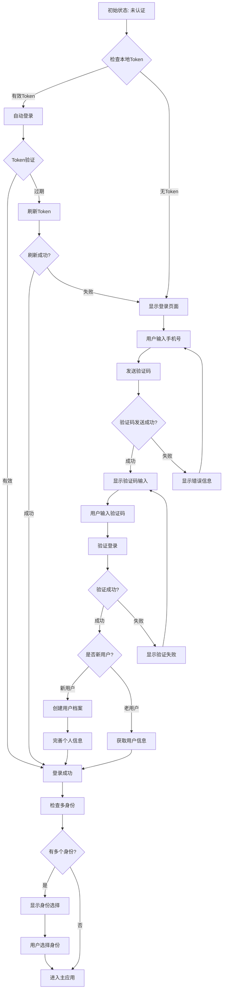
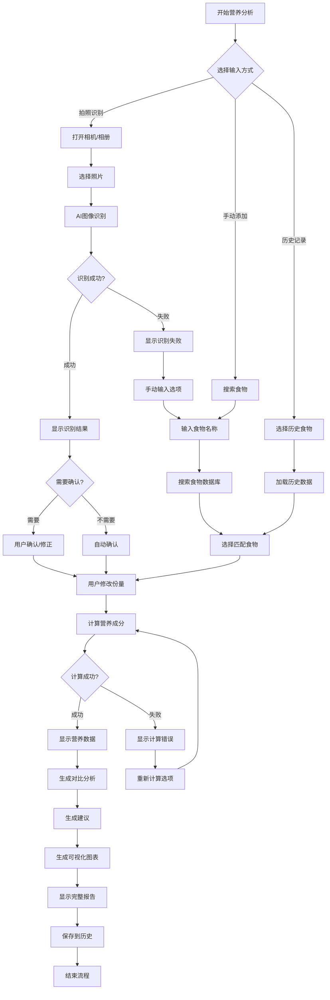
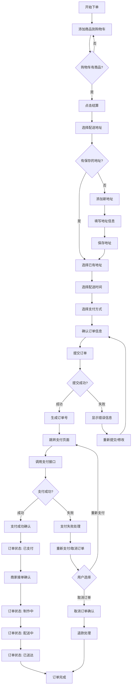
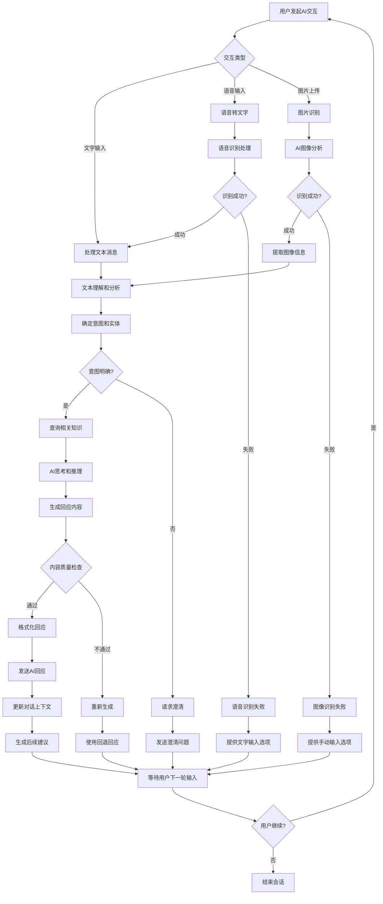
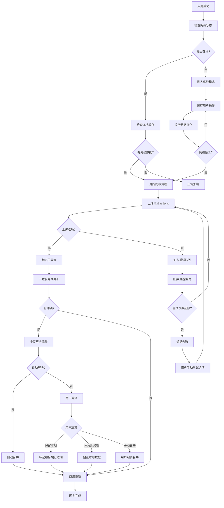
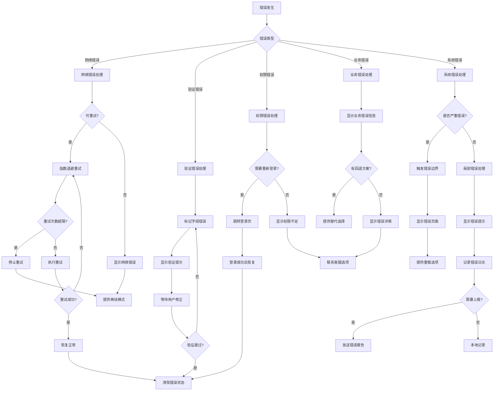
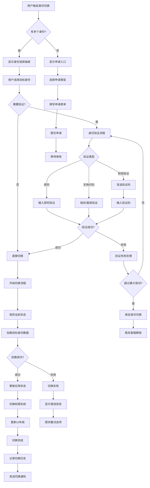

# 状态驱动交互流程图 - 完整设计方案

> **文档版本**: 1.0.0  
> **创建日期**: 2025-07-12  
> **更新日期**: 2025-07-12  
> **文档状态**: ✅ 补充设计阶段  
> **目标受众**: 前端开发团队、产品经理、UI设计师

## 📋 目录

- [1. 状态驱动设计概述](#1-状态驱动设计概述)
- [2. 用户认证状态流程](#2-用户认证状态流程)
- [3. 营养分析状态流程](#3-营养分析状态流程)
- [4. 订单处理状态流程](#4-订单处理状态流程)
- [5. AI交互状态流程](#5-ai交互状态流程)
- [6. 数据同步状态流程](#6-数据同步状态流程)
- [7. 错误处理状态流程](#7-错误处理状态流程)
- [8. 多身份切换状态流程](#8-多身份切换状态流程)
- [9. 状态管理实现方案](#9-状态管理实现方案)

---

## 1. 状态驱动设计概述

### 1.1 设计理念
```yaml
状态驱动UI原则:
  单一数据源:
    - 每个状态有唯一的数据源
    - 状态变化通过统一的action触发
    - UI根据状态自动更新
    - 避免直接操作DOM

  可预测性:
    - 状态变化遵循明确的规则
    - 相同输入产生相同输出
    - 状态变化可追踪可调试
    - 支持时间旅行调试

  组件化状态:
    - 全局状态vs局部状态明确划分
    - 状态尽可能接近使用它的组件
    - 跨组件状态通过Context或Redux管理
    - 避免过度设计状态结构

  异步处理:
    - 网络请求状态标准化
    - Loading/Success/Error状态模式
    - 乐观更新和回滚机制
    - 竞态条件处理
```

### 1.2 状态分类体系
```yaml
按作用域分类:
  全局状态:
    - 用户认证信息
    - 应用配置设置
    - 主题和语言设置
    - 购物车数据
    - 通知消息

  页面级状态:
    - 当前页面数据
    - 筛选和排序条件
    - 分页信息
    - 表单数据

  组件级状态:
    - UI交互状态
    - 临时输入数据
    - 组件内部状态
    - 动画状态

按生命周期分类:
  持久化状态:
    - 用户偏好设置
    - 登录凭证
    - 历史记录
    - 缓存数据

  会话状态:
    - 当前操作上下文
    - 页面浏览历史
    - 临时表单数据
    - 实时通信状态

  瞬时状态:
    - Loading状态
    - 错误提示
    - 动画状态
    - 交互反馈
```

### 1.3 状态设计模式
```yaml
标准状态模式:
  AsyncState模式:
    interface AsyncState<T> {
      data: T | null;
      loading: boolean;
      error: string | null;
      lastUpdated: number;
    }

  ListState模式:
    interface ListState<T> {
      items: T[];
      pagination: {
        page: number;
        size: number;
        total: number;
      };
      filters: Record<string, any>;
      sorting: {
        field: string;
        direction: 'asc' | 'desc';
      };
    }

  FormState模式:
    interface FormState<T> {
      values: T;
      errors: Partial<Record<keyof T, string>>;
      touched: Partial<Record<keyof T, boolean>>;
      isSubmitting: boolean;
      isValid: boolean;
    }

  UIState模式:
    interface UIState {
      theme: 'light' | 'dark';
      language: string;
      sidebarCollapsed: boolean;
      modals: Record<string, boolean>;
      notifications: Notification[];
    }
```

---

## 2. 用户认证状态流程

### 2.1 认证状态定义

```typescript
// 认证状态类型定义
interface AuthState {
  user: User | null;
  isAuthenticated: boolean;
  isLoading: boolean;
  error: string | null;
  loginMethod: 'phone' | 'wechat' | null;
  verificationState: {
    phone: string;
    code: string;
    codeExpiry: number;
    attempts: number;
  };
  multiIdentity: {
    currentRole: UserRole;
    availableRoles: UserRole[];
    switchingRole: boolean;
  };
}

interface User {
  id: string;
  phone: string;
  nickname: string;
  avatar: string;
  roles: UserRole[];
  profile: UserProfile;
  createdAt: string;
  lastLoginAt: string;
}

type UserRole = 'user' | 'merchant' | 'nutritionist' | 'admin';
```

### 2.2 认证流程图



### 2.3 状态变化代码实现

```typescript
// 认证相关的Actions
export const authActions = {
  // 开始登录流程
  startLogin: (phone: string) => ({
    type: 'auth/startLogin',
    payload: { phone }
  }),
  
  // 发送验证码
  sendVerificationCode: (phone: string) => ({
    type: 'auth/sendVerificationCode',
    payload: { phone }
  }),
  
  // 验证码发送成功
  verificationCodeSent: (expiry: number) => ({
    type: 'auth/verificationCodeSent',
    payload: { expiry }
  }),
  
  // 验证登录
  verifyLogin: (phone: string, code: string) => ({
    type: 'auth/verifyLogin',
    payload: { phone, code }
  }),
  
  // 登录成功
  loginSuccess: (user: User, token: string) => ({
    type: 'auth/loginSuccess',
    payload: { user, token }
  }),
  
  // 登录失败
  loginFailure: (error: string) => ({
    type: 'auth/loginFailure',
    payload: { error }
  }),
  
  // 切换身份
  switchRole: (role: UserRole) => ({
    type: 'auth/switchRole',
    payload: { role }
  }),
  
  // 登出
  logout: () => ({
    type: 'auth/logout'
  })
};

// 认证状态Reducer
export const authReducer = (state: AuthState = initialState, action: any): AuthState => {
  switch (action.type) {
    case 'auth/startLogin':
      return {
        ...state,
        isLoading: true,
        error: null,
        verificationState: {
          ...state.verificationState,
          phone: action.payload.phone,
          attempts: 0
        }
      };
      
    case 'auth/verificationCodeSent':
      return {
        ...state,
        verificationState: {
          ...state.verificationState,
          codeExpiry: action.payload.expiry
        }
      };
      
    case 'auth/verifyLogin':
      return {
        ...state,
        isLoading: true,
        error: null,
        verificationState: {
          ...state.verificationState,
          code: action.payload.code
        }
      };
      
    case 'auth/loginSuccess':
      return {
        ...state,
        isLoading: false,
        isAuthenticated: true,
        user: action.payload.user,
        error: null,
        multiIdentity: {
          currentRole: action.payload.user.roles[0],
          availableRoles: action.payload.user.roles,
          switchingRole: false
        }
      };
      
    case 'auth/loginFailure':
      return {
        ...state,
        isLoading: false,
        error: action.payload.error,
        verificationState: {
          ...state.verificationState,
          attempts: state.verificationState.attempts + 1
        }
      };
      
    case 'auth/switchRole':
      return {
        ...state,
        multiIdentity: {
          ...state.multiIdentity,
          currentRole: action.payload.role,
          switchingRole: false
        }
      };
      
    case 'auth/logout':
      return {
        ...initialState,
        // 保留一些用户偏好设置
        // theme, language 等
      };
      
    default:
      return state;
  }
};
```

---

## 3. 营养分析状态流程

### 3.1 营养分析状态定义

```typescript
interface NutritionAnalysisState {
  // 输入数据
  input: {
    method: 'photo' | 'manual' | 'search';
    photo?: File;
    selectedFoods: SelectedFood[];
    mealType: 'breakfast' | 'lunch' | 'dinner' | 'snack';
    date: string;
  };
  
  // 识别结果
  recognition: {
    isProcessing: boolean;
    results: RecognitionResult[];
    confidence: number;
    needsConfirmation: boolean;
  };
  
  // 营养计算
  calculation: {
    isCalculating: boolean;
    nutritionData: NutritionData | null;
    recommendations: Recommendation[];
    comparison: ComparisonData | null;
  };
  
  // 分析报告
  report: {
    isGenerating: boolean;
    data: AnalysisReport | null;
    charts: ChartData[];
    insights: Insight[];
  };
  
  // UI状态
  ui: {
    currentStep: 'input' | 'recognition' | 'confirmation' | 'analysis' | 'report';
    showAdvancedOptions: boolean;
    selectedTab: string;
  };
  
  // 错误状态
  error: {
    recognition: string | null;
    calculation: string | null;
    general: string | null;
  };
}
```

### 3.2 营养分析流程图



### 3.3 关键状态转换

```typescript
// 营养分析状态管理
export const nutritionAnalysisSlice = createSlice({
  name: 'nutritionAnalysis',
  initialState,
  reducers: {
    // 开始分析流程
    startAnalysis: (state, action) => {
      state.ui.currentStep = 'input';
      state.input.method = action.payload.method;
      state.input.date = action.payload.date;
      // 重置之前的状态
      state.recognition = initialRecognitionState;
      state.calculation = initialCalculationState;
      state.error = {};
    },
    
    // 图片识别流程
    startPhotoRecognition: (state, action) => {
      state.input.photo = action.payload.photo;
      state.recognition.isProcessing = true;
      state.ui.currentStep = 'recognition';
    },
    
    photoRecognitionSuccess: (state, action) => {
      state.recognition.isProcessing = false;
      state.recognition.results = action.payload.results;
      state.recognition.confidence = action.payload.confidence;
      state.recognition.needsConfirmation = action.payload.confidence < 0.8;
      
      if (state.recognition.needsConfirmation) {
        state.ui.currentStep = 'confirmation';
      } else {
        state.ui.currentStep = 'analysis';
        // 自动进入计算流程
      }
    },
    
    photoRecognitionFailure: (state, action) => {
      state.recognition.isProcessing = false;
      state.error.recognition = action.payload.error;
      // 提供手动输入选项
    },
    
    // 用户确认识别结果
    confirmRecognitionResults: (state, action) => {
      state.input.selectedFoods = action.payload.confirmedFoods;
      state.ui.currentStep = 'analysis';
    },
    
    // 计算营养成分
    startNutritionCalculation: (state) => {
      state.calculation.isCalculating = true;
      state.error.calculation = null;
    },
    
    nutritionCalculationSuccess: (state, action) => {
      state.calculation.isCalculating = false;
      state.calculation.nutritionData = action.payload.nutritionData;
      state.calculation.recommendations = action.payload.recommendations;
      state.calculation.comparison = action.payload.comparison;
      state.ui.currentStep = 'report';
    },
    
    nutritionCalculationFailure: (state, action) => {
      state.calculation.isCalculating = false;
      state.error.calculation = action.payload.error;
    },
    
    // 生成分析报告
    generateReport: (state) => {
      state.report.isGenerating = true;
    },
    
    reportGenerated: (state, action) => {
      state.report.isGenerating = false;
      state.report.data = action.payload.report;
      state.report.charts = action.payload.charts;
      state.report.insights = action.payload.insights;
    },
    
    // UI交互
    setCurrentStep: (state, action) => {
      state.ui.currentStep = action.payload.step;
    },
    
    toggleAdvancedOptions: (state) => {
      state.ui.showAdvancedOptions = !state.ui.showAdvancedOptions;
    },
    
    setSelectedTab: (state, action) => {
      state.ui.selectedTab = action.payload.tab;
    }
  }
});

// 异步Actions (Thunks)
export const performPhotoRecognition = createAsyncThunk(
  'nutritionAnalysis/performPhotoRecognition',
  async (photo: File, { dispatch, rejectWithValue }) => {
    try {
      dispatch(startPhotoRecognition({ photo }));
      
      const formData = new FormData();
      formData.append('image', photo);
      
      const response = await api.post('/ai/recognize-food', formData, {
        headers: { 'Content-Type': 'multipart/form-data' }
      });
      
      const { results, confidence } = response.data;
      
      dispatch(photoRecognitionSuccess({ results, confidence }));
      
      // 如果置信度足够高，自动进入计算流程
      if (confidence >= 0.8) {
        dispatch(calculateNutrition());
      }
      
      return { results, confidence };
    } catch (error) {
      const errorMessage = error.response?.data?.message || '识别失败';
      dispatch(photoRecognitionFailure({ error: errorMessage }));
      return rejectWithValue(errorMessage);
    }
  }
);

export const calculateNutrition = createAsyncThunk(
  'nutritionAnalysis/calculateNutrition',
  async (_, { getState, dispatch, rejectWithValue }) => {
    try {
      dispatch(startNutritionCalculation());
      
      const state = getState() as RootState;
      const { selectedFoods, mealType, date } = state.nutritionAnalysis.input;
      
      const response = await api.post('/nutrition/calculate', {
        foods: selectedFoods,
        mealType,
        date
      });
      
      const { nutritionData, recommendations, comparison } = response.data;
      
      dispatch(nutritionCalculationSuccess({
        nutritionData,
        recommendations,
        comparison
      }));
      
      // 自动生成报告
      dispatch(generateAnalysisReport());
      
      return response.data;
    } catch (error) {
      const errorMessage = error.response?.data?.message || '计算失败';
      dispatch(nutritionCalculationFailure({ error: errorMessage }));
      return rejectWithValue(errorMessage);
    }
  }
);
```

---

## 4. 订单处理状态流程

### 4.1 订单状态定义

```typescript
interface OrderState {
  // 订单信息
  currentOrder: Order | null;
  orderHistory: Order[];
  
  // 购物车
  cart: {
    items: CartItem[];
    totalAmount: number;
    discounts: Discount[];
    deliveryFee: number;
  };
  
  // 订单流程状态
  process: {
    currentStep: OrderStep;
    completedSteps: OrderStep[];
    canProceed: boolean;
  };
  
  // 地址信息
  delivery: {
    selectedAddress: Address | null;
    availableAddresses: Address[];
    deliveryTime: DeliveryTime | null;
  };
  
  // 支付信息
  payment: {
    selectedMethod: PaymentMethod | null;
    paymentStatus: PaymentStatus;
    isProcessing: boolean;
  };
  
  // 实时状态
  realtime: {
    orderStatus: OrderStatus;
    estimatedTime: number;
    driverLocation?: Location;
    lastUpdate: number;
  };
  
  // UI状态
  ui: {
    showCartDrawer: boolean;
    showAddressModal: boolean;
    showPaymentModal: boolean;
  };
}

type OrderStep = 'cart' | 'address' | 'payment' | 'confirmation' | 'tracking';
type OrderStatus = 'pending' | 'confirmed' | 'preparing' | 'ready' | 'delivering' | 'delivered' | 'cancelled';
type PaymentStatus = 'pending' | 'processing' | 'success' | 'failed' | 'refunded';
```

### 4.2 订单流程图



### 4.3 实时状态更新

```typescript
// 订单实时状态管理
export const useOrderRealtime = (orderId: string) => {
  const dispatch = useDispatch();
  const [socket, setSocket] = useState<WebSocket | null>(null);
  
  useEffect(() => {
    if (!orderId) return;
    
    // 建立WebSocket连接
    const ws = new WebSocket(`${WS_BASE_URL}/orders/${orderId}`);
    
    ws.onopen = () => {
      console.log('Order tracking connected');
      setSocket(ws);
    };
    
    ws.onmessage = (event) => {
      const data = JSON.parse(event.data);
      
      switch (data.type) {
        case 'ORDER_STATUS_UPDATED':
          dispatch(updateOrderStatus({
            orderId,
            status: data.status,
            estimatedTime: data.estimatedTime,
            timestamp: data.timestamp
          }));
          break;
          
        case 'DRIVER_LOCATION_UPDATED':
          dispatch(updateDriverLocation({
            orderId,
            location: data.location,
            distance: data.distance
          }));
          break;
          
        case 'ORDER_CANCELLED':
          dispatch(orderCancelled({
            orderId,
            reason: data.reason,
            refundAmount: data.refundAmount
          }));
          break;
          
        case 'ORDER_DELIVERED':
          dispatch(orderDelivered({
            orderId,
            deliveryTime: data.deliveryTime,
            rating: data.rating
          }));
          break;
      }
    };
    
    ws.onclose = () => {
      console.log('Order tracking disconnected');
      setSocket(null);
    };
    
    ws.onerror = (error) => {
      console.error('WebSocket error:', error);
    };
    
    return () => {
      ws.close();
    };
  }, [orderId, dispatch]);
  
  return socket;
};

// 订单状态Reducer
export const orderSlice = createSlice({
  name: 'order',
  initialState,
  reducers: {
    // 购物车操作
    addToCart: (state, action) => {
      const { product, quantity = 1 } = action.payload;
      const existingItem = state.cart.items.find(item => item.productId === product.id);
      
      if (existingItem) {
        existingItem.quantity += quantity;
      } else {
        state.cart.items.push({
          productId: product.id,
          product,
          quantity,
          price: product.price
        });
      }
      
      // 重新计算总金额
      state.cart.totalAmount = calculateCartTotal(state.cart.items);
    },
    
    removeFromCart: (state, action) => {
      const productId = action.payload;
      state.cart.items = state.cart.items.filter(item => item.productId !== productId);
      state.cart.totalAmount = calculateCartTotal(state.cart.items);
    },
    
    updateCartItemQuantity: (state, action) => {
      const { productId, quantity } = action.payload;
      const item = state.cart.items.find(item => item.productId === productId);
      
      if (item) {
        if (quantity <= 0) {
          state.cart.items = state.cart.items.filter(item => item.productId !== productId);
        } else {
          item.quantity = quantity;
        }
        state.cart.totalAmount = calculateCartTotal(state.cart.items);
      }
    },
    
    // 订单流程
    setOrderStep: (state, action) => {
      const step = action.payload;
      state.process.currentStep = step;
      
      if (!state.process.completedSteps.includes(step)) {
        state.process.completedSteps.push(step);
      }
      
      // 检查是否可以继续下一步
      state.process.canProceed = validateOrderStep(state, step);
    },
    
    selectDeliveryAddress: (state, action) => {
      state.delivery.selectedAddress = action.payload;
      state.process.canProceed = true;
    },
    
    selectPaymentMethod: (state, action) => {
      state.payment.selectedMethod = action.payload;
    },
    
    // 实时状态更新
    updateOrderStatus: (state, action) => {
      const { orderId, status, estimatedTime, timestamp } = action.payload;
      
      if (state.currentOrder?.id === orderId) {
        state.realtime.orderStatus = status;
        state.realtime.estimatedTime = estimatedTime;
        state.realtime.lastUpdate = timestamp;
      }
      
      // 更新历史订单状态
      const historyOrder = state.orderHistory.find(order => order.id === orderId);
      if (historyOrder) {
        historyOrder.status = status;
      }
    },
    
    updateDriverLocation: (state, action) => {
      const { orderId, location } = action.payload;
      
      if (state.currentOrder?.id === orderId) {
        state.realtime.driverLocation = location;
        state.realtime.lastUpdate = Date.now();
      }
    },
    
    // 支付流程
    startPayment: (state) => {
      state.payment.isProcessing = true;
      state.payment.paymentStatus = 'processing';
    },
    
    paymentSuccess: (state, action) => {
      state.payment.isProcessing = false;
      state.payment.paymentStatus = 'success';
      state.currentOrder = action.payload.order;
      state.realtime.orderStatus = 'confirmed';
      
      // 清空购物车
      state.cart = initialCartState;
    },
    
    paymentFailure: (state, action) => {
      state.payment.isProcessing = false;
      state.payment.paymentStatus = 'failed';
      // 保留购物车内容，允许重新支付
    },
    
    // UI状态
    toggleCartDrawer: (state) => {
      state.ui.showCartDrawer = !state.ui.showCartDrawer;
    },
    
    showAddressModal: (state) => {
      state.ui.showAddressModal = true;
    },
    
    hideAddressModal: (state) => {
      state.ui.showAddressModal = false;
    }
  }
});

// 异步订单操作
export const submitOrder = createAsyncThunk(
  'order/submitOrder',
  async (orderData: OrderSubmitData, { getState, dispatch, rejectWithValue }) => {
    try {
      const state = getState() as RootState;
      const { cart, delivery, payment } = state.order;
      
      const orderPayload = {
        items: cart.items,
        deliveryAddress: delivery.selectedAddress,
        paymentMethod: payment.selectedMethod,
        totalAmount: cart.totalAmount,
        ...orderData
      };
      
      const response = await api.post('/orders', orderPayload);
      const order = response.data;
      
      // 启动支付流程
      dispatch(startPayment());
      
      return order;
    } catch (error) {
      return rejectWithValue(error.response?.data?.message || '订单提交失败');
    }
  }
);
```

---

## 5. AI交互状态流程

### 5.1 AI交互状态定义

```typescript
interface AIInteractionState {
  // 当前会话
  currentSession: {
    id: string;
    type: 'nutrition_qa' | 'food_recognition' | 'meal_planning';
    messages: Message[];
    context: ConversationContext;
  };
  
  // AI处理状态
  ai: {
    isThinking: boolean;
    isTyping: boolean;
    confidence: number;
    processingStage: ProcessingStage;
    capabilities: AICapability[];
  };
  
  // 用户输入状态
  input: {
    text: string;
    attachments: File[];
    inputType: 'text' | 'voice' | 'image';
    isRecording: boolean;
  };
  
  // 历史会话
  history: {
    sessions: ConversationSession[];
    favorites: Message[];
    searchResults: Message[];
  };
  
  // AI建议和推荐
  suggestions: {
    quickReplies: string[];
    relatedQuestions: string[];
    recommendedActions: RecommendedAction[];
  };
  
  // 错误和回退
  error: {
    lastError: string | null;
    fallbackOptions: FallbackOption[];
    retryCount: number;
  };
}

type ProcessingStage = 'analyzing' | 'searching' | 'generating' | 'validating';
type AICapability = 'text_generation' | 'image_recognition' | 'voice_synthesis' | 'data_analysis';
```

### 5.2 AI交互流程图



### 5.3 AI状态管理实现

```typescript
// AI交互状态管理
export const aiInteractionSlice = createSlice({
  name: 'aiInteraction',
  initialState,
  reducers: {
    // 开始新会话
    startNewSession: (state, action) => {
      const { type, initialMessage } = action.payload;
      const sessionId = generateSessionId();
      
      state.currentSession = {
        id: sessionId,
        type,
        messages: initialMessage ? [initialMessage] : [],
        context: {
          userProfile: action.payload.userProfile,
          previousMessages: [],
          entities: {}
        }
      };
      
      state.ai = {
        ...initialAIState,
        capabilities: getAICapabilities(type)
      };
    },
    
    // 用户输入处理
    setUserInput: (state, action) => {
      state.input.text = action.payload;
    },
    
    startVoiceRecording: (state) => {
      state.input.isRecording = true;
      state.input.inputType = 'voice';
    },
    
    stopVoiceRecording: (state) => {
      state.input.isRecording = false;
    },
    
    addAttachment: (state, action) => {
      state.input.attachments.push(action.payload);
      state.input.inputType = 'image';
    },
    
    // AI处理状态
    startAIProcessing: (state, action) => {
      state.ai.isThinking = true;
      state.ai.processingStage = action.payload.stage || 'analyzing';
      state.error.lastError = null;
    },
    
    updateProcessingStage: (state, action) => {
      state.ai.processingStage = action.payload.stage;
    },
    
    startAITyping: (state) => {
      state.ai.isTyping = true;
      state.ai.isThinking = false;
    },
    
    // 消息处理
    addUserMessage: (state, action) => {
      const message = {
        id: generateMessageId(),
        type: 'user',
        content: action.payload.content,
        timestamp: Date.now(),
        attachments: action.payload.attachments || []
      };
      
      state.currentSession.messages.push(message);
      
      // 清空输入
      state.input = {
        text: '',
        attachments: [],
        inputType: 'text',
        isRecording: false
      };
    },
    
    addAIMessage: (state, action) => {
      const message = {
        id: generateMessageId(),
        type: 'ai',
        content: action.payload.content,
        timestamp: Date.now(),
        confidence: action.payload.confidence,
        metadata: action.payload.metadata
      };
      
      state.currentSession.messages.push(message);
      state.ai.isTyping = false;
      state.ai.confidence = action.payload.confidence;
      
      // 更新对话上下文
      state.currentSession.context.previousMessages = state.currentSession.messages.slice(-5);
    },
    
    // 建议和推荐
    updateSuggestions: (state, action) => {
      state.suggestions = {
        quickReplies: action.payload.quickReplies || [],
        relatedQuestions: action.payload.relatedQuestions || [],
        recommendedActions: action.payload.recommendedActions || []
      };
    },
    
    // 错误处理
    setAIError: (state, action) => {
      state.ai.isThinking = false;
      state.ai.isTyping = false;
      state.error.lastError = action.payload.error;
      state.error.retryCount += 1;
      
      // 生成回退选项
      state.error.fallbackOptions = generateFallbackOptions(action.payload.errorType);
    },
    
    clearError: (state) => {
      state.error.lastError = null;
      state.error.retryCount = 0;
      state.error.fallbackOptions = [];
    },
    
    // 会话管理
    saveCurrentSession: (state) => {
      if (state.currentSession.messages.length > 0) {
        const sessionToSave = {
          ...state.currentSession,
          savedAt: Date.now()
        };
        
        state.history.sessions.unshift(sessionToSave);
        
        // 限制历史会话数量
        if (state.history.sessions.length > 50) {
          state.history.sessions = state.history.sessions.slice(0, 50);
        }
      }
    },
    
    loadSession: (state, action) => {
      const session = action.payload;
      state.currentSession = {
        ...session,
        context: {
          ...session.context,
          previousMessages: session.messages.slice(-5)
        }
      };
    },
    
    addToFavorites: (state, action) => {
      const message = action.payload;
      if (!state.history.favorites.find(fav => fav.id === message.id)) {
        state.history.favorites.push(message);
      }
    }
  }
});

// AI交互异步Actions
export const sendMessageToAI = createAsyncThunk(
  'aiInteraction/sendMessage',
  async (
    { content, attachments = [] }: { content: string; attachments?: File[] },
    { getState, dispatch, rejectWithValue }
  ) => {
    try {
      const state = getState() as RootState;
      const { currentSession } = state.aiInteraction;
      
      // 添加用户消息
      dispatch(addUserMessage({ content, attachments }));
      
      // 开始AI处理
      dispatch(startAIProcessing({ stage: 'analyzing' }));
      
      // 构建请求数据
      const requestData = {
        message: content,
        sessionId: currentSession.id,
        sessionType: currentSession.type,
        context: currentSession.context,
        attachments: attachments.length > 0 ? await processAttachments(attachments) : []
      };
      
      // 发送到AI服务
      const response = await fetch('/api/ai/chat', {
        method: 'POST',
        headers: {
          'Content-Type': 'application/json',
          'Authorization': `Bearer ${getAuthToken()}`
        },
        body: JSON.stringify(requestData)
      });
      
      if (!response.ok) {
        throw new Error(`AI service error: ${response.statusText}`);
      }
      
      // 处理流式响应
      const reader = response.body?.getReader();
      if (!reader) {
        throw new Error('No response body');
      }
      
      dispatch(startAITyping());
      
      let aiResponse = '';
      let confidence = 0;
      
      while (true) {
        const { done, value } = await reader.read();
        if (done) break;
        
        const chunk = new TextDecoder().decode(value);
        const lines = chunk.split('\n');
        
        for (const line of lines) {
          if (line.startsWith('data: ')) {
            const data = JSON.parse(line.slice(6));
            
            switch (data.type) {
              case 'processing_update':
                dispatch(updateProcessingStage({ stage: data.stage }));
                break;
                
              case 'partial_response':
                aiResponse += data.content;
                // 实时更新AI消息（可选）
                break;
                
              case 'final_response':
                aiResponse = data.content;
                confidence = data.confidence;
                break;
                
              case 'suggestions':
                dispatch(updateSuggestions(data.suggestions));
                break;
            }
          }
        }
      }
      
      // 添加完整的AI回应
      dispatch(addAIMessage({
        content: aiResponse,
        confidence,
        metadata: {
          processingTime: Date.now() - requestStartTime,
          model: response.headers.get('X-AI-Model'),
          tokensUsed: parseInt(response.headers.get('X-Tokens-Used') || '0')
        }
      }));
      
      return { content: aiResponse, confidence };
      
    } catch (error) {
      const errorMessage = error instanceof Error ? error.message : 'AI处理失败';
      dispatch(setAIError({
        error: errorMessage,
        errorType: getErrorType(error)
      }));
      return rejectWithValue(errorMessage);
    }
  }
);

// 语音转文字处理
export const processVoiceInput = createAsyncThunk(
  'aiInteraction/processVoice',
  async (audioBlob: Blob, { dispatch, rejectWithValue }) => {
    try {
      dispatch(startAIProcessing({ stage: 'analyzing' }));
      
      const formData = new FormData();
      formData.append('audio', audioBlob, 'voice.wav');
      
      const response = await fetch('/api/ai/speech-to-text', {
        method: 'POST',
        body: formData
      });
      
      if (!response.ok) {
        throw new Error('语音识别失败');
      }
      
      const { text, confidence } = await response.json();
      
      if (confidence < 0.7) {
        throw new Error('语音识别置信度过低');
      }
      
      // 自动发送识别结果到AI
      dispatch(sendMessageToAI({ content: text }));
      
      return { text, confidence };
      
    } catch (error) {
      dispatch(setAIError({
        error: error.message,
        errorType: 'speech_recognition'
      }));
      return rejectWithValue(error.message);
    }
  }
);
```

---

## 6. 数据同步状态流程

### 6.1 数据同步状态定义

```typescript
interface DataSyncState {
  // 同步状态
  sync: {
    isOnline: boolean;
    lastSyncTime: number;
    syncInProgress: boolean;
    pendingChanges: number;
  };
  
  // 离线队列
  offline: {
    actions: OfflineAction[];
    failedActions: FailedAction[];
    retryCount: number;
  };
  
  // 冲突解决
  conflicts: {
    unresolved: DataConflict[];
    resolved: ResolvedConflict[];
    autoResolveEnabled: boolean;
  };
  
  // 数据版本
  versioning: {
    localVersion: number;
    serverVersion: number;
    lastKnownVersion: number;
  };
  
  // 同步配置
  config: {
    autoSyncEnabled: boolean;
    syncInterval: number;
    batchSize: number;
    retryLimit: number;
  };
}

interface OfflineAction {
  id: string;
  type: string;
  payload: any;
  timestamp: number;
  retryCount: number;
  priority: 'high' | 'medium' | 'low';
}

interface DataConflict {
  id: string;
  entityType: string;
  entityId: string;
  localData: any;
  serverData: any;
  conflictType: 'UPDATE_CONFLICT' | 'DELETE_CONFLICT' | 'CREATE_CONFLICT';
  timestamp: number;
}
```

### 6.2 数据同步流程图



### 6.3 数据同步实现

```typescript
// 数据同步中间件
export const syncMiddleware: Middleware = (store) => (next) => (action) => {
  const state = store.getState();
  const isOnline = state.dataSync.sync.isOnline;
  
  // 检查是否为需要同步的action
  if (isSyncableAction(action)) {
    if (isOnline) {
      // 在线状态：立即执行并同步
      const result = next(action);
      
      // 异步同步到服务器
      syncActionToServer(action, store.dispatch);
      
      return result;
    } else {
      // 离线状态：添加到离线队列
      const offlineAction: OfflineAction = {
        id: generateActionId(),
        type: action.type,
        payload: action.payload,
        timestamp: Date.now(),
        retryCount: 0,
        priority: getActionPriority(action.type)
      };
      
      store.dispatch(addOfflineAction(offlineAction));
      
      // 仍然执行本地action
      return next(action);
    }
  }
  
  return next(action);
};

// 同步管理器
export class SyncManager {
  private store: Store;
  private syncInterval: NodeJS.Timer | null = null;
  private wsConnection: WebSocket | null = null;
  
  constructor(store: Store) {
    this.store = store;
    this.setupNetworkListener();
    this.setupWebSocketConnection();
  }
  
  // 设置网络状态监听
  private setupNetworkListener() {
    const updateOnlineStatus = () => {
      const isOnline = navigator.onLine;
      this.store.dispatch(setOnlineStatus(isOnline));
      
      if (isOnline) {
        this.startSync();
      } else {
        this.stopSync();
      }
    };
    
    window.addEventListener('online', updateOnlineStatus);
    window.addEventListener('offline', updateOnlineStatus);
    
    // 初始状态检查
    updateOnlineStatus();
  }
  
  // 设置WebSocket连接用于实时同步
  private setupWebSocketConnection() {
    if (!navigator.onLine) return;
    
    this.wsConnection = new WebSocket(`${WS_BASE_URL}/sync`);
    
    this.wsConnection.onopen = () => {
      console.log('Sync WebSocket connected');
    };
    
    this.wsConnection.onmessage = (event) => {
      const data = JSON.parse(event.data);
      this.handleRealTimeUpdate(data);
    };
    
    this.wsConnection.onclose = () => {
      console.log('Sync WebSocket disconnected');
      // 重连逻辑
      setTimeout(() => this.setupWebSocketConnection(), 5000);
    };
  }
  
  // 处理实时更新
  private handleRealTimeUpdate(data: any) {
    const { type, payload } = data;
    
    switch (type) {
      case 'DATA_UPDATED':
        this.store.dispatch(applyServerUpdate(payload));
        break;
        
      case 'CONFLICT_DETECTED':
        this.store.dispatch(addDataConflict(payload));
        break;
        
      case 'SYNC_REQUIRED':
        this.startFullSync();
        break;
    }
  }
  
  // 开始同步
  public async startSync() {
    const state = this.store.getState().dataSync;
    if (state.sync.syncInProgress) return;
    
    this.store.dispatch(setSyncInProgress(true));
    
    try {
      // 1. 上传离线actions
      await this.uploadOfflineActions();
      
      // 2. 下载服务端更新
      await this.downloadServerUpdates();
      
      // 3. 解决冲突
      await this.resolveConflicts();
      
      this.store.dispatch(setSyncCompleted(Date.now()));
      
    } catch (error) {
      console.error('Sync failed:', error);
      this.store.dispatch(setSyncError(error.message));
    } finally {
      this.store.dispatch(setSyncInProgress(false));
    }
  }
  
  // 上传离线actions
  private async uploadOfflineActions() {
    const state = this.store.getState().dataSync;
    const pendingActions = state.offline.actions;
    
    if (pendingActions.length === 0) return;
    
    // 按优先级排序
    const sortedActions = [...pendingActions].sort((a, b) => {
      const priorityOrder = { high: 0, medium: 1, low: 2 };
      return priorityOrder[a.priority] - priorityOrder[b.priority];
    });
    
    // 批量上传
    const batchSize = state.config.batchSize;
    for (let i = 0; i < sortedActions.length; i += batchSize) {
      const batch = sortedActions.slice(i, i + batchSize);
      
      try {
        const response = await fetch('/api/sync/upload', {
          method: 'POST',
          headers: { 'Content-Type': 'application/json' },
          body: JSON.stringify({ actions: batch })
        });
        
        if (response.ok) {
          // 标记为已同步
          batch.forEach(action => {
            this.store.dispatch(markActionSynced(action.id));
          });
        } else {
          // 处理失败的actions
          batch.forEach(action => {
            this.store.dispatch(markActionFailed({
              actionId: action.id,
              error: response.statusText
            }));
          });
        }
      } catch (error) {
        // 网络错误，增加重试计数
        batch.forEach(action => {
          this.store.dispatch(incrementRetryCount(action.id));
        });
      }
    }
  }
  
  // 下载服务端更新
  private async downloadServerUpdates() {
    const state = this.store.getState().dataSync;
    const lastSyncTime = state.sync.lastSyncTime;
    
    try {
      const response = await fetch(`/api/sync/download?since=${lastSyncTime}`);
      const updates = await response.json();
      
      for (const update of updates) {
        // 检查是否有冲突
        if (this.hasLocalChanges(update)) {
          this.store.dispatch(addDataConflict({
            id: generateConflictId(),
            entityType: update.entityType,
            entityId: update.entityId,
            localData: this.getLocalData(update.entityType, update.entityId),
            serverData: update.data,
            conflictType: 'UPDATE_CONFLICT',
            timestamp: Date.now()
          }));
        } else {
          // 直接应用更新
          this.store.dispatch(applyServerUpdate(update));
        }
      }
    } catch (error) {
      console.error('Failed to download updates:', error);
      throw error;
    }
  }
  
  // 自动解决冲突
  private async resolveConflicts() {
    const state = this.store.getState().dataSync;
    const conflicts = state.conflicts.unresolved;
    
    if (!state.conflicts.autoResolveEnabled) return;
    
    for (const conflict of conflicts) {
      const resolution = this.autoResolveConflict(conflict);
      
      if (resolution) {
        this.store.dispatch(resolveConflict({
          conflictId: conflict.id,
          resolution,
          method: 'auto'
        }));
      }
    }
  }
  
  // 自动冲突解决策略
  private autoResolveConflict(conflict: DataConflict): any | null {
    switch (conflict.conflictType) {
      case 'UPDATE_CONFLICT':
        // 时间戳优先策略
        const localTimestamp = conflict.localData.updatedAt;
        const serverTimestamp = conflict.serverData.updatedAt;
        
        if (localTimestamp > serverTimestamp) {
          return conflict.localData;
        } else if (serverTimestamp > localTimestamp) {
          return conflict.serverData;
        } else {
          // 时间戳相同，需要手动解决
          return null;
        }
        
      case 'DELETE_CONFLICT':
        // 删除操作优先
        return null; // 表示删除
        
      case 'CREATE_CONFLICT':
        // 合并创建，生成新ID
        return {
          ...conflict.localData,
          id: generateNewId(),
          mergedFrom: [conflict.localData.id, conflict.serverData.id]
        };
        
      default:
        return null;
    }
  }
  
  // 停止同步
  public stopSync() {
    if (this.syncInterval) {
      clearInterval(this.syncInterval);
      this.syncInterval = null;
    }
    
    if (this.wsConnection) {
      this.wsConnection.close();
      this.wsConnection = null;
    }
  }
}

// 同步状态Reducer
export const dataSyncSlice = createSlice({
  name: 'dataSync',
  initialState,
  reducers: {
    setOnlineStatus: (state, action) => {
      state.sync.isOnline = action.payload;
      
      if (action.payload) {
        // 网络恢复，清除离线状态
        state.offline.retryCount = 0;
      }
    },
    
    setSyncInProgress: (state, action) => {
      state.sync.syncInProgress = action.payload;
    },
    
    setSyncCompleted: (state, action) => {
      state.sync.lastSyncTime = action.payload;
      state.sync.pendingChanges = 0;
    },
    
    addOfflineAction: (state, action) => {
      state.offline.actions.push(action.payload);
      state.sync.pendingChanges += 1;
    },
    
    markActionSynced: (state, action) => {
      const actionId = action.payload;
      state.offline.actions = state.offline.actions.filter(
        action => action.id !== actionId
      );
      state.sync.pendingChanges = Math.max(0, state.sync.pendingChanges - 1);
    },
    
    markActionFailed: (state, action) => {
      const { actionId, error } = action.payload;
      const failedAction = state.offline.actions.find(a => a.id === actionId);
      
      if (failedAction) {
        state.offline.failedActions.push({
          ...failedAction,
          error,
          failedAt: Date.now()
        });
        
        state.offline.actions = state.offline.actions.filter(
          action => action.id !== actionId
        );
      }
    },
    
    addDataConflict: (state, action) => {
      state.conflicts.unresolved.push(action.payload);
    },
    
    resolveConflict: (state, action) => {
      const { conflictId, resolution, method } = action.payload;
      const conflict = state.conflicts.unresolved.find(c => c.id === conflictId);
      
      if (conflict) {
        state.conflicts.resolved.push({
          ...conflict,
          resolution,
          resolvedAt: Date.now(),
          resolvedBy: method
        });
        
        state.conflicts.unresolved = state.conflicts.unresolved.filter(
          c => c.id !== conflictId
        );
      }
    },
    
    updateSyncConfig: (state, action) => {
      state.config = { ...state.config, ...action.payload };
    }
  }
});
```

---

## 7. 错误处理状态流程

### 7.1 错误状态定义

```typescript
interface ErrorState {
  // 全局错误
  global: {
    hasError: boolean;
    error: AppError | null;
    errorBoundary: boolean;
  };
  
  // 网络错误
  network: {
    isOffline: boolean;
    connectionError: boolean;
    retryCount: number;
    lastFailedRequest: FailedRequest | null;
  };
  
  // 业务错误
  business: {
    validationErrors: ValidationError[];
    authErrors: AuthError[];
    permissionErrors: PermissionError[];
  };
  
  // 用户错误
  user: {
    inputErrors: Record<string, string>;
    operationErrors: OperationError[];
    formErrors: Record<string, FormError>;
  };
  
  // 错误恢复
  recovery: {
    retryableErrors: RetryableError[];
    fallbackOptions: FallbackOption[];
    recoveryActions: RecoveryAction[];
  };
  
  // 错误报告
  reporting: {
    reportedErrors: ReportedError[];
    autoReporting: boolean;
    userConsent: boolean;
  };
}

interface AppError {
  id: string;
  type: ErrorType;
  message: string;
  code: string;
  details?: any;
  timestamp: number;
  stack?: string;
  userId?: string;
  sessionId: string;
}

type ErrorType = 'NETWORK' | 'VALIDATION' | 'PERMISSION' | 'BUSINESS' | 'SYSTEM' | 'USER';
```

### 7.2 错误处理流程图



### 7.3 错误处理实现

```typescript
// 错误处理中间件
export const errorMiddleware: Middleware = (store) => (next) => (action) => {
  try {
    return next(action);
  } catch (error) {
    // 捕获同步错误
    const appError = createAppError(error, action);
    store.dispatch(handleError(appError));
    
    // 根据错误类型决定是否继续传播
    if (isCriticalError(error)) {
      throw error;
    }
  }
};

// 异步错误处理
export const handleAsyncError = (error: any, context?: any) => {
  return (dispatch: Dispatch, getState: () => RootState) => {
    const appError = createAppError(error, context);
    dispatch(handleError(appError));
    
    // 根据错误类型执行特定处理
    switch (appError.type) {
      case 'NETWORK':
        dispatch(handleNetworkError(appError));
        break;
        
      case 'VALIDATION':
        dispatch(handleValidationError(appError));
        break;
        
      case 'PERMISSION':
        dispatch(handlePermissionError(appError));
        break;
        
      case 'BUSINESS':
        dispatch(handleBusinessError(appError));
        break;
        
      case 'SYSTEM':
        dispatch(handleSystemError(appError));
        break;
    }
  };
};

// 错误处理Reducer
export const errorSlice = createSlice({
  name: 'error',
  initialState,
  reducers: {
    // 通用错误处理
    handleError: (state, action) => {
      const error = action.payload;
      
      // 更新全局错误状态
      state.global.hasError = true;
      state.global.error = error;
      
      // 根据错误严重程度决定是否触发错误边界
      if (error.severity === 'critical') {
        state.global.errorBoundary = true;
      }
      
      // 记录到错误历史
      state.reporting.reportedErrors.push({
        ...error,
        reportedAt: Date.now()
      });
      
      // 自动上报严重错误
      if (error.severity === 'critical' && state.reporting.autoReporting) {
        // 触发错误上报
      }
    },
    
    // 网络错误处理
    handleNetworkError: (state, action) => {
      const error = action.payload;
      
      state.network.connectionError = true;
      state.network.lastFailedRequest = {
        url: error.details?.url,
        method: error.details?.method,
        timestamp: Date.now(),
        error: error.message
      };
      
      // 添加到可重试队列
      if (error.details?.retryable) {
        state.recovery.retryableErrors.push({
          id: error.id,
          error,
          retryCount: 0,
          maxRetries: 3,
          nextRetryAt: Date.now() + 1000 // 1秒后重试
        });
      }
    },
    
    // 验证错误处理
    handleValidationError: (state, action) => {
      const error = action.payload;
      const { field, formId } = error.details || {};
      
      if (field && formId) {
        // 字段级错误
        if (!state.user.formErrors[formId]) {
          state.user.formErrors[formId] = { fields: {}, general: [] };
        }
        state.user.formErrors[formId].fields[field] = error.message;
      } else {
        // 通用验证错误
        state.business.validationErrors.push(error);
      }
    },
    
    // 权限错误处理
    handlePermissionError: (state, action) => {
      const error = action.payload;
      
      state.business.permissionErrors.push(error);
      
      // 如果是认证过期，添加重新登录选项
      if (error.code === 'AUTH_EXPIRED') {
        state.recovery.recoveryActions.push({
          id: generateActionId(),
          type: 'REAUTH',
          label: '重新登录',
          action: 'auth/logout'
        });
      }
    },
    
    // 业务错误处理
    handleBusinessError: (state, action) => {
      const error = action.payload;
      
      // 根据业务错误类型提供相应的回退选项
      const fallbackOptions = generateFallbackOptions(error);
      state.recovery.fallbackOptions.push(...fallbackOptions);
    },
    
    // 系统错误处理
    handleSystemError: (state, action) => {
      const error = action.payload;
      
      // 触发错误边界
      state.global.errorBoundary = true;
      
      // 提供系统恢复选项
      state.recovery.recoveryActions.push({
        id: generateActionId(),
        type: 'RELOAD',
        label: '重新加载页面',
        action: 'system/reload'
      });
    },
    
    // 重试处理
    retryError: (state, action) => {
      const errorId = action.payload;
      const retryableError = state.recovery.retryableErrors.find(e => e.id === errorId);
      
      if (retryableError) {
        retryableError.retryCount += 1;
        retryableError.nextRetryAt = Date.now() + Math.pow(2, retryableError.retryCount) * 1000;
        
        if (retryableError.retryCount >= retryableError.maxRetries) {
          // 超过最大重试次数，移除可重试队列
          state.recovery.retryableErrors = state.recovery.retryableErrors.filter(
            e => e.id !== errorId
          );
          
          // 添加人工干预选项
          state.recovery.recoveryActions.push({
            id: generateActionId(),
            type: 'MANUAL',
            label: '联系客服',
            action: 'support/contact'
          });
        }
      }
    },
    
    // 清除错误
    clearError: (state, action) => {
      const { errorId, errorType } = action.payload || {};
      
      if (errorId) {
        // 清除特定错误
        if (state.global.error?.id === errorId) {
          state.global.hasError = false;
          state.global.error = null;
          state.global.errorBoundary = false;
        }
      } else if (errorType) {
        // 清除特定类型的错误
        switch (errorType) {
          case 'NETWORK':
            state.network.connectionError = false;
            state.network.lastFailedRequest = null;
            break;
            
          case 'VALIDATION':
            state.business.validationErrors = [];
            break;
            
          case 'PERMISSION':
            state.business.permissionErrors = [];
            break;
        }
      } else {
        // 清除所有错误
        state.global.hasError = false;
        state.global.error = null;
        state.global.errorBoundary = false;
        state.network.connectionError = false;
        state.business.validationErrors = [];
        state.business.permissionErrors = [];
        state.user.inputErrors = {};
        state.user.formErrors = {};
      }
    },
    
    // 清除表单错误
    clearFormError: (state, action) => {
      const { formId, field } = action.payload;
      
      if (state.user.formErrors[formId]) {
        if (field) {
          delete state.user.formErrors[formId].fields[field];
        } else {
          delete state.user.formErrors[formId];
        }
      }
    },
    
    // 设置错误报告配置
    setErrorReportingConfig: (state, action) => {
      const { autoReporting, userConsent } = action.payload;
      state.reporting.autoReporting = autoReporting;
      state.reporting.userConsent = userConsent;
    }
  }
});

// 错误边界组件
export class ErrorBoundary extends React.Component<
  { children: React.ReactNode; fallback?: React.ComponentType<any> },
  { hasError: boolean; error?: Error }
> {
  constructor(props: any) {
    super(props);
    this.state = { hasError: false };
  }
  
  static getDerivedStateFromError(error: Error) {
    return { hasError: true, error };
  }
  
  componentDidCatch(error: Error, errorInfo: React.ErrorInfo) {
    // 报告错误到状态管理
    const appError = createAppError(error, { errorInfo });
    store.dispatch(handleError(appError));
    
    // 报告到外部服务
    if (process.env.NODE_ENV === 'production') {
      reportError(error, errorInfo);
    }
  }
  
  render() {
    if (this.state.hasError) {
      const FallbackComponent = this.props.fallback || DefaultErrorFallback;
      return <FallbackComponent error={this.state.error} />;
    }
    
    return this.props.children;
  }
}

// 默认错误回退组件
const DefaultErrorFallback: React.FC<{ error?: Error }> = ({ error }) => {
  const dispatch = useDispatch();
  
  const handleReload = () => {
    dispatch(clearError({}));
    window.location.reload();
  };
  
  const handleReport = () => {
    if (error) {
      reportErrorToSupport(error);
    }
  };
  
  return (
    <div className="error-boundary">
      <h2>出了点问题</h2>
      <p>应用遇到了意外错误，我们正在努力修复。</p>
      
      <div className="error-actions">
        <button onClick={handleReload}>重新加载</button>
        <button onClick={handleReport}>报告问题</button>
      </div>
      
      {process.env.NODE_ENV === 'development' && (
        <details className="error-details">
          <summary>错误详情</summary>
          <pre>{error?.stack}</pre>
        </details>
      )}
    </div>
  );
};

// 网络错误重试Hook
export const useNetworkRetry = () => {
  const dispatch = useDispatch();
  const retryableErrors = useSelector(state => state.error.recovery.retryableErrors);
  
  useEffect(() => {
    const retryTimer = setInterval(() => {
      const now = Date.now();
      
      retryableErrors.forEach(retryableError => {
        if (now >= retryableError.nextRetryAt) {
          // 执行重试
          dispatch(retryFailedRequest(retryableError.error));
        }
      });
    }, 1000);
    
    return () => clearInterval(retryTimer);
  }, [retryableErrors, dispatch]);
};
```

---

## 8. 多身份切换状态流程

### 8.1 多身份状态定义

```typescript
interface MultiIdentityState {
  // 当前身份信息
  current: {
    role: UserRole;
    permissions: Permission[];
    profile: RoleProfile;
    context: RoleContext;
  };
  
  // 可用身份列表
  available: {
    roles: AvailableRole[];
    pendingApplications: PendingApplication[];
    rejectedApplications: RejectedApplication[];
  };
  
  // 切换状态
  switching: {
    isLoading: boolean;
    targetRole: UserRole | null;
    progress: number;
    error: string | null;
  };
  
  // 身份验证
  verification: {
    required: boolean;
    method: 'password' | 'biometric' | 'sms';
    attempts: number;
    maxAttempts: number;
  };
  
  // 权限缓存
  permissions: {
    cache: Record<UserRole, Permission[]>;
    lastUpdated: Record<UserRole, number>;
    version: number;
  };
  
  // UI状态
  ui: {
    showSwitchDrawer: boolean;
    showApplicationModal: boolean;
    selectedApplicationType: UserRole | null;
  };
}

interface AvailableRole {
  role: UserRole;
  status: 'active' | 'pending' | 'suspended' | 'expired';
  profile: RoleProfile;
  lastUsed: number;
  certifications: Certification[];
}

interface RoleContext {
  workspaceId?: string;
  organizationId?: string;
  permissions: Permission[];
  settings: RoleSettings;
  preferences: RolePreferences;
}
```

### 8.2 身份切换流程图



### 8.3 身份切换实现

```typescript
// 多身份状态管理
export const multiIdentitySlice = createSlice({
  name: 'multiIdentity',
  initialState,
  reducers: {
    // 显示身份切换抽屉
    showIdentitySwitcher: (state) => {
      state.ui.showSwitchDrawer = true;
    },
    
    hideIdentitySwitcher: (state) => {
      state.ui.showSwitchDrawer = false;
    },
    
    // 开始身份切换
    startRoleSwitch: (state, action) => {
      const targetRole = action.payload.role;
      
      state.switching.isLoading = true;
      state.switching.targetRole = targetRole;
      state.switching.progress = 0;
      state.switching.error = null;
      
      // 检查是否需要验证
      const roleConfig = getRoleConfig(targetRole);
      if (roleConfig.requiresVerification) {
        state.verification.required = true;
        state.verification.method = roleConfig.verificationMethod;
        state.verification.attempts = 0;
      }
    },
    
    // 更新切换进度
    updateSwitchProgress: (state, action) => {
      state.switching.progress = action.payload.progress;
    },
    
    // 身份验证
    startVerification: (state, action) => {
      state.verification.method = action.payload.method;
      state.verification.attempts = 0;
    },
    
    verificationSuccess: (state) => {
      state.verification.required = false;
      state.verification.attempts = 0;
    },
    
    verificationFailure: (state, action) => {
      state.verification.attempts += 1;
      
      if (state.verification.attempts >= state.verification.maxAttempts) {
        state.switching.isLoading = false;
        state.switching.error = '验证失败次数过多，身份切换已锁定';
      }
    },
    
    // 完成身份切换
    completRoleSwitch: (state, action) => {
      const { role, profile, permissions, context } = action.payload;
      
      // 更新当前身份
      state.current = {
        role,
        permissions,
        profile,
        context
      };
      
      // 更新最后使用时间
      const availableRole = state.available.roles.find(r => r.role === role);
      if (availableRole) {
        availableRole.lastUsed = Date.now();
      }
      
      // 重置切换状态
      state.switching = {
        isLoading: false,
        targetRole: null,
        progress: 100,
        error: null
      };
      
      state.verification.required = false;
      state.ui.showSwitchDrawer = false;
      
      // 缓存权限
      state.permissions.cache[role] = permissions;
      state.permissions.lastUpdated[role] = Date.now();
    },
    
    // 切换失败
    roleSwitchFailure: (state, action) => {
      state.switching.isLoading = false;
      state.switching.error = action.payload.error;
      state.switching.targetRole = null;
    },
    
    // 身份申请
    startRoleApplication: (state, action) => {
      const roleType = action.payload.role;
      state.ui.showApplicationModal = true;
      state.ui.selectedApplicationType = roleType;
    },
    
    submitRoleApplication: (state, action) => {
      const application = action.payload;
      
      state.available.pendingApplications.push({
        ...application,
        id: generateApplicationId(),
        submittedAt: Date.now(),
        status: 'pending'
      });
      
      state.ui.showApplicationModal = false;
      state.ui.selectedApplicationType = null;
    },
    
    updateApplicationStatus: (state, action) => {
      const { applicationId, status, role } = action.payload;
      
      const application = state.available.pendingApplications.find(
        app => app.id === applicationId
      );
      
      if (application) {
        application.status = status;
        
        if (status === 'approved') {
          // 添加到可用身份
          state.available.roles.push({
            role: application.role,
            status: 'active',
            profile: application.profile,
            lastUsed: 0,
            certifications: application.certifications || []
          });
          
          // 从待处理列表移除
          state.available.pendingApplications = state.available.pendingApplications.filter(
            app => app.id !== applicationId
          );
        } else if (status === 'rejected') {
          // 移到拒绝列表
          state.available.rejectedApplications.push({
            ...application,
            rejectedAt: Date.now(),
            rejectionReason: action.payload.reason
          });
          
          state.available.pendingApplications = state.available.pendingApplications.filter(
            app => app.id !== applicationId
          );
        }
      }
    },
    
    // 权限管理
    updateRolePermissions: (state, action) => {
      const { role, permissions } = action.payload;
      
      state.permissions.cache[role] = permissions;
      state.permissions.lastUpdated[role] = Date.now();
      
      // 如果是当前身份，立即更新
      if (state.current.role === role) {
        state.current.permissions = permissions;
      }
    },
    
    // 清除权限缓存
    clearPermissionsCache: (state, action) => {
      const role = action.payload?.role;
      
      if (role) {
        delete state.permissions.cache[role];
        delete state.permissions.lastUpdated[role];
      } else {
        state.permissions.cache = {};
        state.permissions.lastUpdated = {};
      }
    }
  }
});

// 身份切换异步Actions
export const switchToRole = createAsyncThunk(
  'multiIdentity/switchToRole',
  async (
    { role, skipVerification = false }: { role: UserRole; skipVerification?: boolean },
    { getState, dispatch, rejectWithValue }
  ) => {
    try {
      const state = getState() as RootState;
      const currentRole = state.multiIdentity.current.role;
      
      if (currentRole === role) {
        return; // 已经是目标身份
      }
      
      dispatch(startRoleSwitch({ role }));
      
      // 检查是否需要验证
      const roleConfig = getRoleConfig(role);
      if (roleConfig.requiresVerification && !skipVerification) {
        const verificationResult = await requestVerification(roleConfig.verificationMethod);
        
        if (!verificationResult.success) {
          dispatch(verificationFailure({ error: verificationResult.error }));
          return rejectWithValue('身份验证失败');
        }
        
        dispatch(verificationSuccess());
      }
      
      // 保存当前状态
      dispatch(updateSwitchProgress({ progress: 20 }));
      await saveCurrentRoleState(currentRole, state);
      
      // 加载目标身份数据
      dispatch(updateSwitchProgress({ progress: 40 }));
      const roleData = await loadRoleData(role);
      
      // 切换权限系统
      dispatch(updateSwitchProgress({ progress: 60 }));
      await switchPermissionContext(role, roleData.permissions);
      
      // 更新应用状态
      dispatch(updateSwitchProgress({ progress: 80 }));
      await updateApplicationContext(role, roleData.context);
      
      // 完成切换
      dispatch(updateSwitchProgress({ progress: 100 }));
      dispatch(completeRoleSwitch({
        role,
        profile: roleData.profile,
        permissions: roleData.permissions,
        context: roleData.context
      }));
      
      // 记录切换历史
      await recordRoleSwitch(currentRole, role);
      
      // 发送切换通知
      dispatch(sendSwitchNotification({ from: currentRole, to: role }));
      
      return roleData;
      
    } catch (error) {
      const errorMessage = error instanceof Error ? error.message : '身份切换失败';
      dispatch(roleSwitchFailure({ error: errorMessage }));
      return rejectWithValue(errorMessage);
    }
  }
);

// 申请新身份
export const applyForRole = createAsyncThunk(
  'multiIdentity/applyForRole',
  async (
    applicationData: RoleApplicationData,
    { dispatch, rejectWithValue }
  ) => {
    try {
      const response = await fetch('/api/roles/apply', {
        method: 'POST',
        headers: { 'Content-Type': 'application/json' },
        body: JSON.stringify(applicationData)
      });
      
      if (!response.ok) {
        throw new Error('申请提交失败');
      }
      
      const result = await response.json();
      
      dispatch(submitRoleApplication({
        ...applicationData,
        applicationId: result.applicationId
      }));
      
      return result;
      
    } catch (error) {
      return rejectWithValue(error.message);
    }
  }
);

// 身份切换Hook
export const useRoleSwitch = () => {
  const dispatch = useDispatch();
  const multiIdentity = useSelector((state: RootState) => state.multiIdentity);
  
  const switchRole = useCallback((role: UserRole) => {
    dispatch(switchToRole({ role }));
  }, [dispatch]);
  
  const canSwitchTo = useCallback((role: UserRole) => {
    return multiIdentity.available.roles.some(
      availableRole => availableRole.role === role && availableRole.status === 'active'
    );
  }, [multiIdentity.available.roles]);
  
  const hasPermission = useCallback((permission: string) => {
    return multiIdentity.current.permissions.some(
      p => p.name === permission || p.name === '*'
    );
  }, [multiIdentity.current.permissions]);
  
  return {
    currentRole: multiIdentity.current.role,
    availableRoles: multiIdentity.available.roles,
    isLoading: multiIdentity.switching.isLoading,
    error: multiIdentity.switching.error,
    switchRole,
    canSwitchTo,
    hasPermission
  };
};

// 权限检查Hook
export const usePermission = (permission: string | string[]) => {
  const permissions = useSelector((state: RootState) => 
    state.multiIdentity.current.permissions
  );
  
  return useMemo(() => {
    const permissionNames = permissions.map(p => p.name);
    const requiredPermissions = Array.isArray(permission) ? permission : [permission];
    
    return requiredPermissions.every(p => 
      permissionNames.includes(p) || permissionNames.includes('*')
    );
  }, [permissions, permission]);
};
```

---

## 9. 状态管理实现方案

### 9.1 状态架构设计

```typescript
// 根状态结构
export interface RootState {
  // 用户认证
  auth: AuthState;
  
  // 多身份管理
  multiIdentity: MultiIdentityState;
  
  // 业务状态
  nutritionAnalysis: NutritionAnalysisState;
  orders: OrderState;
  restaurants: RestaurantState;
  community: CommunityState;
  
  // AI交互
  aiInteraction: AIInteractionState;
  
  // 数据同步
  dataSync: DataSyncState;
  
  // 错误处理
  error: ErrorState;
  
  // UI状态
  ui: UIState;
  
  // 偏好设置
  preferences: PreferencesState;
}

// Store配置
export const store = configureStore({
  reducer: {
    auth: authSlice.reducer,
    multiIdentity: multiIdentitySlice.reducer,
    nutritionAnalysis: nutritionAnalysisSlice.reducer,
    orders: orderSlice.reducer,
    restaurants: restaurantSlice.reducer,
    community: communitySlice.reducer,
    aiInteraction: aiInteractionSlice.reducer,
    dataSync: dataSyncSlice.reducer,
    error: errorSlice.reducer,
    ui: uiSlice.reducer,
    preferences: preferencesSlice.reducer
  },
  
  middleware: (getDefaultMiddleware) =>
    getDefaultMiddleware({
      serializableCheck: {
        ignoredActions: [FLUSH, REHYDRATE, PAUSE, PERSIST, PURGE, REGISTER],
        ignoredPaths: ['error.global.error.stack']
      }
    })
    .concat(
      syncMiddleware,
      errorMiddleware,
      apiMiddleware
    ),
    
  devTools: process.env.NODE_ENV !== 'production' && {
    name: 'Nutrition App',
    trace: true,
    traceLimit: 25
  }
});

// 持久化配置
const persistConfig = {
  key: 'nutrition-app',
  storage,
  whitelist: [
    'auth',
    'preferences', 
    'multiIdentity',
    'dataSync'
  ],
  blacklist: [
    'error',
    'ui',
    'aiInteraction'
  ],
  transforms: [
    // 自定义转换器
    createTransform(
      // 序列化时的转换
      (inboundState: any, key: string) => {
        if (key === 'auth') {
          // 移除敏感信息
          const { token, ...safeState } = inboundState;
          return safeState;
        }
        return inboundState;
      },
      // 反序列化时的转换
      (outboundState: any, key: string) => {
        if (key === 'auth') {
          // 重置运行时状态
          return {
            ...outboundState,
            isLoading: false,
            error: null
          };
        }
        return outboundState;
      }
    )
  ]
};

export const persistor = persistStore(store);
```

### 9.2 状态选择器优化

```typescript
// 记忆化选择器
export const selectAuthUser = createSelector(
  (state: RootState) => state.auth.user,
  (user) => user
);

export const selectCurrentRole = createSelector(
  (state: RootState) => state.multiIdentity.current.role,
  (role) => role
);

export const selectUserPermissions = createSelector(
  (state: RootState) => state.multiIdentity.current.permissions,
  (permissions) => permissions.map(p => p.name)
);

export const selectNutritionAnalysisData = createSelector(
  (state: RootState) => state.nutritionAnalysis.calculation.nutritionData,
  (state: RootState) => state.nutritionAnalysis.calculation.isCalculating,
  (nutritionData, isCalculating) => ({ nutritionData, isCalculating })
);

export const selectCartItems = createSelector(
  (state: RootState) => state.orders.cart.items,
  (items) => items
);

export const selectCartTotal = createSelector(
  selectCartItems,
  (items) => items.reduce((total, item) => total + item.price * item.quantity, 0)
);

export const selectActiveErrors = createSelector(
  (state: RootState) => state.error,
  (errorState) => ({
    hasGlobalError: errorState.global.hasError,
    networkError: errorState.network.connectionError,
    validationErrors: errorState.business.validationErrors,
    formErrors: errorState.user.formErrors
  })
);

export const selectSyncStatus = createSelector(
  (state: RootState) => state.dataSync.sync,
  (state: RootState) => state.dataSync.offline.actions.length,
  (sync, pendingActions) => ({
    isOnline: sync.isOnline,
    isLoading: sync.syncInProgress,
    pendingChanges: pendingActions,
    lastSync: sync.lastSyncTime
  })
);

// 参数化选择器
export const selectFormErrors = (formId: string) =>
  createSelector(
    (state: RootState) => state.error.user.formErrors[formId],
    (formError) => formError || { fields: {}, general: [] }
  );

export const selectUserHasRole = (role: UserRole) =>
  createSelector(
    (state: RootState) => state.multiIdentity.available.roles,
    (roles) => roles.some(r => r.role === role && r.status === 'active')
  );

export const selectUserHasPermission = (permission: string) =>
  createSelector(
    selectUserPermissions,
    (permissions) => permissions.includes(permission) || permissions.includes('*')
  );
```

### 9.3 状态管理最佳实践

```typescript
// 状态形状规范化
interface NormalizedState<T> {
  byId: Record<string, T>;
  allIds: string[];
  loading: boolean;
  error: string | null;
}

// 实体适配器
import { createEntityAdapter } from '@reduxjs/toolkit';

const restaurantsAdapter = createEntityAdapter<Restaurant>({
  selectId: (restaurant) => restaurant.id,
  sortComparer: (a, b) => a.name.localeCompare(b.name)
});

const restaurantsSlice = createSlice({
  name: 'restaurants',
  initialState: restaurantsAdapter.getInitialState({
    loading: false,
    error: null
  }),
  reducers: {
    restaurantsLoading: (state) => {
      state.loading = true;
      state.error = null;
    },
    restaurantsLoaded: (state, action) => {
      state.loading = false;
      restaurantsAdapter.setAll(state, action.payload);
    },
    restaurantAdded: restaurantsAdapter.addOne,
    restaurantUpdated: restaurantsAdapter.updateOne,
    restaurantRemoved: restaurantsAdapter.removeOne
  }
});

// 状态更新模式
// ✅ 好的做法：使用Immer进行不可变更新
const goodReducer = (state: State, action: Action) => {
  switch (action.type) {
    case 'UPDATE_USER':
      state.user.name = action.payload.name; // Immer会处理不可变性
      break;
    case 'ADD_ITEM':
      state.items.push(action.payload); // 直接push到数组
      break;
  }
};

// ❌ 不好的做法：手动处理不可变性
const badReducer = (state: State, action: Action) => {
  switch (action.type) {
    case 'UPDATE_USER':
      return {
        ...state,
        user: {
          ...state.user,
          name: action.payload.name
        }
      };
  }
};

// 状态类型安全
// 使用联合类型确保状态一致性
type LoadingState = 
  | { status: 'idle' }
  | { status: 'loading' }
  | { status: 'success'; data: any }
  | { status: 'error'; error: string };

// 状态机模式
const createStateMachine = <T extends Record<string, any>>(
  states: T,
  transitions: Record<keyof T, Partial<Record<keyof T, boolean>>>
) => {
  return {
    canTransition: (from: keyof T, to: keyof T): boolean => {
      return transitions[from]?.[to] === true;
    },
    
    validateTransition: (from: keyof T, to: keyof T): void => {
      if (!this.canTransition(from, to)) {
        throw new Error(`Invalid transition from ${String(from)} to ${String(to)}`);
      }
    }
  };
};

// 订单状态机示例
const orderStateMachine = createStateMachine(
  {
    draft: 'draft',
    submitted: 'submitted', 
    confirmed: 'confirmed',
    preparing: 'preparing',
    ready: 'ready',
    delivering: 'delivering',
    delivered: 'delivered',
    cancelled: 'cancelled'
  },
  {
    draft: { submitted: true, cancelled: true },
    submitted: { confirmed: true, cancelled: true },
    confirmed: { preparing: true, cancelled: true },
    preparing: { ready: true, cancelled: true },
    ready: { delivering: true },
    delivering: { delivered: true },
    delivered: {},
    cancelled: {}
  }
);

// 状态测试工具
export const createStateTestUtils = (slice: any) => {
  return {
    // 创建测试状态
    createTestState: (overrides = {}) => ({
      ...slice.getInitialState(),
      ...overrides
    }),
    
    // 执行动作序列
    applyActions: (initialState: any, actions: any[]) => {
      return actions.reduce((state, action) => 
        slice.reducer(state, action), initialState
      );
    },
    
    // 状态快照比较
    expectStateChange: (before: any, after: any, expectedChanges: any) => {
      const actualChanges = getDifferences(before, after);
      expect(actualChanges).toEqual(expectedChanges);
    }
  };
};

// 性能优化
// 状态选择器缓存
const createCachedSelector = <T, R>(
  selector: (state: T) => R,
  cacheSize = 10
) => {
  const cache = new Map();
  
  return (state: T): R => {
    const key = JSON.stringify(state);
    
    if (cache.has(key)) {
      return cache.get(key);
    }
    
    const result = selector(state);
    
    if (cache.size >= cacheSize) {
      const firstKey = cache.keys().next().value;
      cache.delete(firstKey);
    }
    
    cache.set(key, result);
    return result;
  };
};

// 状态订阅管理
export class StateSubscriptionManager {
  private subscriptions = new Map<string, Set<() => void>>();
  
  subscribe(selector: string, callback: () => void) {
    if (!this.subscriptions.has(selector)) {
      this.subscriptions.set(selector, new Set());
    }
    this.subscriptions.get(selector)!.add(callback);
    
    return () => {
      this.subscriptions.get(selector)?.delete(callback);
    };
  }
  
  notify(selector: string) {
    this.subscriptions.get(selector)?.forEach(callback => callback());
  }
  
  clear() {
    this.subscriptions.clear();
  }
}
```

---

## 实施建议

### 开发流程
1. **状态设计阶段** - 先设计状态结构，再实现UI组件
2. **渐进式实现** - 按功能模块逐步实现状态管理
3. **测试驱动** - 为每个状态变化编写测试用例
4. **性能监控** - 使用Redux DevTools监控状态变化

### 架构原则
1. **单一数据源** - 所有状态都在Redux store中管理
2. **不可变更新** - 使用Immer确保状态更新的不可变性
3. **类型安全** - 完整的TypeScript类型定义
4. **性能优化** - 使用记忆化选择器和React.memo

### 质量保证
1. **状态验证** - 运行时状态形状验证
2. **时间旅行调试** - 支持状态变化的回放和调试
3. **错误边界** - 完善的错误处理和恢复机制
4. **性能监控** - 状态更新性能监控和优化

### 团队协作
1. **状态文档** - 详细的状态结构和变化流程文档
2. **代码规范** - 统一的Action和Reducer编写规范
3. **review流程** - 状态变化的代码审查流程
4. **工具支持** - 状态管理相关的开发工具和插件

本文档提供了完整的状态驱动交互流程设计方案，确保应用具有可预测、可测试、可维护的状态管理架构。