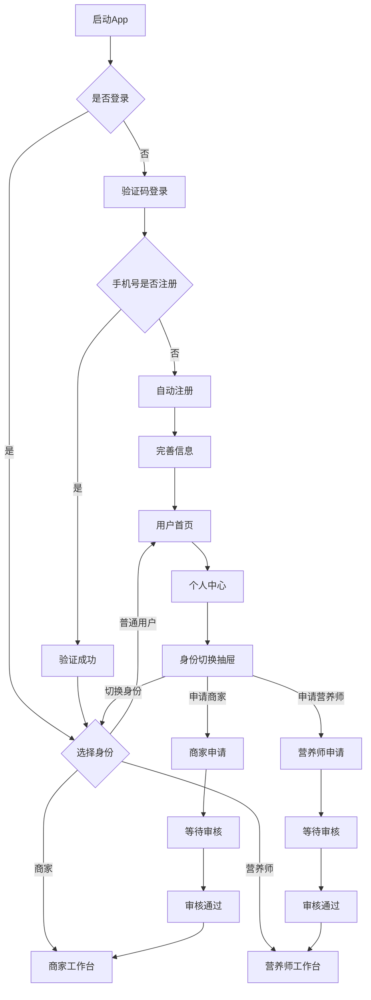
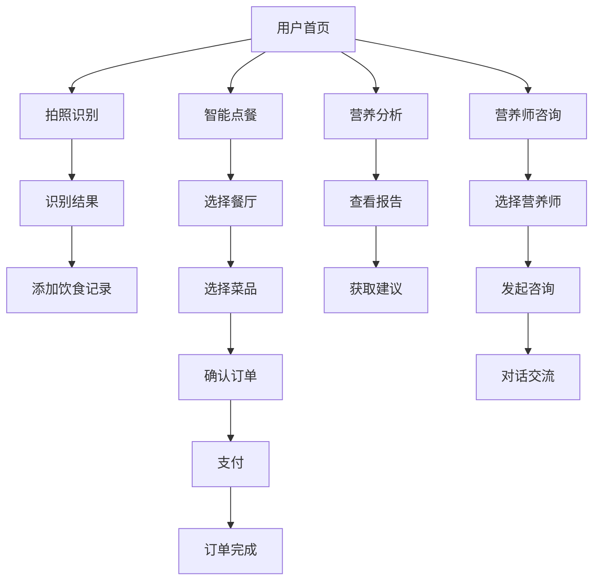
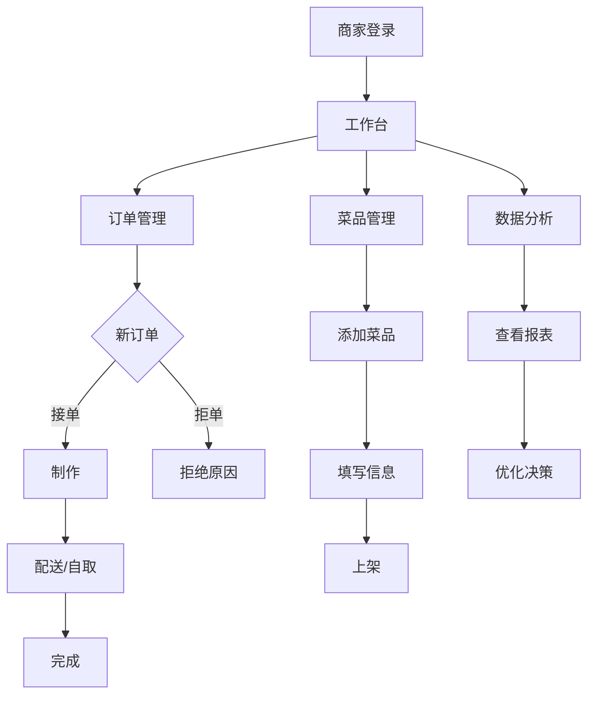
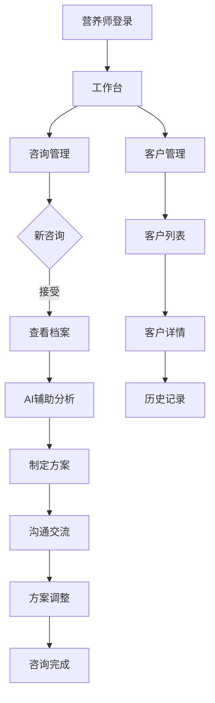

# 营养立方 (Nutrition Cube) - AI智能营养餐厅系统完整页面设计方案

> **文档版本**: 1.0.0  
> **创建日期**: 2025-07-12  
> **更新日期**: 2025-07-12  
> **文档状态**: ✅ 设计阶段  
> **目标受众**: UI/UX设计师、前端开发团队、产品经理

## 📋 目录

- [1. 设计概述](#1-设计概述)
- [2. 用户端设计](#2-用户端设计)
- [3. 商家端设计](#3-商家端设计)
- [4. 营养师端设计](#4-营养师端设计)
- [5. 管理后台设计](#5-管理后台设计)
- [6. 通用组件设计](#6-通用组件设计)
- [7. 页面流程图](#7-页面流程图)
- [8. 交互设计规范](#8-交互设计规范)

---

## 1. 设计概述

### 1.1 设计原则
- **清晰简洁**: 信息层次分明，操作路径直观
- **视觉统一**: 遵循统一的设计语言和组件规范
- **响应式设计**: 适配手机、平板、桌面多种设备
- **无障碍设计**: 支持视觉障碍用户使用
- **情感化设计**: 营造温暖、健康、专业的品牌感

### 1.2 端口划分
```yaml
移动端应用:
  - 用户端App (iOS/Android)
  - 商家端App (iOS/Android)
  - 营养师端App (iOS/Android)

Web端应用:
  - 管理后台 (React)
  - 营养师工作台 (React)
  - 商家管理系统 (React)
```

### 1.3 设计规格
```yaml
移动端:
  - 设计分辨率: 375x812 (iPhone X)
  - 适配范围: 320px - 428px
  - 字体基准: 14px
  - 间距单位: 4px

Web端:
  - 设计分辨率: 1440x900
  - 最小宽度: 1200px
  - 字体基准: 14px
  - 栅格系统: 24列
```

---

## 2. 用户端设计

### 2.1 启动与引导

#### 2.1.1 启动页 (SplashScreen)
```yaml
页面元素:
  - Logo: 3D营养立方体，居中展示，带旋转动画效果
  - 品牌名: "营养立方" (Nutrition Cube)
  - Slogan: "AI智能营养管理专家"
  - 进度条: 底部加载进度
  - 版本号: v2.0.0

交互说明:
  - 自动跳转: 2秒后跳转
  - 首次启动: 进入引导页
  - 非首次: 进入首页/登录页
```

#### 2.1.2 引导页 (OnboardingScreen)
```yaml
页面结构: 3-4个引导页面滑动切换

第一页:
  标题: "AI智能营养分析"
  插图: AI分析食物营养场景
  描述: "拍照识别食物，精准计算营养成分"
  
第二页:
  标题: "个性化营养方案"
  插图: 个性化推荐场景
  描述: "基于您的健康档案，定制专属营养计划"
  
第三页:
  标题: "专业营养师服务"
  插图: 营养师咨询场景
  描述: "随时随地，获得专业营养指导"
  
第四页:
  标题: "开启健康之旅"
  插图: 健康生活场景
  描述: "立即体验智能营养管理"
  按钮: 
    - "立即体验" (主按钮)
    - "跳过" (文字按钮)

交互元素:
  - 页面指示器: 底部圆点
  - 滑动手势: 左右滑动切换
  - 跳过按钮: 右上角，随时跳过
```

### 2.2 认证模块

#### 2.2.1 登录页 (LoginScreen)
```yaml
设计理念:
  - 简洁优雅: 参考薄荷健康等成熟产品设计
  - 便捷登录: 验证码登录为主，密码登录为辅
  - 自动注册: 未注册手机号自动完成注册
  
页面布局:
  顶部区域:
    - Logo: 清新健康的品牌标识
    - Slogan: "AI营养，健康生活"
    - 插图: 简约的健康生活场景
    
  登录表单:
    - 手机号输入框:
      * 图标: 手机图标
      * 占位符: "请输入手机号"
      * 格式化: 自动添加空格 (138 0013 8000)
      * 清除按钮: 右侧X按钮
      
    登录方式切换Tab:
      [验证码登录] [密码登录]
      
    验证码登录模式:
      - 验证码输入框:
        * 占位符: "请输入验证码"
        * 获取验证码按钮: 60秒倒计时
        * 6位数字输入格式
      
    密码登录模式:
      - 密码输入框:
        * 图标: 锁图标
        * 占位符: "请输入密码"
        * 显示/隐藏: 眼睛图标切换
        * 条件显示: 仅当用户已设置密码
        
    - 登录按钮:
      * 文本: "登录" / "登录并注册"
      * 动态文案: 根据手机号是否注册
      * 状态: 默认/按下/禁用/加载
      
  底部区域:
    - 用户协议: "登录即表示同意《用户协议》和《隐私政策》"
    - 其他登录: 微信登录 (可选)

交互逻辑:
  验证码登录流程:
    1. 输入手机号 → 自动验证格式
    2. 点击获取验证码 → 发送短信
    3. 输入验证码 → 验证成功
    4. 首次登录 → 自动注册并进入完善信息页
    5. 老用户 → 直接进入对应身份首页
    
  密码登录流程:
    1. 输入手机号 → 检查是否设置密码
    2. 未设置密码 → 自动切换到验证码模式
    3. 已设置密码 → 显示密码输入框
    4. 验证成功 → 进入对应身份首页
```

#### 2.2.2 完善信息页 (CompleteProfileScreen)
```yaml
触发条件: 首次登录的新用户

页面布局:
  顶部:
    - 进度指示: 1/2 或 跳过按钮
    - 标题: "完善个人信息"
    - 副标题: "帮助我们为您提供更好的服务"
    
  信息表单:
    - 头像上传:
      * 默认头像: 系统生成
      * 点击更换: 相册/拍照
      * 可跳过
      
    - 昵称设置:
      * 占位符: "请输入昵称"
      * 默认值: 根据手机号生成
      * 必填项
      
    - 性别选择:
      * 男/女/不便透露
      * 可跳过
      
    - 生日选择:
      * 年月日选择器
      * 可跳过，影响营养建议精度
      
  底部操作:
    - 邀请码: "有邀请码？输入获得奖励"
    - 完成按钮: "开始健康之旅"
    - 跳过链接: "稍后再说"

交互说明:
  - 信息保存: 实时保存，避免丢失
  - 智能建议: 根据输入信息给出营养建议预览
  - 隐私说明: 明确告知信息用途和保护措施
```

### 2.3 首页模块

#### 2.3.1 首页 (HomeScreen)
```yaml
顶部导航栏:
  左侧:
    - 定位图标 + 当前位置
    - 点击: 选择地址/切换城市
    
  右侧:
    - 搜索图标: 跳转搜索页
    - 消息图标: 红点提示未读
    
轮播Banner:
  - 尺寸: 375x180
  - 内容: 活动推广、新功能介绍
  - 指示器: 底部圆点
  - 自动播放: 3秒切换
  
快捷入口 (网格布局 2x4):
  - 拍照识别: 相机图标 + 文字
  - 营养分析: 图表图标 + 文字
  - 健康餐厅: 餐厅图标 + 文字
  - 营养师咨询: 医生图标 + 文字
  - 健康商城: 购物图标 + 文字
  - 营养方案: 方案图标 + 文字
  - 健康打卡: 日历图标 + 文字
  - 更多服务: 更多图标 + 文字
  
今日推荐 (横向滚动):
  标题栏:
    - 标题: "今日推荐"
    - 副标题: "基于您的营养目标"
    - 更多: 右侧箭头
    
  推荐卡片:
    - 图片: 菜品照片
    - 名称: 菜品名称
    - 标签: 低卡/高蛋白等
    - 热量: xxx千卡
    - 餐厅: 餐厅名称
    - 距离: x.xkm
    
附近餐厅 (垂直列表):
  标题栏:
    - 标题: "附近健康餐厅"
    - 筛选: 筛选图标
    - 地图: 地图视图切换
    
  餐厅卡片:
    - 图片: 餐厅封面图
    - 名称: 餐厅名称
    - 评分: 星级 + 分数
    - 标签: 营养认证/低卡/素食等
    - 人均: ¥xx
    - 距离: x.xkm
    - 营业状态: 营业中/已打烊
    
底部导航栏:
  - 首页: 选中状态
  - 点餐: 餐具图标
  - 营养: 图表图标
  - 社区: 社区图标
  - 我的: 个人图标
```

### 2.4 拍照识别模块

#### 2.4.1 拍照识别页 (CameraScreen)
```yaml
相机界面:
  顶部工具栏:
    - 返回按钮: 左侧
    - 闪光灯: 开/关/自动
    - 相册: 右侧图标
    
  相机预览区:
    - 对焦框: 中央矩形
    - 提示文字: "将食物置于框内"
    - 参考线: 九宫格辅助线
    
  底部控制区:
    - 拍照按钮: 大圆形按钮
    - 历史记录: 左侧小图标
    - 多拍模式: 右侧切换
    
拍照后预览:
  - 图片预览: 全屏显示
  - 重拍按钮: 左下角
  - 使用照片: 右下角
  - 识别中动画: 扫描线效果
```

#### 2.4.2 识别结果页 (RecognitionResultScreen)
```yaml
页面布局:
  图片展示区:
    - 识别图片: 顶部展示
    - 标注框: 识别到的食物区域
    - 置信度: 显示识别准确率
    
  识别结果列表:
    食物项 (可展开):
      - 食物名称: 主标题
      - 重量估算: xxxg
      - 热量: xxx千卡
      - 营养成分:
        * 蛋白质: xxg
        * 脂肪: xxg
        * 碳水: xxg
        * 膳食纤维: xxg
      - 编辑按钮: 修改重量/删除
      
  总计信息:
    - 总热量: xxx千卡
    - 总蛋白质: xxg
    - 总脂肪: xxg
    - 总碳水: xxg
    
  操作按钮:
    - 添加到饮食记录: 主按钮
    - 重新识别: 次要按钮
    - 分享: 图标按钮
```

### 2.5 营养档案模块

#### 2.5.1 营养档案列表 (ProfileListScreen)
```yaml
页面布局:
  顶部栏:
    - 标题: "营养档案"
    - 添加按钮: 右上角+号
    
  档案卡片列表:
    卡片内容:
      - 头像: 左侧圆形
      - 昵称: 主标题
      - 关系标签: 本人/家人/朋友
      - 完善度: 进度条 + 百分比
      - 最后更新: 时间显示
      - 当前使用: 标记图标
      
    卡片操作:
      - 点击: 进入详情
      - 长按: 弹出菜单
      - 滑动: 删除/编辑
      
  空状态:
    - 插图: 空档案插图
    - 文字: "还没有营养档案"
    - 按钮: "创建第一个档案"
    
  底部提示:
    - 文字: "最多可创建10个档案"
```

#### 2.5.2 营养档案详情 (ProfileDetailScreen)
```yaml
页面结构 (分组展示):
  
  基础信息组:
    头部:
      - 头像: 可点击更换
      - 昵称: 可编辑
      - 完善度: 圆形进度图
      
    信息项:
      - 性别: 单选 (男/女)
      - 年龄: 数字输入
      - 身高: xxxcm
      - 体重: xxxkg
      - BMI: 自动计算
      - 活动水平: 下拉选择
      
  健康目标组:
    - 主目标: 单选列表
      * 减重塑形
      * 增肌健身
      * 营养均衡
      * 慢病管理
      * 运动营养
      * 孕期营养
      
    - 具体目标: 根据主目标动态显示
      * 目标体重: xxxkg
      * 目标时间: x个月
      * 每周运动: x次
      
  饮食偏好组:
    - 饮食类型: 多选
      * 无特殊要求
      * 素食主义
      * 清真饮食
      * 低碳饮食
      
    - 口味偏好: 滑块调节
      * 辣度: 不辣 - 特辣
      * 甜度: 不甜 - 特甜
      * 咸度: 清淡 - 重口
      
    - 过敏/禁忌: 标签添加
      * 常见过敏原快捷选择
      * 自定义添加
      
  健康状况组:
    - 慢性疾病: 多选列表
    - 用药情况: 文本记录
    - 营养补充剂: 标签添加
    
  底部操作:
    - 保存按钮: 固定底部
    - AI分析: 生成营养建议
```

### 2.6 智能点餐模块

#### 2.6.1 餐厅详情页 (RestaurantDetailScreen)
```yaml
页面布局:
  头部信息:
    - 封面大图: 可左右滑动
    - 返回按钮: 左上角
    - 分享/收藏: 右上角
    
  餐厅信息卡:
    - 名称: 大标题
    - 评分: 星级 + 分数 + 评价数
    - 标签: 营养认证/特色标签
    - 营业时间: 展开查看详情
    - 地址: 地址 + 导航按钮
    - 电话: 号码 + 拨打按钮
    
  Tab切换区:
    - 点餐: 默认选中
    - 评价: 用户评价
    - 商家: 商家信息
    
  点餐Tab内容:
    左侧分类:
      - 分类列表: 垂直滚动
      - 当前分类: 高亮显示
      - 数量角标: 已选数量
      
    右侧菜品:
      菜品卡片:
        - 图片: 左侧方形
        - 名称: 主标题
        - 描述: 副标题文字
        - 营养标签: 低卡/高蛋白等
        - 营养信息: 热量/蛋白质等
        - 价格: ¥xx
        - 加减按钮: +/-控制
        - 规格选择: 有规格时显示
        
  底部购物车栏:
    - 购物车图标: 数量角标
    - 已选信息: x件 ¥xxx
    - 配送费: ¥x
    - 去结算: 按钮
```

#### 2.6.2 菜品详情页 (DishDetailScreen)
```yaml
页面布局:
  图片展示:
    - 大图: 顶部展示
    - 返回按钮: 左上角
    - 分享按钮: 右上角
    
  基本信息:
    - 菜品名称: 大标题
    - 价格: ¥xx
    - 月售: xxx份
    - 好评率: xx%
    
  营养信息卡:
    - 营养成分表:
      * 能量: xxx千卡
      * 蛋白质: xxg (xx%)
      * 脂肪: xxg (xx%)
      * 碳水化合物: xxg (xx%)
      * 膳食纤维: xxg
      * 钠: xxxmg
      
    - 营养特点标签:
      * 低卡路里
      * 高蛋白
      * 低脂肪
      * 富含纤维
      
    - AI营养建议:
      * 适合人群
      * 食用建议
      * 搭配推荐
      
  规格选择 (如有):
    - 份量: 小/中/大
    - 温度: 冷/热
    - 辣度: 不辣/微辣/中辣/特辣
    - 备注: 文本输入框
    
  底部操作栏:
    - 收藏按钮: 心形图标
    - 加入购物车: 主按钮
    - 立即购买: 次要按钮
```

### 2.7 订单模块

#### 2.7.1 确认订单页 (ConfirmOrderScreen)
```yaml
页面布局:
  配送信息:
    - 配送方式: 外卖/自取切换
    - 收货地址: 
      * 地址信息显示
      * 更换地址按钮
      * 新增地址入口
    - 送达时间: 立即送出/预约时间
    
  订单商品:
    - 店铺名称: 顶部显示
    - 商品列表:
      * 商品名称
      * 规格
      * 数量
      * 单价
      * 小计
    - 打包费: ¥x
    - 配送费: ¥x
    
  优惠信息:
    - 红包: 选择可用红包
    - 优惠券: 选择优惠券
    - 积分抵扣: 使用积分
    
  支付方式:
    - 微信支付: 默认选中
    - 支付宝: 可选
    - 余额支付: 显示余额
    
  备注信息:
    - 订单备注: 文本输入
    - 发票信息: 选择开票
    
  费用明细:
    - 商品总额: ¥xxx
    - 打包费: ¥x
    - 配送费: ¥x
    - 优惠: -¥xx
    - 实付: ¥xxx (醒目显示)
    
  底部操作:
    - 提交订单: 主按钮
```

#### 2.7.2 订单列表页 (OrderListScreen)
```yaml
Tab切换:
  - 全部
  - 待付款
  - 待配送
  - 配送中
  - 已完成
  
订单卡片:
  头部:
    - 店铺名称
    - 订单状态
    - 订单时间
    
  商品信息:
    - 商品图片: 最多3张
    - 商品名称: 省略显示
    - 数量: x件商品
    - 总价: ¥xxx
    
  操作按钮:
    根据状态显示:
    - 待付款: 立即支付/取消订单
    - 待配送: 催单/取消订单
    - 配送中: 查看配送/联系骑手
    - 已完成: 再来一单/评价
    
空状态:
  - 插图: 空订单插图
  - 文字: "还没有订单"
  - 按钮: "去逛逛"
```

### 2.8 营养分析模块

#### 2.8.1 营养分析首页 (NutritionAnalysisScreen)
```yaml
页面布局:
  日期选择器:
    - 日期显示: 今天/昨天/具体日期
    - 左右切换: 箭头按钮
    - 日历图标: 展开日历选择
    
  营养摄入环形图:
    - 中心数据: 总热量 xxx千卡
    - 环形进度: 已摄入/目标值
    - 三大营养素分布:
      * 蛋白质: xx% (xxg)
      * 脂肪: xx% (xxg)  
      * 碳水: xx% (xxg)
      
  营养目标卡片:
    - 热量: 进度条 + 数值
    - 蛋白质: 进度条 + 数值
    - 脂肪: 进度条 + 数值
    - 碳水化合物: 进度条 + 数值
    - 膳食纤维: 进度条 + 数值
    - 水分: 进度条 + 数值
    
  今日饮食记录:
    时段分组:
      早餐 (6:00-9:00):
        - 添加按钮: 未记录时显示
        - 食物列表: 已记录食物
        - 热量小计: xxx千卡
        
      午餐 (11:00-14:00):
        - 同上结构
        
      晚餐 (17:00-20:00):
        - 同上结构
        
      加餐:
        - 同上结构
        
  底部操作:
    - 快速记录: 浮动按钮
    - 拍照识别: 相机图标
    - 手动添加: 加号图标
    - 历史记录: 列表图标
```

#### 2.8.2 营养报告页 (NutritionReportScreen)
```yaml
报告类型选择:
  - 日报
  - 周报
  - 月报
  
报告内容:
  概览卡片:
    - 时间范围: 具体日期
    - 综合评分: 大字体分数
    - 评价: 优秀/良好/需改善
    
  营养趋势图表:
    - 热量趋势: 折线图
    - 营养素达标率: 柱状图
    - 饮食规律性: 热力图
    
  详细分析:
    营养摄入分析:
      - 平均每日热量
      - 三大营养素比例
      - 微量元素情况
      - 膳食纤维摄入
      
    饮食习惯分析:
      - 用餐规律性
      - 饮食多样性
      - 健康食物占比
      
    改善建议:
      - AI生成的个性化建议
      - 推荐食谱
      - 注意事项
      
  操作按钮:
    - 分享报告: 图片形式
    - 下载PDF: 完整报告
    - 咨询营养师: 快捷入口
```

### 2.9 社区模块

#### 2.9.1 社区首页 (CommunityScreen)
```yaml
顶部Tab:
  - 推荐: 默认选中
  - 关注: 关注的人
  - 话题: 热门话题
  - 官方: 官方内容
  
帖子卡片:
  用户信息栏:
    - 头像: 圆形小图
    - 昵称: 用户名
    - 认证标识: 营养师/官方
    - 发布时间: x小时前
    - 关注按钮: 未关注时显示
    
  内容区:
    - 文字内容: 最多显示3行
    - 图片: 九宫格布局
    - 话题标签: #健康饮食
    
  互动栏:
    - 点赞: 图标 + 数量
    - 评论: 图标 + 数量
    - 分享: 图标
    - 收藏: 图标
    
发布按钮:
  - 位置: 右下角悬浮
  - 图标: +号
  - 点击: 弹出发布选项
```

#### 2.9.2 发布内容页 (PublishScreen)
```yaml
页面布局:
  顶部栏:
    - 取消: 左侧
    - 发布: 右侧按钮
    
  内容编辑区:
    - 文字输入: 
      * 占位符: "分享你的健康心得..."
      * 字数限制: 0/500
      
    - 图片添加:
      * 添加按钮: +号方块
      * 最多9张: 网格显示
      * 图片操作: 删除/编辑
      
    - 话题添加:
      * 添加话题: #图标
      * 热门话题: 快捷选择
      
  发布设置:
    - 谁可以看: 公开/仅关注/私密
    - 定位: 添加位置信息
    - @用户: 提及其他用户
    
  底部工具栏:
    - 相册: 图片图标
    - 拍照: 相机图标
    - 话题: #图标
    - @: @图标
```

### 2.10 个人中心模块

#### 2.10.1 个人中心首页 (ProfileScreen)
```yaml
页面布局:
  顶部导航:
    - 左侧: 身份切换按钮 [🔄] (重要交互入口)
    - 标题: "个人中心"
    - 右侧: 设置按钮 [⚙️]
    
  个人信息区:
    背景图: 可自定义渐变背景
    用户信息:
      - 头像: 大圆形图片 (可点击更换)
      - 昵称: 主标题 (可点击编辑)
      - 当前身份标识: 「普通用户」/「商家」/「营养师」
      - 个人简介: 一句话介绍 (可编辑)
      
    统计数据 (根据身份动态显示):
      普通用户:
        - 打卡天数: xx天
        - 营养分: xxx分
        - 关注营养师: x人
        - 收藏菜谱: x个
        
      商家身份:
        - 店铺评分: ⭐4.8
        - 月销售额: ¥xxx
        - 服务顾客: xxx人
        - 好评率: xx%
        
      营养师身份:
        - 服务客户: xxx人
        - 咨询时长: xxx小时
        - 客户好评: xx%
        - 收入本月: ¥xxx
      
  快捷功能 (根据身份动态显示):
    普通用户功能:
      第一行:
        - 我的订单: 订单图标 + 待处理角标
        - 我的收藏: 收藏图标
        - 浏览历史: 历史图标
        - 优惠券: 券图标 + 可用数量
        
      第二行:
        - 营养档案: 档案图标
        - 健康报告: 报告图标
        - 家人管理: 家人图标
        - 积分商城: 积分图标
        
    商家功能 (当用户有商家身份时显示):
      - 店铺管理: 快捷进入商家后台
      - 订单处理: 待处理订单数提醒
      - 数据统计: 今日经营数据
      
    营养师功能 (当用户有营养师身份时显示):
      - 咨询管理: 待回复数提醒
      - 客户档案: 客户管理入口
      - 收入统计: 收入数据查看
      
  设置菜单:
    账号安全:
      - 设置登录密码: 箭头指向 (首次显示"未设置"提醒)
      - 绑定微信: 开关状态
      - 手机号更换: 箭头指向
      
    身份管理:
      - 申请成为商家: 条件显示
      - 申请成为营养师: 条件显示
      - 身份认证状态: 显示认证进度
      
    通用设置:
      - 隐私设置: 箭头指向
      - 消息通知: 开关显示状态
      - 清理缓存: 显示大小
      - 关于我们: 箭头指向
      - 意见反馈: 箭头指向
      - 退出登录: 红色文字
```

#### 2.10.2 身份切换抽屉 (RoleSwitchDrawer)
```yaml
触发方式: 
  - 个人中心左上角身份切换按钮
  - 从左侧滑出，宽度约70%屏幕
  
抽屉内容:
  顶部用户信息:
    - 头像: 圆形头像
    - 昵称: 用户昵称
    - 手机号: 脱敏显示 (138****8000)
    
  身份列表:
    普通用户:
      - 图标: 👤 用户图标
      - 名称: "普通用户"
      - 状态: 当前身份高亮显示
      - 描述: "享受智能营养服务"
      
    商家身份 (如已开通):
      - 图标: 🏪 商家图标
      - 名称: "我的店铺"
      - 状态: 营业中/已打烊
      - 描述: "管理店铺和订单"
      - 快捷数据: 今日订单x单
      
    营养师身份 (如已开通):
      - 图标: 👩‍⚕️ 营养师图标
      - 名称: "营养师工作台"
      - 状态: 在线/离线
      - 描述: "为客户提供专业服务"
      - 快捷数据: 待回复咨询x条
      
  身份申请入口 (如未开通):
    - 申请成为商家:
      * 图标: 🏪 + 加号
      * 文字: "申请成为商家"
      * 说明: "开启线上经营之路"
      
    - 申请成为营养师:
      * 图标: 👩‍⚕️ + 加号
      * 文字: "申请成为营养师"
      * 说明: "分享专业知识，获得收入"
      
  底部操作:
    - 账号设置: 快捷入口
    - 退出登录: 红色文字

交互行为:
  - 点击身份: 切换到对应身份，抽屉自动收起
  - 点击遮罩: 关闭抽屉
  - 左滑抽屉: 关闭抽屉
  - 切换动画: 身份图标旋转，界面淡入淡出
  
状态记忆:
  - 记住用户最后使用的身份
  - 下次启动自动进入该身份
  - 支持设置默认身份
```

---

## 3. 商家端设计

### 3.1 商家身份管理

#### 3.1.1 商家身份切换说明
```yaml
设计理念:
  - 统一账号: 商家功能集成在主App中
  - 身份切换: 通过抽屉切换到商家身份
  - 无需单独登录: 使用统一的手机号认证
  
进入方式:
  1. 个人中心 → 身份切换抽屉 → 选择商家身份
  2. 首次需要申请商家资质认证
  3. 审核通过后即可使用商家功能
```

#### 3.1.2 商家申请页 (MerchantApplicationScreen)
```yaml
触发入口: 身份切换抽屉中的"申请成为商家"

页面布局:
  申请流程指示:
    - 步骤条: 基本信息 → 资质认证 → 审核等待 → 开通成功
    
  基本信息:
    - 店铺名称*: 文本输入
    - 店铺类型*: 下拉选择 (快餐/正餐/轻食/饮品等)
    - 经营地址*: 地图选点 + 详细地址
    - 联系电话*: 手机号码
    - 店铺简介: 文本域
    
  资质认证:
    - 营业执照: 拍照上传 + OCR识别
    - 食品经营许可证: 拍照上传
    - 身份证照片: 正反面上传
    - 店铺门头照: 实景拍摄
    
  提交审核:
    - 审核说明: 3-5个工作日
    - 提交按钮: "提交审核"
    - 联系客服: 遇到问题联系方式

交互说明:
  - OCR识别: 自动提取营业执照信息
  - 实时验证: 必填项检查
  - 进度保存: 支持分步骤完成
```

### 3.2 商家工作台

#### 3.2.1 商家首页 (MerchantHomeScreen)
```yaml
页面布局:
  店铺信息卡:
    - 店铺名称: 大标题
    - 营业状态: 开关切换
    - 今日营业额: ¥xxxx
    - 今日订单: xxx单
    
  快捷操作:
    - 订单管理: 显示待处理数
    - 菜品管理: 图标入口
    - 数据分析: 图标入口
    - 营销活动: 图标入口
    
  实时订单:
    订单提醒:
      - 新订单: 声音+弹窗提醒
      - 订单卡片:
        * 订单号: #xxxxx
        * 下单时间: xx:xx
        * 配送方式: 外卖/自取
        * 订单金额: ¥xxx
        * 操作: 接单/拒单
        
  待办事项:
    - 待接单: x个
    - 待配送: x个
    - 待退款: x个
    - 缺货商品: x个
```

### 3.3 订单管理

#### 3.3.1 订单管理页 (OrderManagementScreen)
```yaml
Tab分类:
  - 待处理
  - 进行中
  - 已完成
  - 已取消
  - 全部订单
  
筛选条件:
  - 时间范围: 今天/本周/本月
  - 订单类型: 堂食/外卖/自取
  - 支付状态: 已支付/未支付
  
订单列表项:
  订单头部:
    - 订单号: #xxxxx
    - 订单状态: 彩色标签
    - 下单时间: xx:xx
    
  订单内容:
    - 用户信息: 昵称+手机号
    - 商品列表: 
      * 商品名 x数量
      * 规格信息
    - 备注信息: 用户备注
    
  订单金额:
    - 商品总额: ¥xxx
    - 优惠: -¥xx
    - 实收: ¥xxx
    
  操作按钮:
    根据状态:
    - 待处理: 接单/拒单
    - 制作中: 配送/自取备妥
    - 配送中: 查看配送
    - 已完成: 查看详情
```

### 3.4 菜品管理

#### 3.4.1 菜品列表页 (DishListScreen)
```yaml
页面功能:
  顶部操作:
    - 搜索框: 搜索菜品
    - 添加菜品: +按钮
    - 批量操作: 多选模式
    
  分类切换:
    - 分类列表: 左侧边栏
    - 分类管理: 编辑入口
    
  菜品列表:
    菜品卡片:
      - 图片: 左侧方图
      - 菜名: 主标题
      - 价格: ¥xx
      - 销量: 月售xxx
      - 库存: 剩余xxx
      - 状态: 上架/下架开关
      
    快捷操作:
      - 编辑: 编辑图标
      - 删除: 删除图标
      - 推荐: 设为推荐
      
  批量操作栏:
    - 全选: 复选框
    - 批量上架
    - 批量下架
    - 批量删除
```

#### 3.4.2 添加/编辑菜品页 (AddDishScreen)
```yaml
表单内容:
  基本信息:
    - 菜品名称*: 文本输入
    - 菜品分类*: 下拉选择
    - 菜品图片*: 
      * 主图上传
      * 最多5张
      * 建议尺寸提示
      
  价格库存:
    - 价格*: 数字输入
    - 会员价: 可选设置
    - 库存: 数量设置
    - 每日供应量: 限量设置
    
  营养信息:
    - 能量*: xxx千卡/100g
    - 蛋白质*: xxg/100g
    - 脂肪*: xxg/100g
    - 碳水化合物*: xxg/100g
    - 其他营养素: 展开添加
    - AI识别: 上传图片自动识别
    
  规格设置:
    - 启用规格: 开关
    - 规格组: 
      * 规格名: 如"份量"
      * 规格值: 小份/大份
      * 价格设置: 每个规格价格
      
  详细描述:
    - 菜品介绍: 富文本编辑
    - 原料: 主要原料
    - 口味: 标签选择
    - 烹饪方式: 下拉选择
    
  营销设置:
    - 推荐菜品: 开关
    - 新品标识: 开关
    - 限时特价: 时间设置
    
  底部操作:
    - 保存草稿
    - 保存并上架
    - 取消
```

### 3.5 数据分析

#### 3.5.1 数据概览页 (DataOverviewScreen)
```yaml
时间选择器:
  - 今日
  - 本周  
  - 本月
  - 自定义日期
  
核心指标卡片:
  - 营业额: 
    * 数值: ¥xxxxx
    * 环比: ↑ +15%
    * 趋势图: 迷你折线图
    
  - 订单量:
    * 数值: xxx单
    * 环比: ↑ +8%
    * 趋势图: 迷你折线图
    
  - 客单价:
    * 数值: ¥xx
    * 环比: ↓ -3%
    * 趋势图: 迷你折线图
    
  - 好评率:
    * 数值: xx%
    * 环比: → 0%
    * 趋势图: 迷你折线图
    
图表分析:
  营业趋势:
    - 折线图: 按时间显示
    - 双轴: 金额/订单量
    
  订单分布:
    - 饼图: 堂食/外卖/自取
    - 数据标签: 显示占比
    
  热销菜品TOP10:
    - 横向柱状图
    - 显示销量和金额
    
  时段分析:
    - 24小时热力图
    - 显示订单集中时段
```

### 3.6 营销管理

#### 3.6.1 营销活动页 (MarketingScreen)
```yaml
活动类型:
  - 满减活动
  - 折扣活动
  - 新客专享
  - 会员特惠
  
活动列表:
  活动卡片:
    - 活动名称: 主标题
    - 活动类型: 彩色标签
    - 活动时间: 起止时间
    - 活动状态: 进行中/已结束/未开始
    - 参与人数: xxx人
    - 使用次数: xxx次
    
  操作按钮:
    - 查看详情
    - 编辑
    - 复制
    - 结束
    
创建活动:
  基本信息:
    - 活动名称
    - 活动类型
    - 活动时间
    
  活动规则:
    满减设置:
      - 满xx元减xx元
      - 阶梯设置
      
    折扣设置:
      - 折扣比例
      - 最高优惠
      
  适用范围:
    - 全部菜品
    - 指定菜品
    - 指定分类
    
  其他设置:
    - 每人限领
    - 总数限制
    - 新客专享
```

---

## 4. 营养师端设计

### 4.1 营养师身份管理

#### 4.1.1 营养师身份切换说明
```yaml
设计理念:
  - 统一账号: 营养师功能集成在主App中
  - 专业认证: 需要营养师资格证书认证
  - 服务质量: 平台统一管理和质量监控
  
进入方式:
  1. 个人中心 → 身份切换抽屉 → 选择营养师身份
  2. 首次需要申请营养师资质认证
  3. 审核通过后即可提供咨询服务
```

#### 4.1.2 营养师申请页 (NutritionistApplicationScreen)
```yaml
触发入口: 身份切换抽屉中的"申请成为营养师"

页面布局:
  申请流程指示:
    - 步骤条: 资格认证 → 专业评估 → 培训考核 → 开通服务
    
  资格认证:
    - 营养师证书*: 拍照上传 + 证书编号
    - 学历证明: 相关专业学历
    - 工作经历: 营养相关工作经验
    - 身份证明: 身份证照片
    
  专业信息:
    - 专业领域*: 多选 (减重/增肌/慢病/孕期等)
    - 执业年限*: 下拉选择
    - 服务经验: 文字描述
    - 专业特长: 标签选择
    
  服务设置:
    - 咨询价格: 建议价格区间
    - 服务时间: 可接受咨询的时间段
    - 个人简介: 向客户展示的介绍
    
  审核提交:
    - 平台规则: 营养师服务规范
    - 提交按钮: "提交申请"
    - 培训安排: 通过后需参加平台培训

交互说明:
  - 证书验证: 对接官方数据库验证
  - 专业评估: 可能需要线上答题
  - 培训考核: 视频培训 + 考试
```

#### 4.1.3 营养师首页 (NutritionistHomeScreen)
```yaml
页面布局:
  个人信息卡:
    - 头像: 圆形大图
    - 姓名: 营养师姓名
    - 认证信息: 认证标识
    - 评分: 星级评分
    - 服务人数: xxx人
    
  今日概况:
    - 待回复咨询: x个
    - 今日咨询: x次
    - 本月收入: ¥xxxx
    - 客户好评率: xx%
    
  快捷入口:
    - 咨询管理: 红点提醒
    - 客户档案: 图标入口
    - 方案模板: 图标入口
    - 知识库: 图标入口
    - 收入统计: 图标入口
    - 个人设置: 图标入口
    
  待办提醒:
    - 未读咨询: x条
    - 方案待更新: x个
    - 回访提醒: x个
```

### 4.2 咨询管理

#### 4.2.1 咨询列表页 (ConsultationListScreen)
```yaml
Tab分类:
  - 进行中
  - 待接单
  - 已完成
  - 全部
  
咨询卡片:
  用户信息:
    - 头像: 圆形小图
    - 昵称: 用户昵称
    - 标签: VIP/新客户
    - 咨询时间: 最后消息时间
    
  咨询概要:
    - 咨询类型: 减重/增肌/慢病等
    - 最新消息: 文字预览
    - 未读数: 红点数字
    
  操作按钮:
    - 进入咨询: 主按钮
    - 查看档案: 次要按钮
```

#### 4.2.2 咨询对话页 (ConsultationChatScreen)
```yaml
页面结构:
  顶部栏:
    - 用户信息: 头像+昵称
    - 查看档案: 快捷入口
    - 更多操作: 结束咨询等
    
  消息区域:
    消息类型:
      - 文字消息: 气泡显示
      - 图片消息: 可点击放大
      - 语音消息: 时长显示
      - 营养方案: 卡片展示
      - 食谱推荐: 结构化展示
      
    系统提示:
      - 咨询开始提醒
      - 用户档案更新
      - 咨询时长提醒
      
  输入区域:
    - 文字输入框
    - 发送按钮
    - 工具栏:
      * 图片: 发送图片
      * 方案: 快捷方案
      * 食谱: 推荐食谱
      * 语音: 语音输入
      
  AI辅助面板:
    - AI建议: 根据对话生成
    - 快捷回复: 常用语模板
    - 相关知识: 知识库引用
```

### 4.3 客户管理

#### 4.3.1 客户列表页 (ClientListScreen)
```yaml
搜索筛选:
  - 搜索框: 姓名/手机号
  - 标签筛选: VIP/活跃/流失
  - 排序: 最近咨询/消费金额
  
客户卡片:
  基本信息:
    - 头像姓名
    - 健康目标
    - 最近咨询
    - 消费总额
    
  标签信息:
    - VIP等级
    - 活跃度
    - 特殊标记
    
  快捷操作:
    - 查看详情
    - 发起咨询
    - 添加备注
```

#### 4.3.2 客户详情页 (ClientDetailScreen)
```yaml
页面内容:
  基本信息:
    - 个人资料汇总
    - 健康档案概览
    - 咨询历史统计
    
  健康档案:
    - 基础数据
    - 健康目标
    - 饮食偏好
    - 过敏禁忌
    
  咨询记录:
    - 时间轴展示
    - 每次咨询摘要
    - 方案执行情况
    
  营养方案:
    - 当前方案
    - 历史方案
    - 执行反馈
    
  备注信息:
    - 特殊情况
    - 注意事项
    - 跟进计划
```

### 4.4 方案管理

#### 4.4.1 方案模板库 (TemplateLibraryScreen)
```yaml
模板分类:
  - 减重方案
  - 增肌方案
  - 慢病管理
  - 孕期营养
  - 儿童营养
  - 运动营养
  
模板卡片:
  - 模板名称
  - 适用人群
  - 使用次数
  - 最近更新
  - 预览按钮
  - 使用按钮
  
创建模板:
  - 模板名称
  - 适用场景
  - 方案内容
  - 食谱搭配
  - 注意事项
```

### 4.5 知识管理

#### 4.5.1 知识库页面 (KnowledgeBaseScreen)
```yaml
知识分类:
  - 营养基础
  - 疾病营养
  - 食物营养
  - 膳食指南
  - 最新研究
  
知识卡片:
  - 标题
  - 分类标签
  - 更新时间
  - 阅读次数
  - 收藏状态
  
知识详情:
  - 正文内容
  - 参考文献
  - 相关链接
  - 收藏分享
```

---

## 5. 管理后台设计

### 5.1 登录页面

#### 5.1.1 管理员登录 (AdminLoginScreen)
```yaml
页面设计:
  左侧信息:
    - 系统Logo
    - 系统名称
    - 版权信息
    
  右侧登录:
    - 账号输入框
    - 密码输入框
    - 验证码: 图形验证
    - 记住密码
    - 登录按钮
    
  安全提示:
    - 登录IP记录
    - 异常登录提醒
```

### 5.2 仪表盘

#### 5.2.1 数据总览 (DashboardScreen)
```yaml
顶部指标卡:
  - 用户总数: 实时数据
  - 商家总数: 实时数据
  - 今日订单: 实时数据
  - 今日营收: 实时数据
  
图表展示区:
  - 用户增长趋势: 折线图
  - 订单分布: 饼图
  - 营收趋势: 柱状图
  - 地区分布: 地图
  
实时监控:
  - 在线用户数
  - 活跃商家数
  - 订单处理状态
  - 系统运行状态
  
快捷操作:
  - 用户管理
  - 商家管理
  - 订单管理
  - 系统设置
```

### 5.3 用户管理

#### 5.3.1 用户列表 (UserManagementScreen)
```yaml
搜索筛选栏:
  - 用户ID/手机号/昵称
  - 注册时间范围
  - 用户状态
  - 用户等级
  
数据表格:
  列信息:
    - 用户ID
    - 头像昵称
    - 手机号
    - 注册时间
    - 最后登录
    - 订单数
    - 消费金额
    - 状态
    - 操作
    
操作按钮:
  - 查看详情
  - 编辑信息
  - 冻结/解冻
  - 重置密码
  
批量操作:
  - 批量导出
  - 批量冻结
  - 批量发送通知
```

### 5.4 商家管理

#### 5.4.1 商家列表 (MerchantManagementScreen)
```yaml
页面功能:
  筛选条件:
    - 商家名称/ID
    - 入驻时间
    - 营业状态
    - 认证状态
    
  商家表格:
    - 商家ID
    - 商家名称
    - 联系人
    - 联系电话
    - 营业状态
    - 认证状态
    - 入驻时间
    - 月销售额
    - 操作
    
  操作功能:
    - 查看详情
    - 审核认证
    - 编辑信息
    - 暂停营业
    - 数据统计
```

### 5.5 订单管理

#### 5.5.1 订单列表 (OrderManagementScreen)
```yaml
筛选搜索:
  - 订单号
  - 用户手机号
  - 商家名称
  - 订单状态
  - 时间范围
  
订单表格:
  - 订单号
  - 下单时间
  - 用户信息
  - 商家信息
  - 订单金额
  - 支付状态
  - 订单状态
  - 操作
  
操作按钮:
  - 查看详情
  - 退款处理
  - 导出订单
```

### 5.6 营养师管理

#### 5.6.1 营养师列表 (NutritionistManagementScreen)
```yaml
管理功能:
  认证审核:
    - 待审核列表
    - 资质查看
    - 审核通过/拒绝
    
  营养师列表:
    - 营养师信息
    - 认证状态
    - 服务质量
    - 投诉记录
    - 收入统计
    
  质量监控:
    - 服务评分
    - 投诉处理
    - 违规记录
```

### 5.7 内容管理

#### 5.7.1 内容审核 (ContentManagementScreen)
```yaml
审核队列:
  - 帖子审核
  - 评论审核
  - 图片审核
  - 举报处理
  
审核操作:
  - 通过
  - 拒绝
  - 标记敏感
  - 警告用户
```

### 5.8 系统设置

#### 5.8.1 系统配置 (SystemSettingsScreen)
```yaml
配置模块:
  基础设置:
    - 系统名称
    - Logo上传
    - 备案信息
    
  支付设置:
    - 支付方式开关
    - 手续费设置
    - 结算周期
    
  通知设置:
    - 短信模板
    - 推送配置
    - 邮件设置
    
  权限管理:
    - 角色管理
    - 权限分配
    - 操作日志
```

---

## 6. 通用组件设计

### 6.1 导航组件

#### 6.1.1 底部导航栏 (BottomNavBar)
```yaml
设计规格:
  - 高度: 49px + 安全区域
  - 图标: 24x24px
  - 选中色: 主题色
  - 未选中: #999999
  
交互效果:
  - 点击反馈: 缩放动画
  - 切换动画: 渐变过渡
  - 角标显示: 红点/数字
```

#### 6.1.2 顶部导航栏 (TopNavBar)
```yaml
设计规格:
  - 高度: 44px + 状态栏
  - 标题: 17px 居中
  - 按钮: 44x44px 热区
  
常见样式:
  - 透明导航
  - 渐变导航
  - 大标题导航
```

### 6.2 表单组件

#### 6.2.1 输入框 (InputField)
```yaml
状态样式:
  - 默认: 灰色边框
  - 聚焦: 主题色边框
  - 错误: 红色边框
  - 禁用: 背景变灰
  
辅助元素:
  - 前置图标
  - 后置按钮
  - 清除按钮
  - 错误提示
```

#### 6.2.2 选择器 (Picker)
```yaml
类型:
  - 单列选择
  - 多列选择
  - 日期选择
  - 时间选择
  - 地区选择
  
交互:
  - 滚动选择
  - 确认/取消
  - 默认值设置
```

### 6.3 反馈组件

#### 6.3.1 加载状态 (Loading)
```yaml
类型:
  - 全屏加载
  - 局部加载
  - 下拉刷新
  - 上拉加载
  
样式:
  - 转圈动画
  - 骨架屏
  - 进度条
```

#### 6.3.2 空状态 (EmptyState)
```yaml
场景:
  - 无数据
  - 无网络
  - 加载失败
  - 无权限
  
元素:
  - 插图
  - 描述文字
  - 操作按钮
```

### 6.4 弹窗组件

#### 6.4.1 模态弹窗 (Modal)
```yaml
类型:
  - 确认弹窗
  - 信息弹窗
  - 输入弹窗
  - 选择弹窗
  
结构:
  - 标题
  - 内容
  - 按钮组
  - 关闭按钮
```

#### 6.4.2 提示Toast
```yaml
类型:
  - 成功提示
  - 错误提示
  - 警告提示
  - 加载提示
  
位置:
  - 顶部
  - 中间
  - 底部
```

---

## 7. 页面流程图

### 7.1 统一认证和多身份流程



### 7.2 用户端核心流程



### 7.3 商家端核心流程



### 7.4 营养师端核心流程



---

## 8. 交互设计规范

### 8.1 手势交互

```yaml
基础手势:
  - 点击: 选择/确认
  - 长按: 更多选项
  - 滑动: 翻页/切换
  - 下拉: 刷新
  - 上拉: 加载更多
  - 左滑: 删除/更多
  - 右滑: 返回
  - 双指缩放: 图片查看
  - 双击: 快捷操作
```

### 8.2 动画效果

```yaml
页面转场:
  - push: 从右进入
  - pop: 向右退出
  - present: 从下进入
  - dismiss: 向下退出
  
元素动画:
  - 淡入淡出: 200ms
  - 缩放: 弹性效果
  - 位移: ease-in-out
  - 旋转: 加载动画
```

### 8.3 反馈机制

```yaml
操作反馈:
  - 点击: 波纹效果
  - 成功: 绿色提示
  - 失败: 红色提示
  - 加载: 转圈动画
  
状态反馈:
  - 禁用: 半透明
  - 选中: 高亮显示
  - 错误: 红色描边
  - 焦点: 蓝色描边
```

### 8.4 键盘交互

```yaml
键盘处理:
  - 自动弹起: 输入框聚焦
  - 工具栏: 完成/下一项
  - 遮挡处理: 页面上移
  - 收起方式: 点击空白处
```

---

## 9. 适配方案

### 9.1 屏幕适配

```yaml
iPhone适配:
  - iPhone SE: 320px宽度
  - iPhone 8: 375px宽度
  - iPhone 14 Pro Max: 428px宽度
  - 刘海屏: 安全区域处理
  
Android适配:
  - 小屏: 360px宽度
  - 标准: 384px宽度
  - 大屏: 411px宽度
  - 折叠屏: 响应式布局
```

### 9.2 深色模式

```yaml
配色方案:
  浅色模式:
    - 背景: #FFFFFF
    - 文字: #333333
    - 分割线: #EEEEEE
    
  深色模式:
    - 背景: #000000
    - 文字: #FFFFFF
    - 分割线: #2C2C2E
```

---

## 文档说明

本文档提供了AI智能营养餐厅系统的完整页面设计方案，包含了用户端、商家端、营养师端和管理后台的所有主要页面设计。每个页面都详细说明了布局结构、功能元素、交互逻辑等内容。

设计团队可以基于此文档进行高保真原型设计，开发团队可以据此实现具体功能。如需补充其他页面或调整设计细节，请随时反馈。