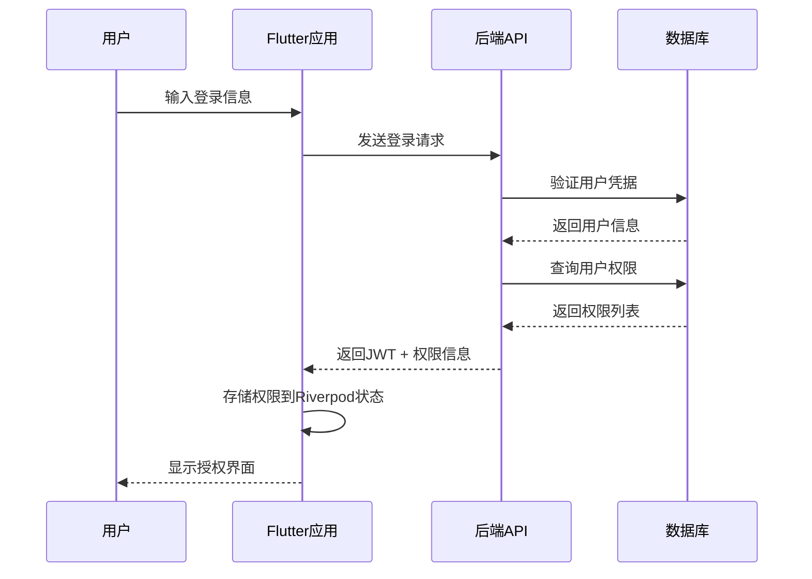

# 用户权限系统设计

> **文档版本**: 1.0.0  
> **创建日期**: 2025-07-13  
> **更新日期**: 2025-07-13  
> **文档状态**: ✅ 设计就绪  
> **目标受众**: 前端开发团队、权限系统设计师

## 📋 目录

- [1. 权限系统概述](#1-权限系统概述)
- [2. 角色权限设计](#2-角色权限设计)
- [3. 前端权限控制](#3-前端权限控制)
- [4. 权限验证流程](#4-权限验证流程)
- [5. UI权限展示](#5-ui权限展示)

---

## 1. 权限系统概述

### 1.1 设计原则

```yaml
权限控制原则:
  最小权限原则:
    - 用户仅获得必需的最小权限
    - 权限默认拒绝，明确授权
    - 定期权限审核和清理
    
  分层权限管理:
    - 系统级权限：超级管理员
    - 平台级权限：平台运营
    - 商家级权限：商家管理员
    - 用户级权限：普通用户
    
  权限继承机制:
    - 上级角色继承下级权限
    - 支持权限组合和排除
    - 动态权限分配
```

### 1.2 权限技术架构

```yaml
技术实现:
  前端权限控制:
    - Riverpod状态管理
    - 路由级权限守卫
    - 组件级权限控制
    - UI元素动态显示/隐藏
    
  后端权限验证:
    - JWT Token携带权限信息
    - 装饰器注解权限检查
    - 数据库权限存储
    - 缓存权限提升性能
```

---

## 2. 角色权限设计

### 2.1 角色定义

```yaml
系统角色分类:
  超级管理员 (super_admin):
    权限范围: "所有系统功能"
    用户数量: "1-2个"
    权限列表:
      - system.manage.*
      - user.manage.*
      - merchant.manage.*
      - order.manage.*
      - data.export.*
      
  平台运营 (platform_operator):
    权限范围: "平台运营管理"
    用户数量: "5-10个"
    权限列表:
      - merchant.audit
      - user.support
      - order.refund
      - data.analytics
      
  商家管理员 (merchant_admin):
    权限范围: "单商家全权限"
    用户数量: "每商家1-2个"
    权限列表:
      - merchant.settings.*
      - dish.manage.*
      - order.manage.*
      - staff.manage.*
      
  商家员工 (merchant_staff):
    权限范围: "限定业务操作"
    用户数量: "每商家3-5个"
    权限列表:
      - order.view
      - order.process
      - dish.view
      
  普通用户 (customer):
    权限范围: "个人账户管理"
    用户数量: "无限制"
    权限列表:
      - profile.manage
      - order.create
      - order.view_own
      - review.create
```

### 2.2 权限粒度设计

```yaml
权限操作类型:
  查看权限 (view):
    - *.view: 查看基础信息
    - *.view_detail: 查看详细信息
    - *.view_sensitive: 查看敏感信息
    
  编辑权限 (edit):
    - *.create: 创建新记录
    - *.update: 修改现有记录
    - *.delete: 删除记录
    
  管理权限 (manage):
    - *.audit: 审核操作
    - *.approve: 批准操作
    - *.reject: 拒绝操作
    
  数据权限 (data):
    - *.export: 数据导出
    - *.import: 数据导入
    - *.analytics: 数据分析
```

---

## 3. 前端权限控制

### 3.1 Riverpod权限状态管理

```dart
// lib/providers/auth_provider.dart
@riverpod
class AuthNotifier extends _$AuthNotifier {
  @override
  AuthState build() {
    return AuthState.initial();
  }

  Future<void> login(String email, String password) async {
    final authService = ref.read(authServiceProvider);
    final result = await authService.login(email, password);
    
    if (result.isSuccess) {
      state = AuthState.authenticated(
        user: result.user,
        permissions: result.permissions,
        token: result.token,
      );
    }
  }

  bool hasPermission(String permission) {
    return state.permissions.contains(permission);
  }

  bool hasAnyPermission(List<String> permissions) {
    return permissions.any((p) => state.permissions.contains(p));
  }
}

// 权限状态定义 (使用Built Value替代Freezed)
abstract class AuthState implements Built<AuthState, AuthStateBuilder> {
  AuthStateType get type;
  User? get user;
  BuiltList<String>? get permissions;
  String? get token;

  AuthState._();
  factory AuthState([void Function(AuthStateBuilder) updates]) = _$AuthState;

  factory AuthState.initial() => AuthState((b) => b..type = AuthStateType.initial);
  
  factory AuthState.authenticated({
    required User user,
    required List<String> permissions,
    required String token,
  }) => AuthState((b) => b
    ..type = AuthStateType.authenticated
    ..user = user.toBuilder()
    ..permissions = BuiltList<String>(permissions).toBuilder()
    ..token = token);
  
  factory AuthState.unauthenticated() => AuthState((b) => b..type = AuthStateType.unauthenticated);
}

enum AuthStateType { initial, authenticated, unauthenticated }
```

### 3.2 路由权限守卫

```dart
// lib/router/auth_guard.dart
class AuthGuard {
  static bool canActivate(String route, WidgetRef ref) {
    final authState = ref.read(authNotifierProvider);
    
    // 路由权限映射
    final routePermissions = {
      '/admin': ['system.manage'],
      '/merchant/settings': ['merchant.settings.view'],
      '/orders': ['order.view'],
      '/analytics': ['data.analytics'],
    };
    
    if (authState is! _Authenticated) {
      return false;
    }
    
    final requiredPermissions = routePermissions[route] ?? [];
    return requiredPermissions.every(
      (permission) => authState.permissions.contains(permission),
    );
  }
}

// 路由配置
@TypedGoRoute<AdminRoute>(
  path: '/admin',
  name: 'admin',
)
class AdminRoute extends GoRouteData {
  @override
  Widget build(BuildContext context, GoRouterState state) {
    return Consumer(builder: (context, ref, child) {
      if (!AuthGuard.canActivate('/admin', ref)) {
        return const UnauthorizedPage();
      }
      return const AdminDashboard();
    });
  }
}
```

### 3.3 组件级权限控制

```dart
// lib/widgets/permission_wrapper.dart
class PermissionWrapper extends ConsumerWidget {
  const PermissionWrapper({
    Key? key,
    required this.permission,
    required this.child,
    this.fallback,
    this.loading,
  }) : super(key: key);

  final String permission;
  final Widget child;
  final Widget? fallback;
  final Widget? loading;

  @override
  Widget build(BuildContext context, WidgetRef ref) {
    final authState = ref.watch(authNotifierProvider);
    
    return authState.when(
      initial: () => loading ?? const SizedBox.shrink(),
      authenticated: (user, permissions, token) {
        if (permissions.contains(permission)) {
          return child;
        }
        return fallback ?? const SizedBox.shrink();
      },
      unauthenticated: () => fallback ?? const SizedBox.shrink(),
    );
  }
}

// 使用示例
PermissionWrapper(
  permission: 'merchant.settings.edit',
  child: ElevatedButton(
    onPressed: () => _editSettings(),
    child: Text('编辑设置'),
  ),
  fallback: Text('无编辑权限'),
)
```

---

## 4. 权限验证流程

### 4.1 登录权限获取



### 4.2 权限检查流程

```dart
// lib/services/permission_service.dart
class PermissionService {
  static bool checkPermission(String permission, WidgetRef ref) {
    final authNotifier = ref.read(authNotifierProvider.notifier);
    return authNotifier.hasPermission(permission);
  }
  
  static bool checkAnyPermission(List<String> permissions, WidgetRef ref) {
    final authNotifier = ref.read(authNotifierProvider.notifier);
    return authNotifier.hasAnyPermission(permissions);
  }
  
  static Widget requirePermission({
    required String permission,
    required Widget child,
    Widget? unauthorizedWidget,
    required WidgetRef ref,
  }) {
    if (checkPermission(permission, ref)) {
      return child;
    }
    
    return unauthorizedWidget ?? 
           const Center(child: Text('权限不足'));
  }
}
```

---

## 5. UI权限展示

### 5.1 权限相关UI组件

```dart
// lib/widgets/permission_button.dart
class PermissionButton extends ConsumerWidget {
  const PermissionButton({
    Key? key,
    required this.permission,
    required this.onPressed,
    required this.child,
    this.style,
  }) : super(key: key);

  final String permission;
  final VoidCallback onPressed;
  final Widget child;
  final ButtonStyle? style;

  @override
  Widget build(BuildContext context, WidgetRef ref) {
    final hasPermission = ref.watch(
      authNotifierProvider.select(
        (state) => state is _Authenticated && 
                   state.permissions.contains(permission),
      ),
    );

    return ElevatedButton(
      onPressed: hasPermission ? onPressed : null,
      style: style,
      child: child,
    );
  }
}

// lib/widgets/permission_menu.dart
class PermissionMenu extends ConsumerWidget {
  const PermissionMenu({
    Key? key,
    required this.menuItems,
  }) : super(key: key);

  final List<PermissionMenuItem> menuItems;

  @override
  Widget build(BuildContext context, WidgetRef ref) {
    final permissions = ref.watch(
      authNotifierProvider.select(
        (state) => state is _Authenticated ? state.permissions : <String>[],
      ),
    );

    final availableItems = menuItems.where(
      (item) => item.permission.isEmpty || 
                permissions.contains(item.permission),
    ).toList();

    return ListView.builder(
      itemCount: availableItems.length,
      itemBuilder: (context, index) {
        final item = availableItems[index];
        return ListTile(
          leading: Icon(item.icon),
          title: Text(item.title),
          onTap: item.onTap,
        );
      },
    );
  }
}

// 权限菜单项定义
class PermissionMenuItem {
  const PermissionMenuItem({
    required this.title,
    required this.icon,
    required this.onTap,
    this.permission = '',
  });

  final String title;
  final IconData icon;
  final VoidCallback onTap;
  final String permission;
}
```

### 5.2 权限管理界面

```dart
// lib/screens/permission_management_screen.dart
class PermissionManagementScreen extends ConsumerWidget {
  @override
  Widget build(BuildContext context, WidgetRef ref) {
    return Scaffold(
      appBar: AppBar(title: Text('权限管理')),
      body: PermissionWrapper(
        permission: 'system.manage.permissions',
        child: Column(
          children: [
            _buildUserRoleSection(ref),
            _buildPermissionMatrix(ref),
            _buildPermissionAuditLog(ref),
          ],
        ),
        fallback: const Center(
          child: Text('您没有权限管理的权限'),
        ),
      ),
    );
  }

  Widget _buildUserRoleSection(WidgetRef ref) {
    return Card(
      child: Padding(
        padding: EdgeInsets.all(16),
        child: Column(
          crossAxisAlignment: CrossAxisAlignment.start,
          children: [
            Text('用户角色分配', style: Theme.of(context).textTheme.headline6),
            // 用户角色管理UI
          ],
        ),
      ),
    );
  }
}
```

---

## 文档说明

本用户权限系统设计文档定义了完整的前端权限控制体系，包括：

1. **权限架构设计** - 基于Riverpod的权限状态管理
2. **角色权限定义** - 多层级角色和细粒度权限控制
3. **前端权限实现** - 路由、组件、UI元素的权限控制
4. **权限验证流程** - 完整的权限获取和验证机制
5. **UI权限展示** - 权限相关的UI组件和界面设计

开发团队应严格按照此设计实现前端权限控制功能，确保系统安全性和用户体验的最优平衡。