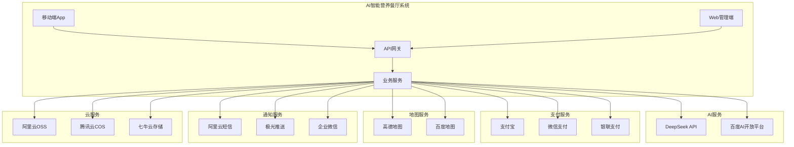

# AI智能营养餐厅系统 - 第三方服务集成文档

> **文档版本**: 1.0.0  
> **创建日期**: 2025-07-12  
> **更新日期**: 2025-07-12  
> **文档状态**: ✅ 第三方集成就绪  
> **目标受众**: 开发团队、架构师、运维团队、产品经理

## 📋 目录

- [1. 第三方服务概述](#1-第三方服务概述)
- [2. AI与机器学习服务](#2-ai与机器学习服务)
- [3. 支付服务集成](#3-支付服务集成)
- [4. 地图与位置服务](#4-地图与位置服务)
- [5. 消息通知服务](#5-消息通知服务)
- [6. 云存储服务](#6-云存储服务)
- [7. 社交登录服务](#7-社交登录服务)
- [8. 数据分析服务](#8-数据分析服务)
- [9. 监控与错误追踪](#9-监控与错误追踪)
- [10. 服务管理与运维](#10-服务管理与运维)

---

## 1. 第三方服务概述

### 1.1 服务架构图



### 1.2 服务分类与选型

```yaml
服务分类策略:
  核心服务 (Critical):
    描述: "系统核心功能依赖"
    容错要求: "必须有备用方案"
    服务列表:
      - DeepSeek API (AI推荐)
      - 支付宝/微信支付 (支付)
      - 阿里云短信 (验证码)
      - 高德地图 (定位)
      
  重要服务 (Important):
    描述: "影响用户体验"
    容错要求: "降级服务"
    服务列表:
      - 极光推送 (消息推送)
      - 阿里云OSS (文件存储)
      - 百度AI (备用AI服务)
      
  辅助服务 (Auxiliary):
    描述: "增值功能"
    容错要求: "可暂时停用"
    服务列表:
      - 数据分析服务
      - 第三方登录
      - 邮件服务
```

### 1.3 集成原则

```yaml
集成设计原则:
  高可用性:
    - 主备服务切换
    - 熔断器模式
    - 超时重试机制
    - 降级策略
    
  安全性:
    - API密钥管理
    - 传输加密
    - 签名验证
    - 权限控制
    
  可观测性:
    - 调用链追踪
    - 性能监控
    - 错误日志
    - 使用统计
    
  成本控制:
    - 调用频率限制
    - 缓存策略
    - 批量处理
    - 用量监控
```

---

## 2. AI与机器学习服务

### 2.1 DeepSeek API集成

```yaml
DeepSeek服务配置:
  API配置:
    base_url: "https://api.deepseek.com"
    api_version: "v1"
    model: "deepseek-chat"
    embedding_model: "deepseek-embedding"
    
  集成实现:
    服务封装: |
      @Injectable()
      export class DeepSeekService {
        private client: OpenAI;
        
        constructor() {
          this.client = new OpenAI({
            baseURL: 'https://api.deepseek.com',
            apiKey: process.env.DEEPSEEK_API_KEY,
            defaultHeaders: {
              'User-Agent': 'nutrition-restaurant/1.0',
            },
            timeout: 30000,
            maxRetries: 3,
          });
        }
        
        async generateNutritionAdvice(
          userProfile: UserProfile,
          context: string
        ): Promise<string> {
          const prompt = this.buildNutritionPrompt(userProfile, context);
          
          const response = await this.client.chat.completions.create({
            model: 'deepseek-chat',
            messages: [
              {
                role: 'system',
                content: '你是一名专业的营养师，请根据用户信息提供个性化营养建议。'
              },
              {
                role: 'user',
                content: prompt
              }
            ],
            max_tokens: 1000,
            temperature: 0.7,
          });
          
          return response.choices[0].message.content;
        }
        
        async generateEmbedding(text: string): Promise<number[]> {
          const response = await this.client.embeddings.create({
            model: 'deepseek-embedding',
            input: text,
          });
          
          return response.data[0].embedding;
        }
      }
      
  缓存策略:
    嵌入缓存: |
      @Injectable()
      export class EmbeddingCacheService {
        constructor(
          @InjectRedis() private redis: Redis,
        ) {}
        
        async getCachedEmbedding(text: string): Promise<number[] | null> {
          const key = `embedding:${this.hashText(text)}`;
          const cached = await this.redis.get(key);
          
          if (cached) {
            return JSON.parse(cached);
          }
          
          return null;
        }
        
        async setCachedEmbedding(text: string, embedding: number[]): Promise<void> {
          const key = `embedding:${this.hashText(text)}`;
          await this.redis.setex(key, 86400, JSON.stringify(embedding));
        }
        
        private hashText(text: string): string {
          return crypto.createHash('md5').update(text).digest('hex');
        }
      }
      
  错误处理:
    重试机制: |
      async callWithRetry<T>(
        operation: () => Promise<T>,
        maxRetries = 3,
        delay = 1000
      ): Promise<T> {
        for (let i = 0; i < maxRetries; i++) {
          try {
            return await operation();
          } catch (error) {
            if (i === maxRetries - 1) throw error;
            
            if (error.status === 429) { // 限流
              await this.sleep(delay * Math.pow(2, i));
            } else if (error.status >= 500) { // 服务器错误
              await this.sleep(delay);
            } else {
              throw error; // 客户端错误直接抛出
            }
          }
        }
      }
```

### 2.2 百度AI平台集成

```yaml
百度AI服务:
  服务用途:
    - DeepSeek备用方案
    - 特定AI功能补充
    - 图像识别能力
    
  集成实现: |
    @Injectable()
    export class BaiduAIService {
      private accessToken: string;
      private tokenExpiry: Date;
      
      async getAccessToken(): Promise<string> {
        if (this.accessToken && this.tokenExpiry > new Date()) {
          return this.accessToken;
        }
        
        const response = await axios.post(
          'https://aip.baidubce.com/oauth/2.0/token',
          null,
          {
            params: {
              grant_type: 'client_credentials',
              client_id: process.env.BAIDU_API_KEY,
              client_secret: process.env.BAIDU_SECRET_KEY,
            }
          }
        );
        
        this.accessToken = response.data.access_token;
        this.tokenExpiry = new Date(Date.now() + response.data.expires_in * 1000);
        
        return this.accessToken;
      }
      
      async recognizeFood(imageBase64: string): Promise<FoodRecognitionResult> {
        const token = await this.getAccessToken();
        
        const response = await axios.post(
          `https://aip.baidubce.com/rest/2.0/image-classify/v2/dish?access_token=${token}`,
          {
            image: imageBase64,
            top_num: 5,
            filter_threshold: 0.7,
          }
        );
        
        return this.transformBaiduResult(response.data);
      }
    }
```

---

## 3. 支付服务集成

### 3.1 支付宝集成

```yaml
支付宝配置:
  SDK配置: |
    import AlipaySdk from 'alipay-sdk';
    
    @Injectable()
    export class AlipayService {
      private alipay: AlipaySdk;
      
      constructor() {
        this.alipay = new AlipaySdk({
          appId: process.env.ALIPAY_APP_ID,
          privateKey: process.env.ALIPAY_PRIVATE_KEY,
          alipayPublicKey: process.env.ALIPAY_PUBLIC_KEY,
          gateway: 'https://openapi.alipay.com/gateway.do',
          signType: 'RSA2',
          charset: 'utf-8',
          version: '1.0',
        });
      }
      
      async createOrder(orderData: PaymentOrderDto): Promise<string> {
        const bizContent = {
          out_trade_no: orderData.orderId,
          total_amount: orderData.amount.toFixed(2),
          subject: orderData.subject,
          product_code: 'QUICK_MSECURITY_PAY', // 移动端支付
          notify_url: `${process.env.API_BASE_URL}/webhooks/alipay`,
          timeout_express: '30m',
        };
        
        const result = await this.alipay.exec('alipay.trade.app.pay', {
          bizContent,
        });
        
        return result; // 返回客户端调用字符串
      }
      
      async verifyNotification(params: any): Promise<boolean> {
        return this.alipay.checkNotifySign(params);
      }
      
      async queryOrder(outTradeNo: string): Promise<OrderQueryResult> {
        const result = await this.alipay.exec('alipay.trade.query', {
          bizContent: {
            out_trade_no: outTradeNo,
          },
        });
        
        return result;
      }
    }
    
  回调处理: |
    @Controller('webhooks')
    export class PaymentWebhookController {
      constructor(
        private alipayService: AlipayService,
        private orderService: OrderService,
      ) {}
      
      @Post('alipay')
      async handleAlipayNotify(@Body() body: any) {
        const isValid = await this.alipayService.verifyNotification(body);
        
        if (!isValid) {
          throw new BadRequestException('Invalid signature');
        }
        
        const { out_trade_no, trade_status, total_amount } = body;
        
        if (trade_status === 'TRADE_SUCCESS') {
          await this.orderService.confirmPayment({
            orderId: out_trade_no,
            amount: parseFloat(total_amount),
            paymentMethod: 'alipay',
            transactionId: body.trade_no,
          });
        }
        
        return 'success';
      }
    }
```

### 3.2 微信支付集成

```yaml
微信支付配置:
  SDK配置: |
    import * as WeChatPay from 'wechatpay-axios-plugin';
    
    @Injectable()
    export class WechatPayService {
      private wxpay: any;
      
      constructor() {
        this.wxpay = WeChatPay({
          mchid: process.env.WECHAT_MCH_ID,
          serial: process.env.WECHAT_SERIAL_NO,
          privateKey: fs.readFileSync(process.env.WECHAT_PRIVATE_KEY_PATH),
          certs: {
            [process.env.WECHAT_SERIAL_NO]: fs.readFileSync(process.env.WECHAT_CERT_PATH),
          },
        });
      }
      
      async createOrder(orderData: PaymentOrderDto): Promise<WechatPayResult> {
        const params = {
          appid: process.env.WECHAT_APP_ID,
          mchid: process.env.WECHAT_MCH_ID,
          description: orderData.subject,
          out_trade_no: orderData.orderId,
          notify_url: `${process.env.API_BASE_URL}/webhooks/wechat`,
          amount: {
            total: Math.round(orderData.amount * 100), // 分为单位
            currency: 'CNY',
          },
          payer: {
            openid: orderData.openid,
          },
        };
        
        const response = await this.wxpay.post('/v3/pay/transactions/jsapi', params);
        
        // 生成小程序支付参数
        const prepayId = response.data.prepay_id;
        const paySign = this.generatePaySign(prepayId);
        
        return {
          timeStamp: Math.floor(Date.now() / 1000).toString(),
          nonceStr: this.generateNonceStr(),
          package: `prepay_id=${prepayId}`,
          signType: 'RSA',
          paySign,
        };
      }
      
      private generatePaySign(prepayId: string): string {
        const timestamp = Math.floor(Date.now() / 1000).toString();
        const nonceStr = this.generateNonceStr();
        const message = `${process.env.WECHAT_APP_ID}\n${timestamp}\n${nonceStr}\nprepay_id=${prepayId}\n`;
        
        return crypto
          .createSign('RSA-SHA256')
          .update(message)
          .sign(process.env.WECHAT_PRIVATE_KEY, 'base64');
      }
    }
```

---

## 4. 地图与位置服务

### 4.1 高德地图集成

```yaml
高德地图服务:
  Web服务API: |
    @Injectable()
    export class AmapService {
      private apiKey = process.env.AMAP_API_KEY;
      private baseUrl = 'https://restapi.amap.com/v3';
      
      async geocode(address: string): Promise<GeocodeResult> {
        const response = await axios.get(`${this.baseUrl}/geocode/geo`, {
          params: {
            key: this.apiKey,
            address,
            output: 'json',
          },
        });
        
        if (response.data.status !== '1') {
          throw new Error(`Geocoding failed: ${response.data.info}`);
        }
        
        return this.transformGeocodeResult(response.data);
      }
      
      async regeocode(location: string): Promise<RegeocodeResult> {
        const response = await axios.get(`${this.baseUrl}/geocode/regeo`, {
          params: {
            key: this.apiKey,
            location,
            output: 'json',
            extensions: 'all',
          },
        });
        
        return this.transformRegeocodeResult(response.data);
      }
      
      async searchNearby(
        location: string,
        keywords: string,
        radius = 3000
      ): Promise<NearbySearchResult[]> {
        const response = await axios.get(`${this.baseUrl}/place/around`, {
          params: {
            key: this.apiKey,
            location,
            keywords,
            radius,
            output: 'json',
            extensions: 'all',
          },
        });
        
        return this.transformSearchResults(response.data);
      }
      
      async calculateDistance(
        origins: string,
        destination: string
      ): Promise<DistanceResult> {
        const response = await axios.get(`${this.baseUrl}/distance`, {
          params: {
            key: this.apiKey,
            origins,
            destination,
            type: 1, // 直线距离
            output: 'json',
          },
        });
        
        return this.transformDistanceResult(response.data);
      }
    }
    
  Flutter SDK集成: |
    // pubspec.yaml
    dependencies:
      amap_flutter_map: ^3.0.0
      amap_flutter_location: ^3.0.0
      
    // 地图组件
    class RestaurantMapWidget extends StatefulWidget {
      @override
      _RestaurantMapWidgetState createState() => _RestaurantMapWidgetState();
    }
    
    class _RestaurantMapWidgetState extends State<RestaurantMapWidget> {
      late AMapController _mapController;
      
      @override
      Widget build(BuildContext context) {
        return AMapWidget(
          apiKey: AMapApiKey(
            androidKey: 'your_android_key',
            iosKey: 'your_ios_key',
          ),
          onMapCreated: (AMapController controller) {
            _mapController = controller;
            _addRestaurantMarkers();
          },
          onLocationChanged: (AMapLocation location) {
            _updateUserLocation(location);
          },
        );
      }
      
      void _addRestaurantMarkers() async {
        final restaurants = await _restaurantService.getNearbyRestaurants();
        
        for (final restaurant in restaurants) {
          await _mapController.addMarker(MarkerOptions(
            markerId: restaurant.id,
            position: LatLng(restaurant.latitude, restaurant.longitude),
            infoWindow: InfoWindow(
              title: restaurant.name,
              snippet: restaurant.description,
            ),
          ));
        }
      }
    }
```

### 4.2 位置服务优化

```yaml
位置缓存策略:
  用户位置缓存: |
    @Injectable()
    export class LocationCacheService {
      constructor(
        @InjectRedis() private redis: Redis,
      ) {}
      
      async cacheUserLocation(
        userId: string,
        location: UserLocation
      ): Promise<void> {
        const key = `location:${userId}`;
        await this.redis.setex(
          key,
          3600, // 1小时过期
          JSON.stringify(location)
        );
      }
      
      async getCachedLocation(userId: string): Promise<UserLocation | null> {
        const key = `location:${userId}`;
        const cached = await this.redis.get(key);
        
        return cached ? JSON.parse(cached) : null;
      }
      
      async getNearbyRestaurants(
        location: UserLocation,
        radius = 3000
      ): Promise<Restaurant[]> {
        const cacheKey = `nearby:${location.latitude}:${location.longitude}:${radius}`;
        const cached = await this.redis.get(cacheKey);
        
        if (cached) {
          return JSON.parse(cached);
        }
        
        const restaurants = await this.amapService.searchNearby(
          `${location.longitude},${location.latitude}`,
          '餐厅',
          radius
        );
        
        await this.redis.setex(cacheKey, 1800, JSON.stringify(restaurants));
        
        return restaurants;
      }
    }
```

---

## 5. 消息通知服务

### 5.1 短信服务集成

```yaml
阿里云短信服务:
  SDK配置: |
    import * as Dysmsapi from '@alicloud/dysmsapi20170525';
    
    @Injectable()
    export class SmsService {
      private client: Dysmsapi.default;
      
      constructor() {
        this.client = new Dysmsapi.default({
          accessKeyId: process.env.ALIYUN_ACCESS_KEY_ID,
          accessKeySecret: process.env.ALIYUN_ACCESS_KEY_SECRET,
          endpoint: 'https://dysmsapi.aliyuncs.com',
        });
      }
      
      async sendVerificationCode(
        phoneNumber: string,
        code: string
      ): Promise<void> {
        const request = new Dysmsapi.SendSmsRequest({
          phoneNumbers: phoneNumber,
          signName: '智能营养餐厅',
          templateCode: 'SMS_XXXXX', // 验证码模板
          templateParam: JSON.stringify({ code }),
        });
        
        const response = await this.client.sendSms(request);
        
        if (response.body.code !== 'OK') {
          throw new Error(`SMS send failed: ${response.body.message}`);
        }
      }
      
      async sendOrderNotification(
        phoneNumber: string,
        orderInfo: OrderNotificationData
      ): Promise<void> {
        const request = new Dysmsapi.SendSmsRequest({
          phoneNumbers: phoneNumber,
          signName: '智能营养餐厅',
          templateCode: 'SMS_XXXXX', // 订单通知模板
          templateParam: JSON.stringify({
            order_id: orderInfo.orderId,
            status: orderInfo.status,
            restaurant: orderInfo.restaurantName,
          }),
        });
        
        await this.client.sendSms(request);
      }
    }
    
  短信模板管理: |
    export enum SmsTemplate {
      VERIFICATION_CODE = 'SMS_XXXXX',
      ORDER_CONFIRMATION = 'SMS_XXXXX',
      ORDER_READY = 'SMS_XXXXX',
      ORDER_DELIVERED = 'SMS_XXXXX',
      REFUND_SUCCESS = 'SMS_XXXXX',
    }
    
    @Injectable()
    export class SmsTemplateService {
      private templates = new Map([
        [SmsTemplate.VERIFICATION_CODE, '您的验证码是${code}，5分钟内有效。'],
        [SmsTemplate.ORDER_CONFIRMATION, '您的订单${order_id}已确认，${restaurant}正在为您准备。'],
        [SmsTemplate.ORDER_READY, '您的订单${order_id}已制作完成，请及时取餐。'],
      ]);
      
      getTemplate(templateType: SmsTemplate): string {
        return this.templates.get(templateType) || '';
      }
    }
```

### 5.2 推送通知服务

```yaml
极光推送集成:
  SDK配置: |
    import * as JPush from 'jpush-sdk';
    
    @Injectable()
    export class PushService {
      private jpush: JPush.JPushClient;
      
      constructor() {
        this.jpush = JPush.buildClient({
          appKey: process.env.JPUSH_APP_KEY,
          masterSecret: process.env.JPUSH_MASTER_SECRET,
          retryTimes: 3,
          isDebug: process.env.NODE_ENV === 'development',
        });
      }
      
      async sendToUser(
        userId: string,
        notification: PushNotification
      ): Promise<void> {
        const payload = JPush.push()
          .setPlatform('all')
          .setAudience(JPush.alias(userId))
          .setNotification(
            JPush.notification()
              .setAlert(notification.alert)
              .setAndroid(
                JPush.android()
                  .setAlert(notification.alert)
                  .setTitle(notification.title)
                  .addExtra('type', notification.type)
                  .addExtra('data', JSON.stringify(notification.data))
              )
              .setIOS(
                JPush.ios()
                  .setAlert(notification.alert)
                  .setSound('default')
                  .setBadge(1)
                  .addExtra('type', notification.type)
                  .addExtra('data', JSON.stringify(notification.data))
              )
          )
          .setOptions(
            JPush.options()
              .setTimeToLive(86400) // 24小时有效期
              .setApnsProduction(process.env.NODE_ENV === 'production')
          );
          
        await this.jpush.push().send(payload);
      }
      
      async sendToGroup(
        groupId: string,
        notification: PushNotification
      ): Promise<void> {
        const payload = JPush.push()
          .setPlatform('all')
          .setAudience(JPush.tag(groupId))
          .setNotification(
            JPush.notification()
              .setAlert(notification.alert)
              .setAndroid(
                JPush.android()
                  .setAlert(notification.alert)
                  .setTitle(notification.title)
              )
          );
          
        await this.jpush.push().send(payload);
      }
    }
    
  Flutter客户端配置: |
    // pubspec.yaml
    dependencies:
      jpush_flutter: ^2.0.0
      
    // 推送服务初始化
    class PushNotificationService {
      static final JPush jpush = JPush();
      
      static Future<void> initialize() async {
        jpush.addEventHandler(
          onReceiveNotification: (Map<String, dynamic> message) async {
            print('Received notification: $message');
            _handleNotification(message);
          },
          onOpenNotification: (Map<String, dynamic> message) async {
            print('Opened notification: $message');
            _handleNotificationTap(message);
          },
        );
        
        jpush.setup(
          appKey: 'your_app_key',
          channel: 'developer-default',
          production: kReleaseMode,
          debug: !kReleaseMode,
        );
      }
      
      static void _handleNotification(Map<String, dynamic> message) {
        final notificationType = message['extras']?['type'];
        
        switch (notificationType) {
          case 'order_update':
            _handleOrderUpdate(message);
            break;
          case 'nutrition_reminder':
            _handleNutritionReminder(message);
            break;
          default:
            _showDefaultNotification(message);
        }
      }
      
      static Future<void> setAlias(String userId) async {
        await jpush.setAlias(userId);
      }
      
      static Future<void> setTags(Set<String> tags) async {
        await jpush.setTags(tags);
      }
    }
```

---

## 6. 云存储服务

### 6.1 阿里云OSS集成

```yaml
OSS服务配置:
  SDK配置: |
    import * as OSS from 'ali-oss';
    
    @Injectable()
    export class OssService {
      private client: OSS;
      
      constructor() {
        this.client = new OSS({
          region: process.env.OSS_REGION,
          accessKeyId: process.env.OSS_ACCESS_KEY_ID,
          accessKeySecret: process.env.OSS_ACCESS_KEY_SECRET,
          bucket: process.env.OSS_BUCKET,
          secure: true,
        });
      }
      
      async uploadFile(
        file: Express.Multer.File, // NestJS内部使用Multer处理文件上传
        folder: string = 'general'
      ): Promise<UploadResult> {
        const fileName = this.generateFileName(file.originalname);
        const key = `${folder}/${fileName}`;
        
        const result = await this.client.put(key, file.buffer, {
          headers: {
            'Content-Type': file.mimetype,
            'Cache-Control': 'max-age=31536000', // 1年缓存
          },
        });
        
        return {
          url: result.url,
          key,
          size: file.size,
          mimeType: file.mimetype,
        };
      }
      
      async uploadImage(
        file: Express.Multer.File, // NestJS内部使用Multer处理文件上传
        options: ImageUploadOptions = {}
      ): Promise<UploadResult> {
        // 图片处理
        const processedBuffer = await this.processImage(file.buffer, options);
        
        const fileName = this.generateFileName(file.originalname);
        const key = `images/${fileName}`;
        
        const result = await this.client.put(key, processedBuffer, {
          headers: {
            'Content-Type': 'image/webp',
            'Cache-Control': 'max-age=31536000',
          },
        });
        
        return {
          url: result.url,
          key,
          size: processedBuffer.length,
          mimeType: 'image/webp',
        };
      }
      
      async generatePresignedUrl(
        key: string,
        expiresIn: number = 3600
      ): Promise<string> {
        return this.client.signatureUrl(key, {
          expires: expiresIn,
          method: 'GET',
        });
      }
      
      async deleteFile(key: string): Promise<void> {
        await this.client.delete(key);
      }
      
      private generateFileName(originalName: string): string {
        const ext = path.extname(originalName);
        const timestamp = Date.now();
        const random = Math.random().toString(36).substring(7);
        return `${timestamp}_${random}${ext}`;
      }
      
      private async processImage(
        buffer: Buffer,
        options: ImageUploadOptions
      ): Promise<Buffer> {
        let sharp = Sharp(buffer);
        
        if (options.width || options.height) {
          sharp = sharp.resize(options.width, options.height, {
            fit: 'inside',
            withoutEnlargement: true,
          });
        }
        
        if (options.quality) {
          sharp = sharp.webp({ quality: options.quality });
        } else {
          sharp = sharp.webp({ quality: 80 });
        }
        
        return sharp.toBuffer();
      }
    }
    
  文件上传接口: |
    @Controller('upload')
    export class UploadController {
      constructor(private ossService: OssService) {}
      
      @Post('image')
      @UseInterceptors(FileInterceptor('file', {
        limits: {
          fileSize: 10 * 1024 * 1024, // 10MB
        },
        fileFilter: (req, file, callback) => {
          if (!file.mimetype.startsWith('image/')) {
            return callback(new Error('Only image files allowed'), false);
          }
          callback(null, true);
        },
      }))
      async uploadImage(
        @UploadedFile() file: Express.Multer.File, // NestJS内部使用Multer处理文件上传
        @Query('width') width?: number,
        @Query('height') height?: number,
        @Query('quality') quality?: number,
      ) {
        const result = await this.ossService.uploadImage(file, {
          width,
          height,
          quality,
        });
        
        return {
          success: true,
          data: result,
        };
      }
      
      @Post('avatar')
      @UseGuards(JwtAuthGuard)
      @UseInterceptors(FileInterceptor('avatar'))
      async uploadAvatar(
        @UploadedFile() file: Express.Multer.File, // NestJS内部使用Multer处理文件上传
        @Request() req: any,
      ) {
        const result = await this.ossService.uploadImage(file, {
          width: 200,
          height: 200,
          quality: 85,
        });
        
        // 更新用户头像
        await this.userService.updateAvatar(req.user.id, result.url);
        
        return result;
      }
    }
```

### 6.2 CDN加速配置

```yaml
CDN配置:
  阿里云CDN:
    域名配置: |
      {
        "domain": "cdn.nutrition.com",
        "origin": {
          "type": "oss",
          "domain": "nutrition-bucket.oss-cn-hangzhou.aliyuncs.com"
        },
        "cache_rules": [
          {
            "path": "/images/*",
            "ttl": 2592000,
            "ignore_query_string": true
          },
          {
            "path": "/videos/*",
            "ttl": 86400,
            "ignore_query_string": false
          }
        ],
        "optimization": {
          "compression": ["gzip", "brotli"],
          "image_optimization": true,
          "webp_conversion": true
        }
      }
      
  图片处理参数:
    缩略图: "?x-oss-process=image/resize,w_300,h_300"
    水印: "?x-oss-process=image/watermark,text_xxx"
    格式转换: "?x-oss-process=image/format,webp"
    质量压缩: "?x-oss-process=image/quality,q_80"
```

---

## 7. 社交登录服务

### 7.1 微信登录集成

```yaml
微信登录配置:
  后端服务: |
    @Injectable()
    export class WechatAuthService {
      private appId = process.env.WECHAT_APP_ID;
      private appSecret = process.env.WECHAT_APP_SECRET;
      
      async getAccessToken(code: string): Promise<WechatAccessTokenResponse> {
        const url = 'https://api.weixin.qq.com/sns/oauth2/access_token';
        const params = {
          appid: this.appId,
          secret: this.appSecret,
          code,
          grant_type: 'authorization_code',
        };
        
        const response = await axios.get(url, { params });
        
        if (response.data.errcode) {
          throw new Error(`WeChat auth failed: ${response.data.errmsg}`);
        }
        
        return response.data;
      }
      
      async getUserInfo(
        accessToken: string,
        openid: string
      ): Promise<WechatUserInfo> {
        const url = 'https://api.weixin.qq.com/sns/userinfo';
        const params = {
          access_token: accessToken,
          openid,
          lang: 'zh_CN',
        };
        
        const response = await axios.get(url, { params });
        
        return response.data;
      }
      
      async loginOrRegister(code: string): Promise<LoginResult> {
        const tokenData = await this.getAccessToken(code);
        const userInfo = await this.getUserInfo(
          tokenData.access_token,
          tokenData.openid
        );
        
        let user = await this.userService.findByWechatOpenId(userInfo.openid);
        
        if (!user) {
          // 创建新用户
          user = await this.userService.createFromWechat(userInfo);
        } else {
          // 更新用户信息
          await this.userService.updateWechatInfo(user.id, userInfo);
        }
        
        const jwt = await this.authService.generateJwt(user);
        
        return {
          user,
          token: jwt,
          isNewUser: !user.isProfileComplete,
        };
      }
    }
    
  Flutter客户端: |
    // pubspec.yaml
    dependencies:
      fluwx: ^4.0.0
      
    // 微信登录服务
    class WechatLoginService {
      static bool _isRegistered = false;
      
      static Future<void> registerApp() async {
        if (_isRegistered) return;
        
        await fluwx.registerWxApi(
          appId: 'wx_app_id',
          doOnAndroid: true,
          doOnIOS: true,
        );
        
        _isRegistered = true;
      }
      
      static Future<LoginResult?> login() async {
        await registerApp();
        
        final response = await fluwx.sendWeChatAuth(
          scope: "snsapi_userinfo",
          state: "login_${DateTime.now().millisecondsSinceEpoch}",
        );
        
        if (response.errCode != 0) {
          throw Exception('WeChat login failed: ${response.errMsg}');
        }
        
        // 监听授权结果
        return _waitForAuthResult();
      }
      
      static Future<LoginResult?> _waitForAuthResult() async {
        final completer = Completer<LoginResult?>();
        
        StreamSubscription? subscription;
        subscription = fluwx.weChatResponseEventHandler.listen((response) {
          if (response is WeChatAuthResponse) {
            subscription?.cancel();
            
            if (response.errCode == 0) {
              _processAuthCode(response.code!).then(completer.complete);
            } else {
              completer.complete(null);
            }
          }
        });
        
        return completer.future;
      }
      
      static Future<LoginResult> _processAuthCode(String code) async {
        final response = await ApiService.post('/auth/wechat/login', {
          'code': code,
        });
        
        return LoginResult.fromJson(response.data);
      }
    }
```

### 7.2 支付宝登录集成

```yaml
支付宝登录:
  Flutter SDK: |
    // pubspec.yaml
    dependencies:
      tobias: ^2.0.0
      
    // 支付宝登录
    class AlipayLoginService {
      static Future<LoginResult?> login() async {
        try {
          final result = await aliPayPlugin.auth(
            'app_id=xxx&biz_content={"scopes":["auth_user"],"state":"init"}&charset=utf-8&format=json&method=alipay.user.info.auth&sign_type=RSA2&timestamp=${DateTime.now().millisecondsSinceEpoch}&version=1.0&sign=xxx'
          );
          
          if (result.resultStatus == "9000") {
            return _processAuthResult(result.result);
          }
          
          return null;
        } catch (e) {
          print('Alipay login error: $e');
          return null;
        }
      }
      
      static Future<LoginResult> _processAuthResult(String authResult) async {
        final response = await ApiService.post('/auth/alipay/login', {
          'auth_result': authResult,
        });
        
        return LoginResult.fromJson(response.data);
      }
    }
```

---

## 8. 数据分析服务

### 8.1 友盟统计集成

```yaml
友盟统计配置:
  Flutter SDK: |
    // pubspec.yaml
    dependencies:
      umeng_common_sdk: ^2.0.0
      umeng_analytics_sdk: ^2.0.0
      
    // 初始化
    class UmengService {
      static Future<void> initialize() async {
        UmengCommonSdk.initCommon(
          '友盟AppKey',
          '友盟Channel',
          'Umeng',
        );
        
        await UmengAnalyticsSdk.init(
          androidAppkey: 'Android_AppKey',
          iosAppkey: 'iOS_AppKey',
          channel: 'default',
        );
      }
      
      static void trackEvent(String eventId, [Map<String, dynamic>? parameters]) {
        UmengAnalyticsSdk.onEvent(eventId, parameters);
      }
      
      static void trackPageStart(String pageName) {
        UmengAnalyticsSdk.onPageStart(pageName);
      }
      
      static void trackPageEnd(String pageName) {
        UmengAnalyticsSdk.onPageEnd(pageName);
      }
      
      static void setUserProfile(String userId, Map<String, dynamic> profile) {
        UmengAnalyticsSdk.profileSignInWithPUID(userId);
        profile.forEach((key, value) {
          UmengAnalyticsSdk.profileSet(key, value.toString());
        });
      }
    }
    
  事件埋点: |
    class AnalyticsEvents {
      // 用户行为事件
      static const String USER_LOGIN = 'user_login';
      static const String USER_REGISTER = 'user_register';
      static const String USER_LOGOUT = 'user_logout';
      
      // 订单事件
      static const String ORDER_CREATE = 'order_create';
      static const String ORDER_PAY = 'order_pay';
      static const String ORDER_CANCEL = 'order_cancel';
      
      // 营养相关事件
      static const String NUTRITION_VIEW = 'nutrition_view';
      static const String NUTRITION_RECOMMEND = 'nutrition_recommend';
      static const String NUTRITIONIST_CONSULT = 'nutritionist_consult';
      
      // 商家事件
      static const String RESTAURANT_VIEW = 'restaurant_view';
      static const String DISH_VIEW = 'dish_view';
      static const String DISH_FAVORITE = 'dish_favorite';
    }
    
    // 使用示例
    void trackUserLogin(String loginMethod) {
      UmengService.trackEvent(AnalyticsEvents.USER_LOGIN, {
        'method': loginMethod,
        'timestamp': DateTime.now().millisecondsSinceEpoch,
      });
    }
    
    void trackOrderCreate(OrderInfo order) {
      UmengService.trackEvent(AnalyticsEvents.ORDER_CREATE, {
        'order_id': order.id,
        'amount': order.amount,
        'restaurant_id': order.restaurantId,
        'dish_count': order.items.length,
      });
    }
```

### 8.2 自定义数据分析

```yaml
后端数据收集:
  事件收集服务: |
    @Injectable()
    export class AnalyticsService {
      constructor(
        @InjectRepository(AnalyticsEvent)
        private eventRepo: Repository<AnalyticsEvent>,
        @InjectRedis() private redis: Redis,
      ) {}
      
      async trackEvent(
        userId: string,
        eventType: string,
        properties: Record<string, any>,
        sessionId?: string,
      ): Promise<void> {
        // 保存到数据库
        const event = this.eventRepo.create({
          userId,
          eventType,
          properties,
          sessionId,
          timestamp: new Date(),
          userAgent: properties.userAgent,
          ip: properties.ip,
        });
        
        await this.eventRepo.save(event);
        
        // 实时数据更新
        await this.updateRealtimeStats(eventType, properties);
      }
      
      async updateRealtimeStats(
        eventType: string,
        properties: Record<string, any>
      ): Promise<void> {
        const today = new Date().toISOString().split('T')[0];
        
        // 更新今日统计
        await this.redis.hincrby(`stats:${today}`, eventType, 1);
        
        // 更新小时统计
        const hour = new Date().getHours();
        await this.redis.hincrby(`stats:${today}:${hour}`, eventType, 1);
        
        // 设置过期时间
        await this.redis.expire(`stats:${today}`, 86400 * 7); // 7天
        await this.redis.expire(`stats:${today}:${hour}`, 86400); // 1天
      }
      
      async getRealtimeStats(date?: string): Promise<RealtimeStats> {
        const targetDate = date || new Date().toISOString().split('T')[0];
        const stats = await this.redis.hgetall(`stats:${targetDate}`);
        
        return {
          date: targetDate,
          events: stats,
          totalEvents: Object.values(stats).reduce((sum, count) => sum + parseInt(count), 0),
        };
      }
      
      async getUserBehaviorAnalysis(
        userId: string,
        timeRange: TimeRange
      ): Promise<UserBehaviorAnalysis> {
        const events = await this.eventRepo
          .createQueryBuilder('event')
          .where('event.userId = :userId', { userId })
          .andWhere('event.timestamp BETWEEN :start AND :end', timeRange)
          .orderBy('event.timestamp', 'ASC')
          .getMany();
          
        return this.analyzeUserBehavior(events);
      }
    }
```

---

## 9. 监控与错误追踪

### 9.1 Sentry集成

```yaml
错误监控配置:
  后端集成: |
    import * as Sentry from '@sentry/node';
    
    // 初始化
    Sentry.init({
      dsn: process.env.SENTRY_DSN,
      environment: process.env.NODE_ENV,
      tracesSampleRate: 0.1,
      beforeSend(event) {
        // 过滤敏感信息
        if (event.request && event.request.headers) {
          delete event.request.headers.authorization;
          delete event.request.headers.cookie;
        }
        return event;
      },
    });
    
    // 全局错误处理
    @Catch()
    export class SentryExceptionFilter implements ExceptionFilter {
      catch(exception: unknown, host: ArgumentsHost) {
        const ctx = host.switchToHttp();
        const request = ctx.getRequest();
        const response = ctx.getResponse();
        
        // 设置用户上下文
        Sentry.setUser({
          id: request.user?.id,
          email: request.user?.email,
        });
        
        // 设置请求上下文
        Sentry.setTag('path', request.url);
        Sentry.setTag('method', request.method);
        
        // 记录错误
        Sentry.captureException(exception);
        
        // 返回响应
        const status = exception instanceof HttpException 
          ? exception.getStatus() 
          : 500;
          
        response.status(status).json({
          statusCode: status,
          timestamp: new Date().toISOString(),
          path: request.url,
        });
      }
    }
    
  Flutter集成: |
    // pubspec.yaml
    dependencies:
      sentry_flutter: ^7.0.0
      
    // 初始化
    Future<void> main() async {
      await SentryFlutter.init(
        (options) {
          options.dsn = 'your_sentry_dsn';
          options.debug = kDebugMode;
          options.environment = kReleaseMode ? 'production' : 'development';
          options.tracesSampleRate = 0.1;
          
          options.beforeSend = (event, hint) {
            // 过滤调试错误
            if (kDebugMode && event.level == SentryLevel.debug) {
              return null;
            }
            return event;
          };
        },
        appRunner: () => runApp(MyApp()),
      );
    }
    
    // 错误边界
    class ErrorBoundary extends StatefulWidget {
      final Widget child;
      
      const ErrorBoundary({Key? key, required this.child}) : super(key: key);
      
      @override
      _ErrorBoundaryState createState() => _ErrorBoundaryState();
    }
    
    class _ErrorBoundaryState extends State<ErrorBoundary> {
      @override
      Widget build(BuildContext context) {
        return widget.child;
      }
      
      @override
      void initState() {
        super.initState();
        
        // 捕获Flutter错误
        FlutterError.onError = (FlutterErrorDetails details) {
          Sentry.captureException(
            details.exception,
            stackTrace: details.stack,
          );
          
          FlutterError.presentError(details);
        };
        
        // 捕获异步错误
        PlatformDispatcher.instance.onError = (error, stack) {
          Sentry.captureException(error, stackTrace: stack);
          return true;
        };
      }
    }
```

### 9.2 性能监控

```yaml
APM集成:
  Elastic APM: |
    const apm = require('elastic-apm-node').start({
      serviceName: 'nutrition-restaurant-api',
      secretToken: process.env.ELASTIC_APM_SECRET_TOKEN,
      serverUrl: process.env.ELASTIC_APM_SERVER_URL,
      environment: process.env.NODE_ENV,
      
      // 性能配置
      transactionSampleRate: 0.1,
      captureBody: 'all',
      captureHeaders: true,
      
      // 忽略某些路径
      ignoreUrls: ['/health', '/metrics'],
      
      // 自定义标签
      globalLabels: {
        version: process.env.APP_VERSION,
        region: process.env.DEPLOYMENT_REGION,
      },
    });
    
    // 自定义事务
    @Injectable()
    export class OrderService {
      async processOrder(orderData: CreateOrderDto): Promise<Order> {
        const span = apm.startSpan('process-order');
        
        try {
          // 添加标签
          span?.addLabels({
            orderId: orderData.id,
            userId: orderData.userId,
            amount: orderData.amount,
          });
          
          const order = await this.createOrder(orderData);
          await this.processPayment(order);
          
          span?.setOutcome('success');
          return order;
        } catch (error) {
          span?.setOutcome('failure');
          throw error;
        } finally {
          span?.end();
        }
      }
    }
```

---

## 10. 服务管理与运维

### 10.1 服务健康检查

```yaml
健康检查实现:
  后端健康检查: |
    @Controller('health')
    export class HealthController {
      constructor(
        private dbService: DatabaseService,
        private redisService: RedisService,
        private thirdPartyService: ThirdPartyService,
      ) {}
      
      @Get()
      async healthCheck(): Promise<HealthCheckResult> {
        const checks = await Promise.allSettled([
          this.checkDatabase(),
          this.checkRedis(),
          this.checkThirdPartyServices(),
        ]);
        
        const results = checks.map((check, index) => ({
          name: ['database', 'redis', 'third-party'][index],
          status: check.status === 'fulfilled' ? 'healthy' : 'unhealthy',
          details: check.status === 'fulfilled' ? check.value : check.reason,
        }));
        
        const overallStatus = results.every(r => r.status === 'healthy') 
          ? 'healthy' 
          : 'unhealthy';
          
        return {
          status: overallStatus,
          timestamp: new Date().toISOString(),
          checks: results,
        };
      }
      
      private async checkDatabase(): Promise<DatabaseHealth> {
        const start = Date.now();
        
        try {
          await this.dbService.query('SELECT 1');
          
          return {
            status: 'healthy',
            responseTime: Date.now() - start,
          };
        } catch (error) {
          throw {
            status: 'unhealthy',
            error: error.message,
            responseTime: Date.now() - start,
          };
        }
      }
      
      private async checkThirdPartyServices(): Promise<ThirdPartyHealth> {
        const services = [
          { name: 'deepseek', check: () => this.checkDeepSeek() },
          { name: 'alipay', check: () => this.checkAlipay() },
          { name: 'amap', check: () => this.checkAmap() },
        ];
        
        const results = await Promise.allSettled(
          services.map(async (service) => ({
            name: service.name,
            ...(await service.check()),
          }))
        );
        
        return results.map((result, index) => ({
          name: services[index].name,
          status: result.status === 'fulfilled' ? 'healthy' : 'unhealthy',
          details: result.status === 'fulfilled' ? result.value : result.reason,
        }));
      }
    }
```

### 10.2 服务降级策略

```yaml
降级处理:
  熔断器实现: |
    @Injectable()
    export class CircuitBreakerService {
      private breakers = new Map<string, CircuitBreaker>();
      
      createBreaker(
        name: string,
        options: CircuitBreakerOptions
      ): CircuitBreaker {
        const breaker = new CircuitBreaker(options.action, {
          timeout: options.timeout || 30000,
          errorThresholdPercentage: options.errorThreshold || 50,
          resetTimeout: options.resetTimeout || 60000,
          rollingCountTimeout: options.rollingTimeout || 10000,
          rollingCountBuckets: options.rollingBuckets || 10,
        });
        
        // 监听事件
        breaker.on('open', () => {
          this.logger.warn(`Circuit breaker ${name} opened`);
        });
        
        breaker.on('halfOpen', () => {
          this.logger.info(`Circuit breaker ${name} half-opened`);
        });
        
        breaker.on('close', () => {
          this.logger.info(`Circuit breaker ${name} closed`);
        });
        
        this.breakers.set(name, breaker);
        return breaker;
      }
      
      async executeWithFallback<T>(
        breakerName: string,
        operation: () => Promise<T>,
        fallback: () => Promise<T>
      ): Promise<T> {
        const breaker = this.breakers.get(breakerName);
        
        if (!breaker) {
          throw new Error(`Circuit breaker ${breakerName} not found`);
        }
        
        try {
          return await breaker.fire();
        } catch (error) {
          this.logger.warn(`Fallback triggered for ${breakerName}:`, error.message);
          return await fallback();
        }
      }
    }
    
    // 使用示例
    @Injectable()
    export class NutritionService {
      constructor(
        private circuitBreaker: CircuitBreakerService,
        private deepseekService: DeepSeekService,
        private baiduAiService: BaiduAIService,
      ) {
        this.circuitBreaker.createBreaker('deepseek-ai', {
          action: () => this.deepseekService.generateAdvice(),
          timeout: 10000,
          errorThreshold: 50,
          resetTimeout: 60000,
        });
      }
      
      async getNutritionAdvice(userProfile: UserProfile): Promise<string> {
        return this.circuitBreaker.executeWithFallback(
          'deepseek-ai',
          () => this.deepseekService.generateNutritionAdvice(userProfile),
          () => this.getFallbackAdvice(userProfile)
        );
      }
      
      private async getFallbackAdvice(userProfile: UserProfile): Promise<string> {
        // 备用方案：使用预设建议或百度AI
        try {
          return await this.baiduAiService.generateAdvice(userProfile);
        } catch (error) {
          return this.getDefaultAdvice(userProfile);
        }
      }
    }
```

### 10.3 成本监控

```yaml
成本控制:
  API调用监控: |
    @Injectable()
    export class CostMonitoringService {
      constructor(
        @InjectRedis() private redis: Redis,
      ) {}
      
      async trackApiCall(
        service: string,
        cost: number,
        userId?: string
      ): Promise<void> {
        const today = new Date().toISOString().split('T')[0];
        
        // 记录总成本
        await this.redis.incrbyfloat(`cost:${service}:${today}`, cost);
        
        // 记录用户成本
        if (userId) {
          await this.redis.incrbyfloat(`cost:user:${userId}:${today}`, cost);
        }
        
        // 设置过期时间
        await this.redis.expire(`cost:${service}:${today}`, 86400 * 30);
      }
      
      async getCostSummary(
        service: string,
        dateRange: DateRange
      ): Promise<CostSummary> {
        const costs = [];
        const currentDate = new Date(dateRange.start);
        
        while (currentDate <= dateRange.end) {
          const dateStr = currentDate.toISOString().split('T')[0];
          const cost = await this.redis.get(`cost:${service}:${dateStr}`);
          
          costs.push({
            date: dateStr,
            cost: parseFloat(cost || '0'),
          });
          
          currentDate.setDate(currentDate.getDate() + 1);
        }
        
        return {
          service,
          totalCost: costs.reduce((sum, item) => sum + item.cost, 0),
          dailyCosts: costs,
        };
      }
      
      async checkCostLimit(
        service: string,
        limit: number
      ): Promise<boolean> {
        const today = new Date().toISOString().split('T')[0];
        const todayCost = await this.redis.get(`cost:${service}:${today}`);
        
        const currentCost = parseFloat(todayCost || '0');
        
        if (currentCost >= limit) {
          await this.notifyService.sendCostAlert(service, currentCost, limit);
          return false;
        }
        
        return true;
      }
    }
```

---

## 附录

### A. 第三方服务清单

```yaml
服务清单:
  AI服务:
    DeepSeek:
      用途: "主要AI推荐服务"
      定价: "按Token计费"
      限制: "RPM限制"
      
    百度AI:
      用途: "备用AI服务"
      定价: "按调用次数"
      限制: "QPS限制"
      
  支付服务:
    支付宝:
      费率: "0.6%"
      到账: "T+1"
      
    微信支付:
      费率: "0.6%"
      到账: "T+1"
      
  基础服务:
    阿里云OSS:
      用途: "文件存储"
      定价: "按存储量和流量"
      
    高德地图:
      用途: "地图定位"
      定价: "按调用次数"
      免费额度: "100万次/月"
```

### B. 集成检查清单

```yaml
集成验证:
  开发环境:
    ✓ API密钥配置
    ✓ 基础功能测试
    ✓ 错误处理验证
    ✓ 性能基准测试
    
  测试环境:
    ✓ 端到端功能测试
    ✓ 压力测试
    ✓ 故障转移测试
    ✓ 成本预估
    
  生产环境:
    ✓ 监控告警配置
    ✓ 备用方案就绪
    ✓ 成本控制措施
    ✓ 合规性检查
```

### C. 联系方式

```yaml
技术支持:
  DeepSeek:
    技术文档: "https://platform.deepseek.com/docs"
    客服邮箱: "support@deepseek.com"
    
  阿里云:
    技术支持: "95187"
    工单系统: "https://workorder.console.aliyun.com"
    
  支付宝开放平台:
    技术支持: "https://open.alipay.com"
    开发者论坛: "https://forum.alipay.com"
```

---

**文档维护**: 集成开发团队  
**审核人**: 技术架构师  
**下次更新**: 2025-08-12