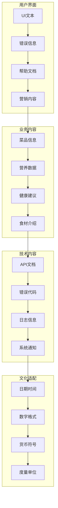

# AI智能营养餐厅系统 - 国际化与本地化策略文档

> **文档版本**: 1.0.0  
> **创建日期**: 2025-07-12  
> **更新日期**: 2025-07-12  
> **文档状态**: ✅ 国际化策略就绪  
> **目标受众**: 开发团队、产品经理、运营团队、翻译团队

## 📋 目录

- [1. 国际化战略概述](#1-国际化战略概述)
- [2. 语言支持策略](#2-语言支持策略)
- [3. 前端国际化实现](#3-前端国际化实现)
- [4. 后端国际化实现](#4-后端国际化实现)
- [5. 数据库本地化](#5-数据库本地化)
- [6. 营养数据本地化](#6-营养数据本地化)
- [7. 文化适配策略](#7-文化适配策略)
- [8. 翻译管理流程](#8-翻译管理流程)
- [9. 质量保证](#9-质量保证)
- [10. 运营本地化](#10-运营本地化)

---

## 1. 国际化战略概述

### 1.1 国际化目标

```yaml
战略目标:
  短期目标 (6个月):
    - 完成中文繁体支持
    - 建立国际化技术框架
    - 完成核心功能翻译
    
  中期目标 (1年):
    - 支持英语、日语、韩语
    - 完成东南亚市场调研
    - 建立本地化内容管理系统
    
  长期目标 (2年):
    - 支持10种主要语言
    - 建立全球化营养数据库
    - 实现多地区运营体系
    
目标市场优先级:
  Tier 1 (优先级最高):
    - 中国大陆 (简体中文)
    - 中国香港 (繁体中文)
    - 中国台湾 (繁体中文)
    
  Tier 2 (高优先级):
    - 日本 (日语)
    - 韩国 (韩语)
    - 新加坡 (英语/中文)
    
  Tier 3 (中等优先级):
    - 美国 (英语)
    - 加拿大 (英语/法语)
    - 澳大利亚 (英语)
    
  Tier 4 (待评估):
    - 欧洲市场
    - 其他东南亚国家
    - 南美市场
```

### 1.2 技术架构

```yaml
国际化技术栈:
  前端 (Flutter):
    - flutter_localizations
    - intl package
    - 自定义locale管理
    
  后端 (NestJS):
    - nestjs-i18n
    - ICU MessageFormat
    - 动态语言切换
    
  数据存储:
    - PostgreSQL JSONB多语言字段
    - Redis语言缓存
    - CDN多地区分发
    
架构设计原则:
  - 语言包懒加载
  - 内容动态更新
  - 优雅降级处理
  - 高性能缓存策略
```

### 1.3 本地化范围



---

## 2. 语言支持策略

### 2.1 语言代码标准

```yaml
语言标识规范:
  标准: "BCP 47 语言标签"
  格式: "语言-地区 (如: zh-CN, en-US)"
  
支持语言列表:
  简体中文:
    code: "zh-CN"
    name: "简体中文"
    english_name: "Simplified Chinese"
    direction: "ltr"
    default: true
    
  繁体中文 (香港):
    code: "zh-HK"
    name: "繁體中文 (香港)"
    english_name: "Traditional Chinese (Hong Kong)"
    direction: "ltr"
    
  繁体中文 (台湾):
    code: "zh-TW"
    name: "繁體中文 (台灣)"
    english_name: "Traditional Chinese (Taiwan)"
    direction: "ltr"
    
  英语:
    code: "en-US"
    name: "English"
    english_name: "English"
    direction: "ltr"
    
  日语:
    code: "ja-JP"
    name: "日本語"
    english_name: "Japanese"
    direction: "ltr"
    
  韩语:
    code: "ko-KR"
    name: "한국어"
    english_name: "Korean"
    direction: "ltr"
    
  泰语:
    code: "th-TH"
    name: "ไทย"
    english_name: "Thai"
    direction: "ltr"
    
  越南语:
    code: "vi-VN"
    name: "Tiếng Việt"
    english_name: "Vietnamese"
    direction: "ltr"
    
  马来语:
    code: "ms-MY"
    name: "Bahasa Malaysia"
    english_name: "Malay"
    direction: "ltr"
    
  印尼语:
    code: "id-ID"
    name: "Bahasa Indonesia"
    english_name: "Indonesian"
    direction: "ltr"
```

### 2.2 语言检测策略

```yaml
语言检测优先级:
  1. 用户手动设置
  2. 应用内存储的偏好
  3. 系统语言设置
  4. 地理位置推断
  5. 默认语言 (zh-CN)
  
实现方案:
  前端检测: |
    class LanguageDetectionService {
      static String detectLanguage() {
        // 1. 检查用户设置
        final userPreference = PreferenceService.getLanguage();
        if (userPreference != null) {
          return userPreference;
        }
        
        // 2. 检查系统语言
        final systemLocale = Platform.localeName;
        if (SupportedLanguages.isSupported(systemLocale)) {
          return systemLocale;
        }
        
        // 3. 基于地理位置推断
        final location = LocationService.getCurrentLocation();
        if (location != null) {
          return _inferLanguageFromLocation(location);
        }
        
        // 4. 返回默认语言
        return 'zh-CN';
      }
      
      static String _inferLanguageFromLocation(Location location) {
        // 简单的地理位置到语言映射
        final countryLanguageMap = {
          'CN': 'zh-CN',
          'HK': 'zh-HK',
          'TW': 'zh-TW',
          'JP': 'ja-JP',
          'KR': 'ko-KR',
          'TH': 'th-TH',
          'VN': 'vi-VN',
          'MY': 'ms-MY',
          'ID': 'id-ID',
          'SG': 'en-US', // 新加坡默认英语
        };
        
        return countryLanguageMap[location.countryCode] ?? 'en-US';
      }
    }
    
  后端API: |
    @Injectable()
    export class LanguageDetectionService {
      detectFromRequest(request: Request): string {
        // 1. 检查URL参数
        const urlLang = request.query.lang as string;
        if (urlLang && this.isSupported(urlLang)) {
          return urlLang;
        }
        
        // 2. 检查HTTP Header
        const acceptLanguage = request.headers['accept-language'];
        if (acceptLanguage) {
          const preferredLang = this.parseAcceptLanguage(acceptLanguage);
          if (preferredLang) return preferredLang;
        }
        
        // 3. 检查用户Profile
        const user = request.user;
        if (user?.preferredLanguage) {
          return user.preferredLanguage;
        }
        
        // 4. 基于IP地理位置
        const clientIP = this.getClientIP(request);
        const location = await this.geoService.getLocation(clientIP);
        if (location) {
          return this.inferLanguageFromCountry(location.country);
        }
        
        return 'zh-CN';
      }
    }
```

---

## 3. 前端国际化实现

### 3.1 Flutter国际化配置

```yaml
Flutter i18n设置:
  pubspec.yaml: |
    dependencies:
      flutter:
        sdk: flutter
      flutter_localizations:
        sdk: flutter
      intl: ^0.18.0
      easy_localization: ^3.0.0
      
    flutter:
      generate: true
      assets:
        - assets/translations/
        
  l10n.yaml: |
    arb-dir: lib/l10n
    template-arb-file: app_en.arb
    output-localization-file: app_localizations.dart
    output-class: AppLocalizations
    preferred-supported-locales: ["zh", "en"]
    
  主应用配置: |
    class MyApp extends StatelessWidget {
      @override
      Widget build(BuildContext context) {
        return EasyLocalization(
          supportedLocales: const [
            Locale('zh', 'CN'),
            Locale('zh', 'HK'),
            Locale('zh', 'TW'),
            Locale('en', 'US'),
            Locale('ja', 'JP'),
            Locale('ko', 'KR'),
          ],
          path: 'assets/translations',
          fallbackLocale: const Locale('zh', 'CN'),
          startLocale: const Locale('zh', 'CN'),
          child: MaterialApp(
            title: 'AI智能营养餐厅',
            localizationsDelegates: [
              GlobalMaterialLocalizations.delegate,
              GlobalWidgetsLocalizations.delegate,
              GlobalCupertinoLocalizations.delegate,
              EasyLocalization.of(context)!.delegate,
            ],
            supportedLocales: EasyLocalization.of(context)!.supportedLocales,
            locale: EasyLocalization.of(context)!.locale,
            home: const HomePage(),
          ),
        );
      }
    }
```

### 3.2 翻译文件结构

```yaml
翻译文件组织:
  目录结构: |
    assets/translations/
    ├── zh-CN.json          # 简体中文
    ├── zh-HK.json          # 繁体中文(香港)
    ├── zh-TW.json          # 繁体中文(台湾)
    ├── en-US.json          # 英语
    ├── ja-JP.json          # 日语
    ├── ko-KR.json          # 韩语
    └── common/
        ├── units.json      # 度量单位
        ├── currencies.json # 货币信息
        └── countries.json  # 国家地区
        
  翻译键值规范: |
    // zh-CN.json
    {
      "app": {
        "name": "AI智能营养餐厅",
        "slogan": "智能营养，健康生活"
      },
      "common": {
        "confirm": "确认",
        "cancel": "取消",
        "loading": "加载中...",
        "error": "错误",
        "success": "成功",
        "retry": "重试"
      },
      "auth": {
        "login": "登录",
        "register": "注册",
        "logout": "退出登录",
        "forgot_password": "忘记密码",
        "email": "邮箱",
        "password": "密码",
        "phone": "手机号码"
      },
      "nutrition": {
        "calories": "卡路里",
        "protein": "蛋白质",
        "carbs": "碳水化合物",
        "fat": "脂肪",
        "fiber": "膳食纤维",
        "recommendations": "营养建议",
        "analysis": "营养分析"
      },
      "orders": {
        "create": "创建订单",
        "status": {
          "pending": "待确认",
          "confirmed": "已确认",
          "preparing": "制作中",
          "ready": "待取餐",
          "completed": "已完成",
          "cancelled": "已取消"
        }
      },
      "validation": {
        "required": "此字段为必填项",
        "email_invalid": "请输入有效的邮箱地址",
        "password_min_length": "密码长度至少6位",
        "phone_invalid": "请输入有效的手机号码"
      },
      "notifications": {
        "order_confirmed": "您的订单已确认",
        "order_ready": "您的订单已准备完成，请及时取餐",
        "new_recommendation": "为您推荐了新的营养搭配"
      }
    }
    
  命名约定:
    - 使用snake_case命名
    - 按功能模块分组
    - 层级不超过3层
    - 使用描述性键名
    - 避免硬编码数值
```

### 3.3 动态文本处理

```yaml
复杂文本处理:
  参数化文本: |
    // 翻译文件
    {
      "welcome_message": "欢迎 {name}，今天为您推荐了 {count} 道营养菜品",
      "calories_info": "这道菜含有 {calories} 卡路里，适合 {meal_type}",
      "order_total": "订单总额：{amount} {currency}"
    }
    
    // 使用方法
    Text(
      tr('welcome_message', namedArgs: {
        'name': user.name,
        'count': recommendations.length.toString(),
      }),
    )
    
  复数处理: |
    // 翻译文件
    {
      "dish_count": {
        "zero": "没有菜品",
        "one": "1道菜品",
        "other": "{count}道菜品"
      }
    }
    
    // 使用方法
    Text(
      plural('dish_count', dishCount, args: [dishCount.toString()]),
    )
    
  日期时间格式: |
    class DateTimeFormatter {
      static String formatDate(DateTime date, String locale) {
        final formatter = DateFormat.yMMMd(locale);
        return formatter.format(date);
      }
      
      static String formatTime(DateTime time, String locale) {
        final formatter = DateFormat.Hm(locale);
        return formatter.format(time);
      }
      
      static String formatDateTime(DateTime dateTime, String locale) {
        final formatter = DateFormat.yMMMd(locale).add_Hm();
        return formatter.format(dateTime);
      }
      
      static String formatRelativeTime(DateTime dateTime, String locale) {
        final now = DateTime.now();
        final difference = now.difference(dateTime);
        
        if (difference.inMinutes < 1) {
          return tr('time.just_now');
        } else if (difference.inHours < 1) {
          return tr('time.minutes_ago', args: [difference.inMinutes.toString()]);
        } else if (difference.inDays < 1) {
          return tr('time.hours_ago', args: [difference.inHours.toString()]);
        } else {
          return formatDate(dateTime, locale);
        }
      }
    }
```

### 3.4 RTL语言支持

```yaml
RTL支持预留:
  方向性适配: |
    class DirectionalityWidget extends StatelessWidget {
      final Widget child;
      
      const DirectionalityWidget({Key? key, required this.child}) : super(key: key);
      
      @override
      Widget build(BuildContext context) {
        final locale = EasyLocalization.of(context)!.locale;
        final isRTL = _isRTLLanguage(locale.languageCode);
        
        return Directionality(
          textDirection: isRTL ? TextDirection.rtl : TextDirection.ltr,
          child: child,
        );
      }
      
      bool _isRTLLanguage(String languageCode) {
        const rtlLanguages = ['ar', 'he', 'fa', 'ur'];
        return rtlLanguages.contains(languageCode);
      }
    }
    
  布局适配: |
    class AdaptiveRow extends StatelessWidget {
      final List<Widget> children;
      
      const AdaptiveRow({Key? key, required this.children}) : super(key: key);
      
      @override
      Widget build(BuildContext context) {
        final isRTL = Directionality.of(context) == TextDirection.rtl;
        
        return Row(
          children: isRTL ? children.reversed.toList() : children,
        );
      }
    }
```

---

## 4. 后端国际化实现

### 4.1 NestJS i18n配置

```yaml
后端国际化设置:
  模块配置: |
    import { I18nModule, AcceptLanguageResolver, QueryResolver, HeaderResolver } from 'nestjs-i18n';
    import { join } from 'path';
    
    @Module({
      imports: [
        I18nModule.forRoot({
          fallbackLanguage: 'zh-CN',
          loaderOptions: {
            path: join(__dirname, '/i18n/'),
            watch: true,
          },
          resolvers: [
            { use: QueryResolver, options: ['lang'] },
            { use: HeaderResolver, options: ['x-language'] },
            AcceptLanguageResolver,
          ],
          typesOutputPath: join(__dirname, '../src/generated/i18n.generated.ts'),
        }),
      ],
    })
    export class AppModule {}
    
  翻译文件结构: |
    src/i18n/
    ├── zh-CN/
    │   ├── common.json
    │   ├── auth.json
    │   ├── validation.json
    │   ├── nutrition.json
    │   └── errors.json
    ├── en-US/
    │   ├── common.json
    │   ├── auth.json
    │   ├── validation.json
    │   ├── nutrition.json
    │   └── errors.json
    └── ja-JP/
        ├── common.json
        ├── auth.json
        ├── validation.json
        ├── nutrition.json
        └── errors.json
```

### 4.2 API响应国际化

```yaml
响应消息国际化:
  服务层实现: |
    @Injectable()
    export class UserService {
      constructor(
        private readonly i18n: I18nService,
      ) {}
      
      async createUser(createUserDto: CreateUserDto, lang: string): Promise<ApiResponse<User>> {
        try {
          const user = await this.userRepository.save(createUserDto);
          
          return {
            success: true,
            message: await this.i18n.translate('auth.register_success', { lang }),
            data: user,
          };
        } catch (error) {
          throw new BadRequestException(
            await this.i18n.translate('auth.register_failed', { lang })
          );
        }
      }
      
      async getUserProfile(userId: string, lang: string): Promise<LocalizedUserProfile> {
        const user = await this.userRepository.findOne(userId);
        
        if (!user) {
          throw new NotFoundException(
            await this.i18n.translate('auth.user_not_found', { lang })
          );
        }
        
        // 本地化用户资料
        return {
          ...user,
          displayName: this.getLocalizedDisplayName(user, lang),
          bio: this.getLocalizedBio(user, lang),
        };
      }
    }
    
  错误处理国际化: |
    @Catch()
    export class I18nExceptionFilter implements ExceptionFilter {
      constructor(private readonly i18n: I18nService) {}
      
      async catch(exception: any, host: ArgumentsHost) {
        const ctx = host.switchToHttp();
        const request = ctx.getRequest();
        const response = ctx.getResponse();
        
        const lang = request.headers['x-language'] || 'zh-CN';
        
        let message: string;
        let statusCode: number;
        
        if (exception instanceof HttpException) {
          statusCode = exception.getStatus();
          const exceptionResponse = exception.getResponse();
          
          if (typeof exceptionResponse === 'string') {
            message = await this.i18n.translate(exceptionResponse, { lang });
          } else if (exceptionResponse['message']) {
            message = await this.i18n.translate(exceptionResponse['message'], { lang });
          } else {
            message = await this.i18n.translate('errors.internal_error', { lang });
          }
        } else {
          statusCode = 500;
          message = await this.i18n.translate('errors.internal_error', { lang });
        }
        
        response.status(statusCode).json({
          success: false,
          message,
          statusCode,
          timestamp: new Date().toISOString(),
          path: request.url,
        });
      }
    }
```

### 4.3 数据验证国际化

```yaml
验证消息国际化:
  自定义验证器: |
    import { ValidatorConstraint, ValidatorConstraintInterface, ValidationArguments } from 'class-validator';
    import { I18nService } from 'nestjs-i18n';
    
    @ValidatorConstraint({ name: 'isUniqueEmail', async: true })
    export class IsUniqueEmailConstraint implements ValidatorConstraintInterface {
      constructor(
        private readonly userService: UserService,
        private readonly i18n: I18nService,
      ) {}
      
      async validate(email: string, args: ValidationArguments): Promise<boolean> {
        const user = await this.userService.findByEmail(email);
        return !user;
      }
      
      async defaultMessage(args: ValidationArguments): Promise<string> {
        const lang = args.object['__lang'] || 'zh-CN';
        return this.i18n.translate('validation.email_already_exists', { lang });
      }
    }
    
  DTO验证: |
    export class CreateUserDto {
      @IsEmail({}, {
        message: async (args: ValidationArguments) => {
          const lang = args.object['__lang'] || 'zh-CN';
          return I18nContext.current().translate('validation.email_invalid', { lang });
        }
      })
      @IsUniqueEmail()
      email: string;
      
      @IsString()
      @MinLength(6, {
        message: async (args: ValidationArguments) => {
          const lang = args.object['__lang'] || 'zh-CN';
          return I18nContext.current().translate('validation.password_min_length', { 
            lang,
            args: { min: args.constraints[0] }
          });
        }
      })
      password: string;
      
      @IsPhoneNumber('CN', {
        message: async (args: ValidationArguments) => {
          const lang = args.object['__lang'] || 'zh-CN';
          return I18nContext.current().translate('validation.phone_invalid', { lang });
        }
      })
      phone: string;
    }
```

---

## 5. 数据库本地化

### 5.1 多语言数据模型

```yaml
数据库设计:
  多语言表结构: |
    -- 菜品基础信息表
    CREATE TABLE dishes (
      id UUID PRIMARY KEY DEFAULT gen_random_uuid(),
      code VARCHAR(50) UNIQUE NOT NULL, -- 菜品编码
      price DECIMAL(10,2) NOT NULL,
      calories INTEGER,
      protein DECIMAL(5,2),
      carbs DECIMAL(5,2),
      fat DECIMAL(5,2),
      fiber DECIMAL(5,2),
      image_url TEXT,
      category_id UUID REFERENCES categories(id),
      restaurant_id UUID REFERENCES restaurants(id),
      is_active BOOLEAN DEFAULT true,
      created_at TIMESTAMP DEFAULT NOW(),
      updated_at TIMESTAMP DEFAULT NOW()
    );
    
    -- 菜品翻译表
    CREATE TABLE dish_translations (
      id UUID PRIMARY KEY DEFAULT gen_random_uuid(),
      dish_id UUID REFERENCES dishes(id) ON DELETE CASCADE,
      language_code VARCHAR(10) NOT NULL,
      name VARCHAR(200) NOT NULL,
      description TEXT,
      ingredients TEXT[],
      allergens TEXT[],
      cooking_method TEXT,
      serving_suggestion TEXT,
      nutritional_benefits TEXT,
      created_at TIMESTAMP DEFAULT NOW(),
      updated_at TIMESTAMP DEFAULT NOW(),
      UNIQUE(dish_id, language_code)
    );
    
    -- 创建索引
    CREATE INDEX idx_dish_translations_dish_lang ON dish_translations(dish_id, language_code);
    CREATE INDEX idx_dish_translations_lang ON dish_translations(language_code);
    
  JSONB多语言字段: |
    -- 使用JSONB存储多语言内容
    CREATE TABLE categories (
      id UUID PRIMARY KEY DEFAULT gen_random_uuid(),
      code VARCHAR(50) UNIQUE NOT NULL,
      translations JSONB NOT NULL, -- 多语言翻译
      icon_url TEXT,
      sort_order INTEGER DEFAULT 0,
      is_active BOOLEAN DEFAULT true,
      created_at TIMESTAMP DEFAULT NOW()
    );
    
    -- JSONB结构示例
    {
      "zh-CN": {
        "name": "主食",
        "description": "米饭、面条等主食类"
      },
      "en-US": {
        "name": "Staples",
        "description": "Rice, noodles and other staple foods"
      },
      "ja-JP": {
        "name": "主食",
        "description": "ご飯、麺類などの主食"
      }
    }
    
    -- JSONB查询索引
    CREATE INDEX idx_categories_translations_gin ON categories USING GIN (translations);
```

### 5.2 多语言数据访问

```yaml
Repository实现:
  TypeORM实体: |
    @Entity('dishes')
    export class Dish {
      @PrimaryGeneratedColumn('uuid')
      id: string;
      
      @Column({ unique: true })
      code: string;
      
      @Column('decimal', { precision: 10, scale: 2 })
      price: number;
      
      @Column({ nullable: true })
      calories: number;
      
      @OneToMany(() => DishTranslation, translation => translation.dish, {
        cascade: true,
        eager: true,
      })
      translations: DishTranslation[];
      
      @Column()
      categoryId: string;
      
      @ManyToOne(() => Category)
      @JoinColumn({ name: 'category_id' })
      category: Category;
      
      // 获取本地化名称
      getName(language: string = 'zh-CN'): string {
        const translation = this.translations.find(t => t.languageCode === language);
        return translation?.name || this.translations.find(t => t.languageCode === 'zh-CN')?.name || '';
      }
      
      // 获取本地化描述
      getDescription(language: string = 'zh-CN'): string {
        const translation = this.translations.find(t => t.languageCode === language);
        return translation?.description || this.translations.find(t => t.languageCode === 'zh-CN')?.description || '';
      }
    }
    
    @Entity('dish_translations')
    export class DishTranslation {
      @PrimaryGeneratedColumn('uuid')
      id: string;
      
      @Column()
      dishId: string;
      
      @ManyToOne(() => Dish, dish => dish.translations)
      @JoinColumn({ name: 'dish_id' })
      dish: Dish;
      
      @Column({ name: 'language_code' })
      languageCode: string;
      
      @Column()
      name: string;
      
      @Column({ type: 'text', nullable: true })
      description: string;
      
      @Column('text', { array: true, nullable: true })
      ingredients: string[];
      
      @Column('text', { array: true, nullable: true })
      allergens: string[];
      
      @Column({ type: 'text', nullable: true })
      cookingMethod: string;
    }
    
  服务层实现: |
    @Injectable()
    export class DishService {
      constructor(
        @InjectRepository(Dish)
        private dishRepository: Repository<Dish>,
      ) {}
      
      async findLocalizedDishes(
        language: string = 'zh-CN',
        options: FindDishesOptions = {}
      ): Promise<LocalizedDish[]> {
        const queryBuilder = this.dishRepository
          .createQueryBuilder('dish')
          .leftJoinAndSelect('dish.translations', 'translation')
          .leftJoinAndSelect('dish.category', 'category')
          .where('dish.is_active = :isActive', { isActive: true });
          
        if (options.categoryId) {
          queryBuilder.andWhere('dish.category_id = :categoryId', { categoryId: options.categoryId });
        }
        
        if (options.search) {
          queryBuilder.andWhere(
            'translation.name ILIKE :search OR translation.description ILIKE :search',
            { search: `%${options.search}%` }
          );
        }
        
        const dishes = await queryBuilder.getMany();
        
        return dishes.map(dish => ({
          id: dish.id,
          code: dish.code,
          name: dish.getName(language),
          description: dish.getDescription(language),
          price: dish.price,
          calories: dish.calories,
          category: {
            id: dish.category.id,
            name: dish.category.getName(language),
          },
          // 其他字段...
        }));
      }
      
      async createDishWithTranslations(
        createDishDto: CreateDishDto
      ): Promise<Dish> {
        const dish = this.dishRepository.create({
          code: createDishDto.code,
          price: createDishDto.price,
          calories: createDishDto.calories,
          categoryId: createDishDto.categoryId,
        });
        
        dish.translations = createDishDto.translations.map(translation => 
          new DishTranslation({
            languageCode: translation.language,
            name: translation.name,
            description: translation.description,
            ingredients: translation.ingredients,
            allergens: translation.allergens,
          })
        );
        
        return this.dishRepository.save(dish);
      }
    }
```

---

## 6. 营养数据本地化

### 6.1 营养成分标准化

```yaml
营养数据本地化:
  数据结构: |
    CREATE TABLE nutrition_standards (
      id UUID PRIMARY KEY DEFAULT gen_random_uuid(),
      country_code VARCHAR(3) NOT NULL, -- ISO 3166-1 alpha-3
      standard_name VARCHAR(100) NOT NULL,
      version VARCHAR(20),
      effective_date DATE,
      nutrients JSONB NOT NULL,
      daily_values JSONB NOT NULL,
      created_at TIMESTAMP DEFAULT NOW()
    );
    
    -- 营养素本地化名称
    CREATE TABLE nutrient_translations (
      id UUID PRIMARY KEY DEFAULT gen_random_uuid(),
      nutrient_code VARCHAR(50) NOT NULL, -- 营养素编码
      language_code VARCHAR(10) NOT NULL,
      name VARCHAR(100) NOT NULL,
      abbreviation VARCHAR(20),
      unit VARCHAR(10) NOT NULL,
      description TEXT,
      UNIQUE(nutrient_code, language_code)
    );
    
  营养标准示例: |
    -- 中国营养标准
    {
      "country": "CHN",
      "standard": "GB 28050-2011",
      "daily_values": {
        "energy": { "value": 8400, "unit": "kJ" },
        "protein": { "value": 60, "unit": "g" },
        "fat": { "value": 60, "unit": "g" },
        "carbohydrate": { "value": 300, "unit": "g" },
        "sodium": { "value": 2000, "unit": "mg" }
      }
    }
    
    -- 美国营养标准
    {
      "country": "USA",
      "standard": "FDA Nutrition Facts",
      "daily_values": {
        "energy": { "value": 2000, "unit": "kcal" },
        "protein": { "value": 50, "unit": "g" },
        "fat": { "value": 65, "unit": "g" },
        "carbohydrate": { "value": 300, "unit": "g" },
        "sodium": { "value": 2300, "unit": "mg" }
      }
    }
```

### 6.2 营养建议本地化

```yaml
AI营养建议适配:
  地域化提示词: |
    @Injectable()
    export class NutritionAdviceService {
      private readonly promptTemplates = new Map([
        ['zh-CN', {
          systemPrompt: `你是一名专业的中国营养师，熟悉中式饮食文化和营养需求。
          请基于中国居民膳食指南，为用户提供个性化的营养建议。
          注意考虑中式烹饪方法、食材搭配和饮食习惯。`,
          
          userPrompt: `用户信息：
          年龄：{age}岁，性别：{gender}，身高：{height}cm，体重：{weight}kg
          活动水平：{activityLevel}
          健康目标：{healthGoal}
          饮食偏好：{dietaryPreferences}
          过敏信息：{allergies}
          
          请为该用户推荐今日的营养搭配方案，包括：
          1. 每日热量需求
          2. 三大营养素配比
          3. 推荐食材和菜品
          4. 饮食注意事项`
        }],
        
        ['en-US', {
          systemPrompt: `You are a professional nutritionist familiar with Western dietary patterns and nutrition science.
          Please provide personalized nutrition advice based on USDA Dietary Guidelines and current nutrition research.
          Consider Western cooking methods, food combinations, and eating habits.`,
          
          userPrompt: `User Information:
          Age: {age} years, Gender: {gender}, Height: {height}cm, Weight: {weight}kg
          Activity Level: {activityLevel}
          Health Goal: {healthGoal}
          Dietary Preferences: {dietaryPreferences}
          Allergies: {allergies}
          
          Please recommend today's nutrition plan including:
          1. Daily calorie requirements
          2. Macronutrient ratios
          3. Recommended foods and dishes
          4. Dietary considerations`
        }],
        
        ['ja-JP', {
          systemPrompt: `あなたは日本の食文化と栄養学に精通した専門の栄養士です。
          日本人の食事摂取基準に基づいて、個人に合わせた栄養アドバイスを提供してください。
          和食の調理方法、食材の組み合わせ、食習慣を考慮してください。`,
          
          userPrompt: `ユーザー情報：
          年齢：{age}歳、性別：{gender}、身長：{height}cm、体重：{weight}kg
          活動レベル：{activityLevel}
          健康目標：{healthGoal}
          食事の好み：{dietaryPreferences}
          アレルギー：{allergies}
          
          本日の栄養バランスプランを推奨してください：
          1. 1日の必要カロリー
          2. 三大栄養素の配分
          3. 推奨食材と料理
          4. 食事の注意点`
        }]
      ]);
      
      async generateLocalizedAdvice(
        userProfile: UserProfile,
        language: string = 'zh-CN'
      ): Promise<string> {
        const template = this.promptTemplates.get(language) || this.promptTemplates.get('zh-CN');
        
        const prompt = this.buildPrompt(template.userPrompt, userProfile);
        
        const response = await this.deepseekService.generateResponse({
          systemPrompt: template.systemPrompt,
          userPrompt: prompt,
          language,
        });
        
        return response;
      }
    }
    
  营养素单位转换: |
    @Injectable()
    export class NutritionUnitService {
      private readonly unitConversions = new Map([
        ['energy', {
          'zh-CN': { unit: 'kJ', factor: 4.184 }, // 千焦
          'en-US': { unit: 'kcal', factor: 1 },   // 千卡
          'ja-JP': { unit: 'kcal', factor: 1 },
        }],
        ['weight', {
          'zh-CN': { unit: 'g', factor: 1 },
          'en-US': { unit: 'g', factor: 1 },
          'ja-JP': { unit: 'g', factor: 1 },
        }],
      ]);
      
      convertNutritionValue(
        value: number,
        nutrient: string,
        fromLanguage: string,
        toLanguage: string
      ): { value: number; unit: string } {
        const conversions = this.unitConversions.get(nutrient);
        if (!conversions) {
          return { value, unit: 'g' };
        }
        
        const fromUnit = conversions[fromLanguage];
        const toUnit = conversions[toLanguage];
        
        if (!fromUnit || !toUnit) {
          return { value, unit: toUnit?.unit || 'g' };
        }
        
        const convertedValue = (value * fromUnit.factor) / toUnit.factor;
        
        return {
          value: Math.round(convertedValue * 100) / 100,
          unit: toUnit.unit,
        };
      }
    }
```

---

## 7. 文化适配策略

### 7.1 用户界面适配

```yaml
UI文化适配:
  颜色文化含义:
    红色:
      zh-CN: "吉祥、热情" # 适用于促销、重要提示
      en-US: "警告、错误" # 谨慎使用，主要用于错误提示
      ja-JP: "活力、热情" # 可用于积极信息
      
    绿色:
      zh-CN: "健康、安全" # 健康食品、安全认证
      en-US: "成功、环保" # 成功提示、环保标识
      ja-JP: "新鲜、自然" # 新鲜食材、自然健康
      
    蓝色:
      通用: "信任、专业" # 各文化通用，适合主色调
      
  图标适配: |
    class LocalizedIconService {
      static String getPaymentIcon(String paymentMethod, String locale) {
        final localePaymentIcons = {
          'zh-CN': {
            'alipay': 'assets/icons/alipay_cn.png',
            'wechat': 'assets/icons/wechat_cn.png',
            'unionpay': 'assets/icons/unionpay_cn.png',
          },
          'en-US': {
            'paypal': 'assets/icons/paypal_us.png',
            'visa': 'assets/icons/visa_us.png',
            'mastercard': 'assets/icons/mastercard_us.png',
          },
          'ja-JP': {
            'jcb': 'assets/icons/jcb_jp.png',
            'line_pay': 'assets/icons/linepay_jp.png',
            'rakuten': 'assets/icons/rakuten_jp.png',
          },
        };
        
        return localePaymentIcons[locale]?[paymentMethod] ?? 
               'assets/icons/payment_default.png';
      }
    }
    
  字体适配: |
    class LocalizedFontService {
      static TextStyle getTextStyle(String locale, {
        double fontSize = 14,
        FontWeight fontWeight = FontWeight.normal,
      }) {
        final fontFamilies = {
          'zh-CN': 'PingFang SC',  // 中文优先苹方
          'zh-HK': 'PingFang TC',  // 繁体中文
          'zh-TW': 'PingFang TC',
          'en-US': 'SF Pro Text',  // 英文优先SF Pro
          'ja-JP': 'Hiragino Sans', // 日文优先ヒラギノ
          'ko-KR': 'Apple SD Gothic Neo', // 韩文
        };
        
        return TextStyle(
          fontFamily: fontFamilies[locale] ?? 'SF Pro Text',
          fontSize: fontSize,
          fontWeight: fontWeight,
          height: _getLineHeight(locale),
        );
      }
      
      static double _getLineHeight(String locale) {
        // 不同语言的行高适配
        switch (locale) {
          case 'zh-CN':
          case 'zh-HK':
          case 'zh-TW':
            return 1.4; // 中文需要更大行高
          case 'ja-JP':
            return 1.6; // 日文需要最大行高
          case 'ko-KR':
            return 1.5; // 韩文中等行高
          default:
            return 1.2; // 西文默认行高
        }
      }
    }
```

### 7.2 饮食文化适配

```yaml
饮食习惯本地化:
  餐次时间适配: |
    class MealTimeAdapter {
      static Map<String, List<MealTime>> getMealTimes(String locale) {
        final mealTimes = {
          'zh-CN': [
            MealTime(name: '早餐', start: '06:00', end: '09:00', recommended: '07:30'),
            MealTime(name: '午餐', start: '11:30', end: '13:30', recommended: '12:00'),
            MealTime(name: '晚餐', start: '17:30', end: '20:00', recommended: '18:30'),
          ],
          'en-US': [
            MealTime(name: 'Breakfast', start: '07:00', end: '09:00', recommended: '08:00'),
            MealTime(name: 'Lunch', start: '12:00', end: '14:00', recommended: '12:30'),
            MealTime(name: 'Dinner', start: '18:00', end: '20:00', recommended: '19:00'),
          ],
          'ja-JP': [
            MealTime(name: '朝食', start: '07:00', end: '09:00', recommended: '07:30'),
            MealTime(name: '昼食', start: '12:00', end: '13:00', recommended: '12:30'),
            MealTime(name: '夕食', start: '19:00', end: '21:00', recommended: '19:30'),
          ],
        };
        
        return mealTimes[locale] ?? mealTimes['zh-CN']!;
      }
    }
    
  食材偏好设置: |
    class DietaryPreferenceAdapter {
      static List<DietaryOption> getLocalizedOptions(String locale) {
        final options = {
          'zh-CN': [
            DietaryOption(id: 'vegetarian', name: '素食主义', description: '不食用肉类'),
            DietaryOption(id: 'halal', name: '清真饮食', description: '符合伊斯兰教饮食规定'),
            DietaryOption(id: 'low_sodium', name: '少盐饮食', description: '限制钠摄入量'),
            DietaryOption(id: 'diabetic', name: '糖尿病饮食', description: '控制血糖的饮食方案'),
          ],
          'en-US': [
            DietaryOption(id: 'vegetarian', name: 'Vegetarian', description: 'No meat consumption'),
            DietaryOption(id: 'vegan', name: 'Vegan', description: 'No animal products'),
            DietaryOption(id: 'keto', name: 'Ketogenic', description: 'High fat, low carb diet'),
            DietaryOption(id: 'gluten_free', name: 'Gluten-Free', description: 'No gluten-containing grains'),
          ],
          'ja-JP': [
            DietaryOption(id: 'vegetarian', name: 'ベジタリアン', description: '肉類を摂取しない'),
            DietaryOption(id: 'low_salt', name: '減塩', description: '塩分摂取量を制限'),
            DietaryOption(id: 'macrobiotic', name: 'マクロビオティック', description: '玄米菜食'),
          ],
        };
        
        return options[locale] ?? options['zh-CN']!;
      }
    }
```

### 7.3 节日与特殊饮食

```yaml
节日饮食推荐:
  节日数据结构: |
    CREATE TABLE cultural_events (
      id UUID PRIMARY KEY DEFAULT gen_random_uuid(),
      event_code VARCHAR(50) NOT NULL,
      country_codes TEXT[] NOT NULL,
      event_date DATE,
      is_recurring BOOLEAN DEFAULT false,
      recurrence_rule TEXT, -- RRULE格式
      dietary_recommendations JSONB,
      created_at TIMESTAMP DEFAULT NOW()
    );
    
    CREATE TABLE event_translations (
      id UUID PRIMARY KEY DEFAULT gen_random_uuid(),
      event_id UUID REFERENCES cultural_events(id),
      language_code VARCHAR(10) NOT NULL,
      name VARCHAR(200) NOT NULL,
      description TEXT,
      dietary_advice TEXT,
      traditional_foods TEXT[],
      UNIQUE(event_id, language_code)
    );
    
  节日适配服务: |
    @Injectable()
    export class CulturalEventService {
      async getCurrentEvents(
        countryCode: string,
        language: string = 'zh-CN'
      ): Promise<CulturalEvent[]> {
        const today = new Date();
        const events = await this.eventRepository
          .createQueryBuilder('event')
          .leftJoinAndSelect('event.translations', 'translation', 
            'translation.language_code = :language', { language })
          .where(':country = ANY(event.country_codes)', { country: countryCode })
          .andWhere('event.event_date = :today OR event.is_recurring = true', { today })
          .getMany();
          
        return events.map(event => ({
          id: event.id,
          name: event.translations[0]?.name || event.eventCode,
          description: event.translations[0]?.description || '',
          traditionalFoods: event.translations[0]?.traditionalFoods || [],
          dietaryRecommendations: event.dietaryRecommendations,
        }));
      }
      
      async getFestivalRecommendations(
        eventCode: string,
        userProfile: UserProfile,
        language: string = 'zh-CN'
      ): Promise<FestivalRecommendation> {
        const event = await this.getEventByCode(eventCode, language);
        
        if (!event) {
          return null;
        }
        
        // 基于节日和用户档案生成推荐
        const recommendations = await this.nutritionService.generateFestivalAdvice({
          event,
          userProfile,
          language,
        });
        
        return {
          event,
          recommendations,
          specialDishes: await this.getSeasonalDishes(eventCode, language),
          healthTips: await this.getFestivalHealthTips(eventCode, language),
        };
      }
    }
```

---

## 8. 翻译管理流程

### 8.1 翻译工作流

```yaml
翻译流程管理:
  工作流程: |
    graph LR
        A[开发提交翻译KEY] --> B[产品经理审核]
        B --> C[翻译团队翻译]
        C --> D[语言专家校对]
        D --> E[测试团队验证]
        E --> F[发布到生产]
        
        F --> G[用户反馈]
        G --> H[翻译优化]
        H --> D
        
  角色职责:
    开发团队:
      - 添加翻译KEY
      - 提供上下文说明
      - 技术集成测试
      
    产品经理:
      - 审核翻译需求
      - 确定优先级
      - 验证产品逻辑
      
    翻译团队:
      - 专业翻译
      - 文化适配
      - 术语统一
      
    语言专家:
      - 本地化校对
      - 文化审查
      - 质量把关
      
    测试团队:
      - 功能测试
      - UI适配测试
      - 用户体验测试
```

### 8.2 翻译管理系统

```yaml
翻译平台集成:
  Crowdin集成: |
    # crowdin.yml配置
    project_id: "nutrition-restaurant"
    api_token_env: "CROWDIN_API_TOKEN"
    base_path: "."
    base_url: "https://api.crowdin.com"
    
    preserve_hierarchy: true
    
    files:
      - source: "/assets/translations/zh-CN.json"
        translation: "/assets/translations/%two_letters_code%.json"
        languages_mapping:
          two_letters_code:
            zh-CN: "zh-CN"
            zh-HK: "zh-HK"
            zh-TW: "zh-TW"
            en: "en-US"
            ja: "ja-JP"
            ko: "ko-KR"
            
      - source: "/src/i18n/zh-CN/*.json"
        translation: "/src/i18n/%two_letters_code%/*.json"
        
  自动化工作流: |
    # GitHub Actions
    name: Translation Sync
    
    on:
      push:
        paths:
          - 'assets/translations/zh-CN.json'
          - 'src/i18n/zh-CN/*.json'
          
    jobs:
      upload-sources:
        runs-on: ubuntu-latest
        steps:
          - uses: actions/checkout@v2
          
          - name: Upload sources to Crowdin
            uses: crowdin/github-action@1.4.0
            with:
              upload_sources: true
              upload_translations: false
              download_translations: false
            env:
              CROWDIN_PROJECT_ID: ${{ secrets.CROWDIN_PROJECT_ID }}
              CROWDIN_PERSONAL_TOKEN: ${{ secrets.CROWDIN_PERSONAL_TOKEN }}
              
      download-translations:
        runs-on: ubuntu-latest
        if: github.event_name == 'schedule'
        steps:
          - uses: actions/checkout@v2
          
          - name: Download translations from Crowdin
            uses: crowdin/github-action@1.4.0
            with:
              upload_sources: false
              upload_translations: false
              download_translations: true
              create_pull_request: true
            env:
              CROWDIN_PROJECT_ID: ${{ secrets.CROWDIN_PROJECT_ID }}
              CROWDIN_PERSONAL_TOKEN: ${{ secrets.CROWDIN_PERSONAL_TOKEN }}
```

### 8.3 翻译质量控制

```yaml
质量保证措施:
  术语管理: |
    // 术语词典
    const terminologyDictionary = {
      'zh-CN': {
        'calorie': '卡路里',
        'protein': '蛋白质',
        'carbohydrate': '碳水化合物',
        'dietary_fiber': '膳食纤维',
        'saturated_fat': '饱和脂肪',
        'cholesterol': '胆固醇',
        'sodium': '钠',
        'potassium': '钾',
        'vitamin': '维生素',
        'mineral': '矿物质',
      },
      'en-US': {
        'calorie': 'Calorie',
        'protein': 'Protein',
        'carbohydrate': 'Carbohydrate',
        'dietary_fiber': 'Dietary Fiber',
        'saturated_fat': 'Saturated Fat',
        'cholesterol': 'Cholesterol',
        'sodium': 'Sodium',
        'potassium': 'Potassium',
        'vitamin': 'Vitamin',
        'mineral': 'Mineral',
      }
    };
    
  翻译验证工具: |
    class TranslationValidator {
      // 检查翻译完整性
      static validateTranslationCompleteness(
        Map<String, dynamic> baseLanguage,
        Map<String, dynamic> targetLanguage,
      ): List<String> {
        final missingKeys = <String>[];
        
        void checkKeys(Map<String, dynamic> base, Map<String, dynamic> target, String prefix) {
          base.forEach((key, value) {
            final fullKey = prefix.isEmpty ? key : '$prefix.$key';
            
            if (!target.containsKey(key)) {
              missingKeys.add(fullKey);
            } else if (value is Map<String, dynamic> && target[key] is Map<String, dynamic>) {
              checkKeys(value, target[key], fullKey);
            }
          });
        }
        
        checkKeys(baseLanguage, targetLanguage, '');
        return missingKeys;
      }
      
      // 检查翻译质量
      static List<TranslationIssue> validateTranslationQuality(
        String sourceText,
        String translatedText,
        String sourceLanguage,
        String targetLanguage,
      ) {
        final issues = <TranslationIssue>[];
        
        // 检查变量占位符
        final sourceVariables = _extractVariables(sourceText);
        final targetVariables = _extractVariables(translatedText);
        
        for (final variable in sourceVariables) {
          if (!targetVariables.contains(variable)) {
            issues.add(TranslationIssue(
              type: IssueType.missingVariable,
              message: 'Missing variable: $variable',
              severity: IssueSeverity.error,
            ));
          }
        }
        
        // 检查长度差异
        final lengthRatio = translatedText.length / sourceText.length;
        if (lengthRatio > 2.0 || lengthRatio < 0.3) {
          issues.add(TranslationIssue(
            type: IssueType.lengthMismatch,
            message: 'Translation length seems unusual (ratio: ${lengthRatio.toStringAsFixed(2)})',
            severity: IssueSeverity.warning,
          ));
        }
        
        return issues;
      }
    }
```

---

## 9. 质量保证

### 9.1 自动化测试

```yaml
国际化测试策略:
  UI测试: |
    // Flutter 国际化测试
    group('Internationalization Tests', () {
      testWidgets('Display correct translations for different locales', (tester) async {
        // 测试中文
        await tester.pumpWidget(
          EasyLocalization(
            supportedLocales: [Locale('zh', 'CN')],
            path: 'assets/translations',
            child: MaterialApp(
              locale: Locale('zh', 'CN'),
              home: LoginPage(),
            ),
          ),
        );
        
        expect(find.text('登录'), findsOneWidget);
        expect(find.text('注册'), findsOneWidget);
        
        // 测试英文
        await tester.pumpWidget(
          EasyLocalization(
            supportedLocales: [Locale('en', 'US')],
            path: 'assets/translations',
            child: MaterialApp(
              locale: Locale('en', 'US'),
              home: LoginPage(),
            ),
          ),
        );
        
        expect(find.text('Login'), findsOneWidget);
        expect(find.text('Register'), findsOneWidget);
      });
      
      testWidgets('Handle missing translations gracefully', (tester) async {
        await tester.pumpWidget(
          EasyLocalization(
            supportedLocales: [Locale('fr', 'FR')], // 不支持的语言
            path: 'assets/translations',
            fallbackLocale: Locale('en', 'US'),
            child: MaterialApp(
              home: HomePage(),
            ),
          ),
        );
        
        // 应该显示回退语言的文本
        expect(find.text('Home'), findsOneWidget);
      });
    });
    
  API测试: |
    describe('API Internationalization', () => {
      it('should return Chinese error messages for zh-CN', async () => {
        const response = await request(app)
          .post('/api/auth/login')
          .set('Accept-Language', 'zh-CN')
          .send({ email: 'invalid', password: 'short' })
          .expect(400);
          
        expect(response.body.message).toContain('邮箱格式不正确');
      });
      
      it('should return English error messages for en-US', async () => {
        const response = await request(app)
          .post('/api/auth/login')
          .set('Accept-Language', 'en-US')
          .send({ email: 'invalid', password: 'short' })
          .expect(400);
          
        expect(response.body.message).toContain('Invalid email format');
      });
      
      it('should localize dish information', async () => {
        const response = await request(app)
          .get('/api/dishes/123')
          .set('Accept-Language', 'ja-JP')
          .expect(200);
          
        expect(response.body.name).toMatch(/[\u3040-\u309F\u30A0-\u30FF\u4E00-\u9FAF]/); // 日文字符
      });
    });
```

### 9.2 UI适配测试

```yaml
界面适配验证:
  布局测试: |
    group('Layout Adaptation Tests', () => {
      testWidgets('Text overflow handling for long translations', (tester) async {
        await tester.pumpWidget(
          MaterialApp(
            home: Scaffold(
              body: Container(
                width: 200,
                child: Text(
                  'This is a very long text that might overflow in some languages',
                  overflow: TextOverflow.ellipsis,
                  maxLines: 2,
                ),
              ),
            ),
          ),
        );
        
        final textWidget = tester.widget<Text>(find.byType(Text));
        expect(textWidget.overflow, TextOverflow.ellipsis);
        expect(textWidget.maxLines, 2);
      });
      
      testWidgets('Button width adapts to text length', (tester) async {
        // 测试不同语言的按钮宽度自适应
        for (final locale in ['zh-CN', 'en-US', 'de-DE']) {
          await tester.pumpWidget(
            EasyLocalization(
              supportedLocales: [Locale.fromSubtags(languageCode: locale.split('-')[0])],
              path: 'assets/translations',
              child: MaterialApp(
                home: Scaffold(
                  body: ElevatedButton(
                    onPressed: () {},
                    child: Text('common.confirm'.tr()),
                  ),
                ),
              ),
            ),
          );
          
          final button = tester.getSize(find.byType(ElevatedButton));
          expect(button.width, greaterThan(80)); // 最小宽度
          expect(button.width, lessThan(200));   // 最大宽度
        }
      });
    });
    
  字体测试: |
    group('Font Rendering Tests', () => {
      testWidgets('Display correct fonts for different scripts', (tester) async {
        final testCases = [
          {'locale': 'zh-CN', 'text': '中文测试', 'expectedFont': 'PingFang SC'},
          {'locale': 'ja-JP', 'text': 'ひらがなテスト', 'expectedFont': 'Hiragino Sans'},
          {'locale': 'ko-KR', 'text': '한글테스트', 'expectedFont': 'Apple SD Gothic Neo'},
          {'locale': 'ar-SA', 'text': 'اختبار عربي', 'expectedFont': 'SF Arabic'},
        ];
        
        for (final testCase in testCases) {
          await tester.pumpWidget(
            MaterialApp(
              home: Text(
                testCase['text'] as String,
                style: LocalizedFontService.getTextStyle(testCase['locale'] as String),
              ),
            ),
          );
          
          final textWidget = tester.widget<Text>(find.byType(Text));
          expect(textWidget.style?.fontFamily, testCase['expectedFont']);
        }
      });
    });
```

### 9.3 性能测试

```yaml
国际化性能验证:
  加载性能测试: |
    group('I18n Performance Tests', () => {
      test('Translation loading performance', () async {
        final stopwatch = Stopwatch()..start();
        
        // 测试大量翻译文件的加载时间
        for (final locale in ['zh-CN', 'en-US', 'ja-JP', 'ko-KR']) {
          await EasyLocalization.ensureInitialized();
          final translations = await loadTranslations(locale);
          expect(translations, isNotNull);
        }
        
        stopwatch.stop();
        expect(stopwatch.elapsedMilliseconds, lessThan(1000)); // 1秒内完成
      });
      
      test('Memory usage with multiple locales', () async {
        final initialMemory = ProcessInfo.currentRss;
        
        // 加载多个语言包
        final locales = ['zh-CN', 'zh-HK', 'zh-TW', 'en-US', 'ja-JP', 'ko-KR'];
        for (final locale in locales) {
          await loadTranslations(locale);
        }
        
        final finalMemory = ProcessInfo.currentRss;
        final memoryIncrease = finalMemory - initialMemory;
        
        // 内存增长应该控制在合理范围内
        expect(memoryIncrease, lessThan(50 * 1024 * 1024)); // 小于50MB
      });
    });
    
  缓存性能测试: |
    group('Translation Cache Tests', () => {
      test('Translation caching effectiveness', () async {
        final cacheService = TranslationCacheService();
        
        // 第一次获取（无缓存）
        final stopwatch1 = Stopwatch()..start();
        final translation1 = await cacheService.getTranslation('zh-CN', 'common.welcome');
        stopwatch1.stop();
        
        // 第二次获取（有缓存）
        final stopwatch2 = Stopwatch()..start();
        final translation2 = await cacheService.getTranslation('zh-CN', 'common.welcome');
        stopwatch2.stop();
        
        expect(translation1, equals(translation2));
        expect(stopwatch2.elapsedMicroseconds, lessThan(stopwatch1.elapsedMicroseconds / 10));
      });
    });
```

---

## 10. 运营本地化

### 10.1 内容运营策略

```yaml
本地化内容策略:
  内容分类:
    营销内容:
      - 促销活动文案
      - 节日营销素材
      - 用户增长活动
      - 品牌宣传内容
      
    教育内容:
      - 营养知识科普
      - 健康饮食指南
      - 烹饪技巧分享
      - 疾病饮食建议
      
    用户生成内容:
      - 用户评价展示
      - 成功案例分享
      - 社区互动内容
      - UGC激励机制
      
  内容本地化流程: |
    @Injectable()
    export class ContentLocalizationService {
      async localizeMarketingContent(
        content: MarketingContent,
        targetLocales: string[]
      ): Promise<LocalizedContent[]> {
        const localizedContents = [];
        
        for (const locale of targetLocales) {
          const culturalContext = await this.getCulturalContext(locale);
          
          const localizedContent = {
            locale,
            title: await this.adaptTitle(content.title, locale, culturalContext),
            description: await this.adaptDescription(content.description, locale, culturalContext),
            images: await this.adaptImages(content.images, locale),
            callToAction: await this.adaptCTA(content.callToAction, locale),
            culturalNotes: culturalContext.marketingNotes,
          };
          
          localizedContents.push(localizedContent);
        }
        
        return localizedContents;
      }
      
      private async adaptTitle(
        title: string,
        locale: string,
        context: CulturalContext
      ): Promise<string> {
        // 根据文化背景调整标题
        const adaptationRules = {
          'zh-CN': {
            maxLength: 20,
            avoidWords: ['death', 'failure'],
            preferredStyle: 'enthusiastic',
          },
          'ja-JP': {
            maxLength: 15,
            politenessLevel: 'formal',
            avoidDirectness: true,
          },
          'en-US': {
            maxLength: 60,
            style: 'action-oriented',
            useNumbers: true,
          },
        };
        
        const rules = adaptationRules[locale];
        if (!rules) return title;
        
        let adaptedTitle = await this.translateWithContext(title, locale, context);
        
        // 应用本地化规则
        if (adaptedTitle.length > rules.maxLength) {
          adaptedTitle = await this.shortenText(adaptedTitle, rules.maxLength, locale);
        }
        
        return adaptedTitle;
      }
    }
```

### 10.2 客服本地化

```yaml
客服系统本地化:
  多语言客服: |
    @Injectable()
    export class LocalizedCustomerService {
      async routeCustomerInquiry(inquiry: CustomerInquiry): Promise<ServiceAgent> {
        const userLanguage = inquiry.userLanguage || 'zh-CN';
        const inquiryType = await this.classifyInquiry(inquiry.message, userLanguage);
        
        // 根据语言和问题类型分配客服
        const availableAgents = await this.getAvailableAgents({
          languages: [userLanguage],
          specialties: [inquiryType],
          timezone: inquiry.userTimezone,
        });
        
        if (availableAgents.length === 0) {
          // 没有对应语言的客服，启用AI客服
          return this.getAIAgent(userLanguage);
        }
        
        return this.selectBestAgent(availableAgents, inquiry);
      }
      
      async generateAutoReply(
        inquiry: CustomerInquiry,
        language: string
      ): Promise<string> {
        const faqTemplates = await this.getFAQTemplates(language);
        const matchedFAQ = await this.matchInquiryToFAQ(inquiry.message, faqTemplates);
        
        if (matchedFAQ) {
          return this.personalizeReply(matchedFAQ.response, inquiry, language);
        }
        
        // 使用AI生成回复
        return this.generateAIReply(inquiry, language);
      }
    }
    
  知识库本地化: |
    CREATE TABLE knowledge_base_articles (
      id UUID PRIMARY KEY DEFAULT gen_random_uuid(),
      article_code VARCHAR(50) UNIQUE NOT NULL,
      category_id UUID REFERENCES kb_categories(id),
      priority INTEGER DEFAULT 0,
      is_active BOOLEAN DEFAULT true,
      created_at TIMESTAMP DEFAULT NOW(),
      updated_at TIMESTAMP DEFAULT NOW()
    );
    
    CREATE TABLE kb_article_translations (
      id UUID PRIMARY KEY DEFAULT gen_random_uuid(),
      article_id UUID REFERENCES knowledge_base_articles(id),
      language_code VARCHAR(10) NOT NULL,
      title VARCHAR(200) NOT NULL,
      content TEXT NOT NULL,
      tags TEXT[],
      keywords TEXT[],
      meta_description TEXT,
      author_id UUID,
      reviewed_by UUID,
      review_date TIMESTAMP,
      UNIQUE(article_id, language_code)
    );
```

### 10.3 营销活动本地化

```yaml
营销活动适配:
  节日营销: |
    @Injectable()
    export class LocalizedMarketingService {
      async createFestivalCampaign(
        festival: CulturalEvent,
        targetLocales: string[]
      ): Promise<MarketingCampaign[]> {
        const campaigns = [];
        
        for (const locale of targetLocales) {
          const localContext = await this.getLocalContext(locale);
          const festivalTraditions = await this.getFestivalTraditions(festival.code, locale);
          
          const campaign = {
            id: uuidv4(),
            festivalId: festival.id,
            locale,
            title: await this.generateCampaignTitle(festival, locale),
            description: await this.generateCampaignDescription(festival, locale),
            promotionalOffers: await this.createLocalizedOffers(festival, locale),
            visualAssets: await this.generateLocalizedAssets(festival, locale),
            targetingCriteria: {
              location: localContext.regions,
              demographics: localContext.targetDemographics,
              interests: festivalTraditions.relatedInterests,
            },
            schedule: this.adaptCampaignSchedule(festival.date, localContext.timezone),
          };
          
          campaigns.push(campaign);
        }
        
        return campaigns;
      }
      
      private async generateLocalizedOffers(
        festival: CulturalEvent,
        locale: string
      ): Promise<PromotionalOffer[]> {
        const localPreferences = await this.getLocalPreferences(locale);
        const culturalSignificance = await this.getCulturalSignificance(festival.code, locale);
        
        const offers = [];
        
        // 基于文化意义创建优惠
        if (culturalSignificance.isGiftGiving) {
          offers.push({
            type: 'gift_with_purchase',
            description: await this.i18n.translate('offers.festival_gift', { locale }),
            conditions: { minAmount: localPreferences.averageOrderValue },
          });
        }
        
        if (culturalSignificance.isFamilyOriented) {
          offers.push({
            type: 'family_discount',
            description: await this.i18n.translate('offers.family_meal', { locale }),
            discount: localPreferences.familyDiscountRate,
          });
        }
        
        return offers;
      }
    }
    
  价格本地化: |
    @Injectable()
    export class LocalizedPricingService {
      async getLocalizedPrice(
        basePrice: number,
        targetLocale: string,
        currency: string
      ): Promise<LocalizedPrice> {
        const exchangeRate = await this.getExchangeRate('CNY', currency);
        const localPrice = basePrice * exchangeRate;
        
        // 应用本地化定价策略
        const pricingStrategy = await this.getLocalPricingStrategy(targetLocale);
        const adjustedPrice = this.applyPricingStrategy(localPrice, pricingStrategy);
        
        // 格式化价格显示
        const formattedPrice = this.formatPrice(adjustedPrice, currency, targetLocale);
        
        return {
          originalPrice: basePrice,
          localPrice: adjustedPrice,
          currency,
          formattedDisplay: formattedPrice,
          pricingNotes: pricingStrategy.notes,
        };
      }
      
      private formatPrice(price: number, currency: string, locale: string): string {
        const formatters = {
          'zh-CN': new Intl.NumberFormat('zh-CN', {
            style: 'currency',
            currency: 'CNY',
            minimumFractionDigits: 2,
          }),
          'en-US': new Intl.NumberFormat('en-US', {
            style: 'currency',
            currency: 'USD',
            minimumFractionDigits: 2,
          }),
          'ja-JP': new Intl.NumberFormat('ja-JP', {
            style: 'currency',
            currency: 'JPY',
            minimumFractionDigits: 0,
          }),
        };
        
        const formatter = formatters[locale] || formatters['en-US'];
        return formatter.format(price);
      }
    }
```

---

## 附录

### A. 语言资源清单

```yaml
翻译资源:
  基础UI文本:
    总计: "约3000个翻译键"
    优先级: "P0 - 必须完成"
    
  业务术语:
    营养相关: "约500个术语"
    烹饪相关: "约300个术语"
    医疗相关: "约200个术语"
    
  错误消息:
    系统错误: "约100条"
    验证错误: "约150条"
    业务错误: "约200条"
    
  帮助文档:
    用户指南: "约50篇"
    FAQ: "约100个问答"
    政策文档: "约20篇"
```

### B. 本地化检查清单

```yaml
发布前检查:
  技术检查:
    ✓ 所有翻译键都有对应翻译
    ✓ 翻译文件格式正确
    ✓ 字体渲染正常
    ✓ 布局适配良好
    ✓ 性能测试通过
    
  内容检查:
    ✓ 翻译准确性验证
    ✓ 文化适配审查
    ✓ 术语一致性检查
    ✓ 图片本地化完成
    ✓ 法律合规性确认
    
  用户体验:
    ✓ 核心流程测试
    ✓ 界面易用性验证
    ✓ 错误处理测试
    ✓ 性能基准达标
    ✓ 用户反馈收集
```

### C. 支持资源

```yaml
外部资源:
  翻译服务:
    Crowdin: "翻译管理平台"
    Transifex: "备用翻译平台"
    专业翻译团队: "关键内容翻译"
    
  文化咨询:
    本地化专家: "各地区文化顾问"
    营养专家: "各国营养标准咨询"
    法律顾问: "各地区法律合规"
    
  技术工具:
    ICU MessageFormat: "复杂文本格式化"
    Unicode标准: "多语言字符支持"
    CLDR数据: "地区数据标准"
```

---

**文档维护**: 国际化团队  
**审核人**: 产品总监  
**下次更新**: 2025-08-12