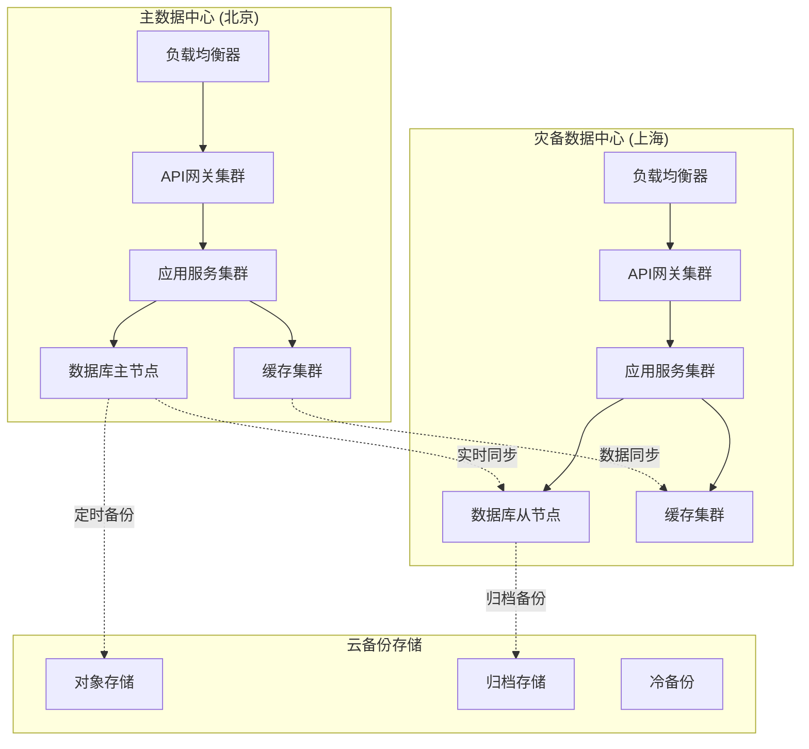

# AI智能营养餐厅系统 - 灾备与业务连续性计划

> **文档版本**: 1.0.0  
> **创建日期**: 2025-07-12  
> **更新日期**: 2025-07-12  
> **文档状态**: ✅ 灾备计划就绪  
> **目标受众**: 运维团队、SRE团队、技术负责人、业务负责人

## 📋 目录

- [1. 灾备计划概述](#1-灾备计划概述)
- [2. 业务连续性分析](#2-业务连续性分析)
- [3. 灾备架构设计](#3-灾备架构设计)
- [4. 数据备份策略](#4-数据备份策略)
- [5. 故障恢复程序](#5-故障恢复程序)
- [6. 应急响应流程](#6-应急响应流程)
- [7. 测试与演练](#7-测试与演练)
- [8. 监控与预警](#8-监控与预警)

---

## 1. 灾备计划概述

### 1.1 灾备目标

```yaml
灾备核心目标:
  RPO (恢复点目标):
    数据库: "≤ 5分钟"
    文件存储: "≤ 15分钟"
    日志数据: "≤ 30分钟"
    
  RTO (恢复时间目标):
    核心服务: "≤ 30分钟"
    完整服务: "≤ 2小时"
    数据一致性验证: "≤ 4小时"
    
  可用性目标:
    年度可用性: "99.95%"
    月度可用性: "99.9%"
    计划停机时间: "≤ 4小时/月"
```

### 1.2 灾难类型分类

```yaml
灾难类型分级:
  L1_系统级故障:
    - 单一服务宕机
    - 数据库连接异常
    - 缓存服务故障
    影响范围: "部分功能"
    恢复时间: "5-15分钟"
    
  L2_基础设施故障:
    - 服务器硬件故障
    - 网络设备故障
    - 存储系统故障
    影响范围: "整体服务"
    恢复时间: "15-60分钟"
    
  L3_数据中心故障:
    - 机房断电
    - 网络中断
    - 冷却系统故障
    影响范围: "全部服务"
    恢复时间: "1-4小时"
    
  L4_区域性灾难:
    - 自然灾害
    - 大面积停电
    - 政策性中断
    影响范围: "区域性服务"
    恢复时间: "4-24小时"
```

### 1.3 业务优先级定义

```yaml
业务功能优先级:
  P0_核心业务 (最高优先级):
    - 用户登录认证
    - 订单支付处理
    - 数据安全保护
    - 核心API服务
    恢复要求: "立即恢复"
    
  P1_重要业务:
    - 菜品浏览
    - 订单管理
    - 营养师咨询
    - 商家管理
    恢复要求: "30分钟内恢复"
    
  P2_一般业务:
    - 社区论坛
    - 数据分析
    - 报告生成
    - 营销推广
    恢复要求: "2小时内恢复"
    
  P3_低优先级:
    - 系统日志查询
    - 历史数据分析
    - 非关键通知
    恢复要求: "24小时内恢复"
```

---

## 2. 业务连续性分析

### 2.1 业务影响分析 (BIA)

```yaml
业务影响评估:
  财务影响:
    订单处理中断:
      小时损失: "¥50,000"
      日损失: "¥1,200,000"
      周损失: "¥8,400,000"
      
    用户流失:
      1小时中断: "用户投诉增加30%"
      4小时中断: "活跃用户减少5%"
      24小时中断: "用户流失率增加15%"
      
  声誉影响:
    短期中断(≤1小时): "轻微影响"
    中期中断(1-8小时): "显著影响"
    长期中断(>8小时): "严重影响"
    
  法律风险:
    数据丢失: "个人信息保护法违规风险"
    服务中断: "服务协议违约风险"
    支付异常: "金融监管合规风险"
```

### 2.2 关键依赖识别

```yaml
外部依赖分析:
  云服务提供商:
    主要: "阿里云"
    备用: "腾讯云"
    切换时间: "4-6小时"
    
  第三方API:
    支付服务: "支付宝、微信支付"
    地图服务: "高德地图"
    AI服务: "DeepSeek API"
    短信服务: "阿里云短信"
    
  供应商依赖:
    网络运营商: "双线接入"
    电力供应: "UPS + 发电机"
    安全服务: "第三方安全厂商"
    
内部关键路径:
  数据流依赖:
    - 用户认证 → 订单处理 → 支付确认
    - 营养分析 → AI推荐 → 个性化服务
    - 日志收集 → 监控告警 → 故障处理
```

### 2.3 最小可行服务 (MVS)

```yaml
最小可行服务定义:
  核心功能保持:
    - 用户登录 (简化认证)
    - 基础浏览 (缓存数据)
    - 订单处理 (延迟同步)
    - 支付服务 (第三方直连)
    
  功能降级策略:
    AI推荐: "使用历史推荐缓存"
    实时咨询: "转为异步消息"
    数据分析: "暂停非关键分析"
    文件上传: "延迟处理"
    
  资源分配:
    计算资源: "优先保障核心服务"
    存储资源: "优先保障交易数据"
    网络资源: "优先保障API接口"
```

---

## 3. 灾备架构设计

### 3.1 多中心架构

```yaml
数据中心布局:
  主中心 (北京):
    位置: "北京市朝阳区"
    容量: "100%业务处理能力"
    角色: "主要生产环境"
    
  灾备中心 (上海):
    位置: "上海市浦东新区"
    容量: "80%业务处理能力"
    角色: "热备份 + 读写分离"
    
  云备份 (多地域):
    阿里云: "华东1、华北2、华南1"
    腾讯云: "备用云服务商"
    角色: "冷备份 + 数据归档"
    
网络架构:
  专线连接: "主中心 ↔ 灾备中心"
  带宽: "1Gbps双线路"
  延迟: "< 10ms"
  
  公网备份: "多运营商接入"
  CDN加速: "全国节点覆盖"
```

### 3.2 数据同步策略

```yaml
数据同步设计:
  实时同步 (关键数据):
    数据类型:
      - 用户认证信息
      - 订单交易数据
      - 支付记录
      - 实时会话数据
    同步方式: "数据库主从复制 + 应用层双写"
    同步延迟: "< 1秒"
    
  准实时同步 (重要数据):
    数据类型:
      - 用户档案信息
      - 商家店铺数据
      - 营养师信息
      - 菜品信息
    同步方式: "CDC + 消息队列"
    同步延迟: "< 5分钟"
    
  批量同步 (归档数据):
    数据类型:
      - 历史订单
      - 日志文件
      - 分析报告
      - 系统配置
    同步方式: "定时任务 + 增量备份"
    同步频率: "每小时/每日"
```

### 3.3 服务部署架构



---

## 4. 数据备份策略

### 4.1 备份分类与频率

```yaml
备份策略矩阵:
  数据库备份:
    全量备份:
      频率: "每日 02:00"
      保留期: "30天"
      存储位置: "本地 + 异地 + 云存储"
      
    增量备份:
      频率: "每小时"
      保留期: "7天"
      存储位置: "本地 + 异地"
      
    事务日志备份:
      频率: "每15分钟"
      保留期: "24小时"
      存储位置: "本地 + 实时同步"
      
  文件系统备份:
    用户文件:
      频率: "实时同步"
      保留期: "永久"
      存储位置: "多地域对象存储"
      
    应用文件:
      频率: "每次发布"
      保留期: "最近10个版本"
      存储位置: "版本控制 + 镜像仓库"
      
    日志文件:
      频率: "每小时"
      保留期: "90天"
      存储位置: "日志平台 + 归档存储"
```

### 4.2 备份验证流程

```yaml
备份验证程序:
  自动验证:
    完整性检查:
      - "文件MD5校验"
      - "数据库一致性检查"
      - "备份文件可读性验证"
      频率: "每次备份后"
      
    恢复测试:
      - "从备份恢复到测试环境"
      - "数据完整性验证"
      - "业务功能验证"
      频率: "每周"
      
  人工验证:
    月度验证:
      - "随机抽取备份进行恢复"
      - "业务流程端到端测试"
      - "性能基准对比"
      
    季度验证:
      - "完整灾备环境恢复"
      - "全业务功能验证"
      - "RTO/RPO指标验证"
```

### 4.3 备份安全管理

```yaml
备份安全措施:
  数据加密:
    传输加密: "TLS 1.3"
    存储加密: "AES-256-GCM"
    密钥管理: "HSM硬件安全模块"
    
  访问控制:
    权限管理: "最小权限原则"
    身份认证: "双因子认证"
    操作审计: "完整操作日志"
    
  异地存储:
    地理分布: "至少3个不同城市"
    存储介质: "磁盘 + 磁带 + 云存储"
    介质轮换: "定期更换老化介质"
```

---

## 5. 故障恢复程序

### 5.1 故障检测与告警

```yaml
故障检测机制:
  监控指标:
    系统级指标:
      - CPU使用率 > 80%
      - 内存使用率 > 85%
      - 磁盘使用率 > 90%
      - 网络延迟 > 500ms
      
    应用级指标:
      - API响应时间 > 3秒
      - 错误率 > 1%
      - 数据库连接失败
      - 队列积压 > 1000条
      
    业务级指标:
      - 订单处理失败率 > 0.5%
      - 支付成功率 < 99%
      - 用户登录失败率 > 2%
      
  告警机制:
    告警级别:
      Critical: "立即响应 (5分钟内)"
      High: "快速响应 (15分钟内)"
      Medium: "正常响应 (1小时内)"
      Low: "延迟响应 (4小时内)"
      
    通知渠道:
      - 短信通知 (Critical/High)
      - 微信群通知
      - 邮件通知
      - 钉钉机器人
      - 值班电话
```

### 5.2 自动故障转移

```yaml
自动切换策略:
  负载均衡器切换:
    健康检查: "每5秒"
    故障阈值: "连续3次失败"
    切换时间: "< 30秒"
    
  数据库主从切换:
    检测方式: "心跳检测 + 应用探测"
    切换条件: "主库不可用 > 60秒"
    切换时间: "2-5分钟"
    数据一致性: "基于GTID的一致性保证"
    
  应用服务切换:
    容器编排: "Kubernetes自动重启"
    节点切换: "跨节点Pod重新调度"
    会话保持: "Redis共享会话"
    
  CDN切换:
    源站切换: "自动检测源站可用性"
    节点切换: "就近节点故障转移"
    缓存预热: "关键资源提前预热"
```

### 5.3 手动恢复流程

```yaml
手动恢复步骤:
  L1级故障恢复:
    1. "确认故障范围和影响"
    2. "尝试服务重启"
    3. "检查依赖服务状态"
    4. "验证恢复效果"
    5. "记录故障原因"
    
  L2级故障恢复:
    1. "启动应急响应团队"
    2. "评估切换到备用系统"
    3. "执行数据库切换"
    4. "更新DNS指向"
    5. "验证业务功能"
    6. "通知相关人员"
    
  L3级故障恢复:
    1. "启动灾备中心"
    2. "数据同步验证"
    3. "应用服务部署"
    4. "流量切换"
    5. "全功能测试"
    6. "业务公告"
    
  L4级故障恢复:
    1. "启动应急指挥中心"
    2. "评估损失和风险"
    3. "启动异地恢复"
    4. "协调外部资源"
    5. "阶段性恢复"
    6. "持续监控和优化"
```

---

## 6. 应急响应流程

### 6.1 应急组织架构

```yaml
应急响应团队:
  指挥中心:
    应急指挥官: "CTO"
    副指挥官: "运维总监"
    协调员: "项目经理"
    
  技术团队:
    系统组: "运维工程师 x3"
    开发组: "后端工程师 x2、前端工程师 x1"
    数据组: "数据库工程师 x2"
    安全组: "安全工程师 x1"
    
  业务团队:
    客服组: "客服主管 + 客服代表"
    商务组: "商务经理"
    法务组: "法务顾问"
    
  外部支持:
    云服务商: "阿里云技术支持"
    ISP: "网络运营商"
    硬件厂商: "服务器/网络设备厂商"
```

### 6.2 响应时间要求

```yaml
响应时间标准:
  故障发现:
    自动监控: "实时发现"
    人工发现: "5分钟内上报"
    用户反馈: "10分钟内确认"
    
  团队集结:
    核心团队: "15分钟内到位"
    扩展团队: "30分钟内到位"
    外部支持: "1小时内联系"
    
  初步响应:
    故障确认: "10分钟内"
    影响评估: "20分钟内"
    应急决策: "30分钟内"
    
  恢复时间:
    临时方案: "1小时内"
    正式修复: "4小时内"
    验证完成: "6小时内"
```

### 6.3 沟通协调机制

```yaml
沟通流程:
  内部沟通:
    技术群: "实时故障状态更新"
    管理群: "每30分钟状态汇报"
    全员通知: "重大故障通告"
    
  外部沟通:
    用户通知:
      - 故障确认后30分钟内发布公告
      - 每2小时更新进展
      - 恢复后发布最终公告
      
    合作伙伴:
      - 影响合作业务时立即通知
      - 提供预期恢复时间
      - 协调资源支持
      
    监管部门:
      - 重大故障12小时内报告
      - 提供详细故障报告
      - 配合调查和整改
```

---

## 7. 测试与演练

### 7.1 演练计划

```yaml
灾备演练计划:
  月度演练:
    类型: "单点故障演练"
    范围: "单个服务组件"
    时间: "每月第二个周六 22:00-24:00"
    内容:
      - 数据库主从切换
      - 应用服务切换
      - 缓存故障恢复
      - 监控告警测试
      
  季度演练:
    类型: "区域故障演练"
    范围: "数据中心级故障"
    时间: "每季度最后一个周日"
    内容:
      - 主中心到灾备中心切换
      - 数据完整性验证
      - 业务功能全面测试
      - 团队协作效率评估
      
  年度演练:
    类型: "全面灾备演练"
    范围: "模拟极端灾难场景"
    时间: "每年12月"
    内容:
      - 多中心协同恢复
      - 外部供应商协调
      - 业务连续性验证
      - 应急预案完整性测试
```

### 7.2 演练评估标准

```yaml
演练评估指标:
  技术指标:
    RTO实际值: "与目标值比较"
    RPO实际值: "数据丢失时间"
    系统可用性: "恢复后服务可用率"
    数据一致性: "数据完整性检查结果"
    
  流程指标:
    响应时间: "从故障到开始处理"
    沟通效率: "信息传递准确性和及时性"
    决策速度: "关键决策点耗时"
    团队协作: "跨团队配合效果"
    
  业务指标:
    服务恢复率: "各业务功能恢复程度"
    用户影响: "受影响用户数量和时长"
    财务损失: "演练期间的业务损失"
    声誉影响: "外部反馈和评价"
```

### 7.3 演练改进机制

```yaml
持续改进流程:
  演练总结:
    时间: "演练结束后48小时内"
    参与者: "所有演练参与人员"
    内容:
      - 问题清单整理
      - 改进建议收集
      - 最佳实践总结
      
  改进计划:
    优先级排序: "按影响程度和实施难度"
    负责人分配: "明确改进任务责任人"
    时间计划: "设定改进完成时间"
    
  效果验证:
    下次演练验证: "改进措施效果检验"
    持续监控: "日常运维中的效果观察"
    定期回顾: "改进措施的长期效果评估"
```

---

## 8. 监控与预警

### 8.1 监控体系架构

```yaml
监控层次设计:
  基础设施监控:
    物理层:
      - 服务器硬件状态
      - 网络设备状态
      - 存储设备状态
      - 机房环境监控
      
    虚拟化层:
      - 虚拟机性能
      - 容器运行状态
      - 资源分配情况
      - 网络连通性
      
  应用服务监控:
    服务健康度:
      - 服务可用性
      - 响应时间
      - 吞吐量
      - 错误率
      
    业务指标:
      - 订单处理量
      - 用户活跃度
      - 支付成功率
      - API调用量
      
  数据监控:
    数据质量:
      - 数据完整性
      - 数据一致性
      - 数据及时性
      - 异常数据检测
      
    同步状态:
      - 主从延迟
      - 同步进度
      - 冲突检测
      - 数据校验
```

### 8.2 预警规则设置

```yaml
预警阈值配置:
  性能预警:
    CPU使用率:
      warning: "> 70%"
      critical: "> 85%"
      duration: "持续5分钟"
      
    内存使用率:
      warning: "> 80%"
      critical: "> 90%"
      duration: "持续3分钟"
      
    磁盘使用率:
      warning: "> 85%"
      critical: "> 95%"
      duration: "持续1分钟"
      
  业务预警:
    API响应时间:
      warning: "> 2秒"
      critical: "> 5秒"
      duration: "持续2分钟"
      
    错误率:
      warning: "> 0.5%"
      critical: "> 2%"
      duration: "持续1分钟"
      
    订单处理失败率:
      warning: "> 0.1%"
      critical: "> 0.5%"
      duration: "持续30秒"
```

### 8.3 监控工具栈

```yaml
监控工具配置:
  指标收集:
    Prometheus: "指标收集和存储"
    Node Exporter: "系统指标收集"
    Application Metrics: "应用指标收集"
    
  日志管理:
    ELK Stack: "日志收集、存储、分析"
    Filebeat: "日志文件收集"
    Logstash: "日志处理和转换"
    PostgreSQL: "日志存储和搜索"
    Kibana: "日志可视化"
    
  监控可视化:
    Grafana: "指标仪表板"
    自定义看板: "业务监控大屏"
    移动端App: "移动告警查看"
    
  告警通知:
    AlertManager: "告警路由和去重"
    短信平台: "短信告警"
    邮件系统: "邮件通知"
    即时通讯: "微信、钉钉集成"
```

---

## 附录

### A. 联系方式

```yaml
应急联系方式:
  技术负责人:
    姓名: "张三"
    职位: "CTO"
    电话: "138-XXXX-XXXX"
    微信: "tech_cto"
    
  运维负责人:
    姓名: "李四"
    职位: "运维总监"
    电话: "139-XXXX-XXXX"
    微信: "ops_director"
    
  外部供应商:
    阿里云支持: "95187"
    网络运营商: "10000 (电信), 10086 (移动)"
    机房服务商: "400-XXX-XXXX"
```

### B. 重要配置信息

```yaml
关键系统信息:
  DNS配置:
    主域名: "api.ai-nutrition.com"
    备用域名: "backup.ai-nutrition.com"
    TTL设置: "300秒"
    
  数据库连接:
    主库地址: "db-master.internal"
    从库地址: "db-slave.internal"
    备库地址: "db-backup.internal"
    
  存储系统:
    主存储: "storage-primary.internal"
    备份存储: "storage-backup.internal"
    对象存储: "oss.aliyuncs.com"
```

### C. 版本历史

| 版本 | 日期 | 变更内容 | 责任人 |
|------|------|----------|--------|
| 1.0.0 | 2025-07-12 | 初始版本创建 | 技术团队 |

---

**文档维护**: 运维团队  
**审核人**: CTO  
**下次更新**: 2025-08-12