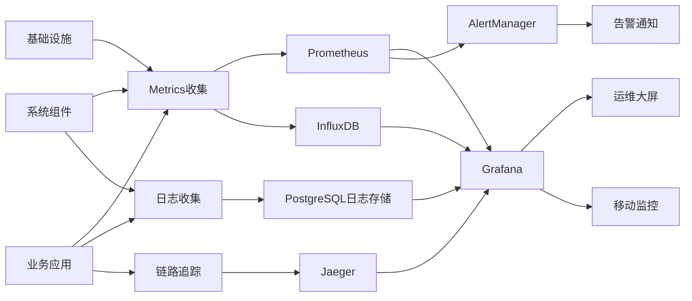

# AI智能营养餐厅系统 - 监控运维文档

> **文档版本**: 1.0.0  
> **创建日期**: 2025-07-12  
> **更新日期**: 2025-07-12  
> **文档状态**: ✅ 监控运维就绪  
> **目标受众**: 运维工程师、SRE团队、开发团队、技术负责人

## 📋 目录

- [1. 监控体系概述](#1-监控体系概述)
- [2. 基础设施监控](#2-基础设施监控)
- [3. 应用服务监控](#3-应用服务监控)
- [4. 业务指标监控](#4-业务指标监控)
- [5. 日志管理](#5-日志管理)
- [6. 告警系统](#6-告警系统)
- [7. 运维自动化](#7-运维自动化)
- [8. 性能调优](#8-性能调优)
- [9. 故障处理](#9-故障处理)
- [10. 运维流程](#10-运维流程)

---

## 1. 监控体系概述

### 1.1 监控架构设计

```yaml
监控体系架构:
  数据收集层:
    基础设施: "Node Exporter, cAdvisor"
    应用层: "Prometheus SDK, APM"
    业务层: "自定义Metrics, 埋点数据"
    日志层: "Filebeat, Fluentd"
    
  数据存储层:
    时序数据: "Prometheus, InfluxDB"
    日志数据: "PostgreSQL + JSON字段"
    追踪数据: "Jaeger"
    配置数据: "Consul, Etcd"
    
  数据处理层:
    聚合计算: "Prometheus Rules"
    流处理: "Logstash, Kafka Streams"
    机器学习: "异常检测算法"
    
  可视化层:
    仪表板: "Grafana"
    大屏监控: "自定义Dashboard"
    移动端: "监控App"
    
  告警层:
    规则引擎: "AlertManager"
    通知网关: "多渠道告警"
    自动处理: "自愈脚本"
```

### 1.2 监控指标分类

```yaml
指标分类体系:
  系统指标 (System Metrics):
    - CPU使用率、负载
    - 内存使用率、页面换入换出
    - 磁盘I/O、容量使用
    - 网络流量、连接数
    - 进程状态、文件句柄
    
  应用指标 (Application Metrics):
    - 请求量 (RPS/QPS)
    - 响应时间 (延迟分布)
    - 错误率 (4xx/5xx)
    - 并发数、连接池状态
    - 队列积压、处理速度
    
  业务指标 (Business Metrics):
    - 用户注册量、活跃度
    - 订单量、成功率
    - 支付金额、成功率
    - 营养师咨询量
    - 商家上线数量
    
  基础设施指标 (Infrastructure Metrics):
    - 容器运行状态
    - 数据库连接数、慢查询
    - 缓存命中率、内存使用
    - 消息队列积压
    - 存储容量、IOPS
```

### 1.3 监控数据流



---

## 2. 基础设施监控

### 2.1 服务器监控

```yaml
服务器监控配置:
  CPU监控:
    指标:
      - cpu_usage_percent: "CPU使用率"
      - load_average: "系统负载"
      - cpu_temperature: "CPU温度"
    阈值:
      warning: "CPU > 70%"
      critical: "CPU > 85%"
      emergency: "CPU > 95%"
    采集频率: "30秒"
    
  内存监控:
    指标:
      - memory_usage_percent: "内存使用率"
      - memory_available: "可用内存"
      - swap_usage: "交换分区使用"
    阈值:
      warning: "内存 > 80%"
      critical: "内存 > 90%"
      emergency: "内存 > 95%"
    采集频率: "30秒"
    
  磁盘监控:
    指标:
      - disk_usage_percent: "磁盘使用率"
      - disk_io_utilization: "磁盘I/O使用率"
      - disk_read_write_speed: "读写速度"
    阈值:
      warning: "磁盘 > 85%"
      critical: "磁盘 > 90%"
      emergency: "磁盘 > 95%"
    采集频率: "1分钟"
    
  网络监控:
    指标:
      - network_bytes_sent: "发送流量"
      - network_bytes_received: "接收流量"
      - network_connections: "网络连接数"
      - network_errors: "网络错误"
    阈值:
      warning: "带宽使用 > 70%"
      critical: "带宽使用 > 85%"
      emergency: "网络错误 > 1%"
    采集频率: "30秒"
```

### 2.2 容器监控

```yaml
容器监控配置:
  Kubernetes集群监控:
    节点级指标:
      - node_cpu_usage: "节点CPU使用"
      - node_memory_usage: "节点内存使用"
      - node_disk_usage: "节点磁盘使用"
      - node_network_usage: "节点网络使用"
      
    Pod级指标:
      - pod_cpu_usage: "Pod CPU使用"
      - pod_memory_usage: "Pod内存使用"
      - pod_restart_count: "Pod重启次数"
      - pod_status: "Pod运行状态"
      
    容器级指标:
      - container_cpu_usage: "容器CPU使用"
      - container_memory_usage: "容器内存使用"
      - container_io_usage: "容器I/O使用"
      - container_network_usage: "容器网络使用"
      
  Docker监控:
    容器状态:
      - container_running_count: "运行中容器数"
      - container_stopped_count: "停止容器数"
      - container_error_count: "错误容器数"
      
    资源使用:
      - docker_cpu_usage: "Docker CPU使用"
      - docker_memory_usage: "Docker内存使用"
      - docker_storage_usage: "Docker存储使用"
```

### 2.3 网络设备监控

```yaml
网络设备监控:
  负载均衡器:
    监控指标:
      - lb_active_connections: "活跃连接数"
      - lb_request_rate: "请求速率"
      - lb_response_time: "响应时间"
      - lb_health_check_status: "健康检查状态"
    采集方式: "SNMP + API"
    
  交换机/路由器:
    监控指标:
      - interface_utilization: "接口使用率"
      - packet_loss_rate: "丢包率"
      - error_rate: "错误率"
      - temperature: "设备温度"
    采集方式: "SNMP"
    
  防火墙:
    监控指标:
      - fw_connection_count: "连接数"
      - fw_throughput: "吞吐量"
      - fw_blocked_count: "阻断次数"
      - fw_policy_hits: "策略命中"
    采集方式: "SNMP + 日志解析"
```

---

## 3. 应用服务监控

### 3.1 Web服务监控

```yaml
Web服务监控配置:
  API监控:
    响应时间:
      - api_response_time_p50: "50分位响应时间"
      - api_response_time_p90: "90分位响应时间"
      - api_response_time_p99: "99分位响应时间"
      阈值:
        warning: "P90 > 2s"
        critical: "P90 > 5s"
        
    错误率:
      - api_error_rate_4xx: "4xx错误率"
      - api_error_rate_5xx: "5xx错误率"
      - api_timeout_rate: "超时率"
      阈值:
        warning: "错误率 > 1%"
        critical: "错误率 > 5%"
        
    吞吐量:
      - api_requests_per_second: "每秒请求数"
      - api_concurrent_requests: "并发请求数"
      阈值:
        warning: "并发 > 1000"
        critical: "并发 > 2000"
        
  应用性能:
    JVM监控 (Java应用):
      - jvm_heap_usage: "堆内存使用"
      - jvm_gc_time: "GC耗时"
      - jvm_gc_frequency: "GC频率"
      - jvm_thread_count: "线程数"
      
    Node.js监控:
      - nodejs_heap_usage: "堆内存使用"
      - nodejs_event_loop_lag: "事件循环延迟"
      - nodejs_active_handles: "活跃句柄数"
      - nodejs_active_requests: "活跃请求数"
```

### 3.2 数据库监控

```yaml
数据库监控配置:
  PostgreSQL监控:
    连接监控:
      - pg_active_connections: "活跃连接数"
      - pg_idle_connections: "空闲连接数"
      - pg_max_connections: "最大连接数"
      阈值:
        warning: "连接数 > 80%"
        critical: "连接数 > 90%"
        
    性能监控:
      - pg_query_duration: "查询耗时"
      - pg_slow_queries: "慢查询数量"
      - pg_deadlocks: "死锁数量"
      - pg_cache_hit_ratio: "缓存命中率"
      阈值:
        warning: "慢查询 > 10/min"
        critical: "慢查询 > 50/min"
        
    复制监控:
      - pg_replication_lag: "复制延迟"
      - pg_wal_lag: "WAL延迟"
      - pg_slave_status: "从库状态"
      阈值:
        warning: "延迟 > 5s"
        critical: "延迟 > 30s"
        
  Redis监控:
    内存监控:
      - redis_memory_usage: "内存使用量"
      - redis_memory_fragmentation: "内存碎片率"
      - redis_evicted_keys: "驱逐键数量"
      
    性能监控:
      - redis_ops_per_second: "每秒操作数"
      - redis_hit_rate: "命中率"
      - redis_response_time: "响应时间"
      - redis_slow_log_count: "慢日志数量"
      
    连接监控:
      - redis_connected_clients: "连接客户端数"
      - redis_blocked_clients: "阻塞客户端数"
      - redis_rejected_connections: "拒绝连接数"
```

### 3.3 消息队列监控

```yaml
消息队列监控:
  RabbitMQ监控:
    队列监控:
      - rabbitmq_queue_depth: "队列深度"
      - rabbitmq_message_rate: "消息速率"
      - rabbitmq_consumer_count: "消费者数量"
      - rabbitmq_message_unacked: "未确认消息数"
      
    节点监控:
      - rabbitmq_node_disk_free: "节点磁盘可用"
      - rabbitmq_node_memory_usage: "节点内存使用"
      - rabbitmq_node_connection_count: "节点连接数"
      
  Kafka监控 (如使用):
    Topic监控:
      - kafka_topic_partition_count: "分区数量"
      - kafka_topic_replica_count: "副本数量"
      - kafka_topic_message_rate: "消息速率"
      
    Broker监控:
      - kafka_broker_cpu_usage: "Broker CPU使用"
      - kafka_broker_disk_usage: "Broker磁盘使用"
      - kafka_broker_network_usage: "Broker网络使用"
```

---

## 4. 业务指标监控

### 4.1 用户行为监控

```yaml
用户行为指标:
  用户活跃度:
    实时指标:
      - online_users: "在线用户数"
      - new_registrations: "新注册用户"
      - active_sessions: "活跃会话数"
      - user_actions_per_minute: "每分钟用户操作"
      
    日常指标:
      - daily_active_users: "日活跃用户"
      - weekly_active_users: "周活跃用户"
      - monthly_active_users: "月活跃用户"
      - user_retention_rate: "用户留存率"
      
  用户行为:
    页面访问:
      - page_views: "页面浏览量"
      - unique_page_views: "独立页面浏览"
      - bounce_rate: "跳出率"
      - session_duration: "会话时长"
      
    功能使用:
      - feature_usage_count: "功能使用次数"
      - search_queries: "搜索查询数"
      - click_through_rate: "点击率"
      - conversion_rate: "转化率"
```

### 4.2 业务交易监控

```yaml
交易业务指标:
  订单监控:
    订单量:
      - orders_created: "创建订单数"
      - orders_paid: "支付订单数"
      - orders_delivered: "完成订单数"
      - orders_cancelled: "取消订单数"
      
    订单金额:
      - total_order_amount: "总订单金额"
      - average_order_value: "平均订单金额"
      - payment_success_rate: "支付成功率"
      - refund_rate: "退款率"
      
  支付监控:
    支付渠道:
      - alipay_transaction_count: "支付宝交易数"
      - wechat_transaction_count: "微信支付交易数"
      - bank_card_transaction_count: "银行卡交易数"
      
    支付状态:
      - payment_success_rate: "支付成功率"
      - payment_failure_rate: "支付失败率"
      - payment_timeout_rate: "支付超时率"
      - payment_processing_time: "支付处理时间"
```

### 4.3 营养服务监控

```yaml
营养服务指标:
  AI推荐:
    推荐性能:
      - recommendation_requests: "推荐请求数"
      - recommendation_response_time: "推荐响应时间"
      - recommendation_success_rate: "推荐成功率"
      - recommendation_click_rate: "推荐点击率"
      
    推荐质量:
      - recommendation_accuracy: "推荐准确度"
      - user_satisfaction_score: "用户满意度"
      - recommendation_diversity: "推荐多样性"
      
  营养师咨询:
    咨询服务:
      - consultation_requests: "咨询请求数"
      - consultation_response_time: "咨询响应时间"
      - consultation_completion_rate: "咨询完成率"
      - nutritionist_utilization: "营养师利用率"
      
    服务质量:
      - consultation_rating: "咨询评分"
      - customer_satisfaction: "客户满意度"
      - repeat_consultation_rate: "重复咨询率"
```

---

## 5. 日志管理

### 5.1 日志收集架构

```yaml
日志收集体系:
  日志来源:
    应用日志:
      - 业务操作日志
      - 错误异常日志
      - 性能统计日志
      - 安全审计日志
      
    系统日志:
      - 操作系统日志 (/var/log/)
      - 容器运行日志
      - 网络设备日志
      - 安全设备日志
      
    中间件日志:
      - Web服务器日志 (Nginx/Apache)
      - 数据库日志 (PostgreSQL/Redis)
      - 消息队列日志 (RabbitMQ)
      - 负载均衡日志
      
  收集工具:
    Filebeat:
      - 轻量级日志收集器
      - 支持多种输入源
      - 断点续传功能
      - 多行日志处理
      
    Fluentd:
      - 统一日志收集层
      - 丰富的插件生态
      - 数据缓冲和重试
      - 多目标输出
      
    自定义Agent:
      - 业务特定日志收集
      - 敏感信息脱敏
      - 实时日志处理
```

### 5.2 日志处理流程

```yaml
日志处理管道:
  采集阶段:
    文件监控:
      - 实时监控日志文件变化
      - 支持日志轮转
      - 处理多行日志
      
    格式化:
      - 统一日志格式
      - 时间戳标准化
      - 字段提取和映射
      
  传输阶段:
    数据传输:
      - 可靠的消息传递
      - 背压处理
      - 失败重试机制
      
    数据缓冲:
      - 本地缓冲队列
      - 内存溢出保护
      - 持久化缓存
      
  处理阶段:
    数据清洗:
      - 无效数据过滤
      - 敏感信息脱敏
      - 数据去重
      
    数据富化:
      - 添加元数据信息
      - IP地理位置解析
      - 用户代理解析
      
  存储阶段:
    索引策略:
      - 时间基础索引
      - 热温冷数据分层
      - 自动索引清理
      
    数据压缩:
      - 数据压缩算法
      - 存储成本优化
      - 查询性能平衡
```

### 5.3 日志分析与搜索

```yaml
日志分析配置:
  PostgreSQL日志存储配置:
    数据库配置:
      分片策略: "按日期分区"
      索引优化: "JSON字段索引"
      压缩算法: "ZSTD"
      保留策略: "90天自动清理"
      
    索引管理:
      index_template:
        - "app-logs-*"
        - "system-logs-*"
        - "security-logs-*"
      retention_policy:
        hot_data: "7天"
        warm_data: "30天"
        cold_data: "90天"
        
    分片策略:
      primary_shards: 5
      replica_shards: 1
      shard_size: "50GB"
      
  Kibana仪表板:
    业务监控:
      - API调用统计
      - 错误趋势分析
      - 用户行为分析
      - 性能指标监控
      
    运维监控:
      - 系统资源使用
      - 服务健康状态
      - 错误日志分析
      - 安全事件监控
      
    自定义视图:
      - 实时监控大屏
      - 告警事件汇总
      - 趋势分析报告
```

---

## 6. 告警系统

### 6.1 告警规则配置

```yaml
告警规则定义:
  基础设施告警:
    CPU告警:
      rule_name: "HighCPUUsage"
      expression: "cpu_usage > 85"
      duration: "5m"
      severity: "warning"
      
      rule_name: "CriticalCPUUsage"
      expression: "cpu_usage > 95"
      duration: "2m"
      severity: "critical"
      
    内存告警:
      rule_name: "HighMemoryUsage"
      expression: "memory_usage > 90"
      duration: "3m"
      severity: "warning"
      
    磁盘告警:
      rule_name: "DiskSpaceLow"
      expression: "disk_usage > 90"
      duration: "1m"
      severity: "critical"
      
  应用服务告警:
    API性能:
      rule_name: "HighAPILatency"
      expression: "api_response_time_p90 > 2"
      duration: "2m"
      severity: "warning"
      
      rule_name: "HighErrorRate"
      expression: "api_error_rate > 5"
      duration: "1m"
      severity: "critical"
      
    数据库告警:
      rule_name: "DatabaseConnectionHigh"
      expression: "db_connections > 80"
      duration: "3m"
      severity: "warning"
      
      rule_name: "SlowQueryHigh"
      expression: "slow_query_count > 20"
      duration: "5m"
      severity: "warning"
```

### 6.2 告警级别与响应

```yaml
告警级别定义:
  Critical (P0):
    描述: "严重影响核心业务功能"
    响应时间: "5分钟内"
    处理方式: "立即电话 + 短信 + 钉钉"
    升级策略: "15分钟无响应自动升级"
    示例:
      - 系统完全不可用
      - 数据库主库宕机
      - 支付服务异常
      
  High (P1):
    描述: "显著影响用户体验"
    响应时间: "15分钟内"
    处理方式: "短信 + 钉钉 + 邮件"
    升级策略: "30分钟无响应自动升级"
    示例:
      - API响应时间过长
      - 部分功能不可用
      - 性能严重下降
      
  Medium (P2):
    描述: "潜在风险，需要关注"
    响应时间: "1小时内"
    处理方式: "钉钉 + 邮件"
    升级策略: "4小时无响应自动升级"
    示例:
      - 资源使用率较高
      - 监控数据异常
      - 非关键服务故障
      
  Low (P3):
    描述: "一般性问题，定期处理"
    响应时间: "4小时内"
    处理方式: "邮件通知"
    升级策略: "24小时无响应提醒"
    示例:
      - 磁盘使用率预警
      - 性能优化建议
      - 配置变更提醒
```

### 6.3 告警通知渠道

```yaml
通知渠道配置:
  短信通知:
    供应商: "阿里云短信服务"
    场景: "Critical/High级别告警"
    模板: "【运维告警】{service}服务异常，{description}，请立即处理"
    限制: "同类告警5分钟内最多发送1次"
    
  邮件通知:
    SMTP服务: "企业邮箱SMTP"
    场景: "所有级别告警"
    模板: "HTML格式，包含详细告警信息"
    抄送规则: "按告警级别确定抄送范围"
    
  即时通讯:
    钉钉群:
      - 运维告警群 (Critical/High)
      - 技术讨论群 (Medium/Low)
      - 管理层群 (Critical only)
    
    微信群:
      - 应急响应群
      - 值班工程师群
      
  电话通知:
    场景: "Critical级别且短信发送后仍无响应"
    实现: "第三方电话通知服务"
    升级机制: "逐级拨打值班人员电话"
    
  移动App:
    功能: "实时查看告警、确认处理"
    推送: "Critical/High级别告警推送"
    操作: "一键确认、快速响应"
```

---

## 7. 运维自动化

### 7.1 自动化运维架构

```yaml
自动化运维体系:
  配置管理:
    工具: "Ansible"
    功能:
      - 服务器配置标准化
      - 应用部署自动化
      - 配置变更管理
      - 批量操作执行
      
  容器编排:
    工具: "Kubernetes"
    功能:
      - 容器生命周期管理
      - 服务发现与负载均衡
      - 资源调度与扩缩容
      - 滚动更新与回滚
      
  CI/CD流水线:
    工具: "Jenkins / GitLab CI"
    功能:
      - 代码构建与测试
      - 镜像构建与推送
      - 自动化部署
      - 环境管理
      
  基础设施即代码:
    工具: "Terraform"
    功能:
      - 云资源自动化创建
      - 基础设施版本管理
      - 环境一致性保证
      - 成本优化管理
```

### 7.2 自动化脚本库

```yaml
运维脚本分类:
  监控脚本:
    健康检查:
      - check_service_health.sh
      - check_database_status.sh
      - check_api_availability.sh
      
    资源监控:
      - monitor_system_resources.sh
      - monitor_application_metrics.sh
      - monitor_network_status.sh
      
  维护脚本:
    日常维护:
      - log_rotation.sh
      - database_backup.sh
      - cache_cleanup.sh
      - temp_file_cleanup.sh
      
    故障处理:
      - service_restart.sh
      - database_failover.sh
      - cache_warm_up.sh
      - traffic_switch.sh
      
  部署脚本:
    应用部署:
      - deploy_application.sh
      - rollback_deployment.sh
      - blue_green_deployment.sh
      - canary_deployment.sh
      
    配置管理:
      - update_configuration.sh
      - sync_config_files.sh
      - validate_configuration.sh
```

### 7.3 自愈机制

```yaml
自愈系统设计:
  故障检测:
    检测方式:
      - 健康检查接口
      - 进程状态监控
      - 端口连通性检测
      - 响应时间监控
      
    检测频率:
      - 关键服务: "30秒"
      - 一般服务: "1分钟"
      - 基础设施: "2分钟"
      
  自愈动作:
    服务级自愈:
      - 服务进程重启
      - 容器重启
      - Pod重新调度
      - 流量切换
      
    系统级自愈:
      - 节点重启
      - 资源清理
      - 配置重载
      - 缓存刷新
      
  自愈策略:
    重试机制:
      - 最大重试次数: 3
      - 重试间隔: "指数退避"
      - 熔断机制: "连续失败后停止"
      
    升级机制:
      - 自愈失败后人工介入
      - 告警升级通知
      - 应急响应流程
```

---

## 8. 性能调优

### 8.1 性能监控指标

```yaml
性能监控体系:
  应用性能指标:
    响应时间:
      - API平均响应时间
      - 数据库查询时间
      - 缓存访问时间
      - 第三方服务调用时间
      
    吞吐量:
      - 每秒处理请求数 (RPS)
      - 数据库每秒查询数 (QPS)
      - 消息队列处理速率
      - 文件上传下载速率
      
    资源利用率:
      - CPU使用率分布
      - 内存使用模式
      - 网络带宽使用
      - 磁盘I/O使用率
      
  用户体验指标:
    前端性能:
      - 页面加载时间
      - 首屏渲染时间
      - 交互响应时间
      - 资源加载时间
      
    移动端性能:
      - App启动时间
      - 页面切换时间
      - 网络请求耗时
      - 电池消耗情况
```

### 8.2 性能调优策略

```yaml
调优策略矩阵:
  数据库调优:
    查询优化:
      - SQL语句优化
      - 索引设计优化
      - 查询计划分析
      - 慢查询优化
      
    配置优化:
      - 内存配置调整
      - 连接池大小优化
      - 缓存配置调整
      - 并发参数优化
      
    架构优化:
      - 读写分离
      - 分库分表
      - 数据归档
      - 缓存策略
      
  应用调优:
    代码优化:
      - 算法优化
      - 数据结构优化
      - 异步处理
      - 批量操作
      
    架构优化:
      - 微服务拆分
      - 缓存层设计
      - 消息队列异步
      - CDN加速
      
    资源优化:
      - JVM参数调优
      - 线程池配置
      - 内存管理
      - GC优化
      
  基础设施调优:
    网络优化:
      - 带宽升级
      - 网络拓扑优化
      - CDN节点优化
      - 负载均衡调优
      
    存储优化:
      - SSD升级
      - RAID配置
      - 文件系统优化
      - 存储分层
```

### 8.3 性能测试

```yaml
性能测试计划:
  压力测试:
    测试目标:
      - 确定系统最大处理能力
      - 识别性能瓶颈
      - 验证扩容效果
      
    测试场景:
      - 单接口压测
      - 混合场景压测
      - 峰值流量压测
      - 长时间稳定性测试
      
    测试工具:
      - JMeter: "HTTP接口压测"
      - Artillery: "Node.js应用压测"
      - Gatling: "高性能压测"
      - K6: "现代化压测工具"
      
  容量规划:
    规划依据:
      - 历史业务增长趋势
      - 预期用户增长
      - 业务高峰期分析
      - 突发流量预估
      
    规划结果:
      - 服务器配置建议
      - 数据库扩容计划
      - 网络带宽需求
      - 存储容量规划
```

---

## 9. 故障处理

### 9.1 故障分类与处理流程

```yaml
故障处理体系:
  故障分类:
    P0级故障 (Critical):
      定义: "影响核心业务，用户无法正常使用"
      响应时间: "5分钟内响应"
      解决时间: "30分钟内解决"
      示例:
        - 网站完全无法访问
        - 数据库主库宕机
        - 支付功能异常
        
    P1级故障 (High):
      定义: "影响重要功能，用户体验严重下降"
      响应时间: "15分钟内响应"
      解决时间: "2小时内解决"
      示例:
        - API响应缓慢
        - 部分功能异常
        - 性能严重下降
        
    P2级故障 (Medium):
      定义: "影响非关键功能或性能"
      响应时间: "1小时内响应"
      解决时间: "8小时内解决"
      示例:
        - 监控数据异常
        - 非关键服务故障
        - 性能轻微下降
        
  处理流程:
    1. 故障发现:
       - 监控系统自动发现
       - 用户反馈
       - 值班人员巡检
       
    2. 故障确认:
       - 确认故障真实性
       - 评估影响范围
       - 确定故障级别
       
    3. 应急响应:
       - 启动相应级别响应团队
       - 实施临时止损措施
       - 通知相关人员
       
    4. 故障修复:
       - 定位根本原因
       - 制定修复方案
       - 实施修复措施
       - 验证修复效果
       
    5. 故障总结:
       - 编写故障报告
       - 分析根本原因
       - 制定改进措施
       - 更新运维文档
```

### 9.2 常见故障处理手册

```yaml
故障处理手册:
  服务无响应:
    症状:
      - API接口超时
      - 服务进程僵死
      - 端口无法连接
      
    排查步骤:
      1. 检查进程状态
      2. 检查端口占用
      3. 检查系统资源
      4. 查看应用日志
      5. 检查依赖服务
      
    处理方法:
      - 重启服务进程
      - 清理系统资源
      - 修复配置问题
      - 扩容服务资源
      
  数据库异常:
    症状:
      - 连接超时
      - 查询缓慢
      - 死锁频发
      - 主从同步异常
      
    排查步骤:
      1. 检查数据库连接
      2. 查看慢查询日志
      3. 检查锁等待情况
      4. 查看主从状态
      5. 检查磁盘空间
      
    处理方法:
      - 优化SQL查询
      - 增加数据库连接
      - 清理锁等待
      - 修复主从同步
      - 清理磁盘空间
      
  网络异常:
    症状:
      - 网络延迟高
      - 丢包率高
      - 连接中断
      - DNS解析失败
      
    排查步骤:
      1. 检查网络连通性
      2. 查看网络设备状态
      3. 检查DNS配置
      4. 查看路由表
      5. 检查防火墙规则
      
    处理方法:
      - 重启网络设备
      - 修复网络配置
      - 更新DNS设置
      - 调整路由策略
      - 修改防火墙规则
```

### 9.3 故障预防措施

```yaml
故障预防体系:
  预防策略:
    容量管理:
      - 定期容量规划
      - 资源使用监控
      - 自动扩缩容
      - 资源预留机制
      
    变更管理:
      - 变更审批流程
      - 灰度发布
      - 快速回滚机制
      - 变更影响评估
      
    监控预警:
      - 全方位监控覆盖
      - 智能告警规则
      - 趋势分析预警
      - 异常检测算法
      
  技术措施:
    高可用设计:
      - 多活架构
      - 故障转移
      - 负载均衡
      - 数据备份
      
    性能优化:
      - 代码优化
      - 数据库调优
      - 缓存策略
      - 网络优化
      
    安全加固:
      - 访问控制
      - 数据加密
      - 安全审计
      - 漏洞修复
```

---

## 10. 运维流程

### 10.1 日常运维流程

```yaml
日常运维计划:
  值班制度:
    值班安排:
      - 工作日值班: "09:00-18:00"
      - 夜间值班: "18:00-09:00"
      - 周末值班: "24小时"
      - 节假日值班: "24小时"
      
    值班职责:
      - 监控告警响应
      - 日常巡检任务
      - 故障应急处理
      - 值班记录填写
      
  巡检任务:
    每日巡检:
      - 系统资源使用检查
      - 服务运行状态检查
      - 监控告警处理
      - 备份任务执行检查
      
    每周巡检:
      - 性能趋势分析
      - 容量使用评估
      - 安全日志审查
      - 系统更新检查
      
    每月巡检:
      - 系统性能报告
      - 容量规划评估
      - 安全评估报告
      - 成本优化分析
```

### 10.2 变更管理流程

```yaml
变更管理制度:
  变更分类:
    紧急变更:
      - 安全漏洞修复
      - 严重故障修复
      - 业务紧急需求
      审批: "口头审批 + 事后补充"
      
    标准变更:
      - 常规功能发布
      - 配置变更
      - 例行维护
      审批: "在线审批流程"
      
    重大变更:
      - 架构重大调整
      - 数据库变更
      - 安全策略变更
      审批: "会议审批 + 专家评审"
      
  变更流程:
    1. 变更申请:
       - 填写变更申请单
       - 变更影响评估
       - 回滚方案制定
       
    2. 变更审批:
       - 技术负责人审批
       - 业务负责人确认
       - 安全团队审查
       
    3. 变更实施:
       - 按计划执行变更
       - 实时监控变更影响
       - 记录变更过程
       
    4. 变更验证:
       - 功能验证测试
       - 性能影响评估
       - 用户反馈收集
       
    5. 变更总结:
       - 变更结果记录
       - 经验教训总结
       - 流程改进建议
```

### 10.3 文档管理

```yaml
文档管理体系:
  文档分类:
    运维手册:
      - 系统部署手册
      - 故障处理手册
      - 监控配置手册
      - 安全操作手册
      
    操作规程:
      - 日常巡检规程
      - 应急响应规程
      - 变更管理规程
      - 备份恢复规程
      
    技术文档:
      - 系统架构文档
      - 配置管理文档
      - 网络拓扑文档
      - 接口文档
      
  文档维护:
    更新机制:
      - 定期审查更新
      - 变更驱动更新
      - 版本控制管理
      - 文档有效性验证
      
    质量要求:
      - 内容准确完整
      - 格式规范统一
      - 易于理解执行
      - 及时更新维护
```

---

## 附录

### A. 监控工具配置示例

```yaml
# Prometheus配置示例
prometheus_config:
  global:
    scrape_interval: 30s
    evaluation_interval: 30s
    
  scrape_configs:
    - job_name: 'node-exporter'
      static_configs:
        - targets: ['localhost:9100']
    
    - job_name: 'application'
      static_configs:
        - targets: ['app1:8080', 'app2:8080']
      metrics_path: '/metrics'
      scrape_interval: 30s

# Grafana Dashboard配置
grafana_dashboards:
  system_overview:
    panels:
      - cpu_usage
      - memory_usage
      - disk_usage
      - network_traffic
      
  application_metrics:
    panels:
      - api_response_time
      - error_rate
      - request_rate
      - database_connections
```

### B. 告警规则示例

```yaml
# AlertManager告警规则
alert_rules:
  - alert: HighCPUUsage
    expr: cpu_usage > 85
    for: 5m
    labels:
      severity: warning
    annotations:
      summary: "CPU使用率过高"
      description: "{{ $labels.instance }} CPU使用率 {{ $value }}%"
      
  - alert: DatabaseDown
    expr: mysql_up == 0
    for: 1m
    labels:
      severity: critical
    annotations:
      summary: "数据库服务异常"
      description: "{{ $labels.instance }} 数据库连接失败"
```

### C. 联系方式

```yaml
应急联系方式:
  运维团队:
    主管: "张三 - 138-XXXX-XXXX"
    工程师: "李四 - 139-XXXX-XXXX"
    值班电话: "400-XXX-XXXX"
    
  技术团队:
    后端负责人: "王五 - 137-XXXX-XXXX"
    前端负责人: "赵六 - 136-XXXX-XXXX"
    
  外部支持:
    云服务商: "95187 (阿里云)"
    网络运营商: "10000 (电信)"
    安全厂商: "400-XXX-XXXX"
```

---

**文档维护**: 运维团队  
**审核人**: 技术总监  
**下次更新**: 2025-08-12