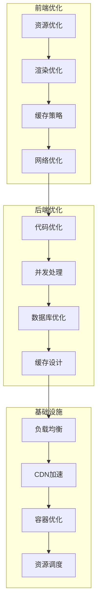

# AI智能营养餐厅系统 - 性能优化体系文档

> **文档版本**: 1.0.0  
> **创建日期**: 2025-07-12  
> **更新日期**: 2025-07-12  
> **文档状态**: ✅ 性能优化就绪  
> **目标受众**: 开发团队、架构师、性能工程师、运维团队

## 📋 目录

- [1. 性能优化概述](#1-性能优化概述)
- [2. 前端性能优化](#2-前端性能优化)
- [3. 后端性能优化](#3-后端性能优化)
- [4. 数据库性能优化](#4-数据库性能优化)
- [5. 缓存策略](#5-缓存策略)
- [6. 网络优化](#6-网络优化)
- [7. AI服务优化](#7-ai服务优化)
- [8. 性能监控](#8-性能监控)
- [9. 性能测试](#9-性能测试)
- [10. 优化最佳实践](#10-优化最佳实践)

---

## 1. 性能优化概述

### 1.1 性能目标

```yaml
性能指标体系:
  响应时间目标:
    API接口:
      P50: "< 100ms"
      P90: "< 200ms"
      P99: "< 500ms"
      
    页面加载:
      首屏时间: "< 1.5s"
      完全加载: "< 3s"
      交互就绪: "< 2s"
      
    移动端:
      冷启动: "< 2s"
      热启动: "< 500ms"
      页面切换: "< 300ms"
      
  吞吐量目标:
    并发用户: "10,000+"
    每秒请求: "5,000+ RPS"
    数据库QPS: "20,000+"
    
  资源使用目标:
    CPU使用率: "< 70%"
    内存使用率: "< 80%"
    响应时间稳定性: "< 10%波动"
```

### 1.2 优化原则

```yaml
核心优化原则:
  数据驱动:
    - 基于监控数据分析瓶颈
    - 量化优化效果
    - 持续跟踪性能趋势
    
  渐进式优化:
    - 识别主要瓶颈
    - 逐步优化改进
    - 避免过度优化
    
  全栈优化:
    - 前端到后端
    - 应用到基础设施
    - 代码到架构
    
  用户体验优先:
    - 优先优化用户感知性能
    - 关注关键用户路径
    - 平衡性能与功能
```

### 1.3 性能优化架构



---

## 2. 前端性能优化

### 2.1 Flutter性能优化

```yaml
Flutter优化策略:
  构建优化:
    代码分割:
      - 按功能模块拆分
      - 延迟加载非核心模块
      - 使用deferred as实现
      
    示例: |
      // 延迟加载
      import 'package:app/features/analytics.dart' deferred as analytics;
      
      Future<void> loadAnalytics() async {
        await analytics.loadLibrary();
        analytics.initializeAnalytics();
      }
      
  Widget优化:
    状态管理:
      - 使用const构造函数
      - 合理使用StatelessWidget
      - 避免不必要的rebuild
      
    示例: |
      // 使用const优化
      class OptimizedWidget extends StatelessWidget {
        const OptimizedWidget({Key? key}) : super(key: key);
        
        @override
        Widget build(BuildContext context) {
          return const Text('Static Text');
        }
      }
      
    列表优化:
      - 使用ListView.builder
      - 实现item复用
      - 控制可见区域渲染
      
    示例: |
      ListView.builder(
        itemCount: items.length,
        itemExtent: 100.0, // 固定高度优化
        cacheExtent: 200.0, // 缓存区域
        itemBuilder: (context, index) {
          return ListItem(item: items[index]);
        },
      )
```

### 2.2 图片优化

```yaml
图片加载策略:
  格式选择:
    WebP: "优先使用，体积小"
    JPEG: "照片类图片"
    PNG: "需要透明度的图片"
    SVG: "图标和矢量图"
    
  尺寸优化:
    响应式图片: |
      Image.network(
        imageUrl,
        width: MediaQuery.of(context).size.width,
        height: 200,
        fit: BoxFit.cover,
        loadingBuilder: (context, child, loadingProgress) {
          if (loadingProgress == null) return child;
          return CircularProgressIndicator();
        },
        errorBuilder: (context, error, stackTrace) {
          return Icon(Icons.error);
        },
      )
      
    缩略图策略:
      列表展示: "使用小尺寸缩略图"
      详情页面: "按需加载高清图"
      预加载: "提前加载下一屏图片"
      
  缓存策略:
    内存缓存:
      大小限制: "100MB"
      LRU策略: "最近最少使用"
      
    磁盘缓存:
      大小限制: "500MB"
      过期时间: "7天"
      
    实现示例: |
      CachedNetworkImage(
        imageUrl: url,
        memCacheWidth: 300,
        memCacheHeight: 300,
        maxWidthDiskCache: 600,
        maxHeightDiskCache: 600,
        placeholder: (context, url) => Shimmer.fromColors(
          baseColor: Colors.grey[300]!,
          highlightColor: Colors.grey[100]!,
          child: Container(color: Colors.white),
        ),
      )
```

### 2.3 动画性能

```yaml
动画优化技巧:
  避免重建:
    使用AnimatedBuilder: |
      AnimatedBuilder(
        animation: _controller,
        builder: (context, child) {
          return Transform.rotate(
            angle: _controller.value * 2 * pi,
            child: child,
          );
        },
        child: const ExpensiveWidget(), // child不会重建
      )
      
  使用RepaintBoundary: |
    RepaintBoundary(
      child: CustomPaint(
        painter: ComplexPainter(),
      ),
    )
    
  优化复杂动画:
    分层渲染: "将静态和动态内容分离"
    硬件加速: "使用Transform而非直接修改位置"
    减少阴影: "阴影计算消耗大"
```

### 2.4 启动优化

```yaml
应用启动优化:
  冷启动优化:
    Splash优化:
      - 原生Splash页面
      - 预加载核心资源
      - 延迟初始化非核心模块
      
    初始化顺序: |
      void main() async {
        WidgetsFlutterBinding.ensureInitialized();
        
        // 并行初始化
        await Future.wait([
          _initializeCore(),
          _loadLocalData(),
          _setupNotifications(),
        ]);
        
        runApp(MyApp());
      }
      
  热启动优化:
    状态恢复:
      - 保存应用状态
      - 快速恢复UI
      - 缓存关键数据
      
  首屏优化:
    骨架屏: "显示内容结构"
    渐进式加载: "优先加载可见内容"
    预渲染: "提前渲染下一屏"
```

---

## 3. 后端性能优化

### 3.1 NestJS性能优化

```yaml
应用层优化:
  异步处理:
    事件驱动: |
      @Injectable()
      export class OrderService {
        constructor(
          private eventEmitter: EventEmitter2,
        ) {}
        
        async createOrder(data: CreateOrderDto) {
          const order = await this.saveOrder(data);
          
          // 异步处理非关键任务
          this.eventEmitter.emit('order.created', order);
          
          return order;
        }
      }
      
    队列处理: |
      @Processor('order')
      export class OrderProcessor {
        @Process('send-notification')
        async handleNotification(job: Job) {
          const { orderId } = job.data;
          // 异步发送通知
        }
      }
      
  请求优化:
    压缩中间件: |
      app.use(compression({
        level: 6,
        threshold: 1024,
      }));
      
    请求限流: |
      @UseGuards(RateLimitGuard)
      @RateLimit({ 
        windowMs: 15 * 60 * 1000,
        max: 100 
      })
      @Get('api/orders')
      async getOrders() {}
      
  并发控制:
    连接池管理: |
      // TypeORM配置
      {
        type: 'postgres',
        poolSize: 30,
        extra: {
          max: 30,
          min: 5,
          idleTimeoutMillis: 30000,
          connectionTimeoutMillis: 2000,
        }
      }
```

### 3.2 API优化

```yaml
API性能优化:
  分页优化:
    游标分页: |
      @Get('items')
      async getItems(@Query() query: PaginationDto) {
        const { cursor, limit = 20 } = query;
        
        const queryBuilder = this.itemRepository
          .createQueryBuilder('item')
          .orderBy('item.id', 'ASC')
          .limit(limit + 1);
          
        if (cursor) {
          queryBuilder.where('item.id > :cursor', { cursor });
        }
        
        const items = await queryBuilder.getMany();
        const hasMore = items.length > limit;
        
        return {
          items: items.slice(0, limit),
          nextCursor: hasMore ? items[limit - 1].id : null,
        };
      }
      
  数据聚合:
    GraphQL优化: |
      @Resolver()
      export class UserResolver {
        @ResolveField()
        @UseDataLoader(OrdersDataLoader)
        async orders(@Parent() user: User) {
          return this.ordersLoader.load(user.id);
        }
      }
      
    批量查询: |
      async findUsersByIds(ids: string[]) {
        return this.userRepository
          .createQueryBuilder('user')
          .whereInIds(ids)
          .getMany();
      }
      
  响应优化:
    字段选择: |
      @Get('users/:id')
      async getUser(
        @Param('id') id: string,
        @Query('fields') fields?: string,
      ) {
        const selectedFields = fields?.split(',') || ['id', 'name', 'email'];
        
        return this.userRepository
          .createQueryBuilder('user')
          .select(selectedFields.map(f => `user.${f}`))
          .where('user.id = :id', { id })
          .getOne();
      }
```

### 3.3 微服务优化

```yaml
微服务性能:
  服务间通信:
    gRPC优化:
      - 使用Protocol Buffers
      - 启用压缩
      - 连接复用
      - 流式传输
      
    示例: |
      // gRPC客户端配置
      const client = new OrderServiceClient(
        'localhost:50051',
        grpc.credentials.createInsecure(),
        {
          'grpc.keepalive_time_ms': 30000,
          'grpc.keepalive_timeout_ms': 10000,
          'grpc.keepalive_permit_without_calls': 1,
          'grpc.enable_retries': 1,
          'grpc.max_receive_message_length': 4 * 1024 * 1024,
        }
      );
      
  服务网格:
    Istio配置:
      熔断器: |
        apiVersion: networking.istio.io/v1alpha3
        kind: DestinationRule
        metadata:
          name: order-service
        spec:
          host: order-service
          trafficPolicy:
            connectionPool:
              tcp:
                maxConnections: 100
              http:
                http1MaxPendingRequests: 50
                http2MaxRequests: 100
            outlierDetection:
              consecutiveErrors: 5
              interval: 30s
              baseEjectionTime: 30s
```

---

## 4. 数据库性能优化

### 4.1 查询优化

```yaml
SQL优化技巧:
  索引策略:
    复合索引: |
      -- 基于查询模式创建复合索引
      CREATE INDEX idx_orders_user_status_created 
      ON orders(user_id, status, created_at DESC);
      
      -- 覆盖索引减少回表
      CREATE INDEX idx_orders_covering 
      ON orders(user_id, status) 
      INCLUDE (total_amount, created_at);
      
    部分索引: |
      -- 只索引活跃数据
      CREATE INDEX idx_active_orders 
      ON orders(created_at DESC) 
      WHERE status IN ('pending', 'processing');
      
    表达式索引: |
      -- 函数索引
      CREATE INDEX idx_users_email_lower 
      ON users(LOWER(email));
      
  查询重写:
    避免N+1: |
      -- 使用JOIN代替多次查询
      SELECT u.*, array_agg(o.*) as orders
      FROM users u
      LEFT JOIN orders o ON u.id = o.user_id
      WHERE u.created_at > NOW() - INTERVAL '7 days'
      GROUP BY u.id;
      
    使用CTE: |
      WITH recent_orders AS (
        SELECT user_id, COUNT(*) as order_count, SUM(total_amount) as total_spent
        FROM orders
        WHERE created_at > NOW() - INTERVAL '30 days'
        GROUP BY user_id
      )
      SELECT u.*, ro.order_count, ro.total_spent
      FROM users u
      LEFT JOIN recent_orders ro ON u.id = ro.user_id;
```

### 4.2 pgvector优化

```yaml
向量搜索优化:
  索引选择:
    IVFFlat配置: |
      -- 创建IVFFlat索引
      CREATE INDEX ON nutrition_vectors 
      USING ivfflat (embedding vector_l2_ops)
      WITH (lists = 100);
      
      -- 设置搜索参数
      SET ivfflat.probes = 10;
      
    HNSW配置: |
      -- 创建HNSW索引（更快但占用更多空间）
      CREATE INDEX ON nutrition_vectors 
      USING hnsw (embedding vector_l2_ops)
      WITH (m = 16, ef_construction = 64);
      
      -- 设置搜索参数
      SET hnsw.ef_search = 40;
      
  查询优化:
    预过滤: |
      -- 先过滤再搜索
      WITH filtered AS (
        SELECT * FROM nutrition_items
        WHERE category = 'vegetables'
        AND calories < 100
      )
      SELECT *, embedding <-> query_vector AS distance
      FROM filtered
      ORDER BY distance
      LIMIT 10;
      
    分批处理: |
      -- 大规模向量搜索分批
      CREATE OR REPLACE FUNCTION batch_vector_search(
        query_vec vector,
        batch_size int DEFAULT 1000
      ) RETURNS TABLE(id uuid, distance float) AS $$
      DECLARE
        offset_val int := 0;
      BEGIN
        LOOP
          RETURN QUERY
          SELECT t.id, t.embedding <-> query_vec AS dist
          FROM nutrition_vectors t
          ORDER BY dist
          LIMIT batch_size
          OFFSET offset_val;
          
          offset_val := offset_val + batch_size;
          EXIT WHEN NOT FOUND;
        END LOOP;
      END;
      $$ LANGUAGE plpgsql;
```

### 4.3 连接池优化

```yaml
连接池配置:
  PgBouncer优化:
    配置文件: |
      [databases]
      nutrition_db = host=localhost port=5432 dbname=nutrition
      
      [pgbouncer]
      listen_port = 6432
      listen_addr = *
      auth_type = md5
      pool_mode = transaction
      max_client_conn = 1000
      default_pool_size = 25
      reserve_pool_size = 5
      server_lifetime = 3600
      server_idle_timeout = 600
      
  应用层配置:
    TypeORM连接池: |
      {
        type: 'postgres',
        host: 'pgbouncer',
        port: 6432,
        poolSize: 50,
        extra: {
          max: 50,
          min: 10,
          idleTimeoutMillis: 30000,
          connectionTimeoutMillis: 2000,
          statement_timeout: 30000,
        }
      }
```

---

## 5. 缓存策略

### 5.1 多级缓存架构

```yaml
缓存层次设计:
  L1 - 应用内存缓存:
    实现: "Node.js内存缓存"
    容量: "100MB"
    TTL: "5分钟"
    用途: "热点数据"
    
    示例: |
      @Injectable()
      export class MemoryCacheService {
        private cache = new LRUCache<string, any>({
          max: 1000,
          ttl: 5 * 60 * 1000,
          updateAgeOnGet: true,
        });
        
        async get<T>(key: string, factory: () => Promise<T>): Promise<T> {
          const cached = this.cache.get(key);
          if (cached) return cached;
          
          const value = await factory();
          this.cache.set(key, value);
          return value;
        }
      }
      
  L2 - Redis缓存:
    实现: "Redis集群"
    容量: "32GB"
    TTL: "1小时"
    用途: "共享缓存"
    
    示例: |
      @Injectable()
      export class RedisCacheService {
        async getWithCache<T>(
          key: string,
          factory: () => Promise<T>,
          ttl = 3600,
        ): Promise<T> {
          const cached = await this.redis.get(key);
          if (cached) {
            return JSON.parse(cached);
          }
          
          const value = await factory();
          await this.redis.setex(key, ttl, JSON.stringify(value));
          return value;
        }
      }
      
  L3 - CDN缓存:
    实现: "阿里云CDN"
    节点: "全国200+节点"
    TTL: "24小时"
    用途: "静态资源"
```

### 5.2 缓存策略

```yaml
缓存更新策略:
  Cache-Aside模式:
    读取流程:
      1. 查询缓存
      2. 缓存未命中，查询数据库
      3. 更新缓存
      4. 返回数据
      
    更新流程:
      1. 更新数据库
      2. 删除缓存
      
    示例: |
      async getUserById(id: string) {
        const cacheKey = `user:${id}`;
        
        // 尝试从缓存读取
        const cached = await this.cache.get(cacheKey);
        if (cached) return cached;
        
        // 从数据库读取
        const user = await this.userRepo.findOne(id);
        if (user) {
          await this.cache.set(cacheKey, user, 3600);
        }
        
        return user;
      }
      
      async updateUser(id: string, data: UpdateUserDto) {
        // 更新数据库
        await this.userRepo.update(id, data);
        
        // 删除缓存
        await this.cache.del(`user:${id}`);
      }
      
  预热策略:
    启动预热: |
      @Injectable()
      export class CacheWarmupService {
        async warmupCache() {
          // 预热热门菜品
          const hotDishes = await this.dishRepo.find({
            where: { isHot: true },
            take: 100,
          });
          
          await Promise.all(
            hotDishes.map(dish => 
              this.cache.set(`dish:${dish.id}`, dish, 3600)
            )
          );
          
          // 预热营养数据
          const nutritionData = await this.nutritionRepo.find({
            where: { isCommon: true },
          });
          
          await this.cache.set('nutrition:common', nutritionData, 7200);
        }
      }
```

### 5.3 缓存监控

```yaml
缓存指标监控:
  命中率监控:
    Redis监控: |
      // 监控缓存命中率
      const stats = await redis.info('stats');
      const hitRate = stats.keyspace_hits / 
        (stats.keyspace_hits + stats.keyspace_misses);
      
      if (hitRate < 0.8) {
        logger.warn('Cache hit rate is low', { hitRate });
      }
      
  内存监控:
    内存使用: |
      // 监控Redis内存
      const info = await redis.info('memory');
      const usedMemory = parseInt(info.used_memory);
      const maxMemory = parseInt(info.maxmemory);
      
      if (usedMemory / maxMemory > 0.9) {
        logger.warn('Redis memory usage is high', {
          used: usedMemory,
          max: maxMemory,
        });
      }
      
  性能监控:
    响应时间: |
      // 监控缓存响应时间
      @Injectable()
      export class CacheMetricsInterceptor implements NestInterceptor {
        intercept(context: ExecutionContext, next: CallHandler) {
          const start = Date.now();
          
          return next.handle().pipe(
            tap(() => {
              const duration = Date.now() - start;
              this.metrics.recordCacheLatency(duration);
            }),
          );
        }
      }
```

---

## 6. 网络优化

### 6.1 CDN优化

```yaml
CDN配置策略:
  静态资源:
    图片优化:
      - WebP自动转换
      - 响应式图片
      - 懒加载
      - 渐进式加载
      
    配置示例: |
      // CDN配置
      {
        "domain": "cdn.nutrition.com",
        "origins": ["origin.nutrition.com"],
        "cacheRules": [
          {
            "path": "/images/*",
            "ttl": 2592000, // 30天
            "queryStringBehavior": "ignore"
          },
          {
            "path": "/api/*",
            "ttl": 0, // 不缓存API
            "queryStringBehavior": "forward"
          }
        ],
        "optimization": {
          "imageOptimization": true,
          "webp": true,
          "compression": "gzip,br"
        }
      }
      
  动态加速:
    全站加速: |
      // 动态内容加速配置
      {
        "accelerationType": "dsa",
        "routes": [
          {
            "path": "/api/nutrition/*",
            "origin": "api.nutrition.com",
            "protocol": "https",
            "timeout": 30
          }
        ],
        "optimization": {
          "tcpOptimization": true,
          "connectionReuse": true,
          "intelligentRouting": true
        }
      }
```

### 6.2 HTTP/2优化

```yaml
HTTP/2配置:
  服务器推送:
    Nginx配置: |
      server {
        listen 443 ssl http2;
        
        # 预推送关键资源
        location / {
          add_header Link "</css/app.css>; rel=preload; as=style" always;
          add_header Link "</js/app.js>; rel=preload; as=script" always;
          http2_push /css/app.css;
          http2_push /js/app.js;
        }
      }
      
  多路复用优化:
    连接配置: |
      # 增加并发流数量
      http2_max_concurrent_streams 256;
      http2_max_requests 1000;
      
      # 优化缓冲区
      http2_chunk_size 8k;
      http2_buffer_size 32k;
```

### 6.3 API网关优化

```yaml
Kong网关优化:
  限流配置:
    插件配置: |
      plugins:
        - name: rate-limiting
          config:
            minute: 60
            hour: 1000
            policy: redis
            redis_host: redis.internal
            
        - name: request-size-limiting
          config:
            allowed_payload_size: 10
            
  缓存插件:
    配置: |
      plugins:
        - name: proxy-cache
          config:
            strategy: memory
            memory:
              dictionary_name: nutrition_cache
            request_method:
              - GET
            response_code:
              - 200
            content_type:
              - "application/json"
            cache_ttl: 300
            
  压缩配置:
    响应压缩: |
      plugins:
        - name: response-transformer
          config:
            add:
              headers:
                - "Content-Encoding: gzip"
            remove:
              headers:
                - "Content-Length"
```

---

## 7. AI服务优化

### 7.1 DeepSeek API优化

```yaml
API调用优化:
  批量处理:
    批量嵌入: |
      async function batchEmbedding(texts: string[]) {
        const batchSize = 100;
        const results = [];
        
        for (let i = 0; i < texts.length; i += batchSize) {
          const batch = texts.slice(i, i + batchSize);
          const embeddings = await deepseek.embeddings.create({
            model: 'deepseek-embedding',
            input: batch,
          });
          results.push(...embeddings.data);
        }
        
        return results;
      }
      
  缓存策略:
    嵌入缓存: |
      @Injectable()
      export class EmbeddingCacheService {
        private cache = new Map<string, number[]>();
        
        async getEmbedding(text: string): Promise<number[]> {
          const hash = crypto.createHash('md5').update(text).digest('hex');
          
          // 检查缓存
          if (this.cache.has(hash)) {
            return this.cache.get(hash);
          }
          
          // 检查Redis
          const cached = await this.redis.get(`embedding:${hash}`);
          if (cached) {
            const embedding = JSON.parse(cached);
            this.cache.set(hash, embedding);
            return embedding;
          }
          
          // 调用API
          const response = await this.deepseek.embeddings.create({
            model: 'deepseek-embedding',
            input: text,
          });
          
          const embedding = response.data[0].embedding;
          
          // 存储到缓存
          this.cache.set(hash, embedding);
          await this.redis.setex(
            `embedding:${hash}`,
            86400,
            JSON.stringify(embedding)
          );
          
          return embedding;
        }
      }
```

### 7.2 模型推理优化

```yaml
推理优化策略:
  模型量化:
    INT8量化: "减少模型大小，提升推理速度"
    动态量化: "运行时量化"
    
  批处理优化:
    动态批处理: |
      class BatchProcessor {
        private queue: Array<{
          input: string;
          resolve: (result: any) => void;
        }> = [];
        
        private processTimer: NodeJS.Timeout;
        
        add(input: string): Promise<any> {
          return new Promise((resolve) => {
            this.queue.push({ input, resolve });
            
            if (this.queue.length >= 10) {
              this.processBatch();
            } else {
              this.scheduleProcess();
            }
          });
        }
        
        private scheduleProcess() {
          if (this.processTimer) return;
          
          this.processTimer = setTimeout(() => {
            this.processBatch();
          }, 100);
        }
        
        private async processBatch() {
          if (this.queue.length === 0) return;
          
          const batch = this.queue.splice(0, 10);
          const inputs = batch.map(item => item.input);
          
          const results = await this.model.predict(inputs);
          
          batch.forEach((item, index) => {
            item.resolve(results[index]);
          });
          
          clearTimeout(this.processTimer);
          this.processTimer = null;
        }
      }
```

### 7.3 向量搜索优化

```yaml
向量检索优化:
  分片策略:
    数据分片: |
      -- 按类别分片
      CREATE TABLE nutrition_vectors_vegetables 
      PARTITION OF nutrition_vectors
      FOR VALUES IN ('vegetables');
      
      CREATE TABLE nutrition_vectors_fruits
      PARTITION OF nutrition_vectors
      FOR VALUES IN ('fruits');
      
  并行搜索:
    多表并行: |
      async function parallelVectorSearch(
        queryVector: number[],
        categories: string[]
      ) {
        const searches = categories.map(category =>
          this.searchInCategory(queryVector, category)
        );
        
        const results = await Promise.all(searches);
        
        // 合并并排序结果
        return results
          .flat()
          .sort((a, b) => a.distance - b.distance)
          .slice(0, 10);
      }
      
  预计算优化:
    常用查询缓存: |
      // 预计算常见查询的结果
      @Cron('0 0 * * *')
      async precomputeCommonQueries() {
        const commonQueries = [
          '低卡路里',
          '高蛋白',
          '素食',
          '无糖',
        ];
        
        for (const query of commonQueries) {
          const embedding = await this.getEmbedding(query);
          const results = await this.vectorSearch(embedding);
          
          await this.redis.setex(
            `search:${query}`,
            86400,
            JSON.stringify(results)
          );
        }
      }
```

---

## 8. 性能监控

### 8.1 应用性能监控 (APM)

```yaml
APM配置:
  工具选择:
    Elastic APM:
      配置: |
        const apm = require('elastic-apm-node').start({
          serviceName: 'nutrition-api',
          secretToken: process.env.APM_TOKEN,
          serverUrl: process.env.APM_SERVER_URL,
          environment: process.env.NODE_ENV,
          transactionSampleRate: 0.1,
          captureBody: 'all',
          captureHeaders: true,
        });
        
  自定义监控:
    业务指标: |
      @Injectable()
      export class MetricsService {
        private prometheus = new PrometheusClient();
        
        // 定义指标
        private orderProcessingTime = new this.prometheus.Histogram({
          name: 'order_processing_duration_seconds',
          help: 'Order processing duration in seconds',
          labelNames: ['status', 'payment_method'],
          buckets: [0.1, 0.5, 1, 2, 5, 10],
        });
        
        async recordOrderProcessing(
          duration: number,
          status: string,
          paymentMethod: string
        ) {
          this.orderProcessingTime
            .labels(status, paymentMethod)
            .observe(duration);
        }
      }
```

### 8.2 实时监控大屏

```yaml
监控大屏配置:
  关键指标展示:
    实时数据:
      - 当前在线用户数
      - 每秒请求数 (RPS)
      - API响应时间
      - 错误率
      - 数据库连接数
      
    业务指标:
      - 实时订单数
      - 支付成功率
      - AI推荐命中率
      - 营养师咨询量
      
  Grafana配置:
    仪表板: |
      {
        "dashboard": {
          "title": "营养餐厅实时监控",
          "panels": [
            {
              "title": "API响应时间",
              "targets": [{
                "expr": "histogram_quantile(0.95, api_response_time)"
              }]
            },
            {
              "title": "订单处理速率",
              "targets": [{
                "expr": "rate(orders_created_total[5m])"
              }]
            }
          ]
        }
      }
```

### 8.3 性能报告

```yaml
自动化报告:
  日报生成:
    内容包含:
      - 性能趋势分析
      - 慢查询TOP10
      - 资源使用情况
      - 异常事件汇总
      
    生成脚本: |
      @Cron('0 9 * * *')
      async generateDailyReport() {
        const yesterday = new Date();
        yesterday.setDate(yesterday.getDate() - 1);
        
        const report = {
          date: yesterday,
          performance: await this.getPerformanceMetrics(yesterday),
          slowQueries: await this.getSlowQueries(yesterday),
          errors: await this.getErrorSummary(yesterday),
          recommendations: await this.generateRecommendations(),
        };
        
        await this.emailService.sendReport(report);
      }
```

---

## 9. 性能测试

### 9.1 压力测试

```yaml
压测方案:
  工具配置:
    K6脚本: |
      import http from 'k6/http';
      import { check, sleep } from 'k6';
      
      export let options = {
        stages: [
          { duration: '2m', target: 100 },  // 预热
          { duration: '5m', target: 500 },  // 正常负载
          { duration: '2m', target: 1000 }, // 压力测试
          { duration: '5m', target: 1000 }, // 持续高负载
          { duration: '2m', target: 0 },    // 恢复
        ],
        thresholds: {
          http_req_duration: ['p(95)<500'], // 95%请求小于500ms
          http_req_failed: ['rate<0.01'],   // 错误率小于1%
        },
      };
      
      export default function() {
        // 用户登录
        let loginRes = http.post(`${__ENV.BASE_URL}/api/auth/login`, {
          username: 'test@example.com',
          password: 'password',
        });
        
        check(loginRes, {
          'login successful': (r) => r.status === 200,
        });
        
        let token = loginRes.json('token');
        
        // 获取推荐
        let params = {
          headers: { 'Authorization': `Bearer ${token}` },
        };
        
        let recommendRes = http.get(
          `${__ENV.BASE_URL}/api/nutrition/recommendations`,
          params
        );
        
        check(recommendRes, {
          'recommendations loaded': (r) => r.status === 200,
          'response time OK': (r) => r.timings.duration < 500,
        });
        
        sleep(1);
      }
      
  场景测试:
    高峰期模拟: |
      export let options = {
        scenarios: {
          breakfast_rush: {
            executor: 'ramping-vus',
            startVUs: 0,
            stages: [
              { duration: '10m', target: 2000 },
              { duration: '30m', target: 2000 },
              { duration: '10m', target: 0 },
            ],
            startTime: '0s',
          },
          lunch_rush: {
            executor: 'ramping-vus',
            startVUs: 0,
            stages: [
              { duration: '10m', target: 3000 },
              { duration: '1h', target: 3000 },
              { duration: '10m', target: 0 },
            ],
            startTime: '3h',
          },
        },
      };
```

### 9.2 性能基准测试

```yaml
基准测试计划:
  API性能基准:
    测试用例: |
      describe('API Performance Benchmarks', () => {
        it('should handle user login within 100ms', async () => {
          const start = Date.now();
          const response = await request(app)
            .post('/api/auth/login')
            .send({
              username: 'test@example.com',
              password: 'password',
            });
          const duration = Date.now() - start;
          
          expect(response.status).toBe(200);
          expect(duration).toBeLessThan(100);
        });
        
        it('should return recommendations within 200ms', async () => {
          const start = Date.now();
          const response = await request(app)
            .get('/api/nutrition/recommendations')
            .set('Authorization', `Bearer ${token}`);
          const duration = Date.now() - start;
          
          expect(response.status).toBe(200);
          expect(duration).toBeLessThan(200);
        });
      });
      
  数据库基准:
    查询性能: |
      -- 测试复杂查询性能
      EXPLAIN (ANALYZE, BUFFERS) 
      SELECT 
        u.id,
        u.name,
        COUNT(o.id) as order_count,
        SUM(o.total_amount) as total_spent,
        AVG(nr.calories) as avg_calories
      FROM users u
      LEFT JOIN orders o ON u.id = o.user_id
      LEFT JOIN order_items oi ON o.id = oi.order_id
      LEFT JOIN nutrition_records nr ON oi.dish_id = nr.dish_id
      WHERE u.created_at > NOW() - INTERVAL '30 days'
      GROUP BY u.id, u.name
      ORDER BY total_spent DESC
      LIMIT 100;
```

### 9.3 持续性能测试

```yaml
CI/CD集成:
  性能门禁:
    Jenkins配置: |
      pipeline {
        stages {
          stage('Performance Test') {
            steps {
              script {
                sh 'k6 run --out json=results.json performance-test.js'
                
                def results = readJSON file: 'results.json'
                
                if (results.metrics.http_req_duration.p95 > 500) {
                  error("Performance regression detected: P95 > 500ms")
                }
                
                if (results.metrics.http_req_failed.rate > 0.01) {
                  error("High error rate detected: > 1%")
                }
              }
            }
          }
        }
      }
      
  自动化报告:
    趋势分析: |
      @Cron('0 0 * * 0')
      async weeklyPerformanceTrend() {
        const trends = await this.performanceRepo
          .createQueryBuilder('p')
          .select('DATE(p.timestamp)', 'date')
          .addSelect('AVG(p.response_time)', 'avg_response_time')
          .addSelect('MAX(p.response_time)', 'max_response_time')
          .addSelect('COUNT(*)', 'request_count')
          .where('p.timestamp > :start', {
            start: new Date(Date.now() - 7 * 24 * 60 * 60 * 1000)
          })
          .groupBy('DATE(p.timestamp)')
          .getRawMany();
          
        await this.reportService.generateTrendReport(trends);
      }
```

---

## 10. 优化最佳实践

### 10.1 代码级优化

```yaml
编码规范:
  避免常见陷阱:
    内存泄漏预防: |
      // 避免闭包陷阱
      class EventManager {
        private listeners = new Map();
        
        addEventListener(event: string, callback: Function) {
          const wrappedCallback = (...args) => {
            try {
              callback(...args);
            } catch (error) {
              this.handleError(error);
            }
          };
          
          this.listeners.set(event, wrappedCallback);
          
          // 返回清理函数
          return () => {
            this.listeners.delete(event);
          };
        }
      }
      
    异步优化: |
      // 并行处理独立任务
      async function processOrder(orderData: OrderDto) {
        const [
          inventory,
          userProfile,
          nutritionData,
        ] = await Promise.all([
          this.checkInventory(orderData.items),
          this.getUserProfile(orderData.userId),
          this.calculateNutrition(orderData.items),
        ]);
        
        return this.createOrder({
          ...orderData,
          inventory,
          userProfile,
          nutritionData,
        });
      }
```

### 10.2 架构级优化

```yaml
架构优化原则:
  服务拆分:
    垂直拆分:
      - 用户服务
      - 订单服务
      - 营养服务
      - 支付服务
      
    水平拆分:
      - 读写分离
      - 数据分片
      - 功能分层
      
  异步解耦:
    事件驱动: |
      // 订单创建事件处理
      @EventPattern('order.created')
      async handleOrderCreated(order: Order) {
        // 异步处理非关键任务
        await Promise.all([
          this.notificationService.sendOrderConfirmation(order),
          this.analyticsService.trackOrder(order),
          this.inventoryService.updateStock(order),
        ]);
      }
```

### 10.3 运维级优化

```yaml
运维优化策略:
  资源调度:
    自动扩缩容: |
      apiVersion: autoscaling/v2
      kind: HorizontalPodAutoscaler
      metadata:
        name: nutrition-api-hpa
      spec:
        scaleTargetRef:
          apiVersion: apps/v1
          kind: Deployment
          name: nutrition-api
        minReplicas: 3
        maxReplicas: 20
        metrics:
        - type: Resource
          resource:
            name: cpu
            target:
              type: Utilization
              averageUtilization: 70
        - type: Resource
          resource:
            name: memory
            target:
              type: Utilization
              averageUtilization: 80
        behavior:
          scaleUp:
            stabilizationWindowSeconds: 60
            policies:
            - type: Percent
              value: 100
              periodSeconds: 60
          scaleDown:
            stabilizationWindowSeconds: 300
            policies:
            - type: Percent
              value: 10
              periodSeconds: 60
              
  容器优化:
    镜像优化: |
      # 多阶段构建
      FROM node:18-alpine AS builder
      WORKDIR /app
      COPY package*.json ./
      RUN npm ci --only=production
      
      FROM node:18-alpine
      WORKDIR /app
      COPY --from=builder /app/node_modules ./node_modules
      COPY . .
      
      # 优化Node.js运行参数
      ENV NODE_OPTIONS="--max-old-space-size=2048"
      
      CMD ["node", "dist/main.js"]
```

---

## 附录

### A. 性能优化检查清单

```yaml
优化检查项:
  前端优化:
    ✓ 代码分割和懒加载
    ✓ 图片格式和尺寸优化
    ✓ 资源预加载和预连接
    ✓ Service Worker缓存
    ✓ 虚拟滚动实现
    
  后端优化:
    ✓ 数据库索引优化
    ✓ 查询优化和N+1问题
    ✓ 连接池配置
    ✓ 缓存策略实施
    ✓ 异步处理和队列
    
  基础设施:
    ✓ CDN配置
    ✓ 负载均衡
    ✓ 自动扩缩容
    ✓ 监控告警
    ✓ 容量规划
```

### B. 性能优化工具

```yaml
推荐工具集:
  前端工具:
    - Chrome DevTools
    - Lighthouse
    - WebPageTest
    - Flutter DevTools
    
  后端工具:
    - Apache Bench (ab)
    - K6
    - JMeter
    - Artillery
    
  数据库工具:
    - pgBadger
    - pg_stat_statements
    - EXPLAIN ANALYZE
    - pgbench
    
  监控工具:
    - Prometheus + Grafana
    - Elastic APM
    - New Relic
    - DataDog
```

### C. 性能基准参考

```yaml
行业基准:
  响应时间:
    优秀: < 100ms
    良好: 100-300ms
    一般: 300-1000ms
    差: > 1000ms
    
  页面加载:
    优秀: < 1s
    良好: 1-3s
    一般: 3-5s
    差: > 5s
    
  可用性:
    优秀: > 99.99%
    良好: > 99.9%
    一般: > 99%
    差: < 99%
```

---

**文档维护**: 性能优化团队  
**审核人**: 技术架构师  
**下次更新**: 2025-08-12