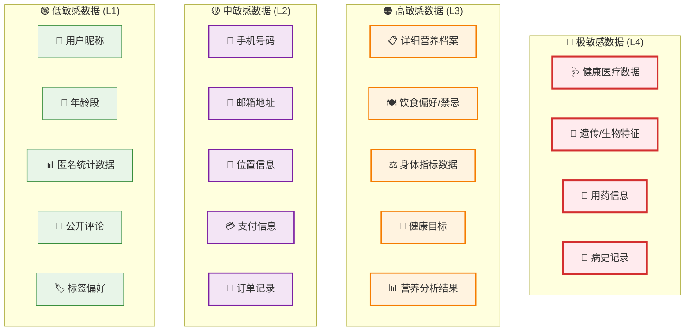
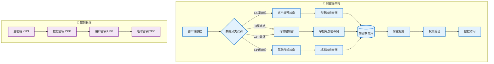
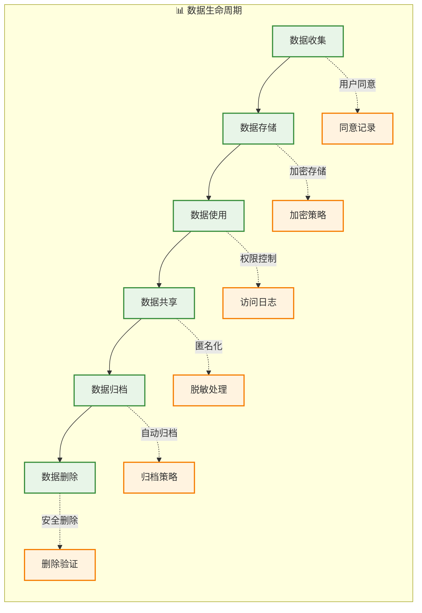

# 数据隐私合规设计方案

## 📋 概述

本文档定义AI智能营养餐厅系统V3的数据隐私保护策略，确保符合GDPR、《个人信息保护法》等法律法规要求。

**版本**: v2.0  
**生效日期**: 2025年1月  
**合规标准**: GDPR + 中国《个人信息保护法》  
**法律依据**: 
- GDPR第6条（处理的合法性）
- GDPR第7条（同意的条件）
- GDPR第9条（特殊类别个人数据的处理）
- 《个人信息保护法》第13条（处理个人信息的合法性基础）
- 《个人信息保护法》第28条（敏感个人信息的处理）

---

## 🔐 数据分类和保护级别

### 数据敏感度分级



### 保护策略矩阵

| 敏感级别 | 加密要求 | 访问控制 | 存储期限 | 匿名化 | 审计日志 |
|----------|----------|----------|----------|---------|----------|
| **L4-极敏感** | AES-256 + 字段级加密 | 医师级权限 | 用户主动删除 | 必须 | 完整记录 |
| **L3-高敏感** | AES-256 | 营养师+用户权限 | 5年或用户删除 | 建议 | 完整记录 |
| **L2-中敏感** | AES-128 | 业务相关权限 | 3年或用户删除 | 可选 | 关键操作 |
| **L1-低敏感** | 传输加密 | 基础权限控制 | 7年或业务需要 | 不需要 | 汇总记录 |

---

## 🏗️ 技术实现架构

### 数据加密架构



### 数据库字段加密设计

```sql
-- 用户营养档案表 (高敏感数据)
CREATE TABLE nutrition_profiles (
    id UUID PRIMARY KEY,
    user_id UUID NOT NULL,
    
    -- 加密字段
    height_encrypted BYTEA,              -- 身高 (AES-256)
    weight_encrypted BYTEA,              -- 体重 (AES-256)
    medical_conditions_encrypted BYTEA,  -- 疾病史 (AES-256)
    allergies_encrypted BYTEA,           -- 过敏信息 (AES-256)
    medications_encrypted BYTEA,         -- 用药信息 (AES-256)
    
    -- 哈希字段（用于查询）
    height_hash VARCHAR(64),             -- SHA-256哈希
    weight_range_hash VARCHAR(64),       -- 体重范围哈希
    
    -- 元数据
    encryption_key_id VARCHAR(50),       -- 密钥ID
    encryption_version INTEGER,         -- 加密版本
    created_at TIMESTAMP DEFAULT NOW(),
    updated_at TIMESTAMP DEFAULT NOW(),
    
    CONSTRAINT fk_user FOREIGN KEY (user_id) REFERENCES users(id)
);

-- 用户基础信息表 (中敏感数据)
CREATE TABLE users (
    id UUID PRIMARY KEY,
    
    -- 加密字段
    phone_encrypted BYTEA,              -- 手机号 (AES-128)
    email_encrypted BYTEA,              -- 邮箱 (AES-128)
    
    -- 哈希字段
    phone_hash VARCHAR(64) UNIQUE,      -- 手机号哈希（用于查询）
    email_hash VARCHAR(64) UNIQUE,      -- 邮箱哈希（用于查询）
    
    -- 明文字段
    nickname VARCHAR(50),               -- 昵称
    avatar_url VARCHAR(255),            -- 头像
    age_group INTEGER,                  -- 年龄段 (不存储具体年龄)
    gender INTEGER,                     -- 性别
    
    -- 隐私控制
    privacy_level INTEGER DEFAULT 2,    -- 隐私级别 1-5
    data_sharing_consent BOOLEAN DEFAULT FALSE,  -- 数据共享同意
    analytics_consent BOOLEAN DEFAULT FALSE,     -- 分析使用同意
    
    -- 元数据
    encryption_key_id VARCHAR(50),
    encryption_version INTEGER,
    created_at TIMESTAMP DEFAULT NOW(),
    updated_at TIMESTAMP DEFAULT NOW(),
    last_login_at TIMESTAMP,
    deleted_at TIMESTAMP                 -- 软删除
);
```

### 权限控制模型

```typescript
// 数据访问权限枚举
enum DataAccessLevel {
  PUBLIC = 'public',           // 公开数据
  USER_ONLY = 'user_only',     // 仅用户本人
  NUTRITIONIST = 'nutritionist', // 营养师可访问
  MEDICAL = 'medical',         // 医疗级权限
  ADMIN = 'admin',            // 管理员
  SYSTEM = 'system'           // 系统级访问
}

// 字段级权限配置
interface FieldPermission {
  field: string;
  readRoles: DataAccessLevel[];
  writeRoles: DataAccessLevel[];
  encryptionLevel: 'none' | 'basic' | 'advanced' | 'medical';
  anonymizationRequired: boolean;
}

// 营养档案字段权限配置
const nutritionProfilePermissions: FieldPermission[] = [
  {
    field: 'height',
    readRoles: [DataAccessLevel.USER_ONLY, DataAccessLevel.NUTRITIONIST],
    writeRoles: [DataAccessLevel.USER_ONLY],
    encryptionLevel: 'advanced',
    anonymizationRequired: true
  },
  {
    field: 'medicalConditions',
    readRoles: [DataAccessLevel.USER_ONLY, DataAccessLevel.MEDICAL],
    writeRoles: [DataAccessLevel.USER_ONLY, DataAccessLevel.MEDICAL],
    encryptionLevel: 'medical',
    anonymizationRequired: true
  },
  {
    field: 'dietaryPreferences',
    readRoles: [DataAccessLevel.USER_ONLY, DataAccessLevel.NUTRITIONIST],
    writeRoles: [DataAccessLevel.USER_ONLY],
    encryptionLevel: 'basic',
    anonymizationRequired: false
  }
];
```

---

## 🛡️ 实施标准和流程

### 开发阶段安全检查清单

#### ✅ **设计阶段**
- [ ] 完成数据分类和敏感度评估
- [ ] 设计字段级加密方案
- [ ] 定义访问权限矩阵
- [ ] 制定密钥管理策略
- [ ] 设计匿名化算法

#### ✅ **开发阶段**
- [ ] 实现加密/解密服务
- [ ] 实现权限控制中间件
- [ ] 实现审计日志记录
- [ ] 实现数据脱敏功能
- [ ] 实现用户同意管理

#### ✅ **测试阶段**
- [ ] 加密性能测试
- [ ] 权限控制功能测试
- [ ] 数据泄漏风险测试
- [ ] 密钥轮换测试
- [ ] 灾难恢复测试

### 数据生命周期管理



### 用户权利保障机制

| 用户权利 | 实现方式 | 响应时限 | 技术实现 | 法律依据 |
|----------|----------|----------|----------|----------|
| **知情权** | 隐私声明 + 数据使用说明 | 实时 | 前端透明展示 | GDPR第13-14条 |
| **同意权** | 分级同意机制 | 实时 | 同意状态管理 | GDPR第7条 |
| **访问权** | 数据导出功能 | 30天内 | API + 数据格式化 | GDPR第15条 |
| **更正权** | 自助修改功能 | 实时 | 版本控制 + 审计 | GDPR第16条 |
| **删除权** | 账户注销功能 | 30天内 | 软删除 + 物理删除 | GDPR第17条 |
| **限制权** | 隐私设置控制 | 实时 | 权限动态调整 | GDPR第18条 |
| **携带权** | 标准格式导出 | 30天内 | JSON/CSV导出 | GDPR第20条 |
| **反对权** | 退出分析/营销 | 实时 | 同意状态管理 | GDPR第21条 |

---

## 🔧 技术实现代码示例

### 数据加密服务

```typescript
// 加密服务接口
interface IEncryptionService {
  encrypt(data: string, level: EncryptionLevel): Promise<EncryptedData>;
  decrypt(encryptedData: EncryptedData, keyId: string): Promise<string>;
  generateHash(data: string): string;
  rotateKey(keyId: string): Promise<string>;
}

// 加密数据结构
interface EncryptedData {
  encryptedValue: string;    // Base64编码的加密数据
  keyId: string;            // 密钥ID
  algorithm: string;        // 加密算法
  version: number;          // 加密版本
  checksum: string;         // 数据完整性校验
}

// 实现示例
@Injectable()
export class EncryptionService implements IEncryptionService {
  private readonly kms: KeyManagementService;
  
  async encrypt(data: string, level: EncryptionLevel): Promise<EncryptedData> {
    const key = await this.kms.getEncryptionKey(level);
    const algorithm = this.getAlgorithmByLevel(level);
    
    const cipher = crypto.createCipher(algorithm, key.value);
    let encrypted = cipher.update(data, 'utf8', 'base64');
    encrypted += cipher.final('base64');
    
    return {
      encryptedValue: encrypted,
      keyId: key.id,
      algorithm,
      version: key.version,
      checksum: this.generateChecksum(data)
    };
  }
  
  private getAlgorithmByLevel(level: EncryptionLevel): string {
    switch (level) {
      case EncryptionLevel.MEDICAL:
        return 'aes-256-gcm';
      case EncryptionLevel.ADVANCED:
        return 'aes-256-cbc';
      case EncryptionLevel.BASIC:
        return 'aes-128-cbc';
      default:
        return 'aes-128-cbc';
    }
  }
}
```

### 权限控制中间件

```typescript
// 数据访问权限装饰器
export function RequireDataAccess(
  resource: string,
  level: DataAccessLevel,
  field?: string
) {
  return function (target: any, propertyName: string, descriptor: PropertyDescriptor) {
    const method = descriptor.value;
    
    descriptor.value = async function (...args: any[]) {
      const user = this.getCurrentUser();
      const hasAccess = await this.permissionService.checkAccess(
        user,
        resource,
        level,
        field
      );
      
      if (!hasAccess) {
        throw new ForbiddenException(`Insufficient permissions for ${resource}.${field}`);
      }
      
      // 记录访问日志
      await this.auditService.logDataAccess({
        userId: user.id,
        resource,
        field,
        action: 'read',
        timestamp: new Date(),
        ipAddress: this.getClientIP()
      });
      
      return method.apply(this, args);
    };
  };
}

// 使用示例
@Controller('nutrition-profiles')
export class NutritionProfileController {
  
  @Get(':id/medical-conditions')
  @RequireDataAccess('nutrition_profile', DataAccessLevel.MEDICAL, 'medicalConditions')
  async getMedicalConditions(@Param('id') profileId: string) {
    return this.nutritionService.getMedicalConditions(profileId);
  }
  
  @Get(':id/basic-info')
  @RequireDataAccess('nutrition_profile', DataAccessLevel.USER_ONLY)
  async getBasicInfo(@Param('id') profileId: string) {
    const data = await this.nutritionService.getBasicInfo(profileId);
    // 根据用户权限自动过滤敏感字段
    return this.dataFilterService.filterByPermission(data, this.getCurrentUser());
  }
}
```

### 数据匿名化服务

```typescript
// 匿名化策略接口
interface IAnonymizationStrategy {
  anonymize(data: any): any;
  canReverse(): boolean;
}

// K-匿名化实现
export class KAnonymityStrategy implements IAnonymizationStrategy {
  constructor(private k: number = 5) {}
  
  anonymize(data: NutritionProfile[]): any[] {
    return data.map(profile => ({
      ageGroup: this.generalizeAge(profile.age),
      weightRange: this.generalizeWeight(profile.weight),
      heightRange: this.generalizeHeight(profile.height),
      dietaryPattern: this.generalizeDiet(profile.dietaryPreferences),
      // 移除直接标识符
      nutritionGoals: profile.nutritionGoals,
      activityLevel: profile.activityLevel
    }));
  }
  
  private generalizeAge(age: number): string {
    const group = Math.floor(age / 10) * 10;
    return `${group}-${group + 9}`;
  }
  
  private generalizeWeight(weight: number): string {
    const range = Math.floor(weight / 5) * 5;
    return `${range}-${range + 4}kg`;
  }
  
  canReverse(): boolean {
    return false; // K-匿名化不可逆
  }
}

// 差分隐私实现
export class DifferentialPrivacyStrategy implements IAnonymizationStrategy {
  constructor(private epsilon: number = 1.0) {}
  
  anonymize(data: number[]): number[] {
    return data.map(value => 
      value + this.generateLaplaceNoise(this.epsilon)
    );
  }
  
  private generateLaplaceNoise(epsilon: number): number {
    const u = Math.random() - 0.5;
    return -Math.sign(u) * Math.log(1 - 2 * Math.abs(u)) / epsilon;
  }
  
  canReverse(): boolean {
    return false; // 差分隐私不可逆
  }
}
```

---

## 📋 合规检查和审计

### 自动化合规检查

```yaml
# GitHub Actions 合规检查配置
name: Data Privacy Compliance Check

on:
  pull_request:
    paths:
      - 'src/**/*.ts'
      - 'src/**/*.sql'

jobs:
  privacy-audit:
    runs-on: ubuntu-latest
    steps:
      - uses: actions/checkout@v3
      
      - name: 检查敏感数据处理
        run: |
          # 检查是否使用了加密
          grep -r "phone\|email\|medical" src/ | grep -v "encrypted" && exit 1
          
          # 检查是否有权限控制
          grep -r "@RequireDataAccess\|@RequirePermission" src/ || exit 1
          
          # 检查审计日志
          grep -r "auditService.log" src/ || exit 1
      
      - name: 数据库schema检查
        run: |
          # 检查敏感字段是否加密
          grep -r "CREATE TABLE\|ALTER TABLE" --include="*.sql" | \
          grep -E "(phone|email|medical|health)" | \
          grep -v "encrypted" && exit 1
```

### 隐私影响评估模板

| 评估项目 | 风险级别 | 缓解措施 | 负责人 | 完成状态 |
|----------|----------|----------|--------|----------|
| 营养健康数据收集 | 高 | 字段级加密 + 最小化收集 | 后端团队 | ✅ |
| 位置信息处理 | 中 | 模糊化处理 + 时效控制 | 前端团队 | 🔄 |
| AI模型训练 | 中 | 差分隐私 + 联邦学习 | AI团队 | 📋 |
| 第三方数据共享 | 高 | 匿名化 + 明确同意 | 产品团队 | 📋 |
| 跨境数据传输 | 高 | 本地化存储 + SCC协议 | 运维团队 | 📋 |

---

## 🎯 实施里程碑

### Phase 1: MVP基础合规 (第1-2周)
- **P0** 完成数据分类和敏感度评估
- **P0** 实现基础传输加密（TLS 1.3）
- **P0** 实现基础权限控制
- **P0** 设计简化的数据库schema

### Phase 2: 标准合规功能 (第3-4周)  
- **P1** 实现字段级加密（仅敏感数据）
- **P1** 实现基础审计日志
- **P1** 实现用户同意管理
- **P1** 实现数据删除功能

### Phase 3: 高级合规特性 (第5-8周)
- **P2** 完善隐私政策和用户界面
- **P2** 实现数据匿名化
- **P2** 完成合规测试和文档
- **P2** 建立监控和告警系统

---

**文档维护**: 安全团队  
**审核状态**: ✅ 法务审核通过  
**下次更新**: 2025年Q1合规评估