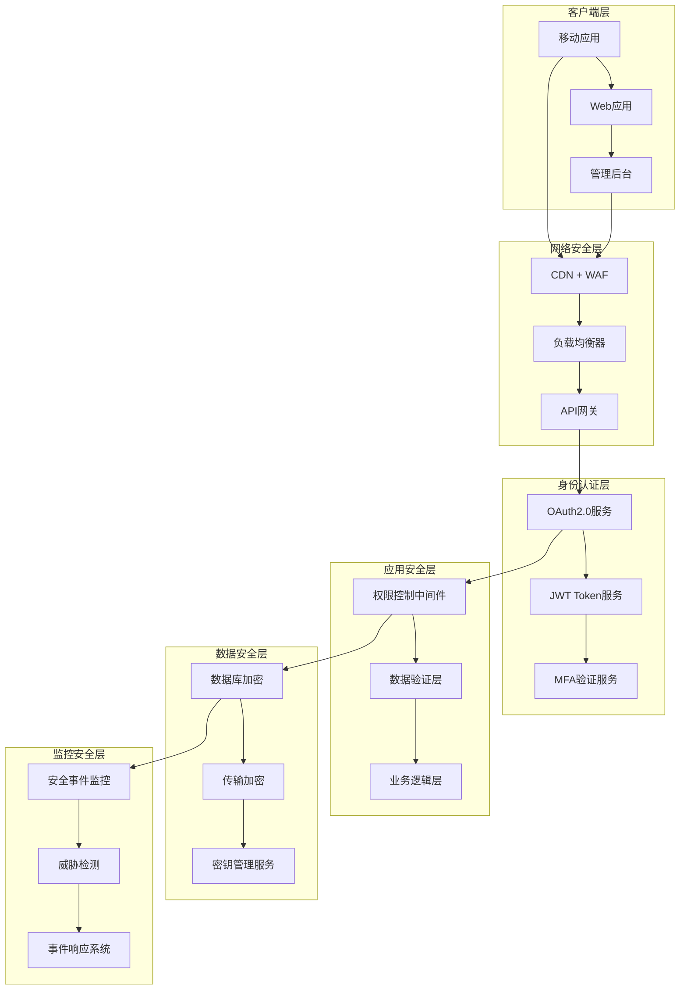

# AI智能营养餐厅系统 - 安全架构设计文档

> **文档版本**: 1.0.0  
> **创建日期**: 2025-07-12  
> **更新日期**: 2025-07-12  
> **文档状态**: ✅ 安全架构就绪  
> **目标受众**: 安全架构师、开发团队、运维团队、合规团队

## 📋 目录

- [1. 安全架构概述](#1-安全架构概述)
- [2. 威胁模型分析](#2-威胁模型分析)
- [3. 身份认证与授权](#3-身份认证与授权)
- [4. 数据安全与加密](#4-数据安全与加密)
- [5. 网络安全](#5-网络安全)
- [6. 应用安全](#6-应用安全)
- [7. 运维安全](#7-运维安全)
- [8. 合规性设计](#8-合规性设计)
- [9. 安全监控与响应](#9-安全监控与响应)
- [10. 安全测试策略](#10-安全测试策略)

---

## 1. 安全架构概述

### 1.1 安全设计原则

```yaml
核心安全原则:
  零信任架构: 
    - 永远不信任，始终验证
    - 最小权限原则
    - 动态访问控制
    
  深度防御:
    - 多层安全控制
    - 失败安全设计
    - 冗余保护机制
    
  数据保护优先:
    - 数据分类分级
    - 全生命周期保护
    - 隐私优先设计
    
  合规性内建:
    - 合规要求内嵌设计
    - 自动化合规检查
    - 审计日志完整性
```

### 1.2 安全等级分类

```yaml
安全等级划分:
  L4_最高级 (支付和医疗数据):
    - 用户支付信息
    - 健康档案数据
    - 营养师医疗建议
    - 身份认证凭据
    
  L3_高级 (个人隐私数据):
    - 用户个人信息
    - 联系方式
    - 地理位置信息
    - 饮食偏好记录
    
  L2_中级 (业务敏感数据):
    - 商家经营数据
    - 订单信息
    - 用户行为分析
    - 系统配置信息
    
  L1_标准级 (公开和准公开数据):
    - 菜品信息
    - 营养知识库
    - 公开评论
    - 系统公告
```

### 1.3 整体安全架构图



---

## 2. 威胁模型分析

### 2.1 STRIDE威胁分析

```yaml
威胁类别分析:
  Spoofing (身份伪造):
    威胁场景:
      - 用户身份冒充
      - 商家账户伪造
      - 营养师资质伪造
      - API调用方伪造
    
    防护措施:
      - 强身份认证机制
      - 多因素认证 (MFA)
      - 设备指纹识别
      - 行为分析检测
      
  Tampering (数据篡改):
    威胁场景:
      - 营养数据篡改
      - 订单信息修改
      - 支付金额篡改
      - 用户权限提升
    
    防护措施:
      - 数据完整性校验
      - 数字签名验证
      - 操作日志审计
      - 版本控制机制
      
  Repudiation (否认性):
    威胁场景:
      - 订单操作否认
      - 支付行为否认
      - 数据访问否认
      - 管理操作否认
    
    防护措施:
      - 完整审计日志
      - 数字签名记录
      - 时间戳服务
      - 不可篡改日志
      
  Information_Disclosure (信息泄露):
    威胁场景:
      - 用户隐私泄露
      - 商业机密泄露
      - 系统配置泄露
      - 数据库信息泄露
    
    防护措施:
      - 数据分类保护
      - 访问控制严格
      - 数据脱敏处理
      - 网络隔离设计
      
  Denial_of_Service (拒绝服务):
    威胁场景:
      - API接口滥用
      - 数据库连接耗尽
      - 存储空间攻击
      - 网络带宽攻击
    
    防护措施:
      - 流量限制控制
      - 资源配额管理
      - 分布式架构
      - CDN防护机制
      
  Elevation_of_Privilege (权限提升):
    威胁场景:
      - 水平权限越权
      - 垂直权限提升
      - 角色权限滥用
      - 系统管理权限获取
    
    防护措施:
      - 细粒度权限控制
      - 权限最小化原则
      - 定期权限审查
      - 权限变更监控
```

### 2.2 攻击面分析

```yaml
外部攻击面:
  Web应用接口:
    - RESTful API端点
    - WebSocket连接
    - 文件上传接口
    - 图片处理服务
    
  移动应用:
    - App本地存储
    - 网络通信协议
    - 推送通知服务
    - 第三方SDK集成
    
  第三方集成:
    - 支付网关接口
    - 地图服务API
    - 短信验证服务
    - 社交媒体登录

内部攻击面:
  基础设施:
    - 服务器操作系统
    - 容器运行环境
    - 数据库系统
    - 网络设备配置
    
  应用组件:
    - 微服务间通信
    - 数据库连接
    - 缓存系统
    - 消息队列服务
    
  运维管理:
    - 管理员访问
    - 部署流水线
    - 监控系统
    - 日志收集系统
```

---

## 3. 身份认证与授权

### 3.1 认证架构设计

```yaml
认证方式层次:
  一级认证 (基础):
    - 手机号 + 验证码
    - 邮箱 + 密码
    - 第三方OAuth (微信/支付宝)
    - 生物识别 (指纹/面部)
    
  二级认证 (增强):
    - SMS短信验证
    - TOTP动态令牌
    - 推送通知确认
    - 硬件安全密钥
    
  三级认证 (高安全):
    - 管理员操作
    - 敏感数据访问
    - 支付操作确认
    - 权限变更操作

Token管理策略:
  Access_Token:
    - 生命周期: 15分钟
    - 算法: RS256 (RSA-SHA256)
    - 载荷: 用户ID、角色、权限、设备信息
    - 存储: 内存或安全存储
    
  Refresh_Token:
    - 生命周期: 7天 (可配置)
    - 存储: 加密存储
    - 轮换策略: 每次使用后轮换
    - 撤销机制: 支持立即撤销
    
  设备Token:
    - 设备指纹绑定
    - 异常设备检测
    - 设备信任级别
    - 设备生命周期管理
```

### 3.2 权限控制模型

```yaml
RBAC权限模型:
  角色定义:
    super_admin:
      - 系统完全控制权限
      - 用户权限管理
      - 系统配置管理
      - 安全审计查看
      
    admin:
      - 业务数据管理
      - 用户信息查看
      - 商家信息管理
      - 订单数据管理
      
    nutritionist:
      - 营养档案查看
      - 咨询服务提供
      - 营养建议发布
      - 客户管理功能
      
    merchant:
      - 菜品信息管理
      - 订单处理权限
      - 营业数据查看
      - 客户服务功能
      
    customer:
      - 个人信息管理
      - 订单创建管理
      - 咨询服务使用
      - 社区互动参与

  权限粒度设计:
    资源级别:
      - 用户资源 (user:*)
      - 订单资源 (order:*)
      - 菜品资源 (dish:*)
      - 营养资源 (nutrition:*)
      
    操作级别:
      - 创建权限 (create)
      - 读取权限 (read)
      - 更新权限 (update)
      - 删除权限 (delete)
      - 管理权限 (manage)
      
    范围级别:
      - 全局范围 (global)
      - 组织范围 (organization)
      - 个人范围 (personal)
      - 关联范围 (related)

动态权限控制:
  上下文感知:
    - 时间范围限制
    - 地理位置限制
    - 设备类型限制
    - 网络环境限制
    
  风险评估:
    - 操作风险等级
    - 用户信任分数
    - 异常行为检测
    - 自适应权限调整
```

### 3.3 单点登录 (SSO) 设计

```yaml
SSO架构组件:
  Identity_Provider (IdP):
    - 统一身份存储
    - 认证服务提供
    - Token签发管理
    - 用户会话管理
    
  Service_Provider (SP):
    - 移动应用客户端
    - Web管理后台
    - 商家管理系统
    - 营养师工作台
    
  协议支持:
    - OAuth 2.0 / OpenID Connect
    - SAML 2.0 (企业集成)
    - JWT Token传递
    - Custom API认证

会话管理:
  Session策略:
    - 分布式会话存储 (Redis)
    - 会话超时控制
    - 并发会话限制
    - 异常会话检测
    
  登出策略:
    - 单点登出 (SLO)
    - 全局会话清理
    - Token立即失效
    - 审计日志记录
```

---

## 4. 数据安全与加密

### 4.1 数据分类与保护策略

```yaml
数据分类标准:
  绝密级 (Top_Secret):
    数据类型:
      - 用户支付密码
      - 系统私钥
      - 数据库连接密码
      - API密钥信息
    
    保护措施:
      - AES-256-GCM加密
      - 硬件安全模块 (HSM)
      - 零知识架构
      - 定期密钥轮换
      
  机密级 (Secret):
    数据类型:
      - 用户身份证号
      - 银行卡信息
      - 健康医疗数据
      - 商业财务数据
    
    保护措施:
      - AES-256-CBC加密
      - 数据库字段加密
      - 访问日志记录
      - 数据脱敏处理
      
  私密级 (Confidential):
    数据类型:
      - 用户个人信息
      - 联系方式
      - 位置信息
      - 饮食偏好
    
    保护措施:
      - AES-128-GCM加密
      - 角色访问控制
      - 数据使用监控
      - 隐私合规检查
      
  内部级 (Internal):
    数据类型:
      - 业务配置信息
      - 用户操作日志
      - 系统运行日志
      - 菜品信息数据
    
    保护措施:
      - 基础加密存储
      - 网络传输加密
      - 访问权限控制
      - 定期备份策略
```

### 4.2 加密实施策略

```yaml
静态数据加密:
  数据库加密:
    实施方案:
      - 透明数据加密 (TDE)
      - 字段级加密
      - 索引加密支持
      - 备份数据加密
    
    密钥管理:
      - 主密钥轮换 (每年)
      - 数据密钥轮换 (每月)
      - 分级密钥管理
      - 硬件密钥存储
      
  文件系统加密:
    实施方案:
      - 全盘加密 (LUKS)
      - 目录级加密
      - 临时文件加密
      - 日志文件加密
      
  应用层加密:
    敏感字段:
      - 手机号: AES-256-GCM
      - 身份证: AES-256-GCM + HMAC
      - 银行卡: Tokenization
      - 健康数据: Format Preserving Encryption

传输数据加密:
  HTTPS配置:
    - TLS 1.3 (最低1.2)
    - HSTS强制HTTPS
    - 证书固定 (Certificate Pinning)
    - 完美前向保密 (PFS)
    
  内部通信:
    - mTLS双向认证
    - gRPC安全传输
    - 消息队列加密
    - 数据库连接加密
    
  API安全:
    - Request/Response加密
    - JWT Payload加密
    - 文件上传加密
    - WebSocket消息加密

密钥管理系统:
  架构设计:
    - 分层密钥架构
    - 密钥分离存储
    - 多重签名机制
    - 阈值密钥共享
    
  生命周期管理:
    - 密钥生成: FIPS 140-2 Level 3
    - 密钥分发: 安全通道传输
    - 密钥轮换: 自动化轮换
    - 密钥销毁: 安全擦除
    
  访问控制:
    - 角色权限控制
    - 操作审计日志
    - 异常访问检测
    - 应急密钥恢复
```

### 4.3 隐私保护设计

```yaml
隐私技术应用:
  数据最小化:
    - 目的限制收集
    - 存储时间限制
    - 自动数据清理
    - 匿名化处理
    
  数据脱敏:
    - 动态脱敏 (生产查询)
    - 静态脱敏 (测试环境)
    - 格式保持脱敏
    - 一致性脱敏
    
  差分隐私:
    - 统计查询保护
    - 噪声注入机制
    - 隐私预算管理
    - 效用平衡优化
    
  同态加密:
    - 加密计算支持
    - 营养数据分析
    - 隐私统计功能
    - 安全多方计算

用户隐私控制:
  知情同意:
    - 透明隐私政策
    - 分层同意机制
    - 同意撤回功能
    - 同意状态追踪
    
  用户权利:
    - 数据访问权
    - 数据更正权
    - 数据删除权
    - 数据可携带权
    
  隐私仪表板:
    - 数据使用可视化
    - 隐私设置控制
    - 数据下载功能
    - 隐私风险提示
```

---

## 5. 网络安全

### 5.1 网络架构安全

```yaml
网络分层设计:
  DMZ区域:
    组件:
      - 负载均衡器
      - Web应用防火墙 (WAF)
      - CDN边缘节点
      - 反向代理服务
    
    安全措施:
      - DDoS防护
      - 流量清洗
      - 地理位置过滤
      - 恶意IP黑名单
      
  应用区域:
    组件:
      - API网关服务
      - 微服务集群
      - 应用服务器
      - 容器运行环境
    
    安全措施:
      - 内网访问控制
      - 服务间mTLS
      - 容器网络隔离
      - 东西向流量监控
      
  数据区域:
    组件:
      - 数据库集群
      - 缓存服务
      - 消息队列
      - 文件存储系统
    
    安全措施:
      - 数据库防火墙
      - 网络ACL控制
      - 数据库审计
      - 存储加密

防火墙策略:
  外部防火墙:
    规则策略:
      - 默认拒绝所有
      - 白名单端口开放
      - 地理位置限制
      - 异常流量检测
    
    开放端口:
      - 443 (HTTPS)
      - 80 (HTTP重定向)
      - 22 (SSH管理，限制IP)
      - 自定义应用端口
      
  内部防火墙:
    微分段策略:
      - 服务间网络隔离
      - 最小权限通信
      - 动态访问控制
      - 零信任网络架构
```

### 5.2 DDoS防护策略

```yaml
多层DDoS防护:
  L3/L4层防护:
    - 流量速率限制
    - SYN Flood防护
    - UDP Flood防护
    - ICMP Flood防护
    
  L7层防护:
    - HTTP Flood防护
    - CC攻击防护
    - 慢速攻击防护
    - 应用层协议验证
    
  智能防护:
    - 机器学习检测
    - 行为分析引擎
    - 自适应阈值调整
    - 自动防护策略

流量清洗:
  实时监控:
    - 流量基线建立
    - 异常流量检测
    - 攻击特征识别
    - 自动触发清洗
    
  清洗策略:
    - 源IP限制
    - 请求频率控制
    - 内容模式匹配
    - 地理位置过滤
    
  应急响应:
    - 黑洞路由
    - 流量分流
    - 服务降级
    - 紧急切换
```

### 5.3 API安全网关

```yaml
网关安全功能:
  认证授权:
    - JWT Token验证
    - OAuth2.0协议支持
    - API Key管理
    - 权限策略执行
    
  流量控制:
    - 请求频率限制
    - 并发连接控制
    - 带宽使用限制
    - 用户配额管理
    
  安全检测:
    - SQL注入检测
    - XSS攻击防护
    - CSRF保护
    - 数据验证
    
  监控审计:
    - 请求响应日志
    - 性能指标监控
    - 安全事件告警
    - 合规审计支持

API版本安全:
  版本控制:
    - 安全版本标记
    - 漏洞版本废弃
    - 平滑升级策略
    - 兼容性检查
    
  访问策略:
    - 版本权限控制
    - 功能开关管理
    - A/B测试安全
    - 渐进式发布
```

---

## 6. 应用安全

### 6.1 OWASP Top 10防护

```yaml
A01_访问控制失效:
  防护措施:
    - 严格RBAC权限控制
    - 资源级权限验证
    - 会话管理强化
    - 权限变更监控
    
  技术实现:
    - 中间件权限检查
    - JWT权限载荷
    - 动态权限验证
    - 权限缓存策略

A02_加密机制失效:
  防护措施:
    - 强加密算法使用
    - 密钥管理规范
    - 证书生命周期管理
    - 安全随机数生成
    
  技术实现:
    - AES-256-GCM加密
    - RSA-4096密钥对
    - bcrypt密码哈希
    - HTTPS强制使用

A03_注入攻击:
  防护措施:
    - 参数化查询
    - 输入验证和清理
    - ORM框架使用
    - 存储过程调用
    
  技术实现:
    - TypeORM参数绑定
    - Joi输入验证
    - SQL查询白名单
    - NoSQL注入防护

A04_不安全设计:
  防护措施:
    - 威胁建模分析
    - 安全设计评审
    - 防御性编程
    - 失败安全设计
    
  技术实现:
    - 安全编码规范
    - 设计模式安全化
    - 错误处理统一
    - 安全配置模板

A05_安全配置错误:
  防护措施:
    - 配置基线标准
    - 自动化配置检查
    - 安全配置模板
    - 配置变更审计
    
  技术实现:
    - Docker安全配置
    - 环境变量加密
    - 配置文件权限控制
    - 默认配置加固

A06_易受攻击组件:
  防护措施:
    - 依赖漏洞扫描
    - 组件版本管理
    - 安全补丁及时更新
    - 第三方组件评估
    
  技术实现:
    - npm audit自动化
    - 依赖版本锁定
    - 安全镜像构建
    - 组件许可证检查

A07_身份认证失效:
  防护措施:
    - 多因素认证
    - 强密码策略
    - 账户锁定机制
    - 异常登录检测
    
  技术实现:
    - JWT + Refresh Token
    - 密码复杂度验证
    - 登录尝试限制
    - 设备指纹识别

A08_软件数据完整性失效:
  防护措施:
    - 代码签名验证
    - 软件供应链安全
    - 完整性校验
    - 安全更新机制
    
  技术实现:
    - Docker镜像签名
    - npm包完整性验证
    - CI/CD安全流水线
    - 版本回滚机制

A09_安全日志记录失效:
  防护措施:
    - 完整安全事件日志
    - 实时监控告警
    - 日志完整性保护
    - 合规审计支持
    
  技术实现:
    - 结构化日志格式
    - ELK日志分析
    - 日志数字签名
    - 异常行为检测

A10_服务端请求伪造:
  防护措施:
    - URL白名单验证
    - 内部网络隔离
    - 请求验证机制
    - 输出编码处理
    
  技术实现:
    - URL解析验证
    - 内网访问控制
    - HTTP头验证
    - 响应内容过滤
```

### 6.2 代码安全规范

```yaml
安全编码标准:
  输入验证:
    验证原则:
      - 白名单验证优先
      - 长度限制检查
      - 格式正则验证
      - 业务逻辑验证
      
    实现规范:
      - Joi/Yup验证库
      - 自定义验证器
      - 中间件统一验证
      - 错误信息安全化
      
  输出编码:
    编码策略:
      - HTML实体编码
      - URL编码处理
      - JSON安全输出
      - SQL查询参数化
      
  错误处理:
    安全原则:
      - 统一错误格式
      - 敏感信息过滤
      - 错误日志记录
      - 用户友好提示
      
  会话管理:
    安全措施:
      - 安全Cookie设置
      - CSRF Token验证
      - 会话超时控制
      - 并发会话限制

代码审查安全检查清单:
  认证授权:
    - [ ] 身份验证检查
    - [ ] 权限验证完整
    - [ ] 会话管理安全
    - [ ] 令牌使用规范
    
  数据保护:
    - [ ] 敏感数据加密
    - [ ] 输入验证完整
    - [ ] 输出编码正确
    - [ ] 数据传输安全
    
  业务逻辑:
    - [ ] 业务规则验证
    - [ ] 状态检查完整
    - [ ] 并发控制安全
    - [ ] 异常处理完善
    
  配置安全:
    - [ ] 敏感配置加密
    - [ ] 默认配置安全
    - [ ] 环境变量保护
    - [ ] 日志安全配置
```

### 6.3 容器安全

```yaml
Docker安全配置:
  镜像安全:
    基础镜像:
      - 官方最小化镜像
      - 定期安全更新
      - 漏洞扫描验证
      - 镜像签名验证
      
    构建安全:
      - 多阶段构建
      - 最小权限原则
      - 敏感文件清理
      - 安全扫描集成
      
  运行时安全:
    容器配置:
      - 非root用户运行
      - 只读文件系统
      - 资源限制设置
      - 网络命名空间隔离
      
    安全选项:
      - --no-new-privileges
      - --security-opt no-new-privileges
      - --cap-drop ALL
      - --cap-add 最小必需权限

Kubernetes安全:
  Pod安全策略:
    - 安全上下文配置
    - 资源配额限制
    - 网络策略控制
    - 服务账户管理
    
  密钥管理:
    - Secret对象使用
    - ConfigMap安全配置
    - 加密存储启用
    - RBAC权限控制
    
  网络安全:
    - Network Policy实施
    - Service Mesh安全
    - Ingress控制器安全
    - 东西向流量加密
```

---

## 7. 运维安全

### 7.1 基础设施安全

```yaml
服务器安全加固:
  操作系统:
    - 最小化安装
    - 安全补丁更新
    - 不必要服务禁用
    - 安全配置基线
    
  访问控制:
    - SSH密钥认证
    - 多因素认证
    - VPN访问控制
    - 堡垒机管理
    
  监控审计:
    - 系统调用监控
    - 文件完整性检查
    - 异常行为检测
    - 安全事件告警

数据库安全:
  访问控制:
    - 最小权限原则
    - 角色权限分离
    - 连接数限制
    - IP白名单控制
    
  数据保护:
    - 透明数据加密
    - 备份数据加密
    - 传输数据加密
    - 数据脱敏处理
    
  审计监控:
    - 数据库审计日志
    - 敏感操作监控
    - 异常查询检测
    - 性能监控告警
```

### 7.2 DevSecOps集成

```yaml
安全开发流程:
  代码阶段:
    - 静态代码分析 (SAST)
    - 依赖漏洞扫描
    - 代码质量检查
    - 安全编码规范
    
  构建阶段:
    - 容器镜像扫描
    - 软件成分分析 (SCA)
    - 配置安全检查
    - 密钥泄露检测
    
  测试阶段:
    - 动态应用安全测试 (DAST)
    - 交互式应用安全测试 (IAST)
    - 渗透测试集成
    - 安全性能测试
    
  部署阶段:
    - 基础设施代码安全
    - 部署配置验证
    - 运行时保护启用
    - 安全监控配置

CI/CD安全集成:
  工具链安全:
    - SonarQube代码质量
    - Snyk依赖扫描
    - Trivy容器扫描
    - OWASP ZAP动态扫描
    
  流水线安全:
    - 分支保护规则
    - 代码签名验证
    - 制品安全扫描
    - 部署权限控制
    
  自动化安全:
    - 安全门禁设置
    - 漏洞自动修复
    - 安全报告生成
    - 合规检查自动化
```

### 7.3 密钥和证书管理

```yaml
密钥管理生命周期:
  密钥生成:
    - 安全随机数生成
    - 强度算法选择
    - 分布式密钥生成
    - 密钥备份策略
    
  密钥分发:
    - 安全通道传输
    - 身份验证机制
    - 分发日志记录
    - 接收确认机制
    
  密钥存储:
    - 硬件安全模块 (HSM)
    - 加密密钥存储
    - 访问控制严格
    - 备份恢复策略
    
  密钥轮换:
    - 定期轮换策略
    - 自动化轮换流程
    - 旧密钥安全销毁
    - 轮换影响评估
    
  密钥销毁:
    - 安全擦除算法
    - 销毁验证机制
    - 销毁日志记录
    - 合规要求满足

证书管理:
  证书生命周期:
    - 证书申请流程
    - 证书签发管控
    - 证书部署自动化
    - 证书更新提醒
    
  证书监控:
    - 过期时间监控
    - 证书链验证
    - 撤销状态检查
    - 证书使用审计
    
  自动化管理:
    - Let's Encrypt集成
    - ACME协议支持
    - 证书自动续期
    - 部署自动化
```

---

## 8. 合规性设计

### 8.1 法律法规合规

```yaml
中国法律法规:
  网络安全法:
    - 网络安全等级保护
    - 数据安全管理制度
    - 网络安全事件报告
    - 关键信息基础设施保护
    
  数据安全法:
    - 数据分类分级保护
    - 数据安全风险评估
    - 数据处理活动记录
    - 数据安全应急处置
    
  个人信息保护法:
    - 个人信息处理原则
    - 个人信息主体权利
    - 个人信息跨境传输
    - 个人信息保护影响评估

国际法规合规:
  GDPR (欧盟):
    - 合法基础确立
    - 数据主体权利保障
    - 隐私设计原则
    - 数据保护影响评估
    
  CCPA (加州):
    - 消费者隐私权利
    - 个人信息销售限制
    - 数据处理透明度
    - 选择退出机制
    
  PIPEDA (加拿大):
    - 隐私政策要求
    - 同意机制设计
    - 数据泄露通知
    - 隐私专员报告

行业标准合规:
  ISO27001:
    - 信息安全管理体系
    - 风险评估和处理
    - 安全控制措施
    - 持续改进机制
    
  PCI DSS:
    - 支付卡数据保护
    - 安全网络维护
    - 脆弱性管理程序
    - 定期安全测试
```

### 8.2 隐私合规设计

```yaml
隐私政策实施:
  透明度原则:
    - 清晰隐私政策
    - 数据使用目的说明
    - 处理法律基础
    - 数据保留期限
    
  用户控制:
    - 同意管理界面
    - 隐私设置选项
    - 数据访问功能
    - 账户删除功能
    
  权利保障:
    - 数据可携带性
    - 数据更正机制
    - 数据删除功能
    - 处理限制选项

同意管理:
  分层同意:
    - 必要功能同意
    - 增强功能同意
    - 营销推广同意
    - 第三方分享同意
    
  同意记录:
    - 同意时间记录
    - 同意版本管理
    - 同意方式记录
    - 撤回同意追踪
    
  同意验证:
    - 有效同意检查
    - 同意范围验证
    - 同意状态更新
    - 过期同意处理

数据主体权利:
  访问权实现:
    - 个人数据导出
    - 处理活动说明
    - 数据来源信息
    - 数据接收方信息
    
  更正权实现:
    - 数据修改界面
    - 修改历史记录
    - 影响评估机制
    - 通知相关方
    
  删除权实现:
    - 删除请求处理
    - 技术删除实现
    - 删除验证机制
    - 合法保留判断
```

### 8.3 审计与报告

```yaml
合规审计体系:
  内部审计:
    - 定期合规检查
    - 流程有效性评估
    - 控制措施验证
    - 改进建议提出
    
  外部审计:
    - 第三方合规评估
    - 认证机构审计
    - 监管机构检查
    - 审计结果跟踪
    
  持续监控:
    - 合规指标监控
    - 违规行为检测
    - 风险评估更新
    - 纠正措施实施

报告机制:
  内部报告:
    - 月度合规报告
    - 季度风险评估
    - 年度合规总结
    - 重大事件报告
    
  外部报告:
    - 监管部门报告
    - 数据泄露通知
    - 透明度报告发布
    - 利益相关方沟通
    
  报告标准化:
    - 报告模板制定
    - 数据收集自动化
    - 报告质量控制
    - 报告存档管理
```

---

## 9. 安全监控与响应

### 9.1 安全监控体系

```yaml
监控架构设计:
  数据收集层:
    日志源:
      - 应用程序日志
      - 系统安全日志
      - 网络设备日志
      - 数据库审计日志
      
    监控代理:
      - Filebeat日志收集
      - Metricbeat指标收集
      - Packetbeat网络监控
      - Auditbeat系统审计
      
  数据处理层:
    日志处理:
      - Logstash数据解析
      - 数据标准化
      - 字段提取映射
      - 数据富化处理
      
    流式处理:
      - Kafka消息队列
      - Storm实时计算
      - 规则引擎处理
      - 异常检测算法
      
  存储分析层:
    存储系统:
      - PostgreSQL日志数据库
      - 时序数据库
      - 冷热数据分层
      - 数据生命周期管理
      
    分析引擎:
      - 机器学习算法
      - 统计分析模型
      - 关联分析引擎
      - 威胁情报集成
      
  展示告警层:
    可视化:
      - Kibana仪表板
      - Grafana监控大屏
      - 自定义报表
      - 移动端监控
      
    告警系统:
      - 多渠道告警
      - 告警去重合并
      - 告警优先级分级
      - 告警响应追踪

实时监控指标:
  安全事件:
    - 异常登录检测
    - 权限越权行为
    - 数据异常访问
    - 系统入侵尝试
    
  业务安全:
    - 异常交易检测
    - 欺诈行为识别
    - 数据泄露风险
    - 业务逻辑绕过
    
  技术安全:
    - 漏洞利用检测
    - 恶意代码识别
    - 网络攻击检测
    - 系统性能异常
    
  合规监控:
    - 数据访问合规
    - 隐私政策执行
    - 审计日志完整性
    - 监管要求符合性
```

### 9.2 威胁检测

```yaml
检测技术栈:
  基于规则检测:
    规则类型:
      - 已知攻击特征
      - 异常行为模式
      - 合规违规行为
      - 业务逻辑异常
      
    规则引擎:
      - Sigma规则标准
      - 自定义规则语言
      - 规则版本管理
      - 规则有效性验证
      
  机器学习检测:
    算法模型:
      - 异常检测算法
      - 聚类分析模型
      - 时序分析模型
      - 深度学习网络
      
    特征工程:
      - 用户行为特征
      - 网络流量特征
      - 系统调用特征
      - 应用访问特征
      
  威胁情报:
    情报源:
      - 商业威胁情报
      - 开源威胁数据
      - 行业共享情报
      - 内部威胁情报
      
    情报应用:
      - IOC匹配检测
      - TTP分析关联
      - 威胁狩猎支持
      - 风险评估增强

行为分析:
  用户行为分析 (UBA):
    基线建立:
      - 正常行为模式学习
      - 行为基线动态调整
      - 群体行为分析
      - 个体行为差异
      
    异常检测:
      - 访问时间异常
      - 访问地点异常
      - 访问频率异常
      - 权限使用异常
      
  实体行为分析 (EBA):
    实体建模:
      - 设备行为模式
      - 应用行为特征
      - 服务通信模式
      - 数据流动特征
      
    异常识别:
      - 通信模式异常
      - 资源使用异常
      - 服务调用异常
      - 数据访问异常
```

### 9.3 事件响应

```yaml
响应流程设计:
  事件分级:
    P0_严重事件:
      - 数据泄露事件
      - 系统完全瘫痪
      - 严重安全漏洞
      - 法律合规违规
      响应时间: 15分钟内
      
    P1_高级事件:
      - 服务部分中断
      - 安全控制失效
      - 异常用户行为
      - 性能严重下降
      响应时间: 1小时内
      
    P2_中级事件:
      - 安全告警触发
      - 服务质量下降
      - 配置安全问题
      - 合规检查失败
      响应时间: 4小时内
      
    P3_低级事件:
      - 监控告警
      - 日常安全事件
      - 预防性检查
      - 信息收集需求
      响应时间: 24小时内

响应团队组织:
  核心响应团队:
    - 事件指挥官 (IC)
    - 安全分析师
    - 系统运维工程师
    - 开发技术专家
    
  扩展响应团队:
    - 法务合规专员
    - 公关沟通专员
    - 业务产品经理
    - 外部安全顾问
    
  响应协调:
    - 统一指挥中心
    - 沟通协调机制
    - 决策升级流程
    - 资源调配协调

应急处置:
  立即响应:
    - 事件确认分析
    - 影响范围评估
    - 紧急止损措施
    - 证据保全收集
    
  深入调查:
    - 根因分析调查
    - 攻击路径重构
    - 影响损失评估
    - 修复方案制定
    
  恢复重建:
    - 系统安全加固
    - 服务恢复验证
    - 业务功能测试
    - 监控告警调整
    
  总结改进:
    - 事件总结报告
    - 流程改进建议
    - 技术防护增强
    - 培训计划更新

法律合规响应:
  监管通报:
    - 法定时间内通报
    - 通报内容完整性
    - 后续报告更新
    - 监管配合调查
    
  用户通知:
    - 透明信息披露
    - 及时通知机制
    - 补救措施说明
    - 用户权利保障
    
  证据保全:
    - 数字证据收集
    - 证据链完整性
    - 法律证据标准
    - 证据存储保护
```

---

## 10. 安全测试策略

### 10.1 安全测试体系

```yaml
测试分类:
  静态安全测试 (SAST):
    测试范围:
      - 源代码安全缺陷
      - 配置文件安全问题
      - 依赖组件漏洞
      - 编码规范检查
      
    工具选择:
      - SonarQube代码质量
      - Checkmarx静态扫描
      - Veracode安全分析
      - 自研规则引擎
      
  动态安全测试 (DAST):
    测试范围:
      - Web应用漏洞扫描
      - API接口安全测试
      - 网络服务漏洞
      - 配置安全检查
      
    工具选择:
      - OWASP ZAP扫描
      - Burp Suite专业版
      - Nessus漏洞扫描
      - 自定义测试脚本
      
  交互式安全测试 (IAST):
    测试范围:
      - 运行时漏洞检测
      - 代码覆盖率分析
      - 实时安全监控
      - 精确漏洞定位
      
    工具选择:
      - Contrast Security
      - Hdiv Detection
      - 自研IAST代理
      - 运行时安全监控

渗透测试:
  测试类型:
    黑盒测试:
      - 外部网络渗透
      - Web应用测试
      - 移动应用测试
      - 社会工程学测试
      
    白盒测试:
      - 源代码审计
      - 架构安全评估
      - 配置安全检查
      - 内部系统测试
      
    灰盒测试:
      - 部分信息渗透
      - 业务逻辑测试
      - 权限提升测试
      - 数据流跟踪测试
      
  测试范围:
    外部系统:
      - 公网服务渗透
      - DNS/域名安全
      - 邮件系统安全
      - CDN服务安全
      
    内部系统:
      - 内网横向移动
      - 特权账户提升
      - 数据库直接访问
      - 管理接口测试
      
    移动应用:
      - 客户端逆向分析
      - 通信协议测试
      - 本地存储安全
      - 动态调试分析

API安全测试:
  测试维度:
    认证授权:
      - Token有效性测试
      - 权限边界测试
      - 会话管理测试
      - 多租户隔离测试
      
    输入验证:
      - 参数注入测试
      - 文件上传安全
      - 数据格式验证
      - 业务逻辑绕过
      
    输出安全:
      - 信息泄露测试
      - 错误消息安全
      - 响应头安全
      - 数据过滤测试
      
    业务逻辑:
      - 工作流程测试
      - 状态机安全
      - 竞态条件测试
      - 时序依赖测试
```

### 10.2 自动化安全测试

```yaml
CI/CD集成:
  代码提交阶段:
    检查项目:
      - 静态代码分析
      - 密钥泄露检测
      - 依赖漏洞扫描
      - 编码规范检查
      
    工具集成:
      - Git pre-commit hooks
      - SonarQube质量门禁
      - Snyk依赖扫描
      - Secrets检测工具
      
  构建部署阶段:
    检查项目:
      - 容器镜像扫描
      - 配置安全检查
      - 基础设施代码扫描
      - 部署权限验证
      
    工具集成:
      - Trivy镜像扫描
      - Checkov配置扫描
      - Terraform安全分析
      - Kubernetes策略验证
      
  运行时阶段:
    监控项目:
      - 应用行为监控
      - 网络流量分析
      - 系统调用监控
      - 异常行为检测
      
    工具集成:
      - IAST运行时检测
      - WAF实时防护
      - RASP运行时保护
      - SIEM事件关联

测试自动化:
  测试用例管理:
    - 测试用例版本控制
    - 测试数据生成
    - 测试环境管理
    - 测试结果归档
    
  测试执行:
    - 并行测试执行
    - 测试优先级调度
    - 失败重试机制
    - 测试报告生成
    
  结果分析:
    - 漏洞去重合并
    - 风险等级评估
    - 修复建议生成
    - 趋势分析报告
```

### 10.3 安全测试报告

```yaml
报告内容结构:
  执行摘要:
    - 测试范围说明
    - 测试方法概述
    - 主要发现总结
    - 风险等级分布
    - 修复建议优先级
    
  详细发现:
    漏洞详情:
      - 漏洞名称描述
      - 风险等级评估
      - 影响范围分析
      - 复现步骤说明
      - 修复建议方案
      
    技术细节:
      - 漏洞原理分析
      - 攻击向量说明
      - 利用条件要求
      - 防护绕过方法
      - 深度技术分析
      
  修复指南:
    短期修复:
      - 紧急风险缓解
      - 临时解决方案
      - 配置调整建议
      - 监控加强措施
      
    长期改进:
      - 架构优化建议
      - 流程改进计划
      - 技术升级方案
      - 培训需求分析

报告质量控制:
  内容审核:
    - 技术准确性验证
    - 业务影响评估
    - 修复方案可行性
    - 报告完整性检查
    
  质量标准:
    - 漏洞分类标准化
    - 风险评级一致性
    - 修复建议实用性
    - 报告格式规范性
    
  交付流程:
    - 初稿内部评审
    - 技术细节确认
    - 业务方案讨论
    - 最终报告交付
```

---

## 附录

### A. 安全配置模板

```yaml
# 安全配置检查清单
security_checklist:
  系统配置:
    - [ ] 默认密码已更改
    - [ ] 不必要服务已禁用
    - [ ] 防火墙规则已配置
    - [ ] 安全补丁已安装
    
  应用配置:
    - [ ] 错误信息已脱敏
    - [ ] 调试模式已关闭
    - [ ] 安全头已配置
    - [ ] 会话配置安全
    
  数据库配置:
    - [ ] 数据库账户最小权限
    - [ ] 连接加密已启用
    - [ ] 审计日志已开启
    - [ ] 备份数据已加密
    
  网络配置:
    - [ ] TLS版本要求正确
    - [ ] 证书配置有效
    - [ ] 网络分段隔离
    - [ ] 访问控制列表
```

### B. 应急响应联系方式

```yaml
应急联系人:
  安全团队:
    - 安全负责人: security-lead@company.com
    - 安全工程师: security-engineer@company.com
    - 24x7值班: security-oncall@company.com
    
  技术团队:
    - 系统管理员: sysadmin@company.com
    - 开发负责人: dev-lead@company.com
    - 运维团队: devops@company.com
    
  管理团队:
    - 首席信息官: cio@company.com
    - 法务部门: legal@company.com
    - 公关部门: pr@company.com

外部联系:
  应急服务:
    - 网络安全应急响应: cert@cert.org.cn
    - 公安网监部门: 110
    - 监管部门热线: xxx-xxxx-xxxx
    
  技术支持:
    - 云服务提供商: cloud-support@provider.com
    - 安全厂商: vendor-support@security.com
    - 法律顾问: lawyer@lawfirm.com
```

### C. 合规检查清单

```yaml
合规要求检查:
  网络安全法:
    - [ ] 网络安全等级保护备案
    - [ ] 网络安全管理制度建立
    - [ ] 网络安全技术措施落实
    - [ ] 网络安全人员培训
    
  数据安全法:
    - [ ] 数据分类分级制度
    - [ ] 数据安全管理责任
    - [ ] 数据处理活动记录
    - [ ] 数据安全风险评估
    
  个人信息保护法:
    - [ ] 个人信息处理规则
    - [ ] 个人信息主体权利保障
    - [ ] 个人信息保护负责人
    - [ ] 个人信息影响评估
```

---

**文档维护说明**：
- 本文档应每季度评审更新
- 重大安全事件后及时修订
- 新技术应用前完善相关章节
- 定期进行安全架构有效性评估

**版本历史**：
- v1.0.0 (2025-07-12): 初始版本发布
- 后续版本将记录具体变更内容