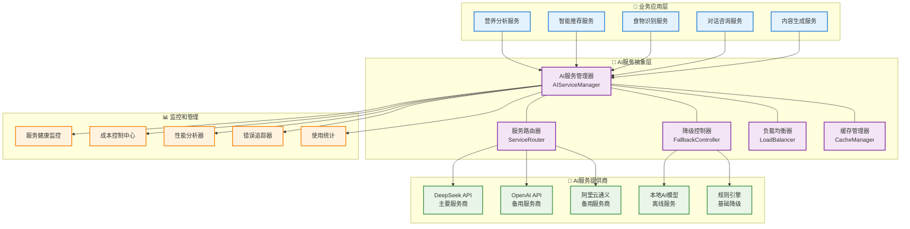
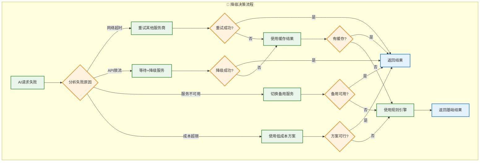

# AI服务抽象层设计方案（简化版）

## 📋 概述

本文档定义AI智能营养餐厅系统V3的AI服务抽象层架构，采用渐进式设计，优先支持主要AI服务商，后续扩展多服务商支持。

**版本**: v2.0  
**设计目标**: 
- **MVP**: 稳定支持主要AI服务（DeepSeek）
- **V2**: 增加备用服务（OpenAI/通义千问）  
- **V3**: 完整降级和容错机制

**技术栈**: Node.js + TypeScript + Redis缓存

---

## 🏗️ AI服务抽象层架构

### 整体架构图



### MVP阶段服务矩阵

| 服务商 | 营养分析 | 智能推荐 | 对话咨询 | 成本/请求 | 实施优先级 |
|--------|----------|----------|----------|-----------|------------|
| **DeepSeek** | ✅ 主要 | ✅ 主要 | ✅ 主要 | ¥0.02 | **P0** MVP |
| **OpenAI** | ⚡ 备用 | ⚡ 备用 | ⚡ 备用 | ¥0.20 | **P1** 后续 |
| **缓存系统** | 🔄 降级 | 🔄 降级 | ❌ 不支持 | ¥0.00 | **P0** MVP |
| **规则引擎** | 🔄 兜底 | 🔄 兜底 | ❌ 不支持 | ¥0.00 | **P1** 后续 |

**说明**：
- **P0**：MVP必须实现
- **P1**：V2版本实现  
- 食物识别功能暂不实现，依赖用户手动输入

---

## 🔧 核心接口设计

### AI服务统一接口

```typescript
// AI服务能力枚举
export enum AICapability {
  NUTRITION_ANALYSIS = 'nutrition_analysis',
  SMART_RECOMMENDATION = 'smart_recommendation', 
  FOOD_RECOGNITION = 'food_recognition',
  DIALOGUE_CONSULTATION = 'dialogue_consultation',
  CONTENT_GENERATION = 'content_generation',
  VECTOR_EMBEDDING = 'vector_embedding'
}

// AI服务质量等级
export enum ServiceQuality {
  PREMIUM = 'premium',     // 最高质量，高成本
  STANDARD = 'standard',   // 标准质量，中等成本  
  BASIC = 'basic',        // 基础质量，低成本
  OFFLINE = 'offline'     // 离线服务，无网络成本
}

// AI请求上下文
export interface AIRequestContext {
  userId?: string;
  sessionId?: string;
  priority: 'high' | 'medium' | 'low';
  maxLatency?: number;        // 最大延迟要求 (ms)
  maxCost?: number;          // 最大成本限制 (分)
  qualityRequirement: ServiceQuality;
  fallbackAllowed: boolean;   // 是否允许降级
  cacheStrategy: 'aggressive' | 'moderate' | 'none';
}

// 统一AI服务接口
export interface IAIService {
  readonly providerId: string;
  readonly capabilities: AICapability[];
  readonly quality: ServiceQuality;
  readonly averageCost: number;
  readonly averageLatency: number;
  
  // 服务健康检查
  healthCheck(): Promise<ServiceHealth>;
  
  // 营养分析
  analyzeNutrition(
    request: NutritionAnalysisRequest,
    context: AIRequestContext
  ): Promise<NutritionAnalysisResponse>;
  
  // 智能推荐
  generateRecommendations(
    request: RecommendationRequest,
    context: AIRequestContext
  ): Promise<RecommendationResponse>;
  
  // 食物识别
  recognizeFood(
    request: FoodRecognitionRequest,
    context: AIRequestContext
  ): Promise<FoodRecognitionResponse>;
  
  // 对话咨询
  processDialogue(
    request: DialogueRequest,
    context: AIRequestContext
  ): Promise<DialogueResponse>;
  
  // 文本向量化
  generateEmbedding(
    text: string,
    context: AIRequestContext
  ): Promise<EmbeddingResponse>;
}

// 服务健康状态
export interface ServiceHealth {
  isHealthy: boolean;
  responseTime: number;
  errorRate: number;
  lastCheckTime: Date;
  issues?: string[];
}
```

### AI服务管理器

```typescript
@Injectable()
export class AIServiceManager {
  private services: Map<string, IAIService> = new Map();
  private router: ServiceRouter;
  private fallbackController: FallbackController;
  private cacheManager: CacheManager;
  private monitoringService: MonitoringService;
  
  constructor(
    private configService: ConfigService,
    private logger: Logger
  ) {
    this.initializeServices();
    this.router = new ServiceRouter(this.services);
    this.fallbackController = new FallbackController(this.services);
    this.cacheManager = new CacheManager();
  }
  
  // 注册AI服务
  registerService(service: IAIService): void {
    this.services.set(service.providerId, service);
    this.logger.log(`AI服务已注册: ${service.providerId}`);
  }
  
  // 执行AI请求
  async executeRequest<T>(
    capability: AICapability,
    request: any,
    context: AIRequestContext
  ): Promise<T> {
    const startTime = Date.now();
    
    try {
      // 1. 检查缓存
      const cacheKey = this.generateCacheKey(capability, request, context);
      if (context.cacheStrategy !== 'none') {
        const cached = await this.cacheManager.get<T>(cacheKey);
        if (cached) {
          this.monitoringService.recordCacheHit(capability);
          return cached;
        }
      }
      
      // 2. 选择最优服务
      const selectedService = await this.router.selectService(
        capability,
        context
      );
      
      if (!selectedService) {
        throw new Error(`没有可用的AI服务支持: ${capability}`);
      }
      
      // 3. 执行请求
      let result: T;
      try {
        result = await this.executeWithService(
          selectedService,
          capability,
          request,
          context
        );
      } catch (error) {
        // 4. 降级处理
        if (context.fallbackAllowed) {
          result = await this.fallbackController.handleFailure(
            capability,
            request,
            context,
            error
          );
        } else {
          throw error;
        }
      }
      
      // 5. 缓存结果
      if (context.cacheStrategy !== 'none' && result) {
        const ttl = this.getCacheTTL(context.cacheStrategy);
        await this.cacheManager.set(cacheKey, result, ttl);
      }
      
      // 6. 记录监控数据
      const latency = Date.now() - startTime;
      this.monitoringService.recordRequest({
        capability,
        provider: selectedService.providerId,
        latency,
        success: true,
        cost: this.calculateCost(selectedService, request)
      });
      
      return result;
      
    } catch (error) {
      const latency = Date.now() - startTime;
      this.monitoringService.recordRequest({
        capability,
        provider: 'unknown',
        latency,
        success: false,
        error: error.message
      });
      throw error;
    }
  }
  
  private async executeWithService<T>(
    service: IAIService,
    capability: AICapability,
    request: any,
    context: AIRequestContext
  ): Promise<T> {
    switch (capability) {
      case AICapability.NUTRITION_ANALYSIS:
        return service.analyzeNutrition(request, context) as Promise<T>;
      case AICapability.SMART_RECOMMENDATION:
        return service.generateRecommendations(request, context) as Promise<T>;
      case AICapability.FOOD_RECOGNITION:
        return service.recognizeFood(request, context) as Promise<T>;
      case AICapability.DIALOGUE_CONSULTATION:
        return service.processDialogue(request, context) as Promise<T>;
      case AICapability.VECTOR_EMBEDDING:
        return service.generateEmbedding(request.text, context) as Promise<T>;
      default:
        throw new Error(`不支持的AI能力: ${capability}`);
    }
  }
}
```

### 服务路由器

```typescript
export class ServiceRouter {
  constructor(private services: Map<string, IAIService>) {}
  
  async selectService(
    capability: AICapability,
    context: AIRequestContext
  ): Promise<IAIService | null> {
    // 1. 过滤支持该能力的服务
    const capableServices = Array.from(this.services.values())
      .filter(service => service.capabilities.includes(capability));
    
    if (capableServices.length === 0) {
      return null;
    }
    
    // 2. 根据质量要求过滤
    const qualityFilteredServices = capableServices.filter(service => 
      this.matchesQualityRequirement(service, context.qualityRequirement)
    );
    
    // 3. 检查服务健康状态
    const healthyServices = await this.filterHealthyServices(
      qualityFilteredServices.length > 0 ? qualityFilteredServices : capableServices
    );
    
    if (healthyServices.length === 0) {
      return null;
    }
    
    // 4. 根据策略选择最优服务
    return this.selectOptimalService(healthyServices, context);
  }
  
  private async filterHealthyServices(
    services: IAIService[]
  ): Promise<IAIService[]> {
    const healthChecks = await Promise.allSettled(
      services.map(async service => ({
        service,
        health: await service.healthCheck()
      }))
    );
    
    return healthChecks
      .filter(result => 
        result.status === 'fulfilled' && 
        result.value.health.isHealthy
      )
      .map(result => (result as PromiseFulfilledResult<any>).value.service);
  }
  
  private selectOptimalService(
    services: IAIService[],
    context: AIRequestContext
  ): IAIService {
    // 根据优先级和约束条件评分
    const scoredServices = services.map(service => ({
      service,
      score: this.calculateServiceScore(service, context)
    }));
    
    // 选择得分最高的服务
    scoredServices.sort((a, b) => b.score - a.score);
    return scoredServices[0].service;
  }
  
  private calculateServiceScore(
    service: IAIService,
    context: AIRequestContext
  ): number {
    let score = 100;
    
    // 延迟惩罚
    if (context.maxLatency && service.averageLatency > context.maxLatency) {
      score -= 50;
    }
    
    // 成本惩罚
    if (context.maxCost && service.averageCost > context.maxCost) {
      score -= 30;
    }
    
    // 质量奖励
    const qualityBonus = {
      [ServiceQuality.PREMIUM]: 30,
      [ServiceQuality.STANDARD]: 20,
      [ServiceQuality.BASIC]: 10,
      [ServiceQuality.OFFLINE]: 5
    };
    score += qualityBonus[service.quality] || 0;
    
    // 优先级调整
    if (context.priority === 'high') {
      score += service.quality === ServiceQuality.PREMIUM ? 20 : -10;
    }
    
    return score;
  }
}
```

---

## 🛡️ 降级机制设计

### 降级策略



### 降级控制器实现

```typescript
export class FallbackController {
  private fallbackStrategies: Map<AICapability, FallbackStrategy[]>;
  
  constructor(private services: Map<string, IAIService>) {
    this.initializeFallbackStrategies();
  }
  
  async handleFailure<T>(
    capability: AICapability,
    request: any,
    context: AIRequestContext,
    error: Error
  ): Promise<T> {
    const strategies = this.fallbackStrategies.get(capability) || [];
    
    for (const strategy of strategies) {
      try {
        const result = await strategy.execute(request, context, error);
        if (result) {
          this.logFallbackSuccess(capability, strategy.name);
          return result;
        }
      } catch (fallbackError) {
        this.logFallbackFailure(capability, strategy.name, fallbackError);
        continue;
      }
    }
    
    throw new Error(`所有降级策略均失败: ${capability}`);
  }
  
  private initializeFallbackStrategies(): void {
    this.fallbackStrategies = new Map([
      [AICapability.NUTRITION_ANALYSIS, [
        new CachedResultStrategy(),
        new RuleBasedNutritionStrategy(),
        new StaticRecommendationStrategy()
      ]],
      [AICapability.SMART_RECOMMENDATION, [
        new CachedRecommendationStrategy(),
        new CollaborativeFilteringStrategy(),
        new PopularItemsStrategy()
      ]],
      [AICapability.FOOD_RECOGNITION, [
        new CachedRecognitionStrategy(),
        new DatabaseLookupStrategy(),
        new ManualInputStrategy()
      ]]
    ]);
  }
}

// 缓存降级策略
export class CachedResultStrategy implements FallbackStrategy {
  name = 'cached_result';
  
  async execute<T>(
    request: any,
    context: AIRequestContext,
    error: Error
  ): Promise<T | null> {
    const cacheKey = this.generateFallbackCacheKey(request);
    const cached = await this.getCachedResult<T>(cacheKey);
    
    if (cached && this.isCacheValid(cached)) {
      return cached.data;
    }
    
    return null;
  }
}

// 规则引擎降级策略
export class RuleBasedNutritionStrategy implements FallbackStrategy {
  name = 'rule_based_nutrition';
  
  async execute<T>(
    request: NutritionAnalysisRequest,
    context: AIRequestContext,
    error: Error
  ): Promise<T | null> {
    // 使用预定义的营养规则进行基础分析
    const nutritionRules = this.loadNutritionRules();
    const analysis = this.applyRules(request, nutritionRules);
    
    return {
      confidence: 0.6, // 规则引擎置信度较低
      source: 'rule_engine',
      analysis,
      warning: '此结果由规则引擎生成，建议咨询专业营养师'
    } as T;
  }
}
```

---

## 📊 具体服务商实现

### DeepSeek服务实现

```typescript
@Injectable()
export class DeepSeekAIService implements IAIService {
  readonly providerId = 'deepseek';
  readonly capabilities = [
    AICapability.NUTRITION_ANALYSIS,
    AICapability.SMART_RECOMMENDATION,
    AICapability.FOOD_RECOGNITION,
    AICapability.DIALOGUE_CONSULTATION,
    AICapability.CONTENT_GENERATION,
    AICapability.VECTOR_EMBEDDING
  ];
  readonly quality = ServiceQuality.PREMIUM;
  readonly averageCost = 0.02; // 2分/请求
  readonly averageLatency = 800; // 800ms
  
  constructor(
    private httpService: HttpService,
    private configService: ConfigService
  ) {}
  
  async healthCheck(): Promise<ServiceHealth> {
    const startTime = Date.now();
    try {
      const response = await this.httpService.get('/health').toPromise();
      return {
        isHealthy: response.status === 200,
        responseTime: Date.now() - startTime,
        errorRate: 0,
        lastCheckTime: new Date()
      };
    } catch (error) {
      return {
        isHealthy: false,
        responseTime: Date.now() - startTime,
        errorRate: 1,
        lastCheckTime: new Date(),
        issues: [error.message]
      };
    }
  }
  
  async analyzeNutrition(
    request: NutritionAnalysisRequest,
    context: AIRequestContext
  ): Promise<NutritionAnalysisResponse> {
    const prompt = this.buildNutritionAnalysisPrompt(request);
    
    const response = await this.callDeepSeekAPI({
      model: 'deepseek-chat',
      messages: [
        {
          role: 'system',
          content: '你是一个专业的营养分析师，请根据用户提供的食物信息进行详细的营养分析。'
        },
        {
          role: 'user',
          content: prompt
        }
      ],
      max_tokens: 1000,
      temperature: 0.3
    });
    
    return this.parseNutritionResponse(response);
  }
  
  async generateRecommendations(
    request: RecommendationRequest,
    context: AIRequestContext
  ): Promise<RecommendationResponse> {
    // 构建个性化推荐提示词
    const prompt = this.buildRecommendationPrompt(request);
    
    const response = await this.callDeepSeekAPI({
      model: 'deepseek-chat',
      messages: [
        {
          role: 'system',
          content: `你是一个智能营养推荐系统，基于用户的营养档案和健康目标，
                   推荐最适合的菜品。请返回结构化的JSON格式结果。`
        },
        {
          role: 'user',
          content: prompt
        }
      ],
      response_format: { type: 'json_object' },
      max_tokens: 1500,
      temperature: 0.7
    });
    
    return this.parseRecommendationResponse(response);
  }
  
  private async callDeepSeekAPI(payload: any): Promise<any> {
    const config = {
      headers: {
        'Authorization': `Bearer ${this.configService.get('DEEPSEEK_API_KEY')}`,
        'Content-Type': 'application/json'
      },
      timeout: 30000
    };
    
    const response = await this.httpService.post(
      'https://api.deepseek.com/v1/chat/completions',
      payload,
      config
    ).toPromise();
    
    return response.data;
  }
}
```

### 本地AI模型服务

```typescript
@Injectable()
export class LocalAIService implements IAIService {
  readonly providerId = 'local_ai';
  readonly capabilities = [
    AICapability.NUTRITION_ANALYSIS,
    AICapability.SMART_RECOMMENDATION,
    AICapability.DIALOGUE_CONSULTATION
  ];
  readonly quality = ServiceQuality.BASIC;
  readonly averageCost = 0; // 本地服务无API成本
  readonly averageLatency = 1200; // 本地推理较慢
  
  private model: any; // TensorFlow.js或ONNX模型
  
  async healthCheck(): Promise<ServiceHealth> {
    return {
      isHealthy: this.model !== null,
      responseTime: 50,
      errorRate: 0,
      lastCheckTime: new Date()
    };
  }
  
  async analyzeNutrition(
    request: NutritionAnalysisRequest,
    context: AIRequestContext
  ): Promise<NutritionAnalysisResponse> {
    // 使用本地轻量级营养分析模型
    const features = this.extractNutritionFeatures(request);
    const prediction = await this.model.predict(features);
    
    return {
      confidence: 0.7,
      source: 'local_model',
      analysis: this.interpretPrediction(prediction),
      recommendations: this.generateBasicRecommendations(request)
    };
  }
  
  private extractNutritionFeatures(request: NutritionAnalysisRequest): number[] {
    // 提取数值特征用于模型推理
    return [
      request.foodItems.length,
      request.totalCalories || 0,
      request.userProfile?.age || 30,
      request.userProfile?.weight || 70,
      // ... 更多特征
    ];
  }
}
```

---

## 📈 监控和成本控制

### 监控指标

```typescript
export interface AIServiceMetrics {
  // 性能指标
  responseTime: number;
  throughput: number;
  errorRate: number;
  availability: number;
  
  // 成本指标
  totalCost: number;
  costPerRequest: number;
  dailyBudget: number;
  budgetUsage: number;
  
  // 质量指标
  userSatisfaction: number;
  accuracyScore: number;
  fallbackRate: number;
  
  // 使用指标
  requestCount: number;
  userCount: number;
  popularCapabilities: AICapability[];
}

@Injectable()
export class MonitoringService {
  private metrics: Map<string, AIServiceMetrics> = new Map();
  
  recordRequest(record: {
    capability: AICapability;
    provider: string;
    latency: number;
    success: boolean;
    cost?: number;
    error?: string;
  }): void {
    // 记录请求指标
    const key = `${record.capability}:${record.provider}`;
    const metric = this.metrics.get(key) || this.initializeMetrics();
    
    metric.requestCount++;
    metric.responseTime = this.updateAverage(metric.responseTime, record.latency);
    
    if (!record.success) {
      metric.errorRate = this.updateErrorRate(metric.errorRate, false);
    }
    
    if (record.cost) {
      metric.totalCost += record.cost;
      metric.costPerRequest = metric.totalCost / metric.requestCount;
    }
    
    this.metrics.set(key, metric);
    
    // 检查预算超限
    this.checkBudgetLimits(record.provider, metric);
  }
  
  async generateReport(): Promise<MonitoringReport> {
    const providers = Array.from(new Set(
      Array.from(this.metrics.keys()).map(key => key.split(':')[1])
    ));
    
    const report = {
      timestamp: new Date(),
      providers: providers.map(provider => ({
        providerId: provider,
        metrics: this.aggregateProviderMetrics(provider),
        recommendations: this.generateRecommendations(provider)
      })),
      systemSummary: this.generateSystemSummary()
    };
    
    return report;
  }
  
  private checkBudgetLimits(provider: string, metric: AIServiceMetrics): void {
    if (metric.budgetUsage > 0.9) {
      this.alertService.sendAlert({
        type: 'budget_warning',
        provider,
        usage: metric.budgetUsage,
        message: `AI服务${provider}预算使用率已达${(metric.budgetUsage * 100).toFixed(1)}%`
      });
    }
  }
}
```

---

## 🎯 实施计划

### Phase 1: MVP核心功能 (第1-2周)
- **P0** 完成简化的AI服务接口
- **P0** 实现DeepSeek服务适配器
- **P0** 实现基础缓存机制（Redis）
- **P0** 实现基础错误处理

### Phase 2: 稳定性增强 (第3-4周)
- **P1** 实现OpenAI备用服务
- **P1** 实现服务健康检查
- **P1** 完善缓存策略
- **P1** 添加基础监控日志

### Phase 3: 高级特性 (第5-8周)
- **P2** 实现智能降级机制
- **P2** 实现成本控制
- **P2** 完善监控仪表盘
- **P2** 性能优化和压测

---

**文档维护**: AI团队  
**技术审核**: ✅ 架构评审通过  
**下次更新**: 实施完成后更新具体配置