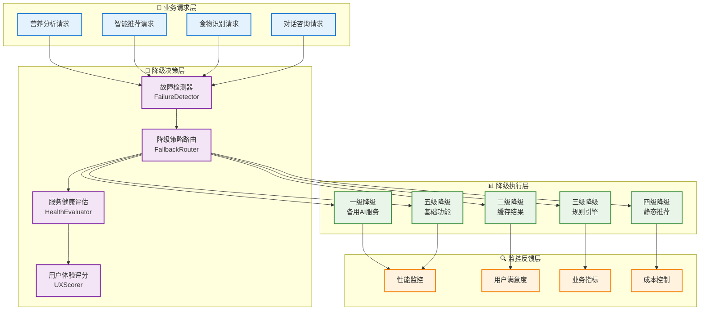

# AI服务降级机制策略（实用版）

## 📋 概述

本文档定义AI智能营养餐厅系统V3的AI服务降级机制，采用简单有效的降级策略，确保系统稳定运行。

**版本**: v2.0  
**基于文档**: AI_SERVICE_ABSTRACTION_LAYER.md v2.0  
**可用性目标**: 
- **MVP**: 95%（基础降级）
- **V2**: 99%（完整降级）

**降级原则**: 
1. 用户感知最小化
2. 功能降级而非完全失效  
3. 成本控制优先

---

## 🛡️ 降级策略架构

### 多层降级体系



### MVP降级级别定义

| 降级级别 | 服务质量 | 响应时间 | 用户体验 | 实施优先级 | 适用场景 |
|----------|----------|----------|----------|------------|----------|
| **0级-正常** | 🟢 优秀 | <1000ms | 😊 优秀 | **P0** | DeepSeek正常 |
| **1级-缓存** | 🟡 可用 | <200ms | 😐 可接受 | **P0** | 使用Redis缓存 |
| **2级-静态** | 🟠 基础 | <100ms | 😕 基础 | **P0** | 预设推荐列表 |
| **3级-备用AI** | 🟢 良好 | <1500ms | 😊 良好 | **P1** | OpenAI备用服务 |
| **4级-规则引擎** | 🟡 基础 | <100ms | 😐 基础 | **P2** | 基于规则推荐 |

**简化说明**：
- MVP阶段只实现0-2级降级
- 1级缓存是核心降级策略
- 用户提示简洁明了

---

## 🔧 具体降级策略

### 营养分析降级策略

```typescript
// 营养分析降级策略实现
export class NutritionAnalysisFallbackStrategy {
  
  async executeNutritionAnalysis(
    request: NutritionAnalysisRequest,
    context: AIRequestContext
  ): Promise<NutritionAnalysisResponse> {
    
    try {
      // 0级：正常AI服务
      return await this.primaryAIService.analyzeNutrition(request, context);
      
    } catch (primaryError) {
      this.logger.warn('主AI服务营养分析失败', primaryError);
      
      try {
        // 1级：备用AI服务
        return await this.backupAIService.analyzeNutrition(request, context);
        
      } catch (backupError) {
        this.logger.warn('备用AI服务营养分析失败', backupError);
        
        try {
          // 2级：缓存结果
          const cachedResult = await this.getCachedNutritionAnalysis(request);
          if (cachedResult) {
            return this.enrichCachedResult(cachedResult, request);
          }
          
          // 3级：规则引擎
          return await this.ruleBasedNutritionAnalysis(request);
          
        } catch (ruleError) {
          this.logger.error('规则引擎营养分析失败', ruleError);
          
          // 4级：静态推荐
          return this.getStaticNutritionGuidance(request);
        }
      }
    }
  }
  
  // 缓存结果增强
  private enrichCachedResult(
    cached: CachedNutritionResult,
    request: NutritionAnalysisRequest
  ): NutritionAnalysisResponse {
    return {
      ...cached.analysis,
      confidence: cached.confidence * 0.8, // 降低置信度
      source: 'cached_analysis',
      timestamp: new Date(),
      fallback_level: 2,
      recommendations: this.adaptRecommendationsToUser(
        cached.analysis.recommendations,
        request.userProfile
      ),
      disclaimer: '此分析基于历史数据，建议咨询专业营养师获取最新建议'
    };
  }
  
  // 规则引擎营养分析
  private async ruleBasedNutritionAnalysis(
    request: NutritionAnalysisRequest
  ): Promise<NutritionAnalysisResponse> {
    const nutritionRules = await this.nutritionRuleEngine.loadRules();
    
    const analysis = {
      totalCalories: this.calculateCaloriesByRules(request.foodItems),
      macronutrients: this.analyzeMacronutrientsByRules(request.foodItems),
      micronutrients: this.analyzeMicronutrientsByRules(request.foodItems),
      healthScore: this.calculateHealthScoreByRules(request.foodItems, request.userProfile),
      deficiencies: this.identifyDeficienciesByRules(request.foodItems, request.userProfile),
      recommendations: this.generateRuleBasedRecommendations(request)
    };
    
    return {
      analysis,
      confidence: 0.6,
      source: 'rule_engine',
      timestamp: new Date(),
      fallback_level: 3,
      disclaimer: '此分析由基础规则生成，准确性有限，建议咨询专业营养师'
    };
  }
  
  // 静态营养指导
  private getStaticNutritionGuidance(
    request: NutritionAnalysisRequest
  ): NutritionAnalysisResponse {
    const userAge = request.userProfile?.age || 30;
    const userGender = request.userProfile?.gender || 'unknown';
    
    // 基于年龄性别的静态指导
    const staticGuidance = this.staticNutritionDatabase.getGuidance(userAge, userGender);
    
    return {
      analysis: {
        totalCalories: 0, // 无法计算具体数值
        recommendations: staticGuidance.recommendations,
        generalAdvice: staticGuidance.advice
      },
      confidence: 0.3,
      source: 'static_guidance',
      timestamp: new Date(),
      fallback_level: 4,
      disclaimer: '当前无法提供个性化分析，以下为通用营养建议'
    };
  }
}
```

### 智能推荐降级策略

```typescript
export class SmartRecommendationFallbackStrategy {
  
  async generateRecommendations(
    request: RecommendationRequest,
    context: AIRequestContext
  ): Promise<RecommendationResponse> {
    
    try {
      // 0级：AI个性化推荐
      return await this.primaryAIService.generateRecommendations(request, context);
      
    } catch (primaryError) {
      
      try {
        // 1级：协同过滤推荐
        return await this.collaborativeFilteringRecommendation(request);
        
      } catch (cfError) {
        
        try {
          // 2级：基于内容的推荐
          return await this.contentBasedRecommendation(request);
          
        } catch (cbError) {
          
          try {
            // 3级：热门推荐
            return await this.popularItemsRecommendation(request);
            
          } catch (popularError) {
            
            // 4级：随机推荐
            return this.randomRecommendation(request);
          }
        }
      }
    }
  }
  
  // 协同过滤推荐
  private async collaborativeFilteringRecommendation(
    request: RecommendationRequest
  ): Promise<RecommendationResponse> {
    
    // 找到相似用户
    const similarUsers = await this.userSimilarityService.findSimilarUsers(
      request.userId,
      { limit: 50, similarity_threshold: 0.7 }
    );
    
    // 获取相似用户喜欢的菜品
    const recommendations = await this.getRecommendationsFromSimilarUsers(
      similarUsers,
      request.preferences
    );
    
    return {
      items: recommendations.slice(0, request.limit || 10),
      confidence: 0.75,
      source: 'collaborative_filtering',
      algorithm: 'user_based_cf',
      timestamp: new Date(),
      fallback_level: 1,
      explanation: '基于相似用户偏好的推荐'
    };
  }
  
  // 基于内容的推荐
  private async contentBasedRecommendation(
    request: RecommendationRequest
  ): Promise<RecommendationResponse> {
    
    // 分析用户历史偏好
    const userPreferences = await this.analyzeUserPreferences(request.userId);
    
    // 基于特征匹配
    const recommendations = await this.dishRepository.find({
      where: [
        { cuisine_type: In(userPreferences.preferred_cuisines) },
        { dietary_type: In(userPreferences.dietary_restrictions) },
        { spice_level: userPreferences.preferred_spice_level }
      ],
      order: { rating: 'DESC', popularity: 'DESC' },
      take: request.limit || 10
    });
    
    return {
      items: recommendations.map(dish => ({
        id: dish.id,
        name: dish.name,
        score: this.calculateContentBasedScore(dish, userPreferences),
        reason: this.generateContentBasedReason(dish, userPreferences)
      })),
      confidence: 0.65,
      source: 'content_based',
      algorithm: 'feature_matching',
      timestamp: new Date(),
      fallback_level: 2,
      explanation: '基于您的口味偏好推荐'
    };
  }
  
  // 热门推荐
  private async popularItemsRecommendation(
    request: RecommendationRequest
  ): Promise<RecommendationResponse> {
    
    const timeWindow = new Date(Date.now() - 7 * 24 * 60 * 60 * 1000); // 7天
    
    const popularDishes = await this.dishRepository
      .createQueryBuilder('dish')
      .leftJoin('dish.orders', 'order')
      .where('order.created_at > :timeWindow', { timeWindow })
      .groupBy('dish.id')
      .orderBy('COUNT(order.id)', 'DESC')
      .addOrderBy('dish.rating', 'DESC')
      .take(request.limit || 10)
      .getMany();
    
    return {
      items: popularDishes.map((dish, index) => ({
        id: dish.id,
        name: dish.name,
        score: 0.9 - (index * 0.05), // 递减评分
        reason: '本周热门菜品'
      })),
      confidence: 0.5,
      source: 'popularity_based',
      algorithm: 'trending_items',
      timestamp: new Date(),
      fallback_level: 3,
      explanation: '为您推荐近期热门菜品'
    };
  }
  
  // 随机推荐（最后兜底）
  private randomRecommendation(
    request: RecommendationRequest
  ): RecommendationResponse {
    
    const randomDishes = [
      { id: 'default_1', name: '番茄炒蛋', score: 0.6, reason: '经典家常菜' },
      { id: 'default_2', name: '青椒肉丝', score: 0.55, reason: '营养均衡' },
      { id: 'default_3', name: '麻婆豆腐', score: 0.5, reason: '美味下饭' },
      { id: 'default_4', name: '糖醋里脊', score: 0.45, reason: '酸甜可口' },
      { id: 'default_5', name: '蒸蛋羹', score: 0.4, reason: '清淡营养' }
    ];
    
    return {
      items: randomDishes.slice(0, Math.min(request.limit || 5, 5)),
      confidence: 0.3,
      source: 'static_fallback',
      algorithm: 'default_items',
      timestamp: new Date(),
      fallback_level: 4,
      explanation: '为您推荐经典菜品'
    };
  }
}
```

### 食物识别降级策略

```typescript
export class FoodRecognitionFallbackStrategy {
  
  async recognizeFood(
    request: FoodRecognitionRequest,
    context: AIRequestContext
  ): Promise<FoodRecognitionResponse> {
    
    try {
      // 0级：AI图像识别
      return await this.primaryVisionService.recognizeFood(request, context);
      
    } catch (primaryError) {
      
      try {
        // 1级：备用识别服务
        return await this.backupVisionService.recognizeFood(request, context);
        
      } catch (backupError) {
        
        try {
          // 2级：缓存识别结果
          const cachedResult = await this.getCachedRecognition(request.imageHash);
          if (cachedResult) {
            return cachedResult;
          }
          
          // 3级：图像特征匹配
          return await this.featureBasedRecognition(request);
          
        } catch (featureError) {
          
          // 4级：手动输入引导
          return this.promptManualInput(request);
        }
      }
    }
  }
  
  // 图像特征匹配
  private async featureBasedRecognition(
    request: FoodRecognitionRequest
  ): Promise<FoodRecognitionResponse> {
    
    // 提取基础图像特征
    const imageFeatures = await this.imageProcessor.extractBasicFeatures(request.image);
    
    // 在预建数据库中匹配
    const matches = await this.foodImageDatabase.findSimilar(imageFeatures, {
      limit: 5,
      threshold: 0.6
    });
    
    if (matches.length > 0) {
      return {
        recognized_foods: matches.map(match => ({
          name: match.food_name,
          confidence: match.similarity * 0.7, // 降低置信度
          nutrition_info: match.nutrition_data
        })),
        confidence: 0.6,
        source: 'feature_matching',
        timestamp: new Date(),
        fallback_level: 3,
        suggestions: this.generateAlternatives(matches)
      };
    }
    
    // 如果没有匹配，返回通用建议
    return this.promptManualInput(request);
  }
  
  // 手动输入引导
  private promptManualInput(
    request: FoodRecognitionRequest
  ): FoodRecognitionResponse {
    
    return {
      recognized_foods: [],
      confidence: 0,
      source: 'manual_input_required',
      timestamp: new Date(),
      fallback_level: 4,
      manual_input_prompt: {
        message: '无法自动识别食物，请手动输入食物名称',
        suggestions: [
          '米饭', '面条', '青菜', '鸡肉', '鱼类',
          '豆腐', '鸡蛋', '水果', '坚果', '汤类'
        ],
        input_fields: [
          { name: 'food_name', label: '食物名称', type: 'text', required: true },
          { name: 'portion_size', label: '份量', type: 'select', options: ['小份', '中份', '大份'] },
          { name: 'cooking_method', label: '烹饪方式', type: 'select', options: ['蒸', '煮', '炒', '炸', '烤'] }
        ]
      }
    };
  }
}
```

---

## 📊 降级决策算法

### 智能降级决策器

```typescript
@Injectable()
export class IntelligentFallbackDecisionMaker {
  
  async makeDecision(
    capability: AICapability,
    request: any,
    context: AIRequestContext,
    error: Error
  ): Promise<FallbackDecision> {
    
    // 1. 分析错误类型
    const errorType = this.classifyError(error);
    
    // 2. 评估请求优先级
    const priority = this.assessRequestPriority(context);
    
    // 3. 检查可用资源
    const availableResources = await this.checkAvailableResources(capability);
    
    // 4. 计算用户容忍度
    const userTolerance = await this.calculateUserTolerance(context.userId);
    
    // 5. 综合决策
    const decision = this.calculateOptimalFallback({
      errorType,
      priority,
      availableResources,
      userTolerance,
      capability,
      context
    });
    
    return decision;
  }
  
  private classifyError(error: Error): ErrorType {
    const errorMessage = error.message.toLowerCase();
    
    if (errorMessage.includes('timeout') || errorMessage.includes('network')) {
      return ErrorType.NETWORK_TIMEOUT;
    } else if (errorMessage.includes('rate limit') || errorMessage.includes('quota')) {
      return ErrorType.RATE_LIMIT;
    } else if (errorMessage.includes('unauthorized') || errorMessage.includes('forbidden')) {
      return ErrorType.AUTHENTICATION;
    } else if (errorMessage.includes('service unavailable') || errorMessage.includes('500')) {
      return ErrorType.SERVICE_DOWN;
    } else {
      return ErrorType.UNKNOWN;
    }
  }
  
  private assessRequestPriority(context: AIRequestContext): Priority {
    let score = 0;
    
    // 用户优先级权重
    if (context.priority === 'high') score += 30;
    else if (context.priority === 'medium') score += 20;
    else score += 10;
    
    // 延迟容忍度
    if (context.maxLatency && context.maxLatency < 500) score += 20;
    else if (context.maxLatency && context.maxLatency < 1000) score += 10;
    
    // 业务关键性
    if (context.businessCritical) score += 25;
    
    // 用户等级
    if (context.userLevel === 'premium') score += 15;
    else if (context.userLevel === 'vip') score += 10;
    
    if (score >= 70) return Priority.CRITICAL;
    else if (score >= 50) return Priority.HIGH;
    else if (score >= 30) return Priority.MEDIUM;
    else return Priority.LOW;
  }
  
  private calculateOptimalFallback(params: {
    errorType: ErrorType;
    priority: Priority;
    availableResources: AvailableResource[];
    userTolerance: UserTolerance;
    capability: AICapability;
    context: AIRequestContext;
  }): FallbackDecision {
    
    const strategies = this.getFallbackStrategies(params.capability);
    const scoredStrategies = strategies.map(strategy => ({
      strategy,
      score: this.scoreStrategy(strategy, params)
    }));
    
    // 选择得分最高的策略
    scoredStrategies.sort((a, b) => b.score - a.score);
    const bestStrategy = scoredStrategies[0];
    
    return {
      strategy: bestStrategy.strategy,
      confidence: bestStrategy.score / 100,
      expectedLatency: bestStrategy.strategy.averageLatency,
      expectedQuality: bestStrategy.strategy.qualityScore,
      fallbackLevel: bestStrategy.strategy.level,
      userNotification: this.generateUserNotification(bestStrategy.strategy, params),
      retryAfter: this.calculateRetryInterval(params.errorType)
    };
  }
  
  private scoreStrategy(strategy: FallbackStrategy, params: any): number {
    let score = 50; // 基础分
    
    // 策略可用性
    if (strategy.isAvailable) score += 20;
    else return 0;
    
    // 质量匹配度
    const qualityGap = Math.abs(strategy.qualityScore - params.userTolerance.minQuality);
    score -= qualityGap * 2;
    
    // 延迟匹配度
    if (strategy.averageLatency <= params.context.maxLatency) score += 15;
    else score -= 10;
    
    // 错误类型适配度
    if (strategy.suitableForError.includes(params.errorType)) score += 15;
    
    // 优先级适配
    if (params.priority === Priority.CRITICAL && strategy.level <= 2) score += 10;
    else if (params.priority === Priority.HIGH && strategy.level <= 3) score += 5;
    
    return Math.max(0, Math.min(100, score));
  }
}
```

---

## 🔍 监控和恢复机制

### 降级监控系统

```typescript
@Injectable()
export class FallbackMonitoringService {
  
  // 监控降级事件
  async monitorFallbackEvent(event: FallbackEvent): Promise<void> {
    // 记录降级事件
    await this.logFallbackEvent(event);
    
    // 更新服务健康度
    await this.updateServiceHealth(event.originalService, event.error);
    
    // 检查是否需要告警
    await this.checkAlertConditions(event);
    
    // 触发自动恢复检测
    this.scheduleRecoveryCheck(event.originalService, event.capability);
  }
  
  // 自动恢复检测
  private async scheduleRecoveryCheck(
    service: string,
    capability: AICapability
  ): Promise<void> {
    
    const checkInterval = this.getRecoveryCheckInterval(service);
    
    setTimeout(async () => {
      try {
        const isRecovered = await this.checkServiceRecovery(service, capability);
        
        if (isRecovered) {
          await this.executeServiceRecovery(service, capability);
        } else {
          // 递增检查间隔，最大30分钟
          const nextInterval = Math.min(checkInterval * 1.5, 30 * 60 * 1000);
          this.scheduleRecoveryCheck(service, capability);
        }
        
      } catch (error) {
        this.logger.error('恢复检测失败', error);
        this.scheduleRecoveryCheck(service, capability);
      }
    }, checkInterval);
  }
  
  // 服务恢复执行
  private async executeServiceRecovery(
    service: string,
    capability: AICapability
  ): Promise<void> {
    
    // 1. 逐步恢复流量
    await this.graduateTrafficRecovery(service, capability);
    
    // 2. 监控恢复后性能
    await this.monitorRecoveryPerformance(service, capability);
    
    // 3. 发送恢复通知
    await this.notifyServiceRecovery(service, capability);
    
    // 4. 更新服务状态
    await this.updateServiceStatus(service, ServiceStatus.HEALTHY);
  }
  
  // 渐进式流量恢复
  private async graduateTrafficRecovery(
    service: string,
    capability: AICapability
  ): Promise<void> {
    
    const recoverySteps = [0.1, 0.3, 0.5, 0.8, 1.0]; // 10% -> 30% -> 50% -> 80% -> 100%
    
    for (const trafficRatio of recoverySteps) {
      // 设置流量比例
      await this.setTrafficRatio(service, capability, trafficRatio);
      
      // 等待观察期
      await this.sleep(2 * 60 * 1000); // 2分钟
      
      // 检查性能指标
      const performance = await this.getServicePerformance(service, capability);
      
      if (performance.errorRate > 0.05 || performance.avgLatency > 2000) {
        // 性能不佳，停止恢复
        await this.setTrafficRatio(service, capability, 0);
        throw new Error(`服务${service}恢复时性能不佳，停止流量恢复`);
      }
    }
  }
}
```

### 用户体验优化

```typescript
// 用户通知策略
export class UserNotificationStrategy {
  
  generateUserNotification(
    fallbackLevel: number,
    capability: AICapability,
    context: AIRequestContext
  ): UserNotification {
    
    const notifications = {
      [AICapability.NUTRITION_ANALYSIS]: {
        1: { message: '正在使用备用分析系统，结果可能稍有延迟', severity: 'info' },
        2: { message: '基于历史数据为您提供营养分析', severity: 'warning' },
        3: { message: '当前提供基础营养建议，建议咨询专业营养师', severity: 'warning' },
        4: { message: '系统维护中，暂时无法提供个性化分析', severity: 'error' }
      },
      [AICapability.SMART_RECOMMENDATION]: {
        1: { message: '为您推荐热门菜品', severity: 'info' },
        2: { message: '基于相似用户喜好为您推荐', severity: 'info' },
        3: { message: '为您推荐经典菜品', severity: 'warning' },
        4: { message: '推荐系统维护中，显示默认菜单', severity: 'warning' }
      },
      [AICapability.FOOD_RECOGNITION]: {
        1: { message: '图像识别稍慢，请稍候', severity: 'info' },
        2: { message: '基于图像特征为您识别', severity: 'info' },
        3: { message: '无法自动识别，请手动输入食物信息', severity: 'warning' },
        4: { message: '识别功能暂时不可用', severity: 'error' }
      }
    };
    
    const notification = notifications[capability]?.[fallbackLevel] || {
      message: '系统正在努力为您提供服务',
      severity: 'info'
    };
    
    return {
      ...notification,
      showToUser: fallbackLevel >= 2, // 2级以上显示给用户
      autoHide: fallbackLevel <= 2,   // 2级以下自动隐藏
      actionButton: fallbackLevel >= 3 ? this.getActionButton(capability) : undefined
    };
  }
  
  private getActionButton(capability: AICapability): ActionButton {
    switch (capability) {
      case AICapability.FOOD_RECOGNITION:
        return {
          text: '手动输入',
          action: 'manual_input',
          icon: 'edit'
        };
      case AICapability.NUTRITION_ANALYSIS:
        return {
          text: '咨询营养师',
          action: 'consult_nutritionist',
          icon: 'user-md'
        };
      default:
        return {
          text: '重试',
          action: 'retry',
          icon: 'refresh'
        };
    }
  }
}
```

---

## 🎯 实施计划

### Phase 1: 基础降级机制 (第1-2周)
- ✅ 完成降级策略接口设计
- ✅ 实现错误分类器
- ✅ 实现基础缓存降级
- ✅ 实现静态推荐降级

### Phase 2: 智能决策系统 (第3-4周)
- 🔄 实现智能降级决策器
- 🔄 实现用户容忍度评估
- 🔄 实现渐进式恢复机制
- 🔄 完善监控告警系统

### Phase 3: 高级降级策略 (第5-6周)
- 📋 实现协同过滤降级
- 📋 实现规则引擎降级
- 📋 实现特征匹配降级
- 📋 完善用户通知系统

### Phase 4: 生产优化 (第7-8周)
- 📋 性能测试和调优
- 📋 降级效果评估
- 📋 用户体验优化
- 📋 运维文档完善

---

**文档维护**: AI团队 + 运维团队  
**测试要求**: 覆盖所有降级场景  
**下次更新**: 生产环境运行后更新实际效果数据