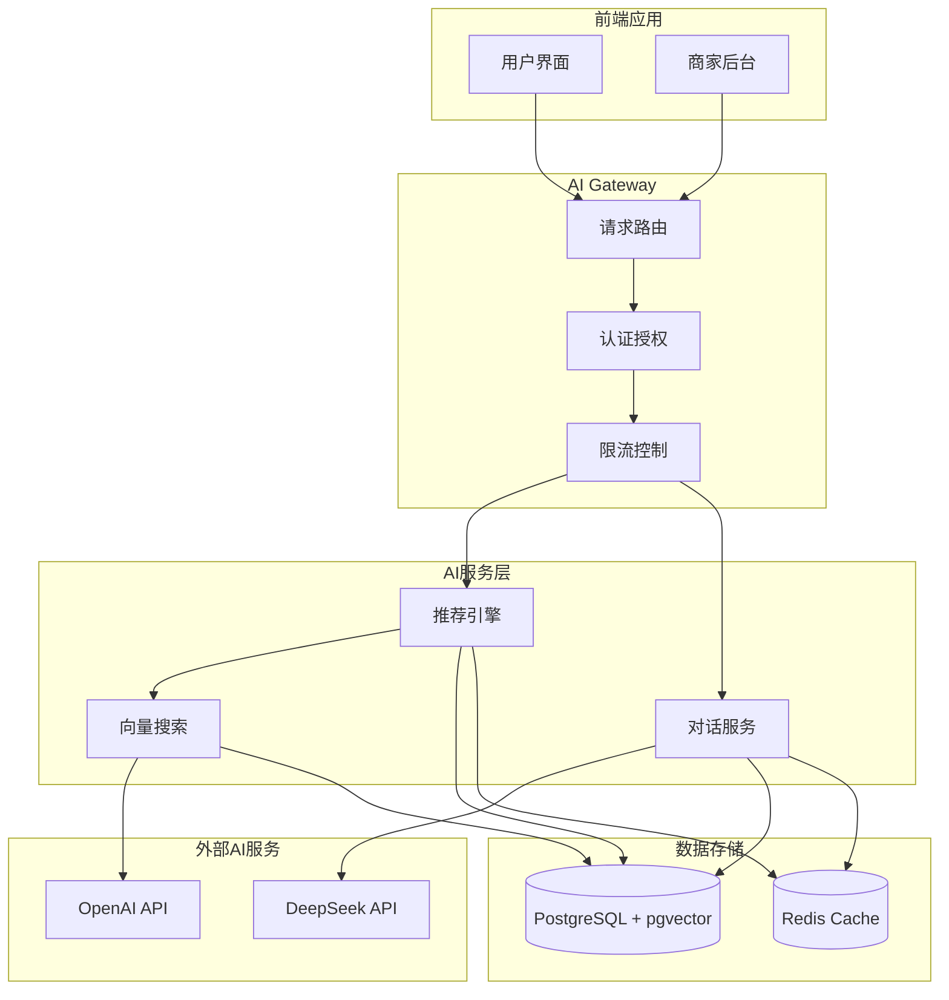

# AI智能营养餐厅系统 - AI服务集成配置

> **文档版本**: 1.0.0  
> **创建日期**: 2025-07-13  
> **更新日期**: 2025-07-13  
> **文档状态**: ✅ 开发就绪  
> **目标受众**: 后端开发团队、AI集成工程师、DevOps团队

## 📋 目录

- [1. AI服务架构概述](#1-ai服务架构概述)
- [2. LangChain集成配置](#2-langchain集成配置)
- [3. DeepSeek API集成](#3-deepseek-api集成)
- [4. 向量数据库配置](#4-向量数据库配置)
- [5. AI推荐服务](#5-ai推荐服务)
- [6. 对话系统配置](#6-对话系统配置)
- [7. 监控和日志](#7-监控和日志)
- [8. 安全配置](#8-安全配置)

---

## 1. AI服务架构概述

### 1.1 AI服务技术栈

```yaml
AI技术架构:
  核心框架:
    LangChain: 0.0.145+
      - 功能: 大模型应用框架
      - 用途: 对话链管理、Prompt工程
      - 集成: DeepSeek API、向量数据库
      
    DeepSeek API: v1
      - 功能: 大语言模型推理
      - 模型: deepseek-chat、deepseek-coder
      - 用途: 营养咨询、智能推荐
      
  向量存储:
    pgvector: 0.5.0+
      - 功能: 向量数据存储和检索
      - 维度: 1536 (OpenAI兼容)
      - 索引: IVFFlat, HNSW
      
  辅助工具:
    OpenAI SDK: 4.24.0+
      - 功能: 向量化、兼容接口
      - 模型: text-embedding-ada-002
      - 用途: 文本向量化
      
服务部署架构:
  AI Gateway:
    - 统一AI服务入口
    - 请求路由和负载均衡
    - API密钥管理
    - 限流和缓存
    
  推荐引擎:
    - 个性化推荐算法
    - 向量相似度计算
    - 实时推荐服务
    - 推荐结果缓存
    
  对话服务:
    - 营养师AI助手
    - 用户咨询机器人
    - 会话状态管理
    - 上下文记忆
```

### 1.2 AI服务交互流程



---

## 2. LangChain集成配置

### 2.1 LangChain环境配置

```typescript
// config/langchain.config.ts
export interface LangChainConfig {
  // DeepSeek配置
  deepseek: {
    apiKey: string;
    baseURL: string;
    model: string;
    maxTokens: number;
    temperature: number;
    timeout: number;
  };
  
  // OpenAI配置 (用于向量化)
  openai: {
    apiKey: string;
    embeddingModel: string;
    maxRetries: number;
    timeout: number;
  };
  
  // 向量数据库配置
  vectorStore: {
    tableName: string;
    dimensions: number;
    indexType: 'ivfflat' | 'hnsw';
    indexParams: Record<string, any>;
  };
  
  // 缓存配置
  cache: {
    enabled: boolean;
    ttl: number;
    maxSize: number;
    keyPrefix: string;
  };
}

export const langChainConfig: LangChainConfig = {
  deepseek: {
    apiKey: process.env.DEEPSEEK_API_KEY,
    baseURL: process.env.DEEPSEEK_API_BASE_URL || 'https://api.deepseek.com',
    model: process.env.DEEPSEEK_MODEL || 'deepseek-chat',
    maxTokens: parseInt(process.env.DEEPSEEK_MAX_TOKENS) || 2048,
    temperature: parseFloat(process.env.DEEPSEEK_TEMPERATURE) || 0.7,
    timeout: parseInt(process.env.DEEPSEEK_TIMEOUT) || 30000,
  },
  
  openai: {
    apiKey: process.env.OPENAI_API_KEY,
    embeddingModel: process.env.OPENAI_EMBEDDING_MODEL || 'text-embedding-ada-002',
    maxRetries: parseInt(process.env.OPENAI_MAX_RETRIES) || 3,
    timeout: parseInt(process.env.OPENAI_TIMEOUT) || 30000,
  },
  
  vectorStore: {
    tableName: process.env.VECTOR_TABLE_NAME || 'vector_embeddings',
    dimensions: parseInt(process.env.VECTOR_DIMENSIONS) || 1536,
    indexType: (process.env.VECTOR_INDEX_TYPE as any) || 'ivfflat',
    indexParams: {
      lists: parseInt(process.env.VECTOR_INDEX_LISTS) || 100,
      m: parseInt(process.env.VECTOR_INDEX_M) || 16,
      efConstruction: parseInt(process.env.VECTOR_INDEX_EF_CONSTRUCTION) || 64,
    },
  },
  
  cache: {
    enabled: process.env.LANGCHAIN_CACHE_ENABLED !== 'false',
    ttl: parseInt(process.env.LANGCHAIN_CACHE_TTL) || 3600,
    maxSize: parseInt(process.env.LANGCHAIN_CACHE_MAX_SIZE) || 1000,
    keyPrefix: process.env.LANGCHAIN_CACHE_PREFIX || 'lc:',
  },
};
```

### 2.2 LangChain服务实现

```typescript
// services/langchain.service.ts
import { Injectable, Logger } from '@nestjs/common';
import { ConfigService } from '@nestjs/config';
import { ChatOpenAI } from '@langchain/openai';
import { OpenAIEmbeddings } from '@langchain/openai';
import { PGVectorStore } from '@langchain/community/vectorstores/pgvector';
import { ConversationChain } from 'langchain/chains';
import { BufferWindowMemory } from 'langchain/memory';
import { PromptTemplate } from '@langchain/core/prompts';
import { Pool } from 'pg';

@Injectable()
export class LangChainService {
  private readonly logger = new Logger(LangChainService.name);
  private readonly config: LangChainConfig;
  private readonly chatModel: ChatOpenAI;
  private readonly embeddings: OpenAIEmbeddings;
  private readonly vectorStore: PGVectorStore;
  private readonly dbPool: Pool;

  constructor(private configService: ConfigService) {
    this.config = this.configService.get<LangChainConfig>('langchain');
    this.initializeServices();
  }

  private async initializeServices() {
    try {
      // 初始化DeepSeek Chat模型
      this.chatModel = new ChatOpenAI({
        openAIApiKey: this.config.deepseek.apiKey,
        configuration: {
          baseURL: this.config.deepseek.baseURL,
        },
        modelName: this.config.deepseek.model,
        maxTokens: this.config.deepseek.maxTokens,
        temperature: this.config.deepseek.temperature,
        timeout: this.config.deepseek.timeout,
      });

      // 初始化OpenAI Embeddings
      this.embeddings = new OpenAIEmbeddings({
        openAIApiKey: this.config.openai.apiKey,
        modelName: this.config.openai.embeddingModel,
        maxRetries: this.config.openai.maxRetries,
        timeout: this.config.openai.timeout,
      });

      // 初始化数据库连接池
      this.dbPool = new Pool({
        connectionString: process.env.DATABASE_URL,
        max: 10,
        idleTimeoutMillis: 30000,
        connectionTimeoutMillis: 2000,
      });

      // 初始化向量存储
      this.vectorStore = await PGVectorStore.initialize(this.embeddings, {
        pool: this.dbPool,
        tableName: this.config.vectorStore.tableName,
        columns: {
          idColumnName: 'id',
          vectorColumnName: 'embedding',
          contentColumnName: 'content',
          metadataColumnName: 'metadata',
        },
        distanceStrategy: 'cosine',
      });

      this.logger.log('LangChain服务初始化完成');
    } catch (error) {
      this.logger.error('LangChain服务初始化失败', error);
      throw error;
    }
  }

  /**
   * 营养咨询对话
   */
  async nutritionConsultation(
    sessionId: string,
    userMessage: string,
    userProfile?: any,
  ): Promise<NutritionChatResponse> {
    try {
      // 构建营养咨询Prompt
      const nutritionPrompt = PromptTemplate.fromTemplate(`
你是一位专业的营养师AI助手，为用户提供个性化的营养建议。

用户档案：
{userProfile}

对话历史：
{chatHistory}

用户问题：{userMessage}

请基于用户的个人信息和饮食目标，提供专业、实用的营养建议。回答要包括：
1. 针对性的营养分析
2. 具体的饮食建议
3. 推荐的菜品（如果适用）
4. 后续问题建议

回答要专业但易懂，避免过于技术性的术语。
`);

      // 创建对话链
      const memory = new BufferWindowMemory({
        k: 10, // 保留最近10轮对话
        memoryKey: 'chatHistory',
        returnMessages: true,
      });

      // 加载历史对话
      await this.loadChatHistory(sessionId, memory);

      const chain = new ConversationChain({
        llm: this.chatModel,
        memory,
        prompt: nutritionPrompt,
      });

      // 执行对话
      const response = await chain.call({
        userMessage,
        userProfile: JSON.stringify(userProfile || {}),
      });

      // 保存对话记录
      await this.saveChatMessage(sessionId, userMessage, response.response);

      // 提取推荐菜品
      const dishRecommendations = await this.extractDishRecommendations(
        response.response,
        userProfile,
      );

      this.logger.log(`营养咨询完成 - 会话ID: ${sessionId}`);

      return {
        sessionId,
        response: response.response,
        dishRecommendations,
        followUpQuestions: this.generateFollowUpQuestions(response.response),
        timestamp: new Date(),
      };
    } catch (error) {
      this.logger.error(`营养咨询失败 - 会话ID: ${sessionId}`, error);
      throw error;
    }
  }

  /**
   * 菜品推荐
   */
  async dishRecommendation(
    userProfile: any,
    preferences: any,
    location?: { lat: number; lng: number },
  ): Promise<DishRecommendationResponse> {
    try {
      // 构建用户偏好向量
      const preferenceText = this.buildPreferenceText(userProfile, preferences);
      const preferenceVector = await this.embeddings.embedQuery(preferenceText);

      // 向量相似度搜索
      const similarDishes = await this.vectorStore.similaritySearch(
        preferenceText,
        10,
        {
          entityType: 'dish',
          isAvailable: true,
        },
      );

      // 使用AI重新排序和个性化
      const personalizedRecommendations = await this.personalizeRecommendations(
        similarDishes,
        userProfile,
        preferences,
      );

      // 添加地理位置筛选
      const locationFilteredDishes = await this.filterByLocation(
        personalizedRecommendations,
        location,
      );

      this.logger.log(`菜品推荐完成 - 用户: ${userProfile.userId}`);

      return {
        recommendations: locationFilteredDishes,
        explanation: await this.generateRecommendationExplanation(
          locationFilteredDishes,
          userProfile,
        ),
        confidence: this.calculateConfidence(locationFilteredDishes),
        timestamp: new Date(),
      };
    } catch (error) {
      this.logger.error('菜品推荐失败', error);
      throw error;
    }
  }

  /**
   * 存储文档向量
   */
  async storeDocumentEmbedding(
    content: string,
    metadata: any,
  ): Promise<string> {
    try {
      const documents = [
        {
          pageContent: content,
          metadata,
        },
      ];

      const ids = await this.vectorStore.addDocuments(documents);
      
      this.logger.log(`文档向量存储成功 - ID: ${ids[0]}`);
      return ids[0];
    } catch (error) {
      this.logger.error('文档向量存储失败', error);
      throw error;
    }
  }

  /**
   * 批量更新菜品向量
   */
  async updateDishEmbeddings(dishes: any[]): Promise<void> {
    try {
      const batchSize = 50;
      
      for (let i = 0; i < dishes.length; i += batchSize) {
        const batch = dishes.slice(i, i + batchSize);
        
        const documents = batch.map(dish => ({
          pageContent: this.buildDishText(dish),
          metadata: {
            entityType: 'dish',
            dishId: dish.id,
            storeId: dish.storeId,
            category: dish.category,
            nutrition: dish.nutrition,
            tags: dish.tags,
            isAvailable: dish.isAvailable,
            updatedAt: new Date().toISOString(),
          },
        }));

        await this.vectorStore.addDocuments(documents);
        
        this.logger.log(`批量更新菜品向量 - 批次 ${Math.floor(i / batchSize) + 1}`);
      }
      
      this.logger.log(`菜品向量批量更新完成 - 总计: ${dishes.length}`);
    } catch (error) {
      this.logger.error('菜品向量批量更新失败', error);
      throw error;
    }
  }

  // 私有辅助方法
  private async loadChatHistory(sessionId: string, memory: BufferWindowMemory): Promise<void> {
    // 从数据库加载历史对话
    const history = await this.getChatHistory(sessionId);
    
    for (const message of history) {
      if (message.role === 'user') {
        await memory.chatMemory.addUserMessage(message.content);
      } else {
        await memory.chatMemory.addAIChatMessage(message.content);
      }
    }
  }

  private async saveChatMessage(
    sessionId: string,
    userMessage: string,
    aiResponse: string,
  ): Promise<void> {
    // 保存对话记录到数据库
    // 实现具体的数据库操作
  }

  private buildPreferenceText(userProfile: any, preferences: any): string {
    const parts = [];
    
    if (userProfile?.dietaryRestrictions?.length) {
      parts.push(`饮食限制: ${userProfile.dietaryRestrictions.join(', ')}`);
    }
    
    if (preferences?.cuisineTypes?.length) {
      parts.push(`菜系偏好: ${preferences.cuisineTypes.join(', ')}`);
    }
    
    if (preferences?.maxCalories) {
      parts.push(`最大热量: ${preferences.maxCalories}卡路里`);
    }
    
    if (userProfile?.healthGoals?.length) {
      parts.push(`健康目标: ${userProfile.healthGoals.join(', ')}`);
    }
    
    return parts.join('; ');
  }

  private buildDishText(dish: any): string {
    const parts = [
      `菜品名称: ${dish.name}`,
      `描述: ${dish.description}`,
      `分类: ${dish.category}`,
    ];
    
    if (dish.nutrition) {
      parts.push(`营养信息: 热量${dish.nutrition.calories}卡路里, 蛋白质${dish.nutrition.protein}g, 碳水${dish.nutrition.carbs}g, 脂肪${dish.nutrition.fat}g`);
    }
    
    if (dish.tags?.length) {
      parts.push(`标签: ${dish.tags.join(', ')}`);
    }
    
    if (dish.ingredients?.length) {
      const mainIngredients = dish.ingredients
        .filter(ing => ing.isMain)
        .map(ing => ing.name)
        .join(', ');
      parts.push(`主要食材: ${mainIngredients}`);
    }
    
    return parts.join('; ');
  }

  private async personalizeRecommendations(
    dishes: any[],
    userProfile: any,
    preferences: any,
  ): Promise<any[]> {
    // 使用AI对推荐结果进行个性化排序
    const personalizePrompt = `
基于用户档案和偏好，对以下菜品进行个性化排序和评分：

用户档案：${JSON.stringify(userProfile)}
用户偏好：${JSON.stringify(preferences)}

菜品列表：
${dishes.map((dish, index) => `${index + 1}. ${dish.pageContent}`).join('\n')}

请返回JSON格式的排序结果，包含推荐理由和匹配度评分（0-1）。
`;

    try {
      const response = await this.chatModel.call([
        { role: 'user', content: personalizePrompt },
      ]);
      
      // 解析AI响应并重新排序
      const personalizedResults = JSON.parse(response.content);
      return personalizedResults;
    } catch (error) {
      this.logger.warn('个性化排序失败，使用默认排序', error);
      return dishes.map((dish, index) => ({
        ...dish,
        score: 1 - index * 0.1,
        reason: '基于向量相似度推荐',
      }));
    }
  }

  private async filterByLocation(
    dishes: any[],
    location?: { lat: number; lng: number },
  ): Promise<any[]> {
    if (!location) return dishes;
    
    // 根据位置筛选附近的餐厅
    // 这里应该结合实际的地理位置查询逻辑
    return dishes;
  }

  private async generateRecommendationExplanation(
    dishes: any[],
    userProfile: any,
  ): Promise<string> {
    const explanationPrompt = `
为用户解释为什么推荐这些菜品：

用户档案：${JSON.stringify(userProfile)}
推荐菜品：${dishes.slice(0, 3).map(dish => dish.name).join(', ')}

请用简洁友好的语言解释推荐理由。
`;

    try {
      const response = await this.chatModel.call([
        { role: 'user', content: explanationPrompt },
      ]);
      
      return response.content;
    } catch (error) {
      this.logger.warn('生成推荐解释失败', error);
      return '基于您的偏好和营养需求，我们为您精选了这些菜品。';
    }
  }

  private calculateConfidence(recommendations: any[]): number {
    if (!recommendations.length) return 0;
    
    const avgScore = recommendations.reduce((sum, rec) => sum + (rec.score || 0), 0) / recommendations.length;
    return Math.round(avgScore * 100) / 100;
  }

  private generateFollowUpQuestions(response: string): string[] {
    // 基于AI响应生成后续问题建议
    const commonQuestions = [
      '您还有其他饮食限制吗？',
      '您希望了解具体的烹饪方法吗？',
      '您需要制定一周的饮食计划吗？',
      '您想了解如何搭配其他食物吗？',
    ];
    
    return commonQuestions.slice(0, 2);
  }

  private async getChatHistory(sessionId: string): Promise<any[]> {
    // 从数据库获取聊天历史
    const query = `
      SELECT role, content, created_at
      FROM ai_messages 
      WHERE session_id = $1 
      ORDER BY created_at ASC 
      LIMIT 20
    `;
    
    try {
      const result = await this.dbPool.query(query, [sessionId]);
      return result.rows;
    } catch (error) {
      this.logger.error('获取聊天历史失败', error);
      return [];
    }
  }
}

// 类型定义
interface NutritionChatResponse {
  sessionId: string;
  response: string;
  dishRecommendations?: any[];
  followUpQuestions: string[];
  timestamp: Date;
}

interface DishRecommendationResponse {
  recommendations: any[];
  explanation: string;
  confidence: number;
  timestamp: Date;
}
```

---

## 3. DeepSeek API集成

### 3.1 DeepSeek API配置

```typescript
// config/deepseek.config.ts
export interface DeepSeekConfig {
  apiKey: string;
  baseURL: string;
  models: {
    chat: string;
    coder: string;
    embedding: string;
  };
  limits: {
    maxTokens: number;
    maxRequestsPerMinute: number;
    maxRequestsPerDay: number;
    timeout: number;
  };
  retry: {
    maxRetries: number;
    backoffMultiplier: number;
    maxBackoffTime: number;
  };
  cache: {
    enabled: boolean;
    ttl: number;
    keyPrefix: string;
  };
}

export const deepSeekConfig: DeepSeekConfig = {
  apiKey: process.env.DEEPSEEK_API_KEY,
  baseURL: process.env.DEEPSEEK_API_BASE_URL || 'https://api.deepseek.com',
  
  models: {
    chat: process.env.DEEPSEEK_CHAT_MODEL || 'deepseek-chat',
    coder: process.env.DEEPSEEK_CODER_MODEL || 'deepseek-coder',
    embedding: process.env.DEEPSEEK_EMBEDDING_MODEL || 'deepseek-embedding',
  },
  
  limits: {
    maxTokens: parseInt(process.env.DEEPSEEK_MAX_TOKENS) || 4096,
    maxRequestsPerMinute: parseInt(process.env.DEEPSEEK_RPM_LIMIT) || 60,
    maxRequestsPerDay: parseInt(process.env.DEEPSEEK_RPD_LIMIT) || 10000,
    timeout: parseInt(process.env.DEEPSEEK_TIMEOUT) || 30000,
  },
  
  retry: {
    maxRetries: parseInt(process.env.DEEPSEEK_MAX_RETRIES) || 3,
    backoffMultiplier: parseFloat(process.env.DEEPSEEK_BACKOFF_MULTIPLIER) || 2,
    maxBackoffTime: parseInt(process.env.DEEPSEEK_MAX_BACKOFF) || 60000,
  },
  
  cache: {
    enabled: process.env.DEEPSEEK_CACHE_ENABLED !== 'false',
    ttl: parseInt(process.env.DEEPSEEK_CACHE_TTL) || 3600,
    keyPrefix: process.env.DEEPSEEK_CACHE_PREFIX || 'ds:',
  },
};
```

### 3.2 DeepSeek服务实现

```typescript
// services/deepseek.service.ts
import { Injectable, Logger } from '@nestjs/common';
import { ConfigService } from '@nestjs/config';
import { HttpService } from '@nestjs/axios';
import { RedisService } from './redis.service';
import { DeepSeekConfig } from '../config/deepseek.config';
import { AxiosRequestConfig, AxiosError } from 'axios';

@Injectable()
export class DeepSeekService {
  private readonly logger = new Logger(DeepSeekService.name);
  private readonly config: DeepSeekConfig;
  private requestCount = 0;
  private lastResetTime = Date.now();

  constructor(
    private configService: ConfigService,
    private httpService: HttpService,
    private redisService: RedisService,
  ) {
    this.config = this.configService.get<DeepSeekConfig>('deepseek');
  }

  /**
   * 营养分析对话
   */
  async nutritionAnalysis(
    userInput: string,
    nutritionData: any,
    userProfile?: any,
  ): Promise<DeepSeekResponse> {
    const prompt = this.buildNutritionAnalysisPrompt(userInput, nutritionData, userProfile);
    
    return this.chatCompletion({
      model: this.config.models.chat,
      messages: [
        {
          role: 'system',
          content: '你是一位专业的营养师，擅长分析食物营养成分并提供健康建议。请用专业但易懂的语言回答用户问题。',
        },
        {
          role: 'user',
          content: prompt,
        },
      ],
      temperature: 0.7,
      max_tokens: 1024,
    });
  }

  /**
   * 菜品描述生成
   */
  async generateDishDescription(
    dishName: string,
    ingredients: string[],
    nutritionInfo: any,
    tags?: string[],
  ): Promise<DeepSeekResponse> {
    const prompt = `
请为以下菜品生成一段吸引人的描述：

菜品名称：${dishName}
主要食材：${ingredients.join(', ')}
营养信息：热量${nutritionInfo.calories}卡路里，蛋白质${nutritionInfo.protein}g，碳水${nutritionInfo.carbs}g，脂肪${nutritionInfo.fat}g
特色标签：${tags ? tags.join(', ') : '无'}

请生成一段50-100字的菜品描述，突出营养价值和口感特色，语言要生动有吸引力。
`;

    return this.chatCompletion({
      model: this.config.models.chat,
      messages: [
        {
          role: 'system',
          content: '你是一位资深美食文案专家，擅长撰写吸引人的菜品描述。',
        },
        {
          role: 'user',
          content: prompt,
        },
      ],
      temperature: 0.8,
      max_tokens: 200,
    });
  }

  /**
   * 智能库存管理建议
   */
  async inventoryManagementAdvice(
    currentStock: any[],
    salesHistory: any[],
    seasonalFactors?: any,
  ): Promise<DeepSeekResponse> {
    const prompt = this.buildInventoryAnalysisPrompt(currentStock, salesHistory, seasonalFactors);
    
    return this.chatCompletion({
      model: this.config.models.chat,
      messages: [
        {
          role: 'system',
          content: '你是一位库存管理专家，擅长分析销售数据和库存情况，提供智能补货建议。',
        },
        {
          role: 'user',
          content: prompt,
        },
      ],
      temperature: 0.3,
      max_tokens: 1024,
    });
  }

  /**
   * 营养计划制定
   */
  async createNutritionPlan(
    userProfile: any,
    goals: string[],
    preferences: any,
    restrictions: string[],
  ): Promise<DeepSeekResponse> {
    const prompt = `
请为用户制定一个个性化的营养计划：

用户信息：
- 年龄：${userProfile.age}岁
- 性别：${userProfile.gender}
- 身高：${userProfile.height}cm
- 体重：${userProfile.weight}kg
- 活动水平：${userProfile.activityLevel}
- 目标体重：${userProfile.targetWeight || '维持当前体重'}kg

健康目标：${goals.join(', ')}
饮食偏好：${JSON.stringify(preferences)}
饮食限制：${restrictions.join(', ')}

请制定一个7天的营养计划，包括：
1. 每日营养目标（卡路里、蛋白质、碳水、脂肪）
2. 一日三餐的建议搭配
3. 健康小贴士
4. 注意事项

请用JSON格式返回，结构清晰易于解析。
`;

    return this.chatCompletion({
      model: this.config.models.chat,
      messages: [
        {
          role: 'system',
          content: '你是一位专业的营养师，精通制定个性化营养计划。请提供科学、实用的建议。',
        },
        {
          role: 'user',
          content: prompt,
        },
      ],
      temperature: 0.5,
      max_tokens: 2048,
    });
  }

  /**
   * 通用聊天完成接口
   */
  async chatCompletion(request: DeepSeekChatRequest): Promise<DeepSeekResponse> {
    // 检查缓存
    if (this.config.cache.enabled) {
      const cacheKey = this.generateCacheKey(request);
      const cachedResponse = await this.redisService.get(cacheKey);
      
      if (cachedResponse) {
        this.logger.log('返回缓存的DeepSeek响应');
        return JSON.parse(cachedResponse);
      }
    }

    // 限流检查
    await this.checkRateLimit();

    try {
      const response = await this.makeRequest('/chat/completions', request);
      
      // 缓存响应
      if (this.config.cache.enabled && response.choices?.[0]?.message) {
        const cacheKey = this.generateCacheKey(request);
        await this.redisService.setex(
          cacheKey,
          this.config.cache.ttl,
          JSON.stringify(response),
        );
      }

      this.logger.log(`DeepSeek API调用成功 - 模型: ${request.model}`);
      return response;
      
    } catch (error) {
      this.logger.error('DeepSeek API调用失败', error);
      throw this.handleAPIError(error);
    }
  }

  /**
   * 健康检查
   */
  async healthCheck(): Promise<boolean> {
    try {
      const response = await this.chatCompletion({
        model: this.config.models.chat,
        messages: [
          {
            role: 'user',
            content: 'Hello, this is a health check.',
          },
        ],
        max_tokens: 10,
      });

      return !!response.choices?.[0]?.message;
    } catch (error) {
      this.logger.error('DeepSeek健康检查失败', error);
      return false;
    }
  }

  // 私有方法
  private async makeRequest(endpoint: string, data: any): Promise<any> {
    const config: AxiosRequestConfig = {
      method: 'POST',
      url: `${this.config.baseURL}${endpoint}`,
      headers: {
        'Authorization': `Bearer ${this.config.apiKey}`,
        'Content-Type': 'application/json',
      },
      data,
      timeout: this.config.limits.timeout,
    };

    for (let attempt = 0; attempt <= this.config.retry.maxRetries; attempt++) {
      try {
        const response = await this.httpService.request(config).toPromise();
        return response.data;
      } catch (error) {
        if (attempt === this.config.retry.maxRetries) {
          throw error;
        }

        const backoffTime = Math.min(
          1000 * Math.pow(this.config.retry.backoffMultiplier, attempt),
          this.config.retry.maxBackoffTime,
        );

        this.logger.warn(`DeepSeek API重试 - 尝试 ${attempt + 1}/${this.config.retry.maxRetries + 1}，${backoffTime}ms后重试`);
        await this.sleep(backoffTime);
      }
    }
  }

  private async checkRateLimit(): Promise<void> {
    const now = Date.now();
    
    // 重置计数器（每分钟）
    if (now - this.lastResetTime > 60000) {
      this.requestCount = 0;
      this.lastResetTime = now;
    }

    // 检查分钟限制
    if (this.requestCount >= this.config.limits.maxRequestsPerMinute) {
      const waitTime = 60000 - (now - this.lastResetTime);
      throw new Error(`DeepSeek API分钟限流，请等待 ${Math.ceil(waitTime / 1000)} 秒`);
    }

    this.requestCount++;
  }

  private generateCacheKey(request: DeepSeekChatRequest): string {
    const key = JSON.stringify({
      model: request.model,
      messages: request.messages,
      temperature: request.temperature,
      max_tokens: request.max_tokens,
    });
    
    return `${this.config.cache.keyPrefix}${this.hashString(key)}`;
  }

  private hashString(str: string): string {
    // 简单的哈希函数
    let hash = 0;
    for (let i = 0; i < str.length; i++) {
      const char = str.charCodeAt(i);
      hash = ((hash << 5) - hash) + char;
      hash = hash & hash; // 转换为32位整数
    }
    return Math.abs(hash).toString(36);
  }

  private buildNutritionAnalysisPrompt(
    userInput: string,
    nutritionData: any,
    userProfile?: any,
  ): string {
    return `
用户问题：${userInput}

营养数据：
${JSON.stringify(nutritionData, null, 2)}

${userProfile ? `用户档案：
- 年龄：${userProfile.age}岁
- 性别：${userProfile.gender}
- BMI：${userProfile.bmi || '未知'}
- 活动水平：${userProfile.activityLevel || '未知'}
- 健康目标：${userProfile.goals?.join(', ') || '未知'}
- 饮食限制：${userProfile.restrictions?.join(', ') || '无'}` : ''}

请基于以上信息，为用户提供专业的营养分析和建议。
`;
  }

  private buildInventoryAnalysisPrompt(
    currentStock: any[],
    salesHistory: any[],
    seasonalFactors?: any,
  ): string {
    return `
当前库存情况：
${currentStock.map(item => `${item.name}: 库存${item.quantity}${item.unit}, 安全库存${item.safetyStock}${item.unit}`).join('\n')}

销售历史（最近30天）：
${salesHistory.map(record => `${record.date}: ${record.itemName} 销售${record.quantity}${record.unit}`).join('\n')}

${seasonalFactors ? `季节性因素：
${JSON.stringify(seasonalFactors, null, 2)}` : ''}

请分析库存情况并提供以下建议：
1. 哪些商品需要立即补货
2. 建议的补货数量
3. 未来一周的销售预测
4. 库存优化建议

请用JSON格式返回分析结果。
`;
  }

  private handleAPIError(error: any): Error {
    if (error.response) {
      const status = error.response.status;
      const message = error.response.data?.error?.message || error.message;
      
      switch (status) {
        case 401:
          return new Error('DeepSeek API认证失败，请检查API密钥');
        case 429:
          return new Error('DeepSeek API请求频率过高，请稍后重试');
        case 500:
          return new Error('DeepSeek API服务器错误，请稍后重试');
        default:
          return new Error(`DeepSeek API错误 (${status}): ${message}`);
      }
    }
    
    return new Error(`DeepSeek API请求失败: ${error.message}`);
  }

  private sleep(ms: number): Promise<void> {
    return new Promise(resolve => setTimeout(resolve, ms));
  }
}

// 类型定义
interface DeepSeekChatRequest {
  model: string;
  messages: Array<{
    role: 'system' | 'user' | 'assistant';
    content: string;
  }>;
  temperature?: number;
  max_tokens?: number;
  top_p?: number;
  frequency_penalty?: number;
  presence_penalty?: number;
  stop?: string[];
}

interface DeepSeekResponse {
  id: string;
  object: string;
  created: number;
  model: string;
  choices: Array<{
    index: number;
    message: {
      role: string;
      content: string;
    };
    finish_reason: string;
  }>;
  usage: {
    prompt_tokens: number;
    completion_tokens: number;
    total_tokens: number;
  };
}
```

---

## 4. 向量数据库配置

### 4.1 pgvector扩展配置

```sql
-- PostgreSQL + pgvector 配置

-- 启用pgvector扩展
CREATE EXTENSION IF NOT EXISTS vector;
CREATE EXTENSION IF NOT EXISTS pg_stat_statements;

-- 创建向量嵌入表
CREATE TABLE IF NOT EXISTS vector_embeddings (
    id UUID PRIMARY KEY DEFAULT gen_random_uuid(),
    entity_type VARCHAR(50) NOT NULL,
    entity_id VARCHAR(255) NOT NULL,
    content TEXT NOT NULL,
    embedding vector(1536) NOT NULL,
    metadata JSONB,
    created_at TIMESTAMP WITH TIME ZONE DEFAULT NOW(),
    updated_at TIMESTAMP WITH TIME ZONE DEFAULT NOW(),
    
    CONSTRAINT unique_entity_embedding UNIQUE(entity_type, entity_id)
);

-- 创建索引
CREATE INDEX CONCURRENTLY IF NOT EXISTS idx_vector_embeddings_entity_type 
ON vector_embeddings(entity_type);

CREATE INDEX CONCURRENTLY IF NOT EXISTS idx_vector_embeddings_entity_id 
ON vector_embeddings(entity_id);

CREATE INDEX CONCURRENTLY IF NOT EXISTS idx_vector_embeddings_created_at 
ON vector_embeddings(created_at DESC);

-- 创建向量相似度索引 (IVFFlat)
CREATE INDEX CONCURRENTLY IF NOT EXISTS idx_vector_embeddings_embedding_ivfflat
ON vector_embeddings USING ivfflat (embedding vector_cosine_ops)
WITH (lists = 100);

-- 创建向量相似度索引 (HNSW) - 更好的查询性能
CREATE INDEX CONCURRENTLY IF NOT EXISTS idx_vector_embeddings_embedding_hnsw
ON vector_embeddings USING hnsw (embedding vector_cosine_ops)
WITH (m = 16, ef_construction = 64);

-- 创建复合索引 (实体类型 + 向量)
CREATE INDEX CONCURRENTLY IF NOT EXISTS idx_vector_embeddings_type_embedding
ON vector_embeddings(entity_type) INCLUDE (embedding);

-- 更新时间触发器
CREATE OR REPLACE FUNCTION update_updated_at_column()
RETURNS TRIGGER AS $$
BEGIN
    NEW.updated_at = NOW();
    RETURN NEW;
END;
$$ language 'plpgsql';

CREATE TRIGGER update_vector_embeddings_updated_at 
    BEFORE UPDATE ON vector_embeddings 
    FOR EACH ROW EXECUTE FUNCTION update_updated_at_column();

-- 向量搜索优化函数
CREATE OR REPLACE FUNCTION find_similar_dishes(
    query_embedding vector(1536),
    similarity_threshold FLOAT DEFAULT 0.8,
    result_limit INT DEFAULT 10,
    store_ids UUID[] DEFAULT NULL
) RETURNS TABLE (
    dish_id VARCHAR(255),
    similarity FLOAT,
    content TEXT,
    metadata JSONB
) AS $$
BEGIN
    RETURN QUERY
    SELECT 
        ve.entity_id as dish_id,
        1 - (ve.embedding <=> query_embedding) as similarity,
        ve.content,
        ve.metadata
    FROM vector_embeddings ve
    WHERE ve.entity_type = 'dish'
        AND (store_ids IS NULL OR (ve.metadata->>'storeId')::UUID = ANY(store_ids))
        AND (ve.metadata->>'isAvailable')::boolean = true
        AND (1 - (ve.embedding <=> query_embedding)) >= similarity_threshold
    ORDER BY ve.embedding <=> query_embedding
    LIMIT result_limit;
END;
$$ LANGUAGE plpgsql;

-- 向量嵌入统计视图
CREATE OR REPLACE VIEW vector_embeddings_stats AS
SELECT 
    entity_type,
    COUNT(*) as total_embeddings,
    COUNT(*) FILTER (WHERE created_at > NOW() - INTERVAL '24 hours') as new_today,
    COUNT(*) FILTER (WHERE updated_at > NOW() - INTERVAL '24 hours') as updated_today,
    MIN(created_at) as first_created,
    MAX(updated_at) as last_updated
FROM vector_embeddings
GROUP BY entity_type;

-- 性能监控查询
CREATE OR REPLACE VIEW vector_performance_stats AS
SELECT 
    schemaname,
    tablename,
    indexname,
    idx_scan as index_scans,
    idx_tup_read as tuples_read,
    idx_tup_fetch as tuples_fetched
FROM pg_stat_user_indexes 
WHERE tablename = 'vector_embeddings'
ORDER BY idx_scan DESC;
```

### 4.2 向量操作服务

```typescript
// services/vector.service.ts
import { Injectable, Logger } from '@nestjs/common';
import { InjectRepository } from '@nestjs/typeorm';
import { Repository } from 'typeorm';
import { VectorEmbedding } from '../entities/vector-embedding.entity';
import { OpenAIEmbeddings } from '@langchain/openai';

@Injectable()
export class VectorService {
  private readonly logger = new Logger(VectorService.name);
  private readonly embeddings: OpenAIEmbeddings;

  constructor(
    @InjectRepository(VectorEmbedding)
    private vectorRepository: Repository<VectorEmbedding>,
  ) {
    this.embeddings = new OpenAIEmbeddings({
      openAIApiKey: process.env.OPENAI_API_KEY,
      modelName: 'text-embedding-ada-002',
    });
  }

  /**
   * 生成并存储实体向量
   */
  async createEmbedding(
    entityType: string,
    entityId: string,
    content: string,
    metadata?: any,
  ): Promise<VectorEmbedding> {
    try {
      // 生成向量
      const embeddingVector = await this.embeddings.embedQuery(content);
      
      // 检查是否已存在
      const existing = await this.vectorRepository.findOne({
        where: { entityType, entityId },
      });

      let vectorEmbedding: VectorEmbedding;
      
      if (existing) {
        // 更新现有向量
        existing.content = content;
        existing.embedding = embeddingVector;
        existing.metadata = metadata;
        vectorEmbedding = await this.vectorRepository.save(existing);
        this.logger.log(`更新向量嵌入: ${entityType}/${entityId}`);
      } else {
        // 创建新向量
        vectorEmbedding = this.vectorRepository.create({
          entityType,
          entityId,
          content,
          embedding: embeddingVector,
          metadata,
        });
        vectorEmbedding = await this.vectorRepository.save(vectorEmbedding);
        this.logger.log(`创建向量嵌入: ${entityType}/${entityId}`);
      }

      return vectorEmbedding;
    } catch (error) {
      this.logger.error(`创建向量嵌入失败: ${entityType}/${entityId}`, error);
      throw error;
    }
  }

  /**
   * 相似度搜索
   */
  async similaritySearch(
    queryText: string,
    entityType: string,
    limit: number = 10,
    threshold: number = 0.8,
    filters?: any,
  ): Promise<SimilaritySearchResult[]> {
    try {
      // 生成查询向量
      const queryEmbedding = await this.embeddings.embedQuery(queryText);
      
      // 构建SQL查询
      let query = `
        SELECT 
          entity_id,
          content,
          metadata,
          1 - (embedding <=> $1::vector) as similarity
        FROM vector_embeddings
        WHERE entity_type = $2
          AND (1 - (embedding <=> $1::vector)) >= $3
      `;
      
      const params: any[] = [JSON.stringify(queryEmbedding), entityType, threshold];
      let paramIndex = 4;

      // 添加过滤条件
      if (filters) {
        Object.entries(filters).forEach(([key, value]) => {
          query += ` AND metadata->>'${key}' = $${paramIndex}`;
          params.push(value);
          paramIndex++;
        });
      }

      query += ` ORDER BY embedding <=> $1::vector LIMIT $${paramIndex}`;
      params.push(limit);

      const results = await this.vectorRepository.query(query, params);
      
      this.logger.log(`相似度搜索完成: 查询"${queryText}", 返回${results.length}条结果`);
      
      return results.map(row => ({
        entityId: row.entity_id,
        content: row.content,
        metadata: row.metadata,
        similarity: parseFloat(row.similarity),
      }));
    } catch (error) {
      this.logger.error('相似度搜索失败', error);
      throw error;
    }
  }

  /**
   * 批量创建向量
   */
  async batchCreateEmbeddings(
    items: Array<{
      entityType: string;
      entityId: string;
      content: string;
      metadata?: any;
    }>,
  ): Promise<void> {
    const batchSize = 100;
    const totalBatches = Math.ceil(items.length / batchSize);
    
    this.logger.log(`开始批量创建向量: ${items.length}个项目, ${totalBatches}个批次`);

    for (let i = 0; i < items.length; i += batchSize) {
      const batch = items.slice(i, i + batchSize);
      const batchNumber = Math.floor(i / batchSize) + 1;
      
      try {
        // 生成批量向量
        const contents = batch.map(item => item.content);
        const embeddings = await this.embeddings.embedDocuments(contents);
        
        // 准备数据库插入数据
        const vectorData = batch.map((item, index) => ({
          entityType: item.entityType,
          entityId: item.entityId,
          content: item.content,
          embedding: embeddings[index],
          metadata: item.metadata,
        }));

        // 使用upsert避免重复
        await this.vectorRepository
          .createQueryBuilder()
          .insert()
          .into(VectorEmbedding)
          .values(vectorData)
          .orUpdate(['content', 'embedding', 'metadata', 'updated_at'], ['entity_type', 'entity_id'])
          .execute();

        this.logger.log(`批次 ${batchNumber}/${totalBatches} 完成: ${batch.length}个向量`);
        
        // 避免过快请求API
        if (i + batchSize < items.length) {
          await this.sleep(1000);
        }
      } catch (error) {
        this.logger.error(`批次 ${batchNumber} 失败`, error);
        throw error;
      }
    }
    
    this.logger.log(`批量向量创建完成: 总计${items.length}个`);
  }

  /**
   * 删除实体向量
   */
  async deleteEmbedding(entityType: string, entityId: string): Promise<void> {
    try {
      await this.vectorRepository.delete({ entityType, entityId });
      this.logger.log(`删除向量嵌入: ${entityType}/${entityId}`);
    } catch (error) {
      this.logger.error(`删除向量嵌入失败: ${entityType}/${entityId}`, error);
      throw error;
    }
  }

  /**
   * 获取向量统计信息
   */
  async getVectorStats(): Promise<VectorStats[]> {
    try {
      const stats = await this.vectorRepository.query(`
        SELECT * FROM vector_embeddings_stats ORDER BY total_embeddings DESC
      `);
      
      return stats.map(stat => ({
        entityType: stat.entity_type,
        totalEmbeddings: parseInt(stat.total_embeddings),
        newToday: parseInt(stat.new_today),
        updatedToday: parseInt(stat.updated_today),
        firstCreated: stat.first_created,
        lastUpdated: stat.last_updated,
      }));
    } catch (error) {
      this.logger.error('获取向量统计失败', error);
      throw error;
    }
  }

  /**
   * 向量索引优化
   */
  async optimizeVectorIndex(): Promise<void> {
    try {
      // 重建向量索引
      await this.vectorRepository.query('REINDEX INDEX CONCURRENTLY idx_vector_embeddings_embedding_hnsw');
      
      // 更新表统计信息
      await this.vectorRepository.query('ANALYZE vector_embeddings');
      
      this.logger.log('向量索引优化完成');
    } catch (error) {
      this.logger.error('向量索引优化失败', error);
      throw error;
    }
  }

  private sleep(ms: number): Promise<void> {
    return new Promise(resolve => setTimeout(resolve, ms));
  }
}

// 类型定义
interface SimilaritySearchResult {
  entityId: string;
  content: string;
  metadata: any;
  similarity: number;
}

interface VectorStats {
  entityType: string;
  totalEmbeddings: number;
  newToday: number;
  updatedToday: number;
  firstCreated: Date;
  lastUpdated: Date;
}
```

---

## 7. 监控和日志

### 7.1 AI服务监控配置

```typescript
// monitoring/ai-monitoring.service.ts
import { Injectable, Logger } from '@nestjs/common';
import { ConfigService } from '@nestjs/config';
import { Metrics } from '@opentelemetry/api-metrics';
import { RedisService } from '../services/redis.service';

@Injectable()
export class AIMonitoringService {
  private readonly logger = new Logger(AIMonitoringService.name);
  private readonly metrics: any;

  constructor(
    private configService: ConfigService,
    private redisService: RedisService,
  ) {
    this.initializeMetrics();
  }

  private initializeMetrics() {
    // 初始化监控指标
    this.metrics = {
      // API调用计数
      apiCalls: this.createCounter('ai_api_calls_total', 'AI API调用总数'),
      
      // API响应时间
      apiLatency: this.createHistogram('ai_api_latency_seconds', 'AI API响应时间'),
      
      // API错误计数
      apiErrors: this.createCounter('ai_api_errors_total', 'AI API错误总数'),
      
      // Token使用量
      tokenUsage: this.createCounter('ai_token_usage_total', 'AI Token使用总数'),
      
      // 向量搜索性能
      vectorSearchLatency: this.createHistogram('vector_search_latency_seconds', '向量搜索响应时间'),
      
      // 缓存命中率
      cacheHitRate: this.createGauge('ai_cache_hit_rate', 'AI缓存命中率'),
    };
  }

  /**
   * 记录API调用
   */
  recordAPICall(
    service: string,
    model: string,
    success: boolean,
    duration: number,
    tokenUsage?: { prompt: number; completion: number },
  ): void {
    // 记录调用次数
    this.metrics.apiCalls.add(1, {
      service,
      model,
      status: success ? 'success' : 'error',
    });

    // 记录响应时间
    this.metrics.apiLatency.record(duration / 1000, {
      service,
      model,
    });

    // 记录错误
    if (!success) {
      this.metrics.apiErrors.add(1, {
        service,
        model,
      });
    }

    // 记录Token使用
    if (tokenUsage) {
      this.metrics.tokenUsage.add(tokenUsage.prompt, {
        service,
        model,
        type: 'prompt',
      });
      
      this.metrics.tokenUsage.add(tokenUsage.completion, {
        service,
        model,
        type: 'completion',
      });
    }

    // 记录到Redis (用于实时监控)
    this.recordToRedis('ai_metrics', {
      timestamp: Date.now(),
      service,
      model,
      success,
      duration,
      tokenUsage,
    });
  }

  /**
   * 记录向量搜索性能
   */
  recordVectorSearch(
    entityType: string,
    resultCount: number,
    duration: number,
    similarity: number,
  ): void {
    this.metrics.vectorSearchLatency.record(duration / 1000, {
      entity_type: entityType,
    });

    this.recordToRedis('vector_metrics', {
      timestamp: Date.now(),
      entityType,
      resultCount,
      duration,
      similarity,
    });
  }

  /**
   * 记录缓存性能
   */
  recordCachePerformance(hit: boolean, service: string): void {
    // 更新缓存命中率
    const key = `cache_stats:${service}`;
    this.updateCacheStats(key, hit);
  }

  /**
   * 获取AI服务状态
   */
  async getAIServiceStatus(): Promise<AIServiceStatus> {
    try {
      const now = Date.now();
      const oneHourAgo = now - 60 * 60 * 1000;

      // 从Redis获取最近一小时的指标
      const metrics = await this.getMetricsFromRedis('ai_metrics', oneHourAgo, now);
      
      const totalCalls = metrics.length;
      const successfulCalls = metrics.filter(m => m.success).length;
      const averageLatency = metrics.reduce((sum, m) => sum + m.duration, 0) / totalCalls || 0;
      const totalTokens = metrics.reduce((sum, m) => {
        return sum + (m.tokenUsage?.prompt || 0) + (m.tokenUsage?.completion || 0);
      }, 0);

      return {
        status: successfulCalls / totalCalls > 0.95 ? 'healthy' : 'degraded',
        totalCalls,
        successRate: successfulCalls / totalCalls,
        averageLatency: Math.round(averageLatency),
        totalTokens,
        lastUpdated: new Date(),
      };
    } catch (error) {
      this.logger.error('获取AI服务状态失败', error);
      return {
        status: 'unknown',
        totalCalls: 0,
        successRate: 0,
        averageLatency: 0,
        totalTokens: 0,
        lastUpdated: new Date(),
      };
    }
  }

  /**
   * 获取成本分析
   */
  async getCostAnalysis(timeRange: { start: Date; end: Date }): Promise<CostAnalysis> {
    try {
      const metrics = await this.getMetricsFromRedis(
        'ai_metrics',
        timeRange.start.getTime(),
        timeRange.end.getTime(),
      );

      const costByService = new Map<string, number>();
      let totalCost = 0;

      metrics.forEach(metric => {
        const cost = this.calculateCost(metric.service, metric.model, metric.tokenUsage);
        const serviceCost = costByService.get(metric.service) || 0;
        costByService.set(metric.service, serviceCost + cost);
        totalCost += cost;
      });

      return {
        totalCost,
        costByService: Object.fromEntries(costByService),
        period: timeRange,
        averageCostPerCall: totalCost / metrics.length || 0,
      };
    } catch (error) {
      this.logger.error('获取成本分析失败', error);
      throw error;
    }
  }

  // 私有辅助方法
  private createCounter(name: string, description: string): any {
    // 实际实现会使用OpenTelemetry的Counter
    return {
      add: (value: number, labels?: any) => {
        this.logger.debug(`Counter ${name}: +${value}`, labels);
      },
    };
  }

  private createHistogram(name: string, description: string): any {
    // 实际实现会使用OpenTelemetry的Histogram
    return {
      record: (value: number, labels?: any) => {
        this.logger.debug(`Histogram ${name}: ${value}`, labels);
      },
    };
  }

  private createGauge(name: string, description: string): any {
    // 实际实现会使用OpenTelemetry的Gauge
    return {
      set: (value: number, labels?: any) => {
        this.logger.debug(`Gauge ${name}: ${value}`, labels);
      },
    };
  }

  private async recordToRedis(key: string, data: any): Promise<void> {
    try {
      const timestamp = Date.now();
      await this.redisService.zadd(key, timestamp, JSON.stringify(data));
      
      // 只保留最近7天的数据
      const sevenDaysAgo = timestamp - 7 * 24 * 60 * 60 * 1000;
      await this.redisService.zremrangebyscore(key, 0, sevenDaysAgo);
    } catch (error) {
      this.logger.error('记录Redis监控数据失败', error);
    }
  }

  private async getMetricsFromRedis(
    key: string,
    startTime: number,
    endTime: number,
  ): Promise<any[]> {
    try {
      const rawData = await this.redisService.zrangebyscore(key, startTime, endTime);
      return rawData.map(item => JSON.parse(item));
    } catch (error) {
      this.logger.error('从Redis获取监控数据失败', error);
      return [];
    }
  }

  private async updateCacheStats(key: string, hit: boolean): Promise<void> {
    try {
      const multi = this.redisService.multi();
      multi.hincrby(key, 'total', 1);
      
      if (hit) {
        multi.hincrby(key, 'hits', 1);
      }
      
      await multi.exec();
    } catch (error) {
      this.logger.error('更新缓存统计失败', error);
    }
  }

  private calculateCost(service: string, model: string, tokenUsage?: any): number {
    // 根据不同服务和模型计算成本
    const costPerToken = {
      'deepseek-chat': {
        prompt: 0.0000014, // $0.0014 per 1K tokens
        completion: 0.0000028, // $0.0028 per 1K tokens
      },
      'text-embedding-ada-002': {
        prompt: 0.0000001, // $0.0001 per 1K tokens
        completion: 0,
      },
    };

    if (!tokenUsage || !costPerToken[model]) {
      return 0;
    }

    const promptCost = (tokenUsage.prompt || 0) * costPerToken[model].prompt;
    const completionCost = (tokenUsage.completion || 0) * costPerToken[model].completion;
    
    return promptCost + completionCost;
  }
}

// 类型定义
interface AIServiceStatus {
  status: 'healthy' | 'degraded' | 'down' | 'unknown';
  totalCalls: number;
  successRate: number;
  averageLatency: number;
  totalTokens: number;
  lastUpdated: Date;
}

interface CostAnalysis {
  totalCost: number;
  costByService: Record<string, number>;
  period: { start: Date; end: Date };
  averageCostPerCall: number;
}
```

---

## 8. 环境变量配置

### 8.1 环境变量清单

```bash
# .env.example - AI服务配置

# DeepSeek API配置
DEEPSEEK_API_KEY=your_deepseek_api_key_here
DEEPSEEK_API_BASE_URL=https://api.deepseek.com
DEEPSEEK_CHAT_MODEL=deepseek-chat
DEEPSEEK_CODER_MODEL=deepseek-coder
DEEPSEEK_MAX_TOKENS=4096
DEEPSEEK_TEMPERATURE=0.7
DEEPSEEK_TIMEOUT=30000
DEEPSEEK_MAX_RETRIES=3
DEEPSEEK_BACKOFF_MULTIPLIER=2
DEEPSEEK_MAX_BACKOFF=60000
DEEPSEEK_RPM_LIMIT=60
DEEPSEEK_RPD_LIMIT=10000
DEEPSEEK_CACHE_ENABLED=true
DEEPSEEK_CACHE_TTL=3600
DEEPSEEK_CACHE_PREFIX=ds:

# OpenAI API配置 (用于向量化)
OPENAI_API_KEY=your_openai_api_key_here
OPENAI_EMBEDDING_MODEL=text-embedding-ada-002
OPENAI_MAX_RETRIES=3
OPENAI_TIMEOUT=30000

# LangChain配置
LANGCHAIN_CACHE_ENABLED=true
LANGCHAIN_CACHE_TTL=3600
LANGCHAIN_CACHE_MAX_SIZE=1000
LANGCHAIN_CACHE_PREFIX=lc:

# 向量数据库配置
VECTOR_TABLE_NAME=vector_embeddings
VECTOR_DIMENSIONS=1536
VECTOR_INDEX_TYPE=hnsw
VECTOR_INDEX_LISTS=100
VECTOR_INDEX_M=16
VECTOR_INDEX_EF_CONSTRUCTION=64

# AI监控配置
AI_MONITORING_ENABLED=true
AI_METRICS_RETENTION_DAYS=7
AI_COST_TRACKING_ENABLED=true

# 限流配置
AI_RATE_LIMIT_ENABLED=true
AI_RATE_LIMIT_WINDOW=60000
AI_RATE_LIMIT_MAX_REQUESTS=100

# 错误处理配置
AI_CIRCUIT_BREAKER_ENABLED=true
AI_CIRCUIT_BREAKER_THRESHOLD=10
AI_CIRCUIT_BREAKER_TIMEOUT=60000

# 日志配置
AI_LOG_LEVEL=info
AI_LOG_REQUESTS=false
AI_LOG_RESPONSES=false
AI_LOG_ERRORS=true
```

### 8.2 配置验证

```typescript
// config/ai-config.validation.ts
import { IsString, IsNumber, IsBoolean, IsOptional, Min, Max } from 'class-validator';
import { Transform } from 'class-transformer';

export class AIConfigValidation {
  @IsString()
  DEEPSEEK_API_KEY: string;

  @IsString()
  @IsOptional()
  DEEPSEEK_API_BASE_URL: string = 'https://api.deepseek.com';

  @IsString()
  @IsOptional()
  DEEPSEEK_CHAT_MODEL: string = 'deepseek-chat';

  @Transform(({ value }) => parseInt(value))
  @IsNumber()
  @Min(1)
  @Max(8192)
  @IsOptional()
  DEEPSEEK_MAX_TOKENS: number = 4096;

  @Transform(({ value }) => parseFloat(value))
  @IsNumber()
  @Min(0)
  @Max(2)
  @IsOptional()
  DEEPSEEK_TEMPERATURE: number = 0.7;

  @Transform(({ value }) => parseInt(value))
  @IsNumber()
  @Min(1000)
  @IsOptional()
  DEEPSEEK_TIMEOUT: number = 30000;

  @IsString()
  OPENAI_API_KEY: string;

  @Transform(({ value }) => value === 'true')
  @IsBoolean()
  @IsOptional()
  LANGCHAIN_CACHE_ENABLED: boolean = true;

  @Transform(({ value }) => parseInt(value))
  @IsNumber()
  @Min(1536)
  @Max(1536)
  @IsOptional()
  VECTOR_DIMENSIONS: number = 1536;
}
```

---

## 文档说明

本AI服务集成配置文档提供了完整的AI技术栈集成方案，包括：

1. **LangChain集成** - 完整的LangChain框架配置和服务实现
2. **DeepSeek API** - DeepSeek大模型API的集成配置和使用方法
3. **向量数据库** - pgvector扩展配置和向量操作服务
4. **监控体系** - AI服务的完整监控和成本分析
5. **配置管理** - 环境变量配置和验证机制

所有配置都基于生产环境的最佳实践，确保AI服务的稳定性、性能和可扩展性。开发团队应严格按照此配置实施AI服务集成。