# AI智能营养餐厅系统 - 数据模型设计

## 📋 概述

本文档定义AI智能营养餐厅系统V3的完整数据模型设计，基于PostgreSQL 15.4 + TypeORM 0.3.17，遵循Clean Architecture原则和隐私保护最佳实践。

**版本**: v3.0.0  
**最后更新**: 2025-07-23  
**基于文档**: 
- TECHNICAL_STACK_UNIFIED.md v3.0.0
- PROJECT_FILE_STRUCTURE.md v3.0.0
- USER_ROLE_SYSTEM_DESIGN.md v3.0.0
- VERSIONS_CONFIG.yaml v3.0.0

**技术栈**:
- 数据库: PostgreSQL 15.4 + pgvector 0.5.0
- ORM: TypeORM 0.3.17 + NestJS 10.4.4
- 缓存: Redis 7.0.12
- 加密: Node.js Crypto + bcrypt

**设计原则**:
1. **MVP优先**: 核心功能优先，渐进式完善
2. **隐私合规**: 符合GDPR和《个人信息保护法》
3. **性能优化**: 合理的索引和查询优化
4. **可扩展性**: 预留扩展字段和版本控制

---

## 🏗️ 数据模型架构

### 核心实体关系图



### 数据分层架构

```yaml
数据访问层:
  Entities: TypeORM实体定义
  Repositories: 数据访问抽象
  Migrations: 数据库版本控制
  Seeds: 初始化数据

业务逻辑层:
  DTOs: 数据传输对象
  Services: 业务逻辑服务
  Validators: 数据验证规则

缓存层:
  Redis: 会话和缓存
  Memory: 应用内缓存
  CDN: 静态资源缓存
```

---

## 👤 用户管理模块

### 用户基础信息表

```typescript
// 用户主表 - MVP版本
@Entity('users')
export class User {
  @PrimaryGeneratedColumn('uuid')
  id: string;

  // ===== 基础信息 =====
  @Column({ type: 'varchar', length: 255, nullable: true })
  phone: string;  // MVP阶段明文存储

  @Column({ type: 'varchar', length: 255, nullable: true })
  email: string;  // MVP阶段明文存储

  @Column({ type: 'varchar', length: 50 })
  nickname: string;

  @Column({ type: 'varchar', length: 255, nullable: true })
  avatarUrl: string;

  @Column({ type: 'integer', nullable: true })
  ageGroup: number;  // 年龄段：1(18-25), 2(26-35), 3(36-45), 4(46-55), 5(55+)

  @Column({ type: 'integer', nullable: true })
  gender: number;  // 1:男, 2:女, 3:其他, 4:不透露

  // ===== 账户状态 =====
  @Column({ type: 'enum', enum: UserStatus, default: UserStatus.ACTIVE })
  status: UserStatus;

  // 移除单一角色字段，使用多角色关联表
  // @Column({ type: 'enum', enum: UserRole, default: UserRole.USER })
  // role: UserRole; // 已废弃，使用 userRoles 关联

  @Column({ type: 'varchar', length: 255 })
  passwordHash: string;

  // ===== 会员信息 =====
  @Column({ type: 'enum', enum: MembershipLevel, default: MembershipLevel.BASIC })
  membershipLevel: MembershipLevel;

  @Column({ type: 'integer', default: 0 })
  points: number;

  // ===== 隐私设置 (MVP基础版) =====
  @Column({ type: 'boolean', default: false })
  dataAnalyticsConsent: boolean;  // 数据分析同意

  @Column({ type: 'boolean', default: false })
  marketingConsent: boolean;  // 营销推广同意

  @Column({ type: 'integer', default: 2 })
  privacyLevel: number;  // 1-5隐私级别

  // ===== 时间戳 =====
  @CreateDateColumn()
  createdAt: Date;

  @UpdateDateColumn()
  updatedAt: Date;

  @Column({ type: 'timestamp', nullable: true })
  lastLoginAt: Date;

  @Column({ type: 'timestamp', nullable: true })
  deletedAt: Date;  // 软删除

  // ===== 关联关系 =====
  @OneToMany(() => UserRole, userRole => userRole.user)
  userRoles: UserRole[];

  @OneToOne(() => UserProfile, profile => profile.user)
  profile: UserProfile[];

  @OneToMany(() => NutritionProfile, profile => profile.user)
  nutritionProfiles: NutritionProfile[];

  @OneToMany(() => Order, order => order.user)
  orders: Order[];

  @OneToMany(() => ConsultationSession, session => session.user)
  consultationSessions: ConsultationSession[];

  @OneToMany(() => UserConsent, consent => consent.user)
  consents: UserConsent[];
}

// 用户状态枚举
export enum UserStatus {
  ACTIVE = 'active',
  INACTIVE = 'inactive',
  SUSPENDED = 'suspended',
  DELETED = 'deleted'
}

// 用户角色枚举
export enum UserRole {
  USER = 'user',
  NUTRITIONIST = 'nutritionist',
  RESTAURANT_OWNER = 'restaurant_owner',
  ADMIN = 'admin'
}

// 会员等级枚举
export enum MembershipLevel {
  BASIC = 'basic',
  SILVER = 'silver',
  GOLD = 'gold',
  PLATINUM = 'platinum'
}
```

### 角色权限系统表

```typescript
// 角色表
@Entity('roles')
export class Role {
  @PrimaryGeneratedColumn('uuid')
  id: string;

  @Column({ type: 'varchar', length: 50, unique: true })
  code: string; // user, nutritionist, restaurant_owner, admin

  @Column({ type: 'varchar', length: 100 })
  name: string;

  @Column({ type: 'text', nullable: true })
  description: string;

  @Column({ type: 'integer', default: 0 })
  level: number; // 角色级别，用于权限继承

  @Column({ type: 'boolean', default: false })
  isDefault: boolean; // 是否为默认角色

  @Column({ type: 'boolean', default: false })
  isSystemRole: boolean; // 是否为系统角色

  @CreateDateColumn()
  createdAt: Date;

  @OneToMany(() => UserRole, userRole => userRole.role)
  userRoles: UserRole[];

  @OneToMany(() => RolePermission, rolePermission => rolePermission.role)
  rolePermissions: RolePermission[];
}

// 用户角色关联表
@Entity('user_roles')
export class UserRole {
  @PrimaryGeneratedColumn('uuid')
  id: string;

  @Column('uuid')
  userId: string;

  @Column('uuid')
  roleId: string;

  @Column({ type: 'timestamp', default: () => 'CURRENT_TIMESTAMP' })
  grantedAt: Date;

  @Column({ type: 'timestamp', nullable: true })
  expiresAt: Date; // 角色过期时间（如试用期）

  @Column({ type: 'boolean', default: true })
  isActive: boolean;

  @Column({ type: 'varchar', length: 50, nullable: true })
  grantedBy: string; // 谁授予的角色

  @Column({ type: 'json', nullable: true })
  metadata: Record<string, any>; // 角色元数据

  // 关联关系
  @ManyToOne(() => User, user => user.userRoles)
  @JoinColumn({ name: 'userId' })
  user: User;

  @ManyToOne(() => Role, role => role.userRoles)
  @JoinColumn({ name: 'roleId' })
  role: Role;
}

// 权限表
@Entity('permissions')
export class Permission {
  @PrimaryGeneratedColumn('uuid')
  id: string;

  @Column({ type: 'varchar', length: 100, unique: true })
  code: string; // user:read, nutrition:write, admin:delete

  @Column({ type: 'varchar', length: 100 })
  name: string;

  @Column({ type: 'varchar', length: 50 })
  resource: string; // user, nutrition, order, restaurant

  @Column({ type: 'varchar', length: 20 })
  action: string; // create, read, update, delete, manage

  @Column({ type: 'text', nullable: true })
  description: string;

  @CreateDateColumn()
  createdAt: Date;

  @OneToMany(() => RolePermission, rolePermission => rolePermission.permission)
  rolePermissions: RolePermission[];
}

// 角色权限关联表
@Entity('role_permissions')
export class RolePermission {
  @PrimaryGeneratedColumn('uuid')
  id: string;

  @Column('uuid')
  roleId: string;

  @Column('uuid')
  permissionId: string;

  @CreateDateColumn()
  createdAt: Date;

  // 关联关系
  @ManyToOne(() => Role, role => role.rolePermissions)
  @JoinColumn({ name: 'roleId' })
  role: Role;

  @ManyToOne(() => Permission, permission => permission.rolePermissions)
  @JoinColumn({ name: 'permissionId' })
  permission: Permission;
}

// 用户扩展信息表
@Entity('user_profiles')
export class UserProfile {
  @PrimaryGeneratedColumn('uuid')
  id: string;

  @Column('uuid')
  userId: string;

  // 基础信息
  @Column({ type: 'varchar', length: 20, nullable: true })
  realName: string;

  @Column({ type: 'integer', nullable: true })
  age: number;

  @Column({ type: 'enum', enum: Gender, nullable: true })
  gender: Gender;

  @Column({ type: 'varchar', length: 100, nullable: true })
  city: string;

  // 营养师特定信息
  @Column({ type: 'varchar', length: 100, nullable: true })
  nutritionistLicense: string; // 营养师执照

  @Column({ type: 'integer', nullable: true })
  experienceYears: number; // 从业年限

  @Column({ type: 'varchar', length: 500, nullable: true })
  specialization: string; // 专业领域

  @Column({ type: 'decimal', precision: 3, scale: 2, nullable: true })
  rating: number; // 评分

  // 餐厅老板特定信息
  @Column({ type: 'varchar', length: 200, nullable: true })
  businessLicense: string; // 营业执照

  @Column({ type: 'varchar', length: 200, nullable: true })
  foodServiceLicense: string; // 食品经营许可证

  @Column({ type: 'integer', nullable: true })
  restaurantCount: number; // 旗下餐厅数量

  // 时间戳
  @CreateDateColumn()
  createdAt: Date;

  @UpdateDateColumn()
  updatedAt: Date;

  // 关联关系
  @OneToOne(() => User, user => user.profile)
  @JoinColumn({ name: 'userId' })
  user: User;
}

export enum Gender {
  MALE = 'male',
  FEMALE = 'female',
  OTHER = 'other',
  PREFER_NOT_TO_SAY = 'prefer_not_to_say'
}
```

### 用户同意记录表

```typescript
// 用户同意记录表 - 合规必需
@Entity('user_consents')
export class UserConsent {
  @PrimaryGeneratedColumn('uuid')
  id: string;

  @ManyToOne(() => User, user => user.consents)
  @JoinColumn({ name: 'user_id' })
  user: User;

  @Column({ type: 'varchar', length: 50 })
  consentType: string;  // 'data_analytics', 'marketing', 'essential'

  @Column({ type: 'boolean' })
  granted: boolean;

  @Column({ type: 'varchar', length: 20 })
  version: string;  // 隐私政策版本

  @Column({ type: 'varchar', length: 255, nullable: true })
  collectionMethod: string;  // 'web', 'mobile', 'api'

  @Column({ type: 'varchar', length: 45, nullable: true })
  ipAddress: string;

  @CreateDateColumn()
  grantedAt: Date;

  @Column({ type: 'timestamp', nullable: true })
  withdrawnAt: Date;
}
```

---

## 🥗 营养管理模块

### 营养档案表

```typescript
// 营养档案表 - 核心业务表
@Entity('nutrition_profiles')
export class NutritionProfile {
  @PrimaryGeneratedColumn('uuid')
  id: string;

  @ManyToOne(() => User, user => user.nutritionProfiles)
  @JoinColumn({ name: 'user_id' })
  user: User;

  // ===== 基础身体指标 (MVP版本，暂不加密) =====
  @Column({ type: 'decimal', precision: 5, scale: 2, nullable: true })
  height: number;  // 身高(cm)

  @Column({ type: 'decimal', precision: 5, scale: 2, nullable: true })
  weight: number;  // 体重(kg)

  @Column({ type: 'decimal', precision: 4, scale: 2, nullable: true })
  bmi: number;  // BMI指数

  @Column({ type: 'integer', nullable: true })
  activityLevel: number;  // 运动水平 1-5

  // ===== 健康目标 =====
  @Column({ type: 'jsonb', nullable: true })
  healthGoals: HealthGoal[];  // 健康目标数组

  @Column({ type: 'decimal', precision: 5, scale: 2, nullable: true })
  targetWeight: number;  // 目标体重

  @Column({ type: 'integer', nullable: true })
  targetCalories: number;  // 目标卡路里

  // ===== 饮食偏好 =====
  @Column({ type: 'jsonb', nullable: true })
  dietaryPreferences: DietaryPreference;

  @Column({ type: 'jsonb', nullable: true })
  foodAllergies: string[];  // 过敏食物列表

  @Column({ type: 'jsonb', nullable: true })
  dislikedFoods: string[];  // 不喜欢的食物

  // ===== 医疗信息 (MVP暂时简化) =====
  @Column({ type: 'text', nullable: true })
  medicalConditions: string;  // 疾病史 (简化存储)

  @Column({ type: 'text', nullable: true })
  medications: string;  // 用药信息 (简化存储)

  // ===== 档案状态 =====
  @Column({ type: 'boolean', default: false })
  isComplete: boolean;

  @Column({ type: 'integer', default: 1 })
  completenessLevel: number;  // 1:基础, 2:标准, 3:详细

  // ===== 时间戳 =====
  @CreateDateColumn()
  createdAt: Date;

  @UpdateDateColumn()
  updatedAt: Date;

  @Column({ type: 'timestamp', nullable: true })
  lastAnalyzedAt: Date;

  // ===== 关联关系 =====
  @OneToMany(() => NutritionAnalysis, analysis => analysis.profile)
  nutritionAnalyses: NutritionAnalysis[];

  @OneToMany(() => DietaryRecommendation, recommendation => recommendation.profile)
  recommendations: DietaryRecommendation[];
}

// 健康目标接口
export interface HealthGoal {
  type: 'weight_loss' | 'weight_gain' | 'muscle_gain' | 'health_maintain' | 'disease_management';
  target: number;
  deadline: string;
  priority: 'high' | 'medium' | 'low';
}

// 饮食偏好接口
export interface DietaryPreference {
  dietType: 'omnivore' | 'vegetarian' | 'vegan' | 'keto' | 'mediterranean' | 'low_carb';
  mealFrequency: number;  // 每日用餐次数
  cuisinePreferences: string[];  // 偏好菜系
  spiceLevel: number;  // 辛辣程度 1-5
  sweetLevel: number;  // 甜度偏好 1-5
}
```

### 营养分析记录表

```typescript
// 营养分析记录表
@Entity('nutrition_analyses')
export class NutritionAnalysis {
  @PrimaryGeneratedColumn('uuid')
  id: string;

  @ManyToOne(() => NutritionProfile, profile => profile.nutritionAnalyses)
  @JoinColumn({ name: 'profile_id' })
  profile: NutritionProfile;

  // ===== 分析输入 =====
  @Column({ type: 'jsonb' })
  inputData: NutritionAnalysisInput;

  // ===== 分析结果 =====
  @Column({ type: 'jsonb' })
  analysisResult: NutritionAnalysisResult;

  @Column({ type: 'decimal', precision: 3, scale: 2 })
  confidence: number;  // AI分析置信度

  @Column({ type: 'varchar', length: 50 })
  analysisSource: string;  // 'deepseek', 'openai', 'cache', 'rules'

  // ===== 元数据 =====
  @CreateDateColumn()
  createdAt: Date;

  @Column({ type: 'varchar', length: 50, nullable: true })
  aiServiceVersion: string;
}

// 营养分析输入接口
export interface NutritionAnalysisInput {
  foods: FoodItem[];
  mealType: 'breakfast' | 'lunch' | 'dinner' | 'snack';
  date: string;
  context?: string;
}

// 营养分析结果接口
export interface NutritionAnalysisResult {
  totalCalories: number;
  macronutrients: {
    protein: number;
    carbs: number;
    fat: number;
    fiber: number;
  };
  micronutrients: {
    vitamins: Record<string, number>;
    minerals: Record<string, number>;
  };
  nutritionScore: number;  // 1-100
  deficiencies: string[];
  excesses: string[];
  recommendations: string[];
}

// 食物项接口
export interface FoodItem {
  name: string;
  amount: number;
  unit: string;
  brand?: string;
}
```

---

## 🏪 餐厅管理模块

### 餐厅信息表

```typescript
// 餐厅表
@Entity('restaurants')
export class Restaurant {
  @PrimaryGeneratedColumn('uuid')
  id: string;

  // ===== 基础信息 =====
  @Column({ type: 'varchar', length: 100 })
  name: string;

  @Column({ type: 'text', nullable: true })
  description: string;

  @Column({ type: 'varchar', length: 255, nullable: true })
  logoUrl: string;

  @Column({ type: 'jsonb', nullable: true })
  images: string[];  // 餐厅图片URL数组

  // ===== 联系信息 =====
  @Column({ type: 'varchar', length: 20 })
  phone: string;

  @Column({ type: 'varchar', length: 255, nullable: true })
  email: string;

  @Column({ type: 'varchar', length: 255, nullable: true })
  website: string;

  // ===== 地址信息 =====
  @Column({ type: 'varchar', length: 255 })
  address: string;

  @Column({ type: 'varchar', length: 50 })
  city: string;

  @Column({ type: 'varchar', length: 50 })
  district: string;

  @Column({ type: 'decimal', precision: 10, scale: 7, nullable: true })
  latitude: number;

  @Column({ type: 'decimal', precision: 10, scale: 7, nullable: true })
  longitude: number;

  // ===== 营业信息 =====
  @Column({ type: 'jsonb' })
  businessHours: BusinessHours;

  @Column({ type: 'decimal', precision: 3, scale: 1, default: 0 })
  rating: number;  // 平均评分

  @Column({ type: 'integer', default: 0 })
  reviewCount: number;  // 评价数量

  @Column({ type: 'integer', default: 30 })
  avgDeliveryTime: number;  // 平均配送时间(分钟)

  @Column({ type: 'decimal', precision: 6, scale: 2, default: 0 })
  deliveryFee: number;  // 配送费

  @Column({ type: 'decimal', precision: 6, scale: 2, default: 0 })
  minimumOrder: number;  // 起送价

  // ===== 餐厅特色 =====
  @Column({ type: 'jsonb', nullable: true })
  cuisineTypes: string[];  // 菜系类型

  @Column({ type: 'jsonb', nullable: true })
  features: string[];  // 特色标签：['健康', '素食', '低卡', '无糖']

  @Column({ type: 'boolean', default: false })
  isNutritionFriendly: boolean;  // 是否提供营养信息

  // ===== 状态信息 =====
  @Column({ type: 'enum', enum: RestaurantStatus, default: RestaurantStatus.ACTIVE })
  status: RestaurantStatus;

  @Column({ type: 'boolean', default: true })
  isOpen: boolean;  // 当前是否营业

  // ===== 时间戳 =====
  @CreateDateColumn()
  createdAt: Date;

  @UpdateDateColumn()
  updatedAt: Date;

  // ===== 关联关系 =====
  @OneToMany(() => MenuItem, menuItem => menuItem.restaurant)
  menuItems: MenuItem[];

  @OneToMany(() => Order, order => order.restaurant)
  orders: Order[];
}

// 营业时间接口
export interface BusinessHours {
  monday: DayHours;
  tuesday: DayHours;
  wednesday: DayHours;
  thursday: DayHours;
  friday: DayHours;
  saturday: DayHours;
  sunday: DayHours;
}

export interface DayHours {
  isOpen: boolean;
  openTime: string;  // "09:00"
  closeTime: string; // "22:00"
  breakStart?: string;
  breakEnd?: string;
}

// 餐厅状态枚举
export enum RestaurantStatus {
  ACTIVE = 'active',
  INACTIVE = 'inactive',
  PENDING = 'pending',
  SUSPENDED = 'suspended'
}
```

### 菜品信息表

```typescript
// 菜品表
@Entity('menu_items')
export class MenuItem {
  @PrimaryGeneratedColumn('uuid')
  id: string;

  @ManyToOne(() => Restaurant, restaurant => restaurant.menuItems)
  @JoinColumn({ name: 'restaurant_id' })
  restaurant: Restaurant;

  // ===== 基础信息 =====
  @Column({ type: 'varchar', length: 100 })
  name: string;

  @Column({ type: 'text', nullable: true })
  description: string;

  @Column({ type: 'varchar', length: 255, nullable: true })
  imageUrl: string;

  @Column({ type: 'jsonb', nullable: true })
  images: string[];

  // ===== 价格信息 =====
  @Column({ type: 'decimal', precision: 8, scale: 2 })
  price: number;

  @Column({ type: 'decimal', precision: 8, scale: 2, nullable: true })
  originalPrice: number;  // 原价（用于促销）

  @Column({ type: 'boolean', default: false })
  isOnSale: boolean;

  // ===== 分类信息 =====
  @Column({ type: 'varchar', length: 50 })
  category: string;  // 菜品分类

  @Column({ type: 'jsonb', nullable: true })
  tags: string[];  // 标签：['辣', '素食', '热门', '招牌']

  @Column({ type: 'varchar', length: 20, nullable: true })
  spiceLevel: string;  // 辣度：'mild', 'medium', 'hot', 'extra_hot'

  // ===== 营养信息 =====
  @Column({ type: 'boolean', default: false })
  hasNutritionInfo: boolean;

  @OneToOne(() => DishNutrition, nutrition => nutrition.menuItem, { cascade: true })
  nutritionInfo: DishNutrition;

  // ===== 规格选项 =====
  @Column({ type: 'jsonb', nullable: true })
  sizes: MenuItemSize[];  // 不同规格

  @Column({ type: 'jsonb', nullable: true })
  customizations: MenuItemCustomization[];  // 定制选项

  // ===== 销售信息 =====
  @Column({ type: 'decimal', precision: 3, scale: 1, default: 0 })
  rating: number;

  @Column({ type: 'integer', default: 0 })
  reviewCount: number;

  @Column({ type: 'integer', default: 0 })
  monthlyOrders: number;  // 月销量

  @Column({ type: 'boolean', default: true })
  isAvailable: boolean;

  @Column({ type: 'integer', nullable: true })
  stockQuantity: number;  // 库存（可选）

  // ===== 时间戳 =====
  @CreateDateColumn()
  createdAt: Date;

  @UpdateDateColumn()
  updatedAt: Date;

  // ===== 关联关系 =====
  @OneToMany(() => OrderItem, orderItem => orderItem.menuItem)
  orderItems: OrderItem[];
}

// 菜品营养信息表
@Entity('dish_nutrition')
export class DishNutrition {
  @PrimaryGeneratedColumn('uuid')
  id: string;

  @OneToOne(() => MenuItem, menuItem => menuItem.nutritionInfo)
  @JoinColumn({ name: 'menu_item_id' })
  menuItem: MenuItem;

  // ===== 基础营养信息 =====
  @Column({ type: 'integer' })
  calories: number;  // 卡路里

  @Column({ type: 'decimal', precision: 5, scale: 2 })
  protein: number;  // 蛋白质(g)

  @Column({ type: 'decimal', precision: 5, scale: 2 })
  carbs: number;  // 碳水化合物(g)

  @Column({ type: 'decimal', precision: 5, scale: 2 })
  fat: number;  // 脂肪(g)

  @Column({ type: 'decimal', precision: 5, scale: 2 })
  fiber: number;  // 纤维(g)

  @Column({ type: 'decimal', precision: 5, scale: 2 })
  sugar: number;  // 糖分(g)

  @Column({ type: 'decimal', precision: 5, scale: 2 })
  sodium: number;  // 钠(mg)

  // ===== 维生素和矿物质 =====
  @Column({ type: 'jsonb', nullable: true })
  vitamins: Record<string, number>;

  @Column({ type: 'jsonb', nullable: true })
  minerals: Record<string, number>;

  // ===== 营养评分 =====
  @Column({ type: 'integer', nullable: true })
  nutritionScore: number;  // 1-100

  @Column({ type: 'jsonb', nullable: true })
  healthBenefits: string[];  // 健康益处

  @Column({ type: 'jsonb', nullable: true })
  allergens: string[];  // 过敏源

  @Column({ type: 'varchar', length: 50, nullable: true })
  dataSource: string;  // 数据来源

  @UpdateDateColumn()
  updatedAt: Date;
}

// 菜品规格接口
export interface MenuItemSize {
  name: string;  // "小份", "中份", "大份"
  price: number;
  description?: string;
}

// 菜品定制接口
export interface MenuItemCustomization {
  name: string;  // "辣度", "甜度", "配菜"
  type: 'single' | 'multiple';
  required: boolean;
  options: {
    name: string;
    price: number;
  }[];
}
```

---

## 📦 订单管理模块

### 订单主表

```typescript
// 订单表
@Entity('orders')
export class Order {
  @PrimaryGeneratedColumn('uuid')
  id: string;

  @Column({ type: 'varchar', length: 20, unique: true })
  orderNumber: string;  // 订单号

  @Column({ type: 'varchar', length: 10, unique: true })
  pickupCode: string;  // 取餐码，用于配送员识别和派餐

  @ManyToOne(() => User, user => user.orders)
  @JoinColumn({ name: 'user_id' })
  user: User;

  @ManyToOne(() => Restaurant, restaurant => restaurant.orders)
  @JoinColumn({ name: 'restaurant_id' })
  restaurant: Restaurant;

  // ===== 订单状态 =====
  @Column({ type: 'enum', enum: OrderStatus, default: OrderStatus.PENDING })
  status: OrderStatus;

  @Column({ type: 'enum', enum: OrderType, default: OrderType.DELIVERY })
  orderType: OrderType;

  // ===== 金额信息 =====
  @Column({ type: 'decimal', precision: 8, scale: 2 })
  subtotal: number;  // 商品小计

  @Column({ type: 'decimal', precision: 8, scale: 2, default: 0 })
  deliveryFee: number;  // 配送费

  @Column({ type: 'decimal', precision: 8, scale: 2, default: 0 })
  serviceFee: number;  // 服务费

  @Column({ type: 'decimal', precision: 8, scale: 2, default: 0 })
  discount: number;  // 优惠金额

  @Column({ type: 'decimal', precision: 8, scale: 2 })
  totalAmount: number;  // 总金额

  // ===== 地址信息 =====
  @Column({ type: 'varchar', length: 255, nullable: true })
  deliveryAddress: string;

  @Column({ type: 'varchar', length: 20, nullable: true })
  contactPhone: string;

  @Column({ type: 'varchar', length: 50, nullable: true })
  contactName: string;

  // ===== 时间信息 =====
  @Column({ type: 'timestamp', nullable: true })
  expectedDeliveryTime: Date;

  @Column({ type: 'timestamp', nullable: true })
  actualDeliveryTime: Date;

  @CreateDateColumn()
  createdAt: Date;

  @UpdateDateColumn()
  updatedAt: Date;

  // ===== 备注信息 =====
  @Column({ type: 'text', nullable: true })
  remarks: string;  // 用户备注

  @Column({ type: 'text', nullable: true })
  merchantRemarks: string;  // 商家备注

  // ===== 关联关系 =====
  @OneToMany(() => OrderItem, orderItem => orderItem.order, { cascade: true })
  orderItems: OrderItem[];

  @OneToOne(() => Payment, payment => payment.order, { cascade: true })
  payment: Payment;

  @OneToOne(() => DeliveryInfo, delivery => delivery.order, { cascade: true })
  deliveryInfo: DeliveryInfo;
}

// 订单状态枚举
export enum OrderStatus {
  PENDING = 'pending',           // 待支付
  PAID = 'paid',                // 已支付
  CONFIRMED = 'confirmed',       // 已确认
  PREPARING = 'preparing',       // 制作中
  READY = 'ready',              // 待取餐
  DELIVERING = 'delivering',     // 配送中
  DELIVERED = 'delivered',       // 已送达
  CANCELLED = 'cancelled',       // 已取消
  REFUNDED = 'refunded'         // 已退款
}

// 订单类型枚举
export enum OrderType {
  DELIVERY = 'delivery',        // 外卖
  PICKUP = 'pickup',           // 自取
  DINE_IN = 'dine_in'         // 堂食
}
```

### 订单项表

```typescript
// 订单项表
@Entity('order_items')
export class OrderItem {
  @PrimaryGeneratedColumn('uuid')
  id: string;

  @ManyToOne(() => Order, order => order.orderItems)
  @JoinColumn({ name: 'order_id' })
  order: Order;

  @ManyToOne(() => MenuItem, menuItem => menuItem.orderItems)
  @JoinColumn({ name: 'menu_item_id' })
  menuItem: MenuItem;

  // ===== 商品信息快照 =====
  @Column({ type: 'varchar', length: 100 })
  itemName: string;  // 商品名称快照

  @Column({ type: 'decimal', precision: 8, scale: 2 })
  unitPrice: number;  // 单价快照

  @Column({ type: 'integer' })
  quantity: number;  // 数量

  @Column({ type: 'decimal', precision: 8, scale: 2 })
  totalPrice: number;  // 小计

  // ===== 定制信息 =====
  @Column({ type: 'jsonb', nullable: true })
  customizations: OrderItemCustomization[];  // 定制选项

  @Column({ type: 'text', nullable: true })
  remarks: string;  // 备注

  @CreateDateColumn()
  createdAt: Date;
}

// 订单项定制接口
export interface OrderItemCustomization {
  name: string;
  value: string;
  price: number;
}
```

### 支付信息表

```typescript
// 支付表
@Entity('payments')
export class Payment {
  @PrimaryGeneratedColumn('uuid')
  id: string;

  @OneToOne(() => Order, order => order.payment)
  @JoinColumn({ name: 'order_id' })
  order: Order;

  // ===== 支付基础信息 =====
  @Column({ type: 'varchar', length: 30, unique: true })
  paymentNumber: string;  // 支付单号

  @Column({ type: 'enum', enum: PaymentMethod })
  paymentMethod: PaymentMethod;

  @Column({ type: 'enum', enum: PaymentStatus, default: PaymentStatus.PENDING })
  status: PaymentStatus;

  @Column({ type: 'decimal', precision: 8, scale: 2 })
  amount: number;

  // ===== 第三方支付信息 =====
  @Column({ type: 'varchar', length: 100, nullable: true })
  thirdPartyTransactionId: string;  // 第三方交易号

  @Column({ type: 'varchar', length: 50, nullable: true })
  thirdPartyResponse: string;  // 第三方响应

  // ===== 时间信息 =====
  @Column({ type: 'timestamp', nullable: true })
  paidAt: Date;

  @Column({ type: 'timestamp', nullable: true })
  refundedAt: Date;

  @CreateDateColumn()
  createdAt: Date;

  @UpdateDateColumn()
  updatedAt: Date;
}

// 支付方式枚举
export enum PaymentMethod {
  WECHAT_PAY = 'wechat_pay',
  ALIPAY = 'alipay',
  CREDIT_CARD = 'credit_card',
  CASH = 'cash'
}

// 支付状态枚举
export enum PaymentStatus {
  PENDING = 'pending',
  PROCESSING = 'processing',
  SUCCESS = 'success',
  FAILED = 'failed',
  CANCELLED = 'cancelled',
  REFUNDED = 'refunded'
}
```

---

## 🤖 AI服务模块

### AI咨询会话表

```typescript
// AI咨询会话表
@Entity('consultation_sessions')
export class ConsultationSession {
  @PrimaryGeneratedColumn('uuid')
  id: string;

  @ManyToOne(() => User, user => user.consultationSessions)
  @JoinColumn({ name: 'user_id' })
  user: User;

  // ===== 会话信息 =====
  @Column({ type: 'varchar', length: 100, nullable: true })
  title: string;  // 会话标题

  @Column({ type: 'enum', enum: ConsultationType })
  consultationType: ConsultationType;

  @Column({ type: 'enum', enum: SessionStatus, default: SessionStatus.ACTIVE })
  status: SessionStatus;

  // ===== 会话摘要 =====
  @Column({ type: 'text', nullable: true })
  summary: string;  // AI生成的会话摘要

  @Column({ type: 'jsonb', nullable: true })
  keyTopics: string[];  // 关键话题

  @Column({ type: 'integer', default: 0 })
  messageCount: number;

  // ===== 时间信息 =====
  @CreateDateColumn()
  createdAt: Date;

  @UpdateDateColumn()
  updatedAt: Date;

  @Column({ type: 'timestamp', nullable: true })
  lastMessageAt: Date;

  @Column({ type: 'timestamp', nullable: true })
  endedAt: Date;

  // ===== 关联关系 =====
  @OneToMany(() => ChatMessage, message => message.session, { cascade: true })
  messages: ChatMessage[];
}

// 咨询类型枚举
export enum ConsultationType {
  NUTRITION_ADVICE = 'nutrition_advice',
  MEAL_PLANNING = 'meal_planning',
  WEIGHT_MANAGEMENT = 'weight_management',
  HEALTH_CONSULTATION = 'health_consultation',
  GENERAL_CHAT = 'general_chat'
}

// 会话状态枚举
export enum SessionStatus {
  ACTIVE = 'active',
  COMPLETED = 'completed',
  ARCHIVED = 'archived'
}
```

### 聊天消息表

```typescript
// 聊天消息表
@Entity('chat_messages')
export class ChatMessage {
  @PrimaryGeneratedColumn('uuid')
  id: string;

  @ManyToOne(() => ConsultationSession, session => session.messages)
  @JoinColumn({ name: 'session_id' })
  session: ConsultationSession;

  // ===== 消息基础信息 =====
  @Column({ type: 'enum', enum: MessageType })
  messageType: MessageType;

  @Column({ type: 'enum', enum: SenderType })
  senderType: SenderType;

  @Column({ type: 'text' })
  content: string;

  // ===== AI相关信息 =====
  @Column({ type: 'varchar', length: 50, nullable: true })
  aiModel: string;  // 'deepseek-chat', 'gpt-3.5-turbo'

  @Column({ type: 'decimal', precision: 3, scale: 2, nullable: true })
  confidence: number;

  @Column({ type: 'integer', nullable: true })
  tokenCount: number;

  @Column({ type: 'decimal', precision: 6, scale: 4, nullable: true })
  cost: number;  // 成本（分）

  // ===== 消息元数据 =====
  @Column({ type: 'jsonb', nullable: true })
  metadata: MessageMetadata;

  @CreateDateColumn()
  createdAt: Date;

  // ===== 关联关系 =====
  @OneToMany(() => AIRecommendation, recommendation => recommendation.message)
  recommendations: AIRecommendation[];
}

// 消息类型枚举
export enum MessageType {
  TEXT = 'text',
  IMAGE = 'image',
  RECOMMENDATION = 'recommendation',
  ANALYSIS_RESULT = 'analysis_result'
}

// 发送者类型枚举
export enum SenderType {
  USER = 'user',
  AI_ASSISTANT = 'ai_assistant',
  NUTRITIONIST = 'nutritionist',
  SYSTEM = 'system'
}

// 消息元数据接口
export interface MessageMetadata {
  images?: string[];
  location?: {
    latitude: number;
    longitude: number;
  };
  referenceIds?: string[];
  tags?: string[];
}
```

### AI推荐记录表

```typescript
// AI推荐表
@Entity('ai_recommendations')
export class AIRecommendation {
  @PrimaryGeneratedColumn('uuid')
  id: string;

  @ManyToOne(() => ChatMessage, message => message.recommendations, { nullable: true })
  @JoinColumn({ name: 'message_id' })
  message: ChatMessage;

  @ManyToOne(() => User, { nullable: true })
  @JoinColumn({ name: 'user_id' })
  user: User;

  // ===== 推荐基础信息 =====
  @Column({ type: 'enum', enum: RecommendationType })
  recommendationType: RecommendationType;

  @Column({ type: 'jsonb' })
  recommendationData: RecommendationData;

  @Column({ type: 'decimal', precision: 3, scale: 2 })
  confidence: number;

  @Column({ type: 'varchar', length: 50 })
  aiModel: string;

  // ===== 用户反馈 =====
  @Column({ type: 'integer', nullable: true })
  userRating: number;  // 1-5星评价

  @Column({ type: 'boolean', nullable: true })
  isAccepted: boolean;

  @Column({ type: 'text', nullable: true })
  userFeedback: string;

  @CreateDateColumn()
  createdAt: Date;

  @Column({ type: 'timestamp', nullable: true })
  viewedAt: Date;

  @Column({ type: 'timestamp', nullable: true })
  appliedAt: Date;
}

// 推荐类型枚举
export enum RecommendationType {
  RESTAURANT = 'restaurant',
  MENU_ITEM = 'menu_item',
  NUTRITION_PLAN = 'nutrition_plan',
  LIFESTYLE_ADVICE = 'lifestyle_advice',
  EXERCISE_SUGGESTION = 'exercise_suggestion'
}

// 推荐数据接口
export interface RecommendationData {
  title: string;
  description: string;
  items: RecommendationItem[];
  reasoning: string[];
  tags: string[];
}

export interface RecommendationItem {
  id: string;
  type: string;
  name: string;
  score: number;
  reason: string;
  metadata?: Record<string, any>;
}
```

---

## 🔍 数据访问审计模块

### 数据访问日志表

```typescript
// 数据访问日志表
@Entity('data_access_logs')
export class DataAccessLog {
  @PrimaryGeneratedColumn('uuid')
  id: string;

  // ===== 访问主体信息 =====
  @Column({ type: 'uuid', nullable: true })
  userId: string;  // 数据所有者

  @Column({ type: 'uuid', nullable: true })
  accessorId: string;  // 访问者ID

  @Column({ type: 'varchar', length: 50 })
  accessorRole: string;  // 访问者角色

  // ===== 访问资源信息 =====
  @Column({ type: 'varchar', length: 100 })
  resourceType: string;  // 资源类型

  @Column({ type: 'uuid' })
  resourceId: string;  // 资源ID

  @Column({ type: 'jsonb', nullable: true })
  accessedFields: string[];  // 访问的字段列表

  // ===== 访问操作信息 =====
  @Column({ type: 'varchar', length: 50 })
  action: string;  // read, create, update, delete

  @Column({ type: 'varchar', length: 20 })
  accessLevel: string;  // 访问级别

  @Column({ type: 'boolean', default: true })
  authorized: boolean;  // 是否授权

  // ===== 访问上下文 =====
  @Column({ type: 'varchar', length: 45, nullable: true })
  ipAddress: string;

  @Column({ type: 'text', nullable: true })
  userAgent: string;

  @Column({ type: 'varchar', length: 255, nullable: true })
  purpose: string;  // 访问目的

  @Column({ type: 'varchar', length: 100, nullable: true })
  apiEndpoint: string;  // API端点

  // ===== 时间和性能信息 =====
  @CreateDateColumn()
  accessedAt: Date;

  @Column({ type: 'integer', nullable: true })
  durationMs: number;  // 访问持续时间

  @Column({ type: 'boolean', default: true })
  success: boolean;

  @Column({ type: 'text', nullable: true })
  errorMessage: string;

  // ===== 合规信息 =====
  @Column({ type: 'varchar', length: 50, nullable: true })
  legalBasis: string;  // 法律依据

  @Column({ type: 'text', nullable: true })
  notes: string;  // 备注
}
```

---

## 📊 数据库索引优化

### 核心索引设计

```sql
-- 用户表索引
CREATE INDEX idx_users_phone ON users(phone);
CREATE INDEX idx_users_email ON users(email);
CREATE INDEX idx_users_status ON users(status);
CREATE INDEX idx_users_created_at ON users(created_at);

-- 营养档案表索引
CREATE INDEX idx_nutrition_profiles_user_id ON nutrition_profiles(user_id);
CREATE INDEX idx_nutrition_profiles_updated_at ON nutrition_profiles(updated_at);

-- 餐厅表索引
CREATE INDEX idx_restaurants_city_district ON restaurants(city, district);
CREATE INDEX idx_restaurants_rating ON restaurants(rating DESC);
CREATE INDEX idx_restaurants_is_open ON restaurants(is_open);
CREATE UNIQUE INDEX idx_restaurants_phone ON restaurants(phone);

-- 菜品表索引
CREATE INDEX idx_menu_items_restaurant_id ON menu_items(restaurant_id);
CREATE INDEX idx_menu_items_category ON menu_items(category);
CREATE INDEX idx_menu_items_price ON menu_items(price);
CREATE INDEX idx_menu_items_rating ON menu_items(rating DESC);

-- 订单表索引
CREATE UNIQUE INDEX idx_orders_order_number ON orders(order_number);
CREATE UNIQUE INDEX idx_orders_pickup_code ON orders(pickup_code);
CREATE INDEX idx_orders_user_id ON orders(user_id);
CREATE INDEX idx_orders_restaurant_id ON orders(restaurant_id);
CREATE INDEX idx_orders_status ON orders(status);
CREATE INDEX idx_orders_created_at ON orders(created_at DESC);

-- 支付表索引
CREATE INDEX idx_payments_status ON payments(status);
CREATE INDEX idx_payments_payment_method ON payments(payment_method);
CREATE UNIQUE INDEX idx_payments_third_party_id ON payments(third_party_transaction_id);

-- AI服务表索引
CREATE INDEX idx_consultation_sessions_user_id ON consultation_sessions(user_id);
CREATE INDEX idx_consultation_sessions_status ON consultation_sessions(status);
CREATE INDEX idx_chat_messages_session_id ON chat_messages(session_id);
CREATE INDEX idx_chat_messages_created_at ON chat_messages(created_at);

-- 审计日志表索引
CREATE INDEX idx_data_access_logs_user_id ON data_access_logs(user_id);
CREATE INDEX idx_data_access_logs_accessor_id ON data_access_logs(accessor_id);
CREATE INDEX idx_data_access_logs_resource ON data_access_logs(resource_type, resource_id);
CREATE INDEX idx_data_access_logs_accessed_at ON data_access_logs(accessed_at);

-- 组合索引
CREATE INDEX idx_orders_user_status_date ON orders(user_id, status, created_at DESC);
CREATE INDEX idx_menu_items_restaurant_available ON menu_items(restaurant_id, is_available);
```

---

## 🎯 实施计划

### Phase 1: MVP核心数据模型 (第1-2周)
- **P0** 用户基础信息表 (User)
- **P0** 营养档案表 (NutritionProfile) - 简化版
- **P0** 餐厅信息表 (Restaurant)
- **P0** 菜品信息表 (MenuItem) - 基础版
- **P0** 订单相关表 (Order, OrderItem, Payment)

### Phase 2: AI服务数据模型 (第3-4周)
- **P1** AI咨询会话表 (ConsultationSession)
- **P1** 聊天消息表 (ChatMessage)
- **P1** AI推荐记录表 (AIRecommendation)
- **P1** 营养分析记录表 (NutritionAnalysis)

### Phase 3: 合规和优化 (第5-6周)
- **P1** 用户同意记录表 (UserConsent)
- **P1** 数据访问日志表 (DataAccessLog)
- **P2** 菜品营养信息表 (DishNutrition)
- **P2** 配送信息表 (DeliveryInfo)

### Phase 4: 高级特性 (第7-8周)
- **P2** 字段级加密实施
- **P2** 数据分区和分片
- **P2** 性能监控和优化
- **P2** 数据备份和恢复

---

**文档维护**: 后端团队  
**数据库设计**: DBA + 后端架构师  
**最后更新**: 2025年1月  
**下次review**: 开发开始前进行详细review