# 数据模型隐私保护增强方案（实用版）

## 📋 概述

本文档定义AI智能营养餐厅系统V3的数据模型隐私保护增强，采用实用的隐私保护方案，兼顾合规性和开发效率。

**版本**: v2.0  
**基于文档**: 
- DATA_MODEL_DESIGN.md（待查阅）
- DATA_PRIVACY_COMPLIANCE.md v2.0

**合规标准**: GDPR + 中国《个人信息保护法》

**实施原则**：
1. **MVP优先**：基础加密和权限控制
2. **渐进增强**：逐步完善高级特性  
3. **性能平衡**：避免过度加密影响性能

---

## 🔐 隐私保护增强架构

### 数据加密分层模型

```mermaid
graph TB
    subgraph "🔴 极敏感数据层 (L4)"
        A1[医疗健康数据]
        A2[生物特征数据]
        A3[遗传信息]
        A4[病史记录]
    end
    
    subgraph "🟠 高敏感数据层 (L3)"
        B1[详细营养档案]
        B2[身体指标]
        B3[饮食偏好]
        B4[健康目标]
    end
    
    subgraph "🟡 中敏感数据层 (L2)"
        C1[联系方式]
        C2[位置信息]
        C3[支付信息]
        C4[订单记录]
    end
    
    subgraph "🟢 低敏感数据层 (L1)"
        D1[用户昵称]
        D2[公开偏好]
        D3[匿名统计]
        D4[公开评论]
    end
    
    subgraph "🔐 加密策略"
        E1[AES-256-GCM<br/>客户端预加密]
        E2[AES-256-CBC<br/>字段级加密]
        E3[AES-128-CBC<br/>传输加密]
        E4[TLS 1.3<br/>通信加密]
    end
    
    A1 --> E1
    A2 --> E1
    A3 --> E1
    A4 --> E1
    
    B1 --> E2
    B2 --> E2
    B3 --> E2
    B4 --> E2
    
    C1 --> E3
    C2 --> E3
    C3 --> E3
    C4 --> E3
    
    D1 --> E4
    D2 --> E4
    D3 --> E4
    D4 --> E4
    
    classDef critical fill:#ffebee,stroke:#d32f2f,stroke-width:3px
    classDef high fill:#fff3e0,stroke:#f57c00,stroke-width:2px
    classDef medium fill:#f3e5f5,stroke:#7b1fa2,stroke-width:2px
    classDef low fill:#e8f5e8,stroke:#388e3c,stroke-width:1px
    classDef encryption fill:#e3f2fd,stroke:#1976d2,stroke-width:2px
    
    class A1,A2,A3,A4 critical
    class B1,B2,B3,B4 high
    class C1,C2,C3,C4 medium
    class D1,D2,D3,D4 low
    class E1,E2,E3,E4 encryption
```



---

## 🏗️ 增强后的数据模型

### 用户基础信息模型 (增强版)

```typescript
// 用户表 - 增加隐私保护字段
@Entity('users')
export class User {
  @PrimaryGeneratedColumn('uuid')
  id: string;

  // ===== 联系方式（MVP简化版）=====
  @Column({ type: 'varchar', length: 255, nullable: true })
  phone: string;  // MVP阶段明文存储，V2加密

  @Column({ type: 'varchar', length: 255, nullable: true })
  email: string;  // MVP阶段明文存储，V2加密
  
  // V2阶段添加的加密字段
  @Column({ type: 'text', nullable: true })
  phoneEncrypted?: string;  // 后续版本加密字段
  
  @Column({ type: 'text', nullable: true })
  emailEncrypted?: string;  // 后续版本加密字段

  // ===== 公开信息 =====
  @Column({ type: 'varchar', length: 50 })
  nickname: string;

  @Column({ type: 'varchar', length: 255, nullable: true })
  avatar_url: string;

  @Column({ type: 'integer', nullable: true })
  age_group: number;  // 年龄段而非具体年龄 (1:18-25, 2:26-35, ...)

  @Column({ type: 'integer', nullable: true })
  gender: number;  // 1:男 2:女 3:其他 4:不透露

  // ===== 隐私控制字段 =====
  @Column({ type: 'integer', default: 2 })
  privacy_level: number;  // 1-5，隐私级别

  @Column({ type: 'boolean', default: false })
  data_sharing_consent: boolean;  // 数据共享同意

  @Column({ type: 'boolean', default: false })
  analytics_consent: boolean;  // 分析使用同意

  @Column({ type: 'boolean', default: false })
  marketing_consent: boolean;  // 营销推广同意

  @Column({ type: 'boolean', default: true })
  essential_cookies_consent: boolean;  // 必要cookie同意

  @Column({ type: 'jsonb', nullable: true })
  consent_history: ConsentRecord[];  // 同意历史记录

  // ===== 数据保护元数据 =====
  @Column({ type: 'varchar', length: 50, nullable: true })
  encryption_key_id: string;  // 加密密钥ID

  @Column({ type: 'integer', default: 1 })
  encryption_version: number;  // 加密版本

  @Column({ type: 'timestamp', nullable: true })
  last_access_time: Date;  // 最后访问时间

  @Column({ type: 'integer', default: 0 })
  access_count: number;  // 访问次数统计

  @Column({ type: 'jsonb', nullable: true })
  audit_trail: AuditRecord[];  // 访问审计轨迹

  // ===== 数据生命周期 =====
  @Column({ type: 'timestamp', default: () => 'CURRENT_TIMESTAMP' })
  created_at: Date;

  @Column({ type: 'timestamp', default: () => 'CURRENT_TIMESTAMP' })
  updated_at: Date;

  @Column({ type: 'timestamp', nullable: true })
  last_login_at: Date;

  @Column({ type: 'timestamp', nullable: true })
  data_retention_until: Date;  // 数据保留截止时间

  @Column({ type: 'timestamp', nullable: true })
  deletion_requested_at: Date;  // 用户请求删除时间

  @Column({ type: 'timestamp', nullable: true })
  deleted_at: Date;  // 软删除时间

  // ===== 业务字段 =====
  @Column({ type: 'enum', enum: UserStatus, default: UserStatus.ACTIVE })
  status: UserStatus;

  @Column({ type: 'enum', enum: UserRole, default: UserRole.USER })
  role: UserRole;

  @Column({ type: 'enum', enum: MembershipLevel, default: MembershipLevel.BASIC })
  membership_level: MembershipLevel;

  @Column({ type: 'integer', default: 0 })
  points: number;

  // ===== 关联关系 =====
  @OneToMany(() => NutritionProfile, profile => profile.user)
  nutrition_profiles: NutritionProfile[];

  @OneToMany(() => Order, order => order.user)
  orders: Order[];

  @OneToMany(() => UserConsent, consent => consent.user)
  consents: UserConsent[];
}

// 用户同意记录表
@Entity('user_consents')
export class UserConsent {
  @PrimaryGeneratedColumn('uuid')
  id: string;

  @ManyToOne(() => User, user => user.consents)
  user: User;

  @Column({ type: 'varchar', length: 50 })
  consent_type: string;  // 'data_sharing', 'analytics', 'marketing'

  @Column({ type: 'boolean' })
  granted: boolean;

  @Column({ type: 'varchar', length: 20 })
  version: string;  // 隐私政策版本

  @Column({ type: 'varchar', length: 255, nullable: true })
  collection_method: string;  // 'web_form', 'mobile_app', 'api'

  @Column({ type: 'varchar', length: 45, nullable: true })
  ip_address: string;  // 同意时的IP地址

  @Column({ type: 'text', nullable: true })
  user_agent: string;  // 用户代理信息

  @Column({ type: 'timestamp', default: () => 'CURRENT_TIMESTAMP' })
  granted_at: Date;

  @Column({ type: 'timestamp', nullable: true })
  withdrawn_at: Date;  // 撤回同意时间
}
```

### 营养档案模型 (增强版)

```typescript
// 营养档案表 - 高度加密
@Entity('nutrition_profiles')
export class NutritionProfile {
  @PrimaryGeneratedColumn('uuid')
  id: string;

  @ManyToOne(() => User, user => user.nutrition_profiles)
  user: User;

  // ===== 极敏感数据 (L4) - 医疗级加密 =====
  @Column({ type: 'bytea', nullable: true })
  medical_conditions_encrypted: Buffer;  // 疾病史

  @Column({ type: 'bytea', nullable: true })
  medications_encrypted: Buffer;  // 用药信息

  @Column({ type: 'bytea', nullable: true })
  allergies_encrypted: Buffer;  // 过敏信息

  @Column({ type: 'bytea', nullable: true })
  genetic_factors_encrypted: Buffer;  // 遗传因素

  // ===== 高敏感数据 (L3) - 字段级加密 =====
  @Column({ type: 'bytea', nullable: true })
  height_encrypted: Buffer;  // 身高

  @Column({ type: 'bytea', nullable: true })
  weight_encrypted: Buffer;  // 体重

  @Column({ type: 'bytea', nullable: true })
  body_fat_encrypted: Buffer;  // 体脂率

  @Column({ type: 'bytea', nullable: true })
  blood_pressure_encrypted: Buffer;  // 血压

  @Column({ type: 'bytea', nullable: true })
  blood_sugar_encrypted: Buffer;  // 血糖

  @Column({ type: 'bytea', nullable: true })
  cholesterol_encrypted: Buffer;  // 胆固醇

  // ===== 查询用哈希字段 =====
  @Column({ type: 'varchar', length: 64, nullable: true })
  height_range_hash: string;  // 身高范围哈希

  @Column({ type: 'varchar', length: 64, nullable: true })
  weight_range_hash: string;  // 体重范围哈希

  @Column({ type: 'varchar', length: 64, nullable: true })
  bmi_range_hash: string;  // BMI范围哈希

  @Column({ type: 'varchar', length: 64, nullable: true })
  health_status_hash: string;  // 健康状态哈希

  // ===== 中敏感数据 (L2) =====
  @Column({ type: 'jsonb', nullable: true })
  dietary_preferences: DietaryPreference;  // 饮食偏好

  @Column({ type: 'jsonb', nullable: true })
  nutrition_goals: NutritionGoal;  // 营养目标

  @Column({ type: 'integer', nullable: true })
  activity_level: number;  // 活动水平 1-5

  // ===== 隐私控制 =====
  @Column({ type: 'integer', default: 2 })
  profile_completeness_level: number;  // 1:基础 2:标准 3:专业

  @Column({ type: 'boolean', default: false })
  medical_data_consent: boolean;  // 医疗数据使用同意

  @Column({ type: 'boolean', default: false })
  research_participation_consent: boolean;  // 研究参与同意

  @Column({ type: 'jsonb', nullable: true })
  data_sharing_preferences: DataSharingPreference;  // 数据共享偏好

  // ===== 加密元数据 =====
  @Column({ type: 'varchar', length: 50 })
  encryption_key_id: string;

  @Column({ type: 'integer', default: 1 })
  encryption_version: number;

  @Column({ type: 'varchar', length: 10, default: 'AES256' })
  encryption_algorithm: string;

  @Column({ type: 'varchar', length: 64, nullable: true })
  data_integrity_hash: string;  // 数据完整性校验

  // ===== 审计和生命周期 =====
  @Column({ type: 'timestamp', default: () => 'CURRENT_TIMESTAMP' })
  created_at: Date;

  @Column({ type: 'timestamp', default: () => 'CURRENT_TIMESTAMP' })
  updated_at: Date;

  @Column({ type: 'timestamp', nullable: true })
  last_accessed_at: Date;

  @Column({ type: 'uuid', nullable: true })
  last_accessed_by: string;  // 最后访问者ID

  @Column({ type: 'integer', default: 0 })
  access_count: number;

  @Column({ type: 'timestamp', nullable: true })
  anonymized_at: Date;  // 匿名化时间

  @Column({ type: 'timestamp', nullable: true })
  archived_at: Date;  // 归档时间
}

// 数据访问日志表
@Entity('data_access_logs')
export class DataAccessLog {
  @PrimaryGeneratedColumn('uuid')
  id: string;

  @Column({ type: 'uuid' })
  user_id: string;  // 数据所有者

  @Column({ type: 'uuid', nullable: true })
  accessor_id: string;  // 访问者ID

  @Column({ type: 'varchar', length: 50 })
  accessor_role: string;  // 访问者角色

  @Column({ type: 'varchar', length: 100 })
  resource_type: string;  // 资源类型

  @Column({ type: 'uuid' })
  resource_id: string;  // 资源ID

  @Column({ type: 'varchar', length: 50 })
  action: string;  // 操作类型: read, create, update, delete

  @Column({ type: 'jsonb', nullable: true })
  accessed_fields: string[];  // 访问的字段列表

  @Column({ type: 'varchar', length: 20 })
  access_level: string;  // 访问级别

  @Column({ type: 'boolean', default: true })
  authorized: boolean;  // 是否授权

  @Column({ type: 'varchar', length: 45, nullable: true })
  ip_address: string;

  @Column({ type: 'text', nullable: true })
  user_agent: string;

  @Column({ type: 'varchar', length: 255, nullable: true })
  purpose: string;  // 访问目的

  @Column({ type: 'timestamp', default: () => 'CURRENT_TIMESTAMP' })
  accessed_at: Date;

  @Column({ type: 'integer', nullable: true })
  duration_ms: number;  // 访问持续时间

  @Column({ type: 'text', nullable: true })
  notes: string;  // 备注
}
```

### 数据匿名化配置

```typescript
// 匿名化配置表
@Entity('anonymization_configs')
export class AnonymizationConfig {
  @PrimaryGeneratedColumn('uuid')
  id: string;

  @Column({ type: 'varchar', length: 100 })
  table_name: string;

  @Column({ type: 'varchar', length: 100 })
  field_name: string;

  @Column({ type: 'varchar', length: 50 })
  anonymization_method: string;  // 'k_anonymity', 'l_diversity', 'differential_privacy'

  @Column({ type: 'jsonb' })
  method_params: AnonymizationParams;

  @Column({ type: 'integer', default: 5 })
  k_value: number;  // K-匿名化参数

  @Column({ type: 'float', default: 1.0 })
  epsilon: number;  // 差分隐私参数

  @Column({ type: 'boolean', default: true })
  is_active: boolean;

  @Column({ type: 'timestamp', default: () => 'CURRENT_TIMESTAMP' })
  created_at: Date;
}

// 匿名化任务记录
@Entity('anonymization_jobs')
export class AnonymizationJob {
  @PrimaryGeneratedColumn('uuid')
  id: string;

  @Column({ type: 'varchar', length: 100 })
  job_type: string;  // 'scheduled', 'on_demand', 'retention_policy'

  @Column({ type: 'jsonb' })
  target_tables: string[];

  @Column({ type: 'jsonb', nullable: true })
  filter_criteria: Record<string, any>;

  @Column({ type: 'integer', default: 0 })
  processed_records: number;

  @Column({ type: 'integer', default: 0 })
  anonymized_records: number;

  @Column({ type: 'integer', default: 0 })
  failed_records: number;

  @Column({ type: 'varchar', length: 20, default: 'pending' })
  status: string;  // 'pending', 'running', 'completed', 'failed'

  @Column({ type: 'text', nullable: true })
  error_message: string;

  @Column({ type: 'timestamp', default: () => 'CURRENT_TIMESTAMP' })
  started_at: Date;

  @Column({ type: 'timestamp', nullable: true })
  completed_at: Date;

  @Column({ type: 'integer', nullable: true })
  duration_seconds: number;
}
```

---

## 🔐 加密服务实现

### 分级加密服务

```typescript
// 加密级别枚举
export enum EncryptionLevel {
  MEDICAL = 'medical',      // 医疗级，AES-256-GCM + 客户端预加密
  ADVANCED = 'advanced',    // 高级，AES-256-CBC
  STANDARD = 'standard',    // 标准，AES-128-CBC
  BASIC = 'basic'          // 基础，传输层加密
}

// 字段加密装饰器
export function EncryptedField(level: EncryptionLevel = EncryptionLevel.STANDARD) {
  return function (target: any, propertyKey: string) {
    const encryptedPropertyKey = `${propertyKey}_encrypted`;
    const hashPropertyKey = `${propertyKey}_hash`;
    
    // 定义加密字段的getter/setter
    Object.defineProperty(target, propertyKey, {
      get(): any {
        return this.decryptField(this[encryptedPropertyKey], level);
      },
      set(value: any): void {
        if (value !== undefined && value !== null) {
          this[encryptedPropertyKey] = this.encryptField(value, level);
          this[hashPropertyKey] = this.hashField(value);
        }
      },
      enumerable: true,
      configurable: true
    });
  };
}

// 用户模型中使用装饰器
export class User {
  @EncryptedField(EncryptionLevel.STANDARD)
  phone: string;
  
  @Column({ type: 'bytea', nullable: true })
  phone_encrypted: Buffer;
  
  @Column({ type: 'varchar', length: 64, unique: true })
  phone_hash: string;

  @EncryptedField(EncryptionLevel.STANDARD)
  email: string;
  
  @Column({ type: 'bytea', nullable: true })
  email_encrypted: Buffer;
  
  @Column({ type: 'varchar', length: 64, unique: true, nullable: true })
  email_hash: string;

  // 加密/解密方法
  private encryptField(value: any, level: EncryptionLevel): Buffer {
    const encryptionService = Container.get(EncryptionService);
    return encryptionService.encrypt(String(value), level);
  }

  private decryptField(encryptedValue: Buffer, level: EncryptionLevel): any {
    if (!encryptedValue) return null;
    const encryptionService = Container.get(EncryptionService);
    return encryptionService.decrypt(encryptedValue, level);
  }

  private hashField(value: any): string {
    const encryptionService = Container.get(EncryptionService);
    return encryptionService.generateHash(String(value));
  }
}
```

### 数据访问控制中间件

```typescript
// 数据访问装饰器
export function RequireDataPermission(
  resource: string,
  fields: string[],
  level: DataAccessLevel = DataAccessLevel.USER_ONLY
) {
  return function (target: any, propertyName: string, descriptor: PropertyDescriptor) {
    const originalMethod = descriptor.value;
    
    descriptor.value = async function (...args: any[]) {
      const auditService = Container.get(AuditService);
      const permissionService = Container.get(PermissionService);
      const user = this.getCurrentUser();
      
      // 权限检查
      const hasPermission = await permissionService.checkFieldAccess(
        user, resource, fields, level
      );
      
      if (!hasPermission) {
        await auditService.logUnauthorizedAccess({
          userId: user.id,
          resource,
          fields,
          requestedLevel: level,
          userLevel: user.role,
          ipAddress: this.getClientIP(),
          userAgent: this.getUserAgent()
        });
        throw new ForbiddenException('数据访问权限不足');
      }
      
      // 记录访问日志
      const accessLog = await auditService.logDataAccess({
        userId: this.getResourceOwnerId(args),
        accessorId: user.id,
        accessorRole: user.role,
        resourceType: resource,
        resourceId: this.getResourceId(args),
        accessedFields: fields,
        action: this.getActionType(propertyName),
        accessLevel: level,
        ipAddress: this.getClientIP(),
        userAgent: this.getUserAgent(),
        purpose: this.getAccessPurpose(),
        authorizedBy: this.getAuthorizationSource()
      });
      
      try {
        const startTime = Date.now();
        const result = await originalMethod.apply(this, args);
        
        // 更新访问时长
        await auditService.updateAccessDuration(
          accessLog.id,
          Date.now() - startTime
        );
        
        return result;
      } catch (error) {
        await auditService.logAccessError(accessLog.id, error.message);
        throw error;
      }
    };
  };
}

// 使用示例
@Controller('nutrition-profiles')
export class NutritionProfileController {
  
  @Get(':id/medical-conditions')
  @RequireDataPermission(
    'nutrition_profile',
    ['medical_conditions', 'medications', 'allergies'],
    DataAccessLevel.MEDICAL
  )
  async getMedicalConditions(@Param('id') profileId: string) {
    return this.nutritionService.getMedicalConditions(profileId);
  }

  @Get(':id/basic-metrics')
  @RequireDataPermission(
    'nutrition_profile',
    ['height', 'weight', 'bmi'],
    DataAccessLevel.NUTRITIONIST
  )
  async getBasicMetrics(@Param('id') profileId: string) {
    return this.nutritionService.getBasicMetrics(profileId);
  }
}
```

---

## 📊 数据保留和删除策略

### 数据生命周期管理

```typescript
// 数据保留策略配置
@Entity('data_retention_policies')
export class DataRetentionPolicy {
  @PrimaryGeneratedColumn('uuid')
  id: string;

  @Column({ type: 'varchar', length: 100 })
  table_name: string;

  @Column({ type: 'varchar', length: 50 })
  data_category: string;  // 'personal', 'medical', 'transactional', 'analytics'

  @Column({ type: 'integer' })
  retention_days: number;  // 保留天数

  @Column({ type: 'varchar', length: 50 })
  action_after_retention: string;  // 'delete', 'anonymize', 'archive'

  @Column({ type: 'text', nullable: true })
  legal_basis: string;  // 法律依据

  @Column({ type: 'boolean', default: true })
  is_active: boolean;

  @Column({ type: 'timestamp', default: () => 'CURRENT_TIMESTAMP' })
  created_at: Date;
}

// 数据删除服务
@Injectable()
export class DataDeletionService {
  
  // 用户请求删除账户
  async processUserDeletionRequest(userId: string): Promise<DeletionResult> {
    const user = await this.userRepository.findOne(userId);
    if (!user) {
      throw new NotFoundException('用户不存在');
    }
    
    // 标记删除请求
    user.deletion_requested_at = new Date();
    user.data_retention_until = new Date(Date.now() + 30 * 24 * 60 * 60 * 1000); // 30天宽限期
    await this.userRepository.save(user);
    
    // 立即匿名化非关键数据
    await this.anonymizeNonCriticalData(userId);
    
    // 通知用户确认
    await this.notificationService.sendDeletionConfirmation(user);
    
    return {
      status: 'scheduled',
      deletion_date: user.data_retention_until,
      grace_period_days: 30
    };
  }
  
  // 执行数据删除
  async executeScheduledDeletions(): Promise<void> {
    const usersToDelete = await this.userRepository.find({
      where: {
        data_retention_until: LessThan(new Date()),
        deleted_at: IsNull()
      }
    });
    
    for (const user of usersToDelete) {
      await this.performCompleteUserDeletion(user.id);
    }
  }
  
  private async performCompleteUserDeletion(userId: string): Promise<void> {
    const queryRunner = this.connection.createQueryRunner();
    await queryRunner.connect();
    await queryRunner.startTransaction();
    
    try {
      // 1. 删除营养档案
      await queryRunner.manager.delete(NutritionProfile, { user: { id: userId } });
      
      // 2. 匿名化订单记录（保留业务统计）
      await this.anonymizeUserOrders(userId, queryRunner);
      
      // 3. 删除访问日志（保留90天）
      const retentionDate = new Date(Date.now() - 90 * 24 * 60 * 60 * 1000);
      await queryRunner.manager.delete(DataAccessLog, {
        user_id: userId,
        accessed_at: LessThan(retentionDate)
      });
      
      // 4. 软删除用户记录
      await queryRunner.manager.update(User, userId, {
        deleted_at: new Date(),
        phone_encrypted: null,
        email_encrypted: null,
        phone_hash: `deleted_${userId}_phone`,
        email_hash: `deleted_${userId}_email`
      });
      
      await queryRunner.commitTransaction();
      
      // 记录删除审计日志
      await this.auditService.logDataDeletion({
        userId,
        deletionType: 'complete_user_deletion',
        deletedTables: ['users', 'nutrition_profiles', 'data_access_logs'],
        anonymizedTables: ['orders'],
        executedAt: new Date()
      });
      
    } catch (error) {
      await queryRunner.rollbackTransaction();
      throw error;
    } finally {
      await queryRunner.release();
    }
  }
}
```

---

## 🎯 实施计划

### Phase 1: MVP基础隐私保护 (第1-2周)
- **P0** 设计简化的用户表结构
- **P0** 实现基础权限控制中间件
- **P0** 创建基础的同意管理
- **P0** 实现HTTPS传输加密

### Phase 2: 标准隐私功能 (第3-4周)
- **P1** 实现营养档案敏感字段保护
- **P1** 实现基础数据访问日志
- **P1** 完善权限控制系统
- **P1** 实现用户数据删除功能

### Phase 3: 高级隐私特性 (第5-8周)
- **P2** 实现字段级加密（敏感数据）
- **P2** 实现数据匿名化
- **P2** 完善合规报告
- **P2** 实现隐私监控功能

---

**文档维护**: 安全团队 + 后端团队  
**法务审核**: ✅ 隐私政策符合GDPR要求  
**下次更新**: 实施完成后更新性能数据和合规报告