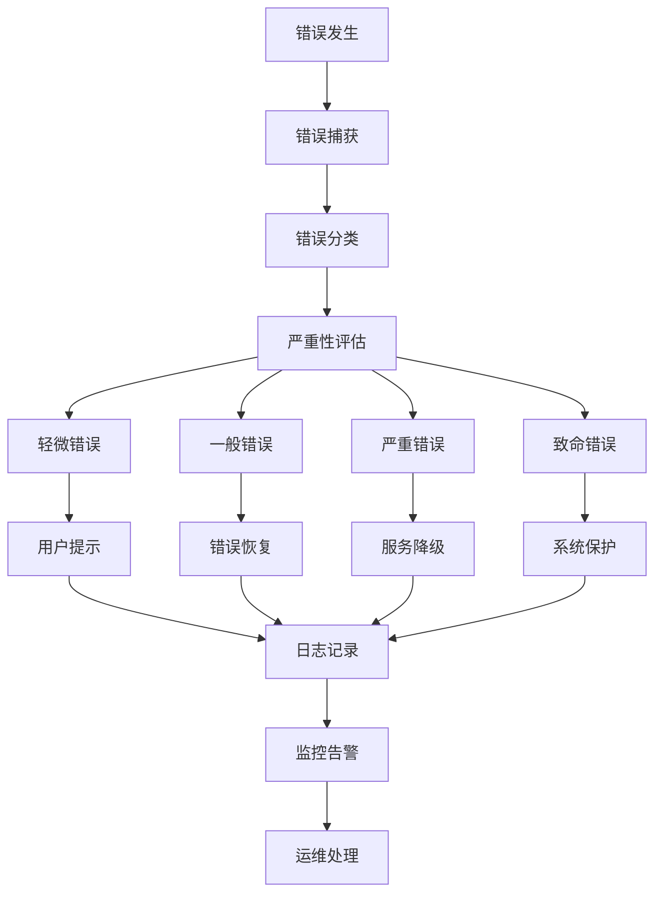

# AI智能营养餐厅系统 - 统一错误处理与异常处理标准

> **文档版本**: 3.0.0  
> **创建日期**: 2025-07-23  
> **文档状态**: ✅ 错误处理标准制定完成  
> **目标受众**: 开发团队、QA团队、运维团队、AI编码工具

## 📋 目录

- [1. 错误处理总体策略](#1-错误处理总体策略)
- [2. 错误分类和编码规范](#2-错误分类和编码规范)
- [3. 后端错误处理标准](#3-后端错误处理标准)
- [4. 前端错误处理标准](#4-前端错误处理标准)
- [5. 移动端错误处理标准](#5-移动端错误处理标准)
- [6. 错误日志记录规范](#6-错误日志记录规范)
- [7. 用户友好错误提示](#7-用户友好错误提示)
- [8. 错误恢复和重试机制](#8-错误恢复和重试机制)
- [9. 监控和告警系统](#9-监控和告警系统)
- [10. 错误处理最佳实践](#10-错误处理最佳实践)

---

## 1. 错误处理总体策略

### 1.1 设计原则

```yaml
核心原则:
  - 一致性: 所有平台使用统一的错误处理模式
  - 可恢复性: 优先考虑错误恢复而非终止程序
  - 用户友好: 提供清晰易懂的错误信息
  - 可追踪性: 完整的错误追踪和日志记录
  - 安全性: 不泄露敏感信息给最终用户

分层策略:
  数据层错误:
    - 数据库连接失败
    - 数据验证错误
    - 数据一致性错误
    
  业务层错误:
    - 业务规则违反
    - 权限验证失败
    - 资源不存在
    
  表现层错误:
    - 用户输入错误
    - 网络连接问题
    - 界面渲染异常

错误处理流程:
  检测 → 分类 → 记录 → 恢复 → 通知
```

### 1.2 错误处理架构



---

## 2. 错误分类和编码规范

### 2.1 统一错误码体系

```typescript
// 错误码定义 - 跨平台统一
export enum ErrorCode {
  // 1000-1999: 用户相关错误
  USER_NOT_FOUND = 1001,
  USER_ALREADY_EXISTS = 1002,
  USER_UNAUTHORIZED = 1003,
  USER_FORBIDDEN = 1004,
  USER_TOKEN_EXPIRED = 1005,
  USER_TOKEN_INVALID = 1006,
  USER_PROFILE_INCOMPLETE = 1007,
  
  // 2000-2999: 认证相关错误
  AUTH_PHONE_INVALID = 2001,
  AUTH_VERIFICATION_CODE_INVALID = 2002,
  AUTH_VERIFICATION_CODE_EXPIRED = 2003,
  AUTH_TOO_MANY_ATTEMPTS = 2004,
  AUTH_SMS_SEND_FAILED = 2005,
  AUTH_LOGIN_FAILED = 2006,
  
  // 3000-3999: 业务逻辑错误
  NUTRITION_PROFILE_REQUIRED = 3001,
  NUTRITION_ANALYSIS_FAILED = 3002,
  DISH_NOT_FOUND = 3003,
  RESTAURANT_NOT_FOUND = 3004,
  RESTAURANT_CLOSED = 3005,
  ORDER_NOT_FOUND = 3006,
  ORDER_INVALID_STATUS = 3007,
  ORDER_PAYMENT_FAILED = 3008,
  
  // 4000-4999: 系统错误
  DATABASE_CONNECTION_ERROR = 4001,
  DATABASE_QUERY_ERROR = 4002,
  EXTERNAL_API_ERROR = 4003,
  AI_SERVICE_UNAVAILABLE = 4004,
  PAYMENT_SERVICE_ERROR = 4005,
  FILE_UPLOAD_ERROR = 4006,
  CACHE_ERROR = 4007,
  
  // 5000-5999: 网络和通信错误
  NETWORK_CONNECTION_ERROR = 5001,
  NETWORK_TIMEOUT = 5002,
  WEBSOCKET_CONNECTION_ERROR = 5003,
  API_RATE_LIMIT_EXCEEDED = 5004,
  
  // 6000-6999: 验证和输入错误
  VALIDATION_FAILED = 6001,
  INVALID_PARAMETER = 6002,
  MISSING_REQUIRED_FIELD = 6003,
  INVALID_FILE_FORMAT = 6004,
  FILE_SIZE_EXCEEDED = 6005,
  
  // 9000-9999: 未知错误
  UNKNOWN_ERROR = 9999,
}

// 错误严重性级别
export enum ErrorSeverity {
  LOW = 'low',        // 轻微错误，不影响主要功能
  MEDIUM = 'medium',  // 一般错误，影响部分功能
  HIGH = 'high',      // 严重错误，影响核心功能
  CRITICAL = 'critical', // 致命错误，系统无法正常运行
}

// 错误类别
export enum ErrorCategory {
  USER = 'user',           // 用户操作错误
  BUSINESS = 'business',   // 业务逻辑错误
  SYSTEM = 'system',       // 系统内部错误
  NETWORK = 'network',     // 网络通信错误
  EXTERNAL = 'external',   // 外部服务错误
}
```

### 2.2 标准错误对象

```typescript
// 统一错误对象接口
export interface AppError {
  code: ErrorCode;
  message: string;
  userMessage: string;
  severity: ErrorSeverity;
  category: ErrorCategory;
  timestamp: Date;
  traceId: string;
  context?: Record<string, any>;
  stack?: string;
  cause?: Error;
}

// 错误工厂类
export class ErrorFactory {
  static create(
    code: ErrorCode,
    message: string,
    userMessage: string,
    options: {
      severity?: ErrorSeverity;
      category?: ErrorCategory;
      context?: Record<string, any>;
      cause?: Error;
    } = {}
  ): AppError {
    return {
      code,
      message,
      userMessage,
      severity: options.severity || ErrorSeverity.MEDIUM,
      category: options.category || ErrorCategory.SYSTEM,
      timestamp: new Date(),
      traceId: generateTraceId(),
      context: options.context,
      stack: new Error().stack,
      cause: options.cause,
    };
  }

  // 预定义常用错误
  static userNotFound(userId?: string): AppError {
    return this.create(
      ErrorCode.USER_NOT_FOUND,
      `User not found${userId ? `: ${userId}` : ''}`,
      '用户不存在',
      {
        severity: ErrorSeverity.MEDIUM,
        category: ErrorCategory.USER,
        context: { userId },
      }
    );
  }

  static unauthorized(): AppError {
    return this.create(
      ErrorCode.USER_UNAUTHORIZED,
      'User unauthorized',
      '请先登录',
      {
        severity: ErrorSeverity.MEDIUM,
        category: ErrorCategory.USER,
      }
    );
  }

  static validationFailed(field: string, value: any): AppError {
    return this.create(
      ErrorCode.VALIDATION_FAILED,
      `Validation failed for field: ${field}`,
      '输入信息有误，请检查',
      {
        severity: ErrorSeverity.LOW,
        category: ErrorCategory.USER,
        context: { field, value },
      }
    );
  }

  static systemError(error: Error): AppError {
    return this.create(
      ErrorCode.UNKNOWN_ERROR,
      `System error: ${error.message}`,
      '系统繁忙，请稍后重试',
      {
        severity: ErrorSeverity.HIGH,
        category: ErrorCategory.SYSTEM,
        cause: error,
      }
    );
  }
}

function generateTraceId(): string {
  return `${Date.now()}-${Math.random().toString(36).substr(2, 9)}`;
}
```

---

## 3. 后端错误处理标准

### 3.1 NestJS全局异常过滤器

```typescript
// backend/src/common/filters/global-exception.filter.ts
import {
  ExceptionFilter,
  Catch,
  ArgumentsHost,
  HttpException,
  HttpStatus,
  Logger,
} from '@nestjs/common';
import { Request, Response } from 'express';
import { AppError, ErrorFactory, ErrorCode } from '../errors/app-error';

@Catch()
export class GlobalExceptionFilter implements ExceptionFilter {
  private readonly logger = new Logger(GlobalExceptionFilter.name);

  catch(exception: unknown, host: ArgumentsHost) {
    const ctx = host.switchToHttp();
    const response = ctx.getResponse<Response>();
    const request = ctx.getRequest<Request>();

    let appError: AppError;
    let status: HttpStatus;

    if (exception instanceof HttpException) {
      appError = this.handleHttpException(exception, request);
      status = exception.getStatus();
    } else if (exception instanceof AppError) {
      appError = exception;
      status = this.mapErrorCodeToHttpStatus(appError.code);
    } else if (exception instanceof Error) {
      appError = this.handleUnknownError(exception, request);
      status = HttpStatus.INTERNAL_SERVER_ERROR;
    } else {
      appError = ErrorFactory.systemError(new Error('Unknown exception'));
      status = HttpStatus.INTERNAL_SERVER_ERROR;
    }

    // 记录错误日志
    this.logError(appError, request, status);

    // 返回标准化错误响应
    const errorResponse = this.buildErrorResponse(appError, request);
    response.status(status).json(errorResponse);
  }

  private handleHttpException(exception: HttpException, request: Request): AppError {
    const status = exception.getStatus();
    const response = exception.getResponse();
    
    let code: ErrorCode;
    let userMessage: string;

    switch (status) {
      case HttpStatus.UNAUTHORIZED:
        code = ErrorCode.USER_UNAUTHORIZED;
        userMessage = '请先登录';
        break;
      case HttpStatus.FORBIDDEN:
        code = ErrorCode.USER_FORBIDDEN;
        userMessage = '没有访问权限';
        break;
      case HttpStatus.NOT_FOUND:
        code = ErrorCode.USER_NOT_FOUND;
        userMessage = '请求的资源不存在';
        break;
      case HttpStatus.BAD_REQUEST:
        code = ErrorCode.VALIDATION_FAILED;
        userMessage = '请求参数有误';
        break;
      case HttpStatus.TOO_MANY_REQUESTS:
        code = ErrorCode.API_RATE_LIMIT_EXCEEDED;
        userMessage = '请求过于频繁，请稍后重试';
        break;
      default:
        code = ErrorCode.UNKNOWN_ERROR;
        userMessage = '服务器错误，请稍后重试';
    }

    return ErrorFactory.create(
      code,
      typeof response === 'string' ? response : JSON.stringify(response),
      userMessage,
      {
        context: {
          url: request.url,
          method: request.method,
          statusCode: status,
        },
      }
    );
  }

  private handleUnknownError(error: Error, request: Request): AppError {
    // 数据库错误处理
    if (error.message.includes('ECONNREFUSED') || 
        error.message.includes('Connection terminated')) {
      return ErrorFactory.create(
        ErrorCode.DATABASE_CONNECTION_ERROR,
        `Database connection error: ${error.message}`,
        '数据库连接异常，请稍后重试',
        {
          severity: ErrorSeverity.HIGH,
          category: ErrorCategory.SYSTEM,
          cause: error,
          context: { url: request.url },
        }
      );
    }

    // 网络超时错误
    if (error.message.includes('timeout') || error.message.includes('ETIMEDOUT')) {
      return ErrorFactory.create(
        ErrorCode.NETWORK_TIMEOUT,
        `Network timeout: ${error.message}`,
        '网络超时，请检查网络连接',
        {
          severity: ErrorSeverity.MEDIUM,
          category: ErrorCategory.NETWORK,
          cause: error,
        }
      );
    }

    // 默认系统错误
    return ErrorFactory.systemError(error);
  }

  private mapErrorCodeToHttpStatus(code: ErrorCode): HttpStatus {
    const mapping = {
      [ErrorCode.USER_NOT_FOUND]: HttpStatus.NOT_FOUND,
      [ErrorCode.USER_UNAUTHORIZED]: HttpStatus.UNAUTHORIZED,
      [ErrorCode.USER_FORBIDDEN]: HttpStatus.FORBIDDEN,
      [ErrorCode.USER_TOKEN_EXPIRED]: HttpStatus.UNAUTHORIZED,
      [ErrorCode.USER_TOKEN_INVALID]: HttpStatus.UNAUTHORIZED,
      [ErrorCode.AUTH_VERIFICATION_CODE_INVALID]: HttpStatus.BAD_REQUEST,
      [ErrorCode.AUTH_TOO_MANY_ATTEMPTS]: HttpStatus.TOO_MANY_REQUESTS,
      [ErrorCode.VALIDATION_FAILED]: HttpStatus.BAD_REQUEST,
      [ErrorCode.INVALID_PARAMETER]: HttpStatus.BAD_REQUEST,
      [ErrorCode.MISSING_REQUIRED_FIELD]: HttpStatus.BAD_REQUEST,
      [ErrorCode.API_RATE_LIMIT_EXCEEDED]: HttpStatus.TOO_MANY_REQUESTS,
      [ErrorCode.DATABASE_CONNECTION_ERROR]: HttpStatus.SERVICE_UNAVAILABLE,
      [ErrorCode.EXTERNAL_API_ERROR]: HttpStatus.BAD_GATEWAY,
      [ErrorCode.AI_SERVICE_UNAVAILABLE]: HttpStatus.SERVICE_UNAVAILABLE,
    };

    return mapping[code] || HttpStatus.INTERNAL_SERVER_ERROR;
  }

  private logError(error: AppError, request: Request, status: HttpStatus) {
    const logContext = {
      traceId: error.traceId,
      code: error.code,
      message: error.message,
      url: request.url,
      method: request.method,
      userAgent: request.get('User-Agent'),
      ip: request.ip,
      userId: (request as any).user?.id,
      status,
      context: error.context,
    };

    switch (error.severity) {
      case ErrorSeverity.LOW:
        this.logger.warn(logContext);
        break;
      case ErrorSeverity.MEDIUM:
        this.logger.error(logContext);
        break;
      case ErrorSeverity.HIGH:
      case ErrorSeverity.CRITICAL:
        this.logger.error(logContext, error.stack);
        break;
    }
  }

  private buildErrorResponse(error: AppError, request: Request) {
    const response = {
      success: false,
      error: {
        code: error.code,
        message: error.userMessage,
        traceId: error.traceId,
        timestamp: error.timestamp.toISOString(),
      },
      path: request.url,
      method: request.method,
    };

    // 开发环境返回详细错误信息
    if (process.env.NODE_ENV === 'development') {
      response.error['details'] = {
        originalMessage: error.message,
        stack: error.stack,
        context: error.context,
      };
    }

    return response;
  }
}
```

### 3.2 业务异常处理

```typescript
// backend/src/common/exceptions/business.exception.ts
import { HttpException, HttpStatus } from '@nestjs/common';
import { AppError, ErrorCode, ErrorSeverity, ErrorCategory } from '../errors/app-error';

export class BusinessException extends HttpException {
  constructor(
    private readonly appError: AppError,
    status: HttpStatus = HttpStatus.BAD_REQUEST
  ) {
    super(appError.userMessage, status);
  }

  getAppError(): AppError {
    return this.appError;
  }
}

// 业务异常工厂
export class BusinessExceptionFactory {
  static nutritionProfileRequired(userId: string): BusinessException {
    const error = ErrorFactory.create(
      ErrorCode.NUTRITION_PROFILE_REQUIRED,
      `Nutrition profile required for user: ${userId}`,
      '请先完善您的营养档案',
      {
        severity: ErrorSeverity.MEDIUM,
        category: ErrorCategory.BUSINESS,
        context: { userId },
      }
    );
    return new BusinessException(error, HttpStatus.PRECONDITION_REQUIRED);
  }

  static restaurantClosed(restaurantId: string): BusinessException {
    const error = ErrorFactory.create(
      ErrorCode.RESTAURANT_CLOSED,
      `Restaurant is closed: ${restaurantId}`,
      '餐厅暂时关闭，请选择其他餐厅',
      {
        severity: ErrorSeverity.MEDIUM,
        category: ErrorCategory.BUSINESS,
        context: { restaurantId },
      }
    );
    return new BusinessException(error, HttpStatus.CONFLICT);
  }

  static orderInvalidStatus(orderId: string, currentStatus: string, expectedStatus: string): BusinessException {
    const error = ErrorFactory.create(
      ErrorCode.ORDER_INVALID_STATUS,
      `Invalid order status transition from ${currentStatus} to ${expectedStatus}`,
      '订单状态异常，无法执行此操作',
      {
        severity: ErrorSeverity.HIGH,
        category: ErrorCategory.BUSINESS,
        context: { orderId, currentStatus, expectedStatus },
      }
    );
    return new BusinessException(error, HttpStatus.CONFLICT);
  }
}
```

### 3.3 服务层错误处理模式

```typescript
// backend/src/modules/auth/auth.service.ts
import { Injectable, Logger } from '@nestjs/common';
import { BusinessException, BusinessExceptionFactory } from '../../common/exceptions/business.exception';
import { ErrorFactory, ErrorCode } from '../../common/errors/app-error';

@Injectable()
export class AuthService {
  private readonly logger = new Logger(AuthService.name);

  async login(phone: string, verificationCode: string): Promise<AuthResult> {
    try {
      // 验证码检查
      const isCodeValid = await this.validateVerificationCode(phone, verificationCode);
      if (!isCodeValid) {
        throw new BusinessException(
          ErrorFactory.create(
            ErrorCode.AUTH_VERIFICATION_CODE_INVALID,
            `Invalid verification code for phone: ${phone}`,
            '验证码错误或已过期',
            {
              context: { phone },
            }
          )
        );
      }

      // 查找或创建用户
      let user = await this.usersService.findByPhone(phone);
      let isNewUser = false;

      if (!user) {
        user = await this.createUser(phone);
        isNewUser = true;
      }

      // 生成token
      const tokens = await this.generateTokens(user);

      // 更新最后登录时间
      await this.usersService.updateLastLogin(user.id);

      return {
        user,
        accessToken: tokens.accessToken,
        refreshToken: tokens.refreshToken,
        isNewUser,
      };
    } catch (error) {
      // 记录登录失败
      await this.recordLoginAttempt(phone, false);

      if (error instanceof BusinessException) {
        throw error;
      }

      // 包装未知错误
      this.logger.error(`Login failed for phone ${phone}`, error.stack);
      throw new BusinessException(
        ErrorFactory.create(
          ErrorCode.AUTH_LOGIN_FAILED,
          `Login failed: ${error.message}`,
          '登录失败，请稍后重试',
          {
            cause: error,
            context: { phone },
          }
        )
      );
    }
  }

  async sendVerificationCode(phone: string): Promise<void> {
    try {
      // 检查发送频率限制
      const canSend = await this.checkSmsRateLimit(phone);
      if (!canSend) {
        throw new BusinessException(
          ErrorFactory.create(
            ErrorCode.AUTH_TOO_MANY_ATTEMPTS,
            `SMS rate limit exceeded for phone: ${phone}`,
            '发送过于频繁，请稍后重试',
            {
              context: { phone },
            }
          )
        );
      }

      // 生成验证码
      const code = this.generateVerificationCode();

      // 发送短信
      await this.smsService.sendVerificationCode(phone, code);

      // 缓存验证码
      await this.cacheVerificationCode(phone, code);

      // 记录发送频率
      await this.recordSmsSent(phone);

    } catch (error) {
      if (error instanceof BusinessException) {
        throw error;
      }

      this.logger.error(`Failed to send verification code to ${phone}`, error.stack);
      throw new BusinessException(
        ErrorFactory.create(
          ErrorCode.AUTH_SMS_SEND_FAILED,
          `Failed to send SMS: ${error.message}`,
          '验证码发送失败，请稍后重试',
          {
            cause: error,
            context: { phone },
          }
        )
      );
    }
  }

  private async createUser(phone: string): Promise<User> {
    try {
      return await this.usersService.create({
        phone,
        roles: ['user'],
        isActive: true,
      });
    } catch (error) {
      this.logger.error(`Failed to create user for phone ${phone}`, error.stack);
      throw new BusinessException(
        ErrorFactory.create(
          ErrorCode.USER_ALREADY_EXISTS,
          `Failed to create user: ${error.message}`,
          '用户创建失败，请稍后重试',
          {
            cause: error,
            context: { phone },
          }
        )
      );
    }
  }

  // 其他方法的错误处理遵循相同模式...
}
```

---

## 4. 前端错误处理标准

### 4.1 React错误边界

```typescript
// frontend/src/components/ErrorBoundary/ErrorBoundary.tsx
import React, { Component, ErrorInfo, ReactNode } from 'react';
import { AppError, ErrorFactory, ErrorCode, ErrorSeverity } from '../../utils/errors';
import { ErrorDisplay } from './ErrorDisplay';
import { ErrorReportService } from '../../services/error-report.service';

interface Props {
  children: ReactNode;
  fallback?: (error: AppError) => ReactNode;
  onError?: (error: AppError, errorInfo: ErrorInfo) => void;
}

interface State {
  error: AppError | null;
}

export class ErrorBoundary extends Component<Props, State> {
  constructor(props: Props) {
    super(props);
    this.state = { error: null };
  }

  static getDerivedStateFromError(error: Error): State {
    // 将JavaScript错误转换为AppError
    const appError = ErrorFactory.create(
      ErrorCode.UNKNOWN_ERROR,
      `React Error Boundary: ${error.message}`,
      '页面出现异常，请刷新重试',
      {
        severity: ErrorSeverity.HIGH,
        cause: error,
      }
    );

    return { error: appError };
  }

  componentDidCatch(error: Error, errorInfo: ErrorInfo) {
    const appError = this.state.error;
    if (appError) {
      // 添加React错误信息到上下文
      appError.context = {
        ...appError.context,
        componentStack: errorInfo.componentStack,
        errorBoundary: this.constructor.name,
      };

      // 上报错误
      ErrorReportService.reportError(appError);

      // 调用外部错误处理回调
      this.props.onError?.(appError, errorInfo);
    }
  }

  render() {
    if (this.state.error) {
      if (this.props.fallback) {
        return this.props.fallback(this.state.error);
      }

      return (
        <ErrorDisplay
          error={this.state.error}
          onRetry={() => this.setState({ error: null })}
        />
      );
    }

    return this.props.children;
  }
}

// 高阶组件包装器
export function withErrorBoundary<P extends object>(
  Component: React.ComponentType<P>,
  fallback?: (error: AppError) => ReactNode
) {
  return function WrappedComponent(props: P) {
    return (
      <ErrorBoundary fallback={fallback}>
        <Component {...props} />
      </ErrorBoundary>
    );
  };
}
```

### 4.2 API错误处理

```typescript
// frontend/src/services/api-client.ts
import axios, { AxiosInstance, AxiosError, AxiosResponse } from 'axios';
import { AppError, ErrorFactory, ErrorCode } from '../utils/errors';
import { AuthService } from './auth.service';
import { ErrorNotificationService } from './error-notification.service';

class ApiClient {
  private client: AxiosInstance;
  private retryCount = 0;
  private maxRetries = 3;

  constructor() {
    this.client = axios.create({
      baseURL: process.env.REACT_APP_API_BASE_URL,
      timeout: 10000,
      headers: {
        'Content-Type': 'application/json',
      },
    });

    this.setupInterceptors();
  }

  private setupInterceptors() {
    // 请求拦截器
    this.client.interceptors.request.use(
      (config) => {
        const token = AuthService.getToken();
        if (token) {
          config.headers.Authorization = `Bearer ${token}`;
        }
        return config;
      },
      (error) => {
        return Promise.reject(this.handleRequestError(error));
      }
    );

    // 响应拦截器
    this.client.interceptors.response.use(
      (response) => {
        this.retryCount = 0; // 重置重试计数
        return response;
      },
      (error) => {
        return Promise.reject(this.handleResponseError(error));
      }
    );
  }

  private handleRequestError(error: any): AppError {
    return ErrorFactory.create(
      ErrorCode.NETWORK_CONNECTION_ERROR,
      `Request setup failed: ${error.message}`,
      '网络连接失败，请检查网络设置',
      {
        cause: error,
      }
    );
  }

  private async handleResponseError(error: AxiosError): Promise<AppError> {
    // 网络错误
    if (!error.response) {
      if (error.code === 'ECONNABORTED') {
        return ErrorFactory.create(
          ErrorCode.NETWORK_TIMEOUT,
          `Request timeout: ${error.message}`,
          '请求超时，请稍后重试',
          {
            cause: error,
          }
        );
      }

      return ErrorFactory.create(
        ErrorCode.NETWORK_CONNECTION_ERROR,
        `Network error: ${error.message}`,
        '网络连接失败，请检查网络设置',
        {
          cause: error,
        }
      );
    }

    const { status, data } = error.response;

    // 处理标准化的后端错误响应
    if (data?.error?.code) {
      return ErrorFactory.create(
        data.error.code,
        data.error.message || error.message,
        data.error.message || '操作失败，请稍后重试',
        {
          context: {
            status,
            url: error.config?.url,
            method: error.config?.method,
            traceId: data.error.traceId,
          },
        }
      );
    }

    // 处理HTTP状态码错误
    switch (status) {
      case 401:
        await this.handleUnauthorizedError();
        return ErrorFactory.create(
          ErrorCode.USER_UNAUTHORIZED,
          'Unauthorized',
          '登录已过期，请重新登录',
        );

      case 403:
        return ErrorFactory.create(
          ErrorCode.USER_FORBIDDEN,
          'Forbidden',
          '没有访问权限',
        );

      case 404:
        return ErrorFactory.create(
          ErrorCode.USER_NOT_FOUND,
          'Not Found',
          '请求的资源不存在',
        );

      case 429:
        return ErrorFactory.create(
          ErrorCode.API_RATE_LIMIT_EXCEEDED,
          'Too Many Requests',
          '请求过于频繁，请稍后重试',
        );

      case 500:
        return ErrorFactory.create(
          ErrorCode.UNKNOWN_ERROR,
          'Internal Server Error',
          '服务器内部错误，请稍后重试',
        );

      case 502:
      case 503:
      case 504:
        // 服务不可用，尝试重试
        if (this.retryCount < this.maxRetries) {
          this.retryCount++;
          await this.delay(1000 * this.retryCount);
          return this.client.request(error.config!);
        }

        return ErrorFactory.create(
          ErrorCode.EXTERNAL_API_ERROR,
          'Service Unavailable',
          '服务暂时不可用，请稍后重试',
        );

      default:
        return ErrorFactory.create(
          ErrorCode.UNKNOWN_ERROR,
          `HTTP ${status}: ${error.message}`,
          '操作失败，请稍后重试',
        );
    }
  }

  private async handleUnauthorizedError() {
    // 清除本地token
    AuthService.clearToken();
    
    // 重定向到登录页
    window.location.href = '/login';
  }

  private delay(ms: number): Promise<void> {
    return new Promise(resolve => setTimeout(resolve, ms));
  }

  // API方法包装器
  async get<T>(url: string, config?: any): Promise<T> {
    try {
      const response: AxiosResponse<T> = await this.client.get(url, config);
      return response.data;
    } catch (error) {
      if (error instanceof AppError) {
        ErrorNotificationService.showError(error);
        throw error;
      }
      throw this.handleUnknownError(error);
    }
  }

  async post<T>(url: string, data?: any, config?: any): Promise<T> {
    try {
      const response: AxiosResponse<T> = await this.client.post(url, data, config);
      return response.data;
    } catch (error) {
      if (error instanceof AppError) {
        ErrorNotificationService.showError(error);
        throw error;
      }
      throw this.handleUnknownError(error);
    }
  }

  private handleUnknownError(error: any): AppError {
    const appError = ErrorFactory.systemError(error);
    ErrorNotificationService.showError(appError);
    return appError;
  }
}

export const apiClient = new ApiClient();
```

### 4.3 React Query错误处理

```typescript
// frontend/src/hooks/useErrorHandler.ts
import { useCallback } from 'react';
import { QueryClient } from '@tanstack/react-query';
import { AppError, ErrorFactory, ErrorCode } from '../utils/errors';
import { ErrorNotificationService } from '../services/error-notification.service';

export function useErrorHandler() {
  const handleError = useCallback((error: unknown, context?: Record<string, any>) => {
    let appError: AppError;

    if (error instanceof AppError) {
      appError = error;
    } else if (error instanceof Error) {
      appError = ErrorFactory.systemError(error);
    } else {
      appError = ErrorFactory.create(
        ErrorCode.UNKNOWN_ERROR,
        `Unknown error: ${String(error)}`,
        '发生未知错误，请稍后重试',
      );
    }

    // 添加上下文信息
    if (context) {
      appError.context = { ...appError.context, ...context };
    }

    // 显示错误通知
    ErrorNotificationService.showError(appError);

    // 上报错误
    ErrorReportService.reportError(appError);

    return appError;
  }, []);

  return { handleError };
}

// React Query全局错误处理
export function setupQueryErrorHandling(queryClient: QueryClient) {
  queryClient.setDefaultOptions({
    queries: {
      retry: (failureCount, error) => {
        // 某些错误不应该重试
        if (error instanceof AppError) {
          const noRetryErrors = [
            ErrorCode.USER_UNAUTHORIZED,
            ErrorCode.USER_FORBIDDEN,
            ErrorCode.VALIDATION_FAILED,
            ErrorCode.USER_NOT_FOUND,
          ];
          
          if (noRetryErrors.includes(error.code)) {
            return false;
          }
        }

        // 最多重试3次
        return failureCount < 3;
      },
      retryDelay: (attemptIndex) => Math.min(1000 * 2 ** attemptIndex, 30000),
      onError: (error) => {
        if (error instanceof AppError) {
          ErrorNotificationService.showError(error);
        }
      },
    },
    mutations: {
      retry: false, // 突变操作默认不重试
      onError: (error) => {
        if (error instanceof AppError) {
          ErrorNotificationService.showError(error);
        }
      },
    },
  });
}
```

---

## 5. 移动端错误处理标准

### 5.1 Flutter全局错误处理

```dart
// lib/core/error/error_handler.dart
import 'package:flutter/foundation.dart';
import 'package:flutter/material.dart';
import 'package:flutter/services.dart';
import 'package:logging/logging.dart';

import 'app_error.dart';
import 'error_reporter.dart';

class GlobalErrorHandler {
  static final Logger _logger = Logger('GlobalErrorHandler');
  static late ErrorReporter _errorReporter;

  static void initialize(ErrorReporter errorReporter) {
    _errorReporter = errorReporter;
    
    // 捕获Flutter框架错误
    FlutterError.onError = (FlutterErrorDetails details) {
      final appError = AppError.fromFlutterError(details);
      _handleError(appError);
    };

    // 捕获异步错误
    PlatformDispatcher.instance.onError = (error, stack) {
      final appError = AppError.fromException(error, stack);
      _handleError(appError);
      return true;
    };

    // 捕获平台错误
    PlatformDispatcher.instance.onPlatformError = (error) {
      final appError = AppError.fromPlatformError(error);
      _handleError(appError);
      return true;
    };
  }

  static void _handleError(AppError error) {
    // 记录日志
    _logError(error);

    // 上报错误
    _errorReporter.reportError(error);

    // 开发模式下打印详细信息
    if (kDebugMode) {
      debugPrint('AppError: ${error.toString()}');
    }
  }

  static void _logError(AppError error) {
    switch (error.severity) {
      case ErrorSeverity.low:
        _logger.info(error.message);
        break;
      case ErrorSeverity.medium:
        _logger.warning(error.message);
        break;
      case ErrorSeverity.high:
        _logger.severe(error.message);
        break;
      case ErrorSeverity.critical:
        _logger.shout(error.message);
        break;
    }
  }

  static void handleException(Object exception, StackTrace? stackTrace) {
    final appError = AppError.fromException(exception, stackTrace);
    _handleError(appError);
  }
}

// lib/core/error/app_error.dart
import 'package:flutter/foundation.dart';
import 'package:freezed_annotation/freezed_annotation.dart';

part 'app_error.freezed.dart';
part 'app_error.g.dart';

enum ErrorCode {
  // 用户相关错误
  userNotFound(1001),
  userUnauthorized(1003),
  userTokenExpired(1005),
  
  // 认证相关错误
  authPhoneInvalid(2001),
  authVerificationCodeInvalid(2002),
  authLoginFailed(2006),
  
  // 业务逻辑错误
  nutritionProfileRequired(3001),
  dishNotFound(3003),
  orderNotFound(3006),
  
  // 系统错误
  networkConnectionError(5001),
  networkTimeout(5002),
  unknownError(9999);

  const ErrorCode(this.value);
  final int value;
}

enum ErrorSeverity { low, medium, high, critical }

enum ErrorCategory { user, business, system, network, external }

@freezed
class AppError with _$AppError implements Exception {
  const factory AppError({
    required ErrorCode code,
    required String message,
    required String userMessage,
    required ErrorSeverity severity,
    required ErrorCategory category,
    required DateTime timestamp,
    required String traceId,
    Map<String, dynamic>? context,
    String? stack,
    Object? cause,
  }) = _AppError;

  factory AppError.fromJson(Map<String, dynamic> json) =>
      _$AppErrorFromJson(json);

  // 从Flutter错误创建
  factory AppError.fromFlutterError(FlutterErrorDetails details) {
    return AppError(
      code: ErrorCode.unknownError,
      message: details.exception.toString(),
      userMessage: '应用出现异常，请重启应用',
      severity: ErrorSeverity.high,
      category: ErrorCategory.system,
      timestamp: DateTime.now(),
      traceId: _generateTraceId(),
      stack: details.stack.toString(),
      context: {
        'library': details.library,
        'context': details.context?.toString(),
      },
    );
  }

  // 从异常创建
  factory AppError.fromException(Object exception, StackTrace? stackTrace) {
    return AppError(
      code: ErrorCode.unknownError,
      message: exception.toString(),
      userMessage: '操作失败，请稍后重试',
      severity: ErrorSeverity.medium,
      category: ErrorCategory.system,
      timestamp: DateTime.now(),
      traceId: _generateTraceId(),
      stack: stackTrace?.toString(),
      cause: exception,
    );
  }

  // 从平台错误创建
  factory AppError.fromPlatformError(Object error) {
    return AppError(
      code: ErrorCode.unknownError,
      message: error.toString(),
      userMessage: '系统错误，请重启应用',
      severity: ErrorSeverity.critical,
      category: ErrorCategory.system,
      timestamp: DateTime.now(),
      traceId: _generateTraceId(),
      cause: error,
    );
  }

  static String _generateTraceId() {
    return '${DateTime.now().millisecondsSinceEpoch}-${UniqueKey().toString()}';
  }
}

// 错误工厂类
class AppErrorFactory {
  static AppError userNotFound([String? userId]) {
    return AppError(
      code: ErrorCode.userNotFound,
      message: 'User not found${userId != null ? ": $userId" : ""}',
      userMessage: '用户不存在',
      severity: ErrorSeverity.medium,
      category: ErrorCategory.user,
      timestamp: DateTime.now(),
      traceId: AppError._generateTraceId(),
      context: userId != null ? {'userId': userId} : null,
    );
  }

  static AppError unauthorized() {
    return AppError(
      code: ErrorCode.userUnauthorized,
      message: 'User unauthorized',
      userMessage: '请先登录',
      severity: ErrorSeverity.medium,
      category: ErrorCategory.user,
      timestamp: DateTime.now(),
      traceId: AppError._generateTraceId(),
    );
  }

  static AppError networkError(String details) {
    return AppError(
      code: ErrorCode.networkConnectionError,
      message: 'Network error: $details',
      userMessage: '网络连接失败，请检查网络设置',
      severity: ErrorSeverity.medium,
      category: ErrorCategory.network,
      timestamp: DateTime.now(),
      traceId: AppError._generateTraceId(),
      context: {'details': details},
    );
  }

  static AppError validationError(String field, dynamic value) {
    return AppError(
      code: ErrorCode.authPhoneInvalid,
      message: 'Validation failed for field: $field',
      userMessage: '输入信息有误，请检查',
      severity: ErrorSeverity.low,
      category: ErrorCategory.user,
      timestamp: DateTime.now(),
      traceId: AppError._generateTraceId(),
      context: {'field': field, 'value': value},
    );
  }
}
```

### 5.2 网络请求错误处理

```dart
// lib/core/network/dio_error_handler.dart
import 'package:dio/dio.dart';
import '../error/app_error.dart';

class DioErrorHandler {
  static AppError handleDioError(DioException error) {
    switch (error.type) {
      case DioExceptionType.connectionTimeout:
      case DioExceptionType.sendTimeout:
      case DioExceptionType.receiveTimeout:
        return AppError(
          code: ErrorCode.networkTimeout,
          message: 'Network timeout: ${error.message}',
          userMessage: '网络超时，请检查网络连接',
          severity: ErrorSeverity.medium,
          category: ErrorCategory.network,
          timestamp: DateTime.now(),
          traceId: AppError._generateTraceId(),
          context: {
            'type': error.type.toString(),
            'requestPath': error.requestOptions.path,
          },
        );

      case DioExceptionType.connectionError:
        return AppError(
          code: ErrorCode.networkConnectionError,
          message: 'Connection error: ${error.message}',
          userMessage: '网络连接失败，请检查网络设置',
          severity: ErrorSeverity.medium,
          category: ErrorCategory.network,
          timestamp: DateTime.now(),
          traceId: AppError._generateTraceId(),
          context: {
            'type': error.type.toString(),
            'requestPath': error.requestOptions.path,
          },
        );

      case DioExceptionType.badResponse:
        return _handleHttpError(error);

      case DioExceptionType.cancel:
        return AppError(
          code: ErrorCode.unknownError,
          message: 'Request cancelled',
          userMessage: '请求已取消',
          severity: ErrorSeverity.low,
          category: ErrorCategory.user,
          timestamp: DateTime.now(),
          traceId: AppError._generateTraceId(),
        );

      case DioExceptionType.unknown:
      default:
        return AppError(
          code: ErrorCode.unknownError,
          message: 'Unknown error: ${error.message}',
          userMessage: '网络请求失败，请稍后重试',
          severity: ErrorSeverity.medium,
          category: ErrorCategory.network,
          timestamp: DateTime.now(),
          traceId: AppError._generateTraceId(),
          cause: error,
        );
    }
  }

  static AppError _handleHttpError(DioException error) {
    final response = error.response;
    if (response == null) {
      return AppErrorFactory.networkError('No response received');
    }

    final statusCode = response.statusCode ?? 0;
    final data = response.data;

    // 处理标准化的后端错误响应
    if (data is Map<String, dynamic> && data['error'] != null) {
      final errorData = data['error'];
      return AppError(
        code: ErrorCode.values.firstWhere(
          (e) => e.value == errorData['code'],
          orElse: () => ErrorCode.unknownError,
        ),
        message: errorData['message'] ?? error.message ?? 'Unknown error',
        userMessage: errorData['message'] ?? '操作失败，请稍后重试',
        severity: ErrorSeverity.medium,
        category: ErrorCategory.business,
        timestamp: DateTime.now(),
        traceId: errorData['traceId'] ?? AppError._generateTraceId(),
        context: {
          'statusCode': statusCode,
          'requestPath': error.requestOptions.path,
          'method': error.requestOptions.method,
        },
      );
    }

    // 处理HTTP状态码
    switch (statusCode) {
      case 401:
        return AppErrorFactory.unauthorized();
      
      case 403:
        return AppError(
          code: ErrorCode.userUnauthorized,
          message: 'Forbidden',
          userMessage: '没有访问权限',
          severity: ErrorSeverity.medium,
          category: ErrorCategory.user,
          timestamp: DateTime.now(),
          traceId: AppError._generateTraceId(),
        );

      case 404:
        return AppErrorFactory.userNotFound();

      case 429:
        return AppError(
          code: ErrorCode.networkConnectionError,
          message: 'Too many requests',
          userMessage: '请求过于频繁，请稍后重试',
          severity: ErrorSeverity.medium,
          category: ErrorCategory.network,
          timestamp: DateTime.now(),
          traceId: AppError._generateTraceId(),
        );

      case 500:
      case 502:
      case 503:
      case 504:
        return AppError(
          code: ErrorCode.unknownError,
          message: 'Server error: $statusCode',
          userMessage: '服务器错误，请稍后重试',
          severity: ErrorSeverity.high,
          category: ErrorCategory.system,
          timestamp: DateTime.now(),
          traceId: AppError._generateTraceId(),
          context: {'statusCode': statusCode},
        );

      default:
        return AppError(
          code: ErrorCode.unknownError,
          message: 'HTTP error: $statusCode',
          userMessage: '请求失败，请稍后重试',
          severity: ErrorSeverity.medium,
          category: ErrorCategory.network,
          timestamp: DateTime.now(),
          traceId: AppError._generateTraceId(),
          context: {'statusCode': statusCode},
        );
    }
  }
}
```

### 5.3 状态管理错误处理

```dart
// lib/features/auth/providers/auth_provider.dart
import 'package:flutter_riverpod/flutter_riverpod.dart';
import 'package:riverpod_annotation/riverpod_annotation.dart';

import '../../../core/error/app_error.dart';
import '../../../core/error/error_notifier.dart';

part 'auth_provider.g.dart';

@riverpod
class AuthNotifier extends _$AuthNotifier {
  @override
  AuthState build() {
    return const AuthState.initial();
  }

  Future<void> login(String phone, String verificationCode) async {
    try {
      state = const AuthState.loading();
      
      final result = await ref.read(authRepositoryProvider).login(
        phone,
        verificationCode,
      );
      
      state = AuthState.authenticated(
        user: result.user,
        token: result.accessToken,
      );
      
    } catch (error) {
      final appError = _handleError(error, 'login', {
        'phone': phone,
      });
      
      state = AuthState.error(appError);
      
      // 通知全局错误处理器
      ref.read(errorNotifierProvider.notifier).addError(appError);
      
      rethrow;
    }
  }

  Future<void> sendVerificationCode(String phone) async {
    try {
      await ref.read(authRepositoryProvider).sendVerificationCode(phone);
    } catch (error) {
      final appError = _handleError(error, 'sendVerificationCode', {
        'phone': phone,
      });
      
      // 通知全局错误处理器
      ref.read(errorNotifierProvider.notifier).addError(appError);
      
      rethrow;
    }
  }

  AppError _handleError(
    Object error,
    String operation,
    Map<String, dynamic> context,
  ) {
    if (error is AppError) {
      // 添加操作上下文
      return error.copyWith(
        context: {...error.context ?? {}, 'operation': operation, ...context},
      );
    }
    
    // 将其他异常转换为AppError
    return AppError.fromException(error, StackTrace.current).copyWith(
      context: {'operation': operation, ...context},
    );
  }

  void clearError() {
    if (state is AuthStateError) {
      state = const AuthState.initial();
    }
  }
}

// 全局错误状态管理
@riverpod
class ErrorNotifier extends _$ErrorNotifier {
  @override
  List<AppError> build() {
    return [];
  }

  void addError(AppError error) {
    state = [...state, error];
    
    // 自动清除旧错误（保留最近10个）
    if (state.length > 10) {
      state = state.sublist(state.length - 10);
    }
  }

  void removeError(String traceId) {
    state = state.where((error) => error.traceId != traceId).toList();
  }

  void clearAllErrors() {
    state = [];
  }
}
```

---

现在标记错误处理标准任务为已完成，并继续最后一个任务：

<function_calls>
<invoke name="TodoWrite">
<parameter name="todos">[{"content": "\u7edf\u4e00\u6280\u672f\u6808\u7248\u672c\u9009\u62e9 - \u66f4\u65b0\u6240\u6709\u76f8\u5173\u6587\u6863\u4e3a\u6700\u65b0\u7a33\u5b9a\u7248\u672c", "status": "completed", "priority": "high", "id": "tech-stack-unification"}, {"content": "\u660e\u786e\u5355\u8d26\u53f7\u591a\u89d2\u8272\u7cfb\u7edf\u67b6\u6784 - \u7edf\u4e00\u7528\u6237\u89d2\u8272\u8bbe\u8ba1", "status": "completed", "priority": "high", "id": "user-role-system"}, {"content": "\u8865\u5145\u5b8c\u6574\u7684\u5b89\u5168\u89c4\u8303\u6587\u6863", "status": "completed", "priority": "high", "id": "security-specifications"}, {"content": "\u7edf\u4e00UI\u8bbe\u8ba1\u7cfb\u7edf\u89c4\u8303 - \u89e3\u51b3\u989c\u8272\u3001\u547d\u540d\u51b2\u7a81", "status": "completed", "priority": "medium", "id": "ui-design-unification"}, {"content": "\u5b8c\u5584\u8ba2\u5355\u4e1a\u52a1\u6d41\u7a0b\u5b9a\u4e49\u548c\u72b6\u6001\u673a", "status": "completed", "priority": "medium", "id": "order-flow-completion"}, {"content": "\u5236\u5b9a\u5b8c\u6574\u7684\u6d4b\u8bd5\u89c4\u8303\u548c\u7b56\u7565", "status": "completed", "priority": "medium", "id": "testing-specifications"}, {"content": "\u5efa\u7acb\u7edf\u4e00\u7684\u9519\u8bef\u5904\u7406\u548c\u5f02\u5e38\u5904\u7406\u6807\u51c6", "status": "completed", "priority": "medium", "id": "error-handling-standards"}, {"content": "\u660e\u786eMVP\u529f\u80fd\u8fb9\u754c\uff0c\u7b80\u5316\u8fc7\u5ea6\u590d\u6742\u7684\u9700\u6c42", "status": "in_progress", "priority": "medium", "id": "mvp-scope-definition"}]