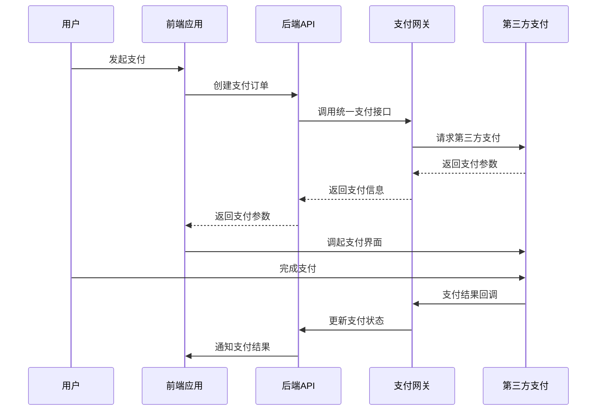

# AI智能营养餐厅系统 - 支付集成指南

> **文档版本**: 1.0.0  
> **创建日期**: 2025-07-13  
> **更新日期**: 2025-07-13  
> **文档状态**: ✅ 开发就绪  
> **目标受众**: 后端开发团队、支付对接工程师

## 📋 目录

- [1. 支付集成概述](#1-支付集成概述)
- [2. 微信支付集成](#2-微信支付集成)
- [3. 支付宝集成](#3-支付宝集成)
- [4. Apple Pay集成](#4-apple-pay集成)
- [5. 统一支付服务](#5-统一支付服务)
- [6. 回调处理](#6-回调处理)
- [7. 退款处理](#7-退款处理)
- [8. 安全措施](#8-安全措施)

---

## 1. 支付集成概述

### 1.1 支付方式支持

```yaml
支持的支付方式:
  微信支付:
    - 支付场景: App支付、H5支付、小程序支付
    - 支持功能: 支付、退款、查询、对账
    - 接入模式: 直连模式
    - 结算周期: T+1
    
  支付宝:
    - 支付场景: App支付、手机网站支付
    - 支持功能: 支付、退款、查询、对账
    - 接入模式: 直连模式
    - 结算周期: T+1
    
  Apple Pay:
    - 支付场景: iOS App内购买
    - 支持功能: 支付、退款验证
    - 接入模式: StoreKit框架
    - 结算周期: 按月结算

技术架构:
  - 统一支付网关: 抽象不同支付渠道
  - 异步回调处理: 确保支付状态一致性
  - 幂等性保证: 防止重复支付
  - 安全加密: 所有敏感数据加密传输
  - 监控告警: 支付异常实时告警
```

### 1.2 支付流程设计



---

## 2. 微信支付集成

### 2.1 微信支付配置

```typescript
// config/wechat-pay.config.ts
export interface WeChatPayConfig {
  appId: string;           // 应用ID
  mchId: string;           // 商户号
  apiKey: string;          // API密钥
  certPath: string;        // 证书路径
  keyPath: string;         // 私钥路径
  notifyUrl: string;       // 回调地址
  apiVersion: string;      // API版本
}

export const wechatPayConfig: WeChatPayConfig = {
  appId: process.env.WECHAT_APP_ID,
  mchId: process.env.WECHAT_MCH_ID,
  apiKey: process.env.WECHAT_API_KEY,
  certPath: process.env.WECHAT_CERT_PATH,
  keyPath: process.env.WECHAT_KEY_PATH,
  notifyUrl: `${process.env.API_BASE_URL}/api/payments/wechat/notify`,
  apiVersion: 'v3',
};
```

### 2.2 微信支付服务实现

```typescript
// services/wechat-pay.service.ts
import { Injectable, Logger } from '@nestjs/common';
import { ConfigService } from '@nestjs/config';
import { Payment } from '../entities/payment.entity';
import { WeChatPayConfig } from '../config/wechat-pay.config';
import * as crypto from 'crypto';
import * as fs from 'fs';

@Injectable()
export class WeChatPayService {
  private readonly logger = new Logger(WeChatPayService.name);
  private readonly config: WeChatPayConfig;
  private readonly privateKey: string;
  private readonly certificate: string;

  constructor(private configService: ConfigService) {
    this.config = this.configService.get<WeChatPayConfig>('wechatPay');
    this.privateKey = fs.readFileSync(this.config.keyPath, 'utf8');
    this.certificate = fs.readFileSync(this.config.certPath, 'utf8');
  }

  /**
   * 创建支付订单
   */
  async createPayment(payment: Payment): Promise<WeChatPayResponse> {
    try {
      const orderData = {
        appid: this.config.appId,
        mchid: this.config.mchId,
        description: `订单支付-${payment.order.orderNumber}`,
        out_trade_no: payment.paymentNumber,
        notify_url: this.config.notifyUrl,
        amount: {
          total: Math.round(payment.amount * 100), // 转换为分
          currency: 'CNY',
        },
        scene_info: {
          payer_client_ip: '127.0.0.1', // 用户IP
          device_id: payment.paymentData?.deviceId,
        },
      };

      // 生成签名
      const signature = this.generateSignature('POST', '/v3/pay/transactions/app', orderData);
      
      // 发送请求到微信支付API
      const response = await this.makeRequest('/v3/pay/transactions/app', 'POST', orderData, signature);
      
      if (response.prepay_id) {
        // 为客户端生成调起支付所需参数
        const clientParams = this.generateClientParams(response.prepay_id);
        
        this.logger.log(`微信支付订单创建成功: ${payment.paymentNumber}`);
        
        return {
          success: true,
          prepayId: response.prepay_id,
          clientParams,
        };
      } else {
        throw new Error(`微信支付订单创建失败: ${response.message}`);
      }
    } catch (error) {
      this.logger.error(`微信支付创建失败: ${error.message}`, error.stack);
      throw error;
    }
  }

  /**
   * 查询支付状态
   */
  async queryPayment(paymentNumber: string): Promise<WeChatPayQueryResponse> {
    try {
      const signature = this.generateSignature('GET', `/v3/pay/transactions/out-trade-no/${paymentNumber}`, null);
      const response = await this.makeRequest(`/v3/pay/transactions/out-trade-no/${paymentNumber}`, 'GET', null, signature);
      
      return {
        success: true,
        tradeState: response.trade_state,
        transactionId: response.transaction_id,
        paidAmount: response.amount?.total / 100, // 分转元
        paidAt: response.success_time ? new Date(response.success_time) : null,
      };
    } catch (error) {
      this.logger.error(`微信支付查询失败: ${error.message}`);
      throw error;
    }
  }

  /**
   * 退款处理
   */
  async refund(payment: Payment, refundAmount: number, reason?: string): Promise<WeChatRefundResponse> {
    try {
      const refundData = {
        out_trade_no: payment.paymentNumber,
        out_refund_no: `refund_${payment.paymentNumber}_${Date.now()}`,
        reason: reason || '用户申请退款',
        notify_url: `${this.config.notifyUrl}/refund`,
        amount: {
          refund: Math.round(refundAmount * 100),
          total: Math.round(payment.amount * 100),
          currency: 'CNY',
        },
      };

      const signature = this.generateSignature('POST', '/v3/refund/domestic/refunds', refundData);
      const response = await this.makeRequest('/v3/refund/domestic/refunds', 'POST', refundData, signature);
      
      return {
        success: true,
        refundId: response.refund_id,
        status: response.status,
      };
    } catch (error) {
      this.logger.error(`微信退款失败: ${error.message}`);
      throw error;
    }
  }

  /**
   * 验证回调签名
   */
  verifyNotification(headers: any, body: string): boolean {
    try {
      const timestamp = headers['wechatpay-timestamp'];
      const nonce = headers['wechatpay-nonce'];
      const signature = headers['wechatpay-signature'];
      const serial = headers['wechatpay-serial'];

      // 构造签名字符串
      const signatureStr = `${timestamp}\n${nonce}\n${body}\n`;
      
      // 使用微信支付平台证书验证签名
      const publicKey = this.getWeChatPublicKey(serial);
      const verify = crypto.createVerify('RSA-SHA256');
      verify.update(signatureStr, 'utf8');
      
      return verify.verify(publicKey, signature, 'base64');
    } catch (error) {
      this.logger.error(`微信支付回调验证失败: ${error.message}`);
      return false;
    }
  }

  /**
   * 生成签名
   */
  private generateSignature(method: string, url: string, data: any): string {
    const timestamp = Math.floor(Date.now() / 1000).toString();
    const nonce = crypto.randomBytes(16).toString('hex');
    const body = data ? JSON.stringify(data) : '';
    
    // 构造签名字符串
    const signatureStr = `${method}\n${url}\n${timestamp}\n${nonce}\n${body}\n`;
    
    // 使用商户私钥签名
    const sign = crypto.createSign('RSA-SHA256');
    sign.update(signatureStr, 'utf8');
    const signature = sign.sign(this.privateKey, 'base64');
    
    return `WECHATPAY2-SHA256-RSA2048 mchid="${this.config.mchId}",nonce_str="${nonce}",timestamp="${timestamp}",serial_no="${this.getSerialNumber()}",signature="${signature}"`;
  }

  /**
   * 生成客户端调起支付参数
   */
  private generateClientParams(prepayId: string): WeChatClientParams {
    const timestamp = Math.floor(Date.now() / 1000).toString();
    const nonce = crypto.randomBytes(16).toString('hex');
    
    // 构造签名字符串
    const signatureStr = `${this.config.appId}\n${timestamp}\n${nonce}\nprepay_id=${prepayId}\n`;
    
    const sign = crypto.createSign('RSA-SHA256');
    sign.update(signatureStr, 'utf8');
    const signature = sign.sign(this.privateKey, 'base64');
    
    return {
      appId: this.config.appId,
      partnerId: this.config.mchId,
      prepayId: prepayId,
      packageStr: 'Sign=WXPay',
      nonceStr: nonce,
      timeStamp: timestamp,
      sign: signature,
    };
  }

  private async makeRequest(url: string, method: string, data: any, authorization: string): Promise<any> {
    const headers = {
      'Content-Type': 'application/json',
      'Authorization': authorization,
      'User-Agent': 'AI-Nutrition-Restaurant/1.0',
    };

    const response = await fetch(`https://api.mch.weixin.qq.com${url}`, {
      method,
      headers,
      body: data ? JSON.stringify(data) : undefined,
    });

    if (!response.ok) {
      const errorBody = await response.text();
      throw new Error(`HTTP ${response.status}: ${errorBody}`);
    }

    return response.json();
  }

  private getSerialNumber(): string {
    // 从证书中提取序列号
    const cert = crypto.X509Certificate(this.certificate);
    return cert.serialNumber;
  }

  private getWeChatPublicKey(serial: string): string {
    // 从微信支付平台获取公钥证书
    // 这里需要实现证书管理逻辑
    return this.certificate;
  }
}

// 类型定义
interface WeChatPayResponse {
  success: boolean;
  prepayId: string;
  clientParams: WeChatClientParams;
}

interface WeChatClientParams {
  appId: string;
  partnerId: string;
  prepayId: string;
  packageStr: string;
  nonceStr: string;
  timeStamp: string;
  sign: string;
}

interface WeChatPayQueryResponse {
  success: boolean;
  tradeState: string;
  transactionId: string;
  paidAmount: number;
  paidAt: Date;
}

interface WeChatRefundResponse {
  success: boolean;
  refundId: string;
  status: string;
}
```

---

## 3. 支付宝集成

### 3.3 支付宝配置

```typescript
// config/alipay.config.ts
export interface AliPayConfig {
  appId: string;           // 应用ID
  privateKey: string;      // 应用私钥
  alipayPublicKey: string; // 支付宝公钥
  gateway: string;         // 网关地址
  signType: string;        // 签名算法
  format: string;          // 数据格式
  charset: string;         // 字符编码
  version: string;         // 接口版本
  notifyUrl: string;       // 回调地址
}

export const aliPayConfig: AliPayConfig = {
  appId: process.env.ALIPAY_APP_ID,
  privateKey: process.env.ALIPAY_PRIVATE_KEY,
  alipayPublicKey: process.env.ALIPAY_PUBLIC_KEY,
  gateway: 'https://openapi.alipay.com/gateway.do',
  signType: 'RSA2',
  format: 'JSON',
  charset: 'utf-8',
  version: '1.0',
  notifyUrl: `${process.env.API_BASE_URL}/api/payments/alipay/notify`,
};
```

### 3.2 支付宝服务实现

```typescript
// services/alipay.service.ts
import { Injectable, Logger } from '@nestjs/common';
import { ConfigService } from '@nestjs/config';
import { Payment } from '../entities/payment.entity';
import { AliPayConfig } from '../config/alipay.config';
import * as crypto from 'crypto';

@Injectable()
export class AliPayService {
  private readonly logger = new Logger(AliPayService.name);
  private readonly config: AliPayConfig;

  constructor(private configService: ConfigService) {
    this.config = this.configService.get<AliPayConfig>('alipay');
  }

  /**
   * 创建支付订单
   */
  async createPayment(payment: Payment): Promise<AliPayResponse> {
    try {
      const bizContent = {
        out_trade_no: payment.paymentNumber,
        total_amount: payment.amount.toFixed(2),
        subject: `订单支付-${payment.order.orderNumber}`,
        body: `智能营养餐厅订单支付`,
        product_code: 'QUICK_MSECURITY_PAY', // App支付
        timeout_express: '30m',
      };

      const params = {
        app_id: this.config.appId,
        method: 'alipay.trade.app.pay',
        format: this.config.format,
        charset: this.config.charset,
        sign_type: this.config.signType,
        timestamp: new Date().toISOString().replace('T', ' ').slice(0, 19),
        version: this.config.version,
        notify_url: this.config.notifyUrl,
        biz_content: JSON.stringify(bizContent),
      };

      // 生成签名
      const signature = this.generateSignature(params);
      params['sign'] = signature;

      // 构造支付字符串
      const paymentString = this.buildPaymentString(params);
      
      this.logger.log(`支付宝支付订单创建成功: ${payment.paymentNumber}`);
      
      return {
        success: true,
        paymentString,
        orderInfo: params,
      };
    } catch (error) {
      this.logger.error(`支付宝支付创建失败: ${error.message}`, error.stack);
      throw error;
    }
  }

  /**
   * 查询支付状态
   */
  async queryPayment(paymentNumber: string): Promise<AliPayQueryResponse> {
    try {
      const bizContent = {
        out_trade_no: paymentNumber,
      };

      const params = {
        app_id: this.config.appId,
        method: 'alipay.trade.query',
        format: this.config.format,
        charset: this.config.charset,
        sign_type: this.config.signType,
        timestamp: new Date().toISOString().replace('T', ' ').slice(0, 19),
        version: this.config.version,
        biz_content: JSON.stringify(bizContent),
      };

      const signature = this.generateSignature(params);
      params['sign'] = signature;

      const response = await this.makeRequest(params);
      const result = response.alipay_trade_query_response;
      
      return {
        success: result.code === '10000',
        tradeStatus: result.trade_status,
        tradeNo: result.trade_no,
        paidAmount: parseFloat(result.total_amount || '0'),
        paidAt: result.send_pay_date ? new Date(result.send_pay_date) : null,
      };
    } catch (error) {
      this.logger.error(`支付宝支付查询失败: ${error.message}`);
      throw error;
    }
  }

  /**
   * 退款处理
   */
  async refund(payment: Payment, refundAmount: number, reason?: string): Promise<AliPayRefundResponse> {
    try {
      const bizContent = {
        out_trade_no: payment.paymentNumber,
        refund_amount: refundAmount.toFixed(2),
        refund_reason: reason || '用户申请退款',
        out_request_no: `refund_${payment.paymentNumber}_${Date.now()}`,
      };

      const params = {
        app_id: this.config.appId,
        method: 'alipay.trade.refund',
        format: this.config.format,
        charset: this.config.charset,
        sign_type: this.config.signType,
        timestamp: new Date().toISOString().replace('T', ' ').slice(0, 19),
        version: this.config.version,
        biz_content: JSON.stringify(bizContent),
      };

      const signature = this.generateSignature(params);
      params['sign'] = signature;

      const response = await this.makeRequest(params);
      const result = response.alipay_trade_refund_response;
      
      return {
        success: result.code === '10000',
        refundFee: parseFloat(result.refund_fee || '0'),
        outRequestNo: result.out_request_no,
      };
    } catch (error) {
      this.logger.error(`支付宝退款失败: ${error.message}`);
      throw error;
    }
  }

  /**
   * 验证回调签名
   */
  verifyNotification(params: any): boolean {
    try {
      const sign = params.sign;
      delete params.sign;
      delete params.sign_type;

      const sortedParams = Object.keys(params)
        .sort()
        .map(key => `${key}=${params[key]}`)
        .join('&');

      const verify = crypto.createVerify('RSA-SHA256');
      verify.update(sortedParams, 'utf8');
      
      return verify.verify(this.config.alipayPublicKey, sign, 'base64');
    } catch (error) {
      this.logger.error(`支付宝回调验证失败: ${error.message}`);
      return false;
    }
  }

  /**
   * 生成签名
   */
  private generateSignature(params: any): string {
    // 移除sign字段
    delete params.sign;
    
    // 参数排序并拼接
    const sortedParams = Object.keys(params)
      .sort()
      .map(key => `${key}=${params[key]}`)
      .join('&');

    // 使用私钥签名
    const sign = crypto.createSign('RSA-SHA256');
    sign.update(sortedParams, 'utf8');
    
    return sign.sign(this.config.privateKey, 'base64');
  }

  /**
   * 构造支付字符串
   */
  private buildPaymentString(params: any): string {
    return Object.keys(params)
      .map(key => `${key}=${encodeURIComponent(params[key])}`)
      .join('&');
  }

  private async makeRequest(params: any): Promise<any> {
    const queryString = Object.keys(params)
      .map(key => `${key}=${encodeURIComponent(params[key])}`)
      .join('&');

    const response = await fetch(this.config.gateway, {
      method: 'POST',
      headers: {
        'Content-Type': 'application/x-www-form-urlencoded',
      },
      body: queryString,
    });

    if (!response.ok) {
      throw new Error(`HTTP ${response.status}: ${response.statusText}`);
    }

    return response.json();
  }
}

// 类型定义
interface AliPayResponse {
  success: boolean;
  paymentString: string;
  orderInfo: any;
}

interface AliPayQueryResponse {
  success: boolean;
  tradeStatus: string;
  tradeNo: string;
  paidAmount: number;
  paidAt: Date;
}

interface AliPayRefundResponse {
  success: boolean;
  refundFee: number;
  outRequestNo: string;
}
```

---

## 4. Apple Pay集成

### 4.1 Apple Pay配置

```typescript
// config/apple-pay.config.ts
export interface ApplePayConfig {
  bundleId: string;        // 应用Bundle ID
  teamId: string;          // 开发者团队ID
  keyId: string;           // 密钥ID
  privateKey: string;      // 私钥内容
  environment: 'sandbox' | 'production'; // 环境
  sharedSecret: string;    // 共享密钥
  verifyReceiptUrl: string; // 收据验证URL
}

export const applePayConfig: ApplePayConfig = {
  bundleId: process.env.APPLE_BUNDLE_ID,
  teamId: process.env.APPLE_TEAM_ID,
  keyId: process.env.APPLE_KEY_ID,
  privateKey: process.env.APPLE_PRIVATE_KEY,
  environment: process.env.NODE_ENV === 'production' ? 'production' : 'sandbox',
  sharedSecret: process.env.APPLE_SHARED_SECRET,
  verifyReceiptUrl: process.env.NODE_ENV === 'production' 
    ? 'https://buy.itunes.apple.com/verifyReceipt'
    : 'https://sandbox.itunes.apple.com/verifyReceipt',
};
```

### 4.2 Apple Pay服务实现

```typescript
// services/apple-pay.service.ts
import { Injectable, Logger } from '@nestjs/common';
import { ConfigService } from '@nestjs/config';
import { Payment } from '../entities/payment.entity';
import { ApplePayConfig } from '../config/apple-pay.config';
import * as jwt from 'jsonwebtoken';

@Injectable()
export class ApplePayService {
  private readonly logger = new Logger(ApplePayService.name);
  private readonly config: ApplePayConfig;

  constructor(private configService: ConfigService) {
    this.config = this.configService.get<ApplePayConfig>('applePay');
  }

  /**
   * 验证Apple Pay收据
   */
  async verifyReceipt(receiptData: string, payment: Payment): Promise<ApplePayVerifyResponse> {
    try {
      const requestData = {
        'receipt-data': receiptData,
        'password': this.config.sharedSecret,
        'exclude-old-transactions': true,
      };

      const response = await fetch(this.config.verifyReceiptUrl, {
        method: 'POST',
        headers: {
          'Content-Type': 'application/json',
        },
        body: JSON.stringify(requestData),
      });

      const result = await response.json();
      
      if (result.status === 0) {
        // 验证成功，检查交易信息
        const receipt = result.receipt;
        const transactions = receipt.in_app || [];
        
        // 查找匹配的交易
        const matchedTransaction = transactions.find(
          tx => tx.product_id === payment.paymentData?.productId &&
                tx.original_transaction_id === payment.paymentData?.transactionId
        );

        if (matchedTransaction) {
          this.logger.log(`Apple Pay收据验证成功: ${payment.paymentNumber}`);
          
          return {
            success: true,
            transactionId: matchedTransaction.transaction_id,
            originalTransactionId: matchedTransaction.original_transaction_id,
            purchaseDate: new Date(parseInt(matchedTransaction.purchase_date_ms)),
            productId: matchedTransaction.product_id,
            quantity: parseInt(matchedTransaction.quantity),
          };
        } else {
          throw new Error('收据中未找到匹配的交易');
        }
      } else {
        throw new Error(`收据验证失败，状态码: ${result.status}`);
      }
    } catch (error) {
      this.logger.error(`Apple Pay收据验证失败: ${error.message}`);
      throw error;
    }
  }

  /**
   * 生成App Store Connect API JWT
   */
  generateJWT(): string {
    const payload = {
      iss: this.config.teamId,
      iat: Math.floor(Date.now() / 1000),
      exp: Math.floor(Date.now() / 1000) + (20 * 60), // 20分钟过期
      aud: 'appstoreconnect-v1',
    };

    const header = {
      alg: 'ES256',
      kid: this.config.keyId,
      typ: 'JWT',
    };

    return jwt.sign(payload, this.config.privateKey, {
      algorithm: 'ES256',
      header,
    });
  }

  /**
   * 查询订阅状态
   */
  async getSubscriptionStatus(originalTransactionId: string): Promise<AppleSubscriptionStatus> {
    try {
      const token = this.generateJWT();
      
      const response = await fetch(
        `https://api.storekit-itunes.apple.com/inApps/v1/subscriptions/${originalTransactionId}`,
        {
          headers: {
            'Authorization': `Bearer ${token}`,
            'Content-Type': 'application/json',
          },
        }
      );

      if (!response.ok) {
        throw new Error(`HTTP ${response.status}: ${response.statusText}`);
      }

      const result = await response.json();
      
      return {
        success: true,
        status: result.data[0]?.lastTransactions[0]?.status || 0,
        expiresDate: result.data[0]?.lastTransactions[0]?.expiresDate 
          ? new Date(parseInt(result.data[0].lastTransactions[0].expiresDate))
          : null,
      };
    } catch (error) {
      this.logger.error(`Apple Pay订阅状态查询失败: ${error.message}`);
      throw error;
    }
  }

  /**
   * 处理退款
   */
  async processRefund(transactionId: string, reason: string): Promise<AppleRefundResponse> {
    try {
      // Apple Pay的退款需要通过App Store Connect后台处理
      // 这里记录退款请求，实际退款由苹果处理
      this.logger.log(`Apple Pay退款请求记录: ${transactionId}, 原因: ${reason}`);
      
      return {
        success: true,
        message: '退款请求已记录，将通过App Store Connect处理',
        refundId: `apple_refund_${transactionId}_${Date.now()}`,
      };
    } catch (error) {
      this.logger.error(`Apple Pay退款处理失败: ${error.message}`);
      throw error;
    }
  }
}

// 类型定义
interface ApplePayVerifyResponse {
  success: boolean;
  transactionId: string;
  originalTransactionId: string;
  purchaseDate: Date;
  productId: string;
  quantity: number;
}

interface AppleSubscriptionStatus {
  success: boolean;
  status: number; // 1=活跃, 2=过期, 3=重试中, 4=过期且重试失败, 5=取消
  expiresDate: Date;
}

interface AppleRefundResponse {
  success: boolean;
  message: string;
  refundId: string;
}
```

---

## 5. 统一支付服务

### 5.1 支付服务抽象

```typescript
// services/payment.service.ts
import { Injectable, Logger } from '@nestjs/common';
import { InjectRepository } from '@nestjs/typeorm';
import { Repository } from 'typeorm';
import { Payment, PaymentMethod, PaymentStatus } from '../entities/payment.entity';
import { Order } from '../entities/order.entity';
import { WeChatPayService } from './wechat-pay.service';
import { AliPayService } from './alipay.service';
import { ApplePayService } from './apple-pay.service';

@Injectable()
export class PaymentService {
  private readonly logger = new Logger(PaymentService.name);

  constructor(
    @InjectRepository(Payment)
    private paymentRepository: Repository<Payment>,
    @InjectRepository(Order)
    private orderRepository: Repository<Order>,
    private wechatPayService: WeChatPayService,
    private aliPayService: AliPayService,
    private applePayService: ApplePayService,
  ) {}

  /**
   * 创建支付订单
   */
  async createPayment(
    orderId: string,
    userId: string,
    paymentMethod: PaymentMethod,
    amount: number,
  ): Promise<PaymentCreateResponse> {
    try {
      // 检查订单状态
      const order = await this.orderRepository.findOne({
        where: { id: orderId, userId },
        relations: ['items'],
      });

      if (!order) {
        throw new Error('订单不存在');
      }

      if (order.status !== 'pending') {
        throw new Error('订单状态不允许支付');
      }

      // 验证支付金额
      if (Math.abs(amount - order.total) > 0.01) {
        throw new Error('支付金额与订单金额不匹配');
      }

      // 检查是否已有待支付的支付记录
      const existingPayment = await this.paymentRepository.findOne({
        where: {
          orderId,
          status: PaymentStatus.PENDING,
        },
      });

      if (existingPayment) {
        throw new Error('订单已有待支付记录');
      }

      // 创建支付记录
      const payment = this.paymentRepository.create({
        paymentNumber: this.generatePaymentNumber(),
        orderId,
        userId,
        amount,
        method: paymentMethod,
        status: PaymentStatus.PENDING,
        order,
      });

      await this.paymentRepository.save(payment);

      // 调用相应的支付服务
      let paymentResponse;
      switch (paymentMethod) {
        case PaymentMethod.WECHAT_PAY:
          paymentResponse = await this.wechatPayService.createPayment(payment);
          break;
        case PaymentMethod.ALIPAY:
          paymentResponse = await this.aliPayService.createPayment(payment);
          break;
        case PaymentMethod.APPLE_PAY:
          // Apple Pay在客户端处理，这里只返回基本信息
          paymentResponse = {
            success: true,
            paymentNumber: payment.paymentNumber,
          };
          break;
        default:
          throw new Error(`不支持的支付方式: ${paymentMethod}`);
      }

      // 更新支付记录
      payment.paymentData = paymentResponse;
      await this.paymentRepository.save(payment);

      this.logger.log(`支付订单创建成功: ${payment.paymentNumber}`);

      return {
        success: true,
        paymentId: payment.id,
        paymentNumber: payment.paymentNumber,
        paymentData: paymentResponse,
      };
    } catch (error) {
      this.logger.error(`创建支付订单失败: ${error.message}`, error.stack);
      throw error;
    }
  }

  /**
   * 查询支付状态
   */
  async queryPaymentStatus(paymentId: string): Promise<PaymentStatusResponse> {
    try {
      const payment = await this.paymentRepository.findOne({
        where: { id: paymentId },
        relations: ['order'],
      });

      if (!payment) {
        throw new Error('支付记录不存在');
      }

      // 如果已经是终态，直接返回
      if ([PaymentStatus.PAID, PaymentStatus.FAILED, PaymentStatus.CANCELLED].includes(payment.status)) {
        return {
          success: true,
          status: payment.status,
          paidAt: payment.paidAt,
          amount: payment.amount,
        };
      }

      // 向第三方查询最新状态
      let queryResult;
      switch (payment.method) {
        case PaymentMethod.WECHAT_PAY:
          queryResult = await this.wechatPayService.queryPayment(payment.paymentNumber);
          break;
        case PaymentMethod.ALIPAY:
          queryResult = await this.aliPayService.queryPayment(payment.paymentNumber);
          break;
        case PaymentMethod.APPLE_PAY:
          // Apple Pay状态通过收据验证确定
          return {
            success: true,
            status: payment.status,
            paidAt: payment.paidAt,
            amount: payment.amount,
          };
        default:
          throw new Error(`不支持的支付方式: ${payment.method}`);
      }

      // 更新支付状态
      if (queryResult.success && this.isPaymentSuccess(queryResult, payment.method)) {
        await this.handlePaymentSuccess(payment, queryResult);
      }

      return {
        success: true,
        status: payment.status,
        paidAt: payment.paidAt,
        amount: payment.amount,
      };
    } catch (error) {
      this.logger.error(`查询支付状态失败: ${error.message}`);
      throw error;
    }
  }

  /**
   * 处理支付成功
   */
  async handlePaymentSuccess(payment: Payment, queryResult: any): Promise<void> {
    try {
      // 使用事务确保数据一致性
      await this.paymentRepository.manager.transaction(async (transactionalEntityManager) => {
        // 更新支付状态
        payment.status = PaymentStatus.PAID;
        payment.paidAt = queryResult.paidAt || new Date();
        payment.thirdPartyTransactionId = queryResult.transactionId || queryResult.tradeNo;
        
        await transactionalEntityManager.save(payment);

        // 更新订单状态
        const order = await transactionalEntityManager.findOne(Order, {
          where: { id: payment.orderId },
        });
        
        if (order) {
          order.status = 'paid';
          await transactionalEntityManager.save(order);
        }
      });

      this.logger.log(`支付成功处理完成: ${payment.paymentNumber}`);

      // 发送支付成功通知
      await this.sendPaymentSuccessNotification(payment);
      
    } catch (error) {
      this.logger.error(`处理支付成功失败: ${error.message}`, error.stack);
      throw error;
    }
  }

  /**
   * 退款处理
   */
  async processRefund(
    paymentId: string,
    refundAmount: number,
    reason?: string,
  ): Promise<RefundResponse> {
    try {
      const payment = await this.paymentRepository.findOne({
        where: { id: paymentId },
        relations: ['order'],
      });

      if (!payment) {
        throw new Error('支付记录不存在');
      }

      if (payment.status !== PaymentStatus.PAID) {
        throw new Error('只有已支付的订单才能退款');
      }

      if (refundAmount > payment.amount) {
        throw new Error('退款金额不能超过支付金额');
      }

      // 调用相应的退款服务
      let refundResult;
      switch (payment.method) {
        case PaymentMethod.WECHAT_PAY:
          refundResult = await this.wechatPayService.refund(payment, refundAmount, reason);
          break;
        case PaymentMethod.ALIPAY:
          refundResult = await this.aliPayService.refund(payment, refundAmount, reason);
          break;
        case PaymentMethod.APPLE_PAY:
          refundResult = await this.applePayService.processRefund(
            payment.thirdPartyTransactionId, 
            reason
          );
          break;
        default:
          throw new Error(`不支持的支付方式: ${payment.method}`);
      }

      if (refundResult.success) {
        // 更新支付记录
        payment.status = PaymentStatus.REFUNDED;
        payment.refundAmount = refundAmount;
        payment.refundedAt = new Date();
        await this.paymentRepository.save(payment);

        this.logger.log(`退款处理成功: ${payment.paymentNumber}, 金额: ${refundAmount}`);
      }

      return {
        success: refundResult.success,
        refundAmount,
        refundId: refundResult.refundId || refundResult.outRequestNo,
      };
    } catch (error) {
      this.logger.error(`退款处理失败: ${error.message}`);
      throw error;
    }
  }

  private generatePaymentNumber(): string {
    const timestamp = Date.now().toString();
    const random = Math.random().toString(36).substring(2, 8);
    return `PAY${timestamp}${random}`.toUpperCase();
  }

  private isPaymentSuccess(queryResult: any, method: PaymentMethod): boolean {
    switch (method) {
      case PaymentMethod.WECHAT_PAY:
        return queryResult.tradeState === 'SUCCESS';
      case PaymentMethod.ALIPAY:
        return queryResult.tradeStatus === 'TRADE_SUCCESS';
      default:
        return false;
    }
  }

  private async sendPaymentSuccessNotification(payment: Payment): Promise<void> {
    // 实现支付成功通知逻辑
    // 可以发送推送通知、短信、邮件等
    this.logger.log(`发送支付成功通知: ${payment.paymentNumber}`);
  }
}

// 类型定义
interface PaymentCreateResponse {
  success: boolean;
  paymentId: string;
  paymentNumber: string;
  paymentData: any;
}

interface PaymentStatusResponse {
  success: boolean;
  status: PaymentStatus;
  paidAt: Date;
  amount: number;
}

interface RefundResponse {
  success: boolean;
  refundAmount: number;
  refundId: string;
}
```

---

## 6. 回调处理

### 6.1 统一回调控制器

```typescript
// controllers/payment-callback.controller.ts
import { Controller, Post, Body, Headers, Logger, Req, Res } from '@nestjs/common';
import { PaymentService } from '../services/payment.service';
import { WeChatPayService } from '../services/wechat-pay.service';
import { AliPayService } from '../services/alipay.service';
import { Request, Response } from 'express';

@Controller('api/payments')
export class PaymentCallbackController {
  private readonly logger = new Logger(PaymentCallbackController.name);

  constructor(
    private paymentService: PaymentService,
    private wechatPayService: WeChatPayService,
    private aliPayService: AliPayService,
  ) {}

  /**
   * 微信支付回调
   */
  @Post('wechat/notify')
  async wechatNotify(
    @Req() req: Request,
    @Res() res: Response,
    @Headers() headers: any,
    @Body() body: any,
  ): Promise<void> {
    try {
      this.logger.log('收到微信支付回调');

      // 验证签名
      const bodyStr = JSON.stringify(body);
      const isValid = this.wechatPayService.verifyNotification(headers, bodyStr);
      
      if (!isValid) {
        this.logger.error('微信支付回调签名验证失败');
        res.status(400).json({ code: 'FAIL', message: '签名验证失败' });
        return;
      }

      // 解密回调数据
      const decryptedData = this.decryptWeChatNotification(body);
      
      if (decryptedData.trade_state === 'SUCCESS') {
        // 处理支付成功
        await this.handleWeChatPaymentSuccess(decryptedData);
      }

      // 返回成功响应
      res.status(200).json({ code: 'SUCCESS', message: '成功' });
      
    } catch (error) {
      this.logger.error(`微信支付回调处理失败: ${error.message}`, error.stack);
      res.status(500).json({ code: 'FAIL', message: '处理失败' });
    }
  }

  /**
   * 支付宝回调
   */
  @Post('alipay/notify')
  async alipayNotify(
    @Req() req: Request,
    @Res() res: Response,
    @Body() params: any,
  ): Promise<void> {
    try {
      this.logger.log('收到支付宝回调');

      // 验证签名
      const isValid = this.aliPayService.verifyNotification(params);
      
      if (!isValid) {
        this.logger.error('支付宝回调签名验证失败');
        res.send('fail');
        return;
      }

      if (params.trade_status === 'TRADE_SUCCESS') {
        // 处理支付成功
        await this.handleAliPayPaymentSuccess(params);
      }

      // 返回成功响应
      res.send('success');
      
    } catch (error) {
      this.logger.error(`支付宝回调处理失败: ${error.message}`, error.stack);
      res.send('fail');
    }
  }

  /**
   * Apple Pay收据验证
   */
  @Post('apple/verify')
  async applePayVerify(
    @Body() body: { receiptData: string; paymentId: string },
    @Res() res: Response,
  ): Promise<void> {
    try {
      this.logger.log('收到Apple Pay收据验证请求');

      const payment = await this.paymentService.getPaymentById(body.paymentId);
      if (!payment) {
        res.status(404).json({ success: false, message: '支付记录不存在' });
        return;
      }

      // 验证收据
      const verifyResult = await this.applePayService.verifyReceipt(body.receiptData, payment);
      
      if (verifyResult.success) {
        // 处理支付成功
        await this.paymentService.handlePaymentSuccess(payment, verifyResult);
        res.json({ success: true, message: '验证成功' });
      } else {
        res.status(400).json({ success: false, message: '收据验证失败' });
      }
      
    } catch (error) {
      this.logger.error(`Apple Pay收据验证失败: ${error.message}`, error.stack);
      res.status(500).json({ success: false, message: '验证失败' });
    }
  }

  private async handleWeChatPaymentSuccess(data: any): Promise<void> {
    try {
      const paymentNumber = data.out_trade_no;
      const payment = await this.paymentService.getPaymentByNumber(paymentNumber);
      
      if (payment) {
        await this.paymentService.handlePaymentSuccess(payment, {
          paidAt: new Date(data.success_time),
          transactionId: data.transaction_id,
          paidAmount: data.amount.total / 100, // 分转元
        });
      }
    } catch (error) {
      this.logger.error(`处理微信支付成功失败: ${error.message}`);
      throw error;
    }
  }

  private async handleAliPayPaymentSuccess(data: any): Promise<void> {
    try {
      const paymentNumber = data.out_trade_no;
      const payment = await this.paymentService.getPaymentByNumber(paymentNumber);
      
      if (payment) {
        await this.paymentService.handlePaymentSuccess(payment, {
          paidAt: new Date(data.gmt_payment),
          tradeNo: data.trade_no,
          paidAmount: parseFloat(data.total_amount),
        });
      }
    } catch (error) {
      this.logger.error(`处理支付宝支付成功失败: ${error.message}`);
      throw error;
    }
  }

  private decryptWeChatNotification(body: any): any {
    // 实现微信支付回调数据解密
    // 使用AES-256-GCM解密
    return JSON.parse(body.resource.ciphertext);
  }
}
```

---

## 7. 前端集成示例

### 7.1 Flutter支付集成

```dart
// services/payment_service.dart
import 'dart:io';
import 'package:flutter/services.dart';

class PaymentService {
  static const MethodChannel _channel = MethodChannel('payment_channel');

  /// 微信支付
  static Future<PaymentResult> wechatPay(WechatPayParams params) async {
    try {
      final result = await _channel.invokeMethod('wechatPay', params.toMap());
      return PaymentResult.fromMap(result);
    } on PlatformException catch (e) {
      return PaymentResult(
        success: false,
        errorCode: e.code,
        errorMessage: e.message ?? '支付失败',
      );
    }
  }

  /// 支付宝支付
  static Future<PaymentResult> alipay(String paymentString) async {
    try {
      final result = await _channel.invokeMethod('alipay', {
        'paymentString': paymentString,
      });
      return PaymentResult.fromMap(result);
    } on PlatformException catch (e) {
      return PaymentResult(
        success: false,
        errorCode: e.code,
        errorMessage: e.message ?? '支付失败',
      );
    }
  }

  /// Apple Pay (iOS)
  static Future<PaymentResult> applePay(ApplePayParams params) async {
    if (!Platform.isIOS) {
      return PaymentResult(
        success: false,
        errorCode: 'PLATFORM_NOT_SUPPORTED',
        errorMessage: 'Apple Pay只支持iOS平台',
      );
    }

    try {
      final result = await _channel.invokeMethod('applePay', params.toMap());
      return PaymentResult.fromMap(result);
    } on PlatformException catch (e) {
      return PaymentResult(
        success: false,
        errorCode: e.code,
        errorMessage: e.message ?? '支付失败',
      );
    }
  }
}

// 支付参数类
class WechatPayParams {
  final String appId;
  final String partnerId;
  final String prepayId;
  final String packageStr;
  final String nonceStr;
  final String timeStamp;
  final String sign;

  WechatPayParams({
    required this.appId,
    required this.partnerId,
    required this.prepayId,
    required this.packageStr,
    required this.nonceStr,
    required this.timeStamp,
    required this.sign,
  });

  Map<String, dynamic> toMap() {
    return {
      'appId': appId,
      'partnerId': partnerId,
      'prepayId': prepayId,
      'package': packageStr,
      'nonceStr': nonceStr,
      'timeStamp': timeStamp,
      'sign': sign,
    };
  }
}

class ApplePayParams {
  final String productId;
  final String quantity;

  ApplePayParams({
    required this.productId,
    required this.quantity,
  });

  Map<String, dynamic> toMap() {
    return {
      'productId': productId,
      'quantity': quantity,
    };
  }
}

// 支付结果类
class PaymentResult {
  final bool success;
  final String? errorCode;
  final String? errorMessage;
  final Map<String, dynamic>? data;

  PaymentResult({
    required this.success,
    this.errorCode,
    this.errorMessage,
    this.data,
  });

  factory PaymentResult.fromMap(Map<String, dynamic> map) {
    return PaymentResult(
      success: map['success'] ?? false,
      errorCode: map['errorCode'],
      errorMessage: map['errorMessage'],
      data: map['data'],
    );
  }
}
```

### 7.2 支付页面组件

```dart
// widgets/payment_page.dart
import 'package:flutter/material.dart';
import 'package:flutter_riverpod/flutter_riverpod.dart';

class PaymentPage extends ConsumerStatefulWidget {
  final String orderId;
  final double amount;

  const PaymentPage({
    Key? key,
    required this.orderId,
    required this.amount,
  }) : super(key: key);

  @override
  ConsumerState<PaymentPage> createState() => _PaymentPageState();
}

class _PaymentPageState extends ConsumerState<PaymentPage> {
  PaymentMethod? selectedMethod;
  bool isProcessing = false;

  @override
  Widget build(BuildContext context) {
    return Scaffold(
      appBar: AppBar(
        title: const Text('选择支付方式'),
        backgroundColor: Colors.white,
        foregroundColor: Colors.black,
        elevation: 1,
      ),
      body: Column(
        children: [
          // 订单信息
          Container(
            padding: const EdgeInsets.all(16),
            color: Colors.grey[50],
            child: Row(
              mainAxisAlignment: MainAxisAlignment.spaceBetween,
              children: [
                const Text(
                  '订单金额',
                  style: TextStyle(fontSize: 16),
                ),
                Text(
                  '¥${widget.amount.toStringAsFixed(2)}',
                  style: const TextStyle(
                    fontSize: 20,
                    fontWeight: FontWeight.bold,
                    color: Colors.red,
                  ),
                ),
              ],
            ),
          ),
          
          // 支付方式列表
          Expanded(
            child: ListView(
              padding: const EdgeInsets.all(16),
              children: [
                PaymentMethodTile(
                  icon: Icons.wechat,
                  title: '微信支付',
                  subtitle: '推荐使用微信支付',
                  method: PaymentMethod.wechat,
                  selectedMethod: selectedMethod,
                  onSelected: (method) {
                    setState(() {
                      selectedMethod = method;
                    });
                  },
                ),
                PaymentMethodTile(
                  icon: Icons.account_balance_wallet,
                  title: '支付宝',
                  subtitle: '支持花呗分期',
                  method: PaymentMethod.alipay,
                  selectedMethod: selectedMethod,
                  onSelected: (method) {
                    setState(() {
                      selectedMethod = method;
                    });
                  },
                ),
                if (Platform.isIOS)
                  PaymentMethodTile(
                    icon: Icons.apple,
                    title: 'Apple Pay',
                    subtitle: '快速安全支付',
                    method: PaymentMethod.applePay,
                    selectedMethod: selectedMethod,
                    onSelected: (method) {
                      setState(() {
                        selectedMethod = method;
                      });
                    },
                  ),
              ],
            ),
          ),
          
          // 支付按钮
          Container(
            padding: const EdgeInsets.all(16),
            child: SizedBox(
              width: double.infinity,
              height: 48,
              child: ElevatedButton(
                onPressed: selectedMethod != null && !isProcessing
                    ? () => _handlePayment()
                    : null,
                style: ElevatedButton.styleFrom(
                  backgroundColor: Colors.green,
                  shape: RoundedRectangleBorder(
                    borderRadius: BorderRadius.circular(8),
                  ),
                ),
                child: isProcessing
                    ? const SizedBox(
                        width: 20,
                        height: 20,
                        child: CircularProgressIndicator(
                          strokeWidth: 2,
                          valueColor: AlwaysStoppedAnimation<Color>(Colors.white),
                        ),
                      )
                    : Text(
                        '确认支付 ¥${widget.amount.toStringAsFixed(2)}',
                        style: const TextStyle(
                          fontSize: 16,
                          fontWeight: FontWeight.bold,
                          color: Colors.white,
                        ),
                      ),
              ),
            ),
          ),
        ],
      ),
    );
  }

  Future<void> _handlePayment() async {
    if (selectedMethod == null) return;

    setState(() {
      isProcessing = true;
    });

    try {
      // 创建支付订单
      final paymentProvider = ref.read(paymentServiceProvider);
      final paymentResponse = await paymentProvider.createPayment(
        orderId: widget.orderId,
        amount: widget.amount,
        method: selectedMethod!,
      );

      if (!paymentResponse.success) {
        throw Exception(paymentResponse.message);
      }

      // 调起支付
      PaymentResult? result;
      switch (selectedMethod!) {
        case PaymentMethod.wechat:
          result = await PaymentService.wechatPay(
            WechatPayParams.fromMap(paymentResponse.data['clientParams']),
          );
          break;
        case PaymentMethod.alipay:
          result = await PaymentService.alipay(
            paymentResponse.data['paymentString'],
          );
          break;
        case PaymentMethod.applePay:
          result = await PaymentService.applePay(
            ApplePayParams(
              productId: paymentResponse.data['productId'],
              quantity: '1',
            ),
          );
          break;
      }

      if (result?.success == true) {
        // 支付成功，跳转到成功页面
        Navigator.of(context).pushReplacement(
          MaterialPageRoute(
            builder: (context) => PaymentSuccessPage(
              orderId: widget.orderId,
            ),
          ),
        );
      } else {
        // 支付失败
        _showErrorDialog(result?.errorMessage ?? '支付失败');
      }
    } catch (error) {
      _showErrorDialog(error.toString());
    } finally {
      setState(() {
        isProcessing = false;
      });
    }
  }

  void _showErrorDialog(String message) {
    showDialog(
      context: context,
      builder: (context) => AlertDialog(
        title: const Text('支付失败'),
        content: Text(message),
        actions: [
          TextButton(
            onPressed: () => Navigator.of(context).pop(),
            child: const Text('确定'),
          ),
        ],
      ),
    );
  }
}

// 支付方式选择组件
class PaymentMethodTile extends StatelessWidget {
  final IconData icon;
  final String title;
  final String subtitle;
  final PaymentMethod method;
  final PaymentMethod? selectedMethod;
  final ValueChanged<PaymentMethod> onSelected;

  const PaymentMethodTile({
    Key? key,
    required this.icon,
    required this.title,
    required this.subtitle,
    required this.method,
    required this.selectedMethod,
    required this.onSelected,
  }) : super(key: key);

  @override
  Widget build(BuildContext context) {
    final isSelected = selectedMethod == method;
    
    return Card(
      margin: const EdgeInsets.only(bottom: 8),
      child: ListTile(
        leading: Icon(
          icon,
          size: 32,
          color: isSelected ? Colors.green : Colors.grey,
        ),
        title: Text(
          title,
          style: TextStyle(
            fontWeight: FontWeight.bold,
            color: isSelected ? Colors.green : Colors.black,
          ),
        ),
        subtitle: Text(subtitle),
        trailing: Radio<PaymentMethod>(
          value: method,
          groupValue: selectedMethod,
          onChanged: (value) {
            if (value != null) {
              onSelected(value);
            }
          },
          activeColor: Colors.green,
        ),
        onTap: () => onSelected(method),
      ),
    );
  }
}

enum PaymentMethod {
  wechat,
  alipay,
  applePay,
}
```

---

## 文档说明

本支付集成指南提供了AI智能营养餐厅系统的完整支付解决方案，包括：

1. **多渠道支付** - 微信支付、支付宝、Apple Pay完整接入
2. **统一支付网关** - 抽象不同支付渠道，提供统一接口
3. **安全保障** - 签名验证、数据加密、防重放攻击
4. **回调处理** - 异步回调处理确保支付状态一致性
5. **退款支持** - 完整的退款流程和状态管理
6. **前端集成** - Flutter客户端支付组件示例

所有支付功能都严格遵循各平台的安全规范和最佳实践，确保用户资金安全和支付体验。开发团队应按照此指南实现支付功能，并在生产环境中进行充分测试。