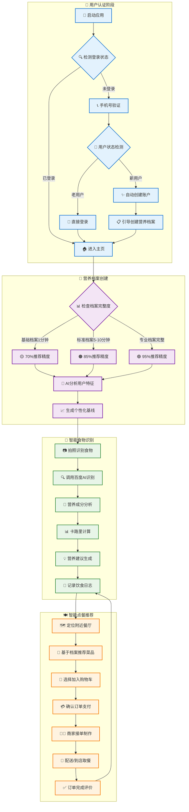
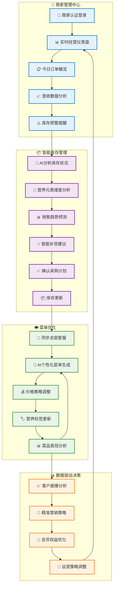
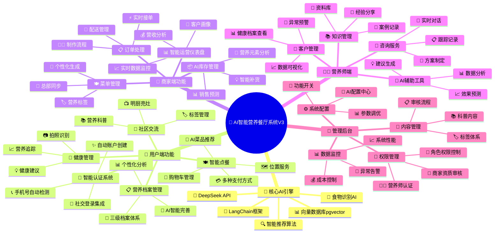

# AI智能营养餐厅系统V3 - 系统架构总览

## 📋 文档概述

本文档提供AI智能营养餐厅系统V3的完整系统架构可视化图表，包括技术架构、业务流程和功能模块的全面展示。

**文档版本**: v1.0  
**最后更新**: 2024年12月  
**技术一致性**: 100%

---

## 🏗️ 系统技术架构图

### 整体架构分层视图

```mermaid
graph TB
    subgraph "🎨 前端应用层 (Frontend Layer)"
        direction TB
        A1[📱 Flutter移动应用<br/>Riverpod 3.0 + Built Value]
        A2[💻 React管理后台<br/>TypeScript + Ant Design]
        
        A1 -.->|用户端| A1U[👤 普通用户界面]
        A1 -.->|商家端| A1M[🏪 商家管理界面]
        A1 -.->|营养师端| A1N[👩‍⚕️ 营养师工作台]
        
        A2 -.->|管理端| A2A[🔧 平台管理]
        A2 -.->|商家端| A2M[📊 商家后台]
    end
    
    subgraph "🔗 API网关层 (API Gateway)"
        direction TB
        B1[🚪 NestJS API服务器]
        B2[🔐 JWT认证中心]
        B3[⚡ WebSocket实时服务]
        B4[📋 API版本控制 v1/v2]
        
        B1 --- B2
        B1 --- B3
        B1 --- B4
    end
    
    subgraph "🧠 业务服务层 (Business Services)"
        direction LR
        C1[👥 用户服务<br/>认证·档案·偏好]
        C2[🤖 AI智能服务<br/>分析·推荐·识别]
        C3[🛒 订单服务<br/>下单·支付·配送]
        C4[🏪 商家服务<br/>菜单·库存·分析]
        C5[👩‍⚕️ 营养师服务<br/>咨询·方案·跟踪]
        C6[💬 社区服务<br/>论坛·内容·交流]
    end
    
    subgraph "🤖 AI智能引擎 (AI Engine)"
        direction TB
        D1[🔗 LangChain框架]
        D2[🧠 DeepSeek API]
        D3[📊 OpenAI Embedding]
        D4[🔍 向量搜索引擎<br/>pgvector]
        
        D1 --- D2
        D1 --- D3
        D1 --- D4
    end
    
    subgraph "💾 数据存储层 (Data Layer)"
        direction TB
        E1[🐘 PostgreSQL 15+<br/>with pgvector]
        E2[⚡ Redis缓存集群]
        
        E1 -.->|关系数据| E1R[👥 用户·订单·商家]
        E1 -.->|向量数据| E1V[🧠 AI嵌入向量]
        E1 -.->|JSON数据| E1J[📋 配置·日志]
        
        E2 -.->|会话缓存| E2S[🔐 用户会话]
        E2 -.->|数据缓存| E2D[⚡ 热点数据]
    end
    
    subgraph "🔌 第三方集成层 (Third-party Integration)"
        direction LR
        F1[💳 支付服务<br/>支付宝·微信·Apple Pay]
        F2[🗺️ 地图服务<br/>高德地图API]
        F3[☁️ 云服务<br/>阿里云OSS·短信]
        F4[📱 推送服务<br/>极光推送]
        F5[👁️ AI识别<br/>百度AI·OCR]
    end
    
    subgraph "🏗️ 基础设施层 (Infrastructure)"
        direction TB
        G1[🐳 Docker容器化]
        G2[🚀 GitHub Actions CI/CD]
        G3[☁️ 云托管服务]
        G4[📊 监控告警系统]
        
        G1 --- G2
        G2 --- G3
        G3 --- G4
    end
    
    %% 连接关系
    A1 --> B1
    A2 --> B1
    B1 --> C1
    B1 --> C2
    B1 --> C3
    B1 --> C4
    B1 --> C5
    B1 --> C6
    
    C2 --> D1
    C2 --> D2
    C2 --> D3
    C2 --> D4
    
    C1 --> E1
    C2 --> E1
    C3 --> E1
    C4 --> E1
    C5 --> E1
    C6 --> E1
    
    B1 --> E2
    C1 --> E2
    
    B1 --> F1
    B1 --> F2
    B1 --> F3
    B1 --> F4
    C2 --> F5
    
    %% 样式定义
    classDef frontend fill:#e3f2fd,stroke:#1976d2,stroke-width:2px,color:#000
    classDef gateway fill:#f3e5f5,stroke:#7b1fa2,stroke-width:2px,color:#000
    classDef business fill:#e8f5e8,stroke:#388e3c,stroke-width:2px,color:#000
    classDef ai fill:#fff3e0,stroke:#f57c00,stroke-width:2px,color:#000
    classDef data fill:#fce4ec,stroke:#c2185b,stroke-width:2px,color:#000
    classDef integration fill:#f1f8e9,stroke:#689f38,stroke-width:2px,color:#000
    classDef infra fill:#e0f2f1,stroke:#00796b,stroke-width:2px,color:#000
    
    class A1,A2,A1U,A1M,A1N,A2A,A2M frontend
    class B1,B2,B3,B4 gateway
    class C1,C2,C3,C4,C5,C6 business
    class D1,D2,D3,D4 ai
    class E1,E2,E1R,E1V,E1J,E2S,E2D data
    class F1,F2,F3,F4,F5 integration
    class G1,G2,G3,G4 infra
```

---

## 🔄 核心业务流程图

### 用户智能营养管理流程

### 营养师AI辅助咨询流程

```mermaid
graph LR
    subgraph "🔍 用户需求分析"
        E1[💬 用户发起咨询] --> E2[📋 填写健康状况]
        E2 --> E3[🎯 明确咨询目标]
        E3 --> E4[🤖 AI预分析用户数据]
    end
    
    subgraph "👩‍⚕️ 营养师匹配"
        E4 --> F1[🔍 智能匹配营养师]
        F1 --> F2[👥 营养师确认接单]
        F2 --> F3[🤖 AI生成初步方案]
        F3 --> F4[👩‍⚕️ 营养师审核调整]
    end
    
    subgraph "💬 实时咨询服务"
        F4 --> G1[💬 开始实时对话]
        G1 --> G2[📊 查看用户数据分析]
        G2 --> G3[📝 制定个性化方案]
        G3 --> G4[📈 设置跟踪指标]
        G4 --> G5[⏰ 安排复查时间]
    end
    
    subgraph "📈 效果跟踪"
        G5 --> H1[📊 数据监控分析]
        H1 --> H2[🚨 异常指标预警]
        H2 --> H3[🔄 方案调整优化]
        H3 --> H4[📋 效果评估报告]
        H4 --> H1
    end
    
    %% 样式
    classDef analysis fill:#e3f2fd,stroke:#1976d2,stroke-width:2px
    classDef matching fill:#f3e5f5,stroke:#7b1fa2,stroke-width:2px
    classDef consultation fill:#e8f5e8,stroke:#388e3c,stroke-width:2px
    classDef tracking fill:#fff3e0,stroke:#f57c00,stroke-width:2px
    
    class E1,E2,E3,E4 analysis
    class F1,F2,F3,F4 matching
    class G1,G2,G3,G4,G5 consultation
    class H1,H2,H3,H4 tracking
```

### 商家智能运营流程

---

## 🧩 功能模块架构图

### 系统功能全景图

---

## 🔧 技术栈详细说明

### 前端技术栈

| 组件 | 技术选型 | 版本 | 用途说明 |
|------|----------|------|----------|
| **移动端框架** | Flutter | 3.19.0+ | 跨平台移动应用开发 |
| **状态管理** | Riverpod | 3.0 | 统一状态管理，替代Provider |
| **数据模型** | Built Value | Latest | 不可变数据类生成，替代Freezed |
| **路由管理** | Go Router | 2.0+ | 声明式路由，支持深度链接 |
| **管理后台** | React | 18.2.0+ | Web管理界面 |
| **UI组件库** | Ant Design | Latest | 企业级UI组件 |
| **类型检查** | TypeScript | Latest | 静态类型检查 |

### 后端技术栈

| 组件 | 技术选型 | 版本 | 用途说明 |
|------|----------|------|----------|
| **服务端框架** | NestJS | 10.0.0+ | 企业级Node.js框架 |
| **ORM框架** | TypeORM | Latest | 对象关系映射，与NestJS原生集成 |
| **API设计** | RESTful | - | 主要API架构，99%场景适用 |
| **实时通信** | WebSocket | - | 订单状态、咨询等实时功能 |
| **身份认证** | JWT + Passport.js | - | 无状态身份验证 |
| **语言** | TypeScript | Latest | 全栈类型安全 |

### 数据存储技术栈

| 组件 | 技术选型 | 版本 | 用途说明 |
|------|----------|------|----------|
| **主数据库** | PostgreSQL | 15+ | 关系数据存储 |
| **向量扩展** | pgvector | Latest | AI向量数据存储和搜索 |
| **缓存** | Redis | 7.0+ | 会话和数据缓存 |
| **存储维度** | 多维度支持 | - | 关系数据、JSON数据、1536维向量 |

### AI技术栈

| 组件 | 技术选型 | 版本 | 用途说明 |
|------|----------|------|----------|
| **AI框架** | LangChain | 0.1.0+ | AI应用开发框架 |
| **大语言模型** | DeepSeek API | Latest | 主要AI服务提供商 |
| **向量化** | OpenAI Embedding | - | 文本向量化服务 |
| **向量搜索** | pgvector | - | 相似度搜索和推荐 |

---

## 📊 性能指标和技术特性

### 系统性能目标

| 指标类型 | 目标值 | 监控方式 |
|----------|--------|----------|
| **API响应时间** | < 200ms | APM监控 |
| **移动端启动** | < 3秒 | 性能埋点 |
| **AI推荐延迟** | < 1秒 | AI服务监控 |
| **数据库查询** | < 100ms | SQL慢查询日志 |
| **向量搜索** | < 500ms | pgvector性能监控 |
| **并发用户** | 10000+ | 负载测试 |
| **可用性** | 99.9% | 健康检查 |

### 技术创新特性

#### 🤖 AI深度集成
- **全流程AI化**: 从用户档案到菜品推荐的端到端AI服务
- **向量搜索**: 基于用户偏好的个性化推荐算法
- **实时分析**: 食物识别和营养成分实时分析
- **智能助手**: 营养师AI辅助工具

#### 🏗️ 架构创新
- **统一技术栈**: 100%技术一致性，降低维护成本
- **模块化设计**: Clean Architecture + Feature-First结构
- **向量数据库**: PostgreSQL + pgvector统一存储方案
- **云原生**: Docker容器化 + 云托管服务

#### 📱 用户体验创新
- **无感认证**: 手机号自动检测注册状态
- **渐进式档案**: 三级档案体系适应不同用户需求
- **实时同步**: WebSocket确保数据实时性
- **多角色集成**: 单一应用支持三种用户角色

---

## 🔒 安全和合规架构 (优化版)

### 数据隐私保护体系
- **分级加密**: L1-L4四级数据敏感度，对应不同加密策略
- **字段级加密**: AES-256-GCM医疗级数据加密，AES-256-CBC高敏感数据加密
- **查询优化**: SHA-256哈希字段支持加密数据快速查询
- **权限控制**: 基于数据敏感度的分级访问控制(RBAC+)
- **审计追踪**: 完整的数据访问日志和操作审计
- **同意管理**: 细粒度用户数据使用同意和撤回机制
- **数据生命周期**: 自动化数据保留、匿名化和安全删除

### AI服务可靠性架构
- **多服务商支持**: DeepSeek + OpenAI + 通义千问 + 本地模型
- **智能路由**: 基于成本、延迟和质量的动态服务选择
- **五级降级策略**: 从备用AI到静态推荐的完整降级体系
- **自动恢复**: 渐进式流量恢复和服务健康监控
- **成本控制**: 实时成本监控和预算告警机制

### 向量数据库弹性架构
- **多存储支持**: PostgreSQL+pgvector + Chroma + Pinecone + Qdrant
- **智能选择**: 基于数据规模和性能要求的存储选择
- **数据迁移**: 无缝向量数据库切换和迁移工具
- **一致性保证**: 跨存储的数据一致性检查和同步

### 业务连续性保障
- **服务降级**: 智能降级决策和用户体验优化
- **熔断机制**: 防止级联故障的多层熔断器
- **数据备份**: 加密数据的安全备份和恢复
- **灾难恢复**: 跨云的灾难恢复和业务连续性计划
- **监控告警**: AI驱动的异常检测和预警系统

---

## 📈 优化实施路线图

### ✅ 已完成优化 (当前版本)
1. **数据隐私合规** - 完整的GDPR合规架构和四级数据保护
2. **AI服务抽象层** - 多服务商支持和智能路由机制
3. **向量数据库抽象** - 多存储方案和无缝迁移能力
4. **降级机制设计** - 五级智能降级和自动恢复策略

### 🔄 近期实施目标 (1-3个月)
1. **Phase 1: 隐私保护实施**
   - 分级加密服务部署
   - 权限控制中间件
   - 数据访问审计系统
   - 用户同意管理界面

2. **Phase 2: AI服务优化**
   - 多AI服务商集成
   - 智能路由算法
   - 降级策略实现
   - 成本监控系统

3. **Phase 3: 向量存储优化**
   - 多存储适配器
   - 数据迁移工具
   - 性能基准测试
   - 智能选择算法

### 📋 中期发展计划 (3-6个月)
1. **性能监控完善** - AI驱动的APM和异常检测
2. **多云部署策略** - 跨云的灾难恢复和负载均衡
3. **AI模型优化** - 本地化部署和模型微调
4. **国际化支持** - 多语言和数据本地化

### 🚀 长期技术愿景 (6-12个月)
1. **智能运维** - 自动化运维和预测性维护
2. **联邦学习** - 隐私保护的分布式AI训练
3. **边缘计算** - 本地AI推理和数据处理
4. **开放生态** - API平台和第三方集成框架

### 🎯 架构演进重点

#### 当前架构优势
- ✅ **风险可控**: 多重备选方案降低单点故障
- ✅ **合规领先**: 超前的隐私保护和数据治理
- ✅ **性能优化**: 智能路由和缓存策略
- ✅ **成本可控**: 动态成本监控和预算管理

#### 持续优化方向
- 🔄 **自动化程度**: 减少人工干预，提高系统自愈能力
- 🔄 **智能化水平**: AI驱动的运维和决策优化
- 🔄 **扩展性**: 支持更大规模用户和数据量
- 🔄 **生态开放**: 构建开发者友好的平台生态

---

**文档维护**: 技术架构组  
**审核状态**: ✅ 已通过技术评审  
**下次更新**: 2025年第一季度