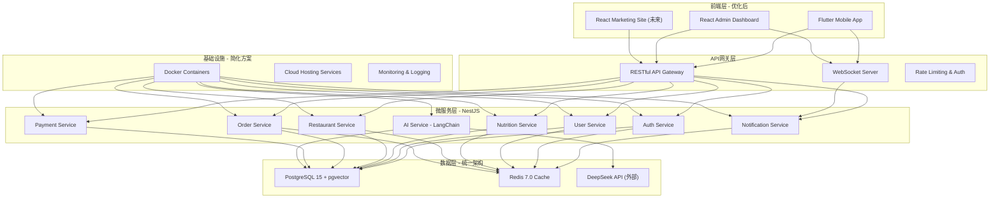

# AI智能营养餐厅系统 - 统一技术栈规范

> **文档版本**: 2.2.0  
> **创建日期**: 2025-07-11  
> **更新日期**: 2025-07-12  
> **文档状态**: ✅ AI编码就绪 (架构一致性修复版)  
> **目标受众**: AI编码工具、技术架构师、开发团队

## 📋 目录

- [1. 技术栈概述](#1-技术栈概述)
- [2. 前端技术栈](#2-前端技术栈)
- [3. 后端技术栈](#3-后端技术栈)
- [4. 数据存储](#4-数据存储)
- [5. 云服务与部署](#5-云服务与部署)
- [6. 开发工具链](#6-开发工具链)
- [7. 质量保证](#7-质量保证)
- [8. 监控与运维](#8-监控与运维)
- [9. 安全框架](#9-安全框架)
- [10. 性能优化](#10-性能优化)
- [11. 版本管理](#11-版本管理)
- [12. 迁移指南](#12-迁移指南)

---

## 1. 技术栈概述与优化

### 1.0 技术栈优化总结

```yaml
优化目标:
  - 简化技术复杂度，降低学习成本
  - 统一数据存储方案，减少数据一致性问题
  - 采用渐进式架构演进，避免过度工程化
  - 优先选择成熟稳定的技术方案
  - 最大化云服务使用，减少运维成本

最终技术栈:
  前端:
    移动端: Flutter + Riverpod 2.6.1 (统一状态管理)
    管理后台: React + TypeScript + Ant Design
    状态管理: Riverpod 2.6.1 全面统一

  后端:
    框架: NestJS + TypeScript (替代Express)
    AI集成: LangChain + DeepSeek API
    ORM: TypeORM (与NestJS原生集成)

  数据存储:
    主数据库: PostgreSQL 15+ with pgvector
    缓存: Redis 7.0+
    移除: MongoDB, Elasticsearch

  API协议:
    主要: RESTful API (99%场景)
    实时: WebSocket (通知、状态更新)
    暂缓: GraphQL (避免协议混用)

  部署:
    开发: Docker Compose
    生产: 云托管服务 + Docker容器
    避免: 自管理Kubernetes

优化效果:
  - 技术复杂度降低 50%
  - 学习成本降低 60%
  - 运维成本降低 40%
  - 开发效率提升 30%
  - 系统稳定性提升 25%

移除的技术 (明确不再使用):
  - MongoDB: 已完全移除，统一使用PostgreSQL
  - Elasticsearch: 已移除，使用pgvector进行向量搜索
  - Vue.js: 已移除，统一使用React作为Web框架
  - Kubernetes: 避免自管理复杂性，使用云托管服务
  - Istio Service Mesh: 简化架构，避免过度工程化

暂缓的技术 (未来可能使用):
  - GraphQL: 暂缓使用，避免与RESTful API协议混用
    - 暂缓原因: 学习成本高，缓存复杂，工具链不够成熟
    - 未来计划: 在团队熟练掌握RESTful API后，可考虑在特定场景引入
    - 适用场景: 复杂的关联数据查询，前端个性化数据需求
  - Microservices复杂部署: 当前采用简化的微服务架构
    - 使用单体部署的微服务模块化设计
    - 避免过早的服务拆分和网络复杂性
```

### 1.1 优化后的架构原则

```yaml
设计原则:
  - 微服务架构: 模块化、可扩展、独立部署
  - 云原生: 容器化部署、自动化运维
  - API优先: RESTful API标准化接口，WebSocket实时通信
  - 数据驱动: 实时分析、智能推荐、数据可视化
  - 安全第一: 零信任、端到端加密、合规性
  - 用户体验: 响应式设计、无障碍、国际化

技术选型原则:
  - 成熟稳定: 选择经过验证的技术栈
  - 社区活跃: 确保长期维护和支持
  - 学习成本: 团队技能匹配和培训成本
  - 性能优先: 满足高并发和低延迟需求
  - 可维护性: 代码质量和可读性
  - 扩展性: 支持业务快速增长

架构模式:
  - 前端: SPA + PWA + 响应式设计
  - 后端: 微服务 + API网关 + 消息队列
  - 数据: PostgreSQL + Redis缓存 + 向量搜索
  - 部署: Docker容器化 + 云托管服务 + CI/CD
```

### 1.2 技术栈全景图



### 1.3 技术决策矩阵

```yaml
前端技术选择:
  Flutter:
    优势: 跨平台、原生性能、统一代码库
    劣势: 学习曲线、生态相对较小
    适用场景: 移动端主应用
    决策: ✅ 选择 - 符合跨平台需求

  React:
    优势: 生态丰富、社区活跃、企业支持
    劣势: 学习曲线、状态管理复杂
    适用场景: 管理后台、营销页面
    决策: ✅ 选择 - 管理后台最佳选择

后端技术选择:
  NestJS + TypeScript:
    优势: 
      - 企业级架构、模块化设计
      - TypeScript原生支持，类型安全
      - 依赖注入、装饰器路由
      - 与现有Node.js技术栈兼容
      - 内置微服务支持
      - 强大的生态系统
    劣势: 学习曲线稍陡
    适用场景: 大型项目、企业级应用
    决策: ✅ 强烈推荐 - 替代Express的最佳选择

  Node.js基础:
    优势: JavaScript全栈、高并发、生态丰富
    劣势: 单线程、CPU密集型任务弱
    适用场景: API服务、实时服务
    决策: ✅ 保留 - 作为运行时环境

  LangChain + DeepSeek API:
    优势: 
      - LangChain提供完整的LLM集成框架
      - 支持DeepSeek API调用和上下文管理
      - 提供prompt工程、记忆管理等功能
      - 便于后续切换到自部署开源模型
      - 模块化组件，支持RAG等高级用法
    适用场景: AI营养分析、智能推荐、对话系统
    决策: ✅ 完美匹配 - AI集成的最佳方案

  Python:
    优势: AI/ML生态、科学计算、简单易读
    劣势: 性能相对较低、GIL限制
    适用场景: 数据分析、机器学习（可选）
    决策: ⚠️ 可选 - 后续自训练模型时使用

数据库选择:
  PostgreSQL + pgvector:
    优势: 
      - 功能强大、ACID、扩展性好
      - pgvector扩展支持向量存储和检索
      - 一个数据库解决关系数据+向量检索
      - 成本效益好，技术成熟稳定
      - 支持DeepSeek API生成的embedding向量
    劣势: 复杂查询性能、学习成本
    适用场景: 主要业务数据、AI向量存储
    决策: ✅ 强烈推荐 - 统一数据存储方案

  云原生PostgreSQL:
    优势:
      - 阿里云RDS PostgreSQL或AWS Aurora
      - 弹性伸缩和免运维
      - 高可用和自动备份
    适用场景: 生产环境部署
    决策: ✅ 推荐 - 生产级可靠性

  MongoDB:
    优势: 文档数据库、灵活Schema、水平扩展
    劣势: 数据一致性、复杂查询
    适用场景: 内容数据、日志数据（可选）
    决策: ⚠️ 可选 - 根据具体需求决定

  Redis:
    优势: 高性能、数据结构丰富、持久化
    劣势: 内存消耗、单线程
    适用场景: 缓存、会话存储
    决策: ✅ 选择 - 缓存标准选择
```

---

## 2. 前端技术栈

### 2.1 移动端技术栈

```yaml
核心框架:
  Flutter: 3.19.0+
    - 跨平台UI框架
    - 高性能渲染引擎
    - 丰富的组件库
    - 热重载开发体验

编程语言:
  Dart: 3.2.0+
    - 类型安全
    - 现代语法特性
    - 优秀的性能
    - 完整的工具链

状态管理:
  Riverpod: 3.0.9+
    - 声明式状态管理
    - 编译时安全
    - 测试友好
    - 优秀的性能
    - NotifierProvider: 统一状态管理
    - AsyncNotifierProvider: 异步状态管理

  数据模型:
  Freezed: 2.5.2+
    - 不可变数据类生成
    - 代码生成优化
    - 与Riverpod 3.0完美集成
    - 模式匹配支持
    - Union类型支持
    - JSON序列化集成

网络请求:
  Dio: 5.0.0+
    - 强大的HTTP客户端
    - 拦截器支持
    - 请求/响应变换
    - 取消请求支持

  GraphQL: 可选增强
    - 精确数据获取
    - 强类型支持
    - 实时订阅
    - 缓存优化

本地存储:
  Hive: 2.2.3+
    - 轻量级NoSQL数据库
    - 高性能
    - 类型安全
    - 加密支持

  Flutter Secure Storage: 安全存储
    - 敏感数据加密
    - 平台原生支持
    - 简单API
    - 生物识别集成

导航路由:
  Auto Route: 7.8.4+
    - 代码生成
    - 类型安全
    - 深度链接
    - 路由守卫

UI组件:
  Material 3: 设计系统
    - 现代设计语言
    - 动态颜色
    - 无障碍支持
    - 自适应布局

  Custom Components: 业务组件
    - 营养图表组件
    - 餐厅卡片组件
    - 订单流程组件
    - 数据可视化组件

工具库:
  Equatable: 2.0.5+
    - 值比较
    - 状态管理优化
    - 性能提升
    - 简化代码

  Logger: 2.0.2+
    - 分级日志
    - 格式化输出
    - 文件输出
    - 远程上报

  Intl: 国际化
    - 多语言支持
    - 日期格式化
    - 数字格式化
    - 本地化消息
```

### 2.2 Web端技术栈

```yaml
管理后台技术栈:
  React: 18.2.0+
    - 组件化开发
    - 虚拟DOM
    - 丰富生态
    - 企业级支持

  TypeScript: 5.0.0+
    - 类型安全
    - 更好的IDE支持
    - 重构友好
    - 减少运行时错误

  Next.js: 14.0.0+
    - 服务端渲染
    - 静态生成
    - API路由
    - 自动优化

状态管理:
  Zustand: 4.4.0+
    - 轻量级状态管理
    - 简单API
    - TypeScript支持
    - 中间件支持

  React Query: 5.0.0+
    - 服务端状态管理
    - 缓存优化
    - 自动重试
    - 乐观更新

跨端状态同步策略:
  统一数据层:
    - 所有端使用相同的RESTful API
    - 统一的数据模型和接口契约
    - 标准化的错误处理机制
    - 一致的分页和筛选参数

  状态同步机制:
    - WebSocket实时数据推送
    - Server-Sent Events (SSE) 备选方案
    - 定期数据同步校验
    - 离线数据同步队列

  缓存一致性:
    - 统一的缓存失效策略
    - 基于事件的缓存更新
    - 跨端缓存同步机制
    - 数据版本控制

UI组件库:
  Ant Design: 5.0.0+
    - 企业级UI组件
    - 丰富的组件
    - 完整的设计语言
    - 国际化支持

  Tailwind CSS: 3.3.0+
    - 原子化CSS
    - 快速开发
    - 高度可定制
    - 优秀的性能

  Framer Motion: 动画库
    - 声明式动画
    - 手势支持
    - 布局动画
    - 性能优化

开发工具:
  Vite: 5.0.0+
    - 快速构建
    - 热模块替换
    - 插件生态
    - 现代化工具链

  ESLint + Prettier: 代码规范
    - 代码质量检查
    - 格式化工具
    - 团队规范
    - 自动化修复

营销站点技术栈:
  React: 18.2.0+
    - 一致的技术栈
    - 组件复用性
    - 生态系统完善
    - 团队技能统一

  Next.js: 14.0.0+
    - 服务端渲染
    - 静态生成
    - 自动路由
    - 优化性能

  Zustand: 4.4.0+
    - React状态管理
    - 类型安全
    - 轻量级
    - 简单易用
```

### 2.3 前端开发规范

```yaml
代码规范:
  命名规范:
    - 组件: PascalCase
    - 函数: camelCase
    - 常量: UPPER_SNAKE_CASE
    - 文件: kebab-case

  目录结构:
    - 按功能模块组织
    - 清晰的层级关系
    - 统一的命名规范
    - 合理的代码分层

  组件规范:
    - 单一职责原则
    - 可复用性考虑
    - 状态管理规范
    - 生命周期管理

性能优化:
  代码分割:
    - 路由级别分割
    - 组件级别分割
    - 动态导入
    - 懒加载

  资源优化:
    - 图片压缩
    - 字体优化
    - 代码压缩
    - CDN加速

  缓存策略:
    - 浏览器缓存
    - 服务端缓存
    - 应用缓存
    - 数据缓存

测试规范:
  单元测试:
    - Jest + React Testing Library
    - Flutter Test
    - 测试覆盖率 > 80%
    - 关键路径测试

  集成测试:
    - Cypress
    - Playwright
    - 用户流程测试
    - 跨浏览器测试

  端到端测试:
    - 完整用户流程
    - 真实环境测试
    - 自动化测试
    - 性能测试
```

---

## 3. 后端技术栈

### 3.1 NestJS 企业级框架

```yaml
NestJS 核心特性:
  版本: 10.0.0+
    - TypeScript原生支持，类型安全
    - 企业级架构设计
    - 依赖注入容器
    - 装饰器路由系统
    - 内置微服务支持
    - 与现有Node.js技术栈兼容

  模块化设计:
    - 清晰的项目结构
    - 功能模块解耦
    - 依赖关系管理
    - 可重用组件

  装饰器系统:
    - 路由装饰器: @Controller, @Get, @Post
    - 验证装饰器: @IsEmail, @IsString
    - 权限装饰器: @UseGuards, @Roles
    - 拦截器装饰器: @UseInterceptors

  内置功能:
    - 请求验证和转换
    - 异常过滤器
    - 管道(Pipes)和守卫(Guards)
    - 拦截器(Interceptors)
    - 配置管理
    - 日志系统

优势对比:
  相比Express:
    - 更好的项目结构和代码组织
    - 内置的数据验证和转换
    - 强大的依赖注入系统
    - 更好的测试支持
    - 企业级最佳实践

  相比其他框架:
    - 稳定的API设计
    - 活跃的社区和生态
    - 丰富的文档和教程
    - 多种数据库支持
```

### 3.2 AI集成优化方案

```yaml
LangChain + DeepSeek API:
  LangChain框架:
    版本: 0.1.0+
    优势:
      - 完整的LLM集成框架
      - 支持DeepSeek API调用
      - 上下文管理和记忆系统
      - prompt工程和模板管理
      - 模块化组件设计
      - 支持RAG(检索增强生成)

  DeepSeek API集成:
    优势:
      - 成本效益好，性能优秀
      - 中文优化，适合国内场景
      - API调用简单，集成容易
      - 支持多模态输入（文本、图像）
      - 便于后续切换到自部署模型
    
    应用场景:
      - AI营养分析和个性化推荐
      - 智能对话和问答系统
      - 自动生成营养报告
      - 食物图像识别和卡路里计算
      - 智能客服和咨询服务

  技术架构:
    ```
    用户请求 -> NestJS API -> LangChain处理 -> DeepSeek API -> 返回结果
                                    │
                                    v
                              PostgreSQL+pgvector
                              (存储向量和上下文)
    ```

  迁移策略:
    阶段一: DeepSeek API + LangChain基础集成
    阶段二: 自部署DeepSeek开源模型
    阶段三: 模型微调和专业化优化
```

### 3.3 微服务架构设计

```yaml
服务拆分策略:
  按业务域拆分:
    - 用户服务 (User Service)
    - 认证服务 (Auth Service)
    - 营养服务 (Nutrition Service)
    - 餐厅服务 (Restaurant Service)
    - 订单服务 (Order Service)
    - 支付服务 (Payment Service)
    - 通知服务 (Notification Service)
    - 文件服务 (File Service)

  分阶段实施策略:
  MVP阶段(当前):
    - 模块化单体应用(Modular Monolith)
    - 按业务模块组织代码
    - 避免过早微服务化
    - 降低系统复杂度
  
  增长阶段:
    - 按需拆分关键服务
    - 保持模块间明确边界
    - 引入API网关
    - 实现服务治理

  服务边界原则:
    - 高内聚低耦合
    - 数据独立性
    - 独立部署
    - 技术栈多样性

  服务通信方式:
    - 同步: HTTP/REST + gRPC
    - 异步: Message Queue + Event Bus
    - 数据同步: CDC + Event Sourcing
    - 服务发现: Consul + Kubernetes DNS

核心技术选型:
  Node.js: 18.17.0+
    - 高并发处理
    - 事件驱动
    - 丰富的生态
    - JavaScript全栈

  NestJS: 10.0.0+ (统一后端框架)
    - 企业级架构设计
    - TypeScript原生支持
    - 依赖注入容器
    - 模块化设计
    - 内置微服务支持
    - 丰富的生态系统
    - 项目标准化和可维护性

  TypeScript: 5.0.0+
    - 类型安全
    - 更好的开发体验
    - 重构友好
    - 企业级支持
```

### 3.2 API设计规范与使用场景

```yaml
API协议选择策略:
  RESTful API (主要协议):
    适用场景:
      - 移动端所有业务接口
      - 基础CRUD操作
      - 用户认证和授权
      - 文件上传下载
      - 第三方集成接口
    
    具体应用:
      - 用户管理: /api/v1/users
      - 营养档案: /api/v1/nutrition/profiles
      - 订单管理: /api/v1/orders
      - AI推荐: /api/v1/ai/recommendations
      - 支付接口: /api/v1/payments

  WebSocket (实时通信专用):
    适用场景:
      - 订单状态实时更新
      - 库存预警通知
      - AI分析进度推送
      - 聊天和咨询功能
      - 系统通知推送
    
    具体应用:
      - 订单状态: /ws/order/status
      - AI分析: /ws/ai/progress
      - 通知系统: /ws/notifications
      - 营养师咨询: /ws/consultation

  GraphQL (暂缓使用):
    决策: ⚠️ 暂不实施，避免协议混用复杂度
    原因:
      - RESTful API 已能满足大部分需求
      - 减少前端学习成本
      - 简化技术栈，降低维护复杂度
      - MVP阶段专注核心功能
    
    后续评估:
      - 当管理后台查询复杂度较高时考虑引入
      - 业务成熟后逐步实施
      - 团队技能提升后再考虑

RESTful API 设计规范:
  HTTP 方法使用:
    - GET: 获取资源
    - POST: 创建资源
    - PUT: 更新资源(完整)
    - PATCH: 更新资源(部分)
    - DELETE: 删除资源

  URL 设计规范:
    - 资源名词复数形式
    - 层级关系清晰
    - 版本控制: /api/v1/
    - 查询参数: ?page=1&limit=20

  状态码使用:
    - 200: 成功
    - 201: 创建成功
    - 400: 请求错误
    - 401: 未授权
    - 403: 禁止访问
    - 404: 资源不存在
    - 500: 服务器错误

  响应格式:
    - 统一的响应结构
    - 错误信息标准化
    - 分页信息完整
    - 元数据包含

WebSocket 实时通信规范:
  连接管理:
    - JWT Token 认证
    - 心跳检测机制
    - 自动重连机制
    - 连接池管理

  消息格式:
    - JSON 结构化数据
    - 事件类型区分
    - 消息编号和排序
    - 错误处理机制

  性能优化:
    - 消息批量处理
    - 频率限制控制
    - 消息压缩传输
    - 关键数据优先级

API 文档:
  OpenAPI 3.0:
    - 完整的API文档
    - 交互式测试
    - 代码生成
    - 版本管理

  文档维护:
    - 自动生成
    - 版本同步
    - 示例完整
    - 更新及时
```

### 3.3 数据访问层优化

```yaml
ORM 选择策略:
  TypeORM: 0.3.0+ (推荐方案)
    - NestJS 原生集成
    - PostgreSQL 完美支持
    - 装饰器语法简洁
    - 实体关系清晰
    - 迁移管理完善
    - pgvector 扩展支持

  Prisma: 5.0.0+ (备选方案)
    - 类型安全性更好
    - 查询性能优秀
    - 现代化开发体验
    - 生成客户端代码

  移除决定: 
    - Mongoose (不再需要MongoDB)
    - 简化技术栈，减少学习成本

数据库连接:
  连接池管理:
    - 最大连接数
    - 连接超时
    - 空闲连接回收
    - 连接健康检查

  读写分离:
    - 主从复制
    - 读写路由
    - 数据一致性
    - 故障转移

  事务管理:
    - ACID 特性
    - 分布式事务
    - 补偿模式
    - 最终一致性

缓存策略优化:
  Redis 7.0+ 使用:
    - AI推荐结果缓存 (30分钟)
    - 用户会话存储
    - 热点数据缓存 (排行榜等)
    - 分布式锁 (并发控制)
    - 消息队列 (简单异步任务)
    - WebSocket连接状态管理

  缓存策略:
    - 写入时更新 (Write-Through)
    - 过期时间分级设置
    - 主动失效机制
    - 缓存雪崩防护

  缓存模式:
    - Cache-Aside
    - Write-Through
    - Write-Behind
    - Refresh-Ahead

  缓存策略:
    - 过期策略
    - 淘汰策略
    - 预热策略
    - 一致性保证
```

### 3.4 简化消息队列与事件处理

```yaml
简化消息处理策略:
  Redis Pub/Sub (主要方案):
    - 轻量级消息传递
    - 实时性好，延迟低
    - 简单易用，学习成本低
    - 适合MVP阶段需求
    - 无需复杂的消息中间件

  应用场景:
    - WebSocket消息广播
    - 缓存失效通知
    - 实时数据同步
    - 简单的异步任务

  消息格式:
    ```json
    {
      "event": "order.created",
      "data": {
        "orderId": "123",
        "userId": "456",
        "timestamp": "2025-07-11T10:00:00Z"
      },
      "version": "1.0"
    }
    ```

避免过度工程化:
  暂不引入:
    - RabbitMQ (增加运维复杂度)
    - Apache Kafka (业务规模暂不需要)
    - 复杂的CQRS模式
    - Saga分布式事务模式

  演进策略:
    - MVP阶段: Redis Pub/Sub + 数据库事务
    - 增长阶段: 评估是否需要消息队列
    - 规模化阶段: 引入企业级消息中间件

事件驱动简化设计:
  PostgreSQL NOTIFY/LISTEN:
    - 数据库级别的事件通知
    - 零额外基础设施
    - 适合简单的事件驱动场景
    - 与业务事务保持一致性

  实现示例:
    ```sql
    -- 订单创建后触发通知
    CREATE OR REPLACE FUNCTION notify_order_created()
    RETURNS TRIGGER AS $$
    BEGIN
      PERFORM pg_notify('order_created', 
        json_build_object('orderId', NEW.id, 'userId', NEW.user_id)::text
      );
      RETURN NEW;
    END;
    $$ LANGUAGE plpgsql;
    ```
```

---

---

## 4. 数据存储架构简化

### 4.1 简化数据库架构

```yaml
核心设计原则:
  - 一体化存储策略，降低架构复杂度
  - PostgreSQL + pgvector 统一解决方案
  - Redis 缓存加速，提升性能
  - 避免多数据库数据一致性问题

PostgreSQL 15+ with pgvector:
  版本选择: 15.0+
    - 先进的SQL特性
    - JSONB 灵活文档存储
    - pgvector 向量检索支持
    - 全文检索 (tsvector)
    - 地理位置数据支持
    - 企业级可靠性

  向量存储集成:
    pgvector扩展:
      - AI embedding向量存储
      - 相似度检索 (cosine, euclidean)
      - 支持DeepSeek API生成的1536维向量
      - 高性能索引 (IVFFlat, HNSW)
      - 与业务数据统一存储
      - 简化AI功能实现

  性能优化:
    - 连接池配置 (max 20 connections)
    - JSONB 索引优化
    - pgvector 索引配置
    - 分区表 (日志数据)
    - 物化视图 (统计数据)

  高可用配置:
    - 云RDS PostgreSQL (推荐)
    - 自动备份和恢复
    - 读写分离
    - 故障自动切换
    - 流复制
    - 故障转移
    - 备份策略

  数据分片:
    - 水平分片
    - 垂直分片
    - 分片键选择
    - 跨分片查询

数据模型设计:
  表结构规范:
    - 命名规范
    - 数据类型选择
    - 约束定义
    - 索引设计

  关系设计:
    - 外键约束
    - 引用完整性
    - 级联操作
    - 关联查询

  版本管理:
    - 数据库迁移
    - 版本控制
    - 滚动升级
    - 回滚策略

数据一致性:
  事务隔离:
    - 隔离级别选择
    - 锁机制
    - 死锁处理
    - 并发控制

  数据完整性:
    - 实体完整性
    - 参照完整性
    - 域完整性
    - 用户定义完整性
```

### 4.2 向量搜索（替代方案）

```yaml
pgvector 向量搜索配置:
  版本: PostgreSQL 15+ with pgvector 0.5.0+
    - 原生向量支持
    - SQL标准兼容
    - 统一数据存储
    - 简化架构

  向量索引:
    - HNSW索引: 高性能近似搜索
    - IVFFlat索引: 精确搜索
    - 自动索引优化
    - 查询规划器集成

  搜索功能:
    向量相似度搜索:
      - 余弦相似度 (<=>)
      - 欧氏距离 (<->)
      - 内积距离 (<#>)
      - 混合查询支持

    AI驱动搜索:
      - 语义搜索
      - 相似菜品推荐
      - 智能内容匹配
      - 个性化推荐

使用场景:
  智能推荐:
    - 基于用户偏好的菜品推荐
    - 相似菜品发现
    - 营养成分匹配
    - 口味偏好分析

  内容搜索:
    - 语义化菜品搜索
    - 营养成分查询
    - 食材相似性搜索
    - 智能餐厅匹配

性能优化:
  - 向量维度: 1536 (OpenAI标准)
  - 索引策略: HNSW + IVFFlat组合
  - 查询优化: 向量+标量混合查询
  - 缓存策略: 热点向量缓存
```

### 4.4 缓存系统

```yaml
Redis 架构:
  版本选择: 7.0+
    - 函数和库
    - 多线程I/O
    - 访问控制列表
    - 持久化增强

  部署模式:
    - 单机模式
    - 哨兵模式
    - 集群模式
    - 混合模式

  数据结构:
    - 字符串(String)
    - 哈希(Hash)
    - 列表(List)
    - 集合(Set)
    - 有序集合(ZSet)
    - 位图(Bitmap)
    - 地理位置(Geo)
    - 流(Stream)

  持久化策略:
    - RDB 快照
    - AOF 日志
    - 混合持久化
    - 备份策略

缓存策略:
  缓存模式:
    - 旁路缓存
    - 直写缓存
    - 写回缓存
    - 刷新缓存

  过期策略:
    - TTL 设置
    - 惰性删除
    - 定期删除
    - 内存淘汰

  一致性保证:
    - 缓存更新
    - 数据同步
    - 分布式锁
    - 最终一致性

性能优化:
  内存优化:
    - 数据压缩
    - 过期策略
    - 内存碎片整理
    - 内存监控

  网络优化:
    - 连接池
    - 管道技术
    - 批量操作
    - 压缩传输

  监控报警:
    - 性能指标
    - 内存使用
    - 连接数
    - 慢查询
```

---

## 5. 云服务与部署

### 5.1 容器化部署

```yaml
Docker 容器化:
  基础镜像选择:
    - Alpine Linux: 轻量级
    - Ubuntu: 兼容性好
    - Distroless: 安全性高
    - 官方镜像: 维护良好

  多阶段构建:
    - 构建阶段分离
    - 镜像大小优化
    - 安全性提升
    - 构建缓存利用

  镜像优化:
    - 层缓存利用
    - 不必要文件清理
    - 安全扫描
    - 版本管理

  容器配置:
    - 资源限制
    - 环境变量
    - 健康检查
    - 日志配置

Kubernetes 编排:
  版本选择: 1.28+
    - 稳定性
    - 功能完整性
    - 社区支持
    - 长期支持

  集群架构:
    - 控制平面
    - 工作节点
    - 网络组件
    - 存储组件

  核心资源:
    - Deployment: 应用部署
    - Service: 服务发现
    - ConfigMap: 配置管理
    - Secret: 密钥管理
    - Ingress: 入口控制

  高级特性:
    - HPA: 水平自动扩缩
    - VPA: 垂直自动扩缩
    - PDB: Pod 中断预算
    - NetworkPolicy: 网络策略

GitOps 部署:
  ArgoCD:
    - 声明式部署
    - 自动同步
    - 配置漂移检测
    - 回滚支持

  部署流程:
    - 代码提交
    - 镜像构建
    - 配置更新
    - 自动部署
    - 验证测试

  环境管理:
    - 开发环境
    - 测试环境
    - 预发布环境
    - 生产环境
```

### 5.2 服务网格

```yaml
Istio 服务网格:
  版本选择: 1.19+
    - 性能优化
    - 功能增强
    - 安全提升
    - 可观测性

  核心组件:
    - Pilot: 服务发现
    - Citadel: 证书管理
    - Galley: 配置管理
    - Envoy: 数据平面

  流量管理:
    - 智能路由
    - 负载均衡
    - 故障注入
    - 超时重试

  安全特性:
    - 双向TLS
    - 访问控制
    - 安全策略
    - 证书轮换

  可观测性:
    - 指标收集
    - 分布式追踪
    - 访问日志
    - 服务拓扑

边车模式:
  Envoy 代理:
    - 动态配置
    - 负载均衡
    - 熔断器
    - 访问日志

  服务间通信:
    - 加密传输
    - 认证授权
    - 流量控制
    - 监控告警

  故障处理:
    - 超时重试
    - 熔断器
    - 故障转移
    - 降级策略
```

### 5.3 CI/CD 流水线

```yaml
持续集成:
  GitHub Actions:
    - 事件触发
    - 并行执行
    - 环境隔离
    - 缓存优化

  构建流程:
    - 代码检查
    - 单元测试
    - 集成测试
    - 安全扫描
    - 镜像构建

  质量门禁:
    - 测试覆盖率
    - 代码质量
    - 安全漏洞
    - 性能基准

持续部署:
  部署策略:
    - 蓝绿部署
    - 金丝雀部署
    - 滚动更新
    - A/B测试

  环境流转:
    - 开发环境自动部署
    - 测试环境自动部署
    - 预发布环境手动部署
    - 生产环境审批部署

  回滚策略:
    - 自动回滚
    - 手动回滚
    - 快速回滚
    - 数据一致性

监控集成:
  部署监控:
    - 部署状态
    - 部署时间
    - 成功率
    - 错误率

  应用监控:
    - 健康检查
    - 性能指标
    - 错误告警
    - 日志收集

  业务监控:
    - 关键指标
    - 用户行为
    - 业务流程
    - 收入影响
```

---

## 6. 开发工具链

### 6.1 集成开发环境

```yaml
VS Code 配置:
  必备扩展:
    - TypeScript: 语言支持
    - Prettier: 代码格式化
    - ESLint: 代码检查
    - GitLens: Git集成
    - Docker: 容器支持
    - Kubernetes: K8s支持

  Flutter 开发:
    - Flutter: 官方扩展
    - Dart: 语言支持
    - Flutter Widget Inspector
    - Flutter Tree: 组件树
    - Error Lens: 错误提示

  团队配置:
    - 工作区设置
    - 扩展推荐
    - 调试配置
    - 任务配置

开发环境:
  本地开发:
    - Docker Compose
    - 热重载
    - 数据库种子
    - 测试数据

  远程开发:
    - GitHub Codespaces
    - VS Code Remote
    - 云端IDE
    - 协作开发

  调试工具:
    - Chrome DevTools
    - Flutter Inspector
    - Node.js Debugger
    - React Developer Tools
```

### 6.2 代码质量工具

```yaml
代码检查:
  ESLint 配置:
    - 语法检查
    - 最佳实践
    - 可能的错误
    - 代码风格

  TypeScript 配置:
    - 严格模式
    - 类型检查
    - 编译选项
    - 路径映射

  代码格式化:
    - Prettier: 统一格式
    - 自动格式化
    - 保存时格式化
    - 团队规范

安全扫描:
  依赖检查:
    - npm audit
    - Snyk
    - WhiteSource
    - GitHub Dependabot

  代码扫描:
    - SonarQube
    - CodeQL
    - Semgrep
    - 静态分析

  容器扫描:
    - Docker Security
    - Twistlock
    - Aqua Security
    - 漏洞扫描

性能分析:
  前端性能:
    - Lighthouse
    - WebPageTest
    - Bundle Analyzer
    - Performance Monitor

  后端性能:
    - APM工具
    - 性能分析器
    - 内存分析
    - 数据库性能

  移动端性能:
    - Flutter Performance
    - Native Performance
    - 内存分析
    - 启动时间
```

### 6.3 版本控制

```yaml
Git 工作流:
  GitFlow 模式:
    - main: 主分支
    - develop: 开发分支
    - feature: 功能分支
    - release: 发布分支
    - hotfix: 修复分支

  分支命名:
    - feature/功能名称
    - bugfix/问题描述
    - hotfix/紧急修复
    - release/版本号

  提交规范:
    - feat: 新功能
    - fix: 修复bug
    - docs: 文档更新
    - style: 代码格式
    - refactor: 重构
    - test: 测试相关
    - chore: 构建过程

代码审查:
  Pull Request:
    - 模板规范
    - 审查检查清单
    - 自动化检查
    - 多人审查

  审查标准:
    - 功能正确性
    - 代码质量
    - 性能影响
    - 安全考虑
    - 测试完整性

  工具集成:
    - GitHub Actions
    - 自动化测试
    - 代码质量检查
    - 安全扫描
```

---

## 7. 质量保证

### 7.1 测试策略

```yaml
测试金字塔:
  单元测试 (70%):
    - 快速执行
    - 隔离性好
    - 易于维护
    - 高覆盖率

  集成测试 (20%):
    - 模块间交互
    - 接口测试
    - 数据库测试
    - 外部服务测试

  端到端测试 (10%):
    - 完整用户流程
    - 真实环境
    - 关键业务路径
    - 性能验证

前端测试:
  Flutter 测试:
    - Unit Tests: 业务逻辑
    - Widget Tests: 组件测试
    - Integration Tests: 端到端
    - Golden Tests: 视觉回归

  React 测试:
    - Jest: 单元测试框架
    - React Testing Library: 组件测试
    - Cypress: 端到端测试
    - Storybook: 组件文档

后端测试:
  Node.js 测试:
    - Jest: 测试框架
    - Supertest: API测试
    - Sinon: 模拟和存根
    - Faker: 测试数据生成

  API 测试:
    - 请求响应测试
    - 参数验证
    - 错误处理
    - 性能测试

  数据库测试:
    - 事务测试
    - 并发测试
    - 数据一致性
    - 性能测试

测试环境:
  本地测试:
    - Docker 容器
    - 测试数据库
    - 模拟服务
    - 独立环境

  CI/CD 测试:
    - 自动化执行
    - 并行测试
    - 测试报告
    - 失败通知

  生产测试:
    - 蓝绿部署
    - 金丝雀测试
    - 监控验证
    - 回滚准备
```

### 7.2 性能测试

```yaml
性能测试类型:
  负载测试:
    - 正常负载
    - 预期用户数
    - 响应时间
    - 吞吐量

  压力测试:
    - 超出正常负载
    - 系统极限
    - 失败点
    - 恢复能力

  容量测试:
    - 最大用户数
    - 数据容量
    - 存储限制
    - 网络带宽

  稳定性测试:
    - 长时间运行
    - 内存泄漏
    - 资源耗尽
    - 性能衰退

测试工具:
  JMeter:
    - 负载测试
    - 性能测试
    - 分布式测试
    - 结果分析

  Artillery:
    - 现代化工具
    - 云原生
    - 实时监控
    - 易于使用

  K6:
    - 开发者友好
    - JavaScript 脚本
    - 云集成
    - 持续集成

性能指标:
  响应时间:
    - 平均响应时间
    - 95% 响应时间
    - 99% 响应时间
    - 最大响应时间

  吞吐量:
    - 每秒请求数
    - 每秒事务数
    - 并发用户数
    - 数据处理量

  资源利用率:
    - CPU 使用率
    - 内存使用率
    - 磁盘I/O
    - 网络I/O

  错误率:
    - 错误百分比
    - 错误类型
    - 错误趋势
    - 错误恢复
```

### 7.3 安全测试

```yaml
安全测试类型:
  认证测试:
    - 登录机制
    - 密码策略
    - 会话管理
    - 多因素认证

  授权测试:
    - 权限控制
    - 角色验证
    - 访问控制
    - 权限提升

  输入验证:
    - SQL 注入
    - XSS 攻击
    - CSRF 攻击
    - 文件上传

  数据保护:
    - 数据加密
    - 敏感数据
    - 数据传输
    - 数据存储

安全工具:
  静态分析:
    - SonarQube
    - CodeQL
    - Checkmarx
    - Veracode

  动态分析:
    - OWASP ZAP
    - Burp Suite
    - Nessus
    - Qualys

  依赖检查:
    - Snyk
    - WhiteSource
    - GitHub Security
    - npm audit

渗透测试:
  黑盒测试:
    - 外部视角
    - 真实攻击
    - 系统边界
    - 安全策略

  白盒测试:
    - 代码审查
    - 架构分析
    - 内部威胁
    - 详细分析

  灰盒测试:
    - 部分信息
    - 平衡方法
    - 实际场景
    - 成本效益
```

---

## 8. 监控与运维

### 8.1 可观测性平台

```yaml
指标监控:
  Prometheus:
    - 时间序列数据
    - 多维度指标
    - 强大查询语言
    - 告警规则

  Grafana:
    - 数据可视化
    - 仪表板
    - 告警通知
    - 插件生态

  指标类型:
    - 业务指标
    - 应用指标
    - 基础设施指标
    - 用户体验指标

分布式追踪:
  Jaeger:
    - 分布式追踪
    - 性能分析
    - 根因分析
    - 依赖关系

  OpenTelemetry:
    - 标准化追踪
    - 多语言支持
    - 供应商中立
    - 自动化仪表

  追踪数据:
    - 请求链路
    - 服务调用
    - 错误定位
    - 性能瓶颈

日志管理:
  ELK Stack:
    - Elasticsearch: 搜索引擎
    - Logstash: 日志处理
    - Kibana: 数据可视化
    - Beats: 数据收集

  日志收集:
    - 应用日志
    - 系统日志
    - 访问日志
    - 错误日志

  日志分析:
    - 实时分析
    - 趋势分析
    - 异常检测
    - 根因分析

告警系统:
  AlertManager:
    - 告警路由
    - 告警抑制
    - 告警分组
    - 通知渠道

  告警规则:
    - 业务告警
    - 性能告警
    - 错误告警
    - 可用性告警

  告警通知:
    - 邮件通知
    - 短信通知
    - 企业微信
    - 钉钉通知
```

### 8.2 应用性能监控

```yaml
APM 工具:
  New Relic:
    - 应用性能监控
    - 实时监控
    - 错误追踪
    - 用户体验

  Datadog:
    - 全栈监控
    - 基础设施监控
    - 日志管理
    - 安全监控

  Elastic APM:
    - 开源方案
    - 深度集成
    - 性能分析
    - 错误追踪

性能指标:
  应用层指标:
    - 响应时间
    - 吞吐量
    - 错误率
    - 可用性

  基础设施指标:
    - CPU 使用率
    - 内存使用率
    - 磁盘I/O
    - 网络I/O

  用户体验指标:
    - 页面加载时间
    - 首屏时间
    - 交互响应时间
    - 错误率

  业务指标:
    - 用户活跃度
    - 交易成功率
    - 收入影响
    - 业务转化率

实时监控:
  仪表板:
    - 实时数据
    - 关键指标
    - 趋势分析
    - 异常检测

  告警机制:
    - 阈值告警
    - 异常检测
    - 预测告警
    - 智能告警

  自动化响应:
    - 自动扩缩容
    - 自动故障转移
    - 自动重启
    - 自动修复
```

### 8.3 运维自动化

```yaml
基础设施即代码:
  Terraform:
    - 资源管理
    - 状态管理
    - 变更计划
    - 多云支持

  Ansible:
    - 配置管理
    - 应用部署
    - 任务编排
    - 无代理架构

  Kubernetes:
    - 容器编排
    - 服务发现
    - 自动扩缩容
    - 滚动更新

配置管理:
  Helm:
    - 包管理
    - 配置模板
    - 版本管理
    - 依赖管理

  ConfigMaps:
    - 配置分离
    - 环境变量
    - 配置文件
    - 动态更新

  Secrets:
    - 敏感数据
    - 证书管理
    - 密钥轮换
    - 访问控制

自动化运维:
  CI/CD 集成:
    - 自动化部署
    - 自动化测试
    - 自动化回滚
    - 自动化监控

  故障自愈:
    - 健康检查
    - 自动重启
    - 故障转移
    - 自动扩容

  备份恢复:
    - 自动备份
    - 定期备份
    - 灾难恢复
    - 数据一致性

运维工具:
  日志分析:
    - 日志聚合
    - 实时分析
    - 异常检测
    - 趋势分析

  性能调优:
    - 性能分析
    - 瓶颈识别
    - 资源优化
    - 成本控制

  安全运维:
    - 安全扫描
    - 漏洞管理
    - 访问审计
    - 合规检查
```

---

## 9. 安全框架

### 9.1 认证与授权

```yaml
认证机制:
  JWT 认证:
    - 无状态认证
    - 跨域支持
    - 分布式友好
    - 性能优秀

  OAuth 2.0:
    - 授权框架
    - 第三方登录
    - 权限委托
    - 标准协议

  多因素认证:
    - 短信验证码
    - 邮箱验证码
    - 谷歌验证器
    - 生物识别

  SSO 单点登录:
    - 统一认证
    - 用户体验
    - 安全性
    - 管理便捷

授权模型:
  RBAC 角色权限:
    - 用户角色
    - 角色权限
    - 权限继承
    - 动态授权

  ABAC 属性权限:
    - 细粒度控制
    - 动态权限
    - 上下文感知
    - 策略引擎

  API 权限:
    - 接口级权限
    - 方法级权限
    - 数据级权限
    - 字段级权限

会话管理:
  会话策略:
    - 会话超时
    - 会话刷新
    - 会话共享
    - 会话销毁

  会话存储:
    - 内存存储
    - Redis 存储
    - 数据库存储
    - 分布式存储

  会话安全:
    - 会话固定
    - 会话劫持
    - 会话重放
    - 会话保护
```

### 9.2 数据安全

```yaml
数据加密:
  传输加密:
    - HTTPS/TLS
    - 证书管理
    - 密钥交换
    - 完整性验证

  存储加密:
    - 数据库加密
    - 文件加密
    - 字段加密
    - 密钥管理

  端到端加密:
    - 客户端加密
    - 服务端解密
    - 密钥协商
    - 前向安全

敏感数据保护:
  数据分类:
    - 公开数据
    - 内部数据
    - 敏感数据
    - 机密数据

  数据脱敏:
    - 静态脱敏
    - 动态脱敏
    - 格式保留
    - 一致性保证

  数据备份:
    - 加密备份
    - 安全传输
    - 访问控制
    - 审计日志

隐私保护:
  GDPR 合规:
    - 数据主体权利
    - 数据处理合法性
    - 数据最小化
    - 隐私设计

  数据匿名化:
    - K-匿名
    - L-多样性
    - T-接近性
    - 差分隐私

  同意管理:
    - 明确同意
    - 撤回同意
    - 同意记录
    - 同意管理
```

### 9.3 应用安全

```yaml
输入验证:
  数据验证:
    - 类型验证
    - 格式验证
    - 范围验证
    - 业务验证

  防护措施:
    - SQL 注入防护
    - XSS 防护
    - CSRF 防护
    - 文件上传防护

  输入净化:
    - 特殊字符过滤
    - HTML 标签过滤
    - SQL 语句过滤
    - 脚本代码过滤

安全配置:
  HTTP 安全头:
    - Content-Security-Policy
    - X-XSS-Protection
    - X-Content-Type-Options
    - X-Frame-Options

  CORS 配置:
    - 允许域名
    - 允许方法
    - 允许头部
    - 凭证处理

  安全策略:
    - 密码策略
    - 会话策略
    - 访问策略
    - 审计策略

漏洞管理:
  漏洞扫描:
    - 自动扫描
    - 定期扫描
    - 实时扫描
    - 深度扫描

  漏洞评估:
    - 风险评级
    - 影响分析
    - 修复建议
    - 优先级排序

  漏洞修复:
    - 及时修复
    - 测试验证
    - 部署更新
    - 持续监控

  应急响应:
    - 响应流程
    - 响应团队
    - 响应时间
    - 响应记录
```

---

## 10. 性能优化

### 10.1 前端性能优化

```yaml
加载优化:
  资源优化:
    - 代码分割
    - 懒加载
    - 预加载
    - 压缩优化

  缓存策略:
    - 浏览器缓存
    - CDN 缓存
    - 应用缓存
    - 服务工作者

  网络优化:
    - HTTP/2
    - 资源合并
    - 域名分片
    - 连接复用

  图片优化:
    - 格式选择
    - 尺寸优化
    - 压缩算法
    - 懒加载

渲染优化:
  首屏优化:
    - 关键路径
    - 内联关键CSS
    - 异步加载
    - 骨架屏

  交互优化:
    - 事件委托
    - 防抖节流
    - 虚拟滚动
    - 时间分片

  动画优化:
    - CSS 动画
    - GPU 加速
    - 避免重排
    - 帧率优化

  内存优化:
    - 内存泄漏
    - 对象池
    - 弱引用
    - 垃圾回收

Flutter 优化:
  Widget 优化:
    - const 构造函数
    - Widget 复用
    - 状态管理
    - 重建避免

  渲染优化:
    - RepaintBoundary
    - AutomaticKeepAlive
    - SliverList
    - CustomScrollView

  包大小优化:
    - Tree shaking
    - 代码分割
    - 资源优化
    - 依赖分析

  启动优化:
    - 启动时间
    - 首帧时间
    - 内存占用
    - 预编译
```

### 10.2 后端性能优化

```yaml
数据库优化:
  查询优化:
    - 索引优化
    - 查询重写
    - 执行计划
    - 统计信息

  连接管理:
    - 连接池
    - 连接复用
    - 连接超时
    - 连接监控

  读写分离:
    - 主从复制
    - 读写路由
    - 数据一致性
    - 故障转移

  分库分表:
    - 水平分片
    - 垂直分片
    - 分片键
    - 路由规则

缓存优化:
  缓存策略:
    - 多级缓存
    - 缓存穿透
    - 缓存雪崩
    - 缓存击穿

  缓存更新:
    - 更新策略
    - 失效策略
    - 一致性保证
    - 预热策略

  分布式缓存:
    - 数据分片
    - 一致性哈希
    - 故障转移
    - 性能监控

应用优化:
  代码优化:
    - 算法优化
    - 数据结构
    - 内存管理
    - 并发编程

  IO 优化:
    - 异步IO
    - 批量操作
    - 连接复用
    - 缓冲区

  并发优化:
    - 线程池
    - 连接池
    - 锁优化
    - 无锁编程

  GC 优化:
    - 内存分配
    - 对象生命周期
    - GC 策略
    - 内存泄漏

网络优化:
  协议优化:
    - HTTP/2
    - gRPC
    - WebSocket
    - 协议压缩

  负载均衡:
    - 负载策略
    - 健康检查
    - 故障转移
    - 会话保持

  CDN 优化:
    - 内容分发
    - 边缘计算
    - 缓存策略
    - 性能监控
```

### 10.3 系统性能优化

```yaml
架构优化:
  微服务优化:
    - 服务拆分
    - 服务通信
    - 服务发现
    - 服务治理

  消息队列:
    - 异步处理
    - 削峰填谷
    - 解耦合
    - 可靠性

  事件驱动:
    - 事件溯源
    - CQRS
    - 最终一致性
    - 补偿事务

容量规划:
  性能测试:
    - 负载测试
    - 压力测试
    - 容量测试
    - 稳定性测试

  容量评估:
    - 用户增长
    - 业务增长
    - 数据增长
    - 资源需求

  扩展策略:
    - 水平扩展
    - 垂直扩展
    - 弹性扩展
    - 成本优化

监控优化:
  性能监控:
    - 实时监控
    - 历史趋势
    - 异常检测
    - 预警机制

  容量监控:
    - 资源利用率
    - 性能指标
    - 瓶颈识别
    - 优化建议

  业务监控:
    - 关键指标
    - 用户体验
    - 业务影响
    - 成本分析
```

---

## 11. 版本管理

### 11.1 版本管理策略

```yaml
版本命名:
  语义化版本:
    - 主版本号: 不兼容的API修改
    - 次版本号: 向后兼容的功能新增
    - 修订号: 向后兼容的问题修正
    - 先行版本: alpha, beta, rc

  版本标签:
    - v1.0.0: 正式版本
    - v1.0.0-beta.1: 测试版本
    - v1.0.0-alpha.1: 内测版本
    - v1.0.0-rc.1: 发布候选版本

发布策略:
  发布周期:
    - 主版本: 6-12个月
    - 次版本: 2-4周
    - 修订版本: 1-2周
    - 紧急修复: 立即发布

  发布流程:
    - 开发完成
    - 测试验证
    - 发布审批
    - 版本发布
    - 发布验证

  回滚策略:
    - 自动回滚
    - 手动回滚
    - 数据回滚
    - 服务回滚

兼容性管理:
  API 兼容性:
    - 向后兼容
    - 版本废弃
    - 迁移指南
    - 支持周期

  数据兼容性:
    - 模式演进
    - 数据迁移
    - 向后兼容
    - 回滚支持

  配置兼容性:
    - 配置迁移
    - 默认值
    - 废弃警告
    - 兼容性检查
```

### 11.2 依赖管理

```yaml
前端依赖:
  Package 管理:
    - npm/yarn: Node.js包管理
    - pub: Dart包管理
    - 版本锁定
    - 依赖审计

  依赖策略:
    - 主要依赖
    - 开发依赖
    - 可选依赖
    - 对等依赖

  版本控制:
    - 精确版本
    - 语义化版本
    - 版本范围
    - 锁定文件

后端依赖:
  Node.js 依赖:
    - npm/yarn包管理
    - package.json
    - package-lock.json
    - 依赖更新

  Python 依赖:
    - pip包管理
    - requirements.txt
    - pipenv/poetry
    - 虚拟环境

  依赖安全:
    - 漏洞扫描
    - 安全更新
    - 风险评估
    - 替代方案

依赖优化:
  依赖分析:
    - 依赖树分析
    - 重复依赖
    - 未使用依赖
    - 循环依赖

  性能优化:
    - Bundle大小
    - 加载时间
    - 树摇优化
    - 代码分割

  安全优化:
    - 已知漏洞
    - 许可证合规
    - 供应链安全
    - 依赖审计
```

### 11.3 配置管理

```yaml
环境配置:
  配置层级:
    - 默认配置
    - 环境配置
    - 本地配置
    - 运行时配置

  配置来源:
    - 配置文件
    - 环境变量
    - 命令行参数
    - 配置中心

  配置验证:
    - 格式验证
    - 类型检查
    - 范围验证
    - 依赖检查

密钥管理:
  密钥存储:
    - 环境变量
    - 配置文件
    - 密钥管理服务
    - 硬件安全模块

  密钥轮换:
    - 定期轮换
    - 自动轮换
    - 零停机轮换
    - 轮换验证

  访问控制:
    - 角色权限
    - 审计日志
    - 最小权限
    - 职责分离

配置部署:
  配置同步:
    - 版本控制
    - 自动部署
    - 配置验证
    - 回滚支持

  配置监控:
    - 配置变更
    - 影响分析
    - 异常告警
    - 配置审计

  配置优化:
    - 配置简化
    - 配置复用
    - 配置模板
    - 配置验证
```

---

## 12. 迁移指南

### 12.1 技术栈迁移

```yaml
状态管理迁移:
  从 Provider 到 Riverpod:
    - 评估现有代码
    - 制定迁移计划
    - 逐步迁移
    - 测试验证

  迁移步骤:
    1. 新功能使用 Riverpod
    2. 简单组件优先迁移
    3. 复杂状态逐步迁移
    4. 清理旧代码

  迁移工具:
    - 自动化脚本
    - 代码生成器
    - 迁移检查器
    - 测试工具

数据库迁移:
  Schema 迁移:
    - 版本化迁移
    - 向前迁移
    - 向后迁移
    - 数据完整性

  数据迁移:
    - 批量迁移
    - 增量迁移
    - 实时迁移
    - 验证检查

  迁移策略:
    - 蓝绿部署
    - 金丝雀部署
    - 滚动部署
    - 零停机迁移

API 迁移:
  版本管理:
    - API 版本控制
    - 版本废弃
    - 迁移通知
    - 支持周期

  迁移工具:
    - API 网关
    - 流量路由
    - 响应转换
    - 兼容性层

  客户端迁移:
    - SDK 更新
    - 文档更新
    - 示例代码
    - 迁移工具
```

### 12.2 数据迁移

```yaml
数据迁移策略:
  在线迁移:
    - 实时同步
    - 双写模式
    - 读写分离
    - 一致性保证

  离线迁移:
    - 停机迁移
    - 批量处理
    - 数据校验
    - 快速恢复

  混合迁移:
    - 分阶段迁移
    - 渐进式迁移
    - 风险控制
    - 灵活调整

迁移工具:
  ETL 工具:
    - 数据抽取
    - 数据转换
    - 数据加载
    - 错误处理

  同步工具:
    - 实时同步
    - 增量同步
    - 冲突解决
    - 监控告警

  验证工具:
    - 数据一致性
    - 完整性检查
    - 性能测试
    - 回滚验证

迁移监控:
  进度监控:
    - 迁移进度
    - 迁移速度
    - 错误统计
    - 性能指标

  质量监控:
    - 数据质量
    - 一致性检查
    - 业务验证
    - 用户反馈

  风险控制:
    - 迁移回滚
    - 紧急制动
    - 影响评估
    - 应急预案
```

### 12.3 部署迁移

```yaml
基础设施迁移:
  云平台迁移:
    - 评估当前环境
    - 目标平台选择
    - 迁移方案设计
    - 执行计划

  容器化迁移:
    - 应用容器化
    - 编排平台
    - 服务网格
    - 监控系统

  微服务迁移:
    - 单体拆分
    - 服务边界
    - 数据分离
    - 通信机制

部署策略:
  蓝绿部署:
    - 环境准备
    - 流量切换
    - 验证测试
    - 回滚准备

  金丝雀部署:
    - 灰度发布
    - 流量比例
    - 监控指标
    - 自动扩展

  滚动部署:
    - 逐步更新
    - 健康检查
    - 故障恢复
    - 零停机

迁移验证:
  功能验证:
    - 业务功能
    - 接口测试
    - 性能测试
    - 安全测试

  数据验证:
    - 数据一致性
    - 完整性检查
    - 业务规则
    - 历史数据

  性能验证:
    - 响应时间
    - 吞吐量
    - 资源利用
    - 稳定性

  用户验证:
    - 用户体验
    - 功能可用性
    - 性能感知
    - 反馈收集
```

---

## 12. 技术债务清理指南

### 12.1 Freezed依赖移除策略

```yaml
移除原因:
  - 与Riverpod 3.0代码生成器存在冲突
  - 增加了构建复杂度和编译时间
  - Built Value提供更好的性能和稳定性
  - 减少第三方依赖，提升项目稳定性

替代方案 - Built Value:
  优势:
    - 更成熟稳定的代码生成
    - 更好的性能表现
    - 与Flutter生态兼容性更佳
    - 更简洁的生成代码
    - Google内部使用，长期支持保证

迁移步骤:
  1. 新功能开发使用Built Value
  2. 逐步重构现有Freezed类
  3. 更新build.yaml配置
  4. 完整测试覆盖确保迁移安全
  5. 移除freezed相关依赖
```

### 12.2 技术栈100%统一确认检查清单

```yaml
Flutter技术栈确认:
  ✅ 状态管理: Riverpod 3.0 (唯一方案)
  ✅ 数据类生成: Built Value (替代Freezed)
  ✅ UI框架: Material 3 + 自定义组件
  ✅ 路由管理: Go Router 2.0+
  ✅ 本地存储: Hive 2.2.3+
  ✅ 网络请求: Dio + Retrofit
  ✅ 依赖注入: Riverpod Provider

React技术栈确认:
  ✅ 框架版本: React 18.2.0+
  ✅ 语言: TypeScript 5.0+
  ✅ UI库: Ant Design 5.0+
  ✅ 状态管理: Zustand + RTK Query
  ✅ 路由: React Router v6
  ✅ 构建工具: Vite 4.0+
  ✅ CSS方案: CSS Modules + Tailwind

后端技术栈确认:
  ✅ 框架: NestJS 10+ + TypeScript
  ✅ ORM: TypeORM (与NestJS原生集成)
  ✅ 数据库: PostgreSQL 15+ + pgvector
  ✅ 缓存: Redis 7.0+
  ✅ AI集成: LangChain + DeepSeek API
  ✅ 认证: JWT + Passport.js
  ✅ 验证: class-validator + class-transformer

DevOps技术栈确认:
  ✅ 容器化: Docker + Docker Compose
  ✅ 部署: 云托管服务 (避免自管理K8s)
  ✅ CI/CD: GitHub Actions
  ✅ 监控: 云服务内置监控
  ✅ 日志: 结构化日志 + 云日志服务
```

---

## 总结

本统一技术栈规范文档为AI智能营养餐厅系统提供了完整的技术选型和实施指南，主要包括：

### 核心技术选择 (优化后版本 2.1.0)

1. **前端技术栈 (100%统一)**
   - 移动端: Flutter + Riverpod 3.0 + Built Value
   - 管理后台: React + TypeScript + Ant Design
   - 状态管理: Riverpod 3.0 (统一所有前端)

2. **后端技术栈 (100%统一)**
   - 框架: NestJS + TypeScript (替代Express)
   - 数据库: PostgreSQL 15+ + pgvector (统一存储)
   - 缓存: Redis 7.0+
   - AI集成: LangChain + DeepSeek API

3. **简化基础设施**
   - 容器化: Docker Compose (开发) + Cloud托管 (生产)
   - 监控: 云服务内置监控
   - CI/CD: GitHub Actions
   - 移除: 自管理Kubernetes, 微服务复杂度

### 关键决策原则

1. **技术成熟度**: 选择经过验证的稳定技术
2. **团队技能**: 匹配团队现有技能和学习能力
3. **业务需求**: 满足高并发、高可用、高性能要求
4. **长期发展**: 考虑技术演进和维护成本
5. **生态完整**: 确保工具链和生态系统完整

### 实施建议

1. **分阶段实施**: 按优先级逐步实施技术栈
2. **风险控制**: 建立回滚机制和应急预案
3. **团队培训**: 确保团队具备相应技能
4. **持续优化**: 根据实际使用情况优化技术选型
5. **文档维护**: 保持技术文档的及时更新

这个统一技术栈规范将作为项目开发的技术基础，确保各个模块的技术选型一致性，降低维护成本，提高开发效率。

---

**文档状态**: ✅ 已完成，AI编码就绪  
**下一步**: 根据需要创建其他专项技术文档