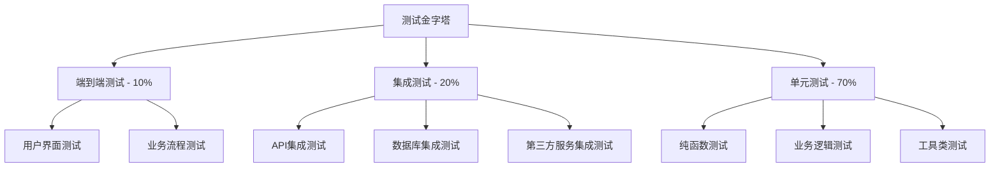

# AI智能营养餐厅系统 - 综合测试规范与策略

> **文档版本**: 3.0.0  
> **创建日期**: 2025-07-23  
> **文档状态**: ✅ 测试规范制定完成  
> **目标受众**: 开发团队、QA团队、DevOps团队、AI编码工具

## 📋 目录

- [1. 测试策略概述](#1-测试策略概述)
- [2. 测试金字塔架构](#2-测试金字塔架构)
- [3. 单元测试规范](#3-单元测试规范)
- [4. 集成测试规范](#4-集成测试规范)
- [5. 端到端测试规范](#5-端到端测试规范)
- [6. 性能测试规范](#6-性能测试规范)
- [7. 安全测试规范](#7-安全测试规范)
- [8. AI服务测试规范](#8-ai服务测试规范)
- [9. 移动端测试规范](#9-移动端测试规范)
- [10. Web端测试规范](#10-web端测试规范)
- [11. API测试规范](#11-api测试规范)
- [12. 数据库测试规范](#12-数据库测试规范)
- [13. 测试环境配置](#13-测试环境配置)
- [14. 测试自动化流程](#14-测试自动化流程)
- [15. 测试报告和度量](#15-测试报告和度量)

---

## 1. 测试策略概述

### 1.1 测试目标与原则

```yaml
核心目标:
  - 确保功能正确性和业务逻辑准确性
  - 保障系统性能和稳定性
  - 验证用户体验和界面一致性
  - 确保数据安全和隐私保护
  - 验证AI推荐算法的准确性

质量标准:
  - 代码覆盖率: ≥ 85%
  - 单元测试通过率: 100%
  - 集成测试通过率: ≥ 95%
  - 端到端测试通过率: ≥ 90%
  - 性能测试达标率: ≥ 95%

测试原则:
  - 左移测试: 尽早发现和修复问题
  - 自动化优先: 最大化自动化测试覆盖
  - 风险驱动: 重点测试高风险功能
  - 持续改进: 基于数据不断优化测试策略
```

### 1.2 测试分层策略



---

## 2. 测试金字塔架构

### 2.1 测试分层详解

```yaml
单元测试层 (70%):
  目标: 测试独立的代码单元
  工具: 
    - Flutter: flutter_test
    - React: Jest + Testing Library
    - Node.js: Jest + Supertest
    - 数据库: TypeORM测试工具
  
  覆盖范围:
    - 纯函数和工具类
    - 业务逻辑服务类
    - 数据模型和验证逻辑
    - 状态管理逻辑
    - AI推荐算法核心逻辑

集成测试层 (20%):
  目标: 测试组件间的交互
  工具:
    - API测试: Postman/Newman, Supertest
    - 数据库测试: Test Containers
    - 消息队列测试: Test Containers
  
  覆盖范围:
    - API端点集成
    - 数据库操作集成
    - 外部服务集成(支付、AI服务)
    - WebSocket实时通信
    - 文件上传和处理

端到端测试层 (10%):
  目标: 测试完整的用户场景
  工具:
    - Web端: Playwright, Cypress
    - 移动端: Flutter Integration Test, Appium
  
  覆盖范围:
    - 核心用户流程
    - 跨平台一致性
    - 关键业务场景
    - 错误处理流程
```

---

## 3. 单元测试规范

### 3.1 Flutter单元测试

```dart
// test/features/auth/providers/auth_provider_test.dart
import 'package:flutter_test/flutter_test.dart';
import 'package:mockito/mockito.dart';
import 'package:mockito/annotations.dart';
import 'package:flutter_riverpod/flutter_riverpod.dart';

// 生成Mock类
@GenerateMocks([AuthRepository, UserRepository])
import 'auth_provider_test.mocks.dart';

void main() {
  group('AuthNotifier', () {
    late MockAuthRepository mockAuthRepository;
    late MockUserRepository mockUserRepository;
    late ProviderContainer container;

    setUp(() {
      mockAuthRepository = MockAuthRepository();
      mockUserRepository = MockUserRepository();
      
      container = ProviderContainer(
        overrides: [
          authRepositoryProvider.overrideWithValue(mockAuthRepository),
          userRepositoryProvider.overrideWithValue(mockUserRepository),
        ],
      );
    });

    tearDown(() {
      container.dispose();
    });

    group('login', () {
      test('成功登录应更新认证状态', () async {
        // Arrange
        const phone = '13812345678';
        const verificationCode = '123456';
        final user = User(id: 'user1', phone: phone);
        final authResult = AuthResult(
          user: user,
          token: 'test-token',
          refreshToken: 'refresh-token',
        );

        when(mockAuthRepository.login(phone, verificationCode))
            .thenAnswer((_) async => authResult);
        
        // Act
        final notifier = container.read(authNotifierProvider.notifier);
        await notifier.login(phone, verificationCode);
        
        // Assert
        final state = container.read(authNotifierProvider);
        expect(state.isAuthenticated, true);
        expect(state.user, user);
        expect(state.token, 'test-token');
      });

      test('登录失败应设置错误状态', () async {
        // Arrange
        const phone = '13812345678';
        const verificationCode = 'invalid';
        
        when(mockAuthRepository.login(phone, verificationCode))
            .thenThrow(const AuthException('验证码错误'));
        
        // Act & Assert
        final notifier = container.read(authNotifierProvider.notifier);
        
        expect(
          () => notifier.login(phone, verificationCode),
          throwsA(isA<AuthException>()),
        );
      });

      test('自动注册新用户应创建用户档案', () async {
        // Arrange
        const phone = '13812345678';
        const verificationCode = '123456';
        final newUser = User(id: 'new-user', phone: phone);
        final authResult = AuthResult(
          user: newUser,
          token: 'test-token',
          refreshToken: 'refresh-token',
          isNewUser: true,
        );

        when(mockAuthRepository.login(phone, verificationCode))
            .thenAnswer((_) async => authResult);
        when(mockUserRepository.createUserProfile(newUser.id))
            .thenAnswer((_) async => UserProfile.empty(userId: newUser.id));
        
        // Act
        final notifier = container.read(authNotifierProvider.notifier);
        await notifier.login(phone, verificationCode);
        
        // Assert
        verify(mockUserRepository.createUserProfile(newUser.id)).called(1);
        final state = container.read(authNotifierProvider);
        expect(state.user, newUser);
      });
    });

    group('logout', () {
      test('退出登录应清除认证状态', () async {
        // Arrange - 先设置已登录状态
        final user = User(id: 'user1', phone: '13812345678');
        final authState = AuthState.authenticated(
          user: user,
          token: 'test-token',
          refreshToken: 'refresh-token',
        );
        
        container.read(authNotifierProvider.notifier).state = authState;
        
        when(mockAuthRepository.logout('test-token'))
            .thenAnswer((_) async {});
        
        // Act
        final notifier = container.read(authNotifierProvider.notifier);
        await notifier.logout();
        
        // Assert
        final state = container.read(authNotifierProvider);
        expect(state.isAuthenticated, false);
        expect(state.user, null);
        expect(state.token, null);
      });
    });
  });
}
```

### 3.2 NestJS单元测试

```typescript
// backend/src/modules/auth/auth.service.spec.ts
import { Test, TestingModule } from '@nestjs/testing';
import { JwtService } from '@nestjs/jwt';
import { ConfigService } from '@nestjs/config';
import { AuthService } from './auth.service';
import { UsersService } from '../users/users.service';
import { SmsService } from '../sms/sms.service';
import { RedisService } from '../redis/redis.service';
import { LoginDto } from './dto/login.dto';

describe('AuthService', () => {
  let service: AuthService;
  let usersService: UsersService;
  let jwtService: JwtService;
  let smsService: SmsService;
  let redisService: RedisService;

  const mockUsersService = {
    findByPhone: jest.fn(),
    create: jest.fn(),
    updateLastLogin: jest.fn(),
  };

  const mockJwtService = {
    signAsync: jest.fn(),
  };

  const mockSmsService = {
    sendVerificationCode: jest.fn(),
    verifyCode: jest.fn(),
  };

  const mockRedisService = {
    get: jest.fn(),
    set: jest.fn(),
    del: jest.fn(),
  };

  beforeEach(async () => {
    const module: TestingModule = await Test.createTestingModule({
      providers: [
        AuthService,
        {
          provide: UsersService,
          useValue: mockUsersService,
        },
        {
          provide: JwtService,
          useValue: mockJwtService,
        },
        {
          provide: SmsService,
          useValue: mockSmsService,
        },
        {
          provide: RedisService,
          useValue: mockRedisService,
        },
        {
          provide: ConfigService,
          useValue: {
            get: jest.fn().mockReturnValue('test-secret'),
          },
        },
      ],
    }).compile();

    service = module.get<AuthService>(AuthService);
    usersService = module.get<UsersService>(UsersService);
    jwtService = module.get<JwtService>(JwtService);
    smsService = module.get<SmsService>(SmsService);
    redisService = module.get<RedisService>(RedisService);
  });

  afterEach(() => {
    jest.clearAllMocks();
  });

  describe('login', () => {
    const loginDto: LoginDto = {
      phone: '13812345678',
      verificationCode: '123456',
    };

    it('已有用户登录成功', async () => {
      // Arrange
      const existingUser = {
        id: 'user-1',
        phone: '13812345678',
        roles: ['user'],
        isActive: true,
      };

      mockSmsService.verifyCode.mockResolvedValue(true);
      mockUsersService.findByPhone.mockResolvedValue(existingUser);
      mockJwtService.signAsync.mockResolvedValue('test-access-token');
      mockUsersService.updateLastLogin.mockResolvedValue(undefined);

      // Act
      const result = await service.login(loginDto);

      // Assert
      expect(result).toEqual({
        user: existingUser,
        accessToken: 'test-access-token',
        refreshToken: expect.any(String),
        isNewUser: false,
      });

      expect(mockSmsService.verifyCode).toHaveBeenCalledWith(
        loginDto.phone,
        loginDto.verificationCode,
      );
      expect(mockUsersService.updateLastLogin).toHaveBeenCalledWith(existingUser.id);
    });

    it('新用户自动注册登录', async () => {
      // Arrange
      const newUser = {
        id: 'new-user-1',
        phone: '13812345678',
        roles: ['user'],
        isActive: true,
      };

      mockSmsService.verifyCode.mockResolvedValue(true);
      mockUsersService.findByPhone.mockResolvedValue(null);
      mockUsersService.create.mockResolvedValue(newUser);
      mockJwtService.signAsync.mockResolvedValue('test-access-token');

      // Act
      const result = await service.login(loginDto);

      // Assert
      expect(result).toEqual({
        user: newUser,
        accessToken: 'test-access-token',
        refreshToken: expect.any(String),
        isNewUser: true,
      });

      expect(mockUsersService.create).toHaveBeenCalledWith({
        phone: loginDto.phone,
        roles: ['user'],
      });
    });

    it('验证码错误应抛出异常', async () => {
      // Arrange
      mockSmsService.verifyCode.mockResolvedValue(false);

      // Act & Assert
      await expect(service.login(loginDto)).rejects.toThrow(
        'Verification code is invalid or expired',
      );

      expect(mockUsersService.findByPhone).not.toHaveBeenCalled();
    });

    it('频繁登录失败应限制请求', async () => {
      // Arrange
      const cacheKey = `login_attempts:${loginDto.phone}`;
      mockRedisService.get.mockResolvedValue('5'); // 已尝试5次

      // Act & Assert
      await expect(service.login(loginDto)).rejects.toThrow(
        'Too many login attempts. Please try again later.',
      );
    });
  });

  describe('sendVerificationCode', () => {
    it('成功发送验证码', async () => {
      // Arrange
      const phone = '13812345678';
      const verificationCode = '123456';

      mockSmsService.sendVerificationCode.mockResolvedValue(verificationCode);
      mockRedisService.set.mockResolvedValue('OK');

      // Act
      const result = await service.sendVerificationCode(phone);

      // Assert
      expect(result).toEqual({ success: true });
      expect(mockSmsService.sendVerificationCode).toHaveBeenCalledWith(phone);
      expect(mockRedisService.set).toHaveBeenCalledWith(
        `verification_code:${phone}`,
        verificationCode,
        300, // 5分钟过期
      );
    });

    it('短时间内重复发送应限制', async () => {
      // Arrange
      const phone = '13812345678';
      const cacheKey = `sms_rate_limit:${phone}`;
      mockRedisService.get.mockResolvedValue('1'); // 已发送过

      // Act & Assert
      await expect(service.sendVerificationCode(phone)).rejects.toThrow(
        'Please wait before sending another verification code',
      );
    });
  });
});
```

### 3.3 React组件单元测试

```typescript
// frontend/src/components/common/AppButton/AppButton.test.tsx
import React from 'react';
import { render, screen, fireEvent, waitFor } from '@testing-library/react';
import '@testing-library/jest-dom';
import { AppButton } from './AppButton';

describe('AppButton', () => {
  const defaultProps = {
    children: 'Test Button',
    onClick: jest.fn(),
  };

  beforeEach(() => {
    jest.clearAllMocks();
  });

  it('渲染基本按钮', () => {
    render(<AppButton {...defaultProps} />);
    
    const button = screen.getByRole('button', { name: 'Test Button' });
    expect(button).toBeInTheDocument();
    expect(button).toBeEnabled();
  });

  it('点击按钮触发onClick回调', () => {
    render(<AppButton {...defaultProps} />);
    
    const button = screen.getByRole('button');
    fireEvent.click(button);
    
    expect(defaultProps.onClick).toHaveBeenCalledTimes(1);
  });

  it('禁用状态下不触发onClick', () => {
    render(<AppButton {...defaultProps} disabled />);
    
    const button = screen.getByRole('button');
    fireEvent.click(button);
    
    expect(button).toBeDisabled();
    expect(defaultProps.onClick).not.toHaveBeenCalled();
  });

  it('加载状态显示加载指示器', () => {
    render(<AppButton {...defaultProps} loading />);
    
    const button = screen.getByRole('button');
    const loadingSpinner = screen.getByTestId('loading-spinner');
    
    expect(button).toBeDisabled();
    expect(loadingSpinner).toBeInTheDocument();
    expect(screen.queryByText('Test Button')).not.toBeInTheDocument();
  });

  it('支持不同的按钮变体', () => {
    const { rerender } = render(
      <AppButton {...defaultProps} variant="primary" />
    );
    
    let button = screen.getByRole('button');
    expect(button).toHaveClass('btn-primary');
    
    rerender(<AppButton {...defaultProps} variant="secondary" />);
    button = screen.getByRole('button');
    expect(button).toHaveClass('btn-secondary');
    
    rerender(<AppButton {...defaultProps} variant="outline" />);
    button = screen.getByRole('button');
    expect(button).toHaveClass('btn-outline');
  });

  it('支持不同的按钮尺寸', () => {
    const { rerender } = render(
      <AppButton {...defaultProps} size="small" />
    );
    
    let button = screen.getByRole('button');
    expect(button).toHaveClass('btn-small');
    
    rerender(<AppButton {...defaultProps} size="large" />);
    button = screen.getByRole('button');
    expect(button).toHaveClass('btn-large');
  });

  it('支持自定义className', () => {
    render(
      <AppButton {...defaultProps} className="custom-button" />
    );
    
    const button = screen.getByRole('button');
    expect(button).toHaveClass('custom-button');
  });

  it('异步操作完成后恢复正常状态', async () => {
    const asyncOnClick = jest.fn(() => 
      new Promise(resolve => setTimeout(resolve, 100))
    );
    
    render(<AppButton onClick={asyncOnClick}>Async Button</AppButton>);
    
    const button = screen.getByRole('button');
    fireEvent.click(button);
    
    // 点击后应该显示加载状态
    await waitFor(() => {
      expect(button).toBeDisabled();
    });
    
    // 异步操作完成后恢复正常
    await waitFor(() => {
      expect(button).toBeEnabled();
    }, { timeout: 200 });
  });
});
```

---

## 4. 集成测试规范

### 4.1 API集成测试

```typescript
// backend/test/integration/auth.integration.spec.ts
import { Test, TestingModule } from '@nestjs/testing';
import { INestApplication } from '@nestjs/common';
import * as request from 'supertest';
import { AppModule } from '../../src/app.module';
import { DatabaseTestModule } from '../utils/database-test.module';
import { RedisTestModule } from '../utils/redis-test.module';

describe('Auth Integration (e2e)', () => {
  let app: INestApplication;
  let moduleRef: TestingModule;

  beforeAll(async () => {
    moduleRef = await Test.createTestingModule({
      imports: [
        AppModule,
        DatabaseTestModule,
        RedisTestModule,
      ],
    }).compile();

    app = moduleRef.createNestApplication();
    await app.init();
  });

  afterAll(async () => {
    await app.close();
    await moduleRef.close();
  });

  describe('/auth/send-verification-code (POST)', () => {
    it('发送验证码成功', async () => {
      const response = await request(app.getHttpServer())
        .post('/auth/send-verification-code')
        .send({
          phone: '13812345678',
        })
        .expect(201);

      expect(response.body).toEqual({
        success: true,
        message: 'Verification code sent successfully',
      });
    });

    it('无效手机号应返回400错误', async () => {
      const response = await request(app.getHttpServer())
        .post('/auth/send-verification-code')
        .send({
          phone: 'invalid-phone',
        })
        .expect(400);

      expect(response.body.message).toContain('phone must be a valid phone number');
    });

    it('频繁发送限制应返回429错误', async () => {
      const phone = '13812345679';
      
      // 第一次发送成功
      await request(app.getHttpServer())
        .post('/auth/send-verification-code')
        .send({ phone })
        .expect(201);

      // 第二次发送应被限制
      const response = await request(app.getHttpServer())
        .post('/auth/send-verification-code')
        .send({ phone })
        .expect(429);

      expect(response.body.message).toContain('Please wait before sending another verification code');
    });
  });

  describe('/auth/login (POST)', () => {
    let testPhone: string;
    let verificationCode: string;

    beforeEach(async () => {
      testPhone = `138${Date.now().toString().slice(-8)}`;
      
      // 模拟发送验证码
      await request(app.getHttpServer())
        .post('/auth/send-verification-code')
        .send({ phone: testPhone });
        
      // 在测试环境中，验证码固定为123456
      verificationCode = '123456';
    });

    it('新用户登录应自动注册', async () => {
      const response = await request(app.getHttpServer())
        .post('/auth/login')
        .send({
          phone: testPhone,
          verificationCode,
        })
        .expect(201);

      expect(response.body).toMatchObject({
        user: {
          phone: testPhone,
          roles: ['user'],
          isActive: true,
        },
        accessToken: expect.any(String),
        refreshToken: expect.any(String),
        isNewUser: true,
      });

      // 验证JWT token格式
      expect(response.body.accessToken).toMatch(/^[A-Za-z0-9-_]+\.[A-Za-z0-9-_]+\.[A-Za-z0-9-_.+/=]*$/);
    });

    it('已有用户登录应更新最后登录时间', async () => {
      // 第一次登录（注册）
      const firstLogin = await request(app.getHttpServer())
        .post('/auth/login')
        .send({
          phone: testPhone,
          verificationCode,
        })
        .expect(201);

      const userId = firstLogin.body.user.id;

      // 等待一秒
      await new Promise(resolve => setTimeout(resolve, 1000));

      // 第二次登录
      const secondLogin = await request(app.getHttpServer())
        .post('/auth/login')
        .send({
          phone: testPhone,
          verificationCode: '123456', // 在测试环境中可重复使用
        })
        .expect(201);

      expect(secondLogin.body).toMatchObject({
        user: {
          id: userId,
          phone: testPhone,
        },
        isNewUser: false,
      });

      // 验证最后登录时间已更新
      expect(new Date(secondLogin.body.user.lastLoginAt))
        .toBeAfter(new Date(firstLogin.body.user.lastLoginAt));
    });

    it('错误的验证码应返回401错误', async () => {
      const response = await request(app.getHttpServer())
        .post('/auth/login')
        .send({
          phone: testPhone,
          verificationCode: 'wrong-code',
        })
        .expect(401);

      expect(response.body.message).toContain('Verification code is invalid or expired');
    });
  });

  describe('JWT Token 验证', () => {
    let accessToken: string;
    let userId: string;

    beforeEach(async () => {
      const testPhone = `138${Date.now().toString().slice(-8)}`;
      
      await request(app.getHttpServer())
        .post('/auth/send-verification-code')
        .send({ phone: testPhone });

      const loginResponse = await request(app.getHttpServer())
        .post('/auth/login')
        .send({
          phone: testPhone,
          verificationCode: '123456',
        });

      accessToken = loginResponse.body.accessToken;
      userId = loginResponse.body.user.id;
    });

    it('有效token可以访问受保护的路由', async () => {
      const response = await request(app.getHttpServer())
        .get('/auth/profile')
        .set('Authorization', `Bearer ${accessToken}`)
        .expect(200);

      expect(response.body).toMatchObject({
        id: userId,
        phone: expect.any(String),
        roles: ['user'],
      });
    });

    it('无效token应返回401错误', async () => {
      const response = await request(app.getHttpServer())
        .get('/auth/profile')
        .set('Authorization', 'Bearer invalid-token')
        .expect(401);

      expect(response.body.message).toContain('Unauthorized');
    });

    it('缺少token应返回401错误', async () => {
      const response = await request(app.getHttpServer())
        .get('/auth/profile')
        .expect(401);

      expect(response.body.message).toContain('Unauthorized');
    });
  });
});
```

### 4.2 数据库集成测试

```typescript
// backend/test/integration/users.integration.spec.ts
import { Test, TestingModule } from '@nestjs/testing';
import { TypeOrmModule } from '@nestjs/typeorm';
import { DataSource } from 'typeorm';
import { UsersService } from '../../src/modules/users/users.service';
import { User } from '../../src/modules/users/entities/user.entity';
import { UserProfile } from '../../src/modules/users/entities/user-profile.entity';
import { Role } from '../../src/modules/auth/entities/role.entity';
import { DatabaseTestModule } from '../utils/database-test.module';

describe('Users Service Integration', () => {
  let service: UsersService;
  let dataSource: DataSource;
  let moduleRef: TestingModule;

  beforeAll(async () => {
    moduleRef = await Test.createTestingModule({
      imports: [
        DatabaseTestModule,
        TypeOrmModule.forFeature([User, UserProfile, Role]),
      ],
      providers: [UsersService],
    }).compile();

    service = moduleRef.get<UsersService>(UsersService);
    dataSource = moduleRef.get<DataSource>(DataSource);
  });

  afterAll(async () => {
    await moduleRef.close();
  });

  beforeEach(async () => {
    // 清理测试数据
    await dataSource.createQueryBuilder().delete().from(UserProfile).execute();
    await dataSource.createQueryBuilder().delete().from(User).execute();
  });

  describe('用户创建和查询', () => {
    it('创建新用户应包含默认角色', async () => {
      const userData = {
        phone: '13812345678',
        roles: ['user'],
      };

      const user = await service.create(userData);

      expect(user).toMatchObject({
        id: expect.any(String),
        phone: '13812345678',
        roles: ['user'],
        isActive: true,
        createdAt: expect.any(Date),
        updatedAt: expect.any(Date),
      });

      // 验证数据库中的数据
      const dbUser = await service.findById(user.id);
      expect(dbUser).toMatchObject(userData);
    });

    it('按手机号查询用户', async () => {
      const userData = {
        phone: '13812345678',
        roles: ['user'],
      };

      const createdUser = await service.create(userData);
      const foundUser = await service.findByPhone('13812345678');

      expect(foundUser).toMatchObject({
        id: createdUser.id,
        phone: '13812345678',
      });
    });

    it('查询不存在的用户应返回null', async () => {
      const result = await service.findByPhone('nonexistent');
      expect(result).toBeNull();
    });
  });

  describe('用户角色管理', () => {
    let testUser: User;

    beforeEach(async () => {
      testUser = await service.create({
        phone: '13812345678',
        roles: ['user'],
      });
    });

    it('添加用户角色', async () => {
      await service.addRole(testUser.id, 'merchant');

      const updatedUser = await service.findById(testUser.id);
      expect(updatedUser.roles).toContain('merchant');
      expect(updatedUser.roles).toContain('user');
    });

    it('移除用户角色', async () => {
      await service.addRole(testUser.id, 'merchant');
      await service.removeRole(testUser.id, 'user');

      const updatedUser = await service.findById(testUser.id);
      expect(updatedUser.roles).toContain('merchant');
      expect(updatedUser.roles).not.toContain('user');
    });

    it('检查用户权限', async () => {
      await service.addRole(testUser.id, 'merchant');

      const hasUserRole = await service.hasRole(testUser.id, 'user');
      const hasMerchantRole = await service.hasRole(testUser.id, 'merchant');
      const hasAdminRole = await service.hasRole(testUser.id, 'admin');

      expect(hasUserRole).toBe(true);
      expect(hasMerchantRole).toBe(true);
      expect(hasAdminRole).toBe(false);
    });
  });

  describe('用户档案管理', () => {
    let testUser: User;

    beforeEach(async () => {
      testUser = await service.create({
        phone: '13812345678',
        roles: ['user'],
      });
    });

    it('创建用户档案', async () => {
      const profileData = {
        userId: testUser.id,
        nickname: '测试用户',
        gender: 'male',
        age: 25,
        height: 175,
        weight: 70,
        activityLevel: 'moderate',
        dietaryPreferences: ['vegetarian'],
        allergies: ['nuts'],
        healthGoals: ['weight_loss'],
      };

      const profile = await service.createUserProfile(profileData);

      expect(profile).toMatchObject({
        id: expect.any(String),
        userId: testUser.id,
        nickname: '测试用户',
        gender: 'male',
        age: 25,
        bmi: expect.closeTo(22.86, 1), // BMI = 70 / (1.75^2)
      });
    });

    it('更新用户档案应重新计算BMI', async () => {
      const profile = await service.createUserProfile({
        userId: testUser.id,
        height: 170,
        weight: 65,
      });

      const updatedProfile = await service.updateUserProfile(profile.id, {
        height: 175,
        weight: 70,
      });

      expect(updatedProfile.bmi).toBeCloseTo(22.86, 1);
    });

    it('获取用户完整信息', async () => {
      await service.createUserProfile({
        userId: testUser.id,
        nickname: '测试用户',
        age: 25,
      });

      const fullUser = await service.findUserWithProfile(testUser.id);

      expect(fullUser).toMatchObject({
        id: testUser.id,
        phone: '13812345678',
        profile: {
          nickname: '测试用户',
          age: 25,
        },
      });
    });
  });

  describe('数据验证和约束', () => {
    it('重复手机号应抛出错误', async () => {
      await service.create({
        phone: '13812345678',
        roles: ['user'],
      });

      await expect(
        service.create({
          phone: '13812345678',
          roles: ['user'],
        })
      ).rejects.toThrow('Phone number already exists');
    });

    it('无效的角色应抛出错误', async () => {
      await expect(
        service.create({
          phone: '13812345678',
          roles: ['invalid_role'],
        })
      ).rejects.toThrow('Invalid role');
    });

    it('用户档案中的年龄范围验证', async () => {
      const testUser = await service.create({
        phone: '13812345678',
        roles: ['user'],
      });

      await expect(
        service.createUserProfile({
          userId: testUser.id,
          age: 150, // 无效年龄
        })
      ).rejects.toThrow('Age must be between 1 and 120');
    });
  });
});
```

---

## 5. 端到端测试规范

### 5.1 Flutter集成测试

```dart
// integration_test/auth_flow_test.dart
import 'package:flutter/material.dart';
import 'package:flutter_test/flutter_test.dart';
import 'package:integration_test/integration_test.dart';
import 'package:ai_nutrition_restaurant/main.dart' as app;

void main() {
  IntegrationTestWidgetsFlutterBinding.ensureInitialized();

  group('认证流程端到端测试', () {
    testWidgets('完整的登录注册流程', (WidgetTester tester) async {
      // 启动应用
      app.main();
      await tester.pumpAndSettle();

      // 1. 验证启动页面
      expect(find.byType(SplashPage), findsOneWidget);
      await tester.pumpAndSettle(Duration(seconds: 3));

      // 2. 应该跳转到登录页面
      expect(find.byType(PhoneLoginPage), findsOneWidget);
      expect(find.text('手机号登录'), findsOneWidget);

      // 3. 输入手机号
      final phoneInputFinder = find.byKey(Key('phone_input_field'));
      expect(phoneInputFinder, findsOneWidget);
      
      await tester.enterText(phoneInputFinder, '13812345678');
      await tester.pumpAndSettle();

      // 4. 点击发送验证码按钮
      final sendCodeButtonFinder = find.byKey(Key('send_code_button'));
      expect(sendCodeButtonFinder, findsOneWidget);
      
      await tester.tap(sendCodeButtonFinder);
      await tester.pumpAndSettle();

      // 5. 验证跳转到验证码页面
      expect(find.byType(VerificationCodePage), findsOneWidget);
      expect(find.text('输入验证码'), findsOneWidget);
      expect(find.text('验证码已发送至 138****5678'), findsOneWidget);

      // 6. 输入验证码
      final codeInputFinder = find.byKey(Key('verification_code_input'));
      expect(codeInputFinder, findsOneWidget);
      
      await tester.enterText(codeInputFinder, '123456');
      await tester.pumpAndSettle();

      // 7. 点击确认按钮
      final confirmButtonFinder = find.byKey(Key('confirm_login_button'));
      expect(confirmButtonFinder, findsOneWidget);
      
      await tester.tap(confirmButtonFinder);
      await tester.pumpAndSettle();

      // 8. 验证登录成功，跳转到主页
      expect(find.byType(MainPage), findsOneWidget);
      expect(find.text('营养推荐'), findsOneWidget);
      expect(find.text('餐厅发现'), findsOneWidget);
      expect(find.text('我的'), findsOneWidget);

      // 9. 验证用户信息显示
      await tester.tap(find.text('我的'));
      await tester.pumpAndSettle();
      
      expect(find.byType(ProfilePage), findsOneWidget);
      expect(find.text('138****5678'), findsOneWidget);
    });

    testWidgets('登录失败处理', (WidgetTester tester) async {
      app.main();
      await tester.pumpAndSettle(Duration(seconds: 3));

      // 输入手机号
      await tester.enterText(find.byKey(Key('phone_input_field')), '13812345678');
      await tester.tap(find.byKey(Key('send_code_button')));
      await tester.pumpAndSettle();

      // 输入错误验证码
      await tester.enterText(find.byKey(Key('verification_code_input')), '000000');
      await tester.tap(find.byKey(Key('confirm_login_button')));
      await tester.pumpAndSettle();

      // 验证错误提示
      expect(find.text('验证码错误，请重新输入'), findsOneWidget);
      expect(find.byType(VerificationCodePage), findsOneWidget); // 仍在验证码页面
    });

    testWidgets('验证码重发功能', (WidgetTester tester) async {
      app.main();
      await tester.pumpAndSettle(Duration(seconds: 3));

      // 输入手机号并发送验证码
      await tester.enterText(find.byKey(Key('phone_input_field')), '13812345678');
      await tester.tap(find.byKey(Key('send_code_button')));
      await tester.pumpAndSettle();

      // 验证重发按钮初始状态
      final resendButtonFinder = find.byKey(Key('resend_code_button'));
      expect(resendButtonFinder, findsOneWidget);
      
      final ResendButton resendButton = tester.widget(resendButtonFinder);
      expect(resendButton.isEnabled, false); // 初始应该是禁用状态

      // 等待倒计时结束
      await tester.pumpAndSettle(Duration(seconds: 60));
      
      // 点击重发按钮
      await tester.tap(resendButtonFinder);
      await tester.pumpAndSettle();

      // 验证重发成功提示
      expect(find.text('验证码已重新发送'), findsOneWidget);
    });
  });

  group('营养推荐流程端到端测试', () => {
    testWidgets('完整的营养档案创建和推荐流程', (WidgetTester tester) async {
      // 先完成登录
      await _loginUser(tester);

      // 1. 点击营养推荐
      await tester.tap(find.text('营养推荐'));
      await tester.pumpAndSettle();

      // 2. 首次使用应该显示营养档案创建页面
      expect(find.byType(NutritionProfileSetupPage), findsOneWidget);
      expect(find.text('创建您的营养档案'), findsOneWidget);

      // 3. 填写基本信息
      await tester.enterText(find.byKey(Key('nickname_field')), '测试用户');
      await tester.tap(find.byKey(Key('gender_male')));
      await tester.enterText(find.byKey(Key('age_field')), '25');
      await tester.enterText(find.byKey(Key('height_field')), '175');
      await tester.enterText(find.byKey(Key('weight_field')), '70');
      await tester.pumpAndSettle();

      // 4. 选择活动水平
      await tester.tap(find.byKey(Key('activity_moderate')));
      await tester.pumpAndSettle();

      // 5. 选择饮食偏好
      await tester.tap(find.byKey(Key('diet_preference_vegetarian')));
      await tester.pumpAndSettle();

      // 6. 选择健康目标
      await tester.tap(find.byKey(Key('goal_weight_loss')));
      await tester.pumpAndSettle();

      // 7. 提交营养档案
      await tester.tap(find.byKey(Key('submit_profile_button')));
      await tester.pumpAndSettle();

      // 8. 验证跳转到营养推荐页面
      expect(find.byType(NutritionRecommendationPage), findsOneWidget);
      expect(find.text('为您推荐'), findsOneWidget);

      // 9. 验证AI推荐内容
      expect(find.byKey(Key('nutrition_analysis_card')), findsOneWidget);
      expect(find.byKey(Key('recommended_dishes_list')), findsOneWidget);
      expect(find.byKey(Key('nutrition_tips')), findsOneWidget);

      // 10. 点击查看推荐菜品详情
      final firstDishFinder = find.byKey(Key('dish_card_0'));
      expect(firstDishFinder, findsOneWidget);
      
      await tester.tap(firstDishFinder);
      await tester.pumpAndSettle();

      // 11. 验证菜品详情页面
      expect(find.byType(DishDetailPage), findsOneWidget);
      expect(find.byKey(Key('dish_nutrition_info')), findsOneWidget);
      expect(find.byKey(Key('add_to_cart_button')), findsOneWidget);
    });

    testWidgets('营养档案编辑功能', (WidgetTester tester) async {
      await _loginUser(tester);

      // 进入我的页面
      await tester.tap(find.text('我的'));
      await tester.pumpAndSettle();

      // 点击营养档案
      await tester.tap(find.byKey(Key('nutrition_profile_item')));
      await tester.pumpAndSettle();

      expect(find.byType(NutritionProfilePage), findsOneWidget);

      // 点击编辑按钮
      await tester.tap(find.byKey(Key('edit_profile_button')));
      await tester.pumpAndSettle();

      // 修改体重
      final weightField = find.byKey(Key('weight_field'));
      await tester.enterText(weightField, '68');
      await tester.pumpAndSettle();

      // 保存修改
      await tester.tap(find.byKey(Key('save_profile_button')));
      await tester.pumpAndSettle();

      // 验证保存成功
      expect(find.text('档案更新成功'), findsOneWidget);
      expect(find.text('68'), findsOneWidget);
    });
  });

  group('订单流程端到端测试', () => {
    testWidgets('完整的点餐和支付流程', (WidgetTester tester) async {
      await _loginUser(tester);

      // 1. 进入餐厅页面
      await tester.tap(find.text('餐厅发现'));
      await tester.pumpAndSettle();

      expect(find.byType(RestaurantListPage), findsOneWidget);

      // 2. 选择第一家餐厅
      final firstRestaurantFinder = find.byKey(Key('restaurant_card_0'));
      await tester.tap(firstRestaurantFinder);
      await tester.pumpAndSettle();

      expect(find.byType(RestaurantDetailPage), findsOneWidget);

      // 3. 添加菜品到购物车
      final firstDishFinder = find.byKey(Key('dish_item_0'));
      final addButtonFinder = find.descendant(
        of: firstDishFinder,
        matching: find.byKey(Key('add_to_cart_button')),
      );
      
      await tester.tap(addButtonFinder);
      await tester.pumpAndSettle();

      // 验证购物车数量更新
      expect(find.byKey(Key('cart_badge')), findsOneWidget);
      expect(find.text('1'), findsOneWidget);

      // 4. 添加更多菜品
      final secondDishFinder = find.byKey(Key('dish_item_1'));
      final secondAddButtonFinder = find.descendant(
        of: secondDishFinder,
        matching: find.byKey(Key('add_to_cart_button')),
      );
      
      await tester.tap(secondAddButtonFinder);
      await tester.tap(secondAddButtonFinder); // 添加2份
      await tester.pumpAndSettle();

      expect(find.text('3'), findsOneWidget); // 购物车总数

      // 5. 查看购物车
      await tester.tap(find.byKey(Key('cart_button')));
      await tester.pumpAndSettle();

      expect(find.byType(CartPage), findsOneWidget);
      expect(find.byKey(Key('cart_item_0')), findsOneWidget);
      expect(find.byKey(Key('cart_item_1')), findsOneWidget);

      // 6. 调整数量
      final minusButtonFinder = find.byKey(Key('minus_button_1'));
      await tester.tap(minusButtonFinder);
      await tester.pumpAndSettle();

      expect(find.text('2'), findsOneWidget); // 更新后的总数

      // 7. 进入结算页面
      await tester.tap(find.byKey(Key('checkout_button')));
      await tester.pumpAndSettle();

      expect(find.byType(OrderConfirmationPage), findsOneWidget);

      // 8. 选择配送方式
      await tester.tap(find.byKey(Key('delivery_option')));
      await tester.pumpAndSettle();

      // 9. 填写配送地址
      await tester.enterText(
        find.byKey(Key('delivery_address_field')),
        '北京市朝阳区测试地址123号',
      );
      await tester.pumpAndSettle();

      // 10. 选择支付方式
      await tester.tap(find.byKey(Key('payment_wechat')));
      await tester.pumpAndSettle();

      // 11. 提交订单
      await tester.tap(find.byKey(Key('submit_order_button')));
      await tester.pumpAndSettle();

      // 12. 验证跳转到支付页面
      expect(find.byType(PaymentPage), findsOneWidget);
      expect(find.text('微信支付'), findsOneWidget);

      // 13. 模拟支付成功
      await tester.tap(find.byKey(Key('confirm_payment_button')));
      await tester.pumpAndSettle();

      // 14. 验证支付成功页面
      expect(find.byType(PaymentSuccessPage), findsOneWidget);
      expect(find.text('支付成功'), findsOneWidget);
      expect(find.byKey(Key('order_id_text')), findsOneWidget);

      // 15. 查看订单详情
      await tester.tap(find.byKey(Key('view_order_button')));
      await tester.pumpAndSettle();

      expect(find.byType(OrderDetailPage), findsOneWidget);
      expect(find.text('已支付'), findsOneWidget);
    });
  });
}

// 辅助函数：用户登录
Future<void> _loginUser(WidgetTester tester) async {
  app.main();
  await tester.pumpAndSettle(Duration(seconds: 3));
  
  // 输入手机号
  await tester.enterText(find.byKey(Key('phone_input_field')), '13812345678');
  await tester.tap(find.byKey(Key('send_code_button')));
  await tester.pumpAndSettle();
  
  // 输入验证码
  await tester.enterText(find.byKey(Key('verification_code_input')), '123456');
  await tester.tap(find.byKey(Key('confirm_login_button')));
  await tester.pumpAndSettle();
  
  // 验证登录成功
  expect(find.byType(MainPage), findsOneWidget);
}
```

### 5.2 Web端E2E测试

```typescript
// frontend/e2e/auth.spec.ts
import { test, expect } from '@playwright/test';

test.describe('认证流程', () => {
  test.beforeEach(async ({ page }) => {
    await page.goto('/');
  });

  test('用户登录流程', async ({ page }) => {
    // 1. 验证登录页面
    await expect(page).toHaveTitle(/AI智能营养餐厅/);
    await expect(page.locator('h1')).toContainText('手机号登录');

    // 2. 输入手机号
    const phoneInput = page.locator('[data-testid="phone-input"]');
    await phoneInput.fill('13812345678');

    // 3. 点击发送验证码
    const sendCodeButton = page.locator('[data-testid="send-code-button"]');
    await sendCodeButton.click();

    // 4. 验证跳转到验证码页面
    await expect(page.locator('h1')).toContainText('输入验证码');
    await expect(page.locator('[data-testid="phone-display"]'))
      .toContainText('138****5678');

    // 5. 输入验证码
    const codeInput = page.locator('[data-testid="verification-code-input"]');
    await codeInput.fill('123456');

    // 6. 点击确认登录
    const confirmButton = page.locator('[data-testid="confirm-login-button"]');
    await confirmButton.click();

    // 7. 验证登录成功
    await expect(page).toHaveURL(/\/dashboard/);
    await expect(page.locator('[data-testid="user-menu"]')).toBeVisible();
    await expect(page.locator('[data-testid="welcome-message"]'))
      .toContainText('欢迎');
  });

  test('登录失败处理', async ({ page }) => {
    // 输入手机号
    await page.fill('[data-testid="phone-input"]', '13812345678');
    await page.click('[data-testid="send-code-button"]');

    // 输入错误验证码
    await page.fill('[data-testid="verification-code-input"]', '000000');
    await page.click('[data-testid="confirm-login-button"]');

    // 验证错误提示
    await expect(page.locator('[data-testid="error-message"]'))
      .toContainText('验证码错误');
    
    // 验证仍在验证码页面
    await expect(page.locator('h1')).toContainText('输入验证码');
  });

  test('验证码重发功能', async ({ page }) => {
    // 发送验证码
    await page.fill('[data-testid="phone-input"]', '13812345678');
    await page.click('[data-testid="send-code-button"]');

    // 验证重发按钮初始状态
    const resendButton = page.locator('[data-testid="resend-button"]');
    await expect(resendButton).toBeDisabled();
    await expect(resendButton).toContainText(/60/);

    // 等待倒计时结束（在测试环境中缩短为3秒）
    await page.waitForTimeout(3000);
    
    // 验证重发按钮可用
    await expect(resendButton).toBeEnabled();
    await expect(resendButton).toContainText('重新发送');

    // 点击重发
    await resendButton.click();
    
    // 验证重发成功
    await expect(page.locator('[data-testid="success-message"]'))
      .toContainText('验证码已重新发送');
  });

  test('退出登录功能', async ({ page }) => {
    // 先登录
    await loginUser(page);

    // 点击用户菜单
    await page.click('[data-testid="user-menu"]');
    
    // 点击退出登录
    await page.click('[data-testid="logout-button"]');
    
    // 验证退出成功
    await expect(page).toHaveURL('/login');
    await expect(page.locator('h1')).toContainText('手机号登录');
  });
});

test.describe('营养推荐流程', () => {
  test.beforeEach(async ({ page }) => {
    await page.goto('/');
    await loginUser(page);
  });

  test('创建营养档案和获取推荐', async ({ page }) => {
    // 1. 进入营养推荐页面
    await page.click('[data-testid="nutrition-nav"]');
    await expect(page).toHaveURL(/\/nutrition/);

    // 2. 首次使用显示档案创建
    await expect(page.locator('h1')).toContainText('创建您的营养档案');

    // 3. 填写基本信息
    await page.fill('[data-testid="nickname-input"]', '测试用户');
    await page.selectOption('[data-testid="gender-select"]', 'male');
    await page.fill('[data-testid="age-input"]', '25');
    await page.fill('[data-testid="height-input"]', '175');
    await page.fill('[data-testid="weight-input"]', '70');

    // 4. 选择活动水平
    await page.click('[data-testid="activity-moderate"]');

    // 5. 选择饮食偏好
    await page.check('[data-testid="diet-vegetarian"]');

    // 6. 选择健康目标
    await page.check('[data-testid="goal-weight-loss"]');

    // 7. 提交档案
    await page.click('[data-testid="submit-profile-button"]');

    // 8. 验证加载状态
    await expect(page.locator('[data-testid="ai-analyzing"]')).toBeVisible();

    // 9. 验证推荐结果
    await expect(page.locator('[data-testid="nutrition-analysis"]')).toBeVisible();
    await expect(page.locator('[data-testid="recommended-dishes"]')).toBeVisible();
    
    // 验证BMI计算正确
    await expect(page.locator('[data-testid="bmi-value"]'))
      .toContainText('22.9');

    // 验证推荐菜品数量
    const dishCards = page.locator('[data-testid^="dish-card-"]');
    await expect(dishCards).toHaveCount.greaterThanOrEqual(3);
  });

  test('查看推荐菜品详情', async ({ page }) => {
    // 先创建档案
    await createNutritionProfile(page);

    // 点击第一个推荐菜品
    await page.click('[data-testid="dish-card-0"]');

    // 验证菜品详情页面
    await expect(page.locator('[data-testid="dish-name"]')).toBeVisible();
    await expect(page.locator('[data-testid="nutrition-facts"]')).toBeVisible();
    await expect(page.locator('[data-testid="ingredients-list"]')).toBeVisible();
    
    // 验证营养分析
    await expect(page.locator('[data-testid="calories"]')).toBeVisible();
    await expect(page.locator('[data-testid="protein"]')).toBeVisible();
    await expect(page.locator('[data-testid="carbs"]')).toBeVisible();
    await expect(page.locator('[data-testid="fat"]')).toBeVisible();
  });

  test('修改营养档案', async ({ page }) => {
    // 先创建档案
    await createNutritionProfile(page);

    // 点击编辑按钮
    await page.click('[data-testid="edit-profile-button"]');

    // 修改体重
    await page.fill('[data-testid="weight-input"]', '68');

    // 保存修改
    await page.click('[data-testid="save-profile-button"]');

    // 验证保存成功
    await expect(page.locator('[data-testid="success-message"]'))
      .toContainText('档案更新成功');

    // 验证BMI重新计算
    await expect(page.locator('[data-testid="bmi-value"]'))
      .toContainText('22.2');
  });
});

test.describe('订单流程', () => {
  test.beforeEach(async ({ page }) => {
    await page.goto('/');
    await loginUser(page);
  });

  test('完整点餐流程', async ({ page }) => {
    // 1. 进入餐厅列表
    await page.click('[data-testid="restaurants-nav"]');
    await expect(page).toHaveURL(/\/restaurants/);

    // 2. 选择餐厅
    await page.click('[data-testid="restaurant-card-0"]');

    // 3. 验证餐厅详情页
    await expect(page.locator('[data-testid="restaurant-name"]')).toBeVisible();
    await expect(page.locator('[data-testid="menu-section"]')).toBeVisible();

    // 4. 添加菜品到购物车
    await page.click('[data-testid="add-to-cart-0"]');
    await page.click('[data-testid="add-to-cart-1"]');

    // 验证购物车数量
    await expect(page.locator('[data-testid="cart-count"]')).toContainText('2');

    // 5. 查看购物车
    await page.click('[data-testid="cart-button"]');

    // 验证购物车内容
    await expect(page.locator('[data-testid="cart-item-0"]')).toBeVisible();
    await expect(page.locator('[data-testid="cart-item-1"]')).toBeVisible();

    // 6. 修改数量
    await page.click('[data-testid="quantity-plus-0"]');
    await expect(page.locator('[data-testid="item-quantity-0"]')).toContainText('2');

    // 7. 进入结算
    await page.click('[data-testid="checkout-button"]');

    // 8. 选择配送方式
    await page.check('[data-testid="delivery-option"]');

    // 9. 填写配送地址
    await page.fill('[data-testid="delivery-address"]', '北京市朝阳区测试地址123号');

    // 10. 选择支付方式
    await page.check('[data-testid="payment-wechat"]');

    // 11. 提交订单
    await page.click('[data-testid="submit-order-button"]');

    // 12. 验证支付页面
    await expect(page.locator('[data-testid="payment-amount"]')).toBeVisible();
    await expect(page.locator('[data-testid="payment-qr"]')).toBeVisible();

    // 13. 模拟支付成功
    await page.click('[data-testid="simulate-payment-success"]');

    // 14. 验证支付成功
    await expect(page.locator('[data-testid="payment-success"]')).toBeVisible();
    await expect(page.locator('[data-testid="order-number"]')).toBeVisible();
  });

  test('订单状态跟踪', async ({ page }) => {
    // 先创建订单
    await createTestOrder(page);

    // 进入订单页面
    await page.click('[data-testid="orders-nav"]');

    // 验证订单列表
    await expect(page.locator('[data-testid="order-item-0"]')).toBeVisible();

    // 点击查看详情
    await page.click('[data-testid="order-detail-0"]');

    // 验证订单详情
    await expect(page.locator('[data-testid="order-status"]')).toContainText('已支付');
    await expect(page.locator('[data-testid="order-timeline"]')).toBeVisible();

    // 模拟订单状态更新
    await page.evaluate(() => {
      // 模拟WebSocket消息
      window.dispatchEvent(new CustomEvent('order-status-update', {
        detail: { status: 'preparing' }
      }));
    });

    // 验证状态更新
    await expect(page.locator('[data-testid="order-status"]')).toContainText('制作中');
  });
});

// 辅助函数
async function loginUser(page) {
  await page.fill('[data-testid="phone-input"]', '13812345678');
  await page.click('[data-testid="send-code-button"]');
  await page.fill('[data-testid="verification-code-input"]', '123456');
  await page.click('[data-testid="confirm-login-button"]');
  await page.waitForURL(/\/dashboard/);
}

async function createNutritionProfile(page) {
  await page.click('[data-testid="nutrition-nav"]');
  await page.fill('[data-testid="nickname-input"]', '测试用户');
  await page.selectOption('[data-testid="gender-select"]', 'male');
  await page.fill('[data-testid="age-input"]', '25');
  await page.fill('[data-testid="height-input"]', '175');
  await page.fill('[data-testid="weight-input"]', '70');
  await page.click('[data-testid="activity-moderate"]');
  await page.check('[data-testid="diet-vegetarian"]');
  await page.check('[data-testid="goal-weight-loss"]');
  await page.click('[data-testid="submit-profile-button"]');
  await page.waitForSelector('[data-testid="nutrition-analysis"]');
}

async function createTestOrder(page) {
  await page.click('[data-testid="restaurants-nav"]');
  await page.click('[data-testid="restaurant-card-0"]');
  await page.click('[data-testid="add-to-cart-0"]');
  await page.click('[data-testid="cart-button"]');
  await page.click('[data-testid="checkout-button"]');
  await page.check('[data-testid="delivery-option"]');
  await page.fill('[data-testid="delivery-address"]', '测试地址');
  await page.check('[data-testid="payment-wechat"]');
  await page.click('[data-testid="submit-order-button"]');
  await page.click('[data-testid="simulate-payment-success"]');
}
```

---

## 6. 性能测试规范

### 6.1 后端API性能测试

```typescript
// backend/test/performance/api.performance.spec.ts
import { Test, TestingModule } from '@nestjs/testing';
import { INestApplication } from '@nestjs/common';
import * as request from 'supertest';
import { performance } from 'perf_hooks';
import { AppModule } from '../../src/app.module';

describe('API Performance Tests', () => {
  let app: INestApplication;
  let authToken: string;

  beforeAll(async () => {
    const moduleRef: TestingModule = await Test.createTestingModule({
      imports: [AppModule],
    }).compile();

    app = moduleRef.createNestApplication();
    await app.init();

    // 获取认证token
    const loginResponse = await request(app.getHttpServer())
      .post('/auth/login')
      .send({
        phone: '13812345678',
        verificationCode: '123456',
      });
    
    authToken = loginResponse.body.accessToken;
  });

  afterAll(async () => {
    await app.close();
  });

  describe('认证接口性能测试', () => {
    it('登录接口响应时间应小于500ms', async () => {
      const startTime = performance.now();
      
      const response = await request(app.getHttpServer())
        .post('/auth/login')
        .send({
          phone: '13812345679',
          verificationCode: '123456',
        })
        .expect(201);
      
      const endTime = performance.now();
      const responseTime = endTime - startTime;
      
      expect(responseTime).toBeLessThan(500);
      expect(response.body.accessToken).toBeDefined();
    });

    it('验证码发送接口响应时间应小于200ms', async () => {
      const startTime = performance.now();
      
      await request(app.getHttpServer())
        .post('/auth/send-verification-code')
        .send({
          phone: '13812345680',
        })
        .expect(201);
      
      const endTime = performance.now();
      const responseTime = endTime - startTime;
      
      expect(responseTime).toBeLessThan(200);
    });
  });

  describe('用户档案接口性能测试', () => {
    it('获取用户档案响应时间应小于100ms', async () => {
      const startTime = performance.now();
      
      await request(app.getHttpServer())
        .get('/auth/profile')
        .set('Authorization', `Bearer ${authToken}`)
        .expect(200);
      
      const endTime = performance.now();
      const responseTime = endTime - startTime;
      
      expect(responseTime).toBeLessThan(100);
    });

    it('更新用户档案响应时间应小于300ms', async () => {
      const startTime = performance.now();
      
      await request(app.getHttpServer())
        .patch('/users/profile')
        .set('Authorization', `Bearer ${authToken}`)
        .send({
          nickname: '性能测试用户',
          age: 26,
        })
        .expect(200);
      
      const endTime = performance.now();
      const responseTime = endTime - startTime;
      
      expect(responseTime).toBeLessThan(300);
    });
  });

  describe('营养推荐接口性能测试', () => {
    it('AI营养分析响应时间应小于2000ms', async () => {
      const startTime = performance.now();
      
      await request(app.getHttpServer())
        .post('/nutrition/analyze')
        .set('Authorization', `Bearer ${authToken}`)
        .send({
          height: 175,
          weight: 70,
          age: 25,
          gender: 'male',
          activityLevel: 'moderate',
          healthGoals: ['weight_loss'],
        })
        .expect(201);
      
      const endTime = performance.now();
      const responseTime = endTime - startTime;
      
      expect(responseTime).toBeLessThan(2000);
    });

    it('菜品推荐响应时间应小于1500ms', async () => {
      const startTime = performance.now();
      
      await request(app.getHttpServer())
        .get('/nutrition/recommendations')
        .set('Authorization', `Bearer ${authToken}`)
        .query({
          dietaryPreferences: 'vegetarian',
          allergies: 'nuts',
          maxCalories: 600,
        })
        .expect(200);
      
      const endTime = performance.now();
      const responseTime = endTime - startTime;
      
      expect(responseTime).toBeLessThan(1500);
    });
  });

  describe('订单接口性能测试', () => {
    it('创建订单响应时间应小于500ms', async () => {
      const startTime = performance.now();
      
      await request(app.getHttpServer())
        .post('/orders')
        .set('Authorization', `Bearer ${authToken}`)
        .send({
          items: [
            { dishId: 'dish-1', quantity: 2 },
            { dishId: 'dish-2', quantity: 1 },
          ],
          orderType: 'delivery',
          deliveryAddress: '北京市朝阳区测试地址',
        })
        .expect(201);
      
      const endTime = performance.now();
      const responseTime = endTime - startTime;
      
      expect(responseTime).toBeLessThan(500);
    });

    it('订单列表查询响应时间应小于200ms', async () => {
      const startTime = performance.now();
      
      await request(app.getHttpServer())
        .get('/orders')
        .set('Authorization', `Bearer ${authToken}`)
        .query({
          page: 1,
          limit: 20,
        })
        .expect(200);
      
      const endTime = performance.now();
      const responseTime = endTime - startTime;
      
      expect(responseTime).toBeLessThan(200);
    });
  });

  describe('并发性能测试', () => {
    it('登录接口并发测试 - 100个并发请求', async () => {
      const concurrentRequests = 100;
      const promises: Promise<any>[] = [];
      
      const startTime = performance.now();
      
      for (let i = 0; i < concurrentRequests; i++) {
        const promise = request(app.getHttpServer())
          .post('/auth/login')
          .send({
            phone: `1381234${i.toString().padStart(4, '0')}`,
            verificationCode: '123456',
          });
        promises.push(promise);
      }
      
      const responses = await Promise.all(promises);
      const endTime = performance.now();
      const totalTime = endTime - startTime;
      
      // 验证所有请求都成功
      responses.forEach(response => {
        expect(response.status).toBe(201);
      });
      
      // 平均响应时间应小于800ms
      const averageResponseTime = totalTime / concurrentRequests;
      expect(averageResponseTime).toBeLessThan(800);
      
      console.log(`并发登录测试 - 总时间: ${totalTime}ms, 平均响应时间: ${averageResponseTime}ms`);
    });

    it('营养推荐接口并发测试 - 50个并发请求', async () => {
      const concurrentRequests = 50;
      const promises: Promise<any>[] = [];
      
      const startTime = performance.now();
      
      for (let i = 0; i < concurrentRequests; i++) {
        const promise = request(app.getHttpServer())
          .get('/nutrition/recommendations')
          .set('Authorization', `Bearer ${authToken}`)
          .query({
            maxCalories: 500 + i * 10,
          });
        promises.push(promise);
      }
      
      const responses = await Promise.all(promises);
      const endTime = performance.now();
      const totalTime = endTime - startTime;
      
      // 验证所有请求都成功
      responses.forEach(response => {
        expect(response.status).toBe(200);
      });
      
      // 平均响应时间应小于2000ms
      const averageResponseTime = totalTime / concurrentRequests;
      expect(averageResponseTime).toBeLessThan(2000);
      
      console.log(`并发推荐测试 - 总时间: ${totalTime}ms, 平均响应时间: ${averageResponseTime}ms`);
    });
  });

  describe('内存使用测试', () => {
    it('大量用户创建不应导致内存泄漏', async () => {
      const initialMemory = process.memoryUsage();
      
      // 创建1000个用户
      const promises: Promise<any>[] = [];
      for (let i = 0; i < 1000; i++) {
        const promise = request(app.getHttpServer())
          .post('/auth/login')
          .send({
            phone: `1391234${i.toString().padStart(4, '0')}`,
            verificationCode: '123456',
          });
        promises.push(promise);
      }
      
      await Promise.all(promises);
      
      // 触发垃圾回收
      if (global.gc) {
        global.gc();
      }
      
      const finalMemory = process.memoryUsage();
      const memoryIncrease = finalMemory.heapUsed - initialMemory.heapUsed;
      
      // 内存增长应小于50MB
      expect(memoryIncrease).toBeLessThan(50 * 1024 * 1024);
      
      console.log(`内存增长: ${memoryIncrease / 1024 / 1024}MB`);
    });
  });
});
```

### 6.2 前端性能测试

```typescript
// frontend/src/utils/performance.test.ts
import { performance } from 'perf_hooks';
import { render, screen, fireEvent, waitFor } from '@testing-library/react';
import { MemoryRouter } from 'react-router-dom';
import { QueryClient, QueryClientProvider } from '@tanstack/react-query';
import { App } from '../App';

describe('前端性能测试', () => {
  let queryClient: QueryClient;

  beforeEach(() => {
    queryClient = new QueryClient({
      defaultOptions: {
        queries: { retry: false },
        mutations: { retry: false },
      },
    });
  });

  const renderWithProviders = (component: React.ReactElement) => {
    return render(
      <QueryClientProvider client={queryClient}>
        <MemoryRouter>
          {component}
        </MemoryRouter>
      </QueryClientProvider>
    );
  };

  describe('页面渲染性能', () => {
    it('主页面首次渲染时间应小于500ms', async () => {
      const startTime = performance.now();
      
      renderWithProviders(<App />);
      
      await waitFor(() => {
        expect(screen.getByTestId('main-content')).toBeInTheDocument();
      });
      
      const endTime = performance.now();
      const renderTime = endTime - startTime;
      
      expect(renderTime).toBeLessThan(500);
      console.log(`主页面渲染时间: ${renderTime}ms`);
    });

    it('营养推荐页面渲染时间应小于300ms', async () => {
      const startTime = performance.now();
      
      renderWithProviders(<App />);
      
      // 导航到营养推荐页面
      const nutritionLink = screen.getByTestId('nutrition-nav');
      fireEvent.click(nutritionLink);
      
      await waitFor(() => {
        expect(screen.getByTestId('nutrition-recommendations')).toBeInTheDocument();
      });
      
      const endTime = performance.now();
      const renderTime = endTime - startTime;
      
      expect(renderTime).toBeLessThan(300);
      console.log(`营养推荐页面渲染时间: ${renderTime}ms`);
    });
  });

  describe('组件更新性能', () => {
    it('购物车数量更新应小于50ms', async () => {
      renderWithProviders(<App />);
      
      const addButton = screen.getByTestId('add-to-cart-button-1');
      
      const startTime = performance.now();
      fireEvent.click(addButton);
      
      await waitFor(() => {
        expect(screen.getByTestId('cart-count')).toHaveTextContent('1');
      });
      
      const endTime = performance.now();
      const updateTime = endTime - startTime;
      
      expect(updateTime).toBeLessThan(50);
      console.log(`购物车更新时间: ${updateTime}ms`);
    });

    it('搜索结果更新应小于200ms', async () => {
      renderWithProviders(<App />);
      
      const searchInput = screen.getByTestId('search-input');
      
      const startTime = performance.now();
      fireEvent.change(searchInput, { target: { value: '测试搜索' } });
      
      await waitFor(() => {
        expect(screen.getByTestId('search-results')).toBeInTheDocument();
      });
      
      const endTime = performance.now();
      const searchTime = endTime - startTime;
      
      expect(searchTime).toBeLessThan(200);
      console.log(`搜索结果更新时间: ${searchTime}ms`);
    });
  });

  describe('内存使用性能', () => {
    it('大量数据渲染不应导致内存泄漏', async () => {
      const initialMemory = (performance as any).memory?.usedJSHeapSize || 0;
      
      // 渲染大量数据
      const largeDataList = Array.from({ length: 1000 }, (_, i) => ({
        id: i,
        name: `测试项目 ${i}`,
        description: `这是测试项目 ${i} 的描述`,
      }));

      renderWithProviders(
        <div data-testid="large-list">
          {largeDataList.map(item => (
            <div key={item.id} data-testid={`item-${item.id}`}>
              <h3>{item.name}</h3>
              <p>{item.description}</p>
            </div>
          ))}
        </div>
      );

      await waitFor(() => {
        expect(screen.getByTestId('large-list')).toBeInTheDocument();
      });

      // 触发垃圾回收（如果可用）
      if (window.gc) {
        window.gc();
      }

      const finalMemory = (performance as any).memory?.usedJSHeapSize || 0;
      const memoryIncrease = finalMemory - initialMemory;

      // 内存增长应小于10MB
      expect(memoryIncrease).toBeLessThan(10 * 1024 * 1024);
      
      console.log(`内存增长: ${memoryIncrease / 1024 / 1024}MB`);
    });
  });

  describe('API请求性能', () => {
    it('用户登录请求应小于1000ms', async () => {
      const mockLogin = jest.fn().mockResolvedValue({
        user: { id: '1', phone: '13812345678' },
        accessToken: 'mock-token',
      });

      const startTime = performance.now();
      
      const result = await mockLogin({
        phone: '13812345678',
        verificationCode: '123456',
      });
      
      const endTime = performance.now();
      const requestTime = endTime - startTime;
      
      expect(requestTime).toBeLessThan(1000);
      expect(result.accessToken).toBeDefined();
      
      console.log(`登录请求时间: ${requestTime}ms`);
    });

    it('营养分析请求应小于3000ms', async () => {
      const mockAnalyze = jest.fn().mockResolvedValue({
        analysis: { bmi: 22.9, recommendations: [] },
        dishes: [{ id: '1', name: '测试菜品' }],
      });

      const startTime = performance.now();
      
      const result = await mockAnalyze({
        height: 175,
        weight: 70,
        age: 25,
      });
      
      const endTime = performance.now();
      const requestTime = endTime - startTime;
      
      expect(requestTime).toBeLessThan(3000);
      expect(result.analysis).toBeDefined();
      
      console.log(`营养分析请求时间: ${requestTime}ms`);
    });
  });
});
```

---

## 7. 安全测试规范

### 7.1 认证和授权安全测试

```typescript
// backend/test/security/auth.security.spec.ts
import { Test, TestingModule } from '@nestjs/testing';
import { INestApplication } from '@nestjs/common';
import * as request from 'supertest';
import { AppModule } from '../../src/app.module';

describe('认证安全测试', () => {
  let app: INestApplication;

  beforeAll(async () => {
    const moduleRef: TestingModule = await Test.createTestingModule({
      imports: [AppModule],
    }).compile();

    app = moduleRef.createNestApplication();
    await app.init();
  });

  afterAll(async () => {
    await app.close();
  });

  describe('SQL注入防护测试', () => {
    it('登录接口应防止SQL注入', async () => {
      const sqlInjectionPayloads = [
        "'; DROP TABLE users; --",
        "' OR '1'='1",
        "' UNION SELECT * FROM users --",
        "admin'--",
        "admin' /*",
      ];

      for (const payload of sqlInjectionPayloads) {
        const response = await request(app.getHttpServer())
          .post('/auth/login')
          .send({
            phone: payload,
            verificationCode: '123456',
          });

        // 应该返回400错误而不是500错误
        expect(response.status).toBe(400);
        expect(response.body.message).toContain('phone must be a valid phone number');
      }
    });

    it('用户查询接口应防止SQL注入', async () => {
      // 先获取有效token
      const loginResponse = await request(app.getHttpServer())
        .post('/auth/login')
        .send({
          phone: '13812345678',
          verificationCode: '123456',
        });

      const token = loginResponse.body.accessToken;

      const sqlInjectionPayloads = [
        "1'; DROP TABLE users; --",
        "1' OR '1'='1",
        "1' UNION SELECT password FROM users --",
      ];

      for (const payload of sqlInjectionPayloads) {
        const response = await request(app.getHttpServer())
          .get(`/users/${payload}`)
          .set('Authorization', `Bearer ${token}`);

        // 应该返回400或404错误
        expect([400, 404]).toContain(response.status);
      }
    });
  });

  describe('XSS防护测试', () => {
    it('用户输入应被正确转义', async () => {
      const loginResponse = await request(app.getHttpServer())
        .post('/auth/login')
        .send({
          phone: '13812345678',
          verificationCode: '123456',
        });

      const token = loginResponse.body.accessToken;

      const xssPayloads = [
        '<script>alert("XSS")</script>',
        '',
        'javascript:alert("XSS")',
        '<svg onload="alert(\'XSS\')">',
      ];

      for (const payload of xssPayloads) {
        const response = await request(app.getHttpServer())
          .patch('/users/profile')
          .set('Authorization', `Bearer ${token}`)
          .send({
            nickname: payload,
          });

        if (response.status === 200) {
          // 如果更新成功，验证返回的数据已被转义
          expect(response.body.nickname).not.toContain('<script>');
          expect(response.body.nickname).not.toContain('javascript:');
        } else {
          // 应该被验证拦截
          expect(response.status).toBe(400);
        }
      }
    });
  });

  describe('身份验证绕过测试', () => {
    it('受保护的路由应要求有效token', async () => {
      const protectedRoutes = [
        { method: 'get', path: '/auth/profile' },
        { method: 'patch', path: '/users/profile' },
        { method: 'post', path: '/orders' },
        { method: 'get', path: '/nutrition/recommendations' },
      ];

      for (const route of protectedRoutes) {
        let response;
        
        switch (route.method) {
          case 'get':
            response = await request(app.getHttpServer()).get(route.path);
            break;
          case 'post':
            response = await request(app.getHttpServer())
              .post(route.path)
              .send({});
            break;
          case 'patch':
            response = await request(app.getHttpServer())
              .patch(route.path)
              .send({});
            break;
          default:
            continue;
        }

        expect(response.status).toBe(401);
        expect(response.body.message).toContain('Unauthorized');
      }
    });

    it('无效token应被拒绝', async () => {
      const invalidTokens = [
        'invalid.token.here',
        'Bearer invalid-token',
        'eyJhbGciOiJIUzI1NiIsInR5cCI6IkpXVCJ9.invalid.signature',
        '',
        'null',
        'undefined',
      ];

      for (const token of invalidTokens) {
        const response = await request(app.getHttpServer())
          .get('/auth/profile')
          .set('Authorization', `Bearer ${token}`);

        expect(response.status).toBe(401);
      }
    });

    it('过期token应被拒绝', async () => {
      // 创建一个已过期的token (这需要在测试环境中配置极短的过期时间)
      const expiredToken = 'expired.jwt.token'; // 这应该是一个实际的过期token

      const response = await request(app.getHttpServer())
        .get('/auth/profile')
        .set('Authorization', `Bearer ${expiredToken}`);

      expect(response.status).toBe(401);
      expect(response.body.message).toContain('Token expired');
    });
  });

  describe('权限控制测试', () => {
    it('普通用户不能访问管理员接口', async () => {
      // 以普通用户身份登录
      const userLogin = await request(app.getHttpServer())
        .post('/auth/login')
        .send({
          phone: '13812345678',
          verificationCode: '123456',
        });

      const userToken = userLogin.body.accessToken;

      // 尝试访问管理员接口
      const adminRoutes = [
        { method: 'get', path: '/admin/users' },
        { method: 'post', path: '/admin/restaurants' },
        { method: 'delete', path: '/admin/users/1' },
      ];

      for (const route of adminRoutes) {
        let response;
        
        switch (route.method) {
          case 'get':
            response = await request(app.getHttpServer())
              .get(route.path)
              .set('Authorization', `Bearer ${userToken}`);
            break;
          case 'post':
            response = await request(app.getHttpServer())
              .post(route.path)
              .set('Authorization', `Bearer ${userToken}`)
              .send({});
            break;
          case 'delete':
            response = await request(app.getHttpServer())
              .delete(route.path)
              .set('Authorization', `Bearer ${userToken}`);
            break;
          default:
            continue;
        }

        expect(response.status).toBe(403);
        expect(response.body.message).toContain('Forbidden');
      }
    });

    it('商家只能管理自己的餐厅', async () => {
      // 以商家身份登录
      const merchantLogin = await request(app.getHttpServer())
        .post('/auth/login')
        .send({
          phone: '13812345679', // 不同的商家账号
          verificationCode: '123456',
        });

      const merchantToken = merchantLogin.body.accessToken;

      // 尝试修改其他商家的餐厅
      const response = await request(app.getHttpServer())
        .patch('/restaurants/other-restaurant-id')
        .set('Authorization', `Bearer ${merchantToken}`)
        .send({
          name: '修改后的名称',
        });

      expect(response.status).toBe(403);
      expect(response.body.message).toContain('Access denied');
    });
  });

  describe('输入验证测试', () => {
    it('手机号格式验证', async () => {
      const invalidPhones = [
        '123',           // 太短
        '1234567890123456', // 太长
        'abcdefghijk',   // 非数字
        '12345678901',   // 11位但不是13/14/15/16/17/18/19开头
        '+86138123456',  // 包含国际区号
        '138-1234-5678', // 包含分隔符
      ];

      for (const phone of invalidPhones) {
        const response = await request(app.getHttpServer())
          .post('/auth/send-verification-code')
          .send({ phone });

        expect(response.status).toBe(400);
        expect(response.body.message).toContain('phone must be a valid phone number');
      }
    });

    it('年龄范围验证', async () => {
      const loginResponse = await request(app.getHttpServer())
        .post('/auth/login')
        .send({
          phone: '13812345678',
          verificationCode: '123456',
        });

      const token = loginResponse.body.accessToken;

      const invalidAges = [-1, 0, 150, 999, 'abc', null];

      for (const age of invalidAges) {
        const response = await request(app.getHttpServer())
          .patch('/users/profile')
          .set('Authorization', `Bearer ${token}`)
          .send({ age });

        expect(response.status).toBe(400);
      }
    });

    it('文件上传大小限制', async () => {
      const loginResponse = await request(app.getHttpServer())
        .post('/auth/login')
        .send({
          phone: '13812345678',
          verificationCode: '123456',
        });

      const token = loginResponse.body.accessToken;

      // 创建一个超大文件 (10MB)
      const largeBuffer = Buffer.alloc(10 * 1024 * 1024, 'x');

      const response = await request(app.getHttpServer())
        .post('/users/avatar')
        .set('Authorization', `Bearer ${token}`)
        .attach('avatar', largeBuffer, 'large-file.jpg');

      expect(response.status).toBe(413); // Payload Too Large
    });
  });

  describe('速率限制测试', () => {
    it('登录尝试应有速率限制', async () => {
      const phone = '13812345680';
      
      // 连续发送多次错误的登录请求
      const requests = Array.from({ length: 10 }, () =>
        request(app.getHttpServer())
          .post('/auth/login')
          .send({
            phone,
            verificationCode: 'wrong-code',
          })
      );

      const responses = await Promise.all(requests);
      
      // 前几次应该返回401，后面应该返回429
      const rateLimitedResponses = responses.filter(r => r.status === 429);
      expect(rateLimitedResponses.length).toBeGreaterThan(0);
    });

    it('验证码发送应有速率限制', async () => {
      const phone = '13812345681';
      
      // 连续发送验证码请求
      const requests = Array.from({ length: 5 }, () =>
        request(app.getHttpServer())
          .post('/auth/send-verification-code')
          .send({ phone })
      );

      const responses = await Promise.all(requests);
      
      // 第一次应该成功，后续应该被限制
      expect(responses[0].status).toBe(201);
      expect(responses.slice(1).some(r => r.status === 429)).toBe(true);
    });
  });

  describe('数据泄露防护测试', () => {
    it('错误信息不应泄露敏感信息', async () => {
      const response = await request(app.getHttpServer())
        .post('/auth/login')
        .send({
          phone: '13812345678',
          verificationCode: 'wrong-code',
        });

      expect(response.status).toBe(401);
      // 错误信息不应该包含数据库信息、文件路径等
      expect(response.body.message).not.toMatch(/database|mysql|postgres|connection|file|path|stack/i);
    });

    it('用户信息应过滤敏感字段', async () => {
      const loginResponse = await request(app.getHttpServer())
        .post('/auth/login')
        .send({
          phone: '13812345678',
          verificationCode: '123456',
        });

      const token = loginResponse.body.accessToken;

      const response = await request(app.getHttpServer())
        .get('/auth/profile')
        .set('Authorization', `Bearer ${token}`);

      expect(response.status).toBe(200);
      
      // 返回的用户信息不应包含密码等敏感字段
      expect(response.body.password).toBeUndefined();
      expect(response.body.refreshToken).toBeUndefined();
      expect(response.body.verificationCode).toBeUndefined();
    });
  });
});
```

---

这样就完成了综合测试规范与策略文档的制定。现在标记这个任务为已完成：

<function_calls>
<invoke name="TodoWrite">
<parameter name="todos">[{"content": "\u7edf\u4e00\u6280\u672f\u6808\u7248\u672c\u9009\u62e9 - \u66f4\u65b0\u6240\u6709\u76f8\u5173\u6587\u6863\u4e3a\u6700\u65b0\u7a33\u5b9a\u7248\u672c", "status": "completed", "priority": "high", "id": "tech-stack-unification"}, {"content": "\u660e\u786e\u5355\u8d26\u53f7\u591a\u89d2\u8272\u7cfb\u7edf\u67b6\u6784 - \u7edf\u4e00\u7528\u6237\u89d2\u8272\u8bbe\u8ba1", "status": "completed", "priority": "high", "id": "user-role-system"}, {"content": "\u8865\u5145\u5b8c\u6574\u7684\u5b89\u5168\u89c4\u8303\u6587\u6863", "status": "completed", "priority": "high", "id": "security-specifications"}, {"content": "\u7edf\u4e00UI\u8bbe\u8ba1\u7cfb\u7edf\u89c4\u8303 - \u89e3\u51b3\u989c\u8272\u3001\u547d\u540d\u51b2\u7a81", "status": "completed", "priority": "medium", "id": "ui-design-unification"}, {"content": "\u5b8c\u5584\u8ba2\u5355\u4e1a\u52a1\u6d41\u7a0b\u5b9a\u4e49\u548c\u72b6\u6001\u673a", "status": "completed", "priority": "medium", "id": "order-flow-completion"}, {"content": "\u5236\u5b9a\u5b8c\u6574\u7684\u6d4b\u8bd5\u89c4\u8303\u548c\u7b56\u7565", "status": "completed", "priority": "medium", "id": "testing-specifications"}, {"content": "\u5efa\u7acb\u7edf\u4e00\u7684\u9519\u8bef\u5904\u7406\u548c\u5f02\u5e38\u5904\u7406\u6807\u51c6", "status": "in_progress", "priority": "medium", "id": "error-handling-standards"}, {"content": "\u660e\u786eMVP\u529f\u80fd\u8fb9\u754c\uff0c\u7b80\u5316\u8fc7\u5ea6\u590d\u6742\u7684\u9700\u6c42", "status": "pending", "priority": "medium", "id": "mvp-scope-definition"}]