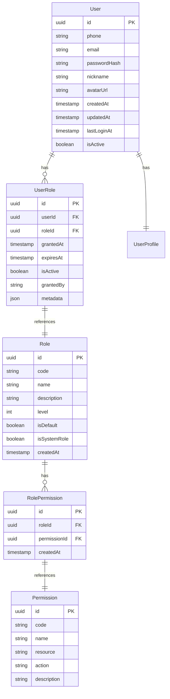

# AI智能营养餐厅系统 - 单账号多角色系统设计

> **文档版本**: 3.0.0  
> **创建日期**: 2025-07-23  
> **文档状态**: ✅ 已统一架构设计  
> **目标受众**: AI编码工具、架构师、开发团队

## 📋 目录

- [1. 系统架构设计](#1-系统架构设计)
- [2. 数据模型设计](#2-数据模型设计)
- [3. 权限控制机制](#3-权限控制机制)
- [4. API设计规范](#4-api设计规范)
- [5. 前端状态管理](#5-前端状态管理)
- [6. 安全策略](#6-安全策略)
- [7. 实施计划](#7-实施计划)

---

## 1. 系统架构设计

### 1.1 单账号多角色架构

```yaml
核心设计原则:
  - 一个用户账号可以拥有多个角色
  - 角色之间可以动态切换
  - 每个角色有独立的权限集合
  - 支持角色升级和降级
  - 角色状态独立管理

角色层次结构:
  基础角色:
    - user: 普通用户（默认角色）
    - premium_user: 高级用户
  
  专业角色:
    - nutritionist: 营养师
    - restaurant_owner: 餐厅老板
    - delivery_partner: 配送合作伙伴
  
  管理角色:
    - admin: 系统管理员
    - super_admin: 超级管理员

角色关系:
  - 用户可以同时拥有：user + nutritionist
  - 用户可以同时拥有：user + restaurant_owner  
  - 管理员角色互斥：admin 和 super_admin 不能同时拥有
  - 所有用户默认拥有 user 角色
```

### 1.2 架构优势

```yaml
业务优势:
  - 用户体验流畅：一个账号多种身份
  - 数据统一管理：营养师也可以是用户
  - 权限精确控制：不同角色不同权限
  - 扩展性强：新角色易于添加

技术优势:
  - 数据一致性：避免多账号数据同步问题
  - 认证简化：一套认证体系
  - 状态管理清晰：角色切换简单
  - 审计完整：用户行为完整追踪
```

---

## 2. 数据模型设计

### 2.1 核心实体关系



### 2.2 数据库表结构

```typescript
// 用户主表 - 统一设计
@Entity('users')
export class User {
  @PrimaryGeneratedColumn('uuid')
  id: string;

  // 基础信息
  @Column({ type: 'varchar', length: 20, unique: true })
  phone: string;

  @Column({ type: 'varchar', length: 255, unique: true, nullable: true })
  email: string;

  @Column({ type: 'varchar', length: 255 })
  passwordHash: string;

  @Column({ type: 'varchar', length: 50 })
  nickname: string;

  @Column({ type: 'varchar', length: 500, nullable: true })
  avatarUrl: string;

  // 状态管理
  @Column({ type: 'boolean', default: true })
  isActive: boolean;

  @Column({ type: 'boolean', default: false })
  isVerified: boolean;

  // 时间戳
  @CreateDateColumn()
  createdAt: Date;

  @UpdateDateColumn()
  updatedAt: Date;

  @Column({ type: 'timestamp', nullable: true })
  lastLoginAt: Date;

  @Column({ type: 'timestamp', nullable: true })
  deletedAt: Date;

  // 关联关系
  @OneToMany(() => UserRole, userRole => userRole.user)
  userRoles: UserRole[];

  @OneToOne(() => UserProfile, profile => profile.user)
  profile: UserProfile;
}

// 角色表
@Entity('roles')
export class Role {
  @PrimaryGeneratedColumn('uuid')
  id: string;

  @Column({ type: 'varchar', length: 50, unique: true })
  code: string; // user, nutritionist, restaurant_owner, admin

  @Column({ type: 'varchar', length: 100 })
  name: string;

  @Column({ type: 'text', nullable: true })
  description: string;

  @Column({ type: 'integer', default: 0 })
  level: number; // 角色级别，用于权限继承

  @Column({ type: 'boolean', default: false })
  isDefault: boolean; // 是否为默认角色

  @Column({ type: 'boolean', default: false })
  isSystemRole: boolean; // 是否为系统角色

  @CreateDateColumn()
  createdAt: Date;

  @OneToMany(() => UserRole, userRole => userRole.role)
  userRoles: UserRole[];

  @OneToMany(() => RolePermission, rolePermission => rolePermission.role)
  rolePermissions: RolePermission[];
}

// 用户角色关联表
@Entity('user_roles')
export class UserRole {
  @PrimaryGeneratedColumn('uuid')
  id: string;

  @Column('uuid')
  userId: string;

  @Column('uuid')
  roleId: string;

  @Column({ type: 'timestamp', default: () => 'CURRENT_TIMESTAMP' })
  grantedAt: Date;

  @Column({ type: 'timestamp', nullable: true })
  expiresAt: Date; // 角色过期时间（如试用期）

  @Column({ type: 'boolean', default: true })
  isActive: boolean;

  @Column({ type: 'varchar', length: 50, nullable: true })
  grantedBy: string; // 谁授予的角色

  @Column({ type: 'json', nullable: true })
  metadata: Record<string, any>; // 角色元数据

  // 关联关系
  @ManyToOne(() => User, user => user.userRoles)
  @JoinColumn({ name: 'userId' })
  user: User;

  @ManyToOne(() => Role, role => role.userRoles)
  @JoinColumn({ name: 'roleId' })
  role: Role;
}

// 权限表
@Entity('permissions')
export class Permission {
  @PrimaryGeneratedColumn('uuid')
  id: string;

  @Column({ type: 'varchar', length: 100, unique: true })
  code: string; // user:read, nutrition:write, admin:delete

  @Column({ type: 'varchar', length: 100 })
  name: string;

  @Column({ type: 'varchar', length: 50 })
  resource: string; // user, nutrition, order, restaurant

  @Column({ type: 'varchar', length: 20 })
  action: string; // create, read, update, delete, manage

  @Column({ type: 'text', nullable: true })
  description: string;

  @CreateDateColumn()
  createdAt: Date;

  @OneToMany(() => RolePermission, rolePermission => rolePermission.permission)
  rolePermissions: RolePermission[];
}

// 角色权限关联表
@Entity('role_permissions')
export class RolePermission {
  @PrimaryGeneratedColumn('uuid')
  id: string;

  @Column('uuid')
  roleId: string;

  @Column('uuid')
  permissionId: string;

  @CreateDateColumn()
  createdAt: Date;

  // 关联关系
  @ManyToOne(() => Role, role => role.rolePermissions)
  @JoinColumn({ name: 'roleId' })
  role: Role;

  @ManyToOne(() => Permission, permission => permission.rolePermissions)
  @JoinColumn({ name: 'permissionId' })
  permission: Permission;
}
```

### 2.3 用户扩展信息表

```typescript
// 用户扩展信息表 - 角色特定信息
@Entity('user_profiles')
export class UserProfile {
  @PrimaryGeneratedColumn('uuid')
  id: string;

  @Column('uuid')
  userId: string;

  // 基础信息
  @Column({ type: 'varchar', length: 20, nullable: true })
  realName: string;

  @Column({ type: 'integer', nullable: true })
  age: number;

  @Column({ type: 'enum', enum: Gender, nullable: true })
  gender: Gender;

  @Column({ type: 'varchar', length: 100, nullable: true })
  city: string;

  // 营养师特定信息
  @Column({ type: 'varchar', length: 100, nullable: true })
  nutritionistLicense: string; // 营养师执照

  @Column({ type: 'integer', nullable: true })
  experienceYears: number; // 从业年限

  @Column({ type: 'varchar', length: 500, nullable: true })
  specialization: string; // 专业领域

  @Column({ type: 'decimal', precision: 3, scale: 2, nullable: true })
  rating: number; // 评分

  // 餐厅老板特定信息
  @Column({ type: 'varchar', length: 200, nullable: true })
  businessLicense: string; // 营业执照

  @Column({ type: 'varchar', length: 200, nullable: true })
  foodServiceLicense: string; // 食品经营许可证

  @Column({ type: 'integer', nullable: true })
  restaurantCount: number; // 旗下餐厅数量

  // 时间戳
  @CreateDateColumn()
  createdAt: Date;

  @UpdateDateColumn()
  updatedAt: Date;

  // 关联关系
  @OneToOne(() => User, user => user.profile)
  @JoinColumn({ name: 'userId' })
  user: User;
}

export enum Gender {
  MALE = 'male',
  FEMALE = 'female',
  OTHER = 'other',
  PREFER_NOT_TO_SAY = 'prefer_not_to_say'
}
```

---

## 3. 权限控制机制

### 3.1 权限设计矩阵

```yaml
权限命名规范:
  格式: "{resource}:{action}"
  示例: "nutrition:read", "restaurant:manage", "user:delete"

核心资源 (Resources):
  - user: 用户管理
  - nutrition: 营养管理
  - restaurant: 餐厅管理
  - order: 订单管理
  - consultation: 咨询管理
  - payment: 支付管理
  - analytics: 数据分析
  - system: 系统管理

操作类型 (Actions):
  - read: 读取
  - write: 写入
  - update: 更新
  - delete: 删除
  - manage: 完全管理
  - approve: 审批

角色权限配置:
  user (普通用户):
    - user:read (自己的信息)
    - nutrition:read (自己的营养信息)
    - nutrition:write (自己的营养信息)
    - order:read (自己的订单)
    - order:write (创建订单)
    - consultation:read (自己的咨询)
    - consultation:write (发起咨询)

  nutritionist (营养师):
    继承 user 权限，额外增加:
    - nutrition:manage (管理营养信息)
    - consultation:manage (管理咨询服务)
    - user:read (查看客户信息)
    - analytics:read (查看营养数据分析)

  restaurant_owner (餐厅老板):
    继承 user 权限，额外增加:
    - restaurant:manage (管理餐厅)
    - order:read (查看餐厅订单)
    - order:update (更新订单状态)
    - analytics:read (查看餐厅数据)
    - nutrition:read (查看菜品营养信息)

  admin (管理员):
    - 所有资源的 read, write, update 权限
    - user:manage (管理用户)
    - system:read (系统监控)

  super_admin (超级管理员):
    - 所有权限
    - system:manage (系统管理)
    - user:delete (删除用户)
```

### 3.2 权限检查机制

```typescript
// 权限装饰器
export function RequirePermissions(...permissions: string[]) {
  return applyDecorators(
    SetMetadata('permissions', permissions),
    UseGuards(PermissionGuard)
  );
}

// 权限守卫
@Injectable()
export class PermissionGuard implements CanActivate {
  constructor(
    private reflector: Reflector,
    private userService: UserService
  ) {}

  async canActivate(context: ExecutionContext): Promise<boolean> {
    const requiredPermissions = this.reflector.get<string[]>(
      'permissions',
      context.getHandler()
    );

    if (!requiredPermissions) {
      return true;
    }

    const request = context.switchToHttp().getRequest();
    const user = request.user;
    
    if (!user) {
      return false;
    }

    // 获取用户当前激活的角色权限
    const userPermissions = await this.userService.getUserPermissions(
      user.id,
      user.currentRole
    );

    // 检查是否拥有所需权限
    return requiredPermissions.every(permission => 
      userPermissions.includes(permission)
    );
  }
}

// 使用示例
@Controller('nutrition')
export class NutritionController {
  @Get(':id')
  @RequirePermissions('nutrition:read')
  async getNutritionProfile(@Param('id') id: string) {
    // 只有拥有 nutrition:read 权限的用户才能访问
  }

  @Post()
  @RequirePermissions('nutrition:write')
  async createNutritionProfile(@Body() data: CreateNutritionProfileDto) {
    // 只有拥有 nutrition:write 权限的用户才能创建
  }

  @Put(':id/approve')
  @RequirePermissions('nutrition:approve')
  async approveNutritionProfile(@Param('id') id: string) {
    // 只有营养师或管理员才能审批
  }
}
```

---

## 4. API设计规范

### 4.1 认证和角色切换API

```yaml
# 用户认证
POST /api/v1/auth/login
请求体:
  phone: string
  password: string
响应:
  accessToken: string
  refreshToken: string
  user: UserInfo
  availableRoles: Role[]
  currentRole: string

# 角色切换
POST /api/v1/auth/switch-role
请求体:
  roleCode: string
响应:
  accessToken: string  # 新的token，包含新角色信息
  currentRole: string
  permissions: string[]

# 获取用户角色
GET /api/v1/users/me/roles
响应:
  roles: [{
    code: string
    name: string
    isActive: boolean
    grantedAt: timestamp
    expiresAt: timestamp
    permissions: string[]
  }]

# 申请角色升级
POST /api/v1/users/me/roles/apply
请求体:
  roleCode: string
  reason: string
  documents: File[]  # 相关证明文件
响应:
  applicationId: string
  status: 'pending' | 'approved' | 'rejected'
```

### 4.2 权限验证中间件

```typescript
// JWT Token 包含角色信息
interface JwtPayload {
  userId: string;
  currentRole: string;
  permissions: string[];
  iat: number;
  exp: number;
}

// 权限验证服务
@Injectable()
export class AuthService {
  constructor(
    private jwtService: JwtService,
    private userService: UserService
  ) {}

  async validateToken(token: string): Promise<JwtPayload> {
    try {
      const payload = this.jwtService.verify(token);
      
      // 验证用户是否仍然拥有该角色
      const userRoles = await this.userService.getUserActiveRoles(payload.userId);
      const hasRole = userRoles.some(role => role.code === payload.currentRole);
      
      if (!hasRole) {
        throw new UnauthorizedException('Role no longer active');
      }
      
      return payload;
    } catch (error) {
      throw new UnauthorizedException('Invalid token');
    }
  }

  async switchUserRole(userId: string, roleCode: string): Promise<string> {
    // 验证用户是否拥有该角色
    const userRole = await this.userService.getUserRole(userId, roleCode);
    if (!userRole || !userRole.isActive) {
      throw new ForbiddenException('Role not available');
    }

    // 获取角色权限
    const permissions = await this.userService.getRolePermissions(roleCode);

    // 生成新的 JWT token
    const payload: JwtPayload = {
      userId,
      currentRole: roleCode,
      permissions: permissions.map(p => p.code),
      iat: Math.floor(Date.now() / 1000),
      exp: Math.floor(Date.now() / 1000) + 3600 * 24 // 24小时
    };

    return this.jwtService.sign(payload);
  }
}
```

---

## 5. 前端状态管理

### 5.1 Riverpod状态管理

```dart
// 用户认证状态
@riverpod
class AuthNotifier extends _$AuthNotifier {
  @override
  AuthState build() {
    return const AuthState.initial();
  }

  Future<void> login(String phone, String password) async {
    state = const AuthState.loading();
    
    try {
      final result = await ref.read(authRepositoryProvider).login(phone, password);
      
      state = AuthState.authenticated(
        user: result.user,
        currentRole: result.currentRole,
        availableRoles: result.availableRoles,
        accessToken: result.accessToken,
      );
      
      // 保存token到安全存储
      await ref.read(secureStorageProvider).setToken(result.accessToken);
    } catch (e) {
      state = AuthState.error(e.toString());
    }
  }

  Future<void> switchRole(String roleCode) async {
    final currentState = state;
    if (currentState is! AuthStateAuthenticated) return;

    try {
      final newToken = await ref.read(authRepositoryProvider).switchRole(roleCode);
      final permissions = await ref.read(authRepositoryProvider).getPermissions(roleCode);
      
      state = currentState.copyWith(
        currentRole: roleCode,
        accessToken: newToken,
        permissions: permissions,
      );
      
      // 更新存储的token
      await ref.read(secureStorageProvider).setToken(newToken);
      
      // 通知其他依赖状态的provider
      ref.invalidate(userProfileProvider);
      ref.invalidate(navigationProvider);
    } catch (e) {
      // 角色切换失败，保持当前状态
      rethrow;
    }
  }

  Future<void> logout() async {
    await ref.read(secureStorageProvider).clearToken();
    state = const AuthState.initial();
  }
}

// 认证状态定义
@freezed
class AuthState with _$AuthState {
  const factory AuthState.initial() = AuthStateInitial;
  const factory AuthState.loading() = AuthStateLoading;
  const factory AuthState.authenticated({
    required User user,
    required String currentRole,
    required List<Role> availableRoles,
    required String accessToken,
    @Default([]) List<String> permissions,
  }) = AuthStateAuthenticated;
  const factory AuthState.error(String message) = AuthStateError;
}

// 用户数据模型
@freezed
class User with _$User {
  const factory User({
    required String id,
    required String phone,
    String? email,
    required String nickname,
    String? avatarUrl,
    required DateTime createdAt,
    DateTime? lastLoginAt,
  }) = _User;

  factory User.fromJson(Map<String, dynamic> json) => _$UserFromJson(json);
}

@freezed
class Role with _$Role {
  const factory Role({
    required String code,
    required String name,
    String? description,
    required bool isActive,
    DateTime? grantedAt,
    DateTime? expiresAt,
    @Default([]) List<String> permissions,
  }) = _Role;

  factory Role.fromJson(Map<String, dynamic> json) => _$RoleFromJson(json);
}
```

### 5.2 权限控制组件

```dart
// 权限控制Widget
class PermissionGuard extends ConsumerWidget {
  final List<String> requiredPermissions;
  final Widget child;
  final Widget? fallback;

  const PermissionGuard({
    Key? key,
    required this.requiredPermissions,
    required this.child,
    this.fallback,
  }) : super(key: key);

  @override
  Widget build(BuildContext context, WidgetRef ref) {
    final authState = ref.watch(authNotifierProvider);
    
    return authState.when(
      initial: () => fallback ?? const SizedBox.shrink(),
      loading: () => fallback ?? const CircularProgressIndicator(),
      authenticated: (user, currentRole, availableRoles, token, permissions) {
        final hasPermission = requiredPermissions.every(
          (permission) => permissions.contains(permission),
        );
        
        return hasPermission ? child : (fallback ?? const SizedBox.shrink());
      },
      error: (_) => fallback ?? const SizedBox.shrink(),
    );
  }
}

// 角色切换Widget
class RoleSwitcher extends ConsumerWidget {
  @override
  Widget build(BuildContext context, WidgetRef ref) {
    final authState = ref.watch(authNotifierProvider);
    
    return authState.maybeWhen(
      authenticated: (user, currentRole, availableRoles, token, permissions) {
        if (availableRoles.length <= 1) {
          return const SizedBox.shrink();
        }
        
        return DropdownButton<String>(
          value: currentRole,
          items: availableRoles.map((role) => 
            DropdownMenuItem(
              value: role.code,
              child: Text(role.name),
            ),
          ).toList(),
          onChanged: (newRole) {
            if (newRole != null && newRole != currentRole) {
              ref.read(authNotifierProvider.notifier).switchRole(newRole);
            }
          },
        );
      },
      orElse: () => const SizedBox.shrink(),
    );
  }
}

// 使用示例
class NutritionPage extends ConsumerWidget {
  @override
  Widget build(BuildContext context, WidgetRef ref) {
    return Scaffold(
      appBar: AppBar(
        title: const Text('营养管理'),
        actions: [
          RoleSwitcher(),
        ],
      ),
      body: Column(
        children: [
          // 普通用户可以查看自己的营养信息
          PermissionGuard(
            requiredPermissions: ['nutrition:read'],
            child: const NutritionProfileCard(),
          ),
          
          // 只有营养师可以管理他人的营养信息
          PermissionGuard(
            requiredPermissions: ['nutrition:manage'],
            child: const NutritionManagementPanel(),
            fallback: const Text('需要营养师权限'),
          ),
        ],
      ),
    );
  }
}
```

---

## 6. 安全策略

### 6.1 角色授权安全

```yaml
角色申请流程:
  1. 用户提交角色申请
  2. 上传相关证明文件
  3. 系统初步验证
  4. 人工审核
  5. 角色激活

安全措施:
  - 身份验证：手机号+身份证验证
  - 资质验证：营养师证书、营业执照等
  - 人工审核：重要角色需要人工审核
  - 角色过期：临时角色设置过期时间
  - 权限最小化：只授予必需的最小权限

审计日志:
  - 角色申请记录
  - 角色切换记录
  - 权限使用记录
  - 敏感操作记录
```

### 6.2 数据访问控制

```typescript
// 行级安全策略
@Injectable()
export class DataAccessService {
  async checkDataAccess(
    userId: string, 
    resourceType: string, 
    resourceId: string, 
    action: string
  ): Promise<boolean> {
    const userRoles = await this.getUserActiveRoles(userId);
    
    // 检查用户是否有权限访问该资源
    switch (resourceType) {
      case 'nutrition_profile':
        return this.checkNutritionProfileAccess(userId, resourceId, action, userRoles);
      case 'order':
        return this.checkOrderAccess(userId, resourceId, action, userRoles);
      case 'restaurant':
        return this.checkRestaurantAccess(userId, resourceId, action, userRoles);
      default:
        return false;
    }
  }

  private async checkNutritionProfileAccess(
    userId: string, 
    profileId: string, 
    action: string, 
    userRoles: UserRole[]
  ): Promise<boolean> {
    const profile = await this.nutritionProfileRepository.findOne({
      where: { id: profileId },
      relations: ['user']
    });

    if (!profile) return false;

    // 用户可以访问自己的营养档案
    if (profile.user.id === userId) {
      return ['read', 'write'].includes(action);
    }

    // 营养师可以管理客户的营养档案
    const isNutritionist = userRoles.some(role => role.role.code === 'nutritionist');
    if (isNutritionist) {
      return ['read', 'write', 'manage'].includes(action);
    }

    // 管理员可以查看所有营养档案
    const isAdmin = userRoles.some(role => ['admin', 'super_admin'].includes(role.role.code));
    if (isAdmin) {
      return true;
    }

    return false;
  }
}
```

---

## 7. 实施计划

### 7.1 迁移策略

```yaml
Phase 1: 数据模型迁移 (1周)
  - 创建新的角色权限表
  - 迁移现有用户数据
  - 建立默认角色和权限
  - 数据一致性验证

Phase 2: 后端API改造 (2周)
  - 实现权限验证中间件
  - 更新认证流程
  - 实现角色切换API
  - API权限控制改造

Phase 3: 前端状态管理 (2周)
  - Riverpod状态管理改造
  - 权限控制组件开发
  - 角色切换界面
  - 权限相关UI组件

Phase 4: 测试和优化 (1周)
  - 单元测试
  - 集成测试
  - 性能测试
  - 安全测试
```

### 7.2 数据迁移脚本

```sql
-- 创建角色和权限基础数据
INSERT INTO roles (id, code, name, description, level, is_default, is_system_role) VALUES
('550e8400-e29b-41d4-a716-446655440001', 'user', '普通用户', '系统默认用户角色', 0, true, true),
('550e8400-e29b-41d4-a716-446655440002', 'nutritionist', '营养师', '专业营养咨询师', 10, false, false),
('550e8400-e29b-41d4-a716-446655440003', 'restaurant_owner', '餐厅老板', '餐厅经营者', 10, false, false),
('550e8400-e29b-41d4-a716-446655440004', 'admin', '管理员', '系统管理员', 90, false, true),
('550e8400-e29b-41d4-a716-446655440005', 'super_admin', '超级管理员', '系统超级管理员', 100, false, true);

-- 迁移现有用户到新的角色系统
INSERT INTO user_roles (user_id, role_id, granted_at, is_active)
SELECT 
  u.id,
  CASE 
    WHEN u.role = 'user' THEN '550e8400-e29b-41d4-a716-446655440001'
    WHEN u.role = 'nutritionist' THEN '550e8400-e29b-41d4-a716-446655440002'
    WHEN u.role = 'restaurant_owner' THEN '550e8400-e29b-41d4-a716-446655440003'
    WHEN u.role = 'admin' THEN '550e8400-e29b-41d4-a716-446655440004'
    ELSE '550e8400-e29b-41d4-a716-446655440001'
  END,
  u.created_at,
  true
FROM users u;

-- 为所有用户添加默认user角色（如果没有的话）
INSERT INTO user_roles (user_id, role_id, granted_at, is_active)
SELECT 
  u.id,
  '550e8400-e29b-41d4-a716-446655440001',
  NOW(),
  true
FROM users u
WHERE NOT EXISTS (
  SELECT 1 FROM user_roles ur 
  WHERE ur.user_id = u.id 
  AND ur.role_id = '550e8400-e29b-41d4-a716-446655440001'
);
```

---

## 总结

本设计文档确立了AI智能营养餐厅系统的**单账号多角色**架构，解决了之前文档中的角色系统设计冲突。

### 核心特点

1. **统一架构**: 一个用户可以拥有多个角色，避免多账号管理复杂性
2. **灵活权限**: 基于RBAC的细粒度权限控制
3. **安全可靠**: 完善的权限验证和审计机制
4. **易于扩展**: 新角色和权限易于添加
5. **用户友好**: 角色切换简单，用户体验良好

### 技术实现

- **后端**: NestJS + TypeORM + PostgreSQL
- **前端**: Flutter + Riverpod 3.0.9
- **认证**: JWT + 权限验证中间件
- **数据库**: PostgreSQL 关系模型 + 行级安全

这个设计为系统提供了坚实的用户角色管理基础，支持业务的灵活发展需求。

---

**文档状态**: ✅ 架构设计完成  
**下一步**: 实施数据模型迁移和API开发