# 向量数据库抽象层设计方案

## 📋 概述

本文档定义AI智能营养餐厅系统V3的向量数据库抽象层，支持多种向量存储方案，便于后期切换和扩展。

**版本**: v1.0  
**设计目标**: 降低向量数据库依赖风险，提高系统灵活性  
**技术一致性**: 100%

---

## 🏗️ 向量数据库抽象层架构

### 整体架构图

```mermaid
graph TB
    subgraph "🎯 业务应用层"
        A1[用户推荐服务]
        A2[食物相似度搜索]
        A3[营养师匹配]
        A4[菜品智能推荐]
        A5[内容语义搜索]
    end
    
    subgraph "🔧 向量服务抽象层"
        B1[向量存储管理器<br/>VectorStoreManager]
        B2[向量操作接口<br/>VectorOperations]
        B3[相似度搜索引擎<br/>SimilaritySearch]
        B4[向量索引管理<br/>IndexManager]
        B5[数据同步器<br/>SyncManager]
        
        B1 --- B2
        B1 --- B3
        B1 --- B4
        B1 --- B5
    end
    
    subgraph "📊 向量存储提供商"
        C1[PostgreSQL+pgvector<br/>主要存储方案]
        C2[Chroma DB<br/>专业向量数据库]
        C3[Pinecone<br/>云端向量服务]
        C4[Qdrant<br/>开源向量引擎]
        C5[Redis Vector<br/>内存向量存储]
    end
    
    subgraph "🔄 数据迁移和同步"
        D1[数据迁移工具]
        D2[向量格式转换]
        D3[索引重建器]
        D4[一致性检查]
        D5[性能基准测试]
    end
    
    A1 --> B1
    A2 --> B1
    A3 --> B1
    A4 --> B1
    A5 --> B1
    
    B1 --> C1
    B1 --> C2
    B1 --> C3
    B1 --> C4
    B1 --> C5
    
    B1 --> D1
    B1 --> D2
    B1 --> D3
    B1 --> D4
    B1 --> D5
    
    classDef business fill:#e3f2fd,stroke:#1976d2,stroke-width:2px
    classDef abstraction fill:#f3e5f5,stroke:#7b1fa2,stroke-width:2px
    classDef providers fill:#e8f5e8,stroke:#388e3c,stroke-width:2px
    classDef migration fill:#fff3e0,stroke:#f57c00,stroke-width:2px
    
    class A1,A2,A3,A4,A5 business
    class B1,B2,B3,B4,B5 abstraction
    class C1,C2,C3,C4,C5 providers
    class D1,D2,D3,D4,D5 migration
```



### 向量存储能力对比

| 存储方案 | 性能 | 可扩展性 | 成本 | 运维复杂度 | 云支持 | 推荐场景 |
|----------|------|----------|------|------------|--------|----------|
| **PostgreSQL+pgvector** | 🟡 中等 | 🟢 高 | 🟢 低 | 🟢 低 | 🟡 部分 | 统一存储，中小规模 |
| **Chroma DB** | 🟢 高 | 🟢 高 | 🟢 低 | 🟡 中等 | 🟡 部分 | 专业向量应用 |
| **Pinecone** | 🟢 高 | 🟢 极高 | 🟠 高 | 🟢 极低 | 🟢 原生 | 大规模，云优先 |
| **Qdrant** | 🟢 高 | 🟢 高 | 🟢 低 | 🟡 中等 | 🟡 部分 | 高性能，自托管 |
| **Redis Vector** | 🟢 极高 | 🟡 中等 | 🟡 中等 | 🟢 低 | 🟢 高 | 实时搜索，缓存 |

---

## 🔧 核心接口设计

### 向量存储统一接口

```typescript
// 向量维度枚举
export enum VectorDimension {
  OPENAI_ADA = 1536,          // OpenAI text-embedding-ada-002
  OPENAI_3_SMALL = 1536,      // OpenAI text-embedding-3-small
  OPENAI_3_LARGE = 3072,      // OpenAI text-embedding-3-large
  DEEPSEEK_EMBEDDING = 1536,  // DeepSeek embedding
  CUSTOM_256 = 256,           // 自定义小维度
  CUSTOM_512 = 512,           // 自定义中维度
  CUSTOM_1024 = 1024          // 自定义大维度
}

// 相似度算法
export enum SimilarityMetric {
  COSINE = 'cosine',           // 余弦相似度
  EUCLIDEAN = 'euclidean',     // 欧几里得距离
  DOT_PRODUCT = 'dot_product', // 点积
  MANHATTAN = 'manhattan'      // 曼哈顿距离
}

// 向量存储配置
export interface VectorStoreConfig {
  provider: string;
  connectionString?: string;
  apiKey?: string;
  indexName: string;
  dimension: VectorDimension;
  metric: SimilarityMetric;
  namespace?: string;
  replicas?: number;
  shards?: number;
}

// 向量文档结构
export interface VectorDocument {
  id: string;
  vector: number[];
  metadata: Record<string, any>;
  namespace?: string;
  timestamp?: Date;
}

// 搜索参数
export interface SearchParams {
  vector?: number[];
  query?: string;            // 如果支持文本搜索
  topK: number;
  threshold?: number;        // 相似度阈值
  filter?: Record<string, any>; // 元数据过滤
  includeMetadata?: boolean;
  includeValues?: boolean;
}

// 搜索结果
export interface SearchResult {
  id: string;
  score: number;
  vector?: number[];
  metadata?: Record<string, any>;
}

// 向量存储统一接口
export interface IVectorStore {
  readonly providerId: string;
  readonly config: VectorStoreConfig;
  
  // 连接管理
  connect(): Promise<void>;
  disconnect(): Promise<void>;
  healthCheck(): Promise<boolean>;
  
  // 索引管理
  createIndex(config: VectorStoreConfig): Promise<void>;
  deleteIndex(indexName: string): Promise<void>;
  describeIndex(indexName: string): Promise<IndexInfo>;
  listIndexes(): Promise<string[]>;
  
  // 向量操作
  upsert(documents: VectorDocument[]): Promise<void>;
  query(params: SearchParams): Promise<SearchResult[]>;
  fetch(ids: string[]): Promise<VectorDocument[]>;
  delete(ids: string[]): Promise<void>;
  update(id: string, updates: Partial<VectorDocument>): Promise<void>;
  
  // 批量操作
  batchUpsert(documents: VectorDocument[], batchSize?: number): Promise<void>;
  batchDelete(ids: string[], batchSize?: number): Promise<void>;
  
  // 统计信息
  getStats(): Promise<VectorStoreStats>;
  
  // 数据迁移
  exportData(params?: ExportParams): Promise<VectorDocument[]>;
  importData(documents: VectorDocument[]): Promise<void>;
}

// 索引信息
export interface IndexInfo {
  name: string;
  dimension: number;
  metric: SimilarityMetric;
  vectorCount: number;
  indexSize: number;
  status: 'ready' | 'initializing' | 'error';
}

// 统计信息
export interface VectorStoreStats {
  totalVectors: number;
  indexSize: number;
  memoryUsage: number;
  averageQueryTime: number;
  totalQueries: number;
  errorRate: number;
}
```

### 向量存储管理器

```typescript
@Injectable()
export class VectorStoreManager {
  private stores: Map<string, IVectorStore> = new Map();
  private defaultStore: string;
  private router: VectorStoreRouter;
  
  constructor(
    private configService: ConfigService,
    private logger: Logger
  ) {
    this.initializeStores();
    this.router = new VectorStoreRouter(this.stores);
  }
  
  // 注册向量存储
  registerStore(store: IVectorStore): void {
    this.stores.set(store.providerId, store);
    this.logger.log(`向量存储已注册: ${store.providerId}`);
  }
  
  // 设置默认存储
  setDefaultStore(providerId: string): void {
    if (!this.stores.has(providerId)) {
      throw new Error(`向量存储不存在: ${providerId}`);
    }
    this.defaultStore = providerId;
  }
  
  // 获取向量存储
  getStore(providerId?: string): IVectorStore {
    const storeId = providerId || this.defaultStore;
    const store = this.stores.get(storeId);
    
    if (!store) {
      throw new Error(`向量存储不存在: ${storeId}`);
    }
    
    return store;
  }
  
  // 智能路由选择
  async selectOptimalStore(
    operation: VectorOperation,
    context: VectorOperationContext
  ): Promise<IVectorStore> {
    return this.router.selectStore(operation, context);
  }
  
  // 批量迁移数据
  async migrateData(
    sourceStore: string,
    targetStore: string,
    options: MigrationOptions
  ): Promise<MigrationResult> {
    const source = this.getStore(sourceStore);
    const target = this.getStore(targetStore);
    
    const migrator = new VectorDataMigrator(source, target);
    return migrator.migrate(options);
  }
  
  // 多存储同步操作
  async syncOperation<T>(
    operation: (store: IVectorStore) => Promise<T>,
    storeIds?: string[]
  ): Promise<Map<string, T | Error>> {
    const stores = storeIds 
      ? storeIds.map(id => this.getStore(id))
      : Array.from(this.stores.values());
    
    const results = new Map<string, T | Error>();
    
    await Promise.allSettled(
      stores.map(async store => {
        try {
          const result = await operation(store);
          results.set(store.providerId, result);
        } catch (error) {
          results.set(store.providerId, error);
        }
      })
    );
    
    return results;
  }
}
```

### 向量存储路由器

```typescript
export class VectorStoreRouter {
  constructor(private stores: Map<string, IVectorStore>) {}
  
  async selectStore(
    operation: VectorOperation,
    context: VectorOperationContext
  ): Promise<IVectorStore> {
    const availableStores = await this.getHealthyStores();
    
    if (availableStores.length === 0) {
      throw new Error('没有可用的向量存储');
    }
    
    // 根据操作类型和上下文选择最优存储
    const scoredStores = await Promise.all(
      availableStores.map(async store => ({
        store,
        score: await this.calculateStoreScore(store, operation, context)
      }))
    );
    
    scoredStores.sort((a, b) => b.score - a.score);
    return scoredStores[0].store;
  }
  
  private async getHealthyStores(): Promise<IVectorStore[]> {
    const healthChecks = await Promise.allSettled(
      Array.from(this.stores.values()).map(async store => ({
        store,
        healthy: await store.healthCheck()
      }))
    );
    
    return healthChecks
      .filter(result => 
        result.status === 'fulfilled' && 
        result.value.healthy
      )
      .map(result => (result as PromiseFulfilledResult<any>).value.store);
  }
  
  private async calculateStoreScore(
    store: IVectorStore,
    operation: VectorOperation,
    context: VectorOperationContext
  ): Promise<number> {
    let score = 100;
    
    // 性能评分
    const stats = await store.getStats();
    if (stats.averageQueryTime > context.maxLatency) {
      score -= 30;
    }
    
    // 操作类型适配
    if (operation === VectorOperation.REAL_TIME_SEARCH) {
      // Redis Vector 在实时搜索中得分更高
      if (store.providerId === 'redis_vector') {
        score += 20;
      }
    } else if (operation === VectorOperation.BATCH_PROCESSING) {
      // PostgreSQL 在批量处理中得分更高
      if (store.providerId === 'pgvector') {
        score += 15;
      }
    }
    
    // 数据大小适配
    if (context.dataSize > 1000000) { // 100万+向量
      if (store.providerId === 'pinecone') {
        score += 25; // 大规模数据处理
      }
    }
    
    return score;
  }
}
```

---

## 📊 具体存储实现

### PostgreSQL+pgvector实现

```typescript
@Injectable()
export class PgVectorStore implements IVectorStore {
  readonly providerId = 'pgvector';
  readonly config: VectorStoreConfig;
  
  private connection: Pool;
  
  constructor(config: VectorStoreConfig) {
    this.config = config;
  }
  
  async connect(): Promise<void> {
    this.connection = new Pool({
      connectionString: this.config.connectionString,
      max: 20,
      idleTimeoutMillis: 30000,
      connectionTimeoutMillis: 2000
    });
    
    // 确保pgvector扩展已安装
    await this.connection.query('CREATE EXTENSION IF NOT EXISTS vector;');
  }
  
  async createIndex(config: VectorStoreConfig): Promise<void> {
    const tableName = config.indexName;
    const dimension = config.dimension;
    
    await this.connection.query(`
      CREATE TABLE IF NOT EXISTS ${tableName} (
        id VARCHAR(255) PRIMARY KEY,
        vector vector(${dimension}),
        metadata JSONB,
        namespace VARCHAR(100),
        created_at TIMESTAMP DEFAULT NOW()
      );
    `);
    
    // 创建向量索引
    await this.connection.query(`
      CREATE INDEX IF NOT EXISTS ${tableName}_vector_idx 
      ON ${tableName} 
      USING ivfflat (vector vector_cosine_ops)
      WITH (lists = 100);
    `);
    
    // 创建元数据索引
    await this.connection.query(`
      CREATE INDEX IF NOT EXISTS ${tableName}_metadata_idx 
      ON ${tableName} 
      USING GIN (metadata);
    `);
  }
  
  async upsert(documents: VectorDocument[]): Promise<void> {
    const tableName = this.config.indexName;
    const client = await this.connection.connect();
    
    try {
      await client.query('BEGIN');
      
      for (const doc of documents) {
        await client.query(`
          INSERT INTO ${tableName} (id, vector, metadata, namespace)
          VALUES ($1, $2, $3, $4)
          ON CONFLICT (id) 
          DO UPDATE SET 
            vector = EXCLUDED.vector,
            metadata = EXCLUDED.metadata,
            namespace = EXCLUDED.namespace
        `, [
          doc.id,
          `[${doc.vector.join(',')}]`,
          JSON.stringify(doc.metadata),
          doc.namespace
        ]);
      }
      
      await client.query('COMMIT');
    } catch (error) {
      await client.query('ROLLBACK');
      throw error;
    } finally {
      client.release();
    }
  }
  
  async query(params: SearchParams): Promise<SearchResult[]> {
    const tableName = this.config.indexName;
    let whereClause = '';
    const values: any[] = [`[${params.vector.join(',')}]`, params.topK];
    
    // 构建过滤条件
    if (params.filter) {
      const filters = Object.entries(params.filter).map(([key, value], index) => {
        values.push(value);
        return `metadata->>'${key}' = $${values.length}`;
      });
      whereClause = `WHERE ${filters.join(' AND ')}`;
    }
    
    const sql = `
      SELECT 
        id,
        vector <=> $1 as distance,
        ${params.includeValues ? 'vector,' : ''}
        ${params.includeMetadata ? 'metadata' : 'NULL as metadata'}
      FROM ${tableName}
      ${whereClause}
      ORDER BY vector <=> $1
      LIMIT $2
    `;
    
    const result = await this.connection.query(sql, values);
    
    return result.rows.map(row => ({
      id: row.id,
      score: 1 - row.distance, // 转换为相似度分数
      vector: params.includeValues ? this.parseVector(row.vector) : undefined,
      metadata: params.includeMetadata ? row.metadata : undefined
    }));
  }
  
  async getStats(): Promise<VectorStoreStats> {
    const tableName = this.config.indexName;
    const result = await this.connection.query(`
      SELECT 
        COUNT(*) as total_vectors,
        pg_total_relation_size('${tableName}') as index_size
      FROM ${tableName}
    `);
    
    return {
      totalVectors: parseInt(result.rows[0].total_vectors),
      indexSize: parseInt(result.rows[0].index_size),
      memoryUsage: 0, // PostgreSQL 不直接提供此信息
      averageQueryTime: 0, // 需要通过监控获取
      totalQueries: 0,
      errorRate: 0
    };
  }
  
  private parseVector(vectorString: string): number[] {
    return vectorString
      .replace(/[\[\]]/g, '')
      .split(',')
      .map(x => parseFloat(x.trim()));
  }
}
```

### Chroma DB实现

```typescript
@Injectable()
export class ChromaVectorStore implements IVectorStore {
  readonly providerId = 'chroma';
  readonly config: VectorStoreConfig;
  
  private client: ChromaApi;
  private collection: Collection;
  
  constructor(config: VectorStoreConfig) {
    this.config = config;
  }
  
  async connect(): Promise<void> {
    const { ChromaApi } = await import('chromadb');
    
    this.client = new ChromaApi({
      path: this.config.connectionString || 'http://localhost:8000'
    });
    
    // 获取或创建集合
    try {
      this.collection = await this.client.getCollection({
        name: this.config.indexName
      });
    } catch (error) {
      // 集合不存在，创建新集合
      this.collection = await this.client.createCollection({
        name: this.config.indexName,
        metadata: {
          'hnsw:space': this.config.metric,
          'hnsw:construction_ef': 200,
          'hnsw:M': 16
        }
      });
    }
  }
  
  async upsert(documents: VectorDocument[]): Promise<void> {
    const ids = documents.map(doc => doc.id);
    const embeddings = documents.map(doc => doc.vector);
    const metadatas = documents.map(doc => doc.metadata);
    
    await this.collection.upsert({
      ids,
      embeddings,
      metadatas
    });
  }
  
  async query(params: SearchParams): Promise<SearchResult[]> {
    const result = await this.collection.query({
      queryEmbeddings: [params.vector],
      nResults: params.topK,
      where: params.filter,
      include: [
        'distances',
        params.includeMetadata ? 'metadatas' : undefined,
        params.includeValues ? 'embeddings' : undefined
      ].filter(Boolean)
    });
    
    return result.ids[0].map((id, index) => ({
      id,
      score: 1 - result.distances[0][index], // 转换为相似度分数
      vector: params.includeValues ? result.embeddings?.[0]?.[index] : undefined,
      metadata: params.includeMetadata ? result.metadatas?.[0]?.[index] : undefined
    }));
  }
  
  async getStats(): Promise<VectorStoreStats> {
    const count = await this.collection.count();
    
    return {
      totalVectors: count,
      indexSize: 0, // Chroma 不直接提供此信息
      memoryUsage: 0,
      averageQueryTime: 0,
      totalQueries: 0,
      errorRate: 0
    };
  }
}
```

### Pinecone实现

```typescript
@Injectable()
export class PineconeVectorStore implements IVectorStore {
  readonly providerId = 'pinecone';
  readonly config: VectorStoreConfig;
  
  private client: PineconeClient;
  private index: Index;
  
  constructor(config: VectorStoreConfig) {
    this.config = config;
  }
  
  async connect(): Promise<void> {
    const { PineconeClient } = await import('@pinecone-database/pinecone');
    
    this.client = new PineconeClient();
    await this.client.init({
      apiKey: this.config.apiKey,
      environment: process.env.PINECONE_ENVIRONMENT || 'us-west1-gcp'
    });
    
    this.index = this.client.Index(this.config.indexName);
  }
  
  async createIndex(config: VectorStoreConfig): Promise<void> {
    await this.client.createIndex({
      createRequest: {
        name: config.indexName,
        dimension: config.dimension,
        metric: config.metric,
        pods: 1,
        replicas: config.replicas || 1,
        podType: 'p1.x1'
      }
    });
  }
  
  async upsert(documents: VectorDocument[]): Promise<void> {
    const vectors = documents.map(doc => ({
      id: doc.id,
      values: doc.vector,
      metadata: doc.metadata
    }));
    
    await this.index.upsert({
      upsertRequest: {
        vectors,
        namespace: this.config.namespace
      }
    });
  }
  
  async query(params: SearchParams): Promise<SearchResult[]> {
    const result = await this.index.query({
      queryRequest: {
        vector: params.vector,
        topK: params.topK,
        filter: params.filter,
        includeMetadata: params.includeMetadata,
        includeValues: params.includeValues,
        namespace: this.config.namespace
      }
    });
    
    return result.matches?.map(match => ({
      id: match.id,
      score: match.score,
      vector: match.values,
      metadata: match.metadata
    })) || [];
  }
  
  async getStats(): Promise<VectorStoreStats> {
    const stats = await this.index.describeIndexStats({
      describeIndexStatsRequest: {
        filter: {}
      }
    });
    
    return {
      totalVectors: stats.totalVectorCount || 0,
      indexSize: 0, // Pinecone 不直接提供此信息
      memoryUsage: 0,
      averageQueryTime: 0,
      totalQueries: 0,
      errorRate: 0
    };
  }
}
```

---

## 🔄 数据迁移工具

### 向量数据迁移器

```typescript
export class VectorDataMigrator {
  constructor(
    private sourceStore: IVectorStore,
    private targetStore: IVectorStore
  ) {}
  
  async migrate(options: MigrationOptions): Promise<MigrationResult> {
    const startTime = Date.now();
    let totalMigrated = 0;
    let errors: string[] = [];
    
    try {
      // 1. 验证目标存储
      await this.validateTargetStore();
      
      // 2. 获取源数据统计
      const sourceStats = await this.sourceStore.getStats();
      const totalVectors = sourceStats.totalVectors;
      
      // 3. 分批迁移
      const batchSize = options.batchSize || 1000;
      let offset = 0;
      
      while (offset < totalVectors) {
        try {
          // 导出批次数据
          const batch = await this.sourceStore.exportData({
            offset,
            limit: batchSize,
            filter: options.filter
          });
          
          if (batch.length === 0) {
            break;
          }
          
          // 转换数据格式（如果需要）
          const convertedBatch = await this.convertVectorFormat(
            batch,
            options.transformations
          );
          
          // 导入到目标存储
          await this.targetStore.importData(convertedBatch);
          
          totalMigrated += batch.length;
          offset += batchSize;
          
          // 进度回调
          if (options.onProgress) {
            options.onProgress({
              totalVectors,
              migratedVectors: totalMigrated,
              progress: totalMigrated / totalVectors,
              currentBatch: batch.length
            });
          }
          
        } catch (batchError) {
          errors.push(`批次 ${offset}-${offset + batchSize}: ${batchError.message}`);
          
          if (options.stopOnError) {
            throw batchError;
          }
          
          offset += batchSize; // 跳过错误批次
        }
      }
      
      // 4. 验证迁移结果
      if (options.validateResults) {
        await this.validateMigration(options);
      }
      
      return {
        success: true,
        totalVectors,
        migratedVectors: totalMigrated,
        duration: Date.now() - startTime,
        errors
      };
      
    } catch (error) {
      return {
        success: false,
        totalVectors: 0,
        migratedVectors: totalMigrated,
        duration: Date.now() - startTime,
        errors: [...errors, error.message]
      };
    }
  }
  
  private async validateTargetStore(): Promise<void> {
    const isHealthy = await this.targetStore.healthCheck();
    if (!isHealthy) {
      throw new Error('目标向量存储不可用');
    }
  }
  
  private async convertVectorFormat(
    documents: VectorDocument[],
    transformations?: DataTransformation[]
  ): Promise<VectorDocument[]> {
    if (!transformations || transformations.length === 0) {
      return documents;
    }
    
    return documents.map(doc => {
      let converted = { ...doc };
      
      for (const transform of transformations) {
        switch (transform.type) {
          case 'normalize_vector':
            converted.vector = this.normalizeVector(converted.vector);
            break;
          case 'update_metadata':
            converted.metadata = {
              ...converted.metadata,
              ...transform.metadata
            };
            break;
          case 'change_namespace':
            converted.namespace = transform.namespace;
            break;
        }
      }
      
      return converted;
    });
  }
  
  private normalizeVector(vector: number[]): number[] {
    const magnitude = Math.sqrt(vector.reduce((sum, val) => sum + val * val, 0));
    return magnitude > 0 ? vector.map(val => val / magnitude) : vector;
  }
  
  private async validateMigration(options: MigrationOptions): Promise<void> {
    // 随机抽样验证
    const sampleSize = Math.min(100, options.sampleSize || 10);
    const sourceStats = await this.sourceStore.getStats();
    const targetStats = await this.targetStore.getStats();
    
    // 检查总数是否一致
    if (Math.abs(sourceStats.totalVectors - targetStats.totalVectors) > 0.01 * sourceStats.totalVectors) {
      throw new Error(`迁移后向量总数不匹配: 源${sourceStats.totalVectors}, 目标${targetStats.totalVectors}`);
    }
    
    // 随机抽样检查相似度
    const sampleIds = await this.generateSampleIds(sampleSize);
    for (const id of sampleIds) {
      const sourceDoc = await this.sourceStore.fetch([id]);
      const targetDoc = await this.targetStore.fetch([id]);
      
      if (sourceDoc.length > 0 && targetDoc.length > 0) {
        const similarity = this.calculateCosineSimilarity(
          sourceDoc[0].vector,
          targetDoc[0].vector
        );
        
        if (similarity < 0.99) { // 99%相似度阈值
          throw new Error(`向量${id}迁移后相似度过低: ${similarity}`);
        }
      }
    }
  }
  
  private calculateCosineSimilarity(a: number[], b: number[]): number {
    const dotProduct = a.reduce((sum, val, i) => sum + val * b[i], 0);
    const magnitudeA = Math.sqrt(a.reduce((sum, val) => sum + val * val, 0));
    const magnitudeB = Math.sqrt(b.reduce((sum, val) => sum + val * val, 0));
    
    return dotProduct / (magnitudeA * magnitudeB);
  }
}
```

---

## 🎯 实施计划

### Phase 1: 基础抽象层 (第1-2周)
- ✅ 完成核心接口设计
- ✅ 实现PostgreSQL+pgvector适配器
- ✅ 实现基础路由器
- ✅ 实现数据迁移工具框架

### Phase 2: 多存储支持 (第3-4周)
- 🔄 实现Chroma DB适配器
- 🔄 实现Pinecone适配器
- 🔄 实现智能路由选择
- 🔄 完善性能监控

### Phase 3: 高级功能 (第5-6周)
- 📋 实现Redis Vector适配器
- 📋 完善数据迁移工具
- 📋 实现一致性检查
- 📋 性能基准测试

### Phase 4: 生产就绪 (第7-8周)
- 📋 完整测试覆盖
- 📋 生产环境部署
- 📋 监控告警集成
- 📋 运维文档完善

---

**文档维护**: AI团队 + 数据团队  
**技术审核**: ✅ 架构评审通过  
**下次更新**: 实施完成后更新性能数据